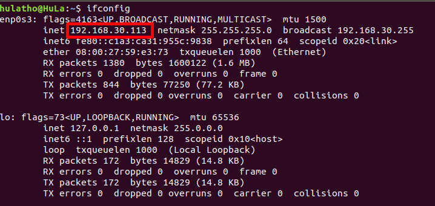
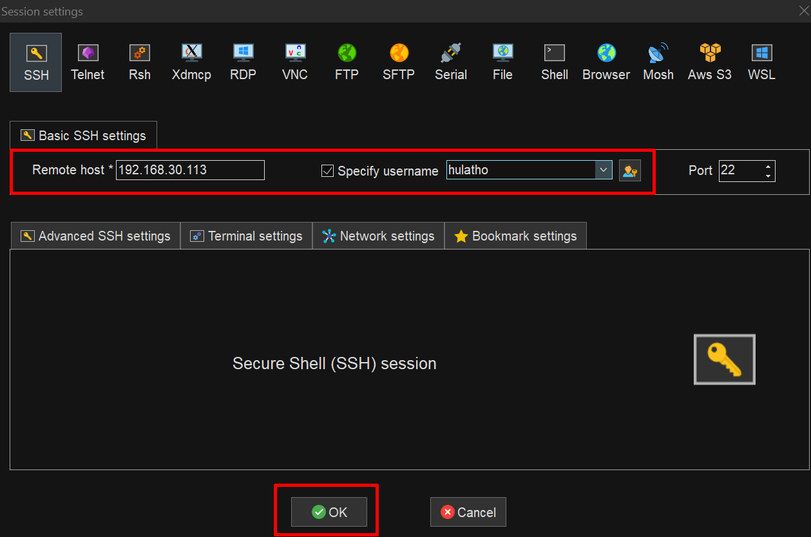

# Phần 1: Install VMware Workstation, Ubuntu, MobaXterm

## 0. Bàn luận về các cách để có được 1 môi trường Ubuntu
Hiện tại mình biết 3 cách để có được môi trường Ubuntu, ở phần này chúng ta cùng phân tích về 3 cách nhé:
- Cách 1: Dùng VitualBox để cài Ubuntu.
    + Cái này lúc cài Ubuntu chúng ta phải phân bổ dung lượng ổ ứng, RAM và core cho máy ubuntu. Nghĩa là chúng ta phải chia sức mạnh máy tính thành 2 phần, phần 1 dùng cho máy tính còn phần 2 dùng cho Ubuntu.
    + Bị giới hạn RAM, Core. Nếu chúng ta để trên 50% số RAM, Core thì Ubuntu đã cảnh báo rồi.

- Cách 2: Dùng WSL (Windows Subsystem for Linux).
    + WSL là một tính năng của Windows cho phép bạn chạy môi trường Linux trên máy tính Windows mà không cần máy ảo hay cài đặt song song.
    + Nghĩa là nó có thể dùng chung Core và Ram với máy tính luôn. Điều này giúp linh hoạt hơn trong việc sử dụng sức mạnh của máy tính.
    + Share folder giữa WSL và Windows là /mnt/c
    
- Cách 3: Dùng docker để tạo image và container Ubuntu.
    + Ta có thể tạo ra nhiều container tương ứng với nhiều Ubuntu và có thể chạy song song cùng lúc nhiều Ubuntu. 
    + Mạnh khi dùng trên máy Host đang chạy hệ điều hành Linux.

## 1. Install VMware
- Để có thể cài đặt 1 máy ubuntu chúng ta cần có môi trường để cài đặt nó. Có nhiều công cụ chúng ta có thể sử dụng như Oracle VitualBox, Vmware Workstation. Ở đây mình recommend dùng Vmware Workstation.
- Link video hướng dẫn: [Video](https://youtu.be/6gKA3wUI3kc?si=bXfVC-MU2VtzT8dA)
- Link cài đặt: [VMware Workstation 17](https://drive.google.com/file/d/1yk2tW62MPs5OfgQMPB2oWdOHMVwouF3E/view?usp=drivesdk)
- Link key active VMware Workstation 17: [Active Key](https://drive.google.com/file/d/1JcVd4W4M2n6gEAGVWtc1Y5mbNNsa2lVn/view?usp=drivesdk)

## 2. Install Ubuntu
- Sau khi đã có VMware Workstation, chúng ta đi cài đặt 1 máy ảo trên đó. Tuy nhiên trước khi cài chúng ta cần chuẩn bị 1 file ubuntu ISO. Các bạn có thể cài ubuntu version 22.04.5 luôn, tuy nhiên với con board Myir IMX8MM thì yêu cầu dùng Ubuntu version 18.04.6 nên mình sẽ đính kèm cả 2 version ở bên dưới. Với các bài chưa dùng tới board(trước bài build yocto) thì các bạn có thể dùng version 22.04.5 nhé. Ở repo bài biết này mình sẽ dùng ubuntu version 18.04.6 để đỡ phải cài nhiều lần.
- Link video hướng dẫn: [Video](https://youtu.be/6gKA3wUI3kc?si=bXfVC-MU2VtzT8dA)
- Link ubuntu 22.04.5: [Link](https://drive.google.com/file/d/1fyt4MCjwr0pUXEbYOspAW8q2czW_IteU/view?usp=drivesdk)
- Link ubuntu 18.04.6: [Link](https://drive.google.com/file/d/1puSIXdxvpS_CyCZzL6LaXu3PR8xfeamR/view?usp=drivesdk)
- **NOTE**: Ở đây mình sẽ để username là ***hulatho***

## 3. Install MobaXterm
- Vì máy Ubuntu sẽ chiếm rất nhiều RAM và khá nặng, nên với máy nào yếu thì việc sử dụng terminal trên VitualBox sẽ rất lag và khó khăn, vì lý do trên mình recommend dùng MobaXterm để ssh tới VitualBox. Sau này tất cả tương tác với VitualBox chúng ta sẽ dùng trên MobaXterm hết.
- Link video hướng dẫn: [Video](https://youtu.be/jmSgIrVIFAo?si=FPHLVD7_sQp94Fgd)

### 3.1. Cách ssh từ MobaXterm đến VitualBox
- Chúng ta thực hiện trên terminal của máy VitualBox trước:
```bash
sudo apt install openssh-server
sudo apt install net-tools
ifconfig
```
- Sau khi gõ ifconfig, trên terminal sẽ hiển thị IP của máy Ubuntu. Chúng ta sẽ copy nó + username là ***hulatho*** để qua MobaXterm thực hiện ssh tới VitualBox.





- Chúng ta mở MobaXterm lên và chọn 👉 Session 👉 SSH 👉 Nhập IP 👉 Username sau đó click OK.





✅ Vậy là chúng ta đã kết nối ssh từ MobaXterm đến máy Ubuntu của chúng ta. 💯
