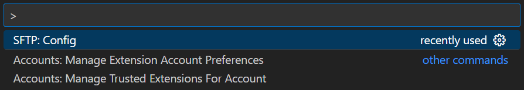
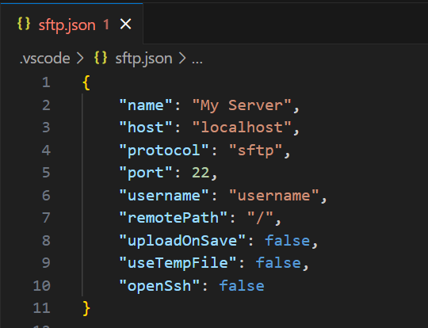
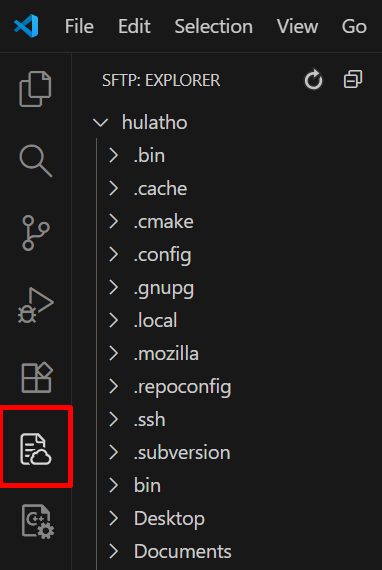
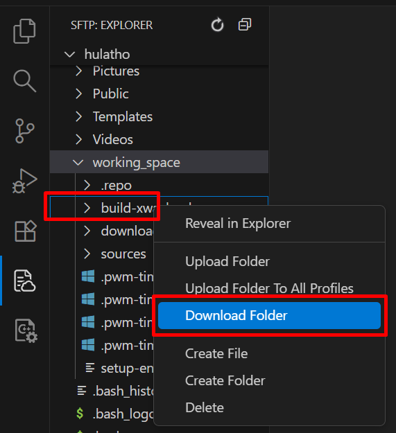
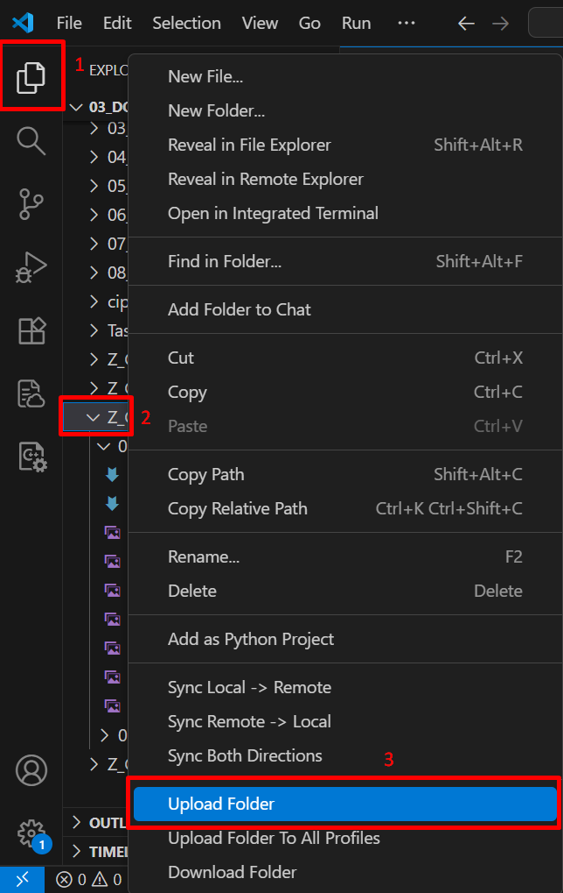

# Part 2: Use SFTP on VScode to edit souce code 💚

> Warning: This page is translated by MACHINE, which may lead to POOR QUALITY or INCORRECT INFORMATION, please read with CAUTION!


## Steps
- Open VScode and go to Extensions
- Search for SFTP and install as shown below


- Open a folder on VScode
- Click ***Ctrl+Shift+p*** and select ***SFTP config***



- At this point, we will see that Vscode automatically creates a file ***.vscode/sftp.json*** with content as shown below



- At this point, we will replace the above content as below:
```bash
{
     "name": "hulatho",
     "host": "192.168.30.113",
     "protocol": "sftp",
     "port": 22,
     "username": "hulatho",
     "remotePath": "/home/hulatho",
     "uploadOnSave": true,
     "openSsh": true,
     "password": "1",
     "useTempFile": false
}
```

- Explanation of the parameters above:
+***name***: Name of the virtual machine
+***host***: IP address of the virtual machine
+***username***: User name
+***remotePath***: The path I want to link to the virtual machine
+***password***: Password of virtual machine

- After completing the above step, an additional tab will be displayed on the toolbar, sftp. If we switch to that tab, we can see the contents of the folder ***remotePath***



### Get code from virtual machine to personal computer
- Switch to the sftp tab, when you want to retrieve any folder, just right-click on that folder and click ***download***


### Upload code from personal computer to virtual machine
- Switch to the Explorer tab and then which folder do you want to push up ***remotePath*** of a virtual machine, we just need to right-click on that folder and select ***Upload folder***

<br><br>

✅ So in this article we know how to use VScode to retrieve source code as well as push the source code to a virtual machine and edit the code. 💯