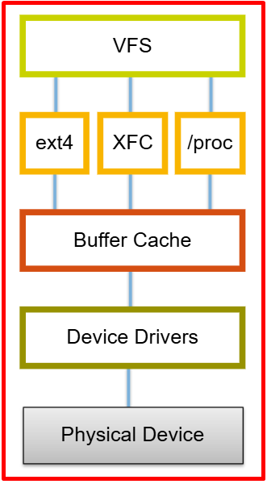
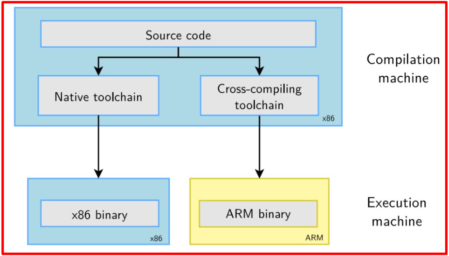
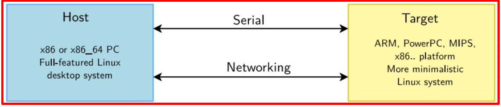
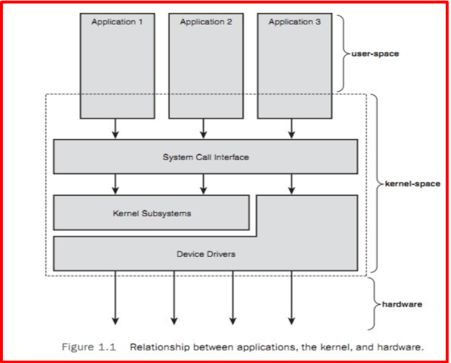
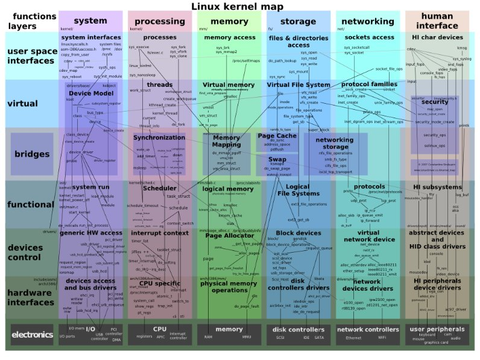
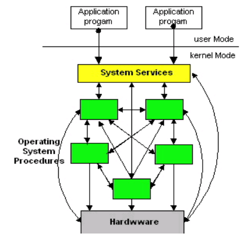

# 💚 Part 4 Linux Introduction 💛

> Warning: This page is translated by MACHINE, which may lead to POOR QUALITY or INCORRECT INFORMATION, please read with CAUTION!


## 👉 Introduction and Summary
### 1️⃣ Introduction
After you have installed the software, read the articles ([01_Install_Tools](./01_Install_Tools.md),[02_SFTP_VScode](./02_SFTP_VScode.md),[03_Command_and_Edit_File](./03_Command_and_Edit_File.md)) then we are already familiar with the interface and can do basic operations in Ubuntu. Next we will come to the main article ***Linux Introduction*** ok 😉. In this article we will get acquainted with the main concepts and elements in linux programming BSP (Board Support Package).
### 2️⃣ Summary
The content of the article includes the following parts:
- - [I. Introduction and Summary](#👉-introduction-and-summary) 
       - [1. Introduction](#1️⃣-introduction) 
       - [2. Summary](#2️⃣-summary) 
- - [II. Contents](#👉-contents) 
       - [1. The concept of freedom](#1️⃣-khái-niệm-freedom) 
       - [2. What is OS?](#2️⃣-os-là-gì?) 
       - [3. Unix family](#3️⃣-họ-unix) 
       - [4. Unix family OS architecture](#4️⃣-kiến-trúc-os-họ-unix) 
       - [5. Distinguish between program and process](#5️⃣-phân-biệt-chương-trình-và-tiến-trình) 
       - [6. Multitasking](#6️⃣-đa-nhiệm) 
       - [7. Types of core Arms and common jobs](#7️⃣-các-loại-core-arm-và-công-việc-hay-làm) 
       - [8. Embedded Linux BSP suite](#8️⃣-bộ-bsp-của-embedded-linux) 
       - [9. Run program c](#9️⃣-chạy-chương-trình-c) 
- - [III. Conclusion](#✔️-conclusion) 
- - [IV. Exercise](#💯-exercise) 
- - [V. NOTE](#📺-note) 
- - [VI. Reference](#📌-reference) 

## 👉 Contents
### 1️⃣ Concept of freedom
First, let's learn about the concept of freedom. A program is considered free when the program's license provides all users with the following 4 freedoms:
- Freedom to run that program for any purpose.
- Freedom to research and change the program.
- Freedom to redistribute copies of the program.
- Freedom to distribute copies of modified versions.

These freedoms are provided for both commercial and non-commercial purposes. This means that the program's source code can be modified and distributed to customers.


### 2️⃣ What is OS?

 ***Computer software:***

Computer software can be divided into two types:
- System software: Used to manage the operation of the computer itself
- Application programs: Used to resolve user requests

The most important part of system programs is the OS. The basic function is to control all resources, provide functions, and system services on which application programs are written to be used. Model a computer as follows:

   

We can see that in the OS will be the kernel, the kernel supports the OS in performing the function of managing the following components:
+ 1.Devices: create a communication to user programs "nói chuyện" with device
+ 2. Memory: allocates memory for running programs (processes).
+ 3. Processes: create and monitor the activities of processes
+ 4. Communication between Processes

A computer has many things such as CPU(s), memory, peripheral devices... forming a very complex system, writing programs to combine them optimally is very laborious and complicated. If these things are left accessible to users, it will lead to possible risks. Thus, it is necessary to separate the user from the complexity of the hardware. The way to do it is to put the hardware layer last and then stack the software layer on top. Layer software will manage all parts of the computer and give interfaces to the user to program the application layer.

From here we will have 2 modes as follows:
- Kernel mode or supervisor mode:
+ This mode is supported by the CPU architecture, and it prevents users from accessing the hardware.
+ Kernel refers to the most essential part of system programs, it controls files, starts and runs application programs, and divides CPU usage time for programs, allocating memory and other resources to user programs. The kernel itself doesn't do much but provides primitive functions on which other utilities and other OS services are built.

- User mode: System programs and applications that use OS services run in user mode. However, the difference is that application programs take advantage of system utilities, while system programs are necessary for the computer to run. Application programs run in user mode, primitive functions run in the kernel. The connection between these two run modes is done by system call (***system call***).


Summary of main features:

- OS is the abbreviation for Operating System

- Is a program that manages all elements such as hardware and software of the computer

- The OS is the first program to be run, it owns and has full decision-making authority over other components of the system such as Scheduling, memory management, file system,...

- Main functions of OS:
+ Is a protective shell for the system's hardware: To put it simply, the system's hardware is like the egg yolk. To interact directly with them, the programmer must be careful and understand the hardware. However, when there is an operating system, that will no longer be necessary. The operating system will create an eggshell around the entire hardware. At this time, instead of interacting with the hardware, the programmer will interact with the shell which is the operating system, then the operating system will be the one working with the hardware.

+ Is the only object that owns, manages and distributes hardware in the system: When the system comes into operation, there will be many objects existing in it - For example, Word, Excel, Chrome programs, etc. And the operating system is also one of them. However, unlike the remaining objects, the operating system is the first booted object in the system, it initializes all hardware and takes ownership of them. It will then initialize the remaining objects and manage and distribute hardware to the entire system

+ Provides an operating environment and handles conflicts between objects: Because the operating system is the first object created in the system. Then all remaining objects are created by the operating system, so it has full control over the remaining objects. It can spawn a new object, suspend a running object, or end their lifecycle. Whenever there is a conflict state between objects in the system, the operating system will arbitrate and it will directly implement its decision. All remaining subjects must follow its decision


- Main parts
+ System call interface (SCI)​: Một layer mỏng cung cấp phương thức tương tác từ user space đến kernel space​

+ Process Management (PM)​: Create and destroy processes, Communication between different processes (kernel threads)​, Lập lịch CPU

+ Memory Management (MM)​: Quản lý bộ nhớ Physical sang bộ nhớ virtual, Memory allocation​, Swapping from memory to hard disk​

+ Virtual File System (VFS)​: Exports the common file interface​, Abstract file system functionality from implementation

+ File Systems​: Implementation of FS functionality​

+ Buffer Cache: A set of functions to manipulate main memory designed for FS

+ Network Stack: Implement the network protocols, distribute packets across programs and network interfaces

+ Device Drivers (DD): Interacts with hardware

+ Arch: Architecture dependent code​
    


### 3️⃣ Unix family
- Today operating systems have become familiar to all of us. However, in the 50s of the last century, when the OS was not yet born, people had to load the code directly into the computer. Each computer can only run one program at a time, and one program must control the entire computer. With computers at that time having a simple architecture (no mouse, keyboard, screen, speakers...), it was feasible for the programmer to manage the entire computer with his own code. However, computer architecture and computing requirements are increasingly complex, so people need a system that can manage computers and provide as much support as possible to programmers. From that practical requirement, the operating system was born

- The earliest operating systems that were born include GM-NAA I/O, BESYS, SOS, TENEX, Unix... However, the most successful is only Unix, it was designed based on many mathematical theories. Therefore, after half a century has passed, its core design does not need to be modified much. Unix architecture is applied to many popular operating systems today such as Android, Windows, Linux, MACOS... And they are called Unix family operating systems.

### 4️⃣ Unix family OS architecture
- On Linux, it will be divided into two spaces: User space and Kernel space. In order for it to operate with the hard drive, functions such as open(), read()... must be called, which are the functions that link the two spaces above.

- Application layer: This is the outermost layer of the operating system, where it interacts with the user. Processes such as word, excel... that users use are run in this layer

- System call layer: Due to the design of the operating system, applications from the application layer are not allowed to access the kernel layer directly (To avoid an error on the application layer that could crash the system). So they designed a layer to separate it called the system call layer. The task of the system call class is to provide function headers (eg read(), write()) for the application class to use

- Kernel layer: This is the innermost layer, it covers the hardware, manages and provides basic operating system functions such as: Scheduling, memory management, interrupt management...


    

   

  

   

### 5️⃣ Distinguish between program and process
- Program: Are binary files built from source code and located on the hard drive

- Processes: They are programs that have been loaded into the system. They start using and consuming system resources

+ Just like naming to identify people, the operating system will number each process to identify them. That identifier will be the sequence number that the process is loaded into the system. These are called process ids. The system will interact with processes through their identifier - process id

+ Input and output of the process: They are 2 files with the first file being where the process will read input data for functions like scanf() and the second file being where the process will write output results in functions like printf(). Normally the input file will be the keyboard and the output file will be the console screen

### 6️⃣ Multitask
- Multitasking operating system: Allows switching between tasks, giving the impression that the system can run many processes in parallel

- The multitasking ability of the Unix operating system is intended to give users the feeling that the system is handling multiple tasks at the same time. This is also a feature that makes Unix famous compared to its predecessors. For humans, 1 2ms is very short and cannot be felt, but for computers, that time is enough to do many other tasks. Therefore, the system continuously switches between different tasks but still ensures instant processing ability for users.

- Take for example a user who is editing documents while listening to music. The text editor program needs 1 ms to process each time the user types any key. The music player program needs to run periodically every 1ms every 1s. If the system does not switch between tasks properly, sometimes the music player may be interrupted because the CPU is running a text editor at that time. However, the operating system will not let that happen. It will prioritize the music player program to run at the right time. If at that time the user presses any key, it will not process it but will delay 1-2ms for the music player program to finish running before processing it. However, the delay of 1 2ms in text editing will not cause a feeling of processing delay for the user and he will feel less like the system is running both the music player and the text editing program simultaneously.


### 7️⃣ Types of core Arms and common jobs
- Applications:
+ User application programming
+ Large energy consumption
+ High processing ability
- Realtime:
+ Real-time critical applications
- Micontroller:
+ Widely applied for smarthome, IoT systems...
+ Save energy

- Common jobs about Linux BSP

+ Bootloader:
+ Optimize boot time
+ Add control command (U-Boot cmd)
+ Flash partition configuration (NAND, eMMC)
+ Supports secure boot if needed
+ ...

+ Linux kernel:
+ Write drivers and test: i2c, spi, usb, can, gpio...
+ Optimize kernel configuration for hardware
+ ...

+ Rootfs:
+ Develop user space layer applications
+ Develop upper layer applications: Qt, Python, C++
+ Integrate services: SSH, web server, MQTT...
+ ...

+ Porting
+ New hardware, new kernel...
+ Customize DTS (Device Tree)
+ Check driver and peripheral compatibility
+ ...

### 8️⃣ BSP suite of Embedded Linux

  

Every project starts by acquiring, customizing, and deploying the following four components: toolchain, bootloader, kernel, and root filesystem. In it

- Toolchain: Is the compiler and other tools needed to create code for the target device.

- Bootloader: Init board and loads the Linux kernel

- Kernel: This is the heart of the system. The kernel contains processes and memory management, network stack, device drivers, and provides services to user space applications.

- Root filesystem: Contains libraries and programs that are run after the kernel completes the initialization process

  

 ***a. Toolchain***
- Overview:
+ Toolchain is a collection of tools to compile source code into executables and run it on the target device
+ Toolchain contains a compiler, a linker, and runtime libraries

- Toolchain components: A standard GNU toolchain will include the following 4 main parts
+ Binutils: A set of binary utilities including assembler and linker (as, ld, objdump, objcopy...).
+ GNU Compiler Collection (GCC): These are compilers for C and other languages, depending on the GCC version, including C++, Objective-C, Objective-C++, Java, Fortran, Ada and Go.
+ C library: Are standardized APIs based on POSIX. It is the main interface for the OS kernel with the application.
+ Debugger: The debugger is used to debug applications. In the embedded Linux world, the typical debugger is GDB
    
- Types of toolchain: There are 2 types of toolchain as below:

+ Native: This toolchain can be found in Linux distributions, usually compiled on x86, run on x86 and generates code for x86.

+ Cross: This toolchain was built on x86, but runs on target architecture and generates code for our target architecture (ARM, MIPS, PowerPC...)

+ Native Compile: X86 is built so it can only run on X86, ARM built can only run on ARM

+ Cross Compile: is built on X86 but can run on ARM
+ The reason is because the source set will be very large and building on ARM will take a long time, so you need a powerful X86 to build the source set and then copy it to ARM and run it.
+ Often on ARM there is too limited storage and/or memory
+ ARM machines are very slow compared to our computers
+ We don't want to install all development tools on ARM

+ When building yocto SDK for IMX8MM, we will get the toolchain which is a .sh file. When we run this .sh file, we will get a compile environment for IMX8MM and we will use this instead of gcc to build a driver, this will run on the IMX8MM.





 ***b. Bootloader***


- Overview:
+ After power on or reset, the system is in a very minimal state.

+ The DRAM controller has not been set up, so main memory cannot be accessed.

+ Similarly, the other interfaces are not configured, so the memory is accessed through the NAND flash controller, MMC controller, etc. are not available.

+ The only resources active at first are the CPU core, some on-chip static memory, and the boot ROM.

+ Its main function is to initialize the hardware at a basic level and load other OS components (linux kernel, rootfs, device tree) to RAM and hand over power to the linux kernel.

+ Initialize all the low-level hardware details
+ Prepare the setup before chain loading any OS
+ Download and Check and OS binaries
+ Load an Operating System/runtime environment for the platform after self-tests
+ Jump to OS entry-point

+ The boot process of an embedded system can be divided into several stages:
+ ROM code: The boot code is written by the manufacturer and cannot be changed by the user. The main function is to set up the system to load SPL into Internal RAM
+ SPL: Side load program. Initialize the necessary components and load u-boot into RAM
+ U-Boot: Load OS components (Kernel, device tree, rootfs) into RAM, pass kernel parameters and give control to the kernel.
+ Linux Kernel: Mount the file system (Roofs) and run the Init process.


 ***c. Kernel***
+ Linux kernel is the core internals; the software that provides basic ​services for all other parts of the system, manages hardware, and ​distributes systerm resources.​




​
​
+ Introduction:
+ NO libC in kernel
+ Kernel code supplies its own library implementations: String utilities, Cryptography, Compression
+ Cannot use C library functions in kernel code such as: printf, memset, memcpy, malloc
+ Kernel provides functions optimized for each architecture: printk, memset, kmalloc
+ Kernel code is highly portable => all code outside arch/ is portable
+ No floating point computation in kernel code​
+ API User space to Kernel space unchanged (syscalls, /proc, /sys)

- The Kernel has three main tasks: managing resources, communicating with hardware, and providing APIs that bring a level of abstraction to user-space programs

- Main functions of Kernel:
+ Manage all the hardware resources: CPU, memory, I/O.​
+ Provide a set of portable, architecture and hardware independent APIs to allow user space applications and libraries to use the hardware resources
+ Handles concurrent access and usage of hardware resources from different applications.

- The main interface between the kernel and user space is the set of system calls. About 400 system calls that provide the main kernel services


- LTP – Linux Test Project​
+ Designed to improve the Linux kernel by incorporating automated testing into the kernel design​.
+ Before LTP, there was no official testing environment for Linux developers.
+ A test suite for Open Source community which validates the reliability, robustness and stability of Linux kernel​
+ LTP is not a performance benchmark
+ http://ltp.sourceforge.net/ ​

- Distinguishing Monolithic vs μ-kernel:
+ Monolithic Kernel (Monolithic Kernel):
+ Applications running in user mode when calling a System service, the OS will transfer the service execution to kernel mode. When the service is completed, the operating system switches the execution of the program that called the service back to user mode, and the program continues to run. PC DOS is an example. The general characteristic of this type is that the kernel is a single entity, a very large program, whose functional components have access to all data structures and procedures of the system.

+ All components of the operating system (process management, memory, file system, device drivers...) run in kernel space.

+ Components can call each other directly without going through an intermediate communication mechanism.
+ Advantage: High performance because there is no need to switch context between user space and kernel space. Easily share resources between components.

+ Disadvantages: Difficult to maintain because changing one part can affect the entire system, Less secure because an error in one driver can crash the entire system

+ Easy to design but difficult to maintain and expand

+ Examples are Linux, BSD



+ μ-kernel
+ Divide the OS into multiple processes (TTs), each of which provides a set of services (for example, memory services, process creation services, scheduling services...). Service software (servers) running in user mode perform a loop to receive requests for its services from clients. The client can be another component of the operating system, or an application, requesting service by sending a message to the server. The operating system kernel is a very compact part (microkernel) running in kernel mode that sends messages to the server, the server executes the request, and the kernel returns the results to the client. The server runs the processes in separate user mode, so if there is a problem (fail), the entire system is not affected. With multiple CPUs, or multiple machines combined, services run on different CPUs and machines, suitable for distributed computing.

+ Only retain minimal functions in the kernel: process management, memory, IPC (inter-process communication).

+ Other components such as drivers, file systems, network interfaces... run in user space as separate processes.

+ Advantages: Easy to replace and update each part without affecting the whole system. More stable and secure because errors in one module do not crash the kernel.

+ Disadvantage: Lower performance due to the need for many context switches and IPC between processes. More complicated to deploy and optimize

+ Examples are QNX, MINIX, seL4, Symbian, Mac OS, WinNT


- Request flow​


 ***d. Root Filesystem***
- Root Filesystem consists of a directory and file hierarchy

- When a filesystem is mounted in a directory (called a mount point), the contents of this directory reflect the contents of the storage device. When the filesystem is unmounted, the mount point is empty again. This allows applications to easily access files and folders, regardless of their exact storage location.

- Location of the root filesystem can be mounted from different locations
+ From the partition of a hard disk​
+ From the partition of a USB key​
+ From the partition of an SD card​
+ From the partition of a NAND flash chip or similar type of storage device​
+ From the network, using the NFS protocol​

- Like windows also has a file system, the root folder of windows is My Computer and Desktop is also a subfolder of My Computer.

- Similarly, the file system structure in Linux is the same, starting from the root and containing other characters inside.

- Operating systems before Unix had a file system. However, in turn, Unix upgraded them to another level. The system will consider all objects that exist in it to be files. Those objects can be hardware devices, processes, users... From there, the system can manage all objects through a single method, which is file interaction.

- In Unix, a file can be understood as an identifier because many times it represents data located on a hard drive or a certain device. For example, files representing each process are located in the /proc/process_id directory. Each file will have properties such as size, ownership, modification date... In addition, there is a special file type called a folder. A directory is a file, the data inside it is a list of names of files inside it

- Organizing files into folders and creating subfolders in the parent folder to decentralize and arrange the file system is also called a directory tree. The directory tree has leaf nodes that are files, branch nodes that are directories, and a root node that is the root directory of the system

- Folder Structure​

  


### 9️⃣ Run program c
 ***When there is a main.c file***
```bash
Câu lệnh: gcc –o name_file_output main.c
Sau khi chạy lệnh sẽ tạo ra 1 file name_file_output.
Chạy file đó là ra được kết quả: ./ name_file_output
```
  

 ***When there are many files***
```bash
Ta bỏ tất cả file .h vào folder include là được
gcc –o file_name_output main.c tho.c –I include/
```
  

 ***All .c and .h files are put in the same folder***
```bash
gcc –o file_name_output main.c tho.c –I. ( Dấu chấm cuối )
```

 ***4 stages of compiling a C program***
- Pre-processing stage (Pre-processing)
+ Type of boe comments.
+ Expand macros.
+ Expand include files.
+ Compile conditional statements.
+ The result is a .i file
+ Convert from high-level language to low-level language (Compilation)
- Compile .i file into .s file (assembly)
+ Convert asm to machine code (Assembly)
- Output is .o file
+ Linker phase
- Each .o file is a part of the program, and we will link it together to create a complete file.

  


## ✔️ Conclusion
In this article, we hope you have had a basic view of Linux BSP and are familiar with the concepts that you will encounter a lot later. Please read this article carefully as it is the foundation for continuing to read the next articles.

## 💯 Exercise
Put all the .c and .h files in the same folder, write a command to build the executable file and run that executable file (.c .h written by yourself).

## 📺 NOTE
- - Video: [LINK](https://www.youtube.com/watch?v=N9qCD43gm9Y) 


## 📌 Reference

[1] https://bootlin.com/

[2] https://en.wikipedia.org/wiki/Das_U-Boot

[3] https://en.wikipedia.org/wiki/Booting

[4] https://www.bsdcan.org/2008/schedule/attachments/49_2008_uboot_freebsd.pdf

[5] https://www.slideshare.net/slideshow/uboot-startup-sequence/35290510

[6] https://www.slideshare.net/slideshow/wave-ubootppt/23703918

[7] https://wiki.tizen.org/w/images/6/62/3-Tizen_bootup(U-boot,Systemd).ppt

[8] https://ocw.cs.pub.ro/courses/so2

[9] https://wr.informatik.uni-hamburg.de/_media/teaching/wintersemester_2014_2015/pk1415-introduction.pdf

[10] Mastering Embedded Linux Programming (Third Edition) by Chris Simmonds and Frank Vasquez

[11] Introduction to Embedded Linux by Thomas Petazzoni ​

[12] Embedded Linux system development by Bootlin

[13] Anh PhuLA

[14] https://viblo.asia/p/linux-boot-process-a-z-1Je5E6XLKnL

[15] Introduction to Linux - Machtelt Garrels