# 💚 第 4 部分 Linux 简介 💛

> 警告：本文由机器翻译生成，可能导致质量不佳或信息有误，请谨慎阅读！


## 👉 简介与总结
### 1️⃣简介
安装软件后，请阅读文章 ([01_安装_工具](./01_Install_Tools.md),[02_SFTP_VScode](./02_SFTP_VScode.md),[03_命令和编辑文件](./03_Command_and_Edit_File.md) ）那么我们已经熟悉了界面，可以在Ubuntu中进行基本操作了。 接下来我们就进入正文了 ***Linux简介*** 好的😉。 在本文中，我们将熟悉 Linux 编程 BSP（板支持包）中的主要概念和元素。
### 2️⃣总结
文章内容包括以下几个部分：
- - [一、简介与总结](#👉-introduction-and-summary) 
       - [一、简介](#1️⃣-introduction) 
       - [2. 总结](#2️⃣-summary) 
- - [二.内容](#👉-contents) 
       - [一、自由的概念](#1️⃣-khái-niệm-freedom) 
       - [2.什么是操作系统？](#2️⃣-os-là-gì?) 
       - [3.Unix家族](#3️⃣-họ-unix) 
       - [4. Unix系列操作系统架构](#4️⃣-kiến-trúc-os-họ-unix) 
       - [5.区分程序和进程](#5️⃣-phân-biệt-chương-trình-và-tiến-trình) 
       - [6. 多任务处理](#6️⃣-đa-nhiệm) 
       - [7. 核心兵种种类及常见职业](#7️⃣-các-loại-core-arm-và-công-việc-hay-làm) 
       - [8. 嵌入式Linux BSP套件](#8️⃣-bộ-bsp-của-embedded-linux) 
       - [9. 运行程序c](#9️⃣-chạy-chương-trình-c) 
- - [三． 结论](#✔️-conclusion) 
- - [四． 锻炼](#💯-exercise) 
- - [五、注意事项](#📺-note) 
- - [六． 参考](#📌-reference) 

## 👉 内容
### 1️⃣自由的概念
首先，我们来了解一下自由的概念。 当程序的许可证向所有用户提供以下 4 项自由时，该程序被视为免费：
- 出于任何目的自由运行该程序。
- 自由研究和更改程序。
- 自由重新分发该程序的副本。
- 自由分发修改版本的副本。

这些自由是为了商业和非商业目的而提供的。 这意味着该程序的源代码可以修改并分发给客户。


### 2️⃣ 操作系统是什么？

 ***电脑软件：***

计算机软件可分为两类：
- 系统软件：用于管理计算机本身的运行
- 应用程序：用于解决用户请求

系统程序中最重要的部分是操作系统。 基本功能是控制所有资源，提供功能和编写应用程序使用的系统服务。 计算机建模如下：

   

我们可以看到，操作系统中将会有内核，内核支持操作系统执行管理以下组件的功能：
+ 1.Devices：创建与用户程序的通信 "nói chuyện" 带设备
+ 2.内存：为运行的程序（进程）分配内存。
+ 3. 流程：创建并监控流程的活动
+ 4. 进程间通信

计算机有很多东西，比如CPU、内存、外围设备……形成一个非常复杂的系统，编写程序将它们最佳地组合起来是非常费力和复杂的。 如果这些东西让用户可以访问，就会带来可能的风险。 因此，有必要将用户与硬件的复杂性分开。 这样做的方法是将硬件层放在最后，然后将软件层堆叠在上面。 层软件将管理计算机的所有部分，并为用户提供对应用层进行编程的接口。

从这里我们将有以下两种模式：
- 内核模式或管理模式：
+ 此模式受 CPU 架构支持，并且阻止用户访问硬件。
+ 内核是指系统程序中最本质的部分，它控制文件，启动和运行应用程序，为程序划分CPU使用时间，为用户程序分配内存等资源。 内核本身并没有做太多事情，但提供了构建其他实用程序和其他操作系统服务的原始函数。

- 用户态：使用操作系统服务的系统程序和应用程序运行在用户态。 然而，不同之处在于应用程序利用系统实用程序，而系统程序是计算机运行所必需的。 应用程序运行在用户态，原始函数运行在内核态。 这两种运行模式之间的联系是通过系统调用完成的（ ***系统调用***）。


主要特点总结：

- OS是操作系统的缩写

- 是管理计算机硬件和软件等所有要素的程序

- 操作系统是第一个运行的程序，它拥有并拥有对系统其他组件（如调度、内存管理、文件系统等）的完全决策权。

- 操作系统主要功能：
+ 是系统硬件的保护壳：简单来说，系统硬件就像蛋黄。 为了直接与它们交互，程序员必须小心并了解硬件。 然而，当有了操作系统之后，这就不再需要了。 操作系统将在整个硬件周围创建一个蛋壳。 这时，程序员不再与硬件交互，而是与外壳（即操作系统）交互，然后操作系统就与硬件一起工作。

+ 是系统中唯一拥有、管理和分配硬件的对象：当系统运行时，里面会存在很多对象——例如Word、Excel、Chrome程序等。操作系统也是其中之一。 但是，与其余对象不同，操作系统是系统中第一个引导的对象，它初始化所有硬件并获取它们的所有权。 然后它将初始化剩余的对象并管理和分配硬件到整个系统

+ 提供运行环境并处理对象之间的冲突：因为操作系统是系统中第一个创建的对象。 然后所有剩余的对象都由操作系统创建，因此它可以完全控制剩余的对象。 它可以生成一个新对象、挂起正在运行的对象或结束其生命周期。 每当系统中的对象之间出现冲突状态时，操作系统就会进行仲裁，并直接执行其决定。 所有剩余科目必须遵循其决定


- 主要零件
+ 系统调用接口 (SCI)​：Một 层 mỏng cung cấp phương thức tương tác từ 用户空间 đến 内核空间​

+ 进程管理 (PM)​：创建和销毁进程、不同进程（内核线程）之间的通信、Lập lịch CPU

+ 内存管理 (MM)​：Quản lý bộ nhớ 物理 sang bộ nhớ 虚拟、内存分配、从内存交换到硬盘​

+ 虚拟文件系统 (VFS)​：导出通用文件接口​，从实现中抽象文件系统功能

+ 文件系统​：FS 功能的实现​

+ Buffer Cache：一组为 FS 设计的操作主存的函数

+ 网络堆栈：实现网络协议，跨程序和网络接口分发数据包

+ 设备驱动程序 (DD)：与硬件交互

+ Arch：架构相关代码​
    


### 3️⃣ Unix家族
- 今天，操作系统已经为我们所有人所熟悉。 然而，在上世纪50年代，当操作系统尚未诞生时，人们不得不将代码直接加载到计算机中。 每台计算机一次只能运行一个程序，并且一个程序必须控制整台计算机。 当时的计算机架构简单（没有鼠标、键盘、屏幕、扬声器……），程序员用自己的代码管理整个计算机是可行的。 然而，计算机体系结构和计算需求日益复杂，因此人们需要一个能够管理计算机并为程序员提供尽可能多的支持的系统。 从这种实际需求出发，操作系统诞生了

- 最早诞生的操作系统有GM-NAA I/O、BESYS、SOS、TENEX、Unix……不过，最成功的只有Unix，它是基于很多数学理论设计的。 因此，半个世纪过去了，其核心设计并不需要做太大的修改。 Unix架构应用于当今许多流行的操作系统，如Android、Windows、Linux、MACOS……，它们被称为Unix家族操作系统。

### 4️⃣ Unix系列操作系统架构
- 在Linux上，它会被分为两个空间：用户空间和内核空间。为了让它与硬盘进行操作，必须调用open()、read()…等函数，这些函数就是链接上面两个空间的函数。

- 应用层：这是操作系统的最外层，与用户交互。 用户使用的word、excel...等进程都在这一层运行

- 系统调用层：由于操作系统的设计，应用层的应用程序不允许直接访问内核层（以避免应用层出现错误导致系统崩溃）。 所以他们设计了一个层来将其分开，称为系统调用层。 系统调用类的任务是提供函数头（例如read()、write()）供应用程序类使用

- 内核层：这是最内层，它涵盖硬件，管理并提供基本的操作系统功能，例如：调度，内存管理，中断管理......


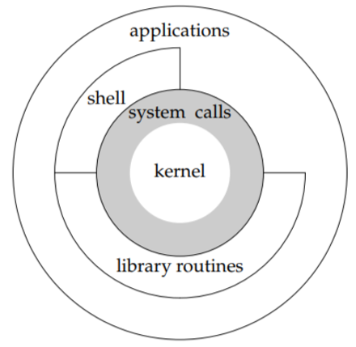    

   

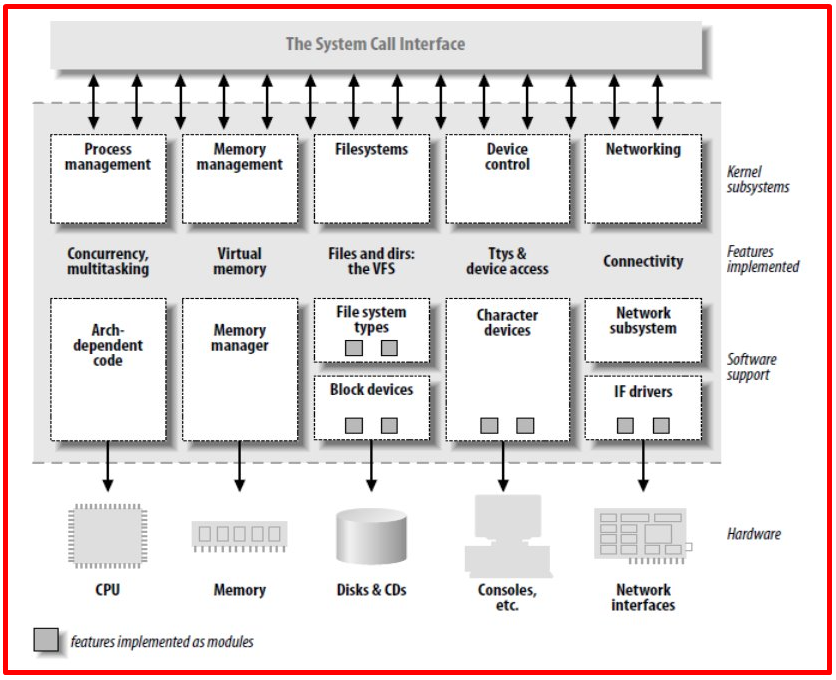  

   

### 5️⃣区分程序和进程
- 程序：是由源代码构建的二进制文件，位于硬盘上

- 进程：它们是已加载到系统中的程序。 他们开始使用和消耗系统资源

+ 就像命名来识别人一样，操作系统会给每个进程编号来识别他们。 该标识符将是进程加载到系统中的序列号。 这些称为进程 ID。 系统将通过进程的标识符 - 进程 id 与进程进行交互

+ 进程的输入和输出：它们是 2 个文件，第一个文件是进程读取 scanf() 等函数的输入数据的位置，第二个文件是进程将输出结果写入 printf() 等函数的位置。 通常输入文件是键盘，输出文件是控制台屏幕

### 6️⃣ 多任务
- 多任务操作系统：允许在任务之间切换，给人的印象是系统可以并行运行多个进程

- Unix操作系统的多任务处理能力旨在让用户感觉系统正在同时处理多个任务。这也是 Unix 相比其前辈来说出名的一个特点。 对于人类来说，1 2ms 很短，感觉不到，但对于计算机来说，那段时间足够完成很多其他任务了。 因此，系统不断地在不同的任务之间切换，但仍然保证用户的即时处理能力。

- 以用户一边听音乐一边编辑文档为例。 每次用户键入任意键时，文本编辑器程序都需要 1 毫秒来处理。 音乐播放器程序需要每隔1s周期性地每1ms运行一次。 如果系统不能正确地在任务之间切换，有时音乐播放可能会被中断，因为CPU当时正在运行文本编辑器。 然而，操作系统不会让这种情况发生。 它将优先考虑音乐播放器程序在正确的时间运行。如果此时用户按下任意键，则不会对其进行处理，而是会延迟1-2ms让音乐播放器程序完成运行后再进行处理。 但文本编辑时1~2ms的延迟不会给用户带来处理延迟的感觉，不会感觉系统同时运行音乐播放器和文本编辑程序。


### 7️⃣ 核心兵种类型和常见工作
- 应用：
+ 用户应用程序编程
+ 能耗大
+ 高加工能力
- 实时：
+ 实时关键应用
- 微控制器：
+ 广泛应用于智能家居、物联网系统...
+ 节省能源

- 有关 Linux BSP 的常见工作

+ 引导加载程序：
+ 优化启动时间
+ 添加控制命令（U-Boot cmd）
+ 闪存分区配置（NAND、eMMC）
+ 如果需要支持安全启动
+ ...

+ Linux 内核：
+ 编写驱动程序并测试：i2c、spi、usb、can、gpio...
+ 优化硬件内核配置
+ ...

+ 根文件系统：
+ 开发用户空间层应用程序
+ 开发上层应用：Qt、Python、C++
+ 集成服务：SSH、Web 服务器、MQTT...
+ ...

+ 移植
+ 新硬件、新内核...
+ 自定义DTS（设备树）
+ 检查驱动程序和外设兼容性
+ ...

### 8️⃣ 嵌入式Linux BSP 套件

  

每个项目都从获取、定制和部署以下四个组件开始：工具链、引导加载程序、内核和根文件系统。 在其中

- 工具链：是为目标设备创建代码所需的编译器和其他工具。

- Bootloader：初始化主板并加载 Linux 内核

- 内核：这是系统的核心。 内核包含进程和内存管理、网络堆栈、设备驱动程序，并向用户空间应用程序提供服务。

- 根文件系统：包含内核完成初始化过程后运行的库和程序

  

 ***一个。 工具链***
- 概述：
+ Toolchain 是用于将源代码编译为可执行文件并在目标设备上运行的工具集合
+ 工具链包含编译器、链接器和运行时库

- 工具链组件：一个标准的 GNU 工具链将包括以下 4 个主要部分
+ Binutils：一组二进制实用程序，包括汇编器和链接器（as、ld、objdump、objcopy...）。
+ GNU 编译器集合 (GCC)：这些是 C 和其他语言的编译器，具体取决于 GCC 版本，包括 C++、Objective-C、Objective-C++、Java、Fortran、Ada 和 Go。
+ C 库：是基于 POSIX 的标准化 API。 它是操作系统内核与应用程序的主要接口。
+ 调试器：调试器用于调试应用程序。 在嵌入式Linux世界中，典型的调试器是GDB
    
- 工具链的类型：工具链有以下两种类型：

+ Native：这个工具链可以在Linux发行版中找到，通常在x86上编译，在x86上运行并生成x86代码。

+ Cross：该工具链基于 x86 构建，但在目标架构上运行并为我们的目标架构（ARM、MIPS、PowerPC...）生成代码

+ 原生编译：X86 构建因此只能在 X86 上运行，ARM 构建只能在 ARM 上运行

+ 交叉编译：基于 X86 构建，但可以在 ARM 上运行
+ 原因是因为源集会非常大，在 ARM 上构建会花费很长时间，因此需要强大的 X86 来构建源集，然后将其复制到 ARM 并运行它。
+ ARM 上的存储和/或内存通常太有限
+ 与我们的计算机相比，ARM 机器非常慢
+ 我们不想在 ARM 上安装所有开发工具

+ 在为 IMX8MM 构建 yocto SDK 时，我们将获得工具链，它是一个 .sh 文件。当我们运行这个.sh文件时，我们将获得IMX8MM的编译环境，我们将使用它而不是gcc来构建驱动程序，这将在IMX8MM上运行。


 ***b。 引导装载程序***

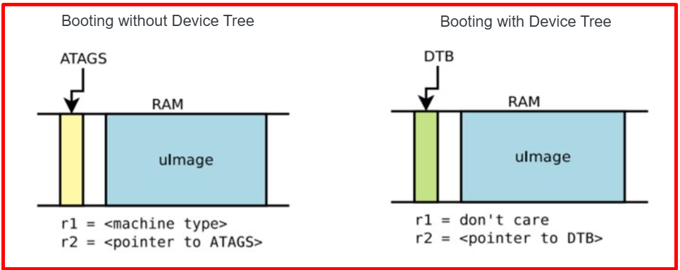

- 概述：
+ 上电或复位后，系统处于极简状态。

+ DRAM 控制器尚未设置，因此无法访问主内存。

+ 同样，其他接口也没有配置，所以通过NAND flash控制器、MMC控制器等访问内存都是不可用的。

+ 首先唯一活动的资源是 CPU 内核、一些片上静态存储器和引导 ROM。

+ 它的主要功能是在基础级别上初始化硬件，并将其他操作系统组件（Linux 内核、rootfs、设备树）加载到 RAM 并将权力移交给 Linux 内核。

+ 初始化所有底层硬件细节
+ 在链式加载任何操作系统之前准备好设置
+ 下载并检查操作系统二进制文件
+ 自检后为平台加载操作系统/运行时环境
+ 跳转到操作系统入口点

+ 嵌入式系统的启动过程可以分为几个阶段：
+ ROM代码：引导代码由制造商编写，用户无法更改。 主要功能是设置系统将SPL加载到内部RAM中
+ SPL：侧载程序。 初始化必要的组件并将u-boot加载到RAM中
+ U-Boot：将操作系统组件（内核、设备树、rootfs）加载到 RAM 中，传递内核参数并将控制权交给内核。
+ Linux 内核：挂载文件系统（Roofs）并运行 Init 进程。

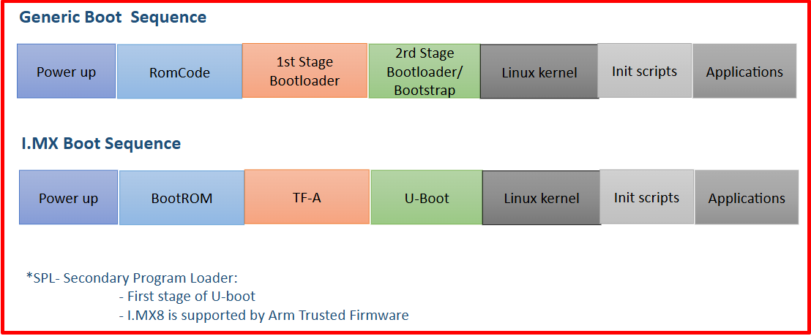

 ***c。 内核***
+ Linux 内核是核心内部结构；该软件为系统的所有其他部分提供基本服务、管理硬件并分配系统资源。


​
​
+ 简介：
+ 内核中没有 libC
+ 内核代码提供自己的库实现：字符串实用程序、密码学、压缩
+ 不能在内核代码中使用 C 库函数，例如：printf、memset、memcpy、malloc
+ 内核提供针对每种架构优化的函数：printk、memset、kmalloc
+ 内核代码高度可移植 => arch/ 之外的所有代码都是可移植的
+ 内核代码中没有浮点计算​
+ API 用户空间到内核空间不变（系统调用、/proc、/sys）

- 内核有三个主要任务：管理资源、与硬件通信以及提供为用户空间程序带来抽象级别的 API

- 内核主要功能：
+ 管理所有硬件资源：CPU、内存、I/O。​
+ 提供一组可移植的、架构和硬件独立的API，允许用户空间应用程序和库使用硬件资源
+ 处理来自不同应用程序的硬件资源的并发访问和使用。

- 内核和用户空间之间的主要接口是系统调用集。 大约400个系统调用，提供主要的内核服务


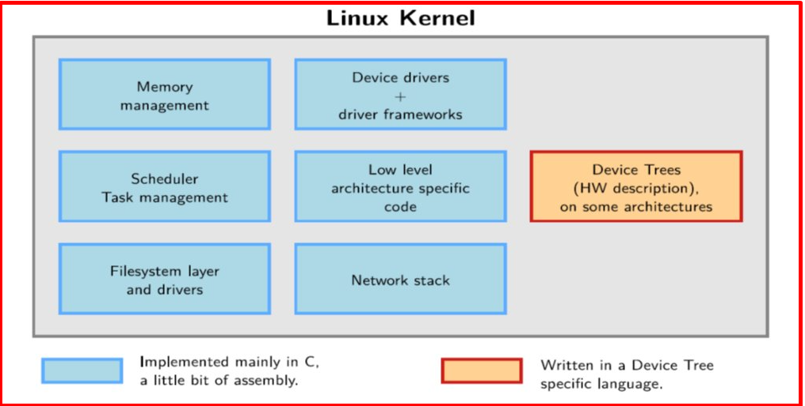


- LTP – Linux 测试项目​
+ 旨在通过将自动化测试纳入内核设计来改进 Linux 内核。
+ 在 LTP 之前，Linux 开发者没有官方的测试环境。
+ 开源社区的测试套件，可验证 Linux 内核的可靠性、稳健性和稳定性​
+ LTP 不是性能基准
+ http://ltp.sourceforge.net/ ​

- 区分 Monolithic 与 μ-kernel：
+ 整体内核（Monolithic Kernel）：
+ 在用户模式下运行的应用程序在调用系统服务时，操作系统会将服务执行转移到内核模式。 当服务完成后，操作系统将调用该服务的程序的执行切换回用户态，程序继续运行。 PC DOS 就是一个例子。 这种类型的一般特征是内核是一个单一的实体，一个非常大的程序，其功能组件可以访问系统的所有数据结构和过程。

+ 操作系统的所有组件（进程管理、内存、文件系统、设备驱动程序...）都在内核空间中运行。

+ 组件之间可以直接调用，无需经过中间通信机制。
+ 优点：高性能，因为不需要在用户空间和内核空间之间切换上下文。 轻松地在组件之间共享资源。

+ 缺点：难以维护，因为更改一个部件可能会影响整个系统，安全性较差，因为一​​个驱动程序的错误可能会导致整个系统崩溃

+ 易于设计但难以维护和扩展

+ 示例有 Linux、BSD


+ μ-内核
+ 将操作系统划分为多个进程（TT），每个进程提供一组服务（例如，内存服务、进程创建服务、调度服务...）。 在用户模式下运行的服务软件（服务器）执行循环以接收来自客户端的服务请求。 客户端可以是操作系统的另一个组件或应用程序，通过向服务器发送消息来请求服务。 操作系统内核是一个非常紧凑的部分（微内核），运行在内核模式下，它向服务器发送消息，服务器执行请求，内核将结果返回给客户端。 服务器以单独的用户模式运行进程，因此如果出现问题（失败），整个系统不会受到影响。 多个CPU，或者多台机器组合，服务运行在不同的CPU和机器上，适合分布式计算。

+ 内核中只保留最少的功能：进程管理、内存、IPC（进程间通信）。

+ 其他组件，例如驱动程序、文件系统、网络接口...在用户空间中作为单独的进程运行。

+ 优点：易于更换和更新各个部件，而不影响整个系统。 更加稳定和安全，因为一个模块中的错误不会导致内核崩溃。

+ 缺点：由于需要在进程之间进行许多上下文切换和 IPC，因此性能较低。 部署和优化更加复杂

+ 示例包括 QNX、MINIX、seL4、Symbian、Mac OS、WinNT

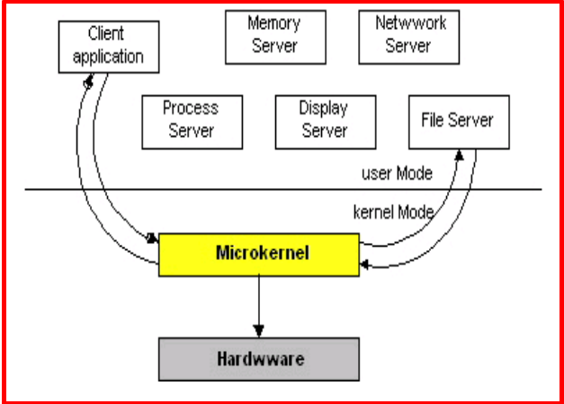

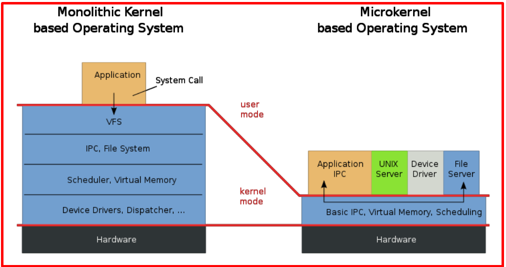

- 请求流程​

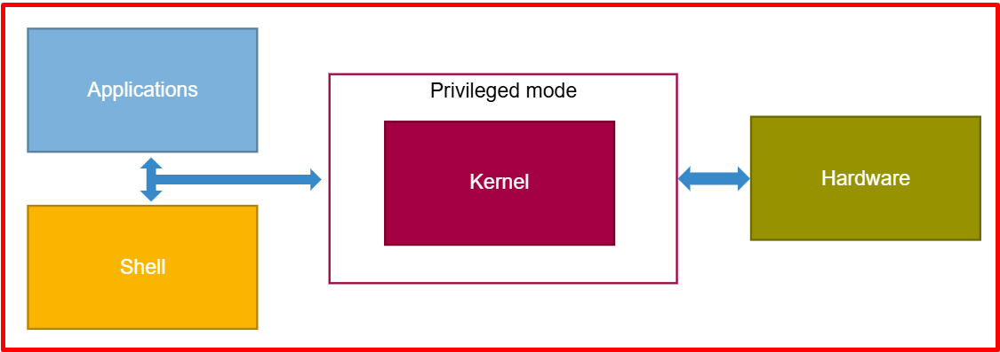

 ***d。 根文件系统***
- 根文件系统由目录和文件层次结构组成

- 当文件系统安装在目录（称为安装点）中时，该目录的内容反映存储设备的内容。 当文件系统被卸载时，挂载点再次为空。 这使得应用程序可以轻松访问文件和文件夹，无论其确切的存储位置如何。

- 根文件系统的位置可以从不同的位置挂载
+ 从硬盘分区​
+ 来自 USB 闪存盘的分区​
+ 来自 SD 卡的分区​
+ 来自 NAND 闪存芯片或类似类型存储设备的分区​
+ 来自网络，使用NFS协议​

- 就像windows也有文件系统一样，windows的根文件夹是我的电脑，桌面也是我的电脑的子文件夹。

- 同样，Linux中的文件系统结构也是一样的，从根开始，里面包含其他字符。

- Unix 之前的操作系统有文件系统。 然而，Unix反过来又将它们提升到了另一个层次。 系统会将其中存在的所有对象视为文件。 这些对象可以是硬件设备、进程、用户……从那里，系统可以通过单一方法管理所有对象，即文件交互。

- 在 Unix 中，文件可以理解为标识符，因为很多时候它代表位于硬盘驱动器或某个设备上的数据。 例如，代表每个进程的文件位于 /proc/process_id 目录中。 每个文件都有大小、所有权、修改日期等属性……此外，还有一种特殊的文件类型，称为文件夹。 目录是一个文件，其中的数据是其中文件名称的列表

- 将文件组织到文件夹中，并在父文件夹中创建子文件夹，以分散和排列文件系统，也称为目录树。 目录树的叶子节点是文件，分支节点是目录，根节点是系统的根目录

- 文件夹结构​

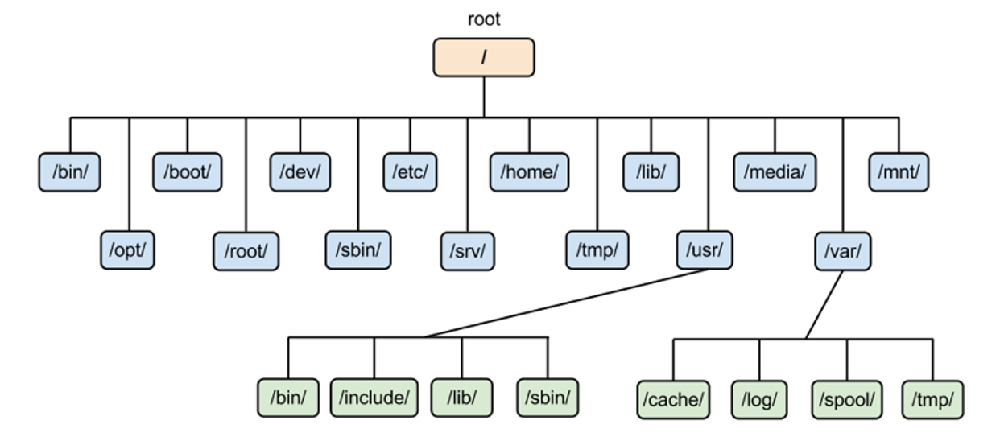  


### 9️⃣ 运行程序c
 ***当有main.c文件时***
```bash
Câu lệnh: gcc –o name_file_output main.c
Sau khi chạy lệnh sẽ tạo ra 1 file name_file_output.
Chạy file đó là ra được kết quả: ./ name_file_output
```
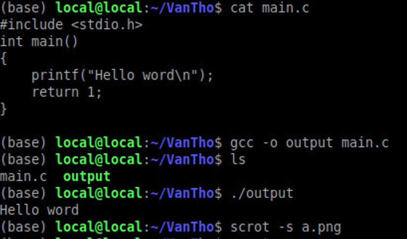  

 ***当文件较多时***
```bash
Ta bỏ tất cả file .h vào folder include là được
gcc –o file_name_output main.c tho.c –I include/
```
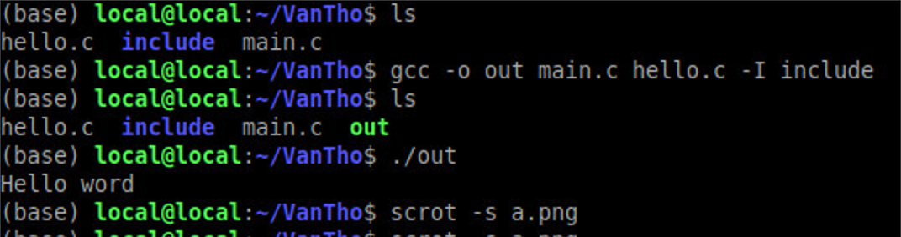  

 ***所有.c和.h文件放在同一个文件夹中***
```bash
gcc –o file_name_output main.c tho.c –I. ( Dấu chấm cuối )
```

 ***编译C程序的4个阶段***
- 预处理阶段（Pre-processing）
+ BOE 评论类型。
+ 展开宏。
+ 展开包含文件。
+ 编译条件语句。
+ 结果是一个 .i 文件
+ 从高级语言转换为低级语言（编译）
- 将.i文件编译成.s文件（汇编）
+ 将asm转换为机器代码（汇编）
- 输出是.o文件
+ 链接器阶段
- 每个 .o 文件都是程序的一部分，我们将它们链接在一起以创建完整的文件。

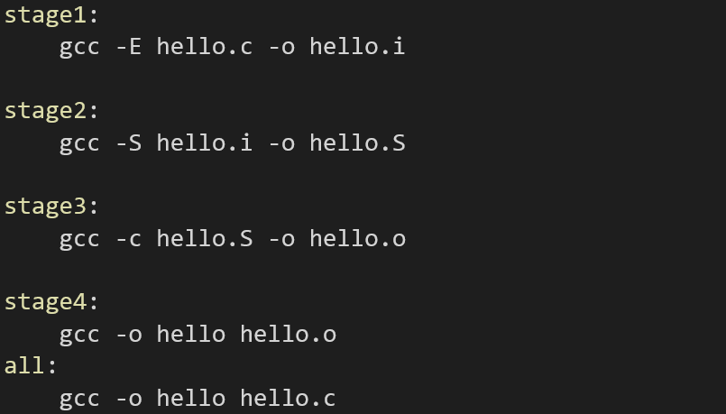  


## ✔️ 结论
在本文中，我们希望您对 Linux BSP 有一个基本的了解，并熟悉稍后会遇到的概念。 请仔细阅读本文，它是继续阅读后续文章的基础。

## 💯 运动
将所有 .c 和 .h 文件放在同一个文件夹中，编写命令来构建可执行文件并运行该可执行文件（您自己编写的 .c .h ）。

## 📺 注意
- - Video: [链接](https://www.youtube.com/watch?v=N9qCD43gm9Y) 


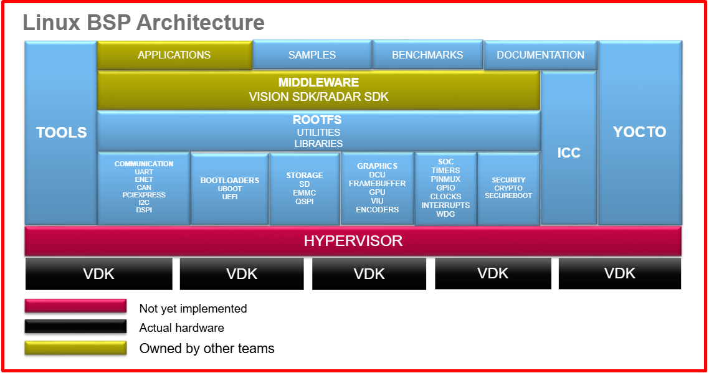


## 📌参考

[1] https://bootlin.com/

[2] https://en.wikipedia.org/wiki/Das_U-Boot

[3] https://en.wikipedia.org/wiki/Booting

[4] https://www.bsdcan.org/2008/schedule/attachments/49_2008_uboot_freebsd.pdf

[5] https://www.slideshare.net/slideshow/uboot-startup-sequence/35290510

[6] https://www.slideshare.net/slideshow/wave-ubootppt/23703918

[7] https://wiki.tizen.org/w/images/6/62/3-Tizen_bootup(U-boot,Systemd).ppt

[8] https://ocw.cs.pub.ro/courses/so2

[9] https://wr.informatik.uni-hamburg.de/_media/teaching/wintersemester_2014_2015/pk1415-introduction.pdf

[10] 掌握嵌入式 Linux 编程（第三版）作者：Chris Simmonds 和 Frank Vasquez

[11] Thomas Petazzoni 的嵌入式 Linux 简介​

[12] Bootlin嵌入式Linux系统开发

[13] 英富拉

[14] https://viblo.asia/p/linux-boot-process-a-z-1Je5E6XLKnL

[15] Linux 简介 - Machtelt Garrels