# 💚 Bash-Shell trong Linux 💛

## 👉 Introduction and Summary 
### 1️⃣ Introduction
Sau khi các bạn đã đọc bài viết [04_Linux_Introduction](./001_Linux_Introduction/04_Linux_Introduction.md), chúng ta sẽ đọc về bài bash-shell trong linux. Đây là 1 script quan trọng để người dùng có thể tương tác được với OS. Và cũng từ script Shell này ta có thể viết các tool để phục vụ cho các công việc trong linux như Flash SD card, tạo các test case ...
### 2️⃣ Summary
Nội dung của bài viết gồm có những phần sau nhé 📢📢📢:
- [I. Introduction and Summary](#👉-introduction-and-summary)
    - [1. Introduction](#1️⃣-introduction)
    - [2. Summary](#2️⃣-summary)
- [II. Contents](#👉-contents)   
    - [1. Bash-Shell là gì](#1️⃣-bash-shell-là-gì)
    - [2. Kiến thức xung quanh Bash-Shell](#2️⃣-kiến-thức-xung-quanh-bash-shell)
    - [3. Các bước khi thực hiện 1 command-line​](#3️⃣-các-bước-khi-thực-hiện-1-command-line)
    - [4. Cú pháp lệnh​](#4️⃣-cú-pháp-lệnh)
- [III. Conclusion](#✔️-conclusion)
- [IV. Exercise](#💯-exercise)
- [V. NOTE](#📺-note)
- [VI. Reference](#📌-reference)

## 👉 Contents
### 1️⃣ Bash Shell là gì

***Bash là gì?***
+ Bash là viết tắt của Born Again Shell.​
+ Bash là một shell được viết miễn phí để thay thế cho Bourne Shell chuẩn (/bin/sh) ban đầu được Steve Bourne viết cho các hệ thống UNIX.
+ Nó có tất cả các tính năng của Bourne Shell ban đầu, cùng với các bổ sung giúp dễ dàng lập trình và sử dụng từ dòng lệnh hơn.
+ Vì là Phần mềm Miễn phí, nó đã được sử dụng làm shell mặc định trên hầu hết các hệ thống Linux.
+ Shell Bush là shell được sử dụng phổ biến nhất và do tính đa dạng của các hệ thống Linux.​
+ Bằng cách viết kịch bản cho chương trình hay nhất, bạn có thể khá tự tin rằng kịch bản của mình sẽ hiệu quả khi bạn​ chuyển nó sang các máy khác, điều này có thể giúp bạn tiết kiệm rất nhiều công việc.​

***How is bash different from DOS cmd​***
+ Phân biệt chữ hoa chữ thường: bash phân biệt chữ hoa chữ thường, nhưng DOS thì không.
+ "/" so với "\": Trong DOS, dấu gạch chéo xuôi "/" là dấu phân cách tham số lệnh, trong khi dấu gạch chéo ngược "\" là dấu phân cách thư mục. Trong Linux/UNIX, dấu "/" là dấu phân cách thư mục, và dấu "\" là ký tự thoát.

***Shell là gì?***
+ Shell là một chương trình cung cấp giao diện giao tiếp giữa người dùng và hệ điều hành (OS). Hệ điều hành khởi động một shell cho mỗi người dùng khi người dùng đăng nhập hoặc mở một cửa sổ terminal hoặc console.
+ Viết kịch bản cho phép tự động hóa.​
<p align="center">
  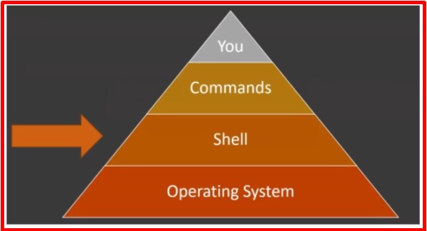   
</p>
<p align="center">
  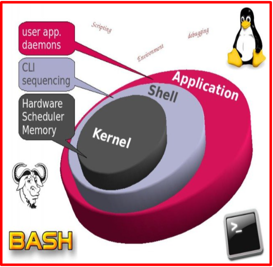   
</p>

### 2️⃣ Kiến thức xung quanh Bash-Shell

***Kịch bản​***
+ Một kịch bản gồm 3 phần: Mở đầu, phần giữa và phần cuối
  + Dòng đầu cho biết Shell sử dụng trình thông dịch nào để đọc​
  + Phải có 1 dòng cách ra giữa dòng đầu và code​
  + Ghi Exit 0 là thành công, còn từ 1-255 là không thành công​
  + Chmod + x name_file: Cấp quyền thực thi​
  <p align="center">
    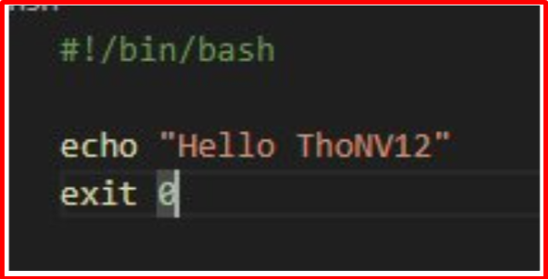   
  </p>

***Comment***
+ Có 2 kiểu là comment 1 dòng và comment nhiều dòng
<p align="center">
  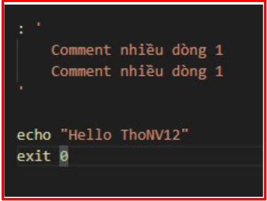   
</p>
<p align="center">
  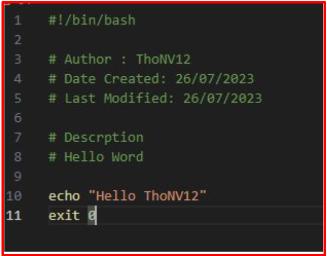   
</p>

***Quyền file​***
+ Linux quản lý tất cả mọi thứ như 1 file​. Các loại file trong linux:​
```bash
Chữ R:  là Regular file​, là các file thông thường như text file, executable file
Chữ D:  là Directories file​, file chứa danh sách các file khác.​
Chữ C:  là Character Device file​, file đại diện cho các thiết bị không có địa chỉ vùng nhớ.
Chữ B:  là Block Device file​, file đại diện cho các thiết bị có địa chỉ vùng nhớ
Chữ L:  là Link files​, file đại diện cho một file khác
Chữ S:  là Socket file​, file đại diện cho 1 socket
Chữ P:  là Pipe file​, file đại diện cho 1 pipe
Dấu " - ":  là file thông thường​
```
+ Để hiển thị thông tin file ta gõ : ls -l
  + Khi này, số hardlink sẽ là có bao nhiêu file cùng trỏ tới 1 phân vùng nhớ thì đó là số hardlink của file.​
<p align="center">
  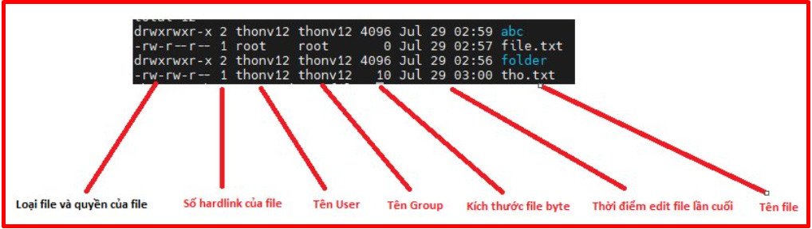   
</p>
<p align="center">
  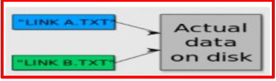   
</p>

***Thay đổi quyền file***
+ Để thay đổi quyền của file ta dùng câu lệnh chmod. Có thể vào [LINK NÀY](https://chmod-calculator.com/​) để xem quyền trực quan hơn
```bash
chmod 744 Name_file​
chmod o+r test.txt: thêm quyền read.​
chmod u-r test.txt: bỏ quyền read.​
```
<p align="center">
  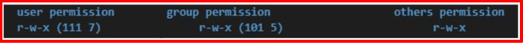   
</p>
<p align="center">
  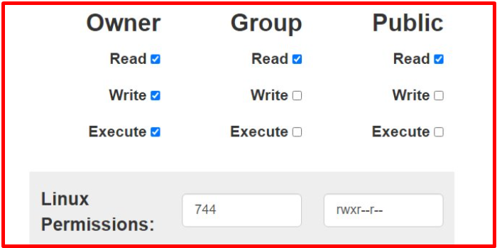   
</p>

***Path environment***
+ PATH là một biến môi trường trong Linux, cho shell biết thư mục nào cần tìm kiếm các tệp thực thi để đáp ứng các lệnh do người dùng đưa ra.
+ Thường được định nghĩa trong /etc/bash.bashrc và ~/.bashrc
```bash
PATH=/usr/bin:/bin:/usr/local/bin
Phân cách bằng ký tự ":"
Hệ thống sẽ tìm kiếm lệnh từ trái sang phải
Có thể lấy PATH hiện tại bằng lệnh "echo $PATH"
```
+ Bình thường ta muốn chạy file gì đó thì phải cd tới folder chứa file đó để chạy, vậy bây giờ ta muốn chạy file đó ở bất kì chỗ nào không cần đường dẫn tuyệt đối hoặc tương đối trỏ tới file thì ta phải làm như thế nào?

+ Đầu tiên ta sẽ gõ: echo "$PATH" để xem trong PATH đang có những đường dẫn nào
<p align="center">
  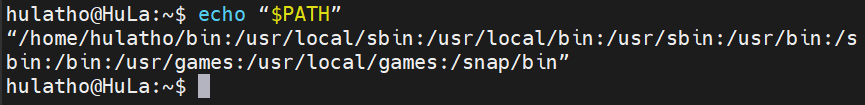   
</p>

+ Khi này, để thêm 1 đường dẫn vào 1 PATH ta sẽ có 2 cách như dưới
  + Thêm tạm thời:
    + Khi tắt máy bật lại thì sẽ mất
    + Cách thêm: export PATH=$PATH:/home/hulatho/bash_shell
    + Khi này ta gõ echo "$PATH" ta sẽ thấy đường dẫn trên đã được thêm vào cuối của biến PATH
<p align="center">
  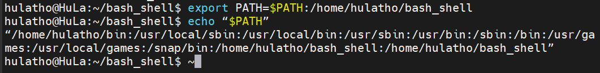   
</p>

  + Thêm trọn đời:
```bash
vim ~/.profile
Thêm export PATH=$PATH:/home/hulatho/bash_shell vào file
source ~/.profile để lưu nội dung lại
```
<p align="center">
  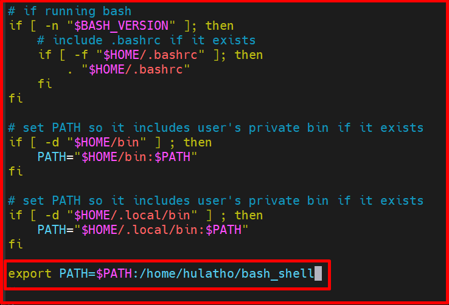   
</p>

+ Như ta biết, khi chạy 1 file, nó sẽ tìm đường dẫn trong biến PATH này, tìm từ trên xuống dưới nếu có thì file đó được chạy luôn. Như vậy ta sẽ cần có thêm sự ưu tiên, nghĩa là sẽ tìm PATH của ta trước. Để có sự ưu tiên trước thì ta sẽ thêm đường dẫn trước $PATH, còn không cần ưu tiên thì thêm đường dẫn vào sau $PATH
```bash
❌ export PATH=$PATH:/home/hulatho/bash_shell
export PATH=your_directory:$PATH​
✔️ export PATH=/home/hulatho/bash_shell:$PATH​
```

***Variable***
+ Có 2 loại biến là biến có sẵn và biến ta tự tạo
  + Các biến có sẵn như: PATH, HOME, HOSTNAME, PS1  
    + PS1: là cái nhắc lệnh cho ta
      + Ta có thể sửa đổi bằng cách PS1="Ghi vào đây"
      + https://ezprompt.net/  lên trang này để lấy cái "Ghi vào đây"
      + Quay trở về ban đầu thì: source ~/.bashrc​ 
  + Các biến ta tự tạo sẽ như ảnh bên dưới
<p align="center">
  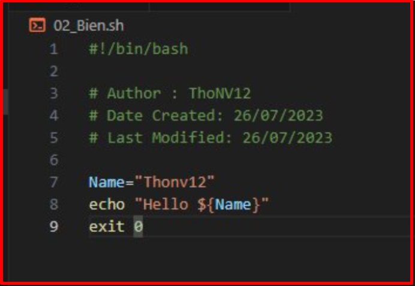   
</p>

+ Chuyển chữ hoa thành chữ thường
<p align="center">
  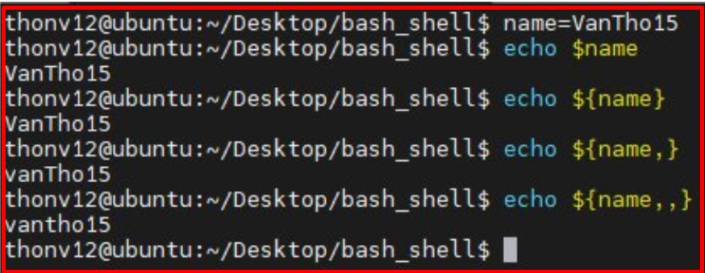   
</p>

+ Chuyển chữ thường thành chữ hoa
<p align="center">
  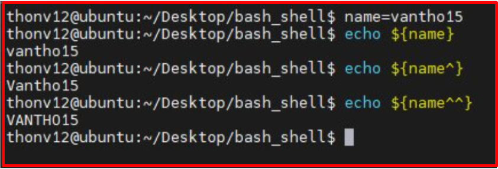   
</p>

+ Đếm kí tự​ và cắt chuỗi
<p align="center">
  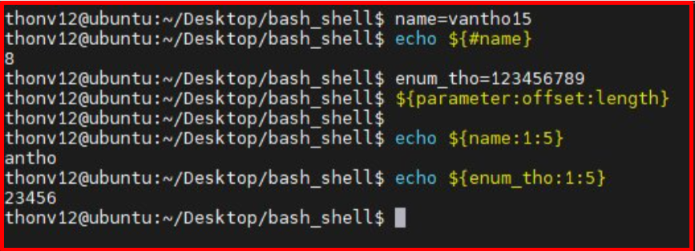   
</p>
<p align="center">
  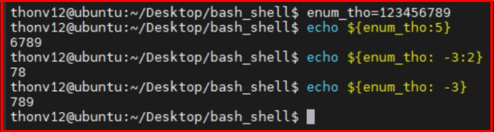   
</p>

+ Lấy đầu ra của 1 lệnh và gán
<p align="center">
  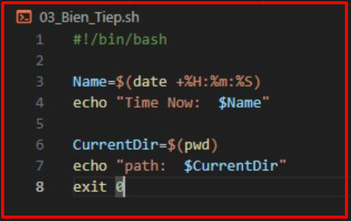   
</p>

+ Tính toán​
  + ${parameter}​
  + $(command)​
  + $((expression))​
  + bc để ra số thập phân, scale=2, lấy 2 chữ số ​thập phân

<p align="center">
     
</p>

+ Các kí tự đặc biệt​
  + ~- : Thay đổi về thư mục trước đó​
  + ~  : Đưa ra đường dẫn đầy đủ tưới user​
  + ~+ : lấy ra đường dẫn PWD hiện tại​
  + \: Ký tự thoát. Nếu bạn muốn tham chiếu đến một ký tự đặc biệt, trước tiên bạn phải "thoát" nó bằng dấu gạch chéo ngược. Ví dụ: touch /tmp/filename\*
  + /: Dấu phân cách thư mục, dùng để phân tách một chuỗi tên thư mục. Ví dụ: /usr/src/linux
```bash
?: Represents a single character in a filename.​
  Ex: hello?.txt can represent hello1.txt, helloz.txt, but not hello22.txt​
[ ]: Can be used to represent a range of values, e.g. [0-9], [A-Z], etc.​
  Ex: hello[0-2].txt represents the names hello0.txt, hello1.txt, and hello2.txt​
|: "Pipe". Redirect the output of one command into another command.​
  Ex: ls | less​
>: Redirect output of a command into a new file. If the file already exists,
over-write it.​
  Ex: ls > myfiles.txt​
>>: Redirect the output of a command onto the end of an existing file.​
  Ex: echo "Mary 555-1234" >> phonenumbers.txt​
<: Redirect a file as input to a program.​
  Ex: more < phonenumbers.txt​
;: Command separator. Allows you to execute multiple commands on a single line.​
  Ex: cd /var/log ; less messages​
&&: Command separator as above, but only runs the second command if the first one finished without errors.
  Ex: cd /var/logs && less messages​
&: Execute a command in the background, and immediately get your shell back. Same as non-blocking call model.​
  Ex: find / -name core > /tmp/corefiles.txt &​
```
<p align="center">
  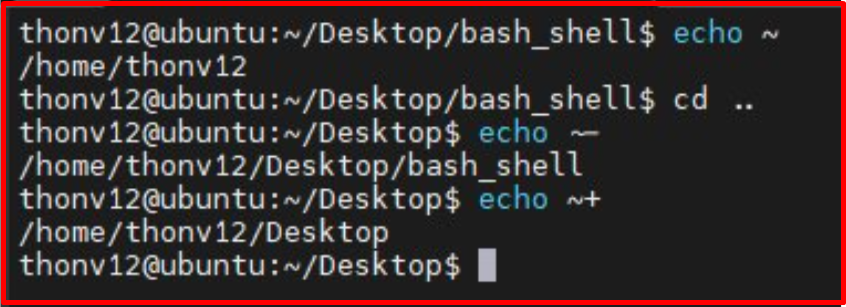   
</p>

+ Tạo ra nhiều như hàm Range
  + Tạo ra 12 tháng, mỗi tháng có 31 ngày là file​
<p align="center">
  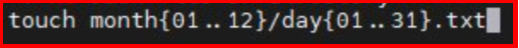   
</p>
<p align="center">
     
</p>

### 3️⃣ Các bước khi thực hiện 1 command-line​

Khi chạy 1 commad line có 5 bước:​
```bash
+ Tokenisation​
+ Command identification​
+ Shell expansions​
+ Quote removal​
+ Redirections​
```
***Bước 1: Tokenisation***
+ Đi tìm kiếm nơi code command bắt đầu và kết thúc bằng các kí tự đặc biệt bên dưới và được sử dụng để chia nhỏ dòng lệnh ra​
```bash
|​
&​
;​
()​
<>​
Space, tab, newline
```

+ Ví dụ:
```bash
Ví dụ: echo $name > tho.txt​
+ Thằng này ban đầu nó chỉ là 1 string thôi​
+ Sau đó shell bắt đầu xác định các kí tự đặc biệt trong đây​
+ Sau đó nó tìm xem có 1 kí tự nào không, để biết có toán tử nào trong đây không, còn lại sẽ là 1 từ (như vậy sẽ có 1 toán tử chuyển hướng và 3 từ) ​
```

***Bước 2: Command identification - Nhận dạng lệnh​***

Shell chia các command thành các lệnh đơn giản hoặc lệnh ghép
+ Lệnh đơn giản như echo chẳng hặn
<p align="center">
  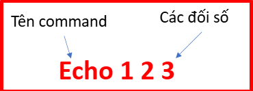   
</p>

+ Tất cả các lệnh đơn giản đều được kết thúc bằng 1 toán tử điều khiển
```bash
Newline​
|​
||​
&​
&&​
;​
;;​
;&​
;;&​
|&​
(​
)​
```
+ Ví dụ sau đây là kết thúc bởi dấu ; và newline
<p align="center">
  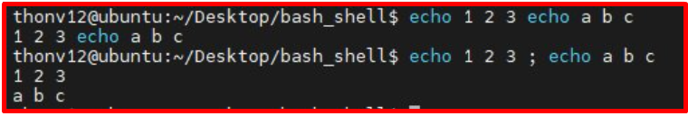   
</p>

+ Lệnh phức tạp như If, for, while...

***Bước 3: Shell expansions​***
+ Thực hiện mở rộng câu lệnh
+ Có bốn giai đoạn mở rộng Shell.
```bash
Stage 1: Brace expansion​
Stage 2: include: Parameter, arithmetic, command substitution​
Stage 3: Word splitting - Tách từ​
Stage 4: Globbing​
```
<p align="center">
  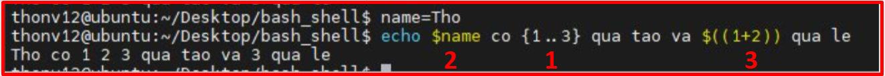   
</p>
<p align="center">
  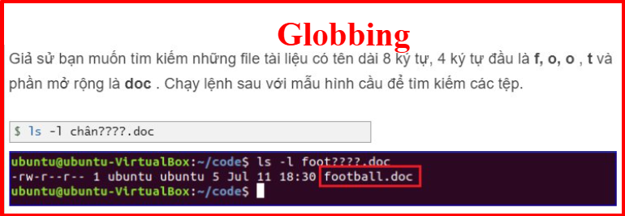   
</p>

+ Word splitting​
  + Tách từ​
  + Các kí tự tách từ được lưu trong biến IFS​
  + Có thể thấy biến nay đang chứa 1 dấu cách, 1 dấu tab và xuống dòng 

<p align="center">
  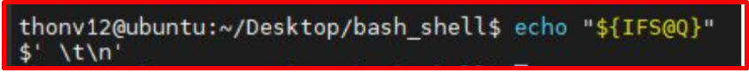   
</p>
<p align="center">
  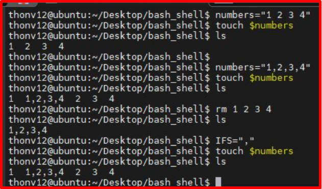   
</p>​

***Bước 4: Quote removal - Loại bỏ kí tự đặc biệt​***

Mục đích của việc trích dẫn là loại bỏ ý nghĩa đặc biệt khỏi các ký tự đặc biệt.​
```bash
\​
``
""
```
<p align="center">
  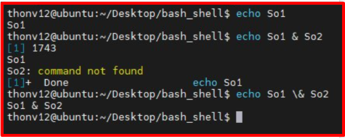   
</p>
<p align="center">
  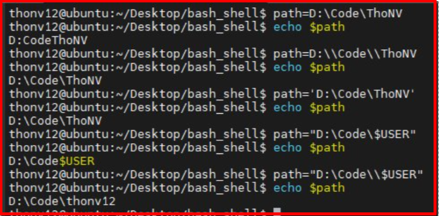   
</p>​

+ Ví dụ
```bash
Name="Tho"     out="out.txt”"
Echo $name > $out
Step 1: tìm Word và toán tử                      ​Echo $name > $out​
Step 2: nhận dạng command                        Có 1 newline ở cuối dòng, nhưng bị ẩn​
Step 3: Mở rộng​                                  Echo Tho > out.txt
Step 4: Remove Quote                             Không có​
Step 5: Chuyển hướng ​                            Echo Tho​ --> stdout ---> Out.txt​
```
<p align="center">
  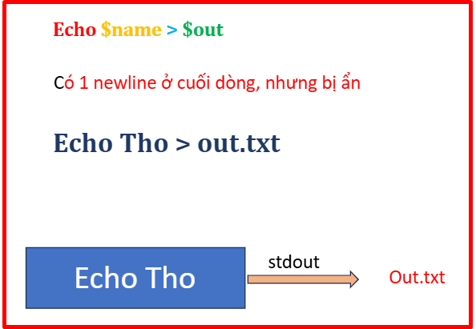   
</p>​

***Bước 5: Redirections***
+ Echo "hello thonv" > output.txt​
+ Toán tử chuyển hướng > sẽ ghi đè nội dung hiện tại của tệp
+ Toán tử chuyển hướng >> chuyển hướng Standard Output của lệnh tới một tệp.​
+ Toán tử chuyển hướng &> chuyển hướng Standard Output  và lỗi đến cùng một nơi.​

<p align="center">
  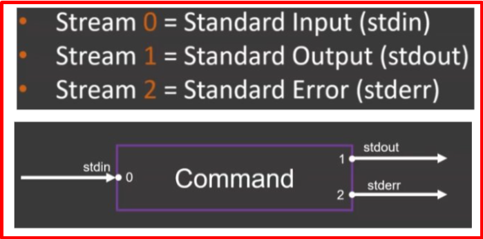   
</p>​

Sau khi xong 5 bước này thì bash sẽ thực hiện execute command line​

### 4️⃣ Cú pháp lệnh

***Positional Input​***

<p align="center">
  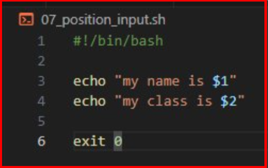   
</p>​<p align="center">
  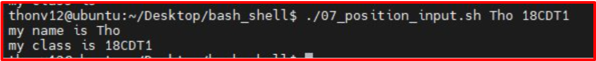   
</p>​

***Special param​***

</p>​<p align="center">
  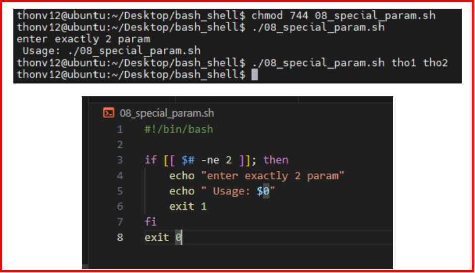   
</p>​

+ $@ : lấy tất cả các tham số truyền vào, khi ở giữa là dấu cách​
</p>​<p align="center">
  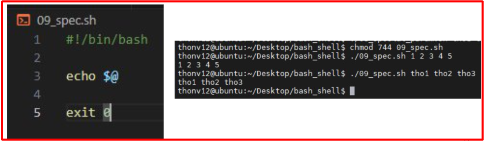   
</p>​

+ $* : Khi IFS là gì, thì param lấy vào sẽ có dấu đó ở giữa​
</p>​<p align="center">
     
</p>​

</p>​<p align="center">
  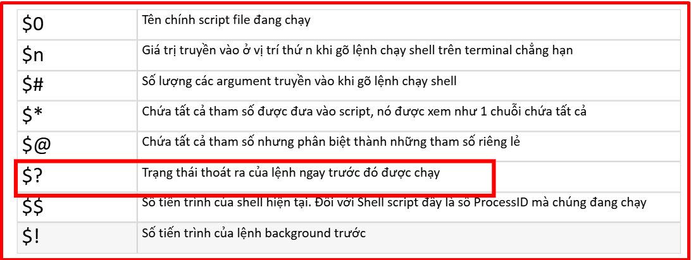   
</p>​

***Read comamnd​***

</p>​<p align="center">
  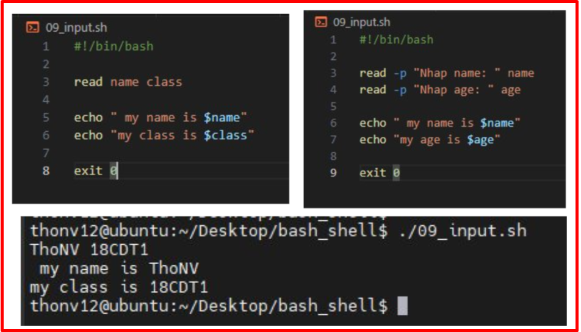   
</p>​

***Ứng dụng​***

</p>​<p align="center">
  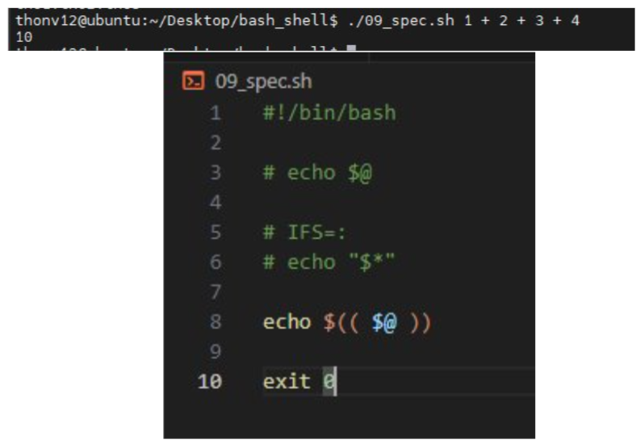   
</p>​

***Điều kiện biến​***
```bash
string1 = string2 : true nếu 2 chuỗi bằng nhau​
string1 != string2 : true nếu 2 chuỗi không bằng nhau​
-n string1 : true nếu tring1 không rỗng​
-z string1 : true nếu tring1 rỗng​
expression1 -eq expression2 : true nếu 2 biểu thức bằng nhau​
expression1 -ne expression2 : true nếu 2 biểu thức không bằng nhau​
expression1 -gt expression2 : true nếu biểu thức expression1 lớn hơn expression2​
expression1 -ge expression2 : true nếu biểu thức expression1 lớn hơn hoặc bằng expression2​
expression1 -lt expression2 : true nếu biểu thức expression1 nhỏ hơn expression2​
expression1 -le expression2 : true nếu biểu thức expression1 nhỏ hơn hoặc bằng expression2​
!expression : true nếu biểu thức expression là false (toán tử not)​
```
</p>​<p align="center">
  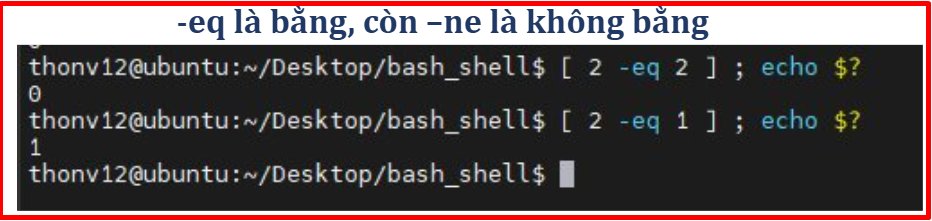   
</p>​
</p>​<p align="center">
  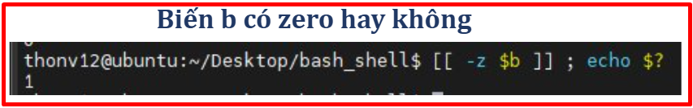   
</p>​

***Điều kiện Fille​***
```bash
 -d file : true nếu file là thư mục​
 -e file : true nếu file tồn tại trên đĩa​
 -f file : true nếu file là tập tin thông thường​
 -g file : true nếu set-group-id được thiết lập trên file​
 -r file : true nếu file cho phép được​
 -s file : true nếu file có kích thước khác 0​
 -u file : true nếu set-ser-id được áp đặt trên file​
 -w file : true nếu file cho phép ghi​
 -x file : true nếu file được phép thực thi​
```
</p>​<p align="center">
  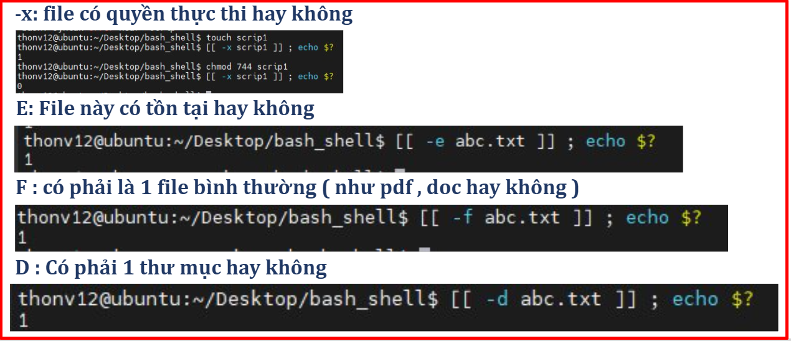   
</p>​

***If else​***
</p>​<p align="center">
     
</p>​
</p>​<p align="center">
  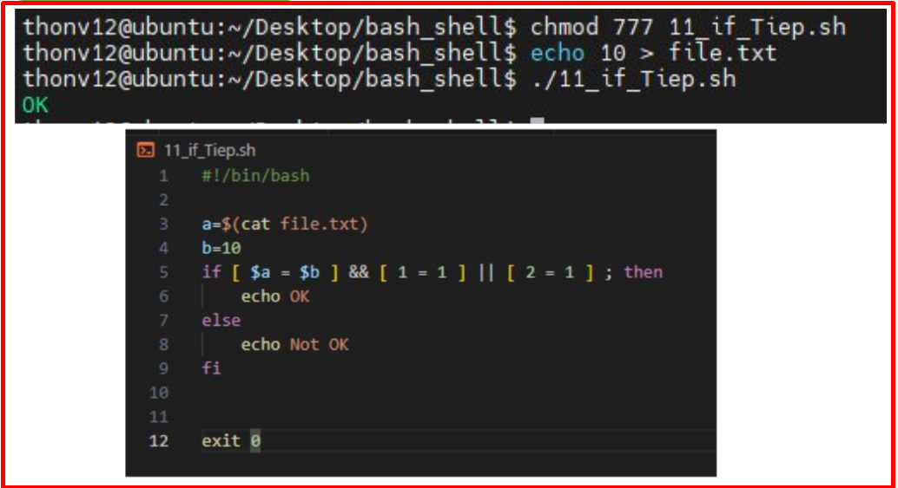   
</p>​

***Select và Case​***
</p>​<p align="center">
  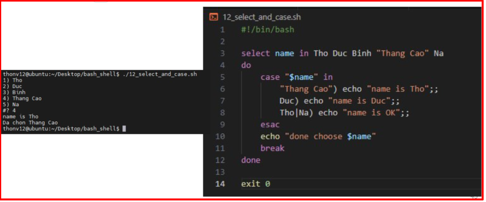   
</p>​

***Lấy option từ bàn phím​***
</p>​<p align="center">
  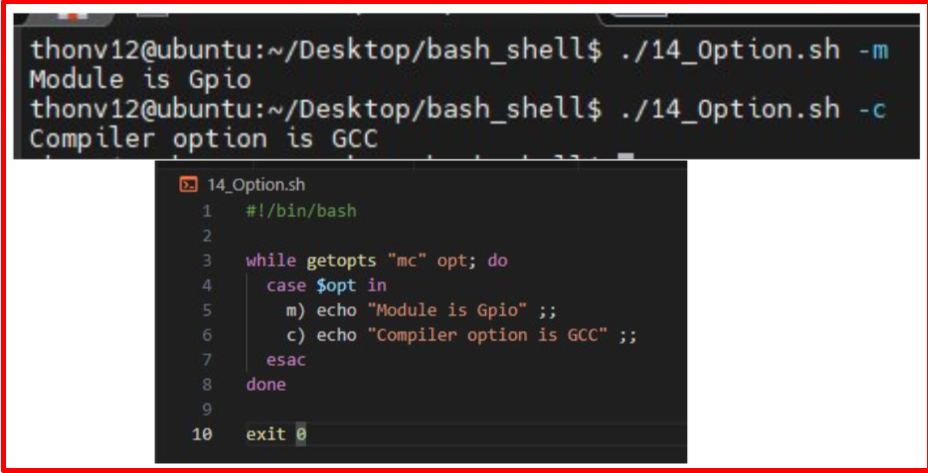   
</p>​

***While***
</p>​<p align="center">
  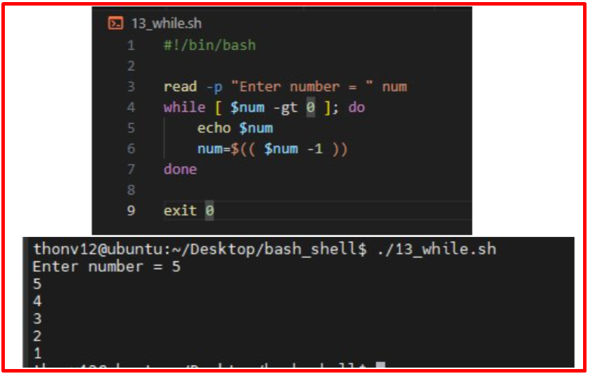   
</p>​

***Array***
</p>​<p align="center">
  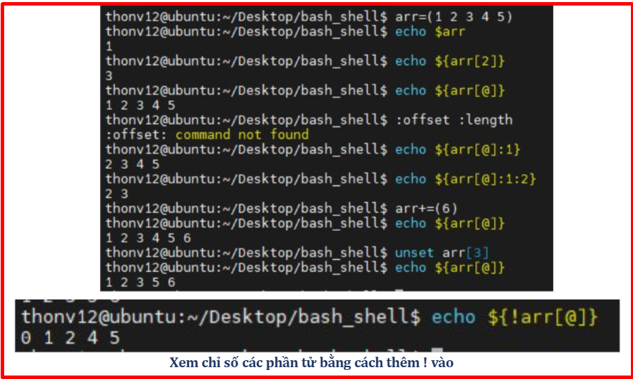   
</p>​

***For array​***
</p>​<p align="center">
  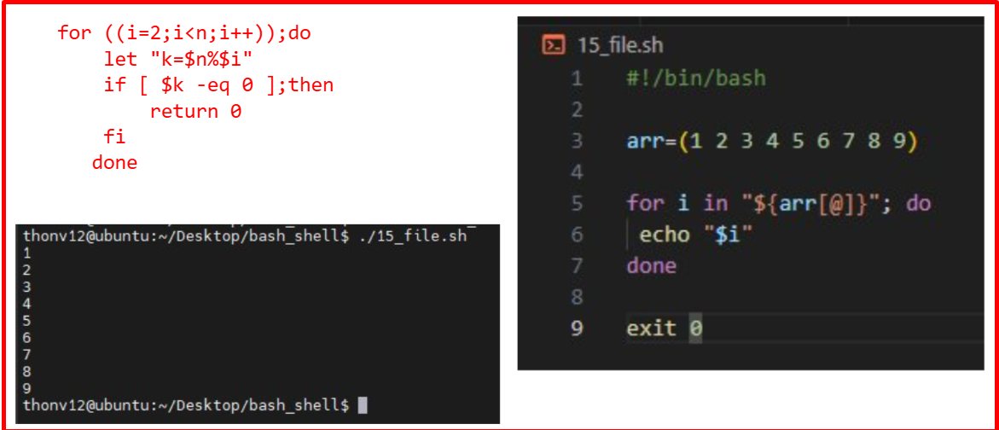   
</p>​

***Tạo Array từ 1 fille​***
</p>​<p align="center">
  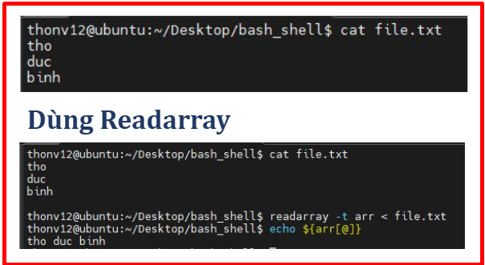   
</p>​

***Debug***
+ Lên trang https://www.shellcheck.net/ để check xem file lỗi chỗ nào​
+ Gõ man name_lenh để xem trợ giúp​
+ Gõ help name_lenh​

***Function***
</p>​<p align="center">
  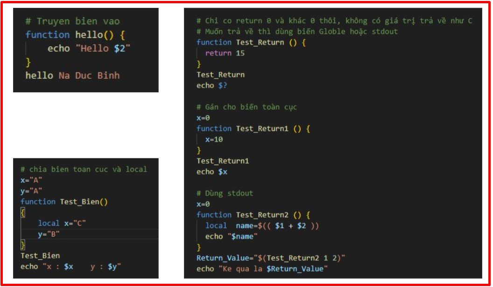   
</p>​

***Số Nguyên tố​***
</p>​<p align="center">
  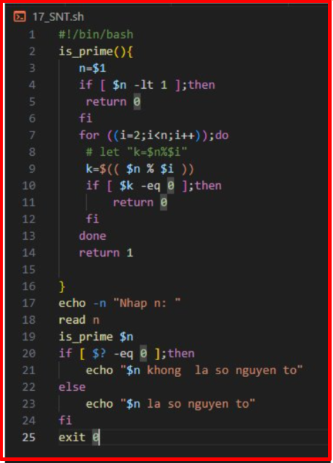   
</p>​

***Tạo Folder​***
</p>​<p align="center">
  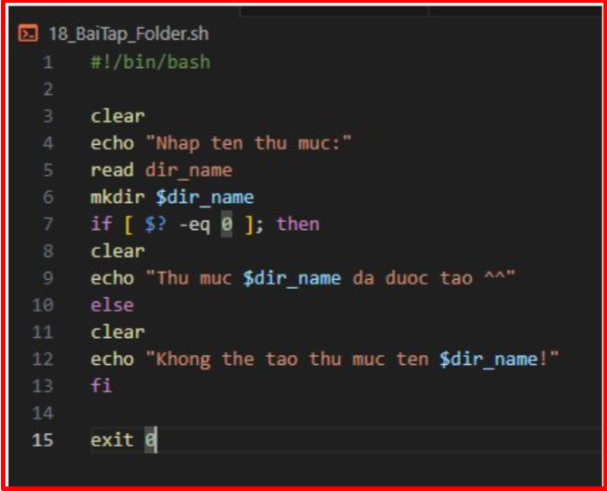   
</p>​

***Tổng Hợp lại***
```bash
Does not have type definition​
Declare by: <var_name>=[value] (no spaces at =)​
Used by: $var_name, ${var_name}​
Delete by: unset <var_name>​
Print to console by: printf, echo​
Read from console by: read​
Numeric variable: var_num=1​
String variable: var_str=“This is string”​
Math expression: var_num=`expr $var_num + 1`​
$0: contains command that you used to run the script​
$1->: the argument number 1->​
$#: number of positional argument​
$@: array of positional arguments​
$$: PID of current process​
$?: exit code of last command (returned by exit command)​

test là một lệnh tích hợp sẵn của BASH, nó đánh giá nhiều loại
biểu thức, từ thuộc tính tệp đến số nguyên và chuỗi.
Phiên bản thay thế của test là [ … ] (khoảng trắng sau [ và trước ])
File test:​
[ -f ~/test ] # True if ~/test is a regular file ​
[ -e /etc/fstab ] # True if file /etc/fstab exists​

Integer test:​
[ x -eq 1 ] # True if x == 1​
[ x -ne 1 ] # True if x != 1​
[ x -gt 1 ] # True if x > 1​

String test:​
[ x = “a” ] # True if x content is equal to “a”​
[ x != “a” ] # True if x content is not “a”​

BASH evaluate expression [[ ]]​
  [[ ]] is BASH shell grammar, not command​
  Supports same operator as test​
  More than test, it can evaluate regular expression​ string=“whatever”​
  [[ $string =~ h[aeiou] ]] # True​
  [[ $string =~ h[sdfghijk] ]] # False​

BASH conditional operators​
  <command 1> && <command 2>: do <command 2> after and if <command 1> return True​
  <command 1> || <command 2>: do <command 2> after and if <command 1> return False​
  [ -f /etc/fstab ] && cat /etc/fstab || echo “not exists”​
  [ -f /etc/fstaba ] && cat /etc/fstab || echo “not exists”​

BASH branch with if​
  if <condition list>​
  then​
    <commands>​
  fi​

  if <condition list>; then <commands>; fi​

BASH branch with case​
  case WORD in​
    PATTERN) COMMANDS ;;​
    PATTERN) COMMANDS ;; ## optional​
  esac​

BASH loop​
While loop​
  while <list>​
  do​
    <list>​
  done​
Until loop​
  until <list>; do <list>; done​
For loop​
  for (( n=1; n<=10; ++n )); do echo "$n"; done​
  for var in Canada USA Mexico; do printf "%s\n" "$var"; done​

BASH function​
  <function_name>()​
  {​
    <commands>;​
  }​
```

## ✔️ Conclusion
Ở bài viết này hi vọng các bạn đã có hiểu biết sơ lược về Bash-Shell và có thể sử dụng 1 cách cơ bản để phục vụ cho công việc của chúng ta. Trên mạng có rất nhiều tài liệu tham khảo cũng như sách vở. Dưới đây mình sẽ share vài file pdf cũng như link về bash-shell.
- [Advanced Bash-Scripting Guide.pdf](./Books//Advanced%20Bash-Scripting%20Guide.pdf)
- [Bash Guide for Beginners.pdf](./Books/Bash%20Guide%20for%20Beginners.pdf)
- [Bash.Quick.Reference.2006.pdf](./Books/Bash.Quick.Reference.2006.pdf)
- [cheatsheet](https://devhints.io/bash)

## 💯 Exercise
+ Ex1: Viết script tìm số lớn nhất trong 3 số được nhập từ dòng lệnh
+ Ex2: Viết script tính tổng các ký số của một số được nhập vào vd: tinh 1234 -> 10
+ Ex3: Tạo menu tương tác với người dùng:
```bash
---------------------------------------Main Menu---------------------------------------
[1] Show today date/time
[2] Show all files in current directory
[3] Show users
[4] Show calendar
[5] Exit/Stop
```
+ Ex4: In ra các phần tử chẵn lẻ,Tính tổng các phần tử trong mảng (dùng hàm tổng 2 số)
+ Ex5: Viết script để xác định đường dẫn một file và kiểm tra xem file đó có tồn tại hay không
+ Ex6: Chương trình đếm số dòng/từ của một file
+ Ex7: Phân tích 5 bước của 2 câu lệnh bên dưới​
```bash
  Echo "$name" > "$out"​
  Echo "$(ls *.txt)"​
```
<p align="center">
  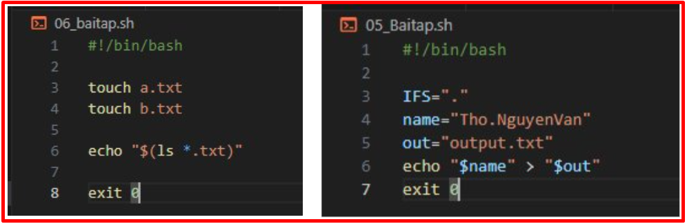   
</p>​

## 📺 NOTE

- [Video](https://www.youtube.com/watch?v=zQO7OPii_lE)
- [Source Code](https://drive.google.com/drive/folders/13kAieNjPXEOl2z2yU4KlKtMqeKRaRm1G?usp=sharing)


## 📌 Reference

[1] https://devhints.io/bash

[2] Advanced Bash-Scripting Guide.pdf

[3] Bash Guide for Beginners.pdf

[4] Bash.Quick.Reference.2006.pdf