# 💚 Makefile 💛

## 👉 Introduction and Summary 
### 1️⃣ Introduction
+ Ở bài trước chúng ta đã biết về Shell trong linux cũng như các cú pháp và các thực hành với nó. Nếu các bạn chưa xem thì vào link này nha [002_Bash_Shell_Linux.md](../002_Bash_Shell_Linux/002_Bash_Shell_Linux.md). Ở bài này chúng ta sẽ đọc về makefile, để từ đó có thể compile nhiều file cũng nhưng thực hiện những nhứ phức tạp hơn phục vụ cho các bài tiếp theo.
### 2️⃣ Summary
Nội dung của bài viết gồm có những phần sau nhé 📢📢📢:
- [I. Introduction and Summary](#👉-introduction-and-summary)
    - [1. Introduction](#1️⃣-introduction)
    - [2. Summary](#2️⃣-summary)
- [II. Contents](#👉-contents)
    - [1. Stage c compiling​](#1️⃣-stage-c-compiling)
    - [2. Makefile](#2️⃣-makefile)
- [III. Conclusion](#✔️-conclusion)
- [IV. Exercise](#💯-exercise)
- [V. NOTE](#📺-note)
- [VI. Reference](#📌-reference)

## 👉 Contents
### 1️⃣ Stage c compiling
Xét ví dụ main.c sau​, như vậy 1 chương trình c sẽ thực hiện qua các bước sau: Pre-Compiling ->  Compilation ->  Assembly ->  Linking. Chúng ta cùng tìm hiểu từng stage khi compile nhé.
<p align="center">
  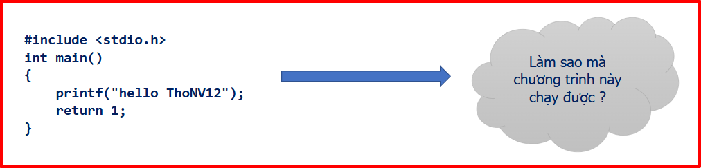   
</p>

***Pre-compiling***
+ Cú pháp
> gcc –E hello.c –o hello.i​
+ Thực hiện:
    + Loại bỏ comments​
    + Mở rộng các macros​
    + Mở rộng các include file​
    + Biên dịch các câu lệnh điều kiện​
    + Kết quả thu được sau bước này là một file ".i"

***Compilation***
+ Cú pháp
> gcc –S hello.i –o hello.S​
+ Thực hiện:
    + Ở giai đoạn này, mã nguồn sẽ tiếp tục thực hiện biên dịch từ file ".i" thu được ở bước trước thành một file ".s" ( assembly).​

***Assembly***
+ Cú pháp
> gcc -c hello.S -o hello.o​
+ Thực hiện:
    + File ".s" ở giai đoạn trước tiếp tục được sử dụng cho giai đoạn này.​
    + Thông qua assembler, output mà chúng ta thu được là một file ".o". ​

***Linking***
+ Cú pháp
> gcc –o hello hello.o​
+ Thực hiện:
    + Mỗi một file ".o" thu được ở gian đoạn Assembly là một phần của chương trình. ​
    + Ở giai đoạn linking sẽ liên kết chúng để thu được một file thực thi hoàn chỉnh.​

Như vậy theo thứ tự compile thì đuôi của các file sẽ là:
> .c ---> .i ---> .s ---> .o ---> .exe
​

### 2️⃣ Makefile
***Định Nghĩa​***
+ Make utility là một công cụ phần mềm dùng để quản lý và bảo trì các chương trình máy tính bao gồm nhiều tệp thành phần. Make utility tự động xác định những phần nào của một chương trình lớn cần được biên dịch lại và đưa ra các lệnh để biên dịch lại chúng.

+ Makefile thiết lập một tập hợp các quy tắc để xác định những phần nào của một chương trình cần được biên dịch lại và đưa ra các lệnh để biên dịch lại chúng.

+ Makefile là một cách tự động hóa quy trình xây dựng phần mềm và các tác vụ phức tạp khác với các phần phụ thuộc.

+ Makefile contains: dependency rules, macros and suffix(or implicit) rules.​

+ Make file là một script bên trong có chứa các thông tin:​
    + Cấu trúc của một project(file, dependency).​
    + Các command line dùng để tạo-hủy file.​

+ Chương trình make sẽ đọc nội dung trong Makefile ​và thực thi nó​

***Cấu trúc của một makefile​***
<p align="center">
  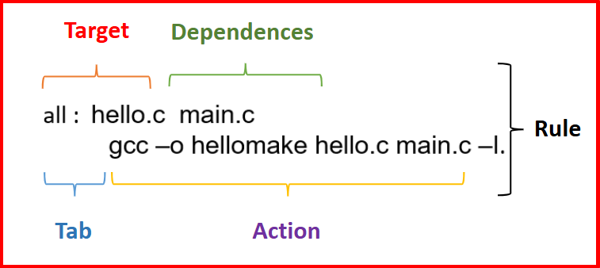   
</p>
<p align="center">
  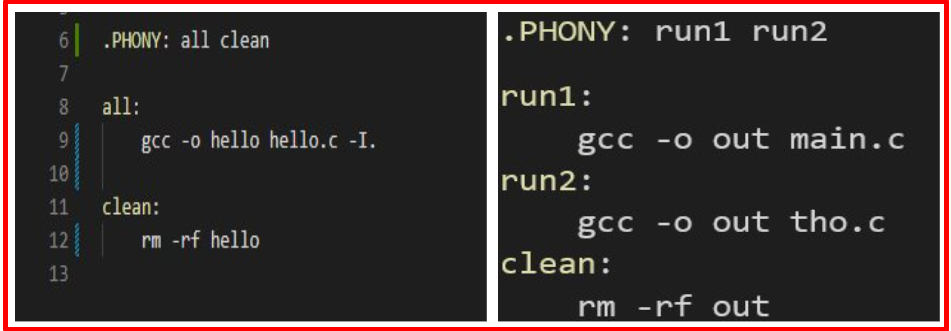   
</p>

+ Giải thích sơ bộ về ảnh trên:
    + Chạy "make run2": nó sẽ tự chạy “gcc –o out tho.c” cho mình.​
    + Nếu chạy "make" nó sẽ chạy run1.​
    + Sử dụng biến .PHONY để tránh tên run1, không bị trùng tên với tên các file mình tạo​
    + Nếu có Makefile và abc.mk thì để chạy abc.mk thì make –f abc.mk​

+ Makefile dependency rule
    + Target là file hoặc thứ cần được tạo ra.
    + A phony target là mục tiêu không thực sự là tên của file.
    + Typing “make target” will:​
        + 1. Đảm bảo tất cả các dependencie đều được cập nhật.
        + 2. Nếu target cũ hơn bất kỳ dependency nào, hãy tạo lại nó bằng các specified command.
    + Theo mặc định, gõ "make" sẽ tạo mục tiêu đầu tiên trong Makefile.
    + The common target: all, clean, install, uninstall, distclean​
    + Điều kiện tiên quyết hoặc dependents là những tệp phải tồn tại trước khi mục tiêu có thể được tạo thành công.
    + Khi execute một rule, trước tiên tất cả các dependent phải được thỏa mãn. Nếu bất kỳ dependent nào không được thỏa mãn, chương trình make sẽ tìm rule để tạo dependent. Nó trông giống như một hàm đệ quy. Cho đến khi tất cả các dependent được thỏa mãn, các lệnh của rule sẽ được thực thi.

+ Makefile rule’s commands​
    + The command can be shell command, make function, macro​
    + Một số macro đặc biệt hữu ích khi sử dụng lệnh shell.
```bash
-: bỏ qua kết quả lệnh (tiếp tục nếu có lỗi).
clean:​
    -rm *.o *~ prog

@: do not echo the command (print the command)​
%.o: %.c​
    @echo "Compiling $? ...”"
    @$(CC) $(CFLAGS) -c $?
```

+ -f file: Use file as a makefile.​
+ -i: Ignore all errors in commands executedto remake files.​
+ -n: Print the commands that would be executed, but do not execute them.

+ Makefile special macro​
```bash
$@ The file name of the target.​
$< The name of the first dependency.​
$* The part of a filename which matched a suffix rule.​
$? The names of all the dependencies newer than the target separated by spaces (changed dependents).​
$^ The names of all the dependencies separated by spaces, but with duplicate names removed.​
$+ The names of all the dependencies separated by spaces with duplicate names included and in the same order as in the rule.​
```
<p align="center">
  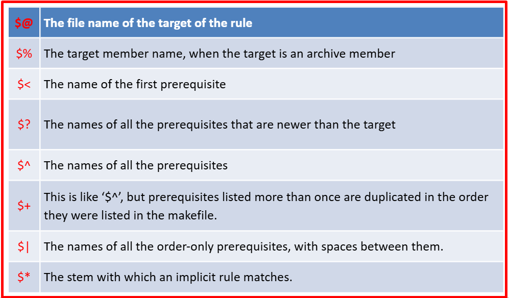   
</p>

+ Makefile conventional macro​
<p align="center">
  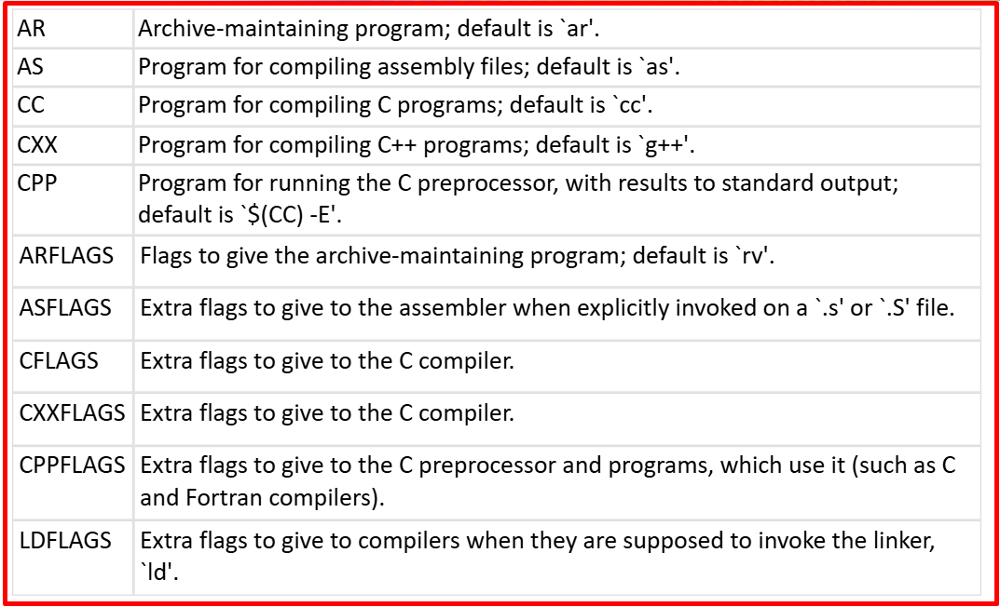   
</p>

+ Debug Makefile​
```bash
--just-print: print every command it would execute without executing them.​
--print-data-base: it will dump the internal database (variables, directories, implicit rules, files, search path).​
--warn-undefined-variables: print warning when undefined variable was used.​
--debug: print most detailed information. Have 5 options, basic, verbose, implicit, jobs, all​
```

***Phép gán và include trong makefile***
+ Gán đệ quy​: Bất cứ khi nào biến var thay đổi giá trị thì biến var1 cũng thay đổi theo
+ Gán bình thường​: Giống như copy giá trị tại thời điểm đó thôi
+ Gán kiểm tra​: Kiểm tra xem var3 có giá trị chưa, nếu chưa có thì gán bằng var, còn có rồi thì thôi
+ Include trong makefile: ​Include thì như copy nguyên file được include rồi bỏ vào vị trí include thôi
<p align="center">
  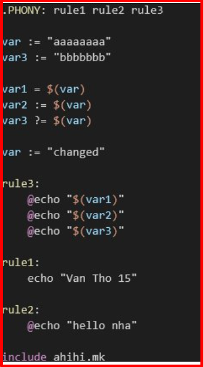   
</p>

***Các kí hiệu đặc biệt***
+ $@ là giá trị trước dấu “:”   ( Test )​
+ $< là giá trị đầu tiên phía sau dấu “:”  ( hello.h )​
+ $^ là tất cả giá trị phía sau dấu “ : ”  ( hello.h hello.c )​
<p align="center">
  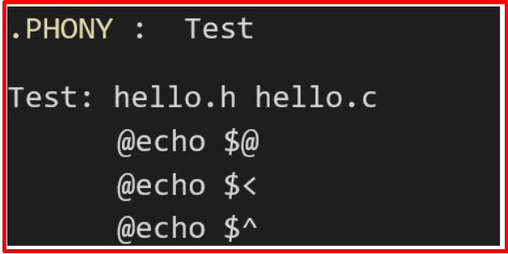   
</p>

***Ví dụ về rule ẨN***
+ Makefile mặc định sẽ chạy các rule ẩn như trong ví dụ dưới
<p align="center">
  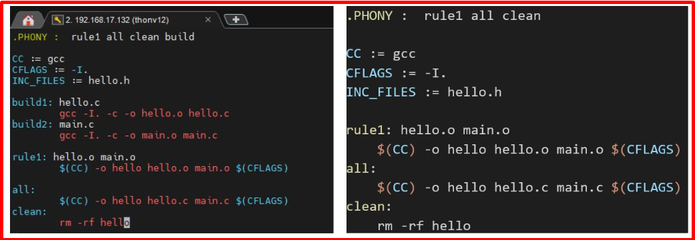   
</p>
<p align="center">
  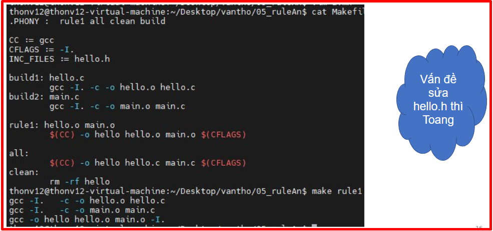   
</p>

+ Cách khắc phục
<p align="center">
  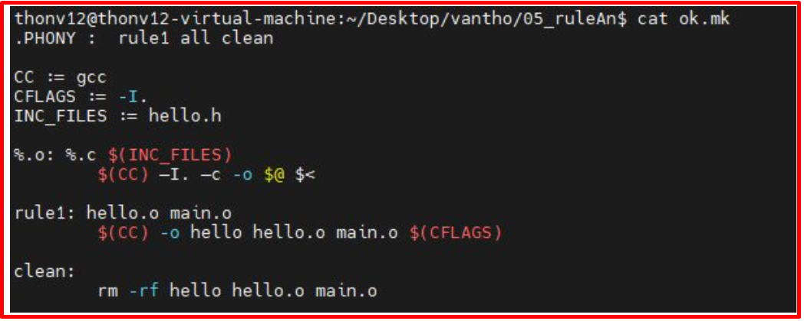   
</p>

***Static Lib và Share Lib​***
+ Cấu trúc folder​
<p align="center">
  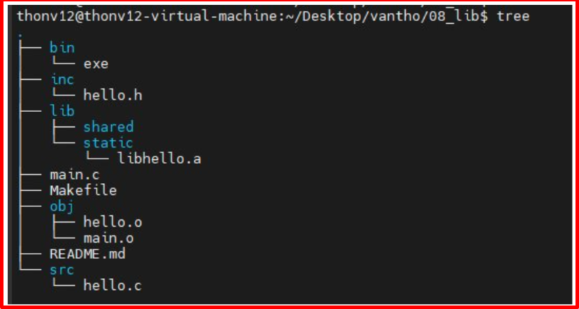   
</p>

+ Static Lib và Share Lib​: Như tên thì chúng được chia làm 2 loại.
<p align="center">
  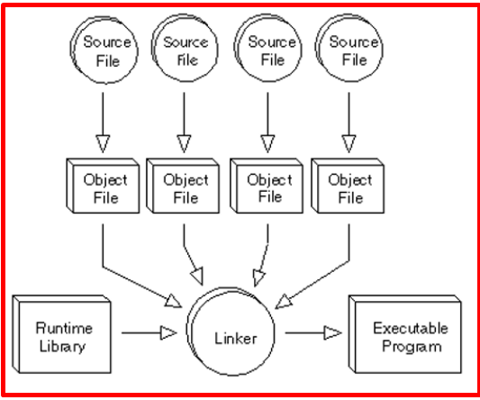   
</p>

+ So sánh Static Lib và Share Lib
<p align="center">
  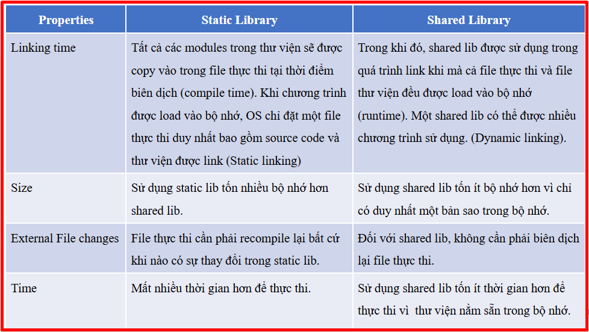   
</p>

+ Các bước để tạo static lib:
    + Ban đầu mình có folder inc, src, file main.c và makefile như ảnh dưới
    <p align="center">
    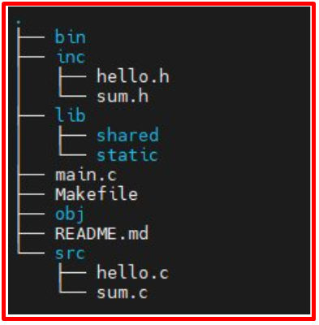   
    </p>
    + Bước 1: Mình tạo các file object từ các file .c 
    <p align="center">
    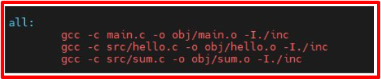   
    </p>
    + Bước 2: Tạo ra static library, bằng cách link các file .o lại với nhau, bản chất là nó link các hàm lại với nhau​.
    <p align="center">
    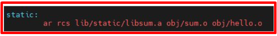   
    </p>
    + Bước 3: Từ file main.o và file libhello.a để build ra file thực thi.​
        + Thêm “-L” vào đường dẫn của file.a , thêm “-l” và bỏ kí tự “lib” và “.a” khi đó libhello.a sẽ trở thành “-lhello” là được​
    <p align="center">
       
    </p>

***Các cú pháp khác***
+ vpath: Search tất cả các file trong đường dẫn​
<p align="center">
    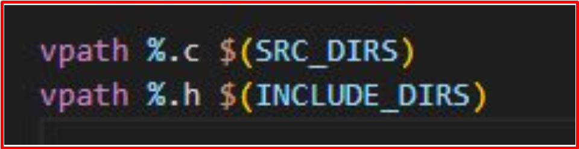   
</p>

+ Wildcard: Lấy tất cả đường dẫn trong folder​
<p align="center">
    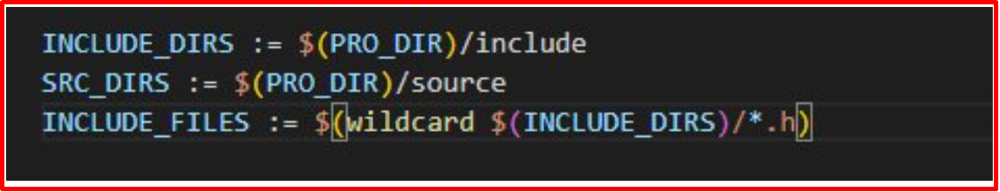   
</p>

+ Subst: Thay thế ​
<p align="center">
    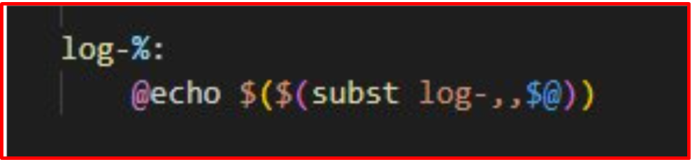   
</p>

+ Foreach: Như For​ ​
<p align="center">
    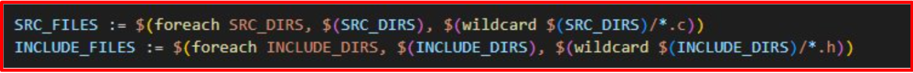   
</p>

+ Notdir: Không lấy đường dẫn​​ ​
<p align="center">
    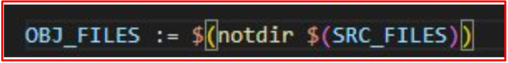   
</p>

+ The Function in Makefile​: 
```bash
    + Function Call Syntax $(function arguments) or ${function arguments}
        + $(wildcard pattern)​: 
            + eg: CSRCS= $(wildcard *.c)​
        + $(patsubst pattern,replacement,text)​: 
            + eg: OBJS+= $(patsubst  %.c,  %.o,  $(CSRCS))
        + $(shell dirname $@)​: 
            + eg: @mkdir -p $(shell dirname $@)​
```

***Example***
<p align="center">
    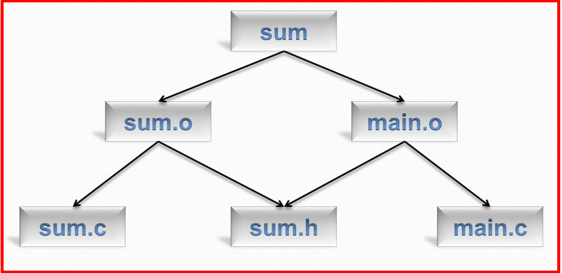   
</p>

<p align="center">
    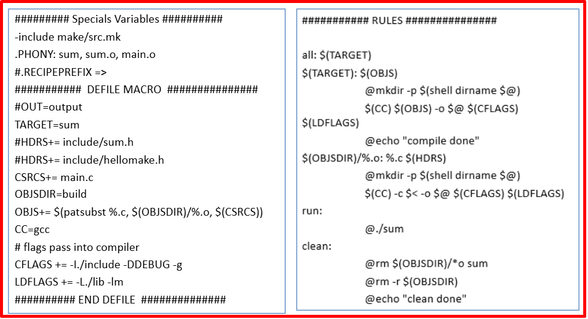   
</p>

+ Compile without Makefile​
```bash
Compile program​
    gcc -c main.c sum.c multiply.c​
    gcc -o prog main.o sum.o multiply.o​

Change one file & recompile​
    gcc -c main.c​
    gcc -o prog main.o sum.o multiply.o​
```

+ Simple Makefile
```bash
CC=gcc​
CFLAGS= -c -Wall​
LDFLAGS=​
all: prog​
prog: main.o sum.o multiply.o​
    $(CC) $(LDFLAGS) main.o sum.o multiply.o -o prog​
main.o: main.c​
    $(CC) $(CFLAGS) main.c​
sum.o: sum.c​
    $(CC) $(CFLAGS) sum.c​
multiply.o: multiply.c​
    $(CC) $(CFLAGS) multiply.c​
clean:​
    rm -f *.o; rm -f prog; ​
```

+ Makefile with pattern rule
```bash
CC=gcc​
CFLAGS= -c -Wall​
LDFLAGS=​
all: prog​
prog: main.o sum.o multiply.o​
    $(CC) $(LDFLAGS) -o $@ $^​
%.o: %.c​
    @echo “Compiling $? …”​
    @$(CC) $(CFLAGS) $?​
clean:​
    -rm -f *.o; rm -f prog; ​
```

## ✔️ Conclusion
Như vậy ở bài này mọi người đã có thêm kiến thức về makefile và có thể viết các makefile để build các source code. Đây sẽ là nền tảng để mọi người làm và đọc tiếp các bài tiếp theo.

## 💯 Exercise
+ Download source code về và viết file makefile để compile source code trên.
+ Source code bài tập: [LINK](https://drive.google.com/file/d/1zhrB8LAIYzKtY1k1yEGD6VqxYpvUVIzT/view?usp=sharing)

## 📺 NOTE
+ Source code: [Code](https://drive.google.com/file/d/1IwuCFpadsZpDR_GZV6BjrGJNt8WleOwQ/view?usp=sharing)
+ Video 1 : [Video Youtube](https://www.youtube.com/watch?v=bcPaCEhnXEQ)
+ Video 2 : [Video Youtube](https://www.youtube.com/playlist?list=PLE9xJNSB3lTEUHJLH9uYft14Xwwmt5AiT)

## 📌 Reference

[1] Books/make.pdf

[2] https://www.gnu.org/software/make/manual/make.html

[3] https://eslinuxprogramming.blogspot.com/2015/07/gnu-make-gmake.html

[4] https://en.wikipedia.org/wiki/Make_(software) 

[5] https://renenyffenegger.ch/notes/development/languages/C-C-plus-plus/GCC/create-libraries/index​ 

[6] https://eslinuxprogramming.blogspot.com/