# 💚 Virtual_File_System 💛

## 👉 Introduction and Summary 
### 1️⃣ Introduction
+ Ở bài trước chúng ta đã biết về Makefile trong linux cũng như các cú pháp và các thực hành với nó. Nếu các bạn chưa xem thì vào link này nha [003_Makefile.md](../003_Makefile/003_Makefile.md). Ở bài này chúng ta sẽ tìm hiểu về Virtual File System. Các OS họ Unix như Linux, MacOS, Qnx đều có tư tưởng là quản lý mọi thứ bằng file, ví dụ như các device thì cũng coi như là file (device file system), network file system... Vì nguyên nhân trên nên để hiểu được sâu luồng tương tác từ user đến hardware thì ta cần phải hiểu được luồng đi của File system trong linux.
### 2️⃣ Summary
Nội dung của bài viết gồm có những phần sau nhé 📢📢📢:
- [I. Introduction and Summary](#👉-introduction-and-summary)
    - [1. Introduction](#1️⃣-introduction)
    - [2. Summary](#2️⃣-summary)
- [II. Contents](#👉-contents)
    - [1. VFS Virtal File System](#1️⃣-vfs-virtual-file-system)
    - [2. File System](#2️⃣-file-system)
    - [3. File Lock](#3️⃣-file-lock)
- [III. Conclusion](#✔️-conclusion)
- [IV. Exercise](#💯-exercise)
- [V. NOTE](#📺-note)
- [VI. Reference](#📌-reference)

## 👉 Contents
### 1️⃣ VFS Virtal File System

***Giới thiệu***
+ Các version đầu của Unix chưa có khái niệm Virtual File System mà chỉ có khái niệm File System, File system để quản lý đọc ghi trên ổ cứng còn các cái như network, bàn phím thì không có file system. Nhìn chung system được thiết kế riêng cho target hardware. Bây giờ thì mọi thứ đều coi là file như device file system, network file system... Mà mỗi loại thiết bị sẽ có những đặc điểm, tính chất riêng như network thì cần timeout để đồng bộ thông tin... Vì cơ chế đọc ghi dữ liệu trên mỗi loại thiết bị khác nhau là khác nhau nên Linux mới sinh ra các loại file system khác nhau. Khi có Virtual File System rồi thì việc lập trình sẽ dễ dàng hơn, ví dụ như socket thì chúng ta cũng chỉ open và đọc ghi với socket tương tự như file. 

+ Vì vậy trong các OS về sau đã đưa ra 1 cơ chế gọi là VFS(Virtual File System). VFS nghĩa là có nhiều FS(File System) như nfs(Network File System), ext4(Hard disk) chạy trên các hardware riêng biệt, và sẽ có 1 lớp ở trên cùng để gộp chung lại các FS(File System) gọi là VFS(Virtual File System). Sau khi có VFS rồi thì tầng User sử dụng chỉ còn 1 khái niệm duy nhất là FILE
<p align="center">
  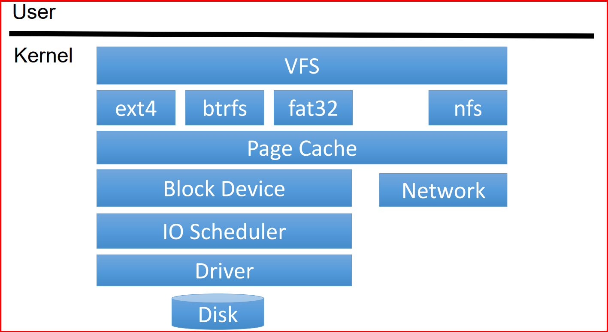   
</p>

+ Cấu trúc dữ liệu cơ bản mà VFS cung cấp: VFS cung cấp 4 struct như bên dưới
    + Super Block: Chứa thông tin của File System đấy. Như network thì sẽ chứa thông tin về timeout, IP, Tốc độ truyền ... Đồng thời nó cũng quyết định luôn khi nào ghi data từ Cache vào disk, vì nhiều khi mình đọc ghi file thì chỉ là đang đọc ghi vào cache thôi chứ không phải là disk thực.
    + inode (index node): Mỗi 1 file được tạo ra thì đều có 1 inode tương ứng kèo theo, và nó chứa các metadata của file đấy như quyền, size, ngày chỉnh sửa, tên ...
    + dentry (directory entry): Thể hiện sự liên kết file như file này liên kết đến file nào, file này nằm trong folder nào.
    + file object: pointer to dentry and cursor (file offset)
    + File description: Chứa các hàm đọc ghi của file đấy
<p align="center">
  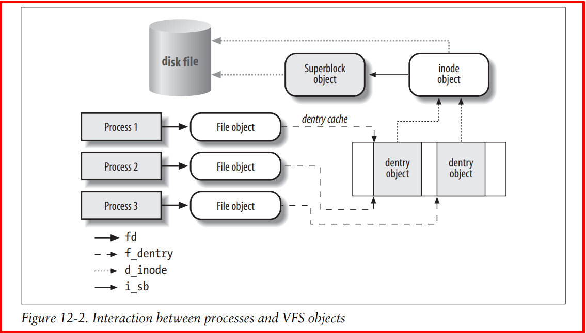   
</p>

***Symbolic links và Hard link***
+ Symbolic links hay còn gọi là softlink: 
    + Nó giống như Shortcut bên windows
    + Được tạo bằng system call symlink()
    + Tạo ra 1 file liên kết tương trưng để trỏ tới file kia
    + ln -s [file nguồn] [file đích]
    + Ta tạo file softlink.txt để softlink tới file hula.txt mà số inode của 2 file là khác nhau
    + Khi này ta đọc file softlink.txt sẽ ra nội dung của file hula.txt
    + Khi xóa file hula.txt thì sẽ không đọc file softlink.txt được nữa vì còn gì nữa đâu mà link
<p align="center">
  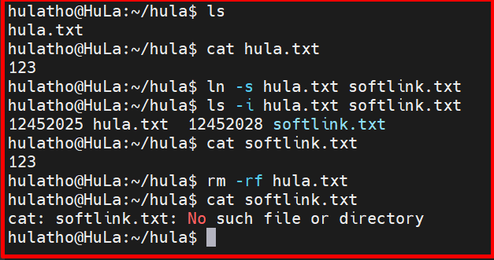   
</p>

+ Hard link: 
    + Khi ta tạo 1 file mới trên Disk thì mặc định ta sẽ có 1 inode trỏ tới file đó. Tuy nhiên khi ta tạo thêm 1 hardlink nữa thì khi này sẽ có thêm 1 inode được tạo và khi này cả 2 inode đều trỏ tới file trên disk kia
    + Cú pháp: ln [file nguồn] [file đích]
    + Ta thấy inode của 2 file hula.txt và hardlink.txt là như nhau
    + Khi xóa file hula.txt thì file hardlink.txt vẫn còn nguyên
    + Khi sử dụng lệnh rm để xóa file thì làm giảm đi một hard link. Khi số lượng hard link giảm còn 0 thì không thể truy cập tới nội dung của file được nữa
<p align="center">
  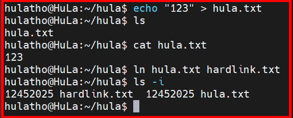   
</p>

+ So sánh Symbolic links và Hard link
<p align="center">
  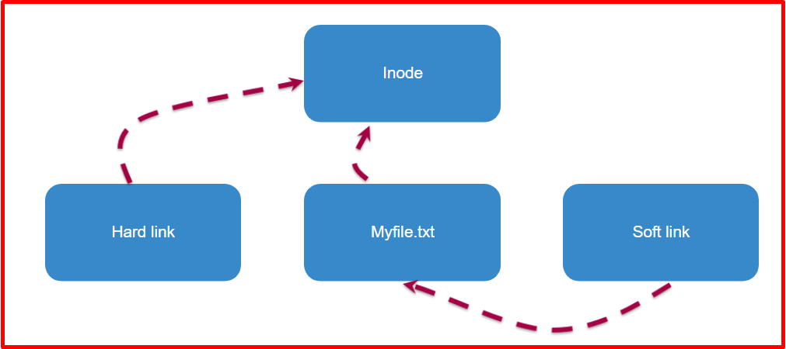   
</p>
<p align="center">
  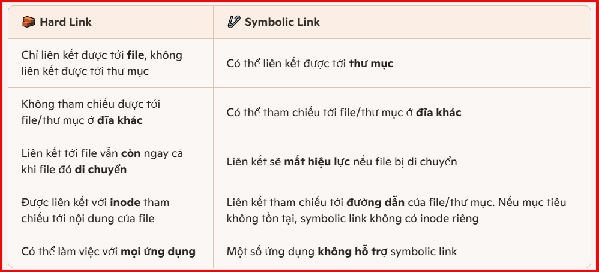   
</p>

***Trace luồng***
+ Để trace luồng VFS ta sẽ đi ngược lại theo ảnh dưới
<p align="center">
     
</p>

+ Vào link bất kì 1 kernel sau đó vào fs/ubifs để trace thằng này: https://github.com/renesas-rz/rz_linux-cip/tree/linux-4.19.y-cip/fs/ubifs

+ Vào file super.c và trace từ function ubifs_init, khi này ta thấy nó đi register 1 filesystem là ubifs_fs_type, ta sẽ đi ctrl F thằng ubifs_fs_type này

<p align="center">
  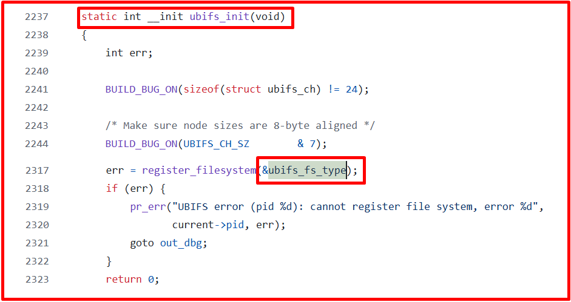   
</p>

+ Khi này, ta sẽ thấy struct "struct file_system_type ubifs_fs_type", mà trong struct này có phần tử mount tới ubifs_mount. Ta lại đi ctrl F tiếp thằng ubifs_mount
<p align="center">
     
</p>

+ Thằng ubifs_mount là 1 function, và nó sẽ return về 1 struct dentry để mô tả cây thư mục này đang chứa chứa những gì. Tiếp theo, trong function này sẽ gọi function ubifs_fill_super để điền các thông tin của Super Object vào. Vậy ta sẽ đi ctrl F thằng ubifs_fill_super
<p align="center">
  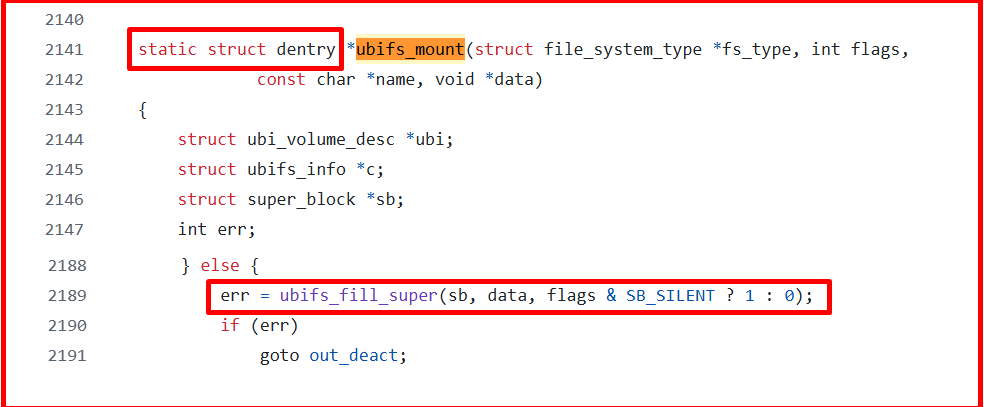   
</p>

+ Trong function ubifs_fill_super sẽ đi gán các cái super operation vào. Vậy ta lại đi ctrl F thằng ubifs_super_operations để xem có những operation gì
<p align="center">
  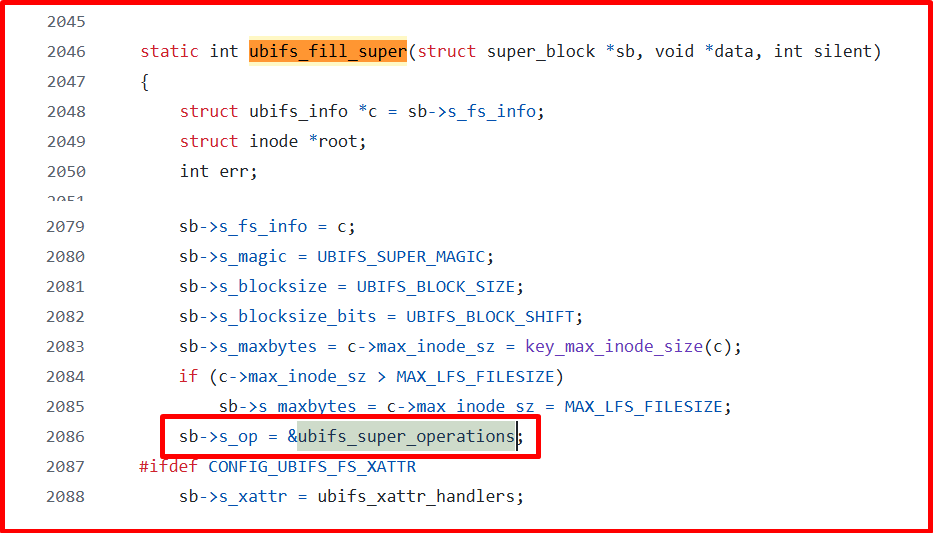   
</p>

+ Có thể thấy các operation của ubifs_super_operations như ảnh dưới. Vây giờ ta sẽ đi làm thằng dentry và kobject nữa là đủ luồng.
<p align="center">
  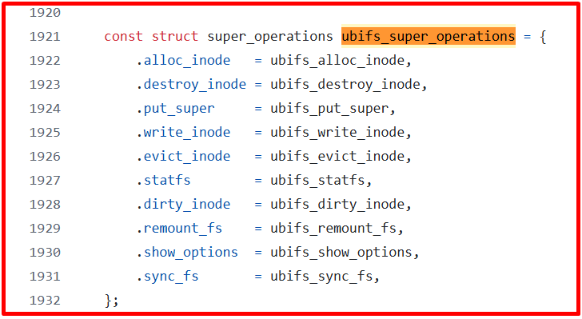   
</p>

+ File [file.c](https://github.com/renesas-rz/rz_linux-cip/blob/linux-4.19.y-cip/fs/ubifs/file.c) trong fs/ubifs, ta sẽ thấy struct const struct file_operations ubifs_file_operations như bên dưới. Mà trong file [dir.c](https://github.com/renesas-rz/rz_linux-cip/blob/linux-4.19.y-cip/fs/ubifs/dir.c) lại có function ubifs_new_inode, function này sẽ gán các hoạt động của inode operation với ubifs_file_operations.
<p align="center">
     
</p>
<p align="center">
  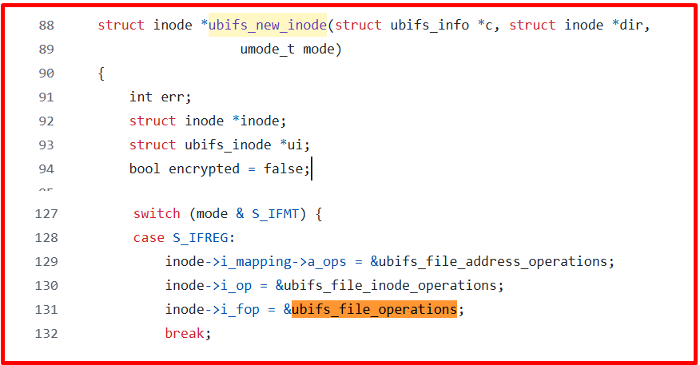   
</p>

### 2️⃣ File System
***Giới thiệu***
+ Các hệ điều hành trước Unix đã có hệ thống file system. Tuy nhiên đến lượt mình thì Unix nâng cấp chúng thêm một bậc nữa. Hệ thống sẽ coi toàn bộ các đối tượng tồn tại trong nó đều là file. Các đối tượng đó có thể là các hardware device, process, user... Từ đó hệ thống có thể quản lý tất cả các đối tượng thông qua một phương thức duy nhất đó là tương tác qua file

+ Trong Unix file có thể hiểu như một định danh vì nhiều khi nó đại diện cho dữ liệu nằm trên ổ cứng hoặc một thiết bị nào đó. Ví dụ như các file đại diện cho từng process chúng nằm trong thư mục /proc/process_id. Mỗi một file sẽ có các thuộc tính ví dụ như kích thước, quyền sở hữu, ngày chỉnh sửa... Ngoài ra có 1 file dạng đặc biệt đó là thư mục. Thư mục là một file những dữ liệu bên trong nó chính là danh sách tên của các file nằm trong nó.

+ Việc tổ chức các file vào trong các thư mục và tạo các thư mục con trong thư mục cha nhằm phân cấp và sắp xếp hệ thống file người ta còn gọi chúng với cái tên cây thư mục. Cây thư mục có các node lá là file, node cành là các thư mục vào node gốc là thư mục root của hệ thống. 

***Các loại file trong Linux***
```bash
Regular file: là các file thông thường như text file, executable file.​
Directories file: file chứa danh sách các file khác.​
Character Device file: file đại diện cho các thiết bị không có địa chỉ vùng nhớ.​
Block Device file: file đại diện cho các thiết bị có địa chỉ vùng nhớ.​
Link files: file đại diện cho một file khác.​
Socket file: file đại diện cho 1 socket.​
Pipe file: file đại diện cho 1 pipe.​
```

Hầu hết các tệp trong Linux là tệp tin thường hoặc tệp tin thưc mục, ngoài ra còn một số loại tệp tin đặc biệt khác. Dưới đây liệt kê tất cả các loại tệp tin trong Linux: 
+ Tệp tin thường (regular file). Là loại tệp tin phổ biến nhất trong Linux, nó chứa dữ liệu ở một định dạng nào đó. Kernel không phân biệt nếu dữ liệu này là text hay binary. Nội dung dữ liệu của một tệp tin thường sẽ do các ứng dụng trên tầng user sử lý. (Ngoại trừ duy nhất một loại tệp tin là tệp tin có thể thực thi. Để thực thi một tệp tin thì kernel phải hiểu được cấu trúc của nó. Tất cả các tệp tin có thể thực sẽ theo một chuẩn nào đó để kernel xác định được đâu là vùng text và vùng data của chương trình). 
+ Tệp tin thư mục (directory file). Là loại tệp tin chứa tên của các các tệp tin khác cùng với các con trỏ tới thông tin của các tệp tin này. Bất kì process nếu có quyển đọc một thư mục nào đó thì nó cũng có thể đọc được nội dung dữ liệu của tệp tin thưc mục, nhưng chỉ có kernel mới có có thể ghi trực tiếp vào tệp tin thưc mục. Các process muốn thay đổi dữ liệu của tệp tin thưc mục phải dùng một số hàm đặc biệt. 
+ Các loại file đặc biệt khác như block file, character file, FIFO, Socket, symbolic link. Chúng là những tệp tin không nằm trên ổ cứng: 
  + Tệp tin block (block special file). Là một loại tệp tin cho phép đọc dữ liệu từ các thiết bị theo dạng các buffer có kích thước cố định. Ví dụ như ổ đĩa 
  + Tệp tin character (character special file). Là loại tệp tin cho phép đọc dữ liệu từ các thiết bị mà không bị ép buộc về kích thước cố định của mỗi lần đọc. Tất các các thiết bị phần cứng trong hệ thống đều là một tệp tin block hoặc character. 
  + FIFO: Là một loại tệp tin dùng trong giao tiếp giữa các process với nhau. 
  + Socket: Là một loại tệp tin dùng trong giao tiếp mạng giữa các process với nhau. 
  + Tệp tin liên kết (symbolic link). Là một loại tệp tin trỏ đến một tệp tin khác. 

+ Command hiển thị thông tin file:
    + ls -l
    + ls -a
    + ls -h

<p align="center">
  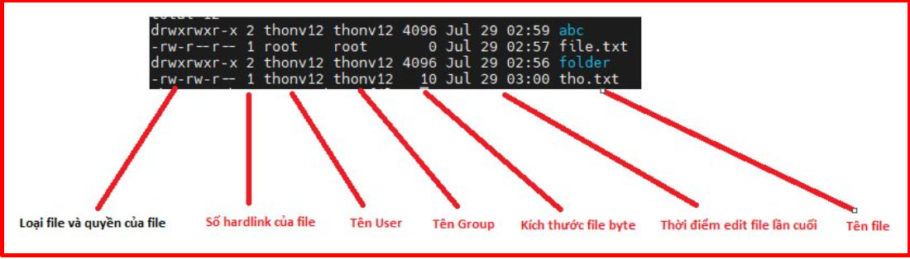   
</p>

```bash
- Chữ R:    là Regular file​
- Chữ D:    là Directories file​
- Chữ C:    là Character Device file​
- Chữ B:    là Block Device file​
- Chữ L:    là Link files​
- Chữ S:    là Socket file​
- Chữ P:    là Pipe file​
- Dấu "-":  là file thông thường​
```

***Thay đổi quyền file***
+ Để thay đổi quyền của file ta dùng câu lệnh chmod. Có thể vào [LINK NÀY](https://chmod-calculator.com/​) để xem quyền trực quan hơn
```bash
chmod 744 Name_file​
chmod o+r test.txt: thêm quyền read.​
chmod u-r test.txt: bỏ quyền read.​
```
<p align="center">
     
</p>
<p align="center">
     
</p>

***System call***
+ System call table:
  + Bảng này sẽ có trường tên, khi mà user call system call này thì kernal chỉ việc xem trong bảng này là system call đó thuộc hàng bao nhiêu và ở hàng đấy sẽ có địa chỉ là bao nhiêu. Sau đó gọi ra handler ở địa chỉ đấy. Hơi giống kiểu xử lý ngắt
  + Có thể đọc bảng này ở trong file: https://github.com/torvalds/linux/blob/v4.3/arch/x86/entry/syscalls/syscall_64.tbl
<p align="center">
  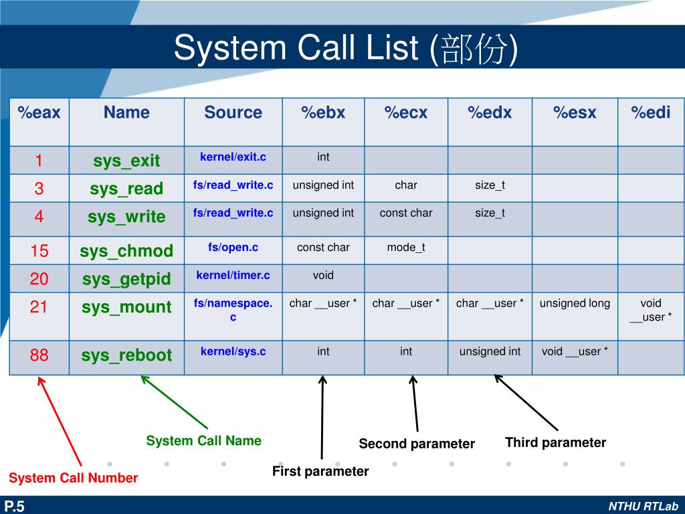   
</p>

+ Cơ chế khi gọi 1 system call
  + Hàm printf bản chất là hàm write và nó sẽ write ra stdout. 
  + Sau đó hàm write được xử lý bằng assembly. Nó đi push system call number vào thanh ghi chứ tham số đầu tiên và gọi ra cái ngắt của system call
  + Khi gọi ngắt rồi thì OS duyệt trong bảng ngắt để gọi handler của ngắt đấy. Trong ngắt của hàm đấy sẽ gọi systemcall và truyền vào param là number của system call.
  + Sau đó dùng kiểu con trỏ và truy cập vào system call table để gọi đúng được system call thực
<p align="center">
  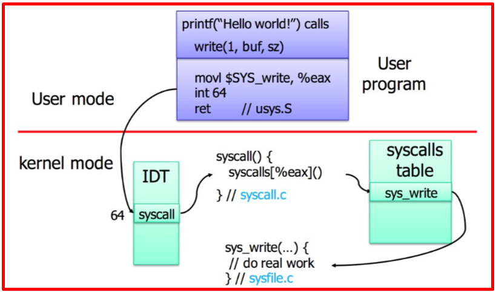   
</p>


+ Kernel cung cấp các system call cơ bản như sau:​
    - open()  mở một file đã tồn tại hoặc tạo mới một file​
    - read() đọc dữ liệu của một file đang mở​
    - write() ghi dữ liệu vào một file đang mở​
    - lseek() di chuyển vị trí con trỏ file để thực hiện lệnh đọc ghi​
    - close() đóng file​

+ System call Open:
```bash
int open(const char *pathname, int flags, mode_t mode);​
    + pathname: là đường dẫn file​
    + flags: là quyền của file đó​
        - O_RDONLY read-only​
        - O_WRONLY write-only​
        - O_RDWR read/write​
        - O_EXEC Mở để chỉ thực thi 
        - O_SEARCH Mở để chỉ tìm kiếm (dùng cho thử mục) 
        Một và chỉ một trong năm hằng số bên trên là cần thiết phải đưa ra. Các hằng số tiếp sau đây là tùy chọn
        - O_APPEND Ghi vào cuối tệp tin
        - O_CLOEXEC Bật FD_CLOEXEC trong cờ file descriptor 
        - O_CREAT Tạo một file nếu nó chưa tồn tại. Tùy chọn này yêu cầu truyền vào tham số thứ ba trong hàm open (tham số thứ tư trong hàm openat)
        - O_DIRECTORY Trả về lỗi nếu tham số path không phải là thư mục
        - O_EXCL Trả về lỗi nếu dùng chung với tùy chọn O_CREAT và file đã tồn tại. Nó dùng để kiểm tra sự tồn tại của một tệp tin
        - O_NOFOLLOW Trả về lỗi nếu tham số path là symbolic link
        - O_NONBLOCK Nếu path là một FIFO, một loại tệp tin block hoặc character đặc biệt thì tùy chọn này sẽ cho phép mở và đọc ghi file không bị block 
        - O_SYNC Mỗi quá trình đọc ghi sẽ chờ cho dữ liệu được đồng bộ phần cứng
        - O_TRUNC Nếu một file đã tồn tài và mở thành công thì xóa toàn bộ dữ liệu của tệp tin
    + mode là cái chmod : 0777​
File descriptor trả về bởi hàm open luân luân là số nhỏ nhất chưa được sử dụng
```

+ System call Close:
```bash
int close(int fd)
  + Return về 0 nếu thành công, -1 nếu lỗi
  + Để đóng một file chúng ta dùng hàm close 
  + Đóng một tệp tin sẽ đồng thời giải phóng tất cả các khóa (record locks) mà một tiến trình sử dụng trên tệp tin. Khi một tiến trình bị đóng, tất cả các tệp tin mở bởi tiến trình sẽ bị đóng một cách tự động bởi kernel. Chình vì thế mà thực tế nhiều chương trình không trực tiếp đóng tệp tin khi sử dụng xong. 
```

+ System call Lseek:
```bash
off_t lseek(int fd, off_t offset, int whence);​
    + lseek(): Đưa con trỏ file tới vị trí thứ mấy.​
    + whence:​
      - Nếu whence là SEEK_SET, giá trị offset của tệp tin sẽ là offs tính từ đầu tệp tin
      - Nếu whence là SEEK_CUR, giá trị offset của tệp tin sẽ là giá trị hiện tại của nó cộng thêm offs. offs có thể là số dương hoặc âm
      - Nếu whence là SEEK_END, giá trị offset của tệp tin sẽ là kích thước của tệp tin cộng thêm offs. offs có thể là số dương hoặc âm
    + Mỗi tệp tin đều có một giá trị offset, thường là một số nguyên không âm, dùng để tính số byte tính từ đầu tệp tin đến vị trí hiện tại. Các hàm đọc ghi thường bắt đầu từ vị trí offset này của tệp tin và làm cho giá trị offset tăng lên bằng số số byte được đọc hoặc ghi. Mặc định, giá trị của offset được khởi tạo là 0 khi một tệp tin được mở, trừ khi chúng ta dùng tùy chọn O_APPEND. 
    + Giá trị offset của tệp tin có thể được gán trực tiếp bằng hàm lseek 
    + Vì giá trị trả về của hàm lseek là giá trị offset mới của tệp tin, chúng ta có thể tính được giá trị offset hiện tại của tệp tin bằng cách dịch chuyển 0 byte từ vị trí hiên tại
      off_t currpos; 
      currpos = lseek(fd, 0, SEEK_CUR); 
```

+ System call Read:
```bash
#include <unistd.h>
ssize_t read(int fd, void *buf, size_t count);
  + Dữ liệu trong một tệp tin đã mở được đọc ra bằng hàm read
  + Nếu đọc thành công, hàm trả về số byte đọc được. Nếu đọc đến cuối tệp tin hàm trả về 0. Trong một số trường hợp số byte đọc được sẽ ít hơn số byte yêu cầu
  + Khi đọc một tệp tin bình thường, nếu đọc đến cuối tệp tin mà chưa đủ số byte yêu cầu. Ví dụ: nếu một tệp tin có 30 byte mà ta yêu cầu đọc 100 byte thì giá trị trả về sẽ là 30. Trong lần đọc tiếp theo, giá trị trả về sẽ là 0
  + Hàm đọc bắt đầu từ vị trí offset của tệp tin. Trước khi hàm đọc trả về thành công thì giá trị offset sẽ được tăng lên một khoảng bằng số byte đọc được
```

+ System call Write:
```bash
#include <unistd.h>
ssize_t write(int fd, const void *buf, size_t count);
  + Dữ liệu được ghi vào tệp tin đã mở bằng hàm write
  + Giá trị trả về luân bằng tham số truyền vào nbytes; nếu không đúng thì tức là đã xảy ra lỗi. Lỗi sinh ra khi dùng hàm write thường là do ổ đĩa đã bị đầy hoặc đã đạt tới giới hạn bộ nhớ của một process. 
  + Với một tệp tin thông thường, việc ghi sẽ bắt đầu từ vị trí offset hiện tại của tệp tin. Nếu ta khai báo tùy chọn O_APPEND khi mở tệp tin thì offset sẽ ở vị trí cuối tệp tin mỗi lần ghi. Sau khi ghi thành công, giá trị offset sẽ tăng lên một khoảng bằng số byte đã được ghi. 
```

+ System call ioctl:
  + ioctl là một hàm đa chức năng. Tất cả những gì không làm được khi sử dụng các hàm trên thì thường sẽ làm được khi dùng hàm ioctl. Thiết bị vào ra chuẩn là ví dụ điển hình về việc sử dụng hàm ioctl. Để xử lý được hàm ioctl thì trong driver của thiết bị phải khai báo hàm handle. 
```bash
#include <sys/ioctl.h>
int ioctl(int fd, unsigned long request, ...);
  + Return -1 nếu lỗi, ngược lại thì thành công
  + ioctl là một system call dùng để điều khiển các thiết bị bằng cách truyền dữ liệu xuống driver của thiết bị đó. Tham số đầu tiên fd là file descriptor của thiết bị cần điều khiển, nó được trả về từ hàm open. Tham số thứ hai là một số nguyên, nó là mã lệnh điều khiển thiết bị. Dấu ba chấm cuối cùng để chỉ ra rằng có thể còn nhiều tham số nữa. Thông thường thì ta chỉ sử dụng thêm một tham số, nó thường là con trỏ trỏ đến biến hoặc struct. 
```

  + ioctl trên tầng user
```bash
#include <stdio.h> 
#include <sys/ioctl.h> 
#include <sys/types.h> 
#include <fcntl.h> 
#include <string.h> 
#include "mystruct.h" 

char *filename = "/dev/myioctl"; 
int fd; 

void get_vars(int fd) 
{ 
  my_variables v; 
  printf("\n\nioctl read variables\n"); 

  if (ioctl(fd, QUERY_GET_VARIABLES, &v) == -1) 
  { 
    perror("get_vars ioctl get"); 
  } 
  else 
  { 
    printf("Status\t: %d\n", v.status); 
    printf("Dignity\t: %d\n", v.dignity); 
    printf("Ego\t: %d\n", v.ego); 
  } 
} 

void set_vars(int fd) 
{ 
  int t; 
  my_variables v; 
  printf("Enter Status\t: "); 
  scanf("%d", &t); 
  getchar(); 

  v.status = t; 

  printf("Enter Dignity\t: "); 
  scanf("%d", &t); 
  getchar(); 

  v.dignity = t; 

  printf("Enter Ego\t: "); 
  scanf("%d", &t); 
  getchar(); 

  v.ego = t; 

  if (ioctl(fd, QUERY_SET_VARIABLES, &v) == -1) perror("set_vars ioctl set"); 
} 

int main(void) 
{ 
  fd = open(filename, O_RDWR); 
  if (fd == -1) 
  { 
    perror("main open"); 
    return -1; 
  } 
  set_vars(fd); 
  get_vars(fd); 
  return 0; 
} 
```
  + ioctl trên tầng driver
```bash
#include <linux/module.h> 
#include <linux/kernel.h> 
#include <linux/version.h> 
#include <linux/fs.h> 
#include <linux/errno.h> 
#include <linux/device.h> 
#include <linux/uaccess.h> 
#include <linux/init.h> 
#include <linux/printk.h> 

#include "mystruct.h" 
#define DEVICE_NAME "myioctl" 
#define CLASS_NAME "myioctl_device" 

MODULE_LICENSE("GPL"); 
MODULE_AUTHOR("HuLaTHo"); 

static struct class *myioctl_class; 
static struct device *myioctl_device; 
static int major_number; 
static int status = 1, dignity = 3, ego = 5; 

static long my_ioctl(struct file *i, unsigned int cmd, unsigned long arg) 
{ 
  my_variables v; 
  pr_info("%s: func called, cmd = %u", __func__, cmd); 
  switch (cmd) 
  { 
    case QUERY_GET_VARIABLES: 
    {
      v.status = status; 
      v.dignity = dignity; 
      v.ego = ego; 
      if (copy_to_user((my_variables *)arg, &v, sizeof(my_variables))) 
        return -EACCES; 
      break; 
    }
    case QUERY_CLR_VARIABLES: 
    {
      status = 0; 
      dignity = 0; 
      ego = 0; 
      break; 
    }
    case QUERY_SET_VARIABLES: 
    {
      if (copy_from_user(&v, (my_variables *)arg, sizeof(my_variables))) 
        return -EACCES; 
      status = v.status; 
      dignity = v.dignity; 
      ego = v.ego; 
      break; 
    }
    default: 
      return -EINVAL; 
  }

  return 0; 
} 

const struct file_operations query_fops = 
{ 
.owner = THIS_MODULE, 
.unlocked_ioctl = my_ioctl 
}; 

static int __init myioctl_init(void) 
{ 
  major_number = register_chrdev(0, DEVICE_NAME, &query_fops); 
  if (major_number < 0) 
  { 
    pr_info("%s: Khong cap phat duoc major number\n", __func__); 
    return major_number; 
  } 

  myioctl_class = class_create(THIS_MODULE, CLASS_NAME); 
  if (IS_ERR(myioctl_class)) 
  { 
    pr_info("%s: Khong dang ky duoc device classs\n", __func__); 
    return PTR_ERR(myioctl_class); 
  } 

  myioctl_device = device_create(myioctl_class, NULL, 
  MKDEV(major_number, 0), NULL, DEVICE_NAME); 
  if (IS_ERR(myioctl_device)) 
  { 
    pr_info("%s: Khong tao duoc device\n", __func__); 
    class_destroy(myioctl_class); 
    unregister_chrdev(major_number, DEVICE_NAME); 
    return PTR_ERR(myioctl_device); 
  } 
  pr_info("%s: Module created\n", __func__); 
  return 0; 
} 

static void __exit myioctl_exit(void)
{ 
  device_destroy(myioctl_class, MKDEV(major_number, 0)); 
  class_unregister(myioctl_class); 
  class_destroy(myioctl_class); 
  unregister_chrdev(major_number, DEVICE_NAME); 
  pr_info("%s: driver exit\n", __func__); 
} 
module_init(myioctl_init); 
module_exit(myioctl_exit); 
```

<p align="center">
  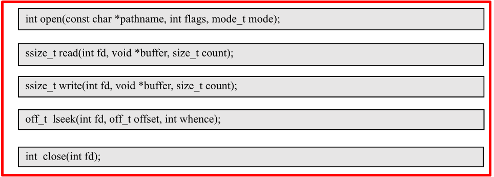   
</p>


+ Ví dụ cơ bản về thao tác đọc ghi file
```bash
#include<stdio.h> 
#include<string.h> 
#include<unistd.h> 
#include<fcntl.h> 
  
int main (void) 
{ 
    int fd; 
    int numb_read, numb_write;
    char buf1[12] = "hello world\n"; 
  
    fd = open("hula.txt", O_RDWR | O_CREAT , 0667);         
    if (-1 == fd) 
    { 
        printf("open() hula.txt failed\n");
    }      

    numb_write = write(fd, buf1, strlen(buf1));
    printf("Write %d bytes to hula.txt\n", numb_write);
  
    lseek(fd, 2, SEEK_SET);
    write(fd, "AAAAAAAAAAAA", strlen("AAAAAAAAAAAA"));
    
    close(fd); 
    return 0; 
} 
```

***Quản lý file trong linux***
+ Ở các phần trên chúng ta đã tìm hiều về các loại file và các hàm đọc ghi dùng cho các file thông thường – như mở, đọc hoặc ghi một file. Trong phần này, chúng ta sẽ tiếp tục tìm hiểu thêm các tính năng nâng cao hơn của hệ thống file system và các thuộc tính của một file, thư mục. Chúng ta bắt đầu bằng việc tìm hiểu về cấu trúc của cây thư mục trong Linux, tiếp theo là hàm stat và các thuộc tính của cấu trúc stat, ý nghĩa của từng thuộc tính của một file trong cấu trúc stat. Tiếp theo chúng ta sẽ tìm hiểu về các hàm dùng để thay đổi các thuộc tính này của file và thư mục. 

+ Hệ thống tệp tin (file system) là tập hợp tất cả các file có liên kết với nhau và nằm trên cùng một phân vùng trong ổ đĩa. Một phân vùng là nơi chứa dữ liệu và có kích thước có thể mở rộng bằng kích thước ổ đĩa cứng. Ổ đĩa cứng có thể có nhiều phân vùng và thường chỉ chứa một cây thư mục duy nhất. 

+ Linux sử dụng cây thư mục có cấu trúc kế thừa, giống như một cái cây lộn ngược, điểm bắt đầu của cây thư mục là root (/) và tất cả các thư mục khác là thư mục khác đều bắt đầu từ root. Cây thư mục trong Linux là tập hợp các file và thư mục có tính chất sau: 
  + Nó có thư mục gốc root (/) chứa tất cả các file và thư mục khác. 
  + Mỗi file hoặc thư mục trong cùng một thư mục mẹ phải có tên khác nhau. 
  + Các cây thư mục trên cùng một ổ đĩa thì độc lập với nhau, chúng không có bất kì liên hệ nào. 

+ Mục đích của thư mục là để chứa các tệp tin cùng loại với nhau để dễ dàng tìm kiếm. Dưới đây là các thư mục phổ biến trong Linux: 
  + / Thư mục gốc root chỉ lên chứa các thư mục quan trong trong của hệ thống 
  + /bin nơi đây lưu giữ những tập lệnh cơ bản của linux, những tập lệnh này có thể dược chạy bởi bất kỳ + user nào trên hệ thống (không phải như là việc chỉ mỗi root có thể chạy trong /sbin). Các chương + trình khác có thể được tìm thấy trong /usr/bin. 
  + /etc trong thư mục này chứa các tập tin tuỳ biến của cả hệ thống. Những tập tin trong này điều khiển + cả quá trình khởi động máy, quản lí users, quản lí mạng ... 
  + /lib Nơi chứa đựng một vài thư viện dùng chung hoặc là đường dẫn tượng trưng (symbolic links) đến các + thư mục dùng chung đó. Những thư viện này sẽ được sử dụng đến cho việc chạy một số các programs nhất + định. Trong thư mục /lib /modules chứa đựng những kernel modules, chúng được bật và tắt nếu cần + thiết. 
  + /boot Nơi chứa những thông tin bootmanager cần có (thông dụng hiện nay là grub) và một số bản của + kernel. 
  + /home Trong thư mục này chứa đựng những home directories của người dùng. 
  + /mnt để mount các hệ thống tệp tin phụ như CD-Rom, ổ đĩa mềm. 
  + /proc Những thư mục con trong thư mục này chứa đựng những tiến trình đang được chạy trên hệ thống, + các tệp tin trong thư mục này không phải là các tệp tin thực sự. 
  + /tmp Chứa các tệp tin tạm thời. 
  + /usr Thư mục này được dùng với nhiều mục đích khác nhau bởi nhiều người dùng.  
  + /var Thường chứa các file có kích thước thay đổi, như các file log có chứa nhiều thông tin khác nhau. 

+ Các thuộc tính của file 
  + Trọng tâm của phần này sẽ xoay quanh bốn hàm stat và dữ liệu mà chúng trả về
<p align="center">
  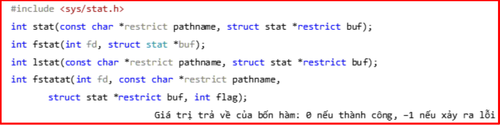   
</p>

  + Khi chúng ta cung cấp đường dẫn pathname, thì hàm stat sẽ trả về một cấu trúc chứa thông tin về file đó. Hàm fstat thì trả về thông tin của một file đã mở có file descriptor là fd. Hàm lstat thì tương tự như hàm stat, nhưng đường dẫn là một symbolic link, hàm lstat trả về thông tin của symbolic link chứ không phải thông tin của file mà nó trỏ đến.
  + Hàm fstatat cho phép chúng ta lấy thông tin của file nằm trong thư mục đã được mở có file descriptor là fd. Tham số flag dùng để xác định xem hàm này có tìm kiếm trong symbolic link hay không. 
  + Tham số buf của bốn hàm trên là một con trỏ trỏ đến cấu trúc stat mà chúng ta đã cấp phát trước đó. Các hàm stat sẽ điền thông tin vào các trường của cấu trúc stat này. Tùy từng phiên bản Linux khác nhau mà cấu trúc stat có thể khác nhau đôi chút, nhưng về cơ bản thì cấu trúc stat sẽ giống như sau: 
<p align="center">
  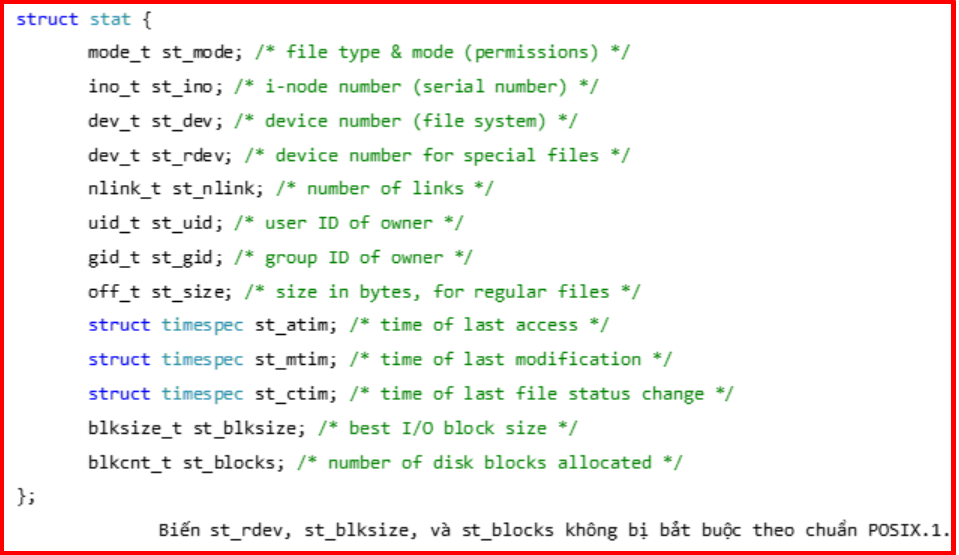   
</p>

  + Ví dụ dưới đây trả về mode, user id, group id, và kích thước của một file bất kì: 
```bash
#include <fcntl.h> 
#include <stdio.h> 
#include <sys/stat.h> 

int main(int argc, char *argv[]) 
{ 
  struct stat st; 
  if (argc != 2) printf("usage: a.out <pathname>"); 
  if (!stat(argv[1], &st)) 
  {
    printf("File information:\n"); 
    printf("Mode: %u\n", (unsigned int)st.st_mode); 
    printf("User id: %u\n", (unsigned int)st.st_uid); 
    printf("Group id: %u\n", (unsigned int)st.st_gid); 
    printf("File size: %u\n", (unsigned int)st.st_size); 
  } 
  else 
  {
    printf("Cannot access file %s\n", argv[1]); 
  }
  return 0; 
} 
```

+ Quyền truy cập file
  + Thuộc tính st_mode chứa các bit dùng để xác định quyền truy cập của file – quyền truy cập ở đây là quyền đọc, quyền ghi và quyền thực thi của một file. Các file ở đây bao gồm toàn bộ các file được miêu tả trong bài trước: các file thông thường, file thư mục và các file đặc biệt. Tất cả các file này đều có quyền truy cập. Có chín bit quyền truy cập khác nhau của một file, và nó được chia ra làm ba loại:

<p align="center">
  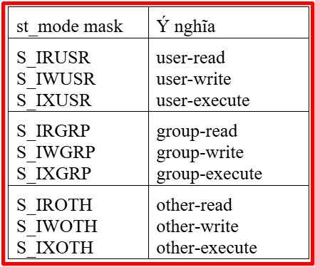   
</p>

  + Từ user ở ba hàng đầu tiên dùng để chỉ chủ sở hữu của file. Group dùng để chỉ người người trong cùng group với chủ sở hữu, other dùng để chỉ những người còn lại. Câu lệnh chmod thường được dùng để thay đổi chín bit quyền truy cập này. 
  + Mỗi khi user mở một file, kernel sẽ tiến hành kiểm qua quyền truy cập của user đối với file đó thông qua việc so sánh user-id và group-id. Quá trình kiểm tra quyền truy cập trong kernel diễn ra như sau: 
    + Bước 1: Nếu user-id của process là 0 (tức là supperuser), thì được phép truy cập. Nó cho phép superuser tự do truy cập bất kì file nào trong hệ thống. 

    + Bước 2: Nếu user-id của process trùng với user-id của file, thì cho phép truy cập file nếu các bit user (trong hình 1) được bật. Nếu các bit user- không được bật thì từ chối quyền truy cập file. Thích + hợp ở đây có nghĩa là, nếu process muốn mở file để đọc thì user-read bit phải được bật. Nếu process muốn mở file để ghi thì user-write bit phải đươc bật. Nếu process muốn mở file để thực thi thì user-execute bit phải được bật. 

    + Bước 3: Nếu group ID của process trùng với group ID của file, thì quyền truy cập được xác định bằng các bit truy cập thích hợp trong group-bit. Nếu bit này không bật thì từ chối quyền truy cập. 

    + Bước 4: Các trường hợp còn lại xác định thông qua other-bit, nếu bit tương ứng được bật thì cho phép truy cập. Ngược lại thì từ chối truy cập. 

  + Bốn bước trên được thực hiện một cách tuần tự

+ Hàm chmod, fchmod và fchmodat 
  + Các hàm chmod, fchmod và fchmodat cho phép chúng ta thay đổi quyền truy cập của một file
<p align="center">
  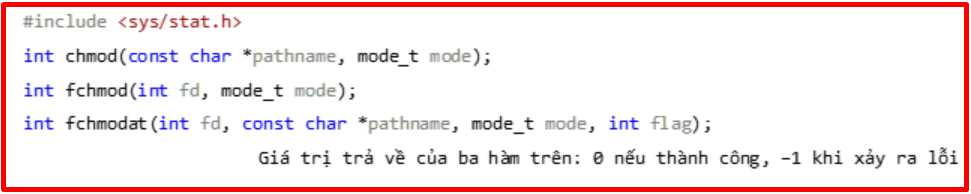   
</p>

  + Hàm chmod tác động đến một file bất kì có đường dẫn là pathname, còn hàm fchmod thì tác động đến một file đã được mở có file descriptor là fd. Để thay đổi quyền truy cập của file thì process chạy câu lệnh trên phải có user-id trùng với chủ sở hữu của file hoặc process phải có quyền superuser. 
  + Tham số mode được xác định bằng phép hoặc trên bit của các hằng số trong bảng sau: 
<p align="center">
  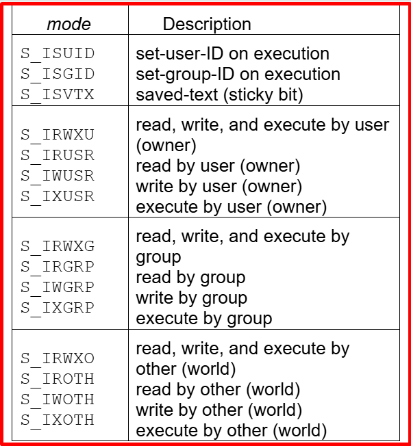   
</p>

+ Quyền sở hữu của file và thưc mục mới
  + Khi người dùng tạo ra một file hoặc thư mục mới thì thông thường user-id của file/thư mục mới sẽ được gán bằng user-id của process tạo thư mục đó. POSIX.1 cho phép chọn một trong các cách sau để xác định group ID của một file mới: 
    1. Group-id của file mới có thể là groud-id của process
    2. Group-id của file mới có thể là group-id của thưc mục chứa file được tạo đó 
  + Dùng cách thứ hai – kế thừa group-id của thư mục mẹ - đảm bảo rằng tất cả các file và thực mục được tạo ra trong một thư mục sẽ có chung group ID như thư mục mẹ. Các này được dùng phổ biến trong Linux, ví dụ như thư mục /var/mail 

+ Hàm access và faccessat 
  + Như chúng ta đã biết ở trên, khi mở một file, kernel sẽ tiến hành kiểm tra quyền truy cập dựa vào user-id và group-id của process. Tuy nhiên, đôi khi trong chương trình chúng ta muốn kiểm tra quyền truy cập của một file trước khi mở nó. Hàm access và faccessat cho phép chúng ta kiểm tra quyền truy cập của một file bất kì: 
<p align="center">
  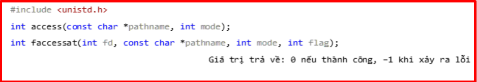   
</p>

  + Tham số truyền vào mode là cờ dùng để xác định xem kiểu kiểm tra của hàm là kiểm gì. Cờ mode có thể là F_OK dùng để kiểm tra xem file có tồn tại hay không hoặc bất kì cờ nào trong các cờ sau, chúng ta có thể dung phép OR để kết hợp nhiều cờ với nhau. 
<p align="center">
     
</p>

  + Ví dụ dưới đây dùng để kiểm tra quyền truy cập của một file bất kỳ. File execute a.out có thể truy cập được đường dẫn này nhưng không thể truy cập đường dẫn khác
```bash
#include <unistd.h> 
#include <fcntl.h> 
#include <stdio.h> 

int main(int argc, char *argv[]) 
{ 
  if (argc != 2) 
    printf("usage: a.out <pathname>"); 
  if (access(argv[1], R_OK) < 0) 
    printf("access error for %s\n", argv[1]); 
  else 
    printf("read access OK\n"); 
  if (open(argv[1], O_RDONLY) < 0) 
    printf("open error for %s\n", argv[1]); 
  else 
    printf("open for reading OK\n"); 
  return 0; 
}
```
<p align="center">
  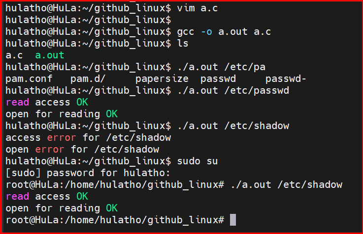   
</p>

+ File descriptors
  + Đối với kernel thì tất cả các tệp tin đã mở được xác định bởi file descriptor. File descriptor là một số nguyên không âm. Khi chúng ta mở hoặc tạo một tệp tin mới, kernel sẽ trả về một file descriptor cho process. Khi đọc hoặc ghi một file, chúng ta xác định file bằng file descriptor được trả về từ hàm open hoặc create, và dùng file descriptor này như là một tham số truyền vào hàm read hoặc write. 
  + Theo quy ước, Các chương trình thường liên kết file descriptor 0 với thiết bị nhập chuẩn của một tiến trình (process), file descriptor 1 với thiết bị xuất chuẩn, và file descriptor 2 với thiết bị xuất lỗi chuẩn. Quy ước này được sử dụng bởi shell và nhiều chương trình khác nhau; nó không phải là một tính năng của kernel. Tuy nhiên, nếu một chương trình không theo chuẩn này có thể gây phát sinh lỗi khi chạy. 
  + Những giá trị file descriptor trên được chuẩn hóa trong POSIX.1, những số magic 0, 1, và 2 được thay thế bằng những hằng số tượng trưng STDIN_FILENO, STDOUT_FILENO, và STDERR_FILENO để giúp việc đọc code được dễ dàng hơn. Các hằng số này được định nghĩa trong thử viên <unistd.h>. 

***Hệ thống file trong Linux***
+ Trong phần này chúng ta sẽ tìm hiểu kỹ hơn về cách xây dựng hệ thống file trong Linux. Hiểu được sự khác nhau giữa i-node và cách directory entry trỏ đến i-node. 
+ Chúng ta đã biết rằng, một ổ đĩa cứng được chia ra làm nhiều phân vùng (partitions) khác nhau. Mỗi phân vùng có thể chữa một hệ thống file, như trong hình dưới đây. 
<p align="center">
  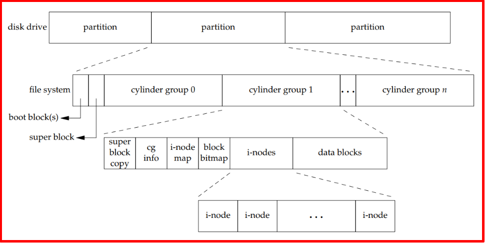   
</p>

+ Như chúng ta đã biết tất cả mọi thứ trong Linux đều được biểu diễn dươi dạng một file – từ các file thông thường, đến các thư mục hay các thiết bị phần cứng… đều là các file. Còn mỗi file đều được xác định bằng một inode. Vậy inode là gì?. inode là một cấu trúc dữ liệu, dùng cho các hệ thống file truyền thống như UFS hay ext3, nó bao gồm các trường mô tả thông tin về file như: Kiểu file, quyền truy cập, chủ sở hữu, kích thước, ngày tạo, ngày truy cập gần nhất, có lượng link đến file (soft link và hard link)… Hàm stat mà chúng ta tìm hiểu ở phần trên lấy thông tin từ inode của file rồi gán cho các trường của cấu trúc stat. Trong mỗi phân vùng bộ nhớ thường có một vùng để chứa các inode, tập hợp các inode này tạo thành một mảng các phần tử, số thứ tự của inode trong mảng này được gọi là chỉ số inode (inode index), như mô tả trên hình dưới. Mỗi i-inode sẽ chứa các thuộc tính và vị trí các khối dữ liệu của file trên ổ đĩa: 
<p align="center">
  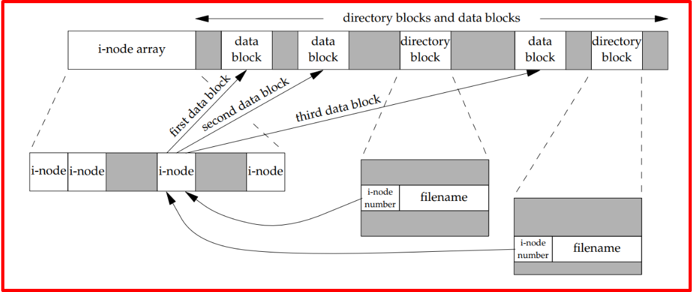   
</p>

+ Một khai niệm nữa mà chúng ta cần nắm rõ là directory entry. Directory entry cũng là một cấu trúc nhưng nó chỉ chứa chỉ số inode và tên file. 
+ Từ hình trên ta xác định được rằng: 
  + Hai directory entry có thể cùng trỏ đến một inode – tức là chúng có cùng chỉ số inode. Mỗi i-node có một trường dùng để đếm số link trỏ đến i-node này. Khi giá trị số đếm link này giảm về 0 thì file đó mới bị xóa (giải phóng toàn bộ các khối dữ liệu mà file trỏ đến). Chính vì thề mà việc xóa liên kết đến một file không phải lúc nào cũng là xóa các khối dữ liệu của file. Trong cấu trúc stat của file, số đếm link là thuộc tính của biến st_nlink, nó có kiểu nlink_t. Kiểu link này được gọi là hard link. 
  + Chỉ số i-node lưu trong directory entry phải trỏ đến inode trên cùng một hệ thống file, một directory entry không thể trỏ đến inode trên hệ thống file khác. Điều này giải thích tại sao chúng ta không thể tạo hard link của một file từ phân vùng này trên một phân vùng khác. 
  + i-node chứa tất cả các thông tin về file: kiểu file, các bit quyền truy cập file, kích thước file, các con trỏ trỏ đến khối dữ liệu của file...

+ Thư mục 
  + Trong phần trước chúng ta đã biết thư mục cũng là một file thông thường, nhưng dữ liệu của nó chứa tên của các file nằm trong nó. Trong phần này, chúng ta sẽ tìm hiểu cách tạo, xóa, mở và đọc một thư mục
  + Thư mục được tạo bằng hàm mkdir và mkdirat, và được xòa bằng hàm rmdir. 
<p align="center">
  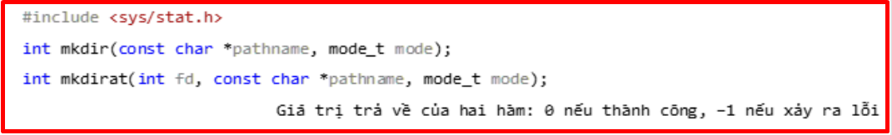   
</p>

  + Hai hàm trên sẽ tạo ra một thư mục rỗng mới, nó gồm hai thưc mục là chấm và chấm-chấm được tạo một cách tự động. Tham số quyền truy cập file, mode, sẽ bị thay đổi bởi mode của process. 
  + Một sai lầm thường gặp là chúng ta đặt mode giống như cho file: chỉ có quyền đọc và ghi. Nhưng đối với một thư mục, chúng ta cần ít nhất là bit quyền thực thì phải được bật, để truy cập đến các file trong thư mục này. 
  + User Id và group ID của process của thư mục được xác định giống như trong phần quyền truy cập file phía bên trên. 
  + Một thư mục được xóa bằng hàm rmdir. Nhớ rằng, một thư mục rỗng là thư mục có chứa hai mục chấm và chấm-chấm. 
<p align="center">
  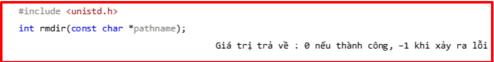   
</p>

+ Đọc thư mục 
  + Thư mục có thể được đọc bởi bất kì ai có quyền đọc thư mục đó. Nhưng chỉ có kernel mới có quyền ghi vào file thư mục. Nhắc lại rằng, bit quyền ghi và bit quyền thực thi cho một thư mục dùng để xác định xem chúng ta có thể tạo file mới trong thư mục và xóa file từ thư mục đó – Chúng không cho phép chúng ta ghi vào file thư mục. Dươi đây là liệt kê các hàm đọc thư mục: 
<p align="center">
  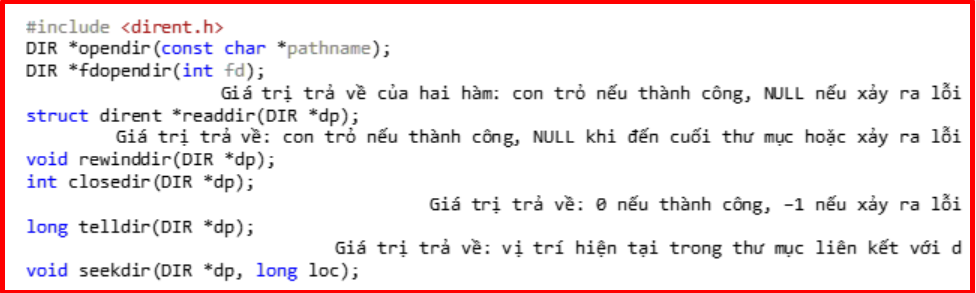   
</p>

  + Hàm fdopendir giúp chúng ta chuyển từ file descriptor sang cấu trúc DIR để dùng trong các hàm handle.
  + Cấu trúc DIR dùng trong bảy hàm trên để xác định thư mục đang được đọc. Con trỏ DIR được trả về bởi hàm opendir và fdopendir sẽ được sử dụng bởi năm hàm còn lại. Hàm opendir sẽ khởi tạo mọi thứ, sau đó hàm readdir sẽ trả về phần tử đầu tiên của thư mục. Khi cấu trúc DIR tạo ra bởi hàm fdopendir, thì phần tử đầu tiên trả về bởi hàm readdir phụ thuộc vào trường offset trong file descriptor truyền vào hàm fdopendir. Chú ý rằng, cách sắp xếp các phần từ trong thư mục sẽ phụ thuộc vào xem nó có xắp xếp theo thư tự tăng dần hoặc giảm dần

+ Hàm chdir, fchdir và hàm getcwd 
  + Tất cả các process đều có thư mục làm việc hiện thời của nó. Thư mục này là nơi bắt đầu tìm kiếm cho tất cả các file có đường dẫn tương đối. Khi người dùng đăng nhập vào hệ thống UNIX, thì thư mục làm việc hiện thời thường bắt đầu ở thư mục được khai bào ở dòng thứ 6 trong file /etc/passwd – là thư mục home của người dùng. Thư mục làm việc hiện thời là một tham số được truyền vào trong hàm main khi chạy một process. Chúng ta có thể thay đổi thư mục làm việc hiện thời bằng cách gọi hàm chdir hoặc fchdir: 
<p align="center">
  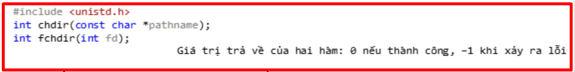   
</p>

  + Chúng ta có thể chỉ rõ thư mục làm việc mới bằng pathname hoặc thông qua một file descriptor. 

Kernel điều khiển việc tương tác giữa tiến trình và file thông qua ba bảng:

+ File descriptor table: là bảng nằm trong struct process control block của mỗi tiến trình. Mỗi phần tử được đánh số thứ tự gọi là file descriptor và chứa các thông tin sau
    + Fd Flags: Flag một số mode hoạt động của file description
    + File pointer: chỉ số của phần tử tương ứng trong bảng Open file table
    + struct fd table in include/linux/fdtable.h

+ Open file table: là bảng dùng chung cho tất cả các tiến trình chứa tất cả thông tin của một file đã được mở. Mỗi phần tử được đánh số thứ tự và chứa các thông tin sau
    + Giá trị con trỏ Offset hiện tại của file
    + Trạng thái được set khi mở file
    + Chế độ truy cập (read only, write only …)
    + Chỉ số của phần tử tương ứng trong bảng I-node table
    + struct file in include/linux/fs.h

+ I-node table: là bảng chứa thông tin của tất cả các file trong một file system. Mỗi phần tử của I-node table chứa các thông tin sau
    + File type (regular file, FIFO, socket, . . . ), tài khoản tạo file, phân quyền, kích thước file…
    + Số hard link liên kết tới file
    + Con trỏ tới vùng dữ liệu của file
    + struct inode in include/linux/fs.h

Các bước thực hiện với file trong linux:
+ Bước 1: Kernel tìm i-node number tương ứng với tên file muốn mở (File Directory sẽ chứa thông tin tên file tương ứng với I-node number).

+ Bước 2: Kernel sẽ thêm một phần tử vào bảng Open File Table, các giá trị của phần tử này sẽ được set tương ứng theo các tham số truyền vào hàm open() trong đó có tham số trỏ đến vị trí của file trong bảng i-node.
    + Nếu một file được mở nhiều lần bởi cùng 1 tiến trình hay nhiều tiến trình kernel đều thêm nhiều phần tử vào bảng Open File Table tương ứng với số lần gọi hàm open(). Các phần tử này sẽ cùng chỉ đến một phần tử trên bảng i-node table
    + Số phần tử của bảng Open File Table là giới hạn trước nên một hệ thống chỉ cho phép mở một số lượng file nhất định cùng lúc

+ Bước 3:  Kernel sẽ tìm một phần tử chưa sử dụng trong bảng File Descriptor Table của tiến trình và set giá trị để phần tử này trỏ tới phần tử mới được tạo trong bảng Open File Table. Giá trị trả về của lệnh open() chính là chỉ số của phần tử trong bảng File Descriptor Table.

**NOTE**: Nội dung của file sẽ không được load lên ram trong quá trình open file

<p align="center">
  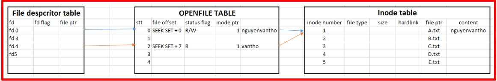   
</p>
<p align="center">
  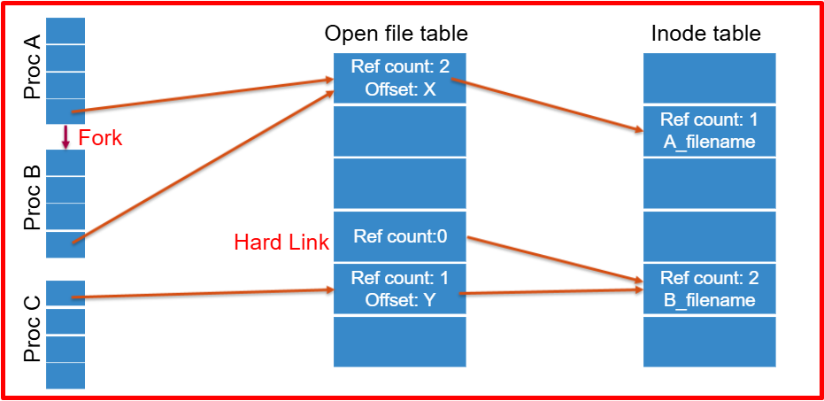   
</p>

+ Mối quan hệ giữa file descriptors and open files
    + Nhiều file descriptors có thể refer đến cùng 1 open file
<p align="center">
  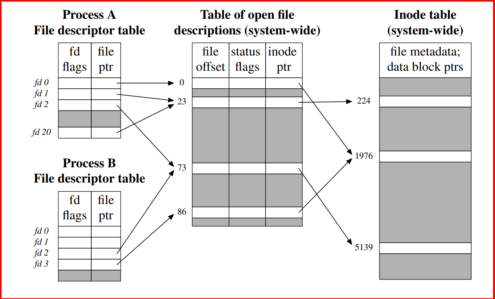   
</p>

+ Duplicated file descriptors: 1 process có thể có nhiều File Descripter cùng refer đến 1 OFD
    + Achieved using dup() or dup2()
<p align="center">
  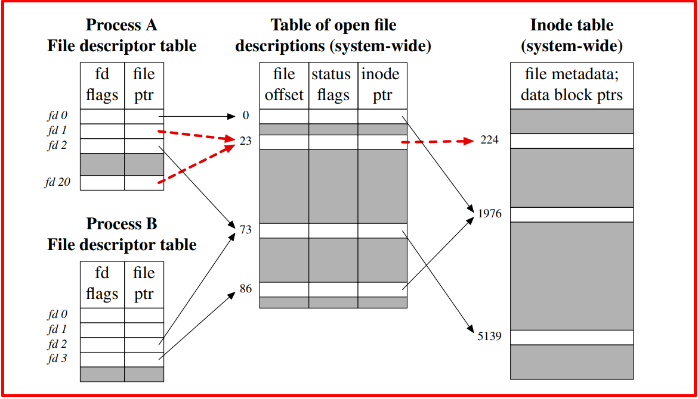   
</p>

+ Duplicated file descriptors between processes
    + 2 process có thể có FD cùng refer đến OFD
    + Có thể xảy ra khi ta dùng fork()
<p align="center">
  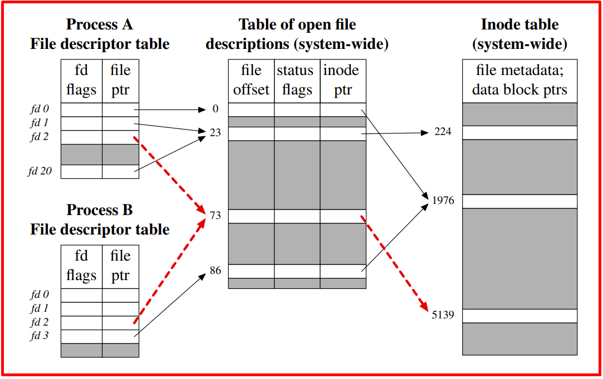   
</p>

+ 2 processes có FDs refer đến 2 OFD rieeg biệt nhưng lại cùng refer tới 1 inode
    + Điều này có thể xảy ra khi 2 process cùng open 1 file
<p align="center">
  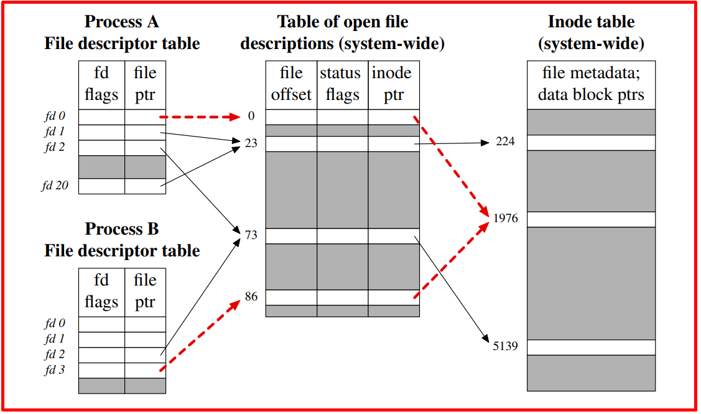   
</p>

+ Duplicating file descriptors sử dụng function dup
```bash
#include <unistd.h>
int dup(int origfd);
    + origfd : an existing file descriptor
    + Returns new file descriptor (on success)
    + New file descriptor is guaranteed to be lowest available
```
+ Các FD 0, 1 và 2 thường luôn mở, do đó shell có thể thực hiện chuyển hướng 2>&1 bằng
```bash
close(STDERR_FILENO); /* Frees FD 2 */
newfd = dup(STDOUT_FILENO); /* Reuses FD 2 */
```
+ Nhưng nếu FD 0 đã được close trước đó thì sao? Chúng ta cần một API tốt hơn.
```bash
#include <unistd.h>
int dup2(int origfd, int newfd);
    + Tương tự như dup(), nhưng sử dụng newfd cho FD trùng lặp
    + Đóng newfd một cách âm thầm nếu nó đang mở
    + Close & reuse newfd được thực hiện như một atomic step
    + Không làm gì nếu newfd == origfd
    + Returns new file descriptor (i.e., newfd) on success
```

***Page cache***
+ Quá trình Read
  + Khi kernel nhận được yêu cầy read, kernel sẽ read từ page cache. Nếu page tồi tại trong page cache thì thông tin sẽ được đọc thì cache. Ngược lại thì data physical sẽ được ghi lên cache rồi từ cache sẽ được đọc lên lại

+ Quá trình write
  + Kernal sẽ write nội dung tới page cache. Sau đó page cache sẽ được ghi định kì vào bộ nhớ vật lý hoặc sử dụng các lệnh system call sync(), fsync()

<p align="center">
  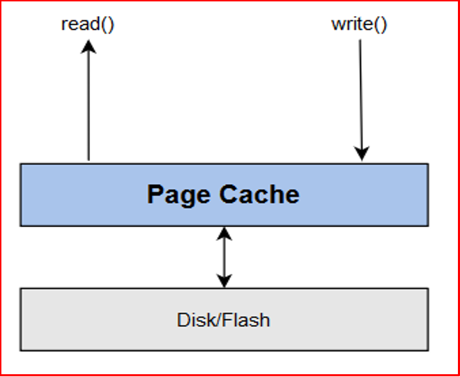   
</p>

### 3️⃣ File Lock
+ Xét bài toán khi 2 process cùng ghi vào 1 file. Process 1 ghi vào NguyenVanTho, Process 2 ghi vào Hello khi này nếu không có cơ chế gì thì sẽ gây ra luồng data ghi vào file không đúng ý mong muốn. Khi này đối với file chúng ta sẽ có 2 cách để khắc phục hay còn gọi là đồng bộ. Đó là Flock và Fcntl.
+ File locking dùng để quản lý việc nhiều tiến trình cùng đọc/ghi vào 1 file. Cách hoạt động như sau:
  + Bước 1: Ghi trạng thái lock vào I-node của file
  + Bước 2: Nếu thành công thì thực hiện đọc ghi file, nếu không thành công nghĩa là file đang được tiến trình khác sử dụng
  + Bước 3: Sau khi đọc/ghi xong gỡ trạng thái lock ra khỏi I-node của file
<p align="center">
  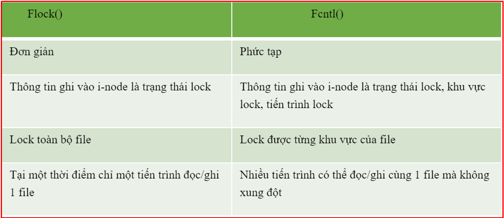   
</p>

***Kĩ thuật Flock()***
+ Flock dựa vào thông tin file descriptor để đặt trạng thái lock vào i-node table
```bash
int flock(int fd, int operation);
  + Fd: file descriptor của file cần lock
  + Operation: giá trị lock muốn set
    - LOCK_SH: nếu set giá trị này thành công tiến trình có thể đọc file, không ghi.
    - LOCK_EX: nếu set giá trị này thành công tiến trình có thể đọc ghi file.
    - LOCK_UN: set giá trị này để báo file không bị lock.
    - LOCK_NB: nếu không dùng flag này hàm flock sẽ không kết thúc cho tới khi set được lock.
```
<p align="center">
  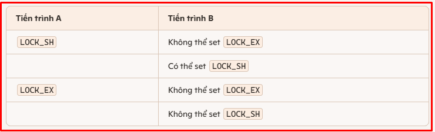   
</p>

**Ví dụ File Lock**
+ Ta chạy Process A trước, khi này Process A sẽ khởi tạo file text.txt và lock file này lại
+ Khi này chạy process B
  + nếu hàm flock mình để là LOCK_EX thì chương trình chạy tới "open file test txt" là dừng lại và đợi cho process A tắt đi thì process B tực hiện tiếp.
  + Còn nếu LOCK_EX | LOCK_NB thì nó bỏ qua luôn

- File Process A
```bash
#include <sys/stat.h>
#include <stdio.h>
#include <sys/file.h>
#include <unistd.h>
#include <fcntl.h>

int main(void) 
{
    int fd;
    char text[16] = {0};

    sprintf(text,"hello word\n");
    if((fd=open("./text.txt", O_RDWR|O_CREAT, 0666)) == -1) {
        printf("can not create file \n");
        return 0;
    } else {
        printf("create file text.txt\n");
    }

    if(write(fd, text, sizeof(text)-1) == -1) {
        printf("can not write file \n");
        return 0;
    } else {
        printf("write file \n");
    }

    if(flock(fd, LOCK_SH) == -1) {
        printf("can not set read lock\n");
    } else {
        printf("set read lock\n");
    }
    
    while(1) {
        sleep(1);
    }
    close(fd);
    return 0;
}
```
- File Process B
```bash
#include <stdio.h>
#include <sys/stat.h>
#include <sys/file.h>
#include <unistd.h>
#include<fcntl.h>

int main(void) 
{
    int fd;
    char buf[16] = {0};

    if((fd=open("./text.txt",O_RDWR)) == -1) {
        printf("can not open file \n");
        return 0;
    } else {
        printf("open file test.txt \n");
    }

    if(flock(fd, LOCK_EX | LOCK_NB) == -1) {
        printf("can not get write lock\n");
    }
    
    if(flock(fd, LOCK_SH | LOCK_NB) == -1) {
        printf("can not get read lock\n");
    } else {
        printf("get read lock file\n");
        if(read(fd, buf, sizeof(buf)-1) == -1) {
            printf("can not read file \n");
            return 0;
        } else
            printf("%s\n",buf); 
    }

    close(fd);

    return 0;
}

```

***Kĩ thuật Fcntl()***
+ fcntl() cho phép lock từng phần của file (thậm chí đến từng byte). Thông tin lock đặt vào i-node table sẽ gồm process ID, trạng thái lock, vùng lock. Vậy nên fcntl() linh hoạt hơn flock().

```bash
fcntl(fd, cmd, &flockstr)
  + fd: file descriptor của file cần lock
  + cmd: action muốn thực hiện
    - F_SETLK: đặt lock, bỏ lock
    - F_GETLK: đọc thông tin lock
  + flockstr: thông tin muốn lock (gồm state lock, vùng muốn lock, process lock) 
```
<p align="center">
  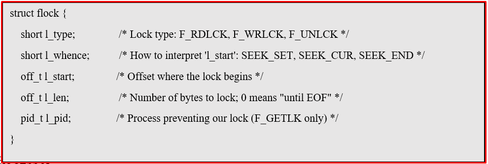   
</p>

**Ví dụ Fcntl**

+ File Process A
```bash
#include <stdio.h>
#include <sys/stat.h> 
#include <sys/file.h> 
#include <unistd.h> 
#include <fcntl.h> 

int main(void) 
{ 
  int fd; 
  char text[16] = {0}; 
  struct flock fl; 

  sprintf(text, "hello word\n"); 

  if((fd=open("./test.txt", O_RDWR | O_CREAT, 0666)) == -1) { 
      printf("can not create file \n"); 
      return 0; 
  } else { 
      printf("create file test.txt\n"); 
  } 

  if(write(fd, text , sizeof(text) - 1) == -1) { 
      printf("can not write file \n"); 
      return 0; 
  } else { 
      printf("write file \n");  
  } 

  fl.l_start = 1;         /* Offset where the lock begins */
  fl.l_len = 5;           /* Number of bytes to lock; 0 means "until EOF" */
  fl.l_type = F_WRLCK;    /* Lock type: F_RDLCK, F_WRLCK, F_UNLCK */
  fl.l_whence = SEEK_SET; /* How to interpret 'l_start': SEEK_SET, SEEK_CUR, SEEK_END */

  if(fcntl(fd, F_SETLK, &fl) == -1) { 
      printf("can not set write lock byte 1-5\n"); 
  } else { 
      printf("set write lock byte 1-5 \n"); 
  } 

  while (1) { 
      sleep(1); 
  } 
  close(fd); 
  return 0; 
}
```
+ File Process B
```bash
#include <stdio.h>
#include <sys/stat.h> 
#include <sys/file.h> 
#include <unistd.h> 
#include <fcntl.h> 

int main(void) 
{ 
  int fd; 

  char text[10] = {0};  
  struct flock fl; 

  sprintf(text, "thonv12"); 

  if((fd=open("./test.txt", O_RDWR)) == -1) { 
      printf("can not open file \n"); 
      return 0; 
  } else { 
      printf("open file test.txt \n"); 
  } 

  fl.l_start = 1;         /* Offset where the lock begins */
  fl.l_len = 5;           /* Number of bytes to lock; 0 means "until EOF" */
  fl.l_type = F_WRLCK;    /* Lock type: F_RDLCK, F_WRLCK, F_UNLCK */
  fl.l_whence = SEEK_SET; /* How to interpret 'l_start': SEEK_SET, SEEK_CUR, SEEK_END */

  if(fcntl(fd, F_SETLK, &fl) == -1) { 
      printf("can not set write lock byte 0-5\n"); 
  } 

  fl.l_start = 6; 
  fl.l_len = 8; 
  fl.l_type = F_WRLCK; 
  fl.l_whence = SEEK_SET; 

  if(fcntl(fd, F_SETLK, &fl) == -1) { 
      printf("can not set write lock byte 6-11\n"); 
  } else { 
      printf("set write lock byte 6-11\n"); 
      lseek(fd, 6, SEEK_SET);


      if(write(fd, text, sizeof(text) - 1) == -1) { 
          printf("can not write file \n"); 
          return 0; 
      } else {
          printf("write file \n");
      } 
  } 

  close(fd); 
  return 0; 
} 
```
## ✔️ Conclusion
Ở bài này chúng ta đã tìm hiểu về Virtal File System, File System và File Locking. Đây là bài quan trọng và hay. Sau này chúng ta sẽ gặp file operation rất nhiều nên cần nắm chắc bài này để dễ dàng hơn cho các bài sau.

## 💯 Exercise
<p align="center">
  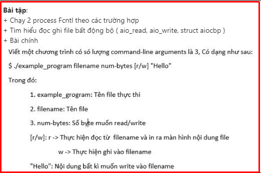   
</p>

***Ví dụ code***
+ Ví dụ về in một file ra cửa sổ console
```bash
#include <stdio.h>  
#include <stdlib.h> // For exit()  
int main() 
{ 
  FILE *fptr; 
  char filename = "/etc/passwd"; 
  char c; 
  
  // Open file  
  fptr = fopen(filename, "r"); 
  if (fptr == NULL) 
  { 
    printf("Cannot open file \n"); 
    exit(0); 
  } 

  // Read contents from file  
  c = fgetc(fptr); 
  while (c != EOF) 
  { 
    printf("%c", c); 
    c = fgetc(fptr); 
  } 
  fclose(fptr); 
  return 0; 
  } 
```

## 📺 NOTE

+ Video : [Video Youtube](https://www.youtube.com/watch?v=ut1P9HPazxI)


## 📌 Reference

[1] Understanding Linux kernel, 3rd Ed

[2] https://viblo.asia/p/hard-links-va-symbolic-links-tren-linux-07LKXJR2lV4

[3] https://www.nixtutor.com/freebsd/understanding-symbolic-links/ 

[4] https://man7.org/linux/man-pages/man2/open.2.html 

[5] https://www.joyk.com/dig/detail/1608468062718245​

[6] https://man7.org/training/download/lusp_fileio_slides.pdf
