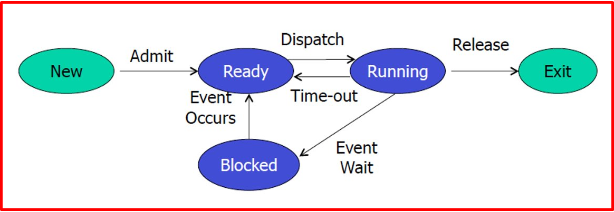
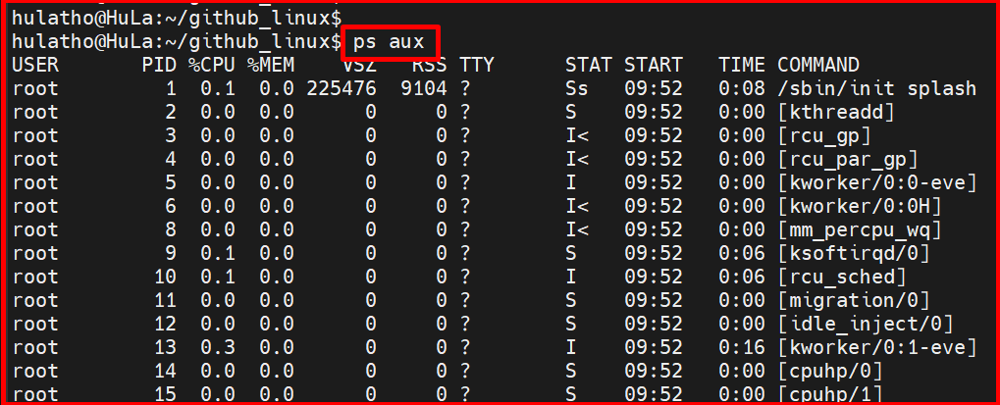
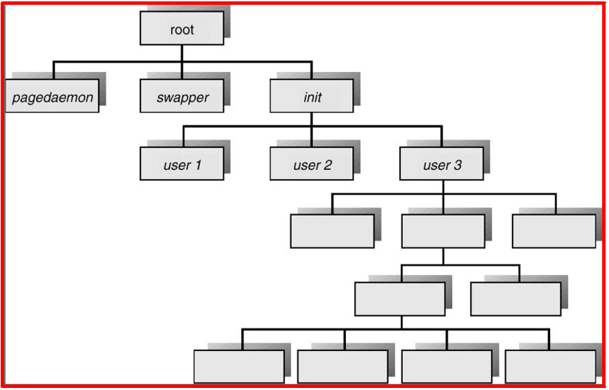
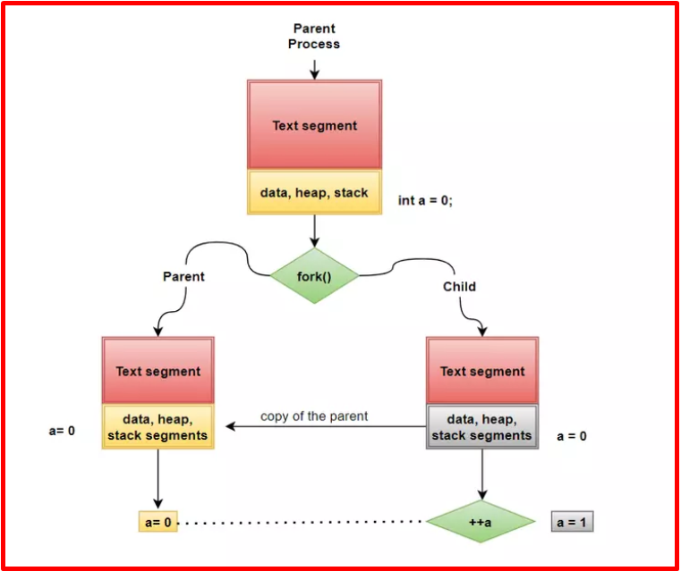
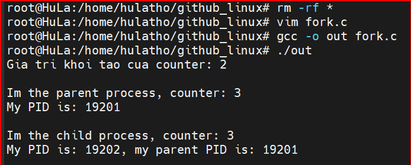
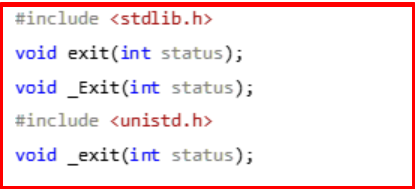
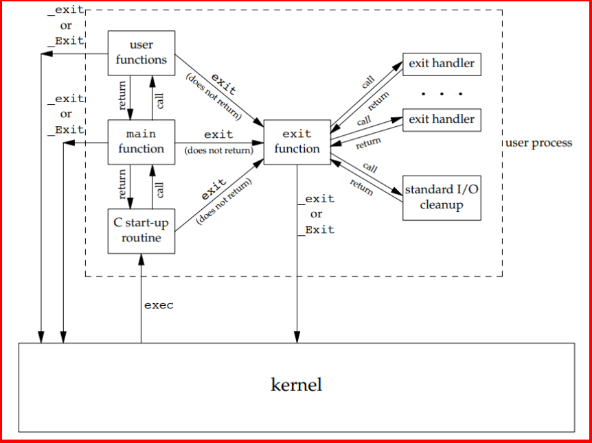
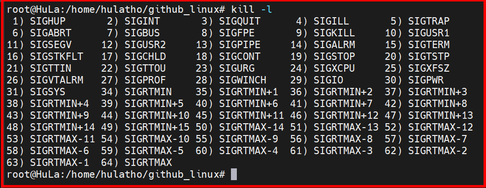
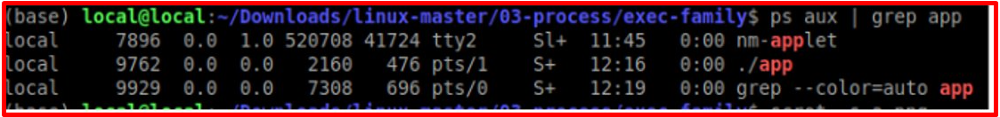
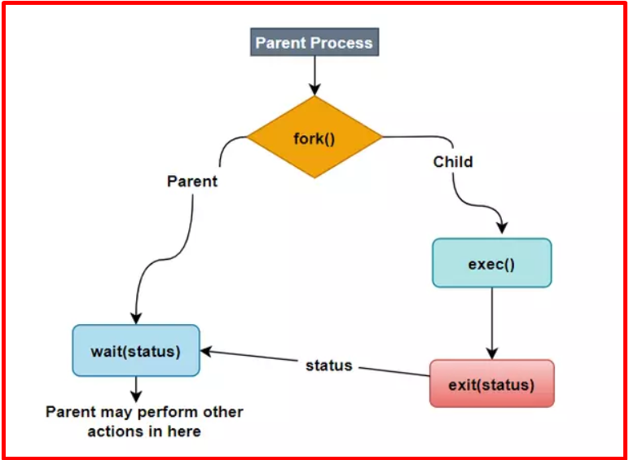

# 💚 Process 💛

## 👉 Introduction and Summary 
### 1️⃣ Introduction
+ Ở bài trước chúng ta đã biết về file và cách hoạt động của nó trong linux. Nếu các bạn chưa đọc thì xem link này nha [004_Virtual_File_System.md](../004_Virtual_File_System/004_Virtual_File_System.md). Ở bài này chúng ta sẽ tìm hiểu về Process trong linux. Chúng ta sẽ cùng tìm hiểu về cách thức hoạt động của một process thông thường. Từ điểm bắt đầu của một process là hàm main, cách thức chúng nhận tham số từ command-line truyền vào như thế nào, cấu trúc bộ nhớ điển hình của một process sẽ như thế nào, cách cấp phát bộ nhớ trong một process, và các cách thức để terminate một process. Cuối cùng, chùng ta sẽ tìm hiểu cách mà kernel phân quyền cho một process và làm một số ví dụ cơ bản về lập trình với process trong môi trường Linux
### 2️⃣ Summary
Nội dung của bài viết gồm có những phần sau nhé 📢📢📢:
- [I. Introduction and Summary](#👉-introduction-and-summary)
    - [1. Introduction](#1️⃣-introduction)
    - [2. Summary](#2️⃣-summary)
- [II. Contents](#👉-contents)
    - [1. Process và Program​](#1️⃣-process-và-program)
    - [2. Process life-cycle](#2️⃣-process-life-cycle)
    - [3. Tạo process mới](#3️⃣-tạo-process-mới)
    - [4. Kết thúc 1 process](#4️⃣-kết-thúc-1-process)
    - [5. Quản lý Process](#5️⃣-quản-lý-process)
    - [6. User id and group id](#6️⃣-user-id-and-group-id)
- [III. Conclusion](#✔️-conclusion)
- [IV. Exercise](#💯-exercise)
- [V. NOTE](#📺-note)
- [VI. Reference](#📌-reference)

## 👉 Contents
### 1️⃣ Process và Program
+ Program: Là các file binary được build từ source code. Chúng nằm trên ổ cứng và không tương tác cũng như sử dụng bất cứ một tài nguyên nào của hệ thống. Do đó cho dù hệ thống có lưu trữ bao nhiêu chương trình thì hiệu năng của nó cũng sẽ không bị giảm đi
+ Process: Là những chương trình đã được load vào hệ thống. Do đó chúng sẽ tương tác và sử dụng tài nguyên của hệ thống. Càng nhiều tiến trình chạy trong hệ thống thì hiệu năng sẽ càng bị giảm đi​

+ Tất cả các chương trình trong Linux thực chất đều là các processes. Terminal bạn chạy, vim, hay bất cứ lệnh nào bạn gõ vào terminal. Process chính là đơn vị cấu thành nên Linux. Nó chính là một instance của chương trình bạn viết ra. Nói cách khác mỗi dòng code của bạn, sẽ được thực thi trên một process. 

***Giải thích thêm***
+ Cũng giống như việc đặt tên để định danh cho con người, hệ điều hành sẽ đánh số cho từng tiến trình để định danh chúng. Số định danh đó sẽ là số thứ tự mà tiến trình đó được load vào hệ thống. Chúng được gọi là các process id. Hệ thống sẽ tương tác với các tiến trình thông qua định danh của chúng – process id
+ Mỗi 1 process có 1 ID để định danh gọi là PID, đây là số nguyên dương và duy nhất cho mỗi process trên hệ thống​.
+ Input và output của tiến trình: Chúng là 2 file với file đầu là nơi tiến trình sẽ đọc dữ liệu đầu vào cho các hàm như scanf() và file thứ 2 sẽ là nơi tiến trình ghi kết quả đầu ra trong các hàm như printf(). Thông thường file input sẽ là bàn phím và file output sẽ là màn hình console.

### 2️⃣ Process life-cycle
+ Vòng đời của 1 process
<p align="center">
     
</p>

+ Cách lấy list process đang running
  + Ta dùng lệnh: ps aux
<p align="center">
     
</p>

+ Processes Tree trên 1 hệ thống Unix
  + Ta có thể thấy mọi tiến trình đều bắt đầu từ tiến trình init, từ đó sinh ra tiến trình 1 2 3 do user 1 2 3 tạo ra. Trong đó user 3 có hệ thống cha con cháu phức tạp nhất.
<p align="center">
     
</p>

### 3️⃣ Tạo process mới
+ Từ điểm bắt đầu của một process là hàm main. Khi này ta gọi system call fork() để tạo process mới
+ Tiến trình gọi fork() được gọi là tiến trình cha mẹ (parent process).​
+ Tiến trình mới được tạo ra gọi là tiến trình con (child process)​
+ Tiến trình init là tiến trình đầu tiên được chạy, là cha của mọi tiến trình khác và có pid là 1
+ Pid ở đây giống như là id của 1 process
<p align="center">
     
</p>

+ Sau khi lời gọi hàm fork() thành công, nó sẽ tạo ra một process con gần như giống với process cha ban đầu. Hai process này chia sẻ với nhau text segment, nhưng chúng sẽ có một bản sao riêng biệt đối với các segments còn lại là data, heap và stack. Điều này có nghĩa là, khi bạn thay đổi dữ liệu trong process con sẽ không ảnh hưởng tới dữ liệu trong process cha.
+ Ngoài ra, chúng ta có thể phân biệt hai process cha, con thông qua giá trị trả về của hàm fork(). Đối với process cha, hàm fork() sẽ trả về process ID (PID) của process con mới được tạo. Giá trị PID này hữu ích cho process cha theo dõi, quản lý process con (bằng cách sử dụng wait() , waitpid() sẽ được đề cập sau). Đối với process con, hàm fork() trả về giá trị 0, nó có thể thu được PID của mình thông qua việc gọi hàm getpid() và PID của process cha bằng getppid() .
+ Nếu một process mới không được tạo ra, hàm fork() trả về -1.

+ Ví dụ dùng system call fork để tạo tiến trình
```bash
#include <stdio.h>
#include <stdlib.h>
#include <unistd.h>
int main(int argc, char const *argv[])                      /* Cấp phát stack frame cho hàm main() */
{
    pid_t child_pid;                                        /* Lưu trong stack frame của main() */
    int counter = 2;                                        /* Lưu trong frame của main() */
    printf("Gia tri khoi tao cua counter: %d\n", counter);
    child_pid = fork();         
    if (child_pid >= 0) {
        if (0 == child_pid) {                               /* Process con */
            printf("\nIm the child process, counter: %d\n", ++counter);
            printf("My PID is: %d, my parent PID is: %d\n", getpid(), getppid());
            
        } else {                    /* Process cha */
            printf("\nIm the parent process, counter: %d\n", ++counter);
            printf("My PID is: %d\n", getpid());
        while (1);
        }
    } else {
        printf("fork() unsuccessfully\n");                   // fork() return -1 nếu lỗi.
    }
    return 0;
}
```
+ Khi ta chạy chương trình trên, biến counter đang bằng 2 khi này ta gọi fork để tạo thêm tiến trình con, khi này biến counter đã được nhân bản thành 2, một bản thuộc process cha và 1 bản thuộc process con. Giá trị của counter đều bằng 2 ở mỗi tiến trình. Nên khi ta cộng thêm 1 thì cả 2 process đều tằng biến counter lên 3.
<p align="center">
     
</p>


***Chạy chương trình mới***
+ Trong nhiều trường hợp bạn đang có một tiến trình A đang thực thi và bạn muốn chạy một chương trình B nào đó từ tiến trình A hoặc con của nó. Điều này hoàn toàn có thể thực hiện được thông qua việc sử dụng một danh sách các hàm thuộc dòng exec.

+ Danh sách này bao gồm các hàm sau:
```bash
#include <unistd.h>
int execle(const char *pathname, const char *arg, ...);
int execlp(const char *filename, const char *arg, ...);
int execvp(const char *filename, char *const argv[]);
int execv(const char *pathname, char *const argv[]);
int execl(const char *pathname, const char *arg, ...);
None of the above returns on success; all return –1 on error
```
+ execl(): Hàm này sẽ thực thi một chương trình tại đường dẫn được chỉ định, kèm theo tên chương trình và các tham số môi trường truyền vào cho chương trình đó.
```bash
#include <unistd.h>
/*
* @param[in] path Đường dẫn tới chương trình muốn chạy.
* @param[in] argv Đây là một mảng các đối số truyền vào trương trình. Tham số cuối cùng nên đặt thành NULL.
*/
int execl(const char *path, char *const argv[]);
```

+ Xét ví dụ sau để biết rõ hơn về hàm execl():
```bash
#include <stdio.h>
#include <stdlib.h>
#include <unistd.h>

int main(int argc, char *argv[]) 
{    
    printf("Before execl \n");
    // execl("/bin/ls", "ls", "-l", NULL);
    execl("out", "thoNV", NULL);
    printf("After execl");
    return 0;   
}
```
### 4️⃣ Kết thúc 1 process
+ Có khoảng tám cách để terminate một process, năm cách terminate thông thường đầu tiên gồm:
  1. Khi kết thúc hàm main. 
  2. Khi gọi hàm exit. 
  3. Khi gọi hàm _exit hoặc _Exit. 
  4. Khi toàn bộ các thread của một process kết thúc. 
  5. Khi gọi hàm pthread_exit
+ Ba cách không bình thường để thoát khỏi process bao gồm:
  6. Gọi hàm abort 
  7. Khi nhận được một signal 
  8. Thread bị cancel. 

+ Một process có thể hoàn thành việc thực thi của nó một cách bình thường bằng cách gọi system call _exit() hoặc dùng hàm exit()
+ Đối số status truyền vào cho hàm _exit() định nghĩa trạng thái kết thúc (terminal status) của process, có giá trị từ 0 - 255
+ Trạng thái này sẽ được gửi tới process cha để thông báo rằng process con kết thúc thành công (success) hay thất bại (failure). 
+ Process cha sẽ sử dụng system call wait() để đọc trạng thái này.​
+ Để cho thuận tiện, giá trị status bằng 0 nghĩa là process thực thi thành công, ngược lại khác 0 nghĩa là thất bại
+ Ngoài ra, ta cũng có thể sử dụng return n trong hàm main() . Điều này tương đương với việc gọi exit(n) 
+ Đây chính là lý do khi kết thúc hàm main() chúng ta thường hay sử dụng return 0 - success

***Hàm exit***
+ Ba hàm terminate process một cách thông thường là: _exit và _Exit, hai hàm này lập tức kết thúc chương trình rồi trở về kernel, với hàm exit, hàm này sẽ tiến hành một số quá trình dọn dẹp trước khi trở về kernel. 
<p align="center">
     
</p>

+ Tất cả các hàm trên đều nhận một tham số truyền vào là một số nguyên, nó là trạng thái trả về của chương trình. Trong Linux shell, chúng ta có thể kiểm tra giá trị trả về của chương trình chạy trước đó bằng lệnh echo $?. Nếu hàm main có kiểu trả về là void hoặc hàm main return mà không khai báo giá trị thì trạng thái trả về của chương trình là không xác định. Trả về giá trị bằng lênh return trong hàm main cũng tương đương với việc gọi hàm exit với cùng giá trị của return. Ví dụ exit(0) tương đương với return 0 trong hàm main.
+ Hình dưới đây mô tả quá trình bắt đầu và kết thúc của một chương trình C. 
<p align="center">
     
</p>

***Hàm atexit***
+ Theo chuẩn ISO C, một process có thể khai báo lên đến 32 handler hàm mà chúng sẽ được tự động gọi khi process bị terminate. Các hàm này được gọi là hàm exit handler, và được khai báo bằng hàm atexit. 
<p align="center">
     
</p>

+ Từ nguyên mẫu hàm trên, chúng ta có thể thấy tham số truyền vào là con trỏ hàm void. Khi hàm handler này được gọi, nó không nhận bất cứ tham số truyền vào nào và cũng không trả về bất kì giá trị nào. Hàm exit gọi các hàm handler này theo thứ tự ngược lại với thứ tự mà chúng được khai báo. Các hàm handler được gọi ra bằng số lần mà chúng được khai báo, nếu một hàm handler đươc khai bào nhiều lần thì cũng sẽ được gọi ra bấy nhiêu lần lần. 
+ Theo chuẩn ISO C và POSIX.1, hàm exit trước tiên sẽ gọi ra các hàm exit handler sau đó nó sẽ đóng tất cả các stream đang mở của process thông qua hàm fclose (ví dụ như đóng các file đang được mở).
+ Cách duy nhất một chương trình có thể chạy bởi kernel là gọi ra một trong hàm exec. Một process chỉ tự động đóng khi nó gọi ra hàm _exit hoặc _Exit, một cách trực tiếp hoặc gián tiếp qua hàm exit. Một process cũng có thể  bị đóng bởi một signal. 
+ Ví dụ về việc sử dụng hàn exit handler
```bash
#include <stdio.h> 
#include <stdlib.h> 

static void my_exit1(void); 
static void my_exit2(void); 

static void my_exit1(void) 
{ 
  printf("first exit handler\n"); 
} 

static void my_exit2(void) 
{ 
  printf("second exit handler\n"); 
} 
 
int main(void) 
{ 
  if (atexit(my_exit2) != 0) 
    printf("can’t register my_exit2"); 
  if (atexit(my_exit1) != 0) 
    printf("can’t register my_exit1"); 
  if (atexit(my_exit1) != 0) 
    printf("can’t register my_exit1"); 
    printf("main is done\n"); 
  return(0); 
}
```
+ Sau khi chạy chương trình trên ta sẽ thấy hàm exit handler được gọi ra bằng số lần mà nó được khai báo, như kết quả bên trên, hàm exit handler đầu tiên được khai báo hai lần lên nó được gọi ra hai lần. Chú ý rằng chương trình bên trên chúng ta không dùng hàm exit mà gọi ra lệnh return, hai hàm này tương đương nhau. 

***Kill***
+ Ta có chương trình sau, luôn chạy trong while 1. Khi này process đó có thể bị kết thúc bằng cách sử dụng câu lệnh **kill** trong linux​
```bash
#include <stdio.h>
#include <stdlib.h>
void main(int argc, char *argv[]) 
{   
    while(1)
    {
    }
}
```

+ Cách thực hiện:
  + Gõ kill –l: hiện lên bảng các signal. Ta chú ý signal 9
<p align="center">
     
</p>

  + Sau đó gõ : ps aux | grep app  ( app là file gcc tạo ra)​
<p align="center">
     
</p>

  + Sau đó : kill -9 9762
    + Kill là gửi 1 tín hiệu tới tiến trình của mình
    + -9 là SIGKILL
    + 9762 là cái tiến trình của mình

***Sử dụng system call Kill***
+ int kill(pid_t pid, int sig);
```bash
#include <stdio.h>
#include <stdlib.h>
#include <unistd.h>
#include <signal.h>

int main(int argc, char *argv[])
{
    printf("hello HuLa");
    sleep(5);
    printf("kill current process");
    kill(getpid(), SIGKILL);
    while(1)
    {
        printf("hello");
        sleep(2);
    }

    return 0;
}
```

### 5️⃣ Quản lý Process
+ Tiến trình cha có thể thu được trạng thái kết thúc của tiến trình con thông qua gọi wai()
+ Trong nhiều ứng dụng, một tiến trình cha cần biết được khi nào tiến trình con của nó thay đổi trạng thái (state) để giám sát và đưa ra quyết định thực hiện các hành vi tiếp theo. Điều này có thể thực hiện được thông qua việc sử dụng system call wait() và waitpid().
<p align="center">
     
</p>

***System call Wait()​***
```bash
#include <sys/wait.h>
/*
* @param[out] status Trạng thái kết thúc của tiến trình con.
*
* @return     Trả về PID của tiến trình con nếu thành công, trả về -1 nếu lỗi.
*/
pid_t wait(int *status);
```
+ System call wait() được sử dụng thể theo dõi trạng thái kết thúc của một trong các tiến trình con mà tiến trình cha tạo ra.
+ Tại thời điểm wait() được gọi, nó sẽ block cho đến khi có một tiến trình con kết thúc. Nếu tồn tại một tiến trình con đã kết thúc trước thời điểm gọi wait(), nó sẽ return ngay lập tức.
+ Nếu status khác NULL, status sẽ trỏ tới một giá trị là một số nguyên, giá trị này là thông tin về trạng thái kết thúc của tiến trình.
+ Khi wait() kết thúc, nó sẽ trả về giá trị PID của tiến trình con hoặc trả về -1 nếu lỗi
+ Ví dụ cha là A và tạo ra 2 thằng con là B và C thì khi thằng cha gọi wait() thì một trong 2 thằng
con kết thúc, có thể kết thúc bình thường hoặc bất thường thì thằng wait() sẽ thoát block ra và lấy ra
được hai cái thông tin là pid của thằng nào kết thúc và trạng thái kết thúc của nó, như kết thúc thành
công hay kết thúc thất bại​
+ Ví dụ có 3 thằng con thì mình gọi 3 cái wait() để bắt được trạng thái của cả 3 thằng con
+ Nếu một tiến trình kết thúc trước khi gọi wait() thì nó sẽ return ngay lập tức.​

+ Ví dụ về system call wait
  + Thằng cha đang wait() đợi thằng con kết thúc nhưng thằng con lại đang trong while(1) nên không kết thúc được, khi này ta dùng kill ở command line thôi.​
```bash
#include <stdio.h>
#include <stdlib.h>
#include <unistd.h>
#include <sys/wait.h>

int main(int argc, char const *argv[])   
{
    /* code */
    pid_t child_pid;                /* Lưu trong stack frame của main() */
    int status, rv;                 /* Lưu trong frame của main() */

    child_pid = fork();         
    if (child_pid >= 0) {
        if (0 == child_pid) {       /* Process con */
            printf("\nIm the child process, mypid: %d\n", getpid());
           while(1);
        } else {                    /* Process cha */
            rv = wait(&status);
            if(rv == -1) printf("wait() unsuccessful \n");
            printf("\nIm the parent process, pid child process: %d\n", rv);
        }
    } else {
        printf("fork() unsuccessfully\n");      // fork() return -1 nếu lỗi.
    }
    return 0;
}
```

***System call waitpid()***
+ System call wait() tồn tại một số hạn chế:
  + Nếu tiến trình cha tạo ra nhiều tiến trình con (mutliple children), nó không thể dùng wait() để theo dõi một tiến trình con cụ thể.
  + Nếu tiến trình con không kết thúc, wait() luôn block.
  + waitpid() được sinh ra để giải quyết các vấn đề này. Prototype của waitpid() như sau:
```bash
#include <sys/wait.h>
/*
* @param[in]  pid      pid  >  0, PID của tiến trình con cụ thể mà wait muốn theo dõi.
*                      pid  =  0, Ít sử dụng.
*                      pid  < -1, Ít sử dụng. 
*                      pid == -1, Chờ bất cứ tiến trình con nào thuộc về tiến trình cha - giống wait().                  
* @param[out] status   Trạng thái kết thúc của tiến trình con.
* @param[in]  options  Thông thường chúng ta sẽ sử dụng giá trị NULL ở trường này.
*
* @return     Trả về PID của tiến trình con nếu thành công, trả về -1 nếu lỗi.
*/
pid_t waitpid(pid_t pid, int *status, int options);
```
+ Về cơ bản, hoạt động của waitpid() cũng giống như wait(). Ngoài ra, chúng ta có thể sử dụng một số macro dưới đây cùng với giá trị "status" nhận từ wait() hoặc waitpid() để xác định cách mà tiến trình con kết thúc.
  + WIFEXITED(status):return true nếu tiến trình con kết thúc một cách bình thường (normallly termination) bắng cách sử dụng _exit() hoặc exit()
  + WIFSIGNALED(status): return true nếu tiến trình con kết thúc một cách bất thường (abnormal termination), cụ thể trong trường hợp này là do signal. Được sử dụng kết hợp với WTERMSIG để xác định signal nào làm cho tiến trình con kết thúc. Có thể dùng command "kill -l" để biết thêm thông tin về các loại signals.
  + WIFSTOPPED: return true nếu như tiến trình con tạm dừng bởi signal SIGSTOP.
  + WIFCONTINUED: return true nếu như tiến trình con được tiếp tục bởi signal SIGCONT

+ Ví dụ mình có 3 tiến trình con, mà mình muốn khi nào tiến trình thứ 2 kết thúc thì mới
trả về thì thằng wait() không làm được mà phải dùng waitpid()​

+ Ví dụ về wait status
```bash
#include <stdio.h>
#include <stdlib.h>
#include <unistd.h>
#include <sys/wait.h>
int main(int argc, char const *argv[])   
{
    /* code */
    pid_t child_pid;                /* Lưu trong stack frame của main() */
    int status, rv;                 /* Lưu trong frame của main() */

    child_pid = fork();         
    if (child_pid >= 0) {
        if (0 == child_pid) {       /* Process con */
            printf("\nIm the child process, mypid: %d\n", getpid());
           while(1);
        } else {                    /* Process cha */
            rv = wait(&status);
            if(rv == -1) printf("wait() unsuccessful \n");
            printf("\nIm the parent process, pid child process: %d\n", rv);
            if(WIFEXITED(status))
            {
                printf("normally termination, status= %d\n", WEXITSTATUS(status));
            } else if( WIFSIGNALED(status)){
                printf("Kiled by signel, value = %d\n", WTERMSIG(status));
            }
        }
    } else {
        printf("fork() unsuccessfully\n");      // fork() return -1 nếu lỗi.
    }
    return 0;
}
```

***Tiến trình mồ côi và tiến trình Zombie***
+  Vòng đời của tiến trình cha con là không giống nhau​
  - Tiến trình cha chết trươc tiến trình con, luc này tiến trình con rơi vào trạng thái orphane(mồ
  côi), vậy ai sẽ là cha mới của nó?​
  - Điều gì xảy ra khi tiến trình con kết thúc trước khi tiến trình cha gọi wait()?​

+ Tiến trình Orphane:
  + Nếu tiến trình cha kết thúc trong khi một hoặc nhiều tiến trình con của nó vẫn đang chạy, khi đó các tiến trình con đó sẽ trở thành các tiến trình mồ côi (orphane). Tiến trình mồ côi sẽ được chấp nhận bởi tiến trình init (có PID 1), và tiến trình init sẽ hoàn thành công việc thu thập trạng thái cho chúng.
  + Mặc dù về mặt kỹ thuật, tiến trình con được init nhận làm "con nuôi" nhưng nó vẫn được gọi là tiến trình mồ côi vì tiến trình cha ban đầu tạo ra nó không còn tồn tại nữa.

+ Tiến trình Zombie:
  + Nếu tiến trình con kết thúc trước tiến trình cha call wait, nó không hoàn toàn được giải phóng khỏi hệ thống mà rơi vào trạng thái zombie
  + Lúc này tài nguyên dành cho tiến trình được giải phóng và chỉ giữ lại một số thông tin cơ bản như pid, trạng thái kết thúc của tiến trình.​
  + Tiến trình bị xóa khỏi hệ thống khi tiến trình cha gọi wait() hoặc waitpid().​
  + Nếu mình tạo ra quá nhiều zombie thì cái bảng pid sẽ bị đầy, và ta sẽ không tạo ra được process mới
  nữa, nên ta phải tránh tạo ra cái zombie process này.​
  + Cách để bỏ thằng zombie này là Dùng wait() ở cha
  + Tuy nhiên cách này thì nếu thằng con mà quá lâu thì thằng cha phải đợi cho tới khi nào thằng con kết thúc​
  + Để giao tiếp giữa 2 process thì sẽ dùng IPC(Inter Process Communication) communication như lock, signal, semaphore…
  + Dùng signal, khi thằng con kết thúc nó sẽ gửi tín hiệu SIGCHLD, khi có tín hiệu thằng con truyền cho cha thì nó nhảy vào hàm func() nó làm, còn bình thường thì cha làm gì thì làm
  + Trong cái func() ta gọi wait() để mất cái tiến trình zombie đi
  + Con gửi tín hiệu SIGCHLD tới thằng cha tương đương với "kill -17 pid"

+ Tạo ra tiến trình zombie:
  + Khi chạy thì tiến trình cha bị block tại while(1) trước thời điểm wait() được gọi. Sử dụng command "ps aux | grep exam" ta thu được kết quả. 
  + Tiến trình exam là tiến trình zombie được đánh dấu là Z+. Ta có thể liệt kê các trạng thái tiến trình như sau:
    + S : sleeping
    + R : running
    + W : waiting
    + T : suspended
    + Z : zombie (defunct)

```bash
/* code */
pid_t child_pid;                /* Lưu trong stack frame của main() */
int status;

child_pid = fork();         
if (child_pid >= 0) {
    if (0 == child_pid) {       /* Process con */
        printf("Im the child process, my PID: %d\n", getpid());
        exit(EXIT_SUCCESS);

    } else {                    /* Process cha */
        while(1);  
        wait(&status);
        
    }
} else {                        /* fork() return -1 nếu lỗi. */
    printf("fork() unsuccessfully\n"); 
}
```

+ Xử lý giải quyết tiến trình zombie
```bash
#include <stdio.h>
#include <stdlib.h>
#include <unistd.h>
#include <sys/types.h>
#include <sys/wait.h>
void func(int signum)
{
    printf("Im in func() \n");
    wait(NULL);
}

int main(int argc, char const *argv[])  
{
    pid_t child_pid;
    child_pid = fork();        
    if (child_pid >= 0) {
        if (0 == child_pid) {       /* Process con */
           printf("I am Child, mypid: %d\n",getpid());
           while(1);
        } else {                    /* Process cha */
           signal(SIGCHLD, func);
           printf("\nIm the parent process");
           while(1);
        }
    } else {
        printf("fork() unsuccessfully\n");      // fork() return -1 nếu lỗi.
    }
    return 0;
}
```

### 6️⃣ User id and group id

Khi user-id và group-id thay đổi thì quyền của process cũng thay đổi tương ứng và ta sẽ set theo xu hướng giảm quyền của process


+ Thay đổi quyền truy cập của tiến trình đó.
+ Dùng để hạ quyền tiến trình từ root xuống user thường (để tăng bảo mật) hoặc chạy một phần mềm với quyền của user khác
```bash
#include <unistd.h>
int setuid(uid_t uid)
  + uid là User ID mà bạn muốn gán cho tiến trình hiện tại.
  + Giá trị trả về 0 nếu thành công -1 nếu thất bại
int setgid(gid_t gid)
```

+ Hàm setgid(gid_t gid) trong Linux được dùng để thay đổi Group ID (GID) của tiến trình hiện tại
+ Dùng để Hạ quyền tiến trình từ nhóm root xuống nhóm thường hoặc chạy một phần mềm với quyền nhóm khác để giới hạn quyền truy cập
```bash
#include <unistd.h>
int setgid(gid_t gid);
  + gid là Group ID mà bạn muốn gán cho tiến trình hiện tại.
  + Giá trị trả về 0 nếu thành công -1 nếu thất bại
int setgid(gid_t gid)
```

## ✔️ Conclusion
Ở bài này chúng ta đã biết được cách thức hoạt động của một process. Hãy tiếp tục duy trì và đọc topic tiếp theo về thread trong linux nhé.

## 💯 Exercise
+ 0: Thử mở 1 file trước khi fork, sau đó cả cha và con cùng ghi vào file fd trước đó và check kết quả

+ 1: Tạo 1 tiến trình A là cha và có 3 tiến trình con. Sử dụng kill và SIGCHLD để tránh tiến trình zombie.

+ 2: Viết một chương trình A tạo ra một tiến trình con B. Bên trong A thực hiện tạo ra file hello.txt và ghi "Hello Linux" vào file đấy. Ở B sẽ thực hiện đọc lại nội dung file và in ra màn hình.

+ 3: Dùng user A để call chương trình C, trong chương trình C chuyển sang user B, sau đó chương trình sẽ tạo file mới và file đó phải thuộc quyền sở hữu là user B

+ Chương trình in ra tên của process từ process id nhập từ bàn phím
```bash
#include <stdio.h>  
#include <stdlib.h>  

int main() 
{ 
  FILE *fptr; 
  char processpath[100], c; 
  int id; 

  printf("Xin hay nhap process id = "); 
  scanf("%d", &id); 

  sprintf(processpath, "/proc/%d/cmdline", id); 
  fptr = fopen(processpath, "r"); 
  if (fptr == NULL) 
  { 
    printf("Khong co process id = %d \n", id); 
    exit(0); 
  } 

  c = fgetc(fptr); 
  while (c != EOF) 
  { 
    printf("%c", c); 
    c = fgetc(fptr); 
  } 
  fclose(fptr); 
  return 0; 
}
```

## 📺 NOTE
+ Xem video sau để trực quan hơn nhé : [Video Youtube](https://www.youtube.com/watch?v=x2N2sWRy2Vg)

## 📌 Reference

[1] Understanding Linux kernel, 3rd Ed

[2] https://viblo.asia/p/thao-tac-voi-process-vyDZO6kdKwj

[3] https://viblo.asia/p/quan-ly-process-bJzKmovXl9N 

[4] https://bizflycloud.vn/tin-tuc/tim-hieu-ve-process-trong-linux-20210430234059408.htm 

[5] Anh PhuLA

[6] https://www.geeksforgeeks.org/linux-unix/processes-in-linuxunix/ 

[7] Linux Kernel Development 3rd Edition - Love - 2010.pdf
