# 💚 Thread And Mutex 💛

## 👉 Introduction and Summary

### 1️⃣ Introduction

+ Ở bài trước chúng ta đã biết về process và cách hoạt động của nó trong linux. Nếu các bạn chưa đọc thì xem link này nha [005_Process.md](../005_Process/005_Process.md). Ở bài này chúng ta sẽ tìm hiểu về Process trong linux.

### 2️⃣ Summary

Nội dung của bài viết gồm có những phần sau nhé 📢📢📢:
- [I. Introduction and Summary](#👉-introduction-and-summary)

    - [1. Introduction](#1️⃣-introduction)
    - [2. Summary](#2️⃣-summary)
- [II. Contents](#👉-contents)
    - [1. Giới thiệu​](#1️⃣-giới-thiệu)
    - [2. Context switching](#2️⃣-context-switching)
    - [3. So sánh process với thread](#3️⃣-so-sánh-process-với-thread)
    - [4. Thao tác với thread](#4️⃣-thao-tác-với-thread)
    - [5. Thread management](#5️⃣-thread-management)
    - [6. Thread synchronization](#6️⃣-thread-synchronization)
- [III. Conclusion](#✔️-conclusion)
- [IV. Exercise](#💯-exercise)
- [V. NOTE](#📺-note)
- [VI. Reference](#📌-reference)

## 👉 Contents
### 1️⃣ Giới thiệu
+ Về mặt kỹ thuật, Thread được định nghĩa là một stream lệnh độc lập có thể được OS lên lịch chạy.

+ Đối với software developer, "procedure" chạy độc lập với chương trình chính có lẽ là cách mô tả tốt nhất về Thread.

+ Hãy tưởng tượng một chương trình chính (main.exe) chứa một số procedure. Sau đó, tất cả procedure này có thể được hệ điều hành lên lịch chạy đồng thời và/hoặc độc lập. Điều đó sẽ mô tả một chương trình "đa luồng".

+ Vậy tương tự như process, thread được tạo ra với mục đích xử lý đồng thời nhiều công việc cùng một lúc (mutil-task)

+ Process: Tiến trình là một chương trình đang được thực thi và sử dụng tài nguyên của hệ thống. 

+ Thread: Một thread là một lightweight process có thể được quản lý độc lập bởi một bộ lập lịch.

+ Thread: "Nhẹ" vì hầu hết chi phí chung đã được thực hiện thông qua việc tạo tiến trình của nó.

+ Process thuộc về hệ thống còn thread thì thuộc về process. Thread tồn tại bên trong một tiến trình và sử dụng tài nguyên của tiến trình đó

+ Nếu một thread bị block, các thread khác vẫn hoạt động bình thường.

+ Có luồng điều khiển độc lập riêng miễn là tiến trình cha của nó tồn tại và hệ điều hành hỗ trợ tiến trình đó.

+ Chỉ sao chép các tài nguyên thiết yếu cần thiết để có thể được lập lịch độc lập

+ Có thể chia sẻ tài nguyên tiến trình với các luồng khác

+ Thread sẽ bị chết nếu tiến trình cha chết - hoặc điều gì đó tương tự

+ Mỗi khi một thread được tạo, chúng sẽ được đặt trong stack segments

<p align="center">
  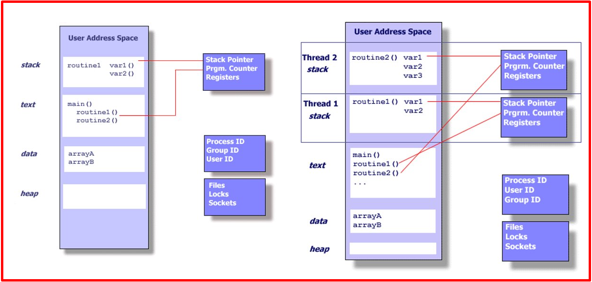   
</p>

+ Nhìn chung, để một chương trình tận dụng được lợi thế của Pthreads, nó phải có khả năng được tổ chức thành các task rời rạc, độc lập và có thể thực thi đồng thời. Ví dụ, nếu routine1 và routine2 có thể hoán đổi, xen kẽ và/hoặc chồng chéo trong thời gian thực, thì chúng có thể phân luồng.​

<p align="center">
  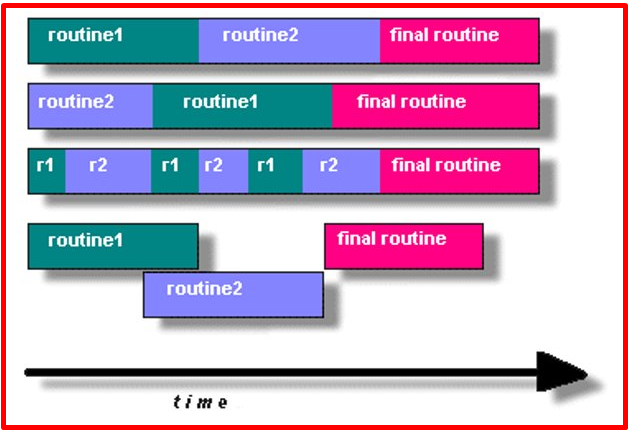   
</p>

+ Có một số mô hình phổ biến cho các chương trình luồng:
    + Manager/worker: một luồng duy nhất, quản lý phân công công việc cho các luồng khác, tức là các worker. Thông thường, Manager xử lý tất cả dữ liệu đầu vào và phân chia công việc cho các tác vụ khác.

    + Pipeline: một tác vụ được chia thành một chuỗi các thao tác con, mỗi thao tác được xử lý theo chuỗi, nhưng đồng thời, bởi một luồng khác nhau. Dây chuyền lắp ráp ô tô là mô hình mô tả tốt nhất mô hình này.

    + Peer(Đồng đẳng): tương tự như mô hình Manager/worker, nhưng sau khi main thread tạo ra các luồng khác, nó sẽ tham gia vào công việc.

+ Shared Memory Model:​
    + Tất cả các luồng đều có quyền truy cập vào cùng một global, shared memory​

    + Các luồng cũng có dữ liệu riêng của chúng

    + Lập trình viên chịu trách nhiệm đồng bộ hóa quyền truy cập (bảo vệ) globally shared data.

<p align="center">
  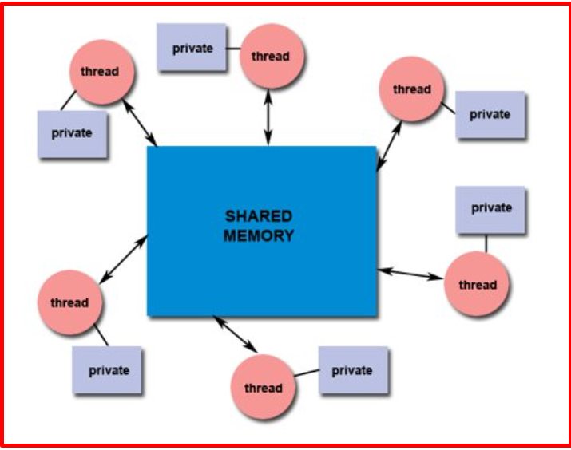   
</p>

+ Thread safeness:
    + Nói một cách ngắn gọn, đề cập đến khả năng của một ứng dụng thực thi nhiều luồng đồng thời mà không làm "đập vỡ" dữ liệu dùng chung hoặc tạo ra các "race" conditions.

    + Ví dụ: giả sử ứng dụng của ta tạo nhiều Thread, mỗi Thread thực hiện một lệnh gọi đến cùng một thư viện. Thư viện này truy cập/sửa đổi một cấu trúc toàn cục hoặc một vị trí trong bộ nhớ. Khi mỗi Thread gọi thư viện này, chúng có thể cố gắng sửa đổi cấu trúc toàn cục/vị trí bộ nhớ này cùng một lúc. Nếu thư viện không sử dụng một số loại cấu trúc đồng bộ hóa để ngăn chặn hỏng dữ liệu, thì nó không Thread safeness.

    + Điều này ngụ ý với người dùng các chương trình con thư viện bên ngoài rằng nếu bạn không chắc chắn 100% rằng chương trình con đó an toàn cho luồng, thì bạn sẽ phải đối mặt với những vấn đề có thể phát sinh.

    + Khuyến nghị: Hãy cẩn thận nếu ứng dụng của bạn sử dụng các thư viện hoặc đối tượng khác không đảm bảo rõ ràng tính an toàn cho Thread. Khi nghi ngờ, hãy giả định rằng chúng không an toàn cho Thread cho đến khi được chứng minh là ngược lại.

<p align="center">
     
</p>

<p align="center">
  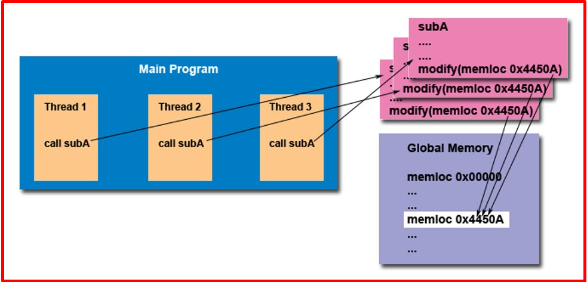   
</p>

### 2️⃣ Context switching
+ Khi 1 thread được tạo ra thì nó vào trạng thái ready, khi nó chạy thì sẽ rơi vào trạng thái running...

+ Context: Là khi process A tạm dừng để process B thực thi thì nó sẽ lưu trạng thái của process lại gồm không gian địa chỉ bộ nhớ, con trỏ program counter, các thông tin liên quan tới process ấy để khi lúc quay lại nó còn biết mình đang ở đâu, chạy tới đâu rồi mà còn chạy tiếp

+ Switching: hành động chuyển từ process A sang process B

<p align="center">
  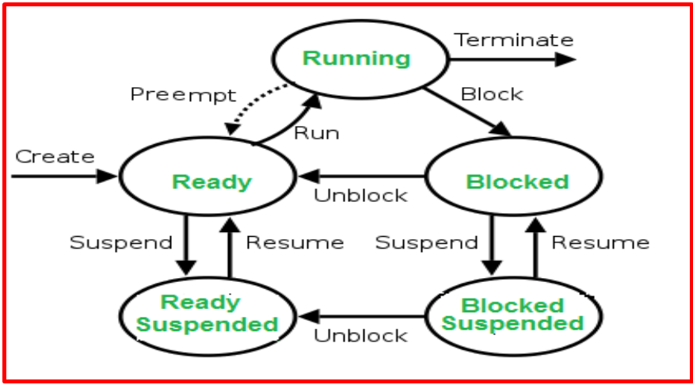   
</p>

### 3️⃣ So sánh process với thread
+ Cùng phân tích bài toán: Một network server được thiết kế để nhận và xử lý message đến từ nhiều clients khác nhau. Điều này có thể thực hiện bằng việc gọi fork() tạo ra nhiều process để xử lý dữ liệu cho nhiều clients:
    + Ta cũng có thể xử lý bài toán trên với việc sử dụng mutil-thread

+ Context switching time: 
    + Process cần nhiều thời gian hơn vì chúng nặng hơn

    + Thread cần ít thời gian hơn vì chúng nhẹ hơn process

+ Khi tạo tiến trình với fork(), tiến trình và tiến trình con nằm trên hai vùng nhớ được phân bổ khác nhau. Dẫn tới việc chia sẻ dữ liệu giữa chúng trở nên khó khăn hơn. Dẫn tới ta phải thông qua cơ chế IPC( semaphore, mutex... )

+ Dữ liệu được chia sẽ giữa các thread trong một tiến trình nhanh và dễ dàng hơn vì chúng cùng nằm trong một không gian bộ nhớ của tiến trình. Có thể trao đổi qua biến toàn cục, struct, mảng...

+ Shared memory:
    + Chia sẻ dữ liệu giữa các tiến trình là khó khăn hơn. Thông qua các cơ chế IPC
    + Các thread trong một process có thể chia sẻ dữ liệu với nhau nhanh chóng và dễ dàng

+ Khi tạo tiến trình với fork(), tiến trình và tiến trình con nằm trên hai vùng nhớ được phân bổ khác nhau, hoạt động độc lập với nhau. Khi một tiến trình xảy ra lỗi tiến trình khác vẫn thực thi bình thường.

+ Các threads trên một tiến trình hoạt động đồng thời với nhau. Khi một thread bị crashed sẽ khiến cho các thread khác chấm dứt

+ Crashed:
    + Nếu một process bị crashed, process khác vẫn thực thi bình thường

    + Nếu một thread bị crashed, các threads khác chấm dứt ngay lập tức

+ Khi tạo process bằng fork() thì sẽ có khái niệm cha con ông cháu các kiểu, tuy nhiên khi ta tạo thread thì không có cha còn gì cả mà tất cả đều ngang hàng với nhau

+ Cũng giống như một tiến trình được xác định bởi một process ID, một thread trong process được xác định bởi một thread ID

+ Cần phải làm rõ một vài điểm sau:
    + Process ID là duy nhất trên toàn hệ thống, trong đó thread ID là duy nhất trong một tiến trình (process)

    + Process ID là một giá trị số nguyên nhưng thread ID không nhất thiết phải là một giá trị số nguyên. Nó có thể là một structure. Thông thường ta dùng struct.

    + Process ID có thể được in ra rất dễ dàng trong khi thread ID thì không.

### 4️⃣ Thao tác với thread
***Thread ID***
+ Thread ID sẽ được đại diện bởi kiểu pthread_t

+ Phần lớn các trường hợp thread ID sẽ là một structure nên để so sánh hai thread ID với nhau ta cần một function có thể thực hiện công việc này (Đối với process ID là một số nguyên thì việc so sánh đơn giản hơn).

+ Để làm được việc này ta sử dụng hai hàm sau pthread_self() và pthread_equal()

<p align="center">
  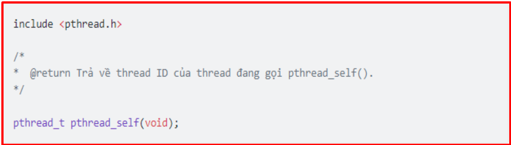   
</p>
<p align="center">
  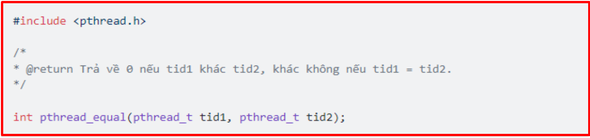   
</p>

+ Lấy một ví dụ về việc sử dụng hai chức năng trên, giả sử rằng ta có một danh sách liên kết chứa dữ liệu của các threads khác nhau:
    + Mỗi một node trong danh sách liên kết này chứa thread ID và dữ liệu tương ứng của thread ID đó

    + Lúc này, bất cứ khi nào thread muốn lấy dữ liệu của nó từ danh sách liên kết thì bước đầu tiên nó cần phải lấy được thread ID của chính mình bằng việc gọi pthread_self() và sau đó nó sẽ gọi pthread_equal() để kiểm tra node nào đang chứa dữ liệu mà nó cần

***Tạo một thread mới.***
+ Chương trình (program) được khởi chạy và trở thành một tiến trình (process), lúc này bản thân tiến trình đó chính là một single-thread (tiến trình đơn luồng).

+ Tiến trình tạo nhiều hơn 1 threads được gọi là mutiple-thread (tiến trình đa luồng).

+ Ta có thể kết luận rằng mọi tiến trình đều có ít nhất một thread. Trong đó, thread chứa hàm main được gọi là main thread.

+ Để tạo một thread mới chúng ta sử dụng hàm pthread_create().

```bash
int pthread_create(pthread_t *threadID, const pthread_attr_t *attr, void *(*start)(void *), void *arg);
    + Đối số đầu tiên: Một khi tiến trình được gọi thành công, đối số đầu tiên sẽ giữ thread ID của thread mới được tạo.
    + Đối số thứ hai: Thông thường giá trị này đặt thành NULL
    + Đối số thứ ba: Là một con trỏ hàm (function pointer). Mỗi một thread sẽ chạy riêng một function, địa chỉ của function này sẽ được truyền tại đối số thứ ba để linux biết được thread này bắt đầu chạy từ đâu.
    + Đối số thứ tự: Đối số arg được truyền vào có kiểu void, điều này cho phép ta truyền bất kỳ kiểu dữ liệu nào vào hàm xử lý của thread. Hoặc giá trị này có thể là NULL nếu ta không muốn truyền bất cứ đối số nào. Điều này sẽ được thể hiện rõ ràng hơn trong ví dụ dưới đây.
    + Return về 0 nếu thành công, một số dương khi lỗi
```

+ Ví dụ code tạo thread
```bash
#include <pthread.h>
#include <stdlib.h>
#include <stdio.h>
#define NUM_THREADS     5

void *PrintHello(void *threadid)
{
   long tid;
   tid = (long)threadid;
   printf("Hello World! It's me, thread #%ld!\n", tid);
   pthread_exit(NULL);
}

int main (int argc, char *argv[])
{
   pthread_t threads[NUM_THREADS];
   int rc;
   long t;
   for(t=0; t<NUM_THREADS; t++){
      printf("In main: creating thread %ld\n", t);
      rc = pthread_create(&threads[t], NULL, PrintHello, (void *)t);
      if (rc){
         printf("ERROR; return code from pthread_create() is %d\n", rc);
         exit(-1);
      }
   }

   /* Last thing that main() should do */
   pthread_exit(NULL);
}
```

+ Ví dụ code thread, makefile và truyền thông số vào:

```bash
#include <stdio.h>
#include <stdlib.h>
#include <string.h>
#include <unistd.h>
#include <pthread.h>

pthread_t thread_id1, thread_id2;

typedef struct {
    char name[30];
    char msg[30];
} thr_data_t;

static void *thr_handle(void *args) 
{
    pthread_t tid = pthread_self();
    thr_data_t *data = (thr_data_t *)args;

    if (pthread_equal(tid, thread_id1)) {
        // Thread 1
        printf("I'm thread_id1\n\n");

    } else {
        // Thread 2
        printf("I'm thread_id2\n");
        printf("Hello %s, welcome to join %s\n", data->name, data->msg);
    }
}

int main(int argc, char const *argv[])
{
    /* code */
    int ret;
    thr_data_t data = {0};

    strncpy(data.name, "ThoNV12", sizeof(data.name));                 
    strncpy(data.msg, "thread programming\n", sizeof(data.msg));

    if (ret = pthread_create(&thread_id1, NULL, &thr_handle, NULL)) {
        printf("pthread_create() error number=%d\n", ret);
        return -1;
    }

    sleep(2);

    if (ret = pthread_create(&thread_id2, NULL, &thr_handle, &data)) {
        printf("pthread_create() error number=%d\n", ret);
        return -1;
    }
    sleep(5);
    return 0;
}
```
```bash
CC := gcc
CFLAGS := -pthread

all:
	$(CC) -o out main.c $(CFLAG)

clean:
	rm -rf  exam
```

***Kết thúc thread***
+ Kết thúc thread sử dụng hàm pthread_exit()
<p align="center">
  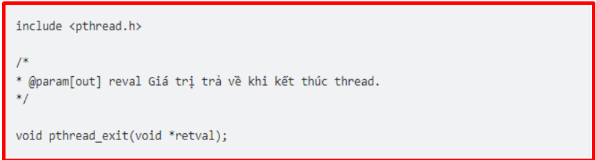   
</p>

+ Ta thấy rằng hàm này chỉ chấp nhận một đối số, đó là giá trị trả về từ thread đang gọi hàm này. 

+ Giá trị trả về này được truy cập bởi thread cha đang đợi thread này kết thúc và có thể được truy cập bởi một thread khác thông qua pthread_join()

### 5️⃣ Thread management

+ Thread kết thúc một cách bình thường

+ Thread kết thúc khi gọi hàm pthread_exit()

+ Thread bị hủy bỏ khi gọi hàm pthread_cancel()

+ Bất cứ một thread nào gọi hàm exit(), hoặc main thread kết thúc thì tất cả các thread còn lại kết thúc ngay lập tức

+ int pthread_exit(void *retval);
    + Một thread có thể được kết thức bằng cách gọi pthread_exit()
    + Các đối số:
        + *retval:  Chỉ định giá trị trả về của thread, giá trị này có thể thu được bởi một thread khác thông qua pthread_join()
        + Trả về 0 nếu thành công, nhỏ hơn 0 nếu thất bại.

+ int pthread_cancel(pthread_t thread)
    + pthread_cancel() gửi một yêu cầu kết thúc thread tới một thread cụ thể
    + Các đối số:
        + thread:  threadID của một thread cụ thể.
        + Trả về 0 nếu thành công, nhỏ hơn 0 nếu thất bại.

***Code sleep 5s sau đó thread 2 sẽ bị cancel và không in thông tin trong thread 2 ra nữa.***
```bash
#include <stdio.h>
#include <stdlib.h>
#include <string.h>
#include <unistd.h>
#include <pthread.h>

pthread_t thread_id1, thread_id2, thread_id3;

typedef struct {
    char name[30];
    char msg[30];
} thr_data_t;

static void *thr_handle1(void *args)
{
    thr_data_t *thr = (thr_data_t *)args;
    sleep(1);
    printf("hello %s !\n", thr->name);
    printf("thread1 handler\n");
    pthread_exit(NULL); // exit
}

static void *thr_handle2(void *args)
{
    sleep(5);
    //pthread_exit(NULL); // exit
    //exit(1);
    while (1) {
        printf("thread2 handler\n"); 
        sleep(1);
    };
}


static void *thr_handle3(void *args)
{
    pthread_detach(pthread_self());
    //sleep(2);
    // pthread_exit(NULL);
}

int main(int argc, char const *argv[])
{
    /* code */
    int ret, counter = 0;
    int retval;
    thr_data_t data = {0};

    strncpy(data.name, "HuLa", sizeof(data.name));                 
    strncpy(data.msg, "Posix thread programming\n", sizeof(data.msg));


    if (ret = pthread_create(&thread_id1, NULL, &thr_handle1, &data)) {
        printf("pthread_create() error number=%d\n", ret);
        return -1;
    }

    if (ret = pthread_create(&thread_id2, NULL, &thr_handle2, NULL)) {
        printf("pthread_create() error number=%d\n", ret);
        return -1;
    }

    sleep(1);
    // pthread_cancel(thread_id2);
    // pthread_join(thread_id2, NULL);
    // printf("thread_id2 termination\n"); 
    while(1);
    while (1) {
        if (ret = pthread_create(&thread_id3, NULL, &thr_handle3, NULL)) {
            printf("pthread_create() error number=%d\n", ret);
            break;
        }
        counter++;
        // pthread_join(thread_id3, NULL);

        if (counter%1000 == 0) {
            printf("Thread created: %d\n", counter);
        }
    }   
    return 0;
}
```
```bash

CC := gcc
CFLAGS := -pthread

all:
	$(CC) -o out main.c $(CFLAGS)

clean:
	rm -rf  out
```

***Joinable Thread***
+ Để thu được giá trị kết thúc của một thread khác ta sử dung pthread_join()

+ Hoạt động này được gọi là joining

+ int pthread_join(pthread_t thread, void **retval);

    + pthread_join() sẽ block cho đến khi một thread kết thúc (threadID được truyền vào đối số thread). Nếu thread đó đã kết thúc thì pthread_join return ngay lập tức. tương tự như waitpid().

    + Khi thread kết thúc, về cơ bản nó sẽ được xử lý như tương tự như một zombie process. Nếu số lượng zombie thread ngày càng lớn. Một lúc nào đó ta sẽ không thể tạo thêm thread được nữa. Vai trò của pthread_join() tương tự với waitpid().

<p align="center">
  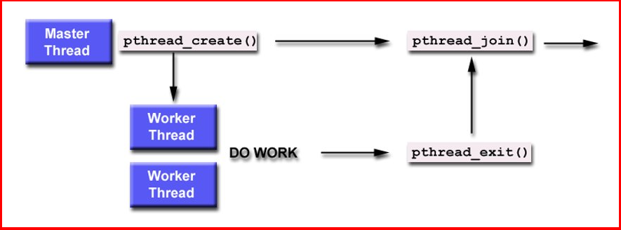   
</p>

+ Code chứng minh tạo nhiều thread quá thì không tạo đươc nữa.
```bash
#include <stdio.h>
#include <stdlib.h>
#include <string.h>
#include <unistd.h>
#include <pthread.h>

pthread_t thread_id1, thread_id2, thread_id3;

typedef struct {
    char name[30];
    char msg[30];
} thr_data_t;

static void *thr_handle1(void *args)
{
    thr_data_t *thr = (thr_data_t *)args;
    sleep(1);
    printf("hello %s !\n", thr->name);
    printf("thread1 handler\n");
    pthread_exit(NULL); // exit
}

static void *thr_handle2(void *args)
{
    sleep(5);
    //pthread_exit(NULL); // exit
    //exit(1);
    while (1) {
        printf("thread2 handler\n"); 
        sleep(1);
    };
}


static void *thr_handle3(void *args)
{
    //pthread_detach(pthread_self());
    //sleep(2);
    pthread_exit(NULL);
}

int main(int argc, char const *argv[])
{
    /* code */
    int ret, counter = 0;
    int retval;
    thr_data_t data = {0};

    strncpy(data.name, "HuLa", sizeof(data.name));                 
    strncpy(data.msg, "Posix thread programming\n", sizeof(data.msg));


    if (ret = pthread_create(&thread_id1, NULL, &thr_handle1, &data)) {
        printf("pthread_create() error number=%d\n", ret);
        return -1;
    }

    if (ret = pthread_create(&thread_id2, NULL, &thr_handle2, NULL)) {
        printf("pthread_create() error number=%d\n", ret);
        return -1;
    }

    //sleep(1);
    // pthread_cancel(thread_id2);
    // pthread_join(thread_id2, NULL);
    // printf("thread_id2 termination\n"); 
    while (1) {
        if (ret = pthread_create(&thread_id3, NULL, &thr_handle3, NULL)) {
            printf("pthread_create() error number=%d\n", ret);
            break;
        }
        counter++;
        // pthread_join(thread_id3, NULL);

        if (counter%1000 == 0) {
            printf("Thread created: %d\n", counter);
        }
    }   
    return 0;
}
```
```bash
CC := gcc
CFLAGS := -pthread

all:
	$(CC) -o out main.c $(CFLAGS)

clean:
	rm -rf  out
```

+ Khi này ta chưa dùng pthread_join thì nó sẽ tạo ra thread zombie, nên để ok thì ta thêm pthread_join() như code dưới.

```bash
#include <stdio.h>
#include <stdlib.h>
#include <string.h>
#include <unistd.h>
#include <pthread.h>

pthread_t thread_id1, thread_id2, thread_id3;

typedef struct {
    char name[30];
    char msg[30];
} thr_data_t;

static void *thr_handle1(void *args)
{
    thr_data_t *thr = (thr_data_t *)args;
    sleep(1);
    printf("hello %s !\n", thr->name);
    printf("thread1 handler\n");
    pthread_exit(NULL); // exit
}

static void *thr_handle2(void *args)
{
    sleep(5);
    //pthread_exit(NULL); // exit
    //exit(1);
    while (1) {
        printf("thread2 handler\n"); 
        sleep(1);
    };
}


static void *thr_handle3(void *args)
{
    //pthread_detach(pthread_self());
    //sleep(2);
    pthread_exit(NULL);
}

int main(int argc, char const *argv[])
{
    /* code */
    int ret, counter = 0;
    int retval;
    thr_data_t data = {0};

    strncpy(data.name, "HuLa", sizeof(data.name));                 
    strncpy(data.msg, "Posix thread programming\n", sizeof(data.msg));


    if (ret = pthread_create(&thread_id1, NULL, &thr_handle1, &data)) {
        printf("pthread_create() error number=%d\n", ret);
        return -1;
    }

    if (ret = pthread_create(&thread_id2, NULL, &thr_handle2, NULL)) {
        printf("pthread_create() error number=%d\n", ret);
        return -1;
    }

    //sleep(1);
    // pthread_cancel(thread_id2);
    // pthread_join(thread_id2, NULL);
    // printf("thread_id2 termination\n"); 
    while (1) {
        if (ret = pthread_create(&thread_id3, NULL, &thr_handle3, NULL)) {
            printf("pthread_create() error number=%d\n", ret);
            break;
        }
        counter++;
        pthread_join(thread_id3, NULL);

        if (counter%1000 == 0) {
            printf("Thread created: %d\n", counter);
        }
    }   
    return 0;
}
```
```bash
CC := gcc
CFLAGS := -pthread

all:
	$(CC) -o out main.c $(CFLAGS)

clean:
	rm -rf  out
```

+ Điểm khác biệt giữa pthread_join() và waitpid()?
    + Waitpid linh hoạt hơn, còn pthread_join thì chỉ đợi được một thằng cụ  thể.

+ Các đối số:
    + thread:  ThreadID của một thread cụ thể.
    + **retval: Nếu retval khác NULL, nó sẽ nhận được giá trị trả về của pthread_exit().
    + Trả về 0 nếu thành công, nhỏ hơn 0 nếu thất bại.


+ Sau 5s đợi khi gọi pthread_join() thì sẽ có hàm exit() và khi này cả chương trình cũng kết thúc theo do 1 thread exit thì khiến cho toàn bộ thread cũng exit theo

```bash
#include <stdio.h>
#include <stdlib.h>
#include <string.h>
#include <unistd.h>
#include <pthread.h>

pthread_t thread_id1, thread_id2, thread_id3;

typedef struct {
    char name[30];
    char msg[30];
} thr_data_t;

static void *thr_handle1(void *args)
{
    thr_data_t *thr = (thr_data_t *)args;
    sleep(1);
    printf("hello %s !\n", thr->name);
    printf("thread1 handler\n");

    pthread_exit(NULL); // exit
}

static void *thr_handle2(void *args)
{
    sleep(5);
    //pthread_exit(NULL); // exit
    exit(1);
    while (1) {
        printf("thread2 handler\n"); 
        sleep(1);
    };
}

static void *thr_handle3(void *args)
{
    pthread_detach(pthread_self());
    //sleep(2);
    //pthread_exit(NULL);
}

int main(int argc, char const *argv[])
{
    /* code */
    int ret, counter = 0;
    int retval;
    thr_data_t data = {0};

    strncpy(data.name, "ThoNV12", sizeof(data.name));                 
    strncpy(data.msg, "Posix thread programming\n", sizeof(data.msg));

    if (ret = pthread_create(&thread_id1, NULL, &thr_handle1, &data)) {
        printf("pthread_create() error number=%d\n", ret);
        return -1;
    }

    if (ret = pthread_create(&thread_id2, NULL, &thr_handle2, NULL)) {
        printf("pthread_create() error number=%d\n", ret);
        return -1;
    }
    
    sleep(5);
    // pthread_cancel(thread_id2);
    pthread_join(thread_id2, NULL);
    printf("thread_id2 termination\n"); 
    while (1) {
        if (ret = pthread_create(&thread_id3, NULL, &thr_handle3, NULL)) {
            printf("pthread_create() error number=%d\n", ret);
            break;
        }
        counter++;
        //pthread_join(thread_id3, NULL);

        if (counter%1000 == 0) {
            printf("Thread created: %d\n", counter);
        }
    }   
    return 0;
}
```

+ Nếu dùng pthread_exit(NULL) thì chỉ kết thuc mình thread 2 thôi

```bash
#include <stdio.h>
#include <stdlib.h>
#include <string.h>
#include <unistd.h>
#include <pthread.h>

pthread_t thread_id1, thread_id2, thread_id3;

typedef struct {
    char name[30];
    char msg[30];
} thr_data_t;

static void *thr_handle1(void *args)
{
    thr_data_t *thr = (thr_data_t *)args;
    sleep(1);
    printf("hello %s !\n", thr->name);
    printf("thread1 handler\n");

    pthread_exit(NULL); // exit
}

static void *thr_handle2(void *args)
{
    sleep(5);
    pthread_exit(NULL); // exit
    // exit(1);
    while (1) {
        printf("thread2 handler\n"); 
        sleep(1);
    };
}

static void *thr_handle3(void *args)
{
    pthread_detach(pthread_self());
    //sleep(2);
    //pthread_exit(NULL);
}

int main(int argc, char const *argv[])
{
    /* code */
    int ret, counter = 0;
    int retval;
    thr_data_t data = {0};

    strncpy(data.name, "ThoNV12", sizeof(data.name));                 
    strncpy(data.msg, "Posix thread programming\n", sizeof(data.msg));

    if (ret = pthread_create(&thread_id1, NULL, &thr_handle1, &data)) {
        printf("pthread_create() error number=%d\n", ret);
        return -1;
    }

    if (ret = pthread_create(&thread_id2, NULL, &thr_handle2, NULL)) {
        printf("pthread_create() error number=%d\n", ret);
        return -1;
    }
    
    sleep(5);
    // pthread_cancel(thread_id2);
    pthread_join(thread_id2, NULL);
    printf("thread_id2 termination\n"); 
    while (1) {
        if (ret = pthread_create(&thread_id3, NULL, &thr_handle3, NULL)) {
            printf("pthread_create() error number=%d\n", ret);
            break;
        }
        counter++;
        //pthread_join(thread_id3, NULL);

        if (counter%1000 == 0) {
            printf("Thread created: %d\n", counter);
        }
    }   
    return 0;
}
```

***Detaching a Thread***
+ Mặc định, một thread là joinable , tức là khi thread kết thúc thì một thread khác có thể thu được giá trị trả về của thread đó thông qua pthread_join()

+ Tuy nhiên, nhiều trường hợp chúng ta không cần quan tâm về trạng thái kết thúc của thread mà chỉ cần hệ thống tự động clean và remove thread một cách tự động

+ Trường hợp này chúng ta có thể đặt thread vào trạng thái detached thông qua việc gọi pthread_detached().

+ int pthread_detach(pthread_t thread);

    + Một khi thread bị detached, ta không thể dùng pthread_join() để thu được trạng thái kết thúc của thread, và thread không thể trở về trạng thái joinable

    + Các đối số:
        + thread:  ThreadID của một thread cụ thể.
        + Trả về 0 nếu thành công, nhỏ hơn 0 nếu thất bại.

+ Code: Ta tạo thread 3 liên tục trong while 1 và detach ở thread 3, khi này hệ thống tự dọn dẹp thread

```bash
#include <stdio.h>
#include <stdlib.h>
#include <string.h>
#include <unistd.h>
#include <pthread.h>

pthread_t thread_id1, thread_id2, thread_id3;

typedef struct {
    char name[30];
    char msg[30];
} thr_data_t;


static void *thr_handle1(void *args)
{
    thr_data_t *thr = (thr_data_t *)args;
    sleep(1);
    printf("hello %s !\n", thr->name);
    printf("thread1 handler\n");

    pthread_exit(NULL); // exit
}

static void *thr_handle2(void *args)
{
    sleep(5);
    // pthread_exit(NULL); // exit
    // exit(1);
    while (1) {
        printf("thread2 handler\n"); 
        sleep(1);
    };
}

static void *thr_handle3(void *args)
{
    pthread_detach(pthread_self());
    //sleep(2);
    // pthread_exit(NULL);
}

int main(int argc, char const *argv[])
{
    /* code */
    int ret, counter = 0;
    int retval;
    thr_data_t data = {0};

    strncpy(data.name, "ThoNV12", sizeof(data.name));                 
    strncpy(data.msg, "Posix thread programming\n", sizeof(data.msg));

    if (ret = pthread_create(&thread_id1, NULL, &thr_handle1, &data)) {
        printf("pthread_create() error number=%d\n", ret);
        return -1;
    }

    if (ret = pthread_create(&thread_id2, NULL, &thr_handle2, NULL)) {
        printf("pthread_create() error number=%d\n", ret);
        return -1;
    }
    
    // sleep(5);
    // pthread_cancel(thread_id2);
    // pthread_join(thread_id2, NULL);
    // printf("thread_id2 termination\n"); 
    while (1) {
        if (ret = pthread_create(&thread_id3, NULL, &thr_handle3, NULL)) {
            printf("pthread_create() error number=%d\n", ret);
            break;
        }
        counter++;
        // pthread_join(thread_id3, NULL);

        if (counter%1000 == 0) {
            printf("Thread created: %d\n", counter);
        }
    }   

    return 0;
}
```

### 6️⃣ Thread synchronization
+ Cả 2 thread cùng ghi vào một biến. Dẫn đến dữ liệu không chính xác

+ Một trong các điểm mạnh của thread đó chính là việc chia sẻ dữ liệu với nhau thông qua các biến global.

+ Tuy nhiên, nó sẽ tồn tại một số vấn đề về đồng bộ.

+ Điều gì sẽ xảy ra nếu nhiều thread cùng sửa một biến vào cùng một thời điểm? Hay một thread đang cố đọc giá trị của một biến trong khi thread khác đang sửa đổi biến đó?

***Atomic/ Nonatomic***
+ Atomic: (Cơ chế độc quyền) Tại một thời điểm chỉ có một thread duy nhất được truy cập vào tài nguyên được chia sẻ (shared resource). Vì vậy, atomic an toàn.

+ Nonatomic: Nhiều threads có thể truy cập vào shared resource cùng một thời điểm. Vì vậy, nonatomic không an toàn.

+ Atomic là cơ chế độc quyền, chỉ có một thread duy nhất được truy cập thuộc tính tại một thời điểm

+ Khi nhiều thread tham chiếu đến nó thì thread này thay đổi giá trị xong thì thread khác mới được quyền thay đổi, đảm bảo chỉ một thread được thay đổi giá trị ở một thời điểm

+ Vì vậy, atomic là an toàn

+ Thuộc tính nonatomic, nhiều thread truy cập cùng thời điểm có thể thay đổi thuộc tính, không có cơ chế nào để bảo vệ thuộc tính. Vì vậy thuộc tính nonatomic không an toàn

***Critical Section (Vùng quan trọng)***

+ Thuật ngữ critical section được dùng để chỉ đoạn code truy cập vào vùng tài nguyên được chia sẻ giữa (shared resource) giữa các threads và việc thực thi của nó nằm trong bối cảnh atomic. Tức là, thời điểm đoạn code được thực thi sẽ không bị gián đoạn bởi bất cứ một thread nào truy cập đồng thời vào shared resource đó. Ví dụ như 1 file data

***Mutex***

+ Mutex (mutual exclusion) là một kĩ thuật được sử dụng để đảm bảo rằng tại một thời điểm chỉ có 1 thread mới có quyền truy cập vào các tài nguyên dùng chung (shared resources)

+ Biến mutex hoạt động như một "khóa" bảo vệ quyền truy cập vào tài nguyên dữ liệu được chia sẻ. Khái niệm cơ bản về mutex được sử dụng trong Pthreads là chỉ một luồng có thể khóa (hoặc sở hữu) một biến mutex tại bất kỳ thời điểm nào. Do đó, ngay cả khi nhiều luồng cố gắng khóa một mutex, chỉ có một luồng thành công. Không luồng nào khác có thể sở hữu mutex đó cho đến khi luồng sở hữu mở khóa mutex đó. Các luồng phải "lần lượt" truy cập dữ liệu được bảo vệ.

+ Việc triển khai mutex nhìn chung thực hiện qua 3 bước:

    + Khởi tạo khóa mutex

    + Thực hiện khóa mutex cho các shared resource trước khi vào critical section

    + Thực hiện truy cập vào shared resources

    + Mở khóa/giải phóng khóa mutex

    + Ví dụ mình có dữ liệu là aaaaa và bbbbb cùng muốn ghi vào file data.txt thì ban đầu thằng a có khóa mutex trước nên se ghi aaaaa trước, sau đó a nhả khóa cho b và b ghi bbbbbb lúc này ta được là aaaaabbbbb chứ không phải là abababab

***Allocated Mutex (khởi tạo khóa )***

+ Khóa mutex là một biến kiểu pthread_mutex_t. Trước khi sử dụng thì ta luôn phải khởi tạo khóa mutex

+ Khóa mutex có thể được cấp phát tĩnh hoặc động.

+ Khi không sử dụng ta phải hủy mutex bằng pthread_mutex_destroy(). Khởi tạo tĩnh thì không cần phải gọi hàm này.

***Locking and Unlocking a Mutex ( Khóa)***

+ Sau khi khởi tạo, khóa mutex rơi vào trạng thái unlocked

+ Để lock hoặc unlock một khóa mutex ta sử dụng hai hàm pthread_mutex_lock() và pthread_mutex_unlock().

+ Khi nhiều luồng cạnh tranh để giành một mutex, luồng thua cuộc sẽ bị lock. Để tránh block ta có thể sử dụng hàm pthread_mutex_trylock (mutex)​

+ Biến mutex phải được khai báo với kiểu pthread_mutex_t và phải được khởi tạo trước khi có thể sử dụng. Có hai cách để khởi tạo biến mutex:

    + Tĩnh, khi biến được khai báo. Ví dụ: pthread_mutex_t mymutex = PTHREAD_MUTEX_INITIALIZER

    + Động, với hàm pthread_mutex_init().

+ Object attr được sử dụng để thiết lập các thuộc tính cho Object mutex và phải có kiểu pthread_mutexattr_t nếu được sử dụng (có thể được chỉ định là NULL để chấp nhận các giá trị mặc định). Chuẩn Pthreads định nghĩa ba thuộc tính mutex tùy chọn:

    + Protocol: Chỉ định giao thức được sử dụng để ngăn chặn việc đảo ngược ưu tiên cho một mutex.

    + Prioceiling: Chỉ định mức ưu tiên trần của một mutex.

    + Process-shared: Chỉ định việc chia sẻ tiến trình của một mutex.

+ Các thủ tục pthread_mutexattr_init() và pthread_mutexattr_destroy() được sử dụng để tạo và hủy các đối tượng thuộc tính mutex.

+ pthread_mutex_destroy() nên được sử dụng để giải phóng một đối tượng mutex không còn cần thiết.

+ Hàm pthread_mutex_lock() được một luồng sử dụng để khóa biến mutex được chỉ định. Nếu mutex đã bị khóa bởi một luồng khác, lệnh gọi này sẽ bị block cho đến khi mutex được mở khóa.

+ Hàm pthread_mutex_trylock() sẽ cố gắng khóa một mutex. Tuy nhiên, nếu mutex đã bị khóa, hàm sẽ trả về ngay lập tức với error code "busy". Hàm này có thể hữu ích trong việc ngăn chặn tình trạng deadlock conditions, chẳng hạn như trong trường hợp đảo ngược ưu tiên.

+ pthread_mutex_unlock() sẽ mở khóa một mutex nếu được gọi bởi luồng sở hữu. Việc gọi hàm này là bắt buộc sau khi một luồng hoàn tất việc sử dụng dữ liệu được bảo vệ nếu các luồng khác muốn lấy mutex để làm việc với dữ liệu được bảo vệ. Lỗi sẽ được trả về nếu:

    + Nếu mutex đã được mở khóa

    + Nếu mutex thuộc sở hữu của một luồng khác

+ Câu hỏi: Khi có nhiều hơn một luồng đang chờ một mutex đã bị khóa, luồng nào sẽ được cấp khóa trước sau khi mutex được giải phóng?

+ int pthread_mutex_lock(pthread_mutex_t *mutex);

    + Khi khóa mutex ở trạng thái unlocked, pthread_mutex_lock() sẽ return ngay lập tức. Ngược lại, nếu mutex đang locked bởi một thread khác thì pthread_mutex_lock() sẽ bị block cho tới khi mutex được unlocked.

    + Các đối số:
        + *mutex: Con trỏ tới khóa mutex
        + Trả về 0 nếu thành công, nhỏ hơn 0 nếu thất bại

+ int pthread_mutex_unlock(pthread_mutex_t *mutex);
    + Unlock một khóa mutex.
    + Các đối số:
        + *mutex: Con trỏ tới khóa mutex
        + Trả về 0 nếu thành công, nhỏ hơn 0 nếu thất bại.

+ Chương trình ví dụ này minh họa việc sử dụng các biến mutex trong một chương trình luồng thực hiện phép tính tích vô hướng. Dữ liệu chính được cung cấp cho tất cả các luồng thông qua một cấu trúc có thể truy cập toàn cục. Mỗi luồng xử lý một phần dữ liệu khác nhau. Luồng chính chờ tất cả các luồng hoàn tất việc tính toán, sau đó in ra tổng kết quả. (dotprod_mutex.c)
```bash
#include <pthread.h>
#include <stdio.h>
#include <stdlib.h>

typedef struct 
 {
   double      *a;
   double      *b;
   double     sum; 
   int     veclen; 
 } DOTDATA;

/* Define globally accessible variables and a mutex */

#define NUMTHRDS 4
#define VECLEN 100000
DOTDATA dotstr; 
pthread_t callThd[NUMTHRDS];
pthread_mutex_t mutexsum;

void *dotprod(void *arg)
{

/* Define and use local variables for convenience */

   int i, start, end, len ;
   long offset;
   double mysum, *x, *y;
   offset = (long)arg;
     
   len = dotstr.veclen;
   start = offset*len;
   end   = start + len;
   x = dotstr.a;
   y = dotstr.b;

/*
Perform the dot product and assign result
to the appropriate variable in the structure. 
*/
   mysum = 0;
   for (i=start; i<end ; i++) 
    {
      mysum += (x[i] * y[i]);
    }

/*
Lock a mutex prior to updating the value in the shared
structure, and unlock it upon updating.
*/
   pthread_mutex_lock (&mutexsum);
   dotstr.sum += mysum;
   printf("Thread %ld did %d to %d:  mysum=%f global sum=%f\n",offset,start,end,mysum,dotstr.sum);
   pthread_mutex_unlock (&mutexsum);

   pthread_exit((void*) 0);
}

int main (int argc, char *argv[])
{
long i;
double *a, *b;
void *status;
pthread_attr_t attr;

/* Assign storage and initialize values */

a = (double*) malloc (NUMTHRDS*VECLEN*sizeof(double));
b = (double*) malloc (NUMTHRDS*VECLEN*sizeof(double));
  
for (i=0; i<VECLEN*NUMTHRDS; i++) {
  a[i]=1;
  b[i]=a[i];
  }

dotstr.veclen = VECLEN; 
dotstr.a = a; 
dotstr.b = b; 
dotstr.sum=0;

pthread_mutex_init(&mutexsum, NULL);
         
/* Create threads to perform the dotproduct  */
pthread_attr_init(&attr);
pthread_attr_setdetachstate(&attr, PTHREAD_CREATE_JOINABLE);

for(i=0;i<NUMTHRDS;i++)
  {
  /* Each thread works on a different set of data.
   * The offset is specified by 'i'. The size of
   * the data for each thread is indicated by VECLEN.
   */
   pthread_create(&callThd[i], &attr, dotprod, (void *)i); 
   }

pthread_attr_destroy(&attr);
/* Wait on the other threads */

for(i=0;i<NUMTHRDS;i++) {
  pthread_join(callThd[i], &status);
  }
/* After joining, print out the results and cleanup */

printf ("Sum =  %f \n", dotstr.sum);
free (a);
free (b);
pthread_mutex_destroy(&mutexsum);
pthread_exit(NULL);
}
```

+ Code mutex Thraed

```bash
#include <stdio.h>
#include <stdlib.h>
#include <string.h>
#include <unistd.h>
#include <pthread.h>

pthread_mutex_t lock1 = PTHREAD_MUTEX_INITIALIZER;
pthread_mutex_t lock2 = PTHREAD_MUTEX_INITIALIZER;
int counter = 2; // shared variable/shared resources/global variable

typedef struct {
    char name[30];
    char msg[30];
} thread_args_t;

static void *handle_th1(void *args) 
{   

    thread_args_t *thr = (thread_args_t *)args;
    //sleep(1);

    pthread_mutex_lock(&lock1);
    // critical section 
    printf("hello %s !\n", thr->name);
    printf("thread1 handler, counter: %d\n", ++counter);
    sleep(5);

    pthread_mutex_unlock(&lock1);

    pthread_exit(NULL); // exit

}

static void *handle_th2(void *args) 
{
    pthread_mutex_lock(&lock1);
    printf("thread2 handler, counter: %d\n", ++counter);
    pthread_mutex_unlock(&lock1);

    pthread_exit(NULL); // exit
}

int main(int argc, char const *argv[])
{
    /* code */
    int ret;
    thread_args_t thr;
    pthread_t thread_id1, thread_id2;

    memset(&thr, 0x0, sizeof(thread_args_t));
    strncpy(thr.name, "phonglt9", sizeof(thr.name));

    if (ret = pthread_create(&thread_id1, NULL, &handle_th1, &thr)) {
        printf("pthread_create() error number=%d\n", ret);
        return -1;
    }

    if (ret = pthread_create(&thread_id2, NULL, &handle_th2, NULL)) {
        printf("pthread_create() error number=%d\n", ret);
        return -1;
    }
    
    // used to block for the end of a thread and release
    pthread_join(thread_id1,NULL);  
    pthread_join(thread_id2,NULL);

    return 0;
}
```
```bash
# Mutilple Thread
CC := gcc
CFLAGS := -pthread

all:
	$(CC) -o out main.c $(CFLAGS)

clean:
	rm -rf  out
```

***Mutex Deadlocks***
+ Hiện tượng một thread khóa một mutex và không thể thoát ra được được gọi là mutex deadlock.

<p align="center">
  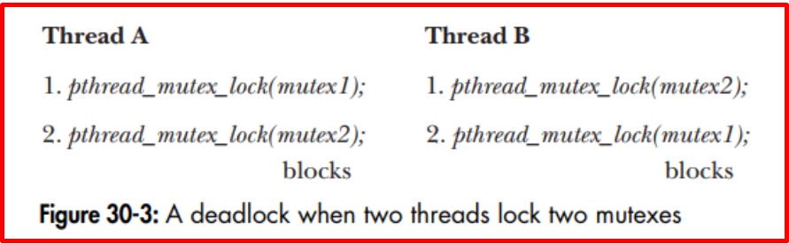   
</p>

+ Thằng A lock mutex 1 và đang đợi thằng B unlock 1, thằng B lock mutex 2 đang đợi thằng A unlock mutex 2
+ Ví dụ: Trong một thread ta đang lock, và ta lại gọi lock tiếp nữa thì nó sẽ bị block và dừng ở đó mãi luôn.


***Sync – condition variables (condition variable)***
+ Condition variables cung cấp một cách khác để các luồng đồng bộ hóa. Trong khi mutex thực hiện đồng bộ hóa bằng cách kiểm soát luồng truy cập dữ liệu, Condition variable cho phép các luồng đồng bộ hóa dựa trên giá trị thực của dữ liệu.

+ Nếu không có Condition variable, lập trình viên sẽ cần phải để các luồng liên tục polling (có thể trong một phần quan trọng) để kiểm tra xem condition có được đáp ứng hay không. Điều này có thể rất tốn tài nguyên vì thread sẽ liên tục bận rộn với hoạt động này. Condition variable là một cách để đạt được mục tiêu tương tự mà không cần polling.

+ Condition variable luôn được sử dụng kết hợp với khóa mutex.

+ Một mutex được sử dụng việc truy cập vào shared variable cùng một thời điểm.

+ Một condition variable được sử dụng để thông báo tới một thead khác về sự thay đổi của một shared variable và cho phép một thread khác block cho tới khi nhận được thông báo

+ Khi thoát 1 thread thì làm sao để biết thread tiếp theo chạy là gì ---> Dùng condition variables
+ Routines:​

    + pthread_cond_init (condition,attr)​
    + pthread_cond_destroy (condition)​
    + pthread_condattr_init (attr)​
    + pthread_condattr_destroy (attr)​

+ Allocated Condition Variables:
    + Condition variable là một biến kiểu pthread_cond_t. Trước khi sử dụng thì ta luôn phải khởi tạo nó
    + Condition variable có thể được cấp phát tĩnh hoặc động
    + pthread_cond_t cond = PTHREAD_COND_INITIALIZER; 
    + int pthread_cond_init(pthread_cond_t *cond, const pthread_condattr_t *attr); 
    + Khi không sử dụng ta phải hủy condition variable bằng pthread_cond_destroy (). Khởi tạo tĩnh thì không cần phải gọi hàm này.

<p align="center">
  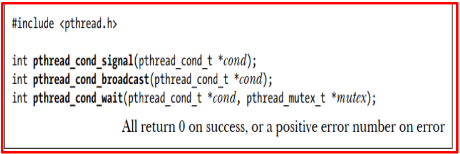   
</p>

+ Condition variable phải được khai báo với kiểu pthread_cond_t và phải được khởi tạo trước khi sử dụng. Có hai cách để khởi tạo condition variable:
    + Tĩnh, khi biến được khai báo. Ví dụ: pthread_cond_t myconvar = PTHREAD_COND_INITIALIZER;
    + Động, với hàm pthread_cond_init(). ID của condition variable được tạo sẽ được trả về luồng gọi thông qua tham số điều kiện. Phương thức này cho phép thiết lập các thuộc tính đối tượng condition variable, attr.

+ Đối tượng attr tùy chọn được sử dụng để thiết lập các thuộc tính condition variable. Chỉ có một thuộc tính được định nghĩa cho các condition variable: process-shared, cho phép các luồng trong các tiến trình khác nhìn thấy condition variable. Đối tượng thuộc tính, nếu được sử dụng, phải có kiểu pthread_condattr_t (có thể được chỉ định là NULL để chấp nhận các giá trị mặc định).

+ Các hàm pthread_condattr_init() và pthread_condattr_destroy() được sử dụng để tạo và destroy condition variable attribute objects.
+ pthread_cond_destroy() nên được sử dụng để giải phóng một condition variable không còn cần thiết nữa.

<p align="center">
  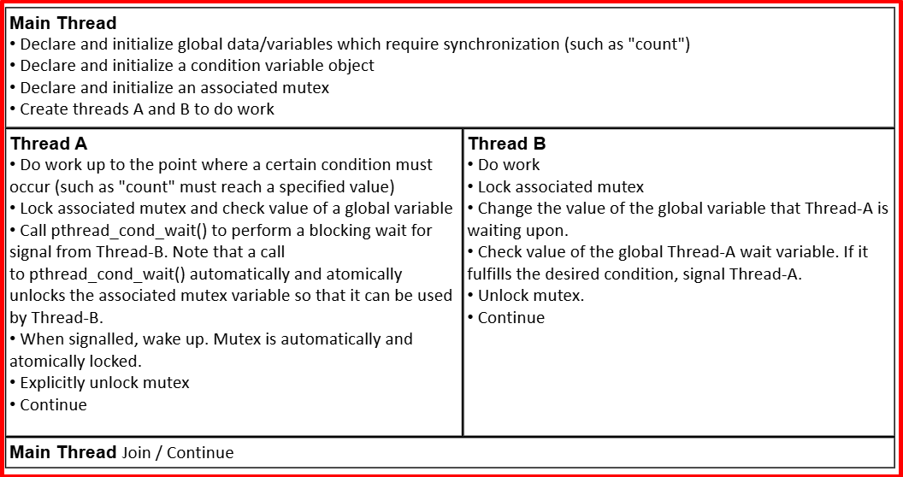   
</p>

+ Signaling and Waiting
    + Hai hoạt động chính của condition variable là signal và wait.

+ Routines:​
    + pthread_cond_wait (condition,mutex)​
    + pthread_cond_signal (condition)​
    + pthread_cond_broadcast (condition)​

+ pthread_cond_wait() sẽ chặn luồng gọi cho đến khi điều kiện được chỉ định được báo hiệu. Hàm này nên được gọi khi mutex bị khóa, và nó sẽ tự động giải phóng mutex trong khi chờ. Sau khi nhận được tín hiệu và luồng được đánh thức, mutex sẽ tự động bị khóa để luồng sử dụng. Sau đó, lập trình viên sẽ chịu trách nhiệm mở khóa mutex khi luồng hoàn tất việc xử lý.

+ Hàm pthread_cond_signal() được sử dụng để báo hiệu (hoặc đánh thức) một luồng khác đang chờ biến điều kiện. Nó nên được gọi sau khi mutex bị khóa và phải được mở khóa mutex để hàm pthread_cond_wait() hoàn tất.

+ Nên sử dụng hàm pthread_cond_broadcast() thay cho pthread_cond_signal() nếu có nhiều hơn một luồng đang ở trạng thái chờ chặn.

+ Việc gọi pthread_cond_signal() trước khi gọi pthread_cond_wait() là một lỗi logic.

+ Ví dụ - Sử dụng Biến Điều kiện: minh họa việc sử dụng một số hàm biến điều kiện Pthread. Hàm chính tạo ra ba luồng. Hai luồng thực hiện công việc và cập nhật biến "count". Luồng thứ ba đợi cho đến khi biến count đạt đến một giá trị được chỉ định.
```bash
#include <pthread.h>
#include <stdio.h>
#include <stdlib.h>
#include <unistd.h>

#define NUM_THREADS  3
#define TCOUNT 10
#define COUNT_LIMIT 12

int     count = 0;
int     thread_ids[3] = {0,1,2};
pthread_mutex_t count_mutex;
pthread_cond_t count_threshold_cv;

void *inc_count(void *t) 
{
  int i;
  long my_id = (long)t;

  for (i=0; i<TCOUNT; i++) {
    pthread_mutex_lock(&count_mutex);
    count++;

    /* 
    Check the value of count and signal waiting thread when condition is
    reached.  Note that this occurs while mutex is locked. 
    */
    if (count == COUNT_LIMIT) {
      pthread_cond_signal(&count_threshold_cv);
      printf("inc_count(): thread %ld, count = %d  Threshold reached.\n", 
             my_id, count);
      }
    printf("inc_count(): thread %ld, count = %d, unlocking mutex\n", 
	   my_id, count);
    pthread_mutex_unlock(&count_mutex);

    /* Do some "work" so threads can alternate on mutex lock */
    sleep(1);
    }
  pthread_exit(NULL);
}

void *watch_count(void *t) 
{
  long my_id = (long)t;

  printf("Starting watch_count(): thread %ld\n", my_id);

  /*
  Lock mutex and wait for signal.  Note that the pthread_cond_wait 
  routine will automatically and atomically unlock mutex while it waits. 
  Also, note that if COUNT_LIMIT is reached before this routine is run by
  the waiting thread, the loop will be skipped to prevent pthread_cond_wait
  from never returning. 
  */
  pthread_mutex_lock(&count_mutex);
  while (count<COUNT_LIMIT) {
    pthread_cond_wait(&count_threshold_cv, &count_mutex);
    printf("watch_count(): thread %ld Condition signal received.\n", my_id);
    count += 125;
    printf("watch_count(): thread %ld count now = %d.\n", my_id, count);
    }
  pthread_mutex_unlock(&count_mutex);
  pthread_exit(NULL);
}

int main (int argc, char *argv[])
{
  int i;
  long t1=1, t2=2, t3=3;
  pthread_t threads[3];
  pthread_attr_t attr;

  /* Initialize mutex and condition variable objects */
  pthread_mutex_init(&count_mutex, NULL);
  pthread_cond_init (&count_threshold_cv, NULL);

  /* For portability, explicitly create threads in a joinable state */
  pthread_attr_init(&attr);
  pthread_attr_setdetachstate(&attr, PTHREAD_CREATE_JOINABLE);
  pthread_create(&threads[0], &attr, watch_count, (void *)t1);
  pthread_create(&threads[1], &attr, inc_count, (void *)t2);
  pthread_create(&threads[2], &attr, inc_count, (void *)t3);

  /* Wait for all threads to complete */
  for (i=0; i<NUM_THREADS; i++) {
    pthread_join(threads[i], NULL);
  }
  printf ("Main(): Waited on %d  threads. Done.\n", NUM_THREADS);

  /* Clean up and exit */
  pthread_attr_destroy(&attr);
  pthread_mutex_destroy(&count_mutex);
  pthread_cond_destroy(&count_threshold_cv);
  pthread_exit(NULL);

}
```

+ Việc locking và unlocking đúng biến mutex liên quan là rất cần thiết khi sử dụng các routines. Ví dụ:

    + Việc không khóa mutex trước khi gọi pthread_cond_wait() có thể khiến nó KHÔNG bị chặn.

    + Việc không mở khóa mutex sau khi gọi pthread_cond_signal() có thể không cho phép pthread_cond_wait() tương ứng hoàn thành (nó sẽ vẫn bị chặn).

    + Ngoài ra, pthread_cond_signal() chỉ tạo ra một tín hiệu để một luồng đang chờ sử dụng. Bạn cần phải báo hiệu nhiều lần hoặc sử dụng pthread_cond_broadcast().

***Bài toán người sản xuất – người tiêu thụ​***
+ 1 người liên tục bỏ viên bi vào 1 cái hộp, giới hạn của hộp là 10 viên bi, 1 người khác thì luôn lấy từ hộp ra. Khi này xảy ra 2 vấn đề :​

    + Người 1 không biết khi nào đầy hộp, nếu đầy rồi thì rảnh rảnh đi quét nhà rửa bát​

    + Người 2 không biết bi còn hay không, nếu hết bi thì đi chơi.​

+ Cách giải quyết:

    + Cách giải quyết là người 2 thấy họp rỗng thì kêu người 1 bỏ thêm bi vào đi, còn người 1 bỏ bi vào mà con bi thì kêu người 2 đi mà lấy bi đi.​

    + Khi này ta sử dụng Signaling and Waiting, người thứ nhất bỏ bi vào rồi thì đi chơi (Waiting) và cầm cái điện thoại đợi người thứ 2 báo (Signaling )hết bi thì chạy lại đổ​

    + Code khi không dùng Signaling and Waiting, số bi ở code là THRESHOLD, và trong while 1 phải kiểm tra liên tục​

+ Code Hàm Main

```bash
#include <stdio.h>
#include <stdlib.h>
#include <string.h>
#include <unistd.h>
#include <pthread.h>

#define THRESHOLD   5

pthread_mutex_t lock = PTHREAD_MUTEX_INITIALIZER;
int counter; // critical section <=> global resource

typedef struct {
    char name[30];
    char msg[30];
} thread_args_t;

static void *handle_th1(void *args) 
{
    thread_args_t *thr = (thread_args_t *)args;

    pthread_mutex_lock(&lock);
    printf("hello %s !\n", thr->name);

    while (counter < THRESHOLD) {
        counter += 1;
	    printf("Counter: %d\n", counter);
        sleep(1);
    }

    printf("thread1 handler, counter = %d\n", counter);
    pthread_mutex_unlock(&lock);

    pthread_exit(NULL); // exit

}

int main(int argc, char const *argv[])
{
    /* code */
    int ret;
    thread_args_t thr;
    pthread_t thread_id1, thread_id2;

    memset(&thr, 0x0, sizeof(thread_args_t));
    strncpy(thr.name, "thonv12", sizeof(thr.name));

    if (ret = pthread_create(&thread_id1, NULL, &handle_th1, &thr)) {
        printf("pthread_create() error number=%d\n", ret);
        return -1;
    }

    while (1) {
        if(counter == THRESHOLD) {
           printf("Global variable counter = %d.\n", counter);
           break;
        }
    }
    
    // used to block for the end of a thread and release
    pthread_join(thread_id1,NULL);  

    return 0;
}
```

+ Con_var: Code khi ta dùng wait : ở handle_th1 khi mà đầy bi thì gửi 1 signal cho thằng wait đang đợi

```bash
#include <stdio.h>
#include <stdlib.h>
#include <string.h>
#include <unistd.h>
#include <pthread.h>

#define THRESHOLD   5

pthread_mutex_t lock = PTHREAD_MUTEX_INITIALIZER;
pthread_cond_t cond = PTHREAD_COND_INITIALIZER;
int counter; // critical section <=> global resource

typedef struct {
    char name[30];
    char msg[30];
} thread_args_t;

static void *handle_th1(void *args) 
{
    thread_args_t *thr = (thread_args_t *)args;

    pthread_mutex_lock(&lock);
    printf("Hello %s !\n", thr->name);

    while (counter < THRESHOLD) {
        counter += 1;
        printf("Counter = %d\n", counter);
        sleep(1);
    }

    pthread_cond_signal(&cond);
    printf("thread1 handler, counter = %d\n", counter);
    pthread_mutex_unlock(&lock);

    pthread_exit(NULL); // exit or return;
}

int main(int argc, char const *argv[])
{
    /* code */
    int ret;
    thread_args_t thr;
    pthread_t thread_id1, thread_id2;

    memset(&thr, 0x0, sizeof(thread_args_t));
    strncpy(thr.name, "thonv12", sizeof(thr.name));

    if (ret = pthread_create(&thread_id1, NULL, &handle_th1, &thr)) {
        printf("pthread_create() error number=%d\n", ret);
        return -1;
    }

    pthread_mutex_lock(&lock);
    while (1) {
        // ready in advance when pthread_cond_signal() is called
        pthread_cond_wait(&cond, &lock);
        if(counter == THRESHOLD) {
           printf("Global variable counter = %d.\n", counter);
           break;
        }
    }
    pthread_mutex_unlock(&lock);
    
    // used to block for the end of a thread and release
    pthread_join(thread_id1,NULL); 

    return 0;
}
```
+ Tại dòng code pthread_cond_wait thì chương trình sẽ bị lock và đợi cho hand1 gửi tín hiệu về. lock nhưng cpu vẫn rảnh để làm việc khác nó chỉ là sleep đi thôi. Block này là kiểu nhường cpu cho thằng khác.

+ Bên trong thằng wait sẽ unlock ra để nó truy cập vào vùng nhớ dùng chung là biến counter

```bash
# Conditional Variable

.PHONY := conVar pooling

CC := gcc
CFLAGS := -pthread

pooling:
	$(CC) -o out main.c $(CFLAGS)

conVar:
	$(CC) -o out con_var.c $(CFLAGS)

clean:
	rm -rf  out con_var
```

## ✔️ Conclusion
Ở bài này chúng ta đã biết được cách thức hoạt động của một thread. Hãy tiếp tục duy trì và đọc topic tiếp theo về Inter Process COmmunication trong linux nhé.

## 💯 Exercise
Viết một chương trình thực hiện tạo 3 threads. 

+ Thread thứ nhất thực hiện việc nhập dữ liệu sinh viên từ bàn phím, bao gồm thông tin : Họ tên, ngày sinh, quê quán.

+ Mỗi lần nhập xong dữ liệu một sinh viên, thread thứ hai sẽ ghi thông tin sinh viên đó vào file (mỗi thông tin sinh viên nằm trên 1 dòng) thongtinsinhvien.txt. 

+ Thread thứ 3 sẽ đọc dữ liệu vừa ghi được và in ra terminal rồi thông báo cho thread 1 tiếp tục nhập thêm sinh viên.

**Sử dụng mutex và condition variable để giải quyết bài toán.**


## 📺 NOTE

+ Xem video sau để trực quan hơn nhé : [Video Youtube](https://www.youtube.com/watch?v=lFcz0i_2STs)

## 📌 Reference

[1] pthread-Tutorial.pdf

[2] https://viblo.asia/p/thao-tac-voi-thread-bJzKmoYBl9N 

[3] https://eslinuxprogramming.blogspot.com/2015/06/process-va-thread.html 

[4] https://hpc-tutorials.llnl.gov/posix/

[5] Professional Linux Kernel Development 3rd.pdf