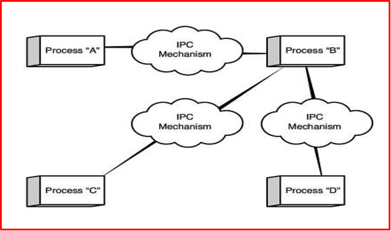
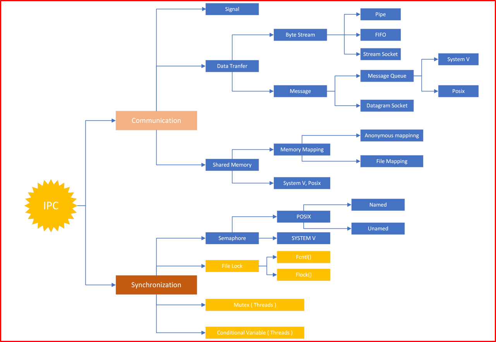
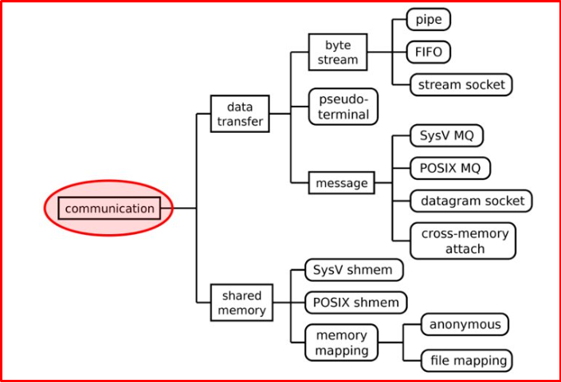
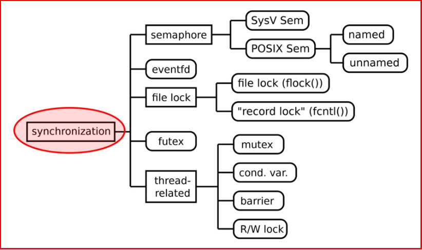
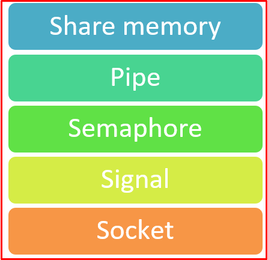
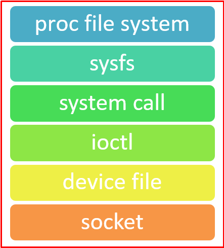

# 💚 Inter Process Communication 💛

## 👉 Introduction and Summary

### 1️⃣ Introduction

+ Ở bài trước chúng ta đã biết về Thread và cách hoạt động của nó trong linux. Nếu các bạn chưa đọc thì xem link này nha [006_Thread_And_Mutex.md](../006_Thread_And_Mutex/006_Thread_And_Mutex.md). Ở bài này chúng ta sẽ tìm hiểu về IPC Inter Process Communication trong linux.

### 2️⃣ Summary

Nội dung của bài viết gồm có những phần sau nhé 📢📢📢:
- [I. Introduction and Summary](#👉-introduction-and-summary)

    - [1. Introduction](#1️⃣-introduction)
    - [2. Summary](#2️⃣-summary)
- [II. Contents](#👉-contents)
    - [1. Overview IPC​](#1️⃣-overview-ipc)
- [III. Conclusion](#✔️-conclusion)
- [IV. Exercise](#💯-exercise)
- [V. NOTE](#📺-note)
- [VI. Reference](#📌-reference)

## 👉 Contents
### 1️⃣ Overview IPC
+ IPC (InterProcess Communication) là các phương thức được sử dụng để giao tiếp giữa các process với nhau
+ Giao tiếp ở đây được nói đến trên 2 khía cạnh là: chia sẻ/truyền dữ liệu và đồng bộ truy cập

     

+ Trong khoa học máy tính, giao tiếp giữa các tiến trình hoặc giao tiếp giữa các tiến trình (IPC) đề cập cụ thể đến các cơ chế mà hệ điều hành cung cấp để cho phép các tiến trình quản lý dữ liệu được chia sẻ.

+ Thông thường, các ứng dụng có thể sử dụng IPC, được phân loại thành client và server , trong đó client yêu cầu dữ liệu và server  phản hồi các yêu cầu của client. Nhiều applications  vừa là client vừa là server, như thường thấy trong distributed computing. Các phương pháp thực hiện IPC được chia thành các loại khác nhau dựa trên các yêu cầu về phần mềm, chẳng hạn như các yêu cầu về hiệu suất và tính mô-đun, và các tình huống của hệ thống, chẳng hạn như băng thông mạng và độ trễ.

+ Dưới đây là hình ảnh tổng quan về IPC. IPC sẽ được chia thành 2 nhánh là Commnication và Synchronization. 

     

+ Communication IPC​.

     

+ Synchronization IPC​.

     

+ Trong đó, chỉ 1 vài cơ chế IPC là có thể được sử dụng để communicate gữa user space và kernal space như ảnh dưới.

     

     

***proc file system***
+ Proc file system (procfs) là một hệ thống tệp ảo trong Linux, cung cấp giao diện để truy cập thông tin về các tiến trình và nhân hệ điều hành. Nó không lưu trữ dữ liệu trên đĩa mà được tạo động trong bộ nhớ khi hệ thống khởi động.
+ Đường dẫn: /proc
+ Ta có thể cat, echo giống như 1 file

***Sysfs***
+ Tất cả file được lưu trữ trong thư mục /sys
+ Automatic clean-up of directories and files, when the device is removed from the system

***system call***
+ Mấy cái open, read write...

***ioctl***
+ Linh hoạt, có thể xử lý với cấu trúc dữ liệu phức tạp
+ Need to parse the data stream
+ Không thể cat/echo như một file

***device file***
+ Can communicate with OS in user-space
+ Can implement some function for file – open, close
+ Take a lot effort to implement

***Review về cách sử dụng IPC***
+ Thread thì thường dùng mutex, 2 process thì semaphore
+ Mutex thằng nào giữ khóa thì thằng đó phải giải phóng khóa
+ Semaphore thì A giữ khóa B vẫn có thể giải phóng được
+ Khi truyền dữ liệu thì nếu là message hay pipe thì khi lấy xong nó sẽ bị mất đi, còn nếu là shared memory thì nó vẫn còn đó
+ Shared memory thường kết hợp với semaphore, vì shared mà đọc ghi nhiều quá thì cũng quá tải nên để giảm bớt thì dùng semaphore kết hợp với shared
+ Data transfer thì thường đóng gói thành dữ liệu để truyền đi như queue, còn pipe thì cứ truyền dữ liệu vào pipe và mình thích lấy bao nhiêu cũng được
+ Pipe thì là file virtual và khi mất điện thì bị mất đi
+ FIFO thì là file thực nên không mất
+ Mấy thằng unnamed như pipe semaphore unnamed thì thường dùng cho các process có quan hệ cha con, file ảo
+ Named thì dùng cho process chả liên quan với nhau, là file đó
+ Stream socket thì dùng truyền trên 1 máy hoặc 2 máy khác nhau, nếu dùng socket truyền trong 1 máy thì ưu tiên UNIX vì dùng internet socket tốn tài nguyên và tốn nhiều time thiết lập hơn
+ Chỗ shared memory thì systemV là Anonymous mapping (như file ảo đó) , còn POSIX sử dụng phương pháp  file mapping. Ta thường sử dụng file mapping
+ Tùy bài toán mà chọn phương thức tối ưu nhất cho bài toán của mình như chat message thì dùng sockets

## ✔️ Conclusion
Ở bài này chúng ta đã có overview về Inter Process Communication. Tiếp theo chúng ta cùng đi vào từng phần trong IPC nhé.

## 💯 Exercise

## 📺 NOTE

+ Xem video sau để trực quan hơn nhé : [Video Youtube](https://www.youtube.com/watch?v=tFypNyKYRMg)

## 📌 Reference

[1] Professional Linux Kernel Development 3rd.pdf