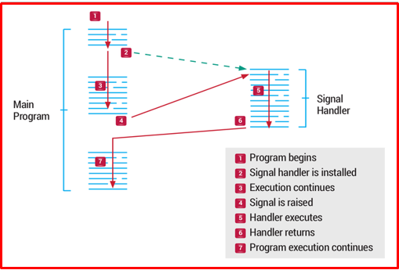
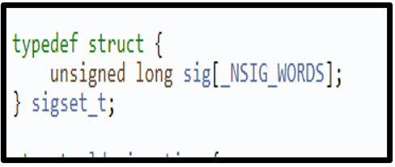
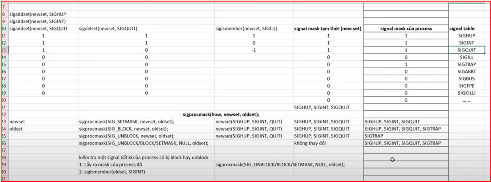

# 💚 IPC Signal 💛

## 👉 Introduction and Summary

### 1️⃣ Introduction

+ Ở bài trước chúng ta đã biết sơ lược về IPC trong linux. Nếu các bạn chưa đọc thì xem link này nha [007_Inter_Process_Communication.md](../007_Inter_Process_Communication/007_Inter_Process_Communication.md). Ở bài này chúng ta sẽ tìm hiểu về IPC Signal trong linux.

### 2️⃣ Summary

Nội dung của bài viết gồm có những phần sau nhé 📢📢📢:
- [I. Introduction and Summary](#👉-introduction-and-summary)

    - [1. Introduction](#1️⃣-introduction)
    - [2. Summary](#2️⃣-summary)
- [II. Contents](#👉-contents)
    - [1. Giới thiệu​](#1️⃣-giới-thiệu)
    - [2. Signal Lifecycle](#2️⃣-signal-lifecycle)
    - [3. Một số signals cơ bản](#3️⃣-một-số-signals-cơ-bản)
    - [4. Signal Handler](#4️⃣-signal-handler)
    - [5. Gửi tín hiệu đến tiến trình](#5️⃣-gửi-tín-hiệu-đến-tiến-trình)
    - [6. Blocking và unblocking signals](#6️⃣-blocking-va-unblocking-signals)
- [III. Conclusion](#✔️-conclusion)
- [IV. Exercise](#💯-exercise)
- [V. NOTE](#📺-note)
- [VI. Reference](#📌-reference)

## 👉 Contents
### 1️⃣ Giới thiệu
+ Tín hiệu là một trong những phương thức truyền thông liên tiến trình lâu đời nhất được sử dụng bởi các hệ thống Unix/Linux. Chúng được sử dụng để báo hiệu các sự kiện không đồng bộ cho một hoặc nhiều tiến trình. Mỗi tín hiệu có thể kết hợp hoặc có sẵn bộ xử lý tín hiệu (signal handler). Tín hiệu sẽ ngắt ngang quá trình xử lý của tiến trình, bắt hệ thống chuyển sang gọi bộ xử lý tín hiệu ngay tức khắc. Khi kết thúc xử lý tín hiệu, tiến trình lại tiếp tục thực thi.

+ Signal là một software interrupt, là cơ chế xử lý các sự kiện bất đồng bộ (async).

+ Mỗi tín hiệu được định nghĩa bằng một số nguyên trong /urs/include/signal.h. Danh sách các hằng tín hiệu của hệ thống có thể xem bằng lệnh: kill –l

```bash
 1) SIGHUP	 2) SIGINT	 3) SIGQUIT	 4) SIGILL	 5) SIGTRAP
 6) SIGABRT	 7) SIGBUS	 8) SIGFPE	 9) SIGKILL	10) SIGUSR1
11) SIGSEGV	12) SIGUSR2	13) SIGPIPE	14) SIGALRM	15) SIGTERM
16) SIGSTKFLT	17) SIGCHLD	18) SIGCONT	19) SIGSTOP	20) SIGTSTP
21) SIGTTIN	22) SIGTTOU	23) SIGURG	24) SIGXCPU	25) SIGXFSZ
26) SIGVTALRM	27) SIGPROF	28) SIGWINCH	29) SIGIO	30) SIGPWR
31) SIGSYS	34) SIGRTMIN	35) SIGRTMIN+1	36) SIGRTMIN+2	37) SIGRTMIN+3
38) SIGRTMIN+4	39) SIGRTMIN+5	40) SIGRTMIN+6	41) SIGRTMIN+7	42) SIGRTMIN+8
43) SIGRTMIN+9	44) SIGRTMIN+10	45) SIGRTMIN+11	46) SIGRTMIN+12	47) SIGRTMIN+13
48) SIGRTMIN+14	49) SIGRTMIN+15	50) SIGRTMAX-14	51) SIGRTMAX-13	52) SIGRTMAX-12
53) SIGRTMAX-11	54) SIGRTMAX-10	55) SIGRTMAX-9	56) SIGRTMAX-8	57) SIGRTMAX-7
58) SIGRTMAX-6	59) SIGRTMAX-5	60) SIGRTMAX-4	61) SIGRTMAX-3	62) SIGRTMAX-2
63) SIGRTMAX-1	64) SIGRTMAX	
```

+ Ngoài ra, khi thực hiện lệnh man 7 signal, ta có thể xem chức năng cũng như hướng dẫn sử dụng của từng loại tín hiệu.

+ Ví dụ:
  + Những sự kiện này có thể bắt nguồn từ bên ngoài như khi người dùng nhấn tổ hợp phím Ctrl+C
  + Hoặc từ các hoạt động trong chương trình như phép chia một số cho 0.

***Ví dụ***
+ Ta có 1 chương trình đang chạy vô hạn, khi ta dùng lệnh kill để nó dừng lại thì thực chất là ta đang gửi 1 tín hiệu kết thúc tới chương trình(process) đó:

**Bước 1:** Ta có chương trình 
```bash
#include <stdio.h>
int main()
{
  while(1);
  return 0;
}
```
**Bước 2:** Chạy chương trình "out" đó và mở 1 terminal mới
**Bước 3:** ps aux | grep out: để biết pid của process đang chạy vô hạn đó
**Bước 4:** Dùng lệnh "kill –l" để xem các signal
**Bước 5:** kill -19 pid, -19 là signal stop, pid là id của process mình muốn dừng.

### 2️⃣ Signal Lifecycle

<p align="center">
     
</p>

***Giải thích***
+ Generation: Đầu tiên một tín hiệu signal được raised/sent/generated

+ Delivery: Một signal được pending cho tới khi nó được phân phối

+ Processing: Một khi tín hiệu được phân phối, nó có thể được xử lý bởi nhiều cách

  + Ignore the signal

    + Không action nào được thực hiện. Khi kernel ném ra 1 cái signal thì ta có thể bắt nó và sử lý hoặc ta bỏ qua, khi mà ta bỏ qua thì từ nay về sau ta sẽ không nhận cái signal này nữa. Mình ignore không có nghĩa là mình xóa đi mà nó sẽ được giữ lại trong một hàng đợi, khi nào mà ta lại cho phép nhận tín hiệu đó thì kernal lại ném tín hiệu đó ra

    + SIGKILL và SIGSTOP không thể bị ignore. Một process bắt buộc phải có SIGKILL và SIGSTOP

  + Catch(bắt được) and handle the signal

    + Kernel sẽ tạm dừng thực thi main thread và nhảy tới hàm xử lý signal được user đăng kí trong process (signal handler). Ví dụ như mình bấm ctrl C là thoát process tuy nhiên bây giờ mình  chỉ lấy sự kiện ctrl C thôi sau đó mình printf hello ra chứ không thoát nữa nghĩa là ta viết lại hàm xử lý cho signal đó

    + SIGINT và SIGTERM là hai signal thường được dùng

    + SIGKILL và SIGSTOP không thể catch

  + Perform the default action
    + Hành động này phụ thuộc từng loại signal

### 3️⃣ Một số signals cơ bản

+ SIGKILL: Chỉ có thể gửi bằng system call kill(). Process không thể caught hoặc ignored. Mặc định sẽ kết thúc tiến trình được chỉ định. Ngắt ngay tiến trình (interrupt). Nó là Ctrl C

+ SIGTERM: Chỉ có thể gửi bằng system call kill(). Mặc định sẽ kết thúc tiến trình được chỉ định, tuy nhiên process có thể catch tín hiệu này và dọn dẹp trước khi kết thúc

+ SIGINT: Tín hiệu này được gửi tới các process trong nhóm foreground process. Mặc định sẽ kết thúc tiến trình hiện tại

+ SIGCHLD: Bất cứ khi nào một tiến trình dừng lại, nó sẽ gửi SIGCHLD tới process cha của nó. Mặc định SIGCHLD bị ignored. Bắt được trạng thái kết thúc của tiến trình con

+ SIGSTOP: Chỉ có thể gửi bằng system call kill(). Process không thể caught hoặc ignored. Mặc định sẽ tạm dừng process được chỉ định

+ SIGUSR1/SIGUSR2: Signals có sẵn cho người dùng tự định nghĩa

+ Ctrl+Z: gửi tín hiệu TSTP( SIGTSTP ) đến tiến trình, dừng tiến trình (suspend).

+ Ctrl+/: gửi tín hiệu ABRT( SIGABRT ) đến tiến trình, kết thúc ngay tiến trình (abort).

+ Từ dòng lệnh:
  + Lệnh kill thường được sử dụng để ngừng thi hành một tiến trình. Lệnh kill có thể gởi bất kỳ tín hiệu signal nào tới một tiến trình, nhưng theo mặc định nó gởi tín hiệu 15, TERM (là tín hiệu kết thúc chương trình).
  + > kill -<signal> <PID>
  + Ví dụ: kill -INT 2309 hoặc kill -2 2309 dùng gửi tín hiệu INT ngắt tiến trình có PID 2309.
  + Nếu không chỉ định tên tín hiệu, tín hiệu TERM được gửi để kết thúc tiến trình.
  + Lệnh fg: gửi tín hiệu CONT đến tiến trình, dùng đánh thức các tiến trình tạm dừng do tín hiệu TSTP trước đó.

### 4️⃣ Signal Handler

+ Chúng ta đăng kí việc xử lý một signal thông qua system call signal().

+ Signal là một software interrupt nên nó khá nhạy cảm về mặt thời gian thực thi. Khi signal handler được thực thi nó sẽ chiếm hoàn toàn cpu của process.

+ Cần phải thoát ra hàm xử lý signal nhanh nhất có thể

+ sighandler_t signal (int signo, sighandler_t handler);
  + Chúng ta đăng kí việc xử lý một signal 
  + Các đối số:
    + signo: signal number(là cái số kill –l)
    + handler: signal handler

+ Ví dụ code: Code cứ 2s thì in ra hello và khi nào ta bấm ctrl C thì nhảy vào sig_handler1 để thực hiện cái số num chính là giá trị của SIGINT là số 2

```bash
#include <unistd.h>
#include <stdlib.h>
#include <stdio.h>
#include <signal.h>
void sig_handler1(int num)
{
  printf("\nIm signal handler1: %d\n", num);
}
int main()
{
  if (signal(SIGINT, sig_handler1) == SIG_ERR) 
  {
    fprintf(stderr, "Cannot handle SIGINT\n");
    exit(EXIT_FAILURE);
  }

  printf("process ID: %d\n", getpid());
  while (1)
  {
    printf("hello hulatho\n");
    sleep(2);
  }
}
```

+ Ví dụ code: Mặc dù ta đã đăng kí thêm 1 signal nữa nhưng vì là SIGKILL nên nó k thể có tín hiệu được, ta có "kill -9 num" thì cũng vậy
```bash
#include <unistd.h>
#include <stdlib.h>
#include <stdio.h>
#include <signal.h>
void sig_handler1(int num)
{
    printf("\nIm signal handler1: %d\n", num);
}
void sig_handler2(int num)
{
    printf("Im signal handler2: %d\n", num);
}
int main()
{
    if (signal(SIGINT, sig_handler1) == SIG_ERR) {
        fprintf(stderr, "Cannot handle SIGINT\n");
        exit(EXIT_FAILURE);
    }
    signal(SIGKILL, sig_handler2);

    printf("process ID: %d\n", getpid());
    while (1)
    {
        printf("hello hula\n");
        sleep(2);
    }
}
```

### 5️⃣ Gửi tín hiệu đến tiến trình
+ Signal có thể gửi được qua hàm system call kill() trong source code.
+ Ngoài ra có thể gửi thông qua command kill trên terminal
+ Có thể tự gửi signal đến bản thân tiến trình đó thông qua việc sử dụng hàm getpid()
+ int kill (pid_t pid, int signo); 
  + Gửi signal tới một process có pid cụ thể
  + Các đối số:
    + pid: PID của process
    + Signo: signal number
    + Trả về 0 nếu thành công, nhỏ hơn 0 nếu thất bại

+ Code sau 5s thì gửi kill tới tiến trình của chúng ta và nó sẽ kết thúc
```bash
#include <unistd.h>
#include <stdlib.h>
#include <stdio.h>
#include <signal.h>
void sig_handler1(int num)
{
    printf("\nIm signal handler1: %d\n", num);
    exit(EXIT_SUCCESS);
}
void sig_handler2(int num)
{
    printf("Im signal handler2: %d\n", num);
}
void sig_handler3(int num)
{
    printf("Im signal handler3: %d\n", num);
    exit(EXIT_SUCCESS);
}
int main()
{
    if (signal(SIGINT, sig_handler1) == SIG_ERR) {
        fprintf(stderr, "Cannot handle SIGINT\n");
        exit(EXIT_FAILURE);
    }
    signal(SIGKILL, sig_handler2);
    signal(SIGTERM, sig_handler3);
    sleep(5);
    kill(getpid(), SIGINT);
    printf("process ID: %d\n", getpid());
    while (1)
    {
        printf("hello thonv12\n");
        sleep(2);
    }
}
```

+ Khi ta dùng SIGKILL thì có vấn đề này xảy ra, ví dụ ta đang có 1 vùng nhớ là share memory mà ta lại SIGKILL thì nó sẽ thoát ngay lập tức và chưa kịp giải phóng vùng nhớ đó. Nên ta hay dùng SIGINT và SIGTERM hơn
+ Ta sẽ tạo ra 1 cái signal là SIGINT hoặc SIGTERM và handle tới 1 hàm, vào hàm đó ta có thể giải phóng vùng nhớ đi

### 6️⃣ Blocking và unblocking signals
+ Ví dụ chương trình mình đang chạy tự nhiên ai đó gửi cái signal terminate, chương trình lăn đùng ra chết, TOANG, nên ta sẽ block luôn cái signal này để chương trình không nhận signal này nữa
  + Signal làm gián đoạn quá trình thực thi của process. Điều này trong nhiều trường hợp không được mong muốn xảy ra khi process đang thực thi một số đoạn mã quan trọng. Blocking signal sẽ giúp giải quyết vấn đề này
  + Mỗi một process có thể chỉ định signal cụ thể nào mà nó muốn block. Nếu signal bị block vẫn xảy ra thì nó sẽ được kernel giữ vào hàng chờ xử lý (pending)
  + Tín hiệu chỉ được gửi tới process sau khi nó được unblocking
  + Danh sách các signal bị block được gọi là signal mask
  + sigset_t đại diện cho signal mask (mảng)
  + signal mask: là cái signal mask của process, còn cái newset là cái signalmask mới, chuẩn bị để có thể ghi đè lên cái signal mask cũ
  + 1 là block, 0 là unblock

***Signal sets***
+ int sigemptyset (sigset_t *set): Toàn bộ các signal mask đều bằng 0 hết
+ int sigfillset (sigset_t *set): Toàn bộ các signal mask đều bằng 1 hết
+ int sigaddset (sigset_t *set, int signo): sigaddset(newest, SIGINT): thì nó sẽ được set lên bằng 1
+ int sigdelset (sigset_t *set, int signo): sigdelset (newest, SIGINT): thì nó sẽ được set về bằng 0
+ int sigismember (const sigset_t *set, int signal): Kiểm tra xem cái signal truyền vào đã có signal mask chưa, có rồi thì trả về 1, chưa có thì về 0, lỗi thì trả về -1, 1 là bị block, 0 là không block
<p align="center">
     
</p>

***Blocking Signals***
+ int sigprocmask (int how, const sigset_t *newset, sigset_t *oldset)
  + how
    + SIG_SETMASK: signal mask của process sẽ bị thay đổi thành newset
      + Khi ta dùng này thì newset sẽ được ghi đè lên TOÀN BỘ signal mask hiện tại của process
    + SIG_BLOCK: newset sẽ được thêm vào signal mask (phép OR).
    + SIG_UNBLOCK: newset sẽ bị xóa khỏi signal mask
  + Nếu oldset khác NULL, sigprocmask sẽ lấy ra được signal mask hiện tại và lưu vào oldset
  + Nếu newset là NULL, sigprocmask sẽ bỏ qua việc thay đổi giá trị của signal mask, nhưng nó sẽ lấy ra được signal mask hiện tại và lưu vào oldset. Nói cách khác, truyền null vào set như một cách lấy ra signal mask hiện tại

+ Làm sao ta lấy được signal mask hiện tại của process của mình?
  + int sigprocmask (int how, const sigset_t NULL, sigset_t *oldset)   signal mask là oldset
+ Kiểm tra 1 signal cụ thể nằm trong cái mask đấy nó có đang bị block hay không? (ví dụ là SIGINT)
  + Sigismember(oldset, SIGINT)

<p align="center">
     
</p>

+ Code: Ta muốn block cái SIGINT( nghĩa là ctrl C mà không thể nào mà thoát được)
```bash
#include <signal.h>
#include <stdio.h>
#include <stdlib.h>
#include <time.h>
#include <unistd.h>
void sig_handler1(int signum) {
    printf("Im signal handler1\n");
    exit(EXIT_SUCCESS);
}
int main() {
    sigset_t new_set, old_set;
    if (signal(SIGINT, sig_handler1) == SIG_ERR) 
    {
        fprintf(stderr, "Cannot handle SIGINT\n");
        exit(EXIT_FAILURE);
    }
    sigemptyset(&new_set);
    sigemptyset(&old_set);

    printf("new_set is %x\n", new_set);
    printf("old_set is %x\n", old_set);

    sigaddset(&new_set, SIGINT);
    //sigaddset(&new_set, SIGCHLD);

    if (sigprocmask(SIG_SETMASK, &new_set, &old_set) == 0) 
    {
        sigprocmask(SIG_SETMASK, NULL, &old_set);
        if (sigismember(&new_set, SIGINT) == 1 ) {
            printf("SIGINT exist\n");
        } else if (sigismember(&new_set, SIGINT) == 0) {
            printf("SIGINT does not exist\n");
        }
    }

    printf("new_set is %x\n", new_set);
    printf("old_set is %x\n", old_set);

    while (1);
    return 0;
}
```

Tổng lại:
  + Trong phần lớn ứng dụng mà mình viết về signal thì thường viết để sleep để giải phóng các tài nguyên mà khi mình gửi lệnh kill hay terminate thì phải chờ 1 thời gian cho tiến trình giải phóng hết đi nếu không thì tài nguyên bị giữ lai khiến cho ram bị thiếu
  + Biết các signal hay dùng, như siguser1 siguser2 sigchild, sigchild để tránh zombie
  + Block and Unblock

## ✔️ Conclusion
Ở bài này chúng ta đã biết về signal. Tiếp theo chúng ta cùng đi tìm hiểu về Pipe nhé.

## 💯 Exercise
+ Bài 1: Viết chương trình block tín hiệu SIGINT và sau đó in ra signal mask của process hiện tại

+ Bài 2: Viết chương trình in ra thông điệp bất kì khi nhấn tổ hợp phím Ctrl+C . Đăng kí action cho SIGUSR1 và SIGUSR2.

## 📺 NOTE

+ Xem video sau để trực quan hơn nhé : [Video Youtube](https://www.youtube.com/watch?v=tFypNyKYRMg)

## 📌 Reference

[1] Professional Linux Kernel Development 3rd.pdf

[2] https://viblo.asia/p/giao-tiep-giua-cac-tien-trinh-trong-linux-phan-1-su-dung-signal-va-pipe-Qpmlejxr5rd

[3] https://blog.vinahost.vn/mot-so-signals-thuong-dung-trong-linux/