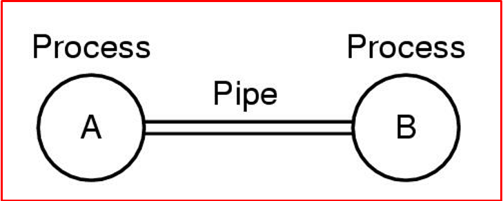
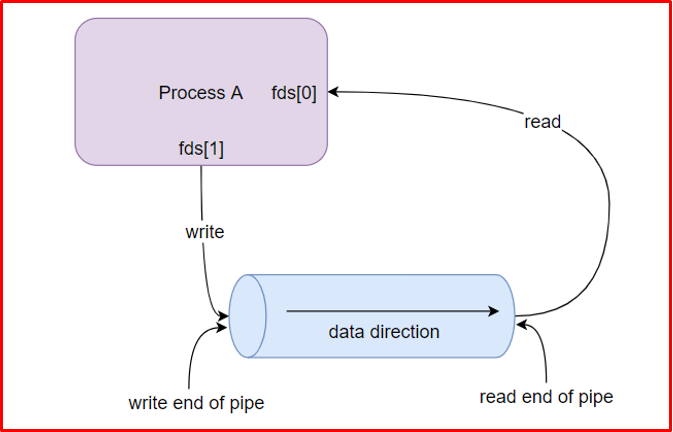
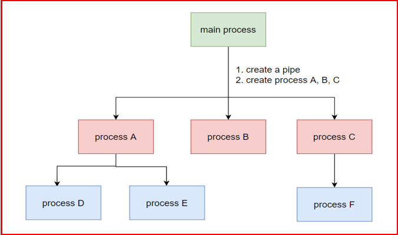
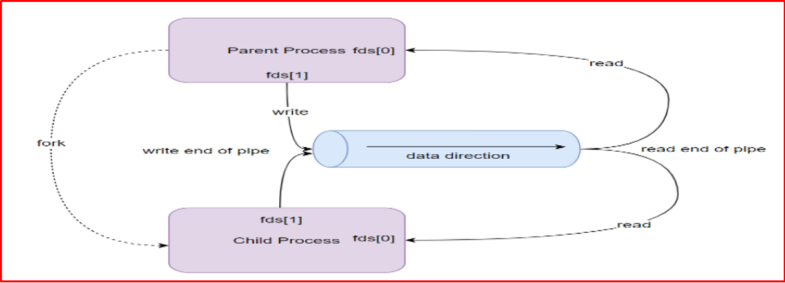
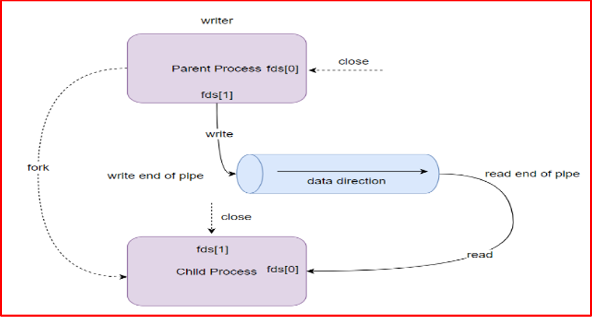
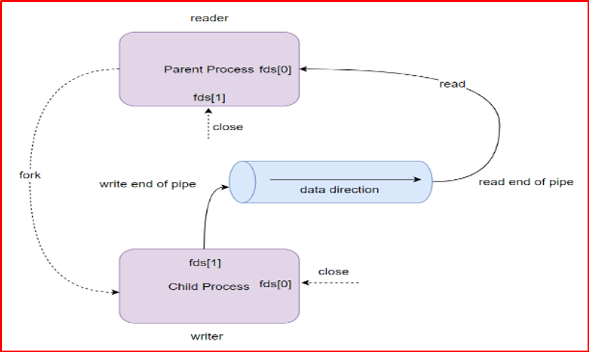

# 💚 IPC Pipe Fifo 💛

## 👉 Introduction and Summary

### 1️⃣ Introduction

+ Ở bài trước chúng ta đã biết về 008_IPC_Signal và cách hoạt động của nó trong linux. Nếu các bạn chưa đọc thì xem link này nha [008_IPC_Signal.md](../008_IPC_Signal/008_IPC_Signal.md). Ở bài này chúng ta sẽ tìm hiểu về IPC Pipe-Fifo trong linux.

### 2️⃣ Summary

Nội dung của bài viết gồm có những phần sau nhé 📢📢📢:
- [I. Introduction and Summary](#👉-introduction-and-summary)

    - [1. Introduction](#1️⃣-introduction)
    - [2. Summary](#2️⃣-summary)
- [II. Contents](#👉-contents)
    - [1. Giới thiệu​](#1️⃣-giới-thiệu)
    - [2. Hoạt động](#2️⃣-hoạt-động)
    - [3. Tạo PiPe](#3️⃣-tạo-pipe)
    - [4. Giao tiếp hai chiều](#4️⃣-giao-tiếp-hai-chiều)
    - [5. FIFO - Named Pipe](#5️⃣-fifo---named-pipe)
    - [6. Blocking và unblocking signals](#6️⃣-blocking-va-unblocking-signals)
- [III. Conclusion](#✔️-conclusion)
- [IV. Exercise](#💯-exercise)
- [V. NOTE](#📺-note)
- [VI. Reference](#📌-reference)

## 👉 Contents
### 1️⃣ Giới thiệu

<p align="center">
     
</p>

<p align="center">
     
</p>

+ Pipes là một trong số các phương thức IPC được sử dụng trong việc truyền thông liên tiến trình
+ Dữ liệu xuất của tiến trình này được chuyển đến làm dữ liệu đầu vào cho tiến trình kia dưới dạng một dòng các byte.
+ Trên đường ống dữ liệu chỉ có thể chuyển đi theo một chiều, dữ liệu vào đường ống tương đương với thao tác ghi (pipe write), lấy dữ liệu từ đường ống tương đương với thao tác đọc (pipe read), một tiến trình kết nối với một pipe chỉ có thể thực hiện một trong hai thao tác đọc hoặc ghi, nhưng không thể thực hiện cả hai.
+ Dữ liệu được chuyển theo luồng (stream) theo cơ chế FIFO. Một pipe có kích thước giới hạn (thường là 4096 ký tự).

### 2️⃣ Hoạt động

+ Khi tạo một pipe, nó sẽ nằm trong RAM và được coi là một "virtual file" 

+ Tốc độ đọc ghi với RAM nhanh hơn nhiều so với ổ cứng nên đây là lý do Pipes có thể  sử dụng trong quá trình tạo process

+ Khi một process ghi vào "virtual file" (hoặc có thể hiểu là pipe) thì một tiến trình liên quan (related-process) khác có thể đọc dữ liệu từ nó. Thằng file con được kế thừa file từ file cha

<p align="center">
     
</p>

***Reading from a pipe***
+ Nếu cố gắng đọc dữ liệu từ một pipe "rỗng", thì đầu read sẽ block cho đến khi đọc được ít nhất 1 bytes
+ Nếu đầu write của một đường ống bị đóng, đầu read đọc lại toàn bộ dữ liệu còn lại trong pipe và return 0

***Pipes have a limited capacity***
+ Một pipe chỉ đơn giản là một bộ đệm được duy trì trong bộ nhớ
+ Bộ đệm này có dung lượng tối đa. Khi một pipe đã đầy, chỉ khi khi đầu read lấy một số dữ liệu khỏi pipe thì đầu write mới có thể ghi tiếp dữ liệu vào pipe

### 3️⃣ Tạo PiPe 
+ Nếu ta tạo pipe trước khi gọi fork(). Thì parent and child (related-process) có thể giao tiếp thông qua pipe
+ int pipe(int fds[2])
    + Tạo một pipe mới. Trả về hai file descriptor (fd) nằm trong fds
    + Các đối số
        + fds[0]	 file descriptor chiều read của pipe
        + fds[1]	 file descriptor chiều write của pipe
        + Trả về 0 nếu thành công, -1 nếu thất bại
    + Pipe giao tiếp coi như 1 file thôi

+ Code tạo pipe và đọc ghi với pipe
```bash
#include <unistd.h>   
#include <fcntl.h>
#include <stdio.h>
 
char *message = "This is a message!!!" ;
 
int main()
{
	char buf[1024] ;
	int fd[2];
	pipe(fd);    /*create pipe*/
	if (fork() != 0) { /* I am the parent */
		write(fd[1], message, strlen (message) + 1) ;
	} else { /*Child code */
		read(fd[0], buf, 1024) ;
		printf("Got this from MaMa!!: %s\n", buf) ;
	}
}
```

+ Code tạo pipe và đọc ghi với pipe
```bash
#include <stdlib.h>
#include <stdio.h>
#include <unistd.h>
#include <signal.h>

#define MSG_SIZE    20
char *msg1 = "hello thonv01";
char *msg2 = "hello thonv02";
char *msg3 = "hello thonv03";
char *msg4 = "hello thonv04";

char pipe_buff[MSG_SIZE];
int fds[2], i;

int main(int argc, char const *argv[])
{
    if (pipe(fds) < 0) {
        printf("pipe() unsuccessfully\n");
        exit(1);
    }

    write(fds[1], msg1, MSG_SIZE);
    write(fds[1], msg2, MSG_SIZE);
    write(fds[1], msg3, MSG_SIZE);
    printf("sleep 2 seconds\n");
    sleep(2);

    for (i = 0; i < 3; i++) {
       read(fds[0], pipe_buff, MSG_SIZE);
       printf("msg[%d]: %s\n", i+1, pipe_buff);
    }
    return 0;
}
```

+ Read từ pipe thì bị block do pipe đang rỗng, Ctrl C để ghi vào pipe thì mới đọc được và thoát
```bash
#include <stdlib.h>
#include <stdio.h>
#include <unistd.h>
#include <signal.h>

#define MSG_SIZE    20
char *msg4 = "hello thonv04";
char pipe_buff[MSG_SIZE];
int fds[2], i;

void sig_handler1(int num)
{
    printf("Im signal handler1: %d\n", num);
    write(fds[1], msg4, MSG_SIZE);
}
int main(int argc, char const *argv[])
{
    if (signal(SIGINT, sig_handler1) == SIG_ERR) {
         fprintf(stderr, "Cannot handle SIGINT\n");
         exit(EXIT_FAILURE);
    }
    if (pipe(fds) < 0) {
        printf("pipe() unsuccessfully\n");
        exit(1);
    }
    read(fds[0], pipe_buff, MSG_SIZE);
    printf("msg[%d]: %s\n", 1, pipe_buff);
    return 0;
}
```

+ Code ở thằng con sau khi đọc hết data thì break và kết thúc thằng con, khi này thằng cha đăng kí SIGCHILD nên khi này nó nhảy vào hàm func và giải phóng thằng con đi
```bash
#include <stdio.h>
#include <stdlib.h>
#include <unistd.h>
#include <signal.h>
#include <sys/types.h>
#include <sys/wait.h>

#define MSG_SIZE    16
char *msg1 = "hello, world 1";
char *msg2 = "hello, world 2";
char *msg3 = "hello, world 3";

static void func(int signum)
{
    wait(NULL); 
    printf("child process termination\n");
}

int main(int argc, char const *argv[])
{
    /* code */
    char in_buff[MSG_SIZE];
    int num_read = 0;
    int fds[2];
    pid_t child_pid;

    if (pipe(fds) < 0) {
        printf("pipe() unsuccessfully\n");
        exit(1);
    }
    child_pid = fork();
    if (child_pid >= 0) {
        if (child_pid == 0) {
            printf("I am Child\n"); // reader
            // if (close(fds[1]) == -1) 
            //    printf("close(fds[1]) failed\n");
            while (1 ) {
                num_read = read(fds[0], in_buff, MSG_SIZE);
                if (num_read == -1) {
                    printf("read() failed\n");
                    exit(0);
                } else if (num_read == 0) {
                    printf("pipe end-of-pipe\n");
                    break;
                } else {
                    printf("msg: %s %d\n", in_buff, num_read);
                }
            };
        } else { 
            // Prevent zombie process
            signal(SIGCHLD, func);
            printf("I am Parent\n"); // writer
            // Write into pipe
            write(fds[1], msg1, MSG_SIZE);
            write(fds[1], msg2, MSG_SIZE);
            write(fds[1], msg3, MSG_SIZE);
            if (close(fds[1]) == -1) // write will see end-of-pipe
                printf("close(fds[0]) failed\n");
            while(1);
        }
    } else {
        printf("fork() unsuccessfully\n");
    }
    return 0;
}
```

### 4️⃣ Giao tiếp hai chiều
+ Pipe chỉ truyền theo một chiều NÊN: tạo 2 pile để gửi 2 chiều
+ Chỉ cần tạo hai pipes để gửi dữ liệu theo từng hướng giữa hai quá trình
+ Nếu sử dụng kỹ thuật này, thì chúng ta cần cảnh giác với các trường hợp deadlock có thể xảy ra nếu cả hai quy trình bị block trong khi cố gắng đọc từ các pipe rỗng hoặc trong khi cố gắng ghi vào các pipe đã đầy
+ Reader bị block bởi read
+ Writer bị block bởi write
+ Tài nguyên chỉ giải phóng khi toàn bộ fds của pipe được giải phóng

<p align="center">
     
</p>

+ Để tránh xảy ra trường hợp trên thì ta sẽ làm như sau khi giao tiếp 2 chiều với 2 pipe:
1. Child(process) đóng vai trò reader nên sẽ close đầu write đi, Parent(process) đóng vai trò writer nên sẽ close đầu read đi
<p align="center">
     
</p>

2. Parent đóng vai trò reader nên close write đi, Child đóng vai trò writer nên sẽ close đầu read đi
<p align="center">
     
</p>

+ Sẽ có 2 trường hợp bị block là:
    + 2 đầu của thằng cha đều mở, 2 đầu của con đều đóng, nên đầu write của cha cứ write vào pipe mà thằng con lại không đọc, và cũng không biết là đầy do thằng pipe tưởng đầu read của thằng cha là read của thằng con cơ
    + Trường hợp 2 là ngược lại, 2 đầu con mở còn 2 đầu cha đóng

+ Code ví dụ write đóng cả 2 đầu còn read thì cứ đọc trong while 1
```bash
#include <stdio.h>
#include <stdlib.h>
#include <unistd.h>
#include <signal.h>
#include <sys/types.h>
#include <sys/wait.h>

#define MSG_SIZE    16

char *msg1 = "hello, world #1";
char *msg2 = "hello, world #2";
char *msg3 = "hello, world #3";

static void func(int signum)
{
    wait(NULL); 
    printf("child process termination\n");
}

int main(int argc, char const *argv[])
{
    /* code */
    char in_buff[MSG_SIZE];
    int num_read = 0;
    int fds[2];
    pid_t child_pid;

    if (pipe(fds) < 0) {
        printf("pipe() unsuccessfully\n");
        exit(1);
    }
    child_pid = fork();
    if (child_pid >= 0) {
        if (child_pid == 0) {
            printf("I am Child\n"); // reader
            while (1 ) {
                num_read = read(fds[0], in_buff, MSG_SIZE);
                if (num_read == -1) {
                    printf("read() failed\n");
                    exit(0);
                } else if (num_read == 0) {
                    printf("pipe end-of-pipe\n");
                    break;
                } else {
                    printf("msg: %s\n", in_buff);
                }
            };
        } else { 
            // Prevent zombie process 
            signal(SIGCHLD, func);

            printf("I am Parent\n"); // writer
            if (close(fds[0]) == -1) // read end is unused
                printf("close(fds[0]) failed\n");

            // Write into pipe
            write(fds[1], msg1, MSG_SIZE);
            write(fds[1], msg2, MSG_SIZE);
            write(fds[1], msg3, MSG_SIZE);

            if (close(fds[1]) == -1) // reader will see end-of-pipe
                printf("close(fds[0]) failed\n");
            while(1);
        }
    } else {
        printf("fork() unsuccessfully\n");
    }
    return 0;
}
```

### 5️⃣ FIFO - Named Pipe
***Định nghĩa***
+ Đây là một khái niệm mở rộng của pipes. Pipes truyền thống thì không được đặt tên và chỉ tồn tại trong suốt vòng đời của process
+ Sự khác biệt chính là FIFOs có tên trong hệ thống tệp và được mở giống như một tệp thông thường
+ Pipe chỉ là 1 file virtute và được định danh thông qua fds thôi
+ Named Pipes(FIFO) có thể tồn tại miễn là hệ thống còn hoạt động. Vượt ra ngoài vòng đời của process. Có thể xóa đi nếu không còn sử dụng
+ Một file FIFO là một file đặc biệt được lưu trong bộ nhớ cục bộ. được tạo ra bởi hàm mkfifo() trong C
+ Nó hoạt động giống như 1 pipe thông thường

***Tạo FIFOs từ shell***
+ Lệnh: mkfifo [ -m mode ] pathname
    + mkfifo -m 0666 ./helloFIFO

***Tạo FIFOs từ source code***
+ FIFOs là một loại tệp, chúng ta có thể sử dụng tất cả các lệnh gọi hệ thống được liên kết với nó như open, read, write, close
+ int mkfifo(const char *pathname, mode_t mode);
    + Tạo một FIFO mới với đường dẫn cụ thể. Trả về hai file descriptor (fd) nằm trong fds
    + Các đối số:
        + pathname	tên file FIFO
        + mode		các quyền đối với file FIFO
        + Trả về 0 nếu thành công, -1 nếu thất bại

+ Bài toán producer - consumer : Thằng producer sẽ gửi data và thằng consumer sẽ nhận, bình thường thì consumer sẽ bị block do tính chát của pipe, nếu producer gửi thì nó sẽ nhận

1. File Producer.c
```bash
#include <stdio.h>
#include <string.h>
#include <fcntl.h>
#include <sys/stat.h>
#include <sys/types.h>
#include <unistd.h>

// FIFO file path
#define FIFO_FILE   "./myfifo"
#define BUFF_SIZE   1024

int main(int argc, char const *argv[])
{   
    char buff[BUFF_SIZE];
    int fd;

    mkfifo(FIFO_FILE, 0666);

    while (1) {
        // Write first
        printf("Message to comsumer : "); fflush(stdin);       
        fgets(buff, BUFF_SIZE, stdin);

        fd = open(FIFO_FILE, O_WRONLY);
        write(fd, buff, strlen(buff) +1);
        close(fd);
    }
    return 0;
}
```
2. File Consumer.c
```bash
#include <stdio.h>
#include <string.h>
#include <fcntl.h>
#include <sys/stat.h>
#include <sys/types.h> 
#include <unistd.h>

// FIFO file path
#define FIFO_FILE   "./myfifo"
#define BUFF_SIZE   1024

int main(int argc, char const *argv[])
{   
    char buff[BUFF_SIZE];
    int fd;

    mkfifo(FIFO_FILE, 0666);
    while (1) {
        // Read first
        fd = open(FIFO_FILE, O_RDONLY);
        read(fd, buff, BUFF_SIZE);
        printf("producer message: %s", buff);
        close(fd);
    } 
    return 0;
}
```

## ✔️ Conclusion
Ở bài này chúng ta đã biết về Pipe và Fifo. Tiếp theo chúng ta cùng đi tìm hiểu về Shared Memory nhé.

## 💯 Exercise
+ Bài 1: Viết một chương trình sử dụng hai pipe để cho phép giao tiếp hai chiều giữa hai tiến trình cha và con. Parent process lặp lại việc đọc dữ liệu văn bản từ bàn phím và sử dụng một trong các pipe để gửi văn bản đến child process, child process chuyển nó thành chữ hoa và gửi lại cho parent process qua pipe còn lại. Parent process đọc dữ liệu trả về từ child process và in ra màn hình trước khi lặp lại quá trình một lần nữa.

## 📺 NOTE
+ Các process có mối liên hệ với nhau thì dùng pipe, còn các process không có mối quan hệ thì FIFO
+ Xem video sau để trực quan hơn nhé : [Video Youtube](https://www.youtube.com/watch?v=tFypNyKYRMg)

## 📌 Reference

[1] Professional Linux Kernel Development 3rd.pdf

[2] https://opensource.com/article/19/4/interprocess-communication-linux-channels

[3] https://viblo.asia/p/giao-tiep-giua-cac-tien-trinh-trong-linux-phan-1-su-dung-signal-va-pipe-Qpmlejxr5rd