# 💚 IPC Shared Memory 💛

## 👉 Introduction and Summary

### 1️⃣ Introduction

+ Ở bài trước chúng ta đã biết về 009_IPC_Pipe_Fifo và cách hoạt động của nó trong linux. Nếu các bạn chưa đọc thì xem link này nha [009_IPC_Pipe_Fifo.md](../009_IPC_Pipe_Fifo/009_IPC_Pipe_Fifo.md). Ở bài này chúng ta sẽ tìm hiểu về IPC Shared Memory trong linux.

### 2️⃣ Summary

Nội dung của bài viết gồm có những phần sau nhé 📢📢📢:
- [I. Introduction and Summary](#👉-introduction-and-summary)

    - [1. Introduction](#1️⃣-introduction)
    - [2. Summary](#2️⃣-summary)
- [II. Contents](#👉-contents)
    - [1. Giới thiệu​](#1️⃣-giới-thiệu)
    - [2. Tại sao cần Shared Memory](#2️⃣-tại-sao-cần-shared-memory)
    - [3. System V Shared Memory](#3️⃣-system-v-shared-memory)
    - [4. POSIX share memory](#4️⃣-posix-share-memory)
- [III. Conclusion](#✔️-conclusion)
- [IV. Exercise](#💯-exercise)
- [V. NOTE](#📺-note)
- [VI. Reference](#📌-reference)

## 👉 Contents
### 1️⃣ Giới thiệu
+ Shared memory là vùng nhớ cho phép cho phép nhiều tiến trình có thể cùng truy cập tới
+ Làm tăng tốc độ xử lý khi các tiến trình không cần gửi nhận dữ liệu cho nhau
+ Sau khi được tạo vùng nhớ ảo của chương trình sẽ nằm trong khoảng không gian địa chỉ giữa vùng nhớ  heap và vùng nhớ stack

<p align="center">
  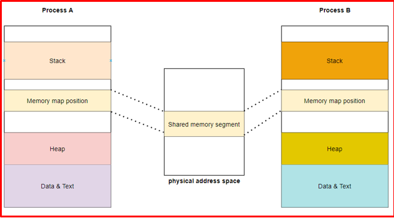   
</p>

<p align="center">
  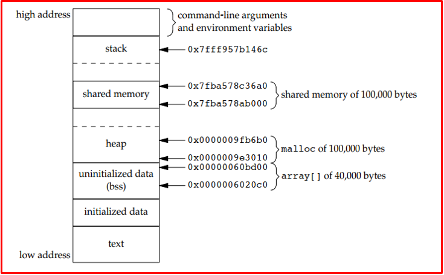   
</p>

<p align="center">
  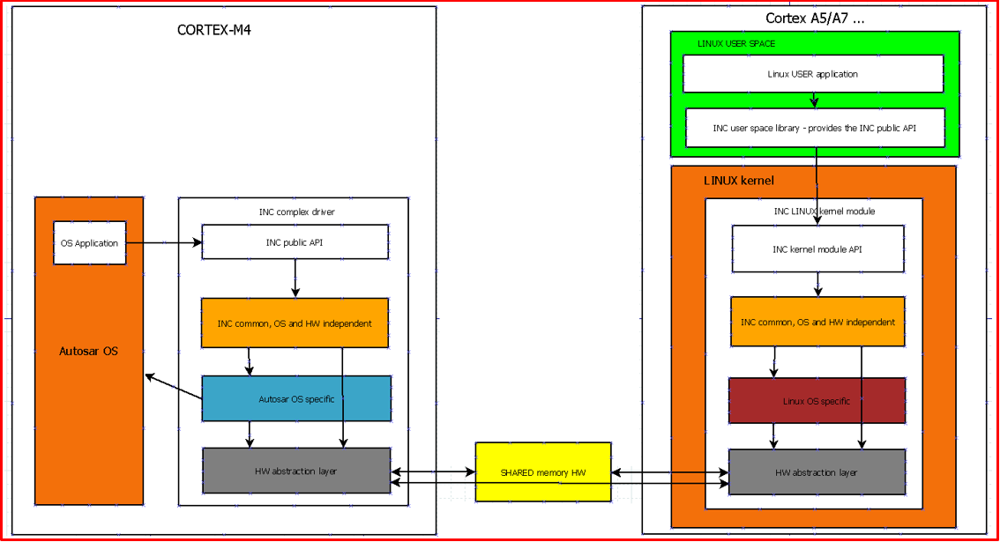   
</p>

### 2️⃣ Tại sao cần Shared Memory
<p align="center">
  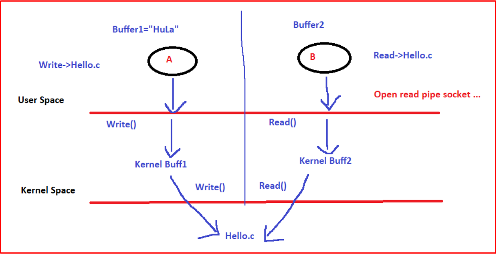   
</p>
+ Khi giao tiếp giữa 2 process, trải qua nhiều công đoạn:
    + ⇨	Tốn time chuyển đổi giữa user space và kernel space
    + ⇨	Cần 4 thao tác đọc ghi
    + ⇨	4 cái buff để lưu dữ liệu
+ Nên dùng Share memory thì truy cập từ user xuống hw luôn, tiết kiệm nhiều thứ. Không cần chuyển đổi giữa  2 space nữa. Tuy nhiên thì tạo và hủy nó cũng rất phức tạp
+ Thằng này thì dùng được nhiều lần vì nó lưu trong file của HW nên nhiều thằng đọc ra vẫn được, còn như PIPE thì 1 thằng đọc là nó mất rồi

+ Thường sử dụng nó trong các trường hợp sau
    + Vì đọc ghi nhanh nên áp dụng vào cấc bài toán truyền dữ liệu lớn
    + 1 process truyền và nhiều process nhận 

+ Có 2 phương pháp để tạo shared memory
    + Sử dụng API của shm (System V)
    + Sử dụng API của mmap (POSIX)

### 3️⃣ System V Shared Memory
+ Anonymous Mapping (mapping vùng nhớ trên RAM như pipe cũng là file virtual vậy)
+ Các bước triển khai:
    + Tạo key
    + Cấp phát shared memory segment
    + Map/umap shared memory segment. Bản chất là ánh xạ tới vùng shared memory segment này thôi, còn nó vẫn tồn tại
    + Giải phóng shared memory segment. Bỏ đi không dùng nữa

***Tạo key***
+ Shared memory segment được kernel quản lý bởi một IPC structure. Mỗi IPC structure sẽ được xác định bởi một sô nguyên (không âm) Identifier
+ Để có thể map/đọc/ghi dữ liệu vào shared memory thì các process cần phải biết được các số Identifier này
+ Indentifier có thể được tạo ra thông qua API ftok()
+ KEY = IPC_PRIVATE:  Running processes as server and client (parent and child relationship)
<p align="center">
  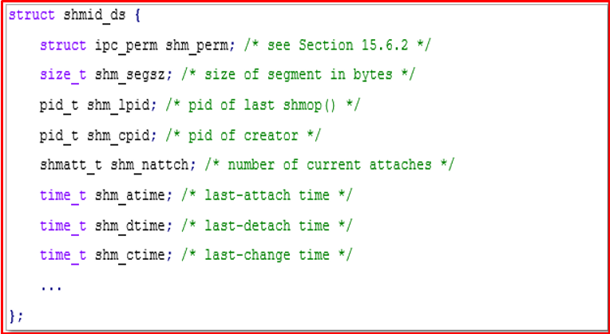   
</p>

***Tạo Shared Memory segment( Tạo vùng nhớ)***
<p align="center">
  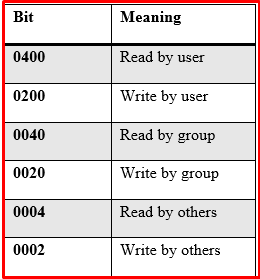   
</p>
<p align="center">
  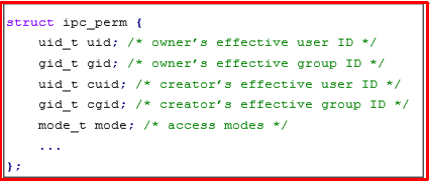   
</p>

+ Mỗi segment được liên kết với một structure về permission cho việc read/write của process
+ Trong đó mode là một tổ hợp bitwise
+ Để tạo shared memory segment sử dụng API shmget().

***Attach/detach vùng shared memory***
+ Attach shared memory segment tới một địa chỉ bộ nhớ của chương trình đang gọi
+ Để làm được điều này chúng ta sử dụng API shmat().
+ Để detach vùng nhớ của process khỏi shared memory segment chúng ta sử dụng API shmdt()
+ Lệnh này không xóa identifier và structure của nó khỏi hệ thống. Identifier sẽ tồn tại đến khi một tiến trình trong hệ thống gọi shmctl với IPC_RMID command

***Giải phóng shared memory segment***
+ API shmctl() được sử dụng để kiểm soát các hoạt động của shared memory segment.
+ Chúng ta thường sử dụng system call này cùng với command IPC_RMID để giải phóng hoàn toàn shared memory segment trên hệ thống

<p align="center">
  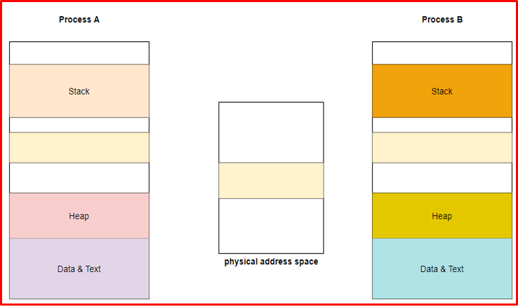   
</p>

+ Chạy code write , rồi read. Do câu lệnh cuối mình hủy vùng nhớ rồi nên chỉ đọc 1 lần được. nếu muốn đọc nhiều thì mở nó ra. shmctl(shmid, IPC_RMID, NULL);
+ Code reader.c
```bash
#include <stdio.h>
#include <sys/ipc.h>
#include <sys/shm.h>


#define SHM_KEY 0x1234

int main()
{
    /**
     *  @brief Shared memory key
     * 
     *  1. Can be an arbitrary value  (SHM_KEY 0x1234)
     *  2. IPC_PRIVATE: Running processes as server and client (parent and child relationship)
     *  3. Key_t ftok(const char *path, int id);
     *  @param[in] path file path
     *  @param[in] id   projectID, only 8 lower bits
     *  @return identifier key if ok. -1 on error
     */
    key_t key = ftok("./shmfile", 65);
  
    /**
     *  int shmget(key_t key, size_t size, int shmflg)
     *  @brief Create shared memory segment
     * 
     *  @param[in] key Identifier key
     *  @param[in] size The size of the shared memory segment rounded to multiple of PAGE_SIZE
     *  @param[in] shmflg mode flags
     *                    IPC_CREAT --> Creating new segment. if the segment associated with this key already
     *                              exists, use the existing segment.
     *                    IPC_EXCL  --> Create new segment. if the segment already exists, the call fails.
     *  @return Shared memory ID if OK, −1 on error
     */
    int shmid = shmget(key, 1024, 0666 | IPC_CREAT);
  
    /**
     * void * shmat(int shmid, const void *shmaddr, int shmflg)
     * @brief Attaching a shared memory segment to the address space of the calling process
     * 
     * @param[in] shmid shared memory ID
     * @param[in] shmaddr Calling address will be attached to. 
     *                    If the value is 0 (NULL), the kernel will attach to the appropriate memory area
     * @param[in] shmflg SHM_RDONLY --> Attaches the segment for read-only purpose, by default it is read-write
     *                   SHM_REMAP  --> Replaces the existing mapping in the range specified by shmaddr and continuing till the end of segment
     *                              If shmaddr is non-zero and the SHM_RND flag is not used, the segment will be attached to the given address.
     *                              If the value is non-zero and the SHM_RND flag is used, the address attached to is: 
     *                              shmaddr – (addr module SHMLBA - Lower Boundary Address), which means the address is translated to the next SHMLBA
     * @return Pointer to shared memory segment if OK, −1 on error
     */
    char *shmaddr = (char*)shmat(shmid, (void*)0, 0);
  
    printf("Data read from memory: %s\n", shmaddr);
      
    /**
     * int shmdt(const void *shmaddr)
     * @brief Detaching the shared memory segment from the address space of the calling process
     * 
     * @param[in] shmaddr The address of shared memory segment to be detached, returned by the shmat()
     *                    system call this command does not remove shared memory ID and structure from 
     *                    the system shared memory ID will persist until a process in the system calls
     *                    shmctl with the IPC_RMID command.
     * @return 0 if OK, −1 on error
     */
    shmdt(shmaddr);
    
    /**
     * int shmctl(int shmid, int cmd, struct shmid_ds *buf)
     * @brief Control operation for a System V shared memory segment
     * 
     * @param[in] shmid Shared memory ID
     * @param[in] cmd IPC_STAT --> Copies the information of the current values of each member of struct shmid_ds 
     *                         to the passed structure pointed by buf. This command requires read permission to
     *                         the shared memory segment.
     *                IPC_SET  --> Sets the user ID, group ID of the owner, permissions, etc. pointed to by structure buf
     *                IPC_RMID --> Marks the segment to be destroyed. The segment is destroyed only after the last process
     *                         has detached it.
     *                IPC_INFO -->  Returns the information about the shared memory limits and parameters in the structure
     *                         pointed by buf.
     *                SHM_INFO --> Returns a shm_info structure containing information about the consumed system resources
     *                         by the shared memory.
     * @param[in] buf Pointer to the shared memory structure named struct shmid_ds. The values of this structure would be 
     *                sed for either set or get as per cmd.
     * 
     * 
     */
    shmctl(shmid, IPC_RMID, NULL);
     
    return 0;
}
```

+ Code writer.c
```bash
#include <stdio.h>
#include <sys/ipc.h>
#include <sys/shm.h>


int main(int argc, char const *argv[]) 
{
    /**
     *  @brief Shared memory key
     * 
     *  1. Can be an arbitrary value  (SHM_KEY 0x1234)
     *  2. IPC_PRIVATE: Running processes as server and client (parent and child relationship)
     *  3. Key_t ftok(const char *path, int id);
     *  @param[in] path file path
     *  @param[in] id   projectID, only 8 lower bits
     *  @return identifier key if ok. -1 on error
     */
    key_t key = ftok("./shmfile", 65);


    /**
     *  int shmget(key_t key, size_t size, int shmflg)
     *  @brief Create shared memory segment
     * 
     *  @param[in] key Identifier key
     *  @param[in] size The size of the shared memory segment rounded to multiple of PAGE_SIZE
     *  @param[in] shmflg mode flags
     *                    IPC_CREAT --> Creating new segment. if the segment associated with this key already
     *                              exists, use the existing segment.
     *                    IPC_EXCL  --> Create new segment. if the segment already exists, the call fails.
     *  @return Shared memory ID if OK, −1 on error
     */
    int shmid = shmget(key, 1024, 0666 | IPC_CREAT); 


    /**
     * void * shmat(int shmid, const void *shmaddr, int shmflg)
     * @brief Attaching a shared memory segment to the address space of the calling process
     * 
     * @param[in] shmid shared memory ID
     * @param[in] shmaddr Calling address will be attached to. 
     *                    If the value is 0 (NULL), the kernel will attach to the appropriate memory area
     * @param[in] shmflg SHM_RDONLY --> Attaches the segment for read-only purpose, by default it is read-write
     *                   SHM_REMAP  --> Replaces the existing mapping in the range specified by shmaddr and continuing till the end of segment
     *                              If shmaddr is non-zero and the SHM_RND flag is not used, the segment will be attached to the given address.
     *                              If the value is non-zero and the SHM_RND flag is used, the address attached to is: 
     *                              shmaddr – (addr module SHMLBA - Lower Boundary Address), which means the address is translated to the next SHMLBA
     * @return Pointer to shared memory segment if OK, −1 on error
     */   
    char *str = (char*)shmat(shmid, (void *)0, 0);


    printf("Message to shared memory: ");
    fgets(str, 1024, stdin);


    /**
     * int shmdt(const void *shmaddr)
     * @brief Detaching the shared memory segment from the address space of the calling process
     * 
     * @param[in] shmaddr The address of shared memory segment to be detached, returned by the shmat()
     *                    system call this command does not remove shared memory ID and structure from 
     *                    the system shared memory ID will persist until a process in the system calls
     *                    shmctl with the IPC_RMID command.
     * @return 0 if OK, −1 on error
     */  
    while(1);
    shmdt(str);
  
    return 0;
}
```

### 4️⃣ POSIX share memory
+ Các bước triển khai
    + Tạo shared memory object
    + Set kích thước cho shared memory object
    + Map/unmap shared memory object
    + Giải phóng shared memory object

***Tạo shared memory object***
+ Ở System V shared memory chúng ta có khái niệm shared memory segment. Trong khi đó, ở POSIX chúng ta có khái niệm shared memory object
+ Cả hai khái niệm trên đều là tương đương và ám chỉ về một vùng nhớ chia sẻ được giữa các process.
+ Để tạo một shared memory object chúng ta sử dụng API shm_open().

<p align="center">
  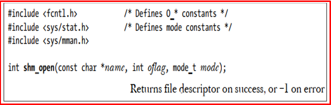   
</p>

***Set size***
+ Khi shared memory object được tạo ra. Kích thước của nó được khởi tạo bằng 0
+ Do đó ta cần phải set size cho shared memory object thông qua API ftruncate().
<p align="center">
  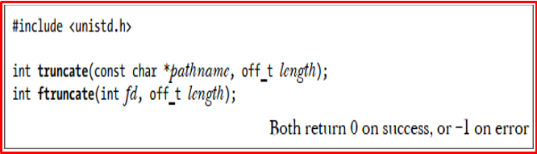   
</p>

***Map/unmap shared memory object***
+ Để map shared memory object vào trong vùng nhớ của process chúng ta cần sử dụng API mmap(). 
+ Kĩ thuật này còn được gọi là memory mapping
+ Chúng ta có 4 kiểu memory mapping như sau
    + Private anonymous mapping
    + Shared anonymous mapping
    + Private file mapping
    + Shared file mapping (dùng chính)
+ Để upmap chúng ta sử dụng API munmap().

<p align="center">
  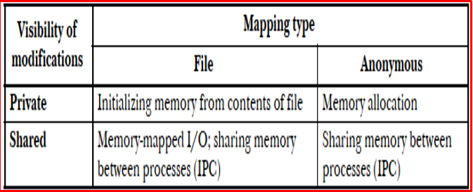   
</p>

***Giải phóng shared memory object***
+ Để giải phóng shared memory object được tạo ra trước đó chúng ta sử dụng API shm_unlink()
+ Shared memory object sẽ được xóa sau khi process cuối cùng được unmap.

<p align="center">
  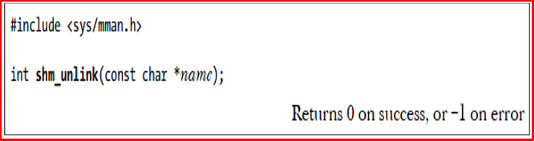   
</p>


***Code Mẫu***
+ Để chạy thì ta dùng lệnh như sau:
```bash
gcc -o write write.c –lrt
gcc -o read read.c -lrt
file share memory nằm ở    "ls -l /dev/shm"
```

+ File reader.c
```bash
#include <stdio.h>
#include <stdlib.h>
#include <errno.h>
#include <fcntl.h>
#include <sys/mman.h>
#include <unistd.h>
#include <string.h>


#define SHARED_MEM_SIZE     100             /* the size (in bytes) of shared memory object */
#define FILE_NAME           "tho_mmap"     /* name of the shared memory object */


/**
 * 1. Tạo fd
 * 2. Set size
 * 3. map/unmap process memory
 * 4. Xóa shared memory segment
 */


int main() 
{ 
    /**
     *  int shm_open (const char *name, int oflag, mode_t mode);
     *  @brief 
     * 
     *  @param[in] name File path
     *  @param[in] oflag O_RDONLY --> process open shared memory object với quyền ReadOnly.
     *                   O_RDWR   --> process open shared memory object với quyền Read/Write.
     *                   O_CREAT  --> tạo shared memory segment nếu không tồn tại.
     *                   O_EXCL   --> nếu như shared memory object với file được đưa ra đang tồn tại thì trả về lỗi EEXIST.
     *                   O_TRUNC  --> nếu shared memory object đang tồn tại thực hiện truncate tới giá trị 0.
     *  @param[in] mode permission của shared memory object được tạo. Nếu oflag không sử dụng cờ O_CREAT hay 
     *                  shared memory object đang tồn tại thì mode sẽ bị bỏ qua.
     *                  
     *  @return Sau khi tạo thành công thì có thể thấy file liên kết với shared memory trong đường dẫn, -1 nếu lỗi.
     */
    int fd = shm_open(FILE_NAME, O_RDWR, 0);
    if (fd < 0) {
        printf("shm_open() is failed, %s.\n", strerror(errno));
        return -1;
    }


    /**
     * int ftruncate (int shm_fd, off_t length);
     * @brief Configure the size of the shared memory object.
     *        After opening, the size of the shared memory object is 0 
     * 
     * @param[in] shm_fd shm file descriptor
     * @param[in] length the size (in bytes) of shared memory object
     * 
     * @return
     */ 
    ftruncate(fd, SHARED_MEM_SIZE);


    /**
     * void *mmap (void *addr, size_t length, int prot, int flags, int fd, off_t offset);
     * @brief Configure the size of the shared memory object.
     * 
     * @param[in] addr địa chỉ memory của calling process được map. Tương tự như shm nên 
     *                 set giá trị là 0 và kernel sẽ allocation addr phù hợp
     * @param[in] length độ dài của shared memory object được map (> 0).
     * @param[in] prot memory protection of mapping (không được conflict với file permission).
     *                 Có thể có các giá trị sau:
     *                 PROT_EXEC  ---> Pages may be executed.
     *                 PROT_READ  ---> Pages may be read.
     *                 PROT_WRITE ---> Pages may be written.
     *                 PROT_NONE  ---> Pages may not be accessed. 
     * @param[in] flags cờ cho phép các process có thể thấy được cập nhật của các process vào 
     *                  shared memory hay không.
     *                  MAP_SHARED  ---> cập nhật của process này vào shared memory là available với các process khác. 
     *                  MAP_PRIVATE ---> kernel sử dụng phương thức copy-on-write để tạo ra vùng nhớ riêng cho thay 
     *                              đổi của process. Các thay đổi này sẽ không visiable đối với các process khác.
     *                  MAP_ANONYMOUS ---> Tạo ra anonymous mapping. Toàn bộ ô nhớ trên vùng này được khởi tạo là 0.
     *                  Không cần quân tâm tới fd.
     *                  MAP_UNINITIALIZED ---> Không khởi tạo vùng anonymous mapping.
     *                              
     * @param[in] fd shm file descriptor
     * @param[in] offset offset của shared memory object sẽ được maping vào virtual memory của process.
     * 
     * @return  On success, mmap() returns a pointer to the mapped area.
     *          On error, the value MAP_FAILED (that is, (void *) -1) is returned, 
     *          and errno is set to indicate the cause of the error.
     */
    char *data = (char *)mmap(0, SHARED_MEM_SIZE, PROT_READ | PROT_WRITE, MAP_PRIVATE, fd, 0);


    printf("%s: Read data: %s\n", __FILE__, data);


    /**
     * int munmap(void *addr, size_t length);
     * @brief Unmap shared memory object khỏi calling process.
     * 
     * @param[in] addr địa chỉ memory của calling process được map.
     * @param[in] length độ dài của shared memory object được map (> 0).
     * 
     * @return On success, munmap() returns 0. 
     *         On failure, it returns -1, and errno is set to 
     *         indicate the cause of the error (probably to EINVAL).
     */
    munmap(data, SHARED_MEM_SIZE);


    close(fd);


    /**
     * int shm_unlink(const char *name);
     * @brief Remove shared memory object đã được tạo trước đó. 
     *        Shared memory object sẽ được xóa sau khi process cuối cùng được unmap.
     * 
     * @param[in] name File path    
     *  
     * @return
     */ 
    //shm_unlink(FILE_NAME);
  
    return 0; 
}
```

+ File writer.c
```bash
#include <stdio.h>
#include <stdlib.h>
#include <errno.h>
#include <fcntl.h>
#include <sys/mman.h>
#include <unistd.h>
#include <string.h>
#include <sys/shm.h>


#define SHARED_MEM_SIZE     100             /* the size (in bytes) of shared memory object */
#define FILE_NAME           "tho_mmap"     /* name of the shared memory object */


/**
 * 1. Tạo fd
 * 2. Set size
 * 3. map/unmap process memory 
 * 4. Xóa shared memory segment
 */


int main() 
{ 
    /**
     *  int shm_open (const char *name, int oflag, mode_t mode);
     *  @brief 
     * 
     *  @param[in] name File path
     *  @param[in] oflag O_RDONLY --> process open shared memory object với quyền ReadOnly.
     *                   O_RDWR   --> process open shared memory object với quyền Read/Write.
     *                   O_CREAT  --> tạo shared memory segment nếu không tồn tại.
     *                   O_EXCL   --> nếu như shared memory object với file được đưa ra đang tồn tại thì trả về lỗi EEXIST.
     *                   O_TRUNC  --> nếu shared memory object đang tồn tại thực hiện truncate tới giá trị 0.
     *  @param[in] mode permission của shared memory object được tạo. Nếu oflag không sử dụng cờ O_CREAT hay 
     *                  shared memory object đang tồn tại thì mode sẽ bị bỏ qua.
     *                  
     *  @return Sau khi tạo thành công thì có thể thấy file liên kết với shared memory trong đường dẫn, -1 nếu lỗi.
     */
    int shm_fd = shm_open(FILE_NAME, O_CREAT | O_RDWR, 0666); 
    if (shm_fd < 0) {
        printf("shm_open() is failed, %s.\n", strerror(errno));
        return -1;
    }


    /**
     * int ftruncate (int shm_fd, off_t length);
     * @brief Configure the size of the shared memory object.
     *        After opening, the size of the shared memory object is 0 
     * 
     * @param[in] shm_fd shm file descriptor
     * @param[in] length the size (in bytes) of shared memory object
     * 
     * @return
     */ 
    ftruncate(shm_fd, SHARED_MEM_SIZE);
    
    /**
     * void *mmap (void *addr, size_t length, int prot, int flags, int fd, off_t offset);
     * @brief Configure the size of the shared memory object.
     * 
     * @param[in] addr địa chỉ memory của calling process được map. Tương tự như shm nên 
     *                 set giá trị là 0 và kernel sẽ allocation addr phù hợp
     * @param[in] length độ dài của shared memory object được map (> 0).
     * @param[in] prot memory protection of mapping (không được conflict với file permission).
     *                 Có thể có các giá trị sau:
     *                 PROT_EXEC  ---> Pages may be executed.
     *                 PROT_READ  ---> Pages may be read.
     *                 PROT_WRITE ---> Pages may be written.
     *                 PROT_NONE  ---> Pages may not be accessed. 
     * @param[in] flags cờ cho phép các process có thể thấy được cập nhật của các process vào 
     *                  shared memory hay không.
     *                  MAP_SHARED  ---> cập nhật của process này vào shared memory là available với các process khác. 
     *                  MAP_PRIVATE ---> kernel sử dụng phương thức copy-on-write để tạo ra vùng nhớ riêng cho thay 
     *                              đổi của process. Các thay đổi này sẽ không visiable đối với các process khác.
     *                  Ngoài ra, ta có thể dùng phép OR để kết hợp với một số cờ sau:
     *                  MAP_ANONYMOUS ---> Tạo ra anonymous mapping. Toàn bộ ô nhớ trên vùng này được khởi tạo là 0.
     *                  Không cần quân tâm tới fd.
     *                  MAP_UNINITIALIZED ---> Không khởi tạo vùng anonymous mapping.
     *                              
     * @param[in] fd shm file descriptor
     * @param[in] offset offset của shared memory object sẽ được maping vào virtual memory của process.
     * 
     * @return  On success, mmap() returns a pointer to the mapped area.
     *          On error, the value MAP_FAILED (that is, (void *) -1) is returned,  
     *          and errno is set to indicate the cause of the error.
     */
    char *data = (char *)mmap(0, SHARED_MEM_SIZE, PROT_READ | PROT_WRITE, MAP_SHARED, shm_fd, 0);


    strcpy(data, "Hello ThoNV12 !");
    printf("%s: Write data: %s\n", __FILE__, data);


    /**
     * int munmap(void *addr, size_t length);
     * @brief Unmap shared memory object khỏi calling process.
     * 
     * @param[in] addr địa chỉ memory của calling process được map.
     * @param[in] length độ dài của shared memory object được map (> 0).
     * 
     * @return On success, munmap() returns 0. 
     *         On failure, it returns -1, and errno is set to 
     *         indicate the cause of the error (probably to EINVAL).
     */ 
    munmap(data, SHARED_MEM_SIZE);


    //close(shm_fd);
  
    return 0; 
}
```

## ✔️ Conclusion
Ở bài này chúng ta đã biết về Shared Memory. Tiếp theo chúng ta cùng đi tìm hiểu về Message Queue nhé.

## 💯 Exercise
Tạo 1 file .c trong đó tạo ra 2 process cha con A và B.
+ Bài 1: Tạo shared memory theo System V giao tiếp với nhau.
+ Bài 2: Tạo shared memory theo Posix giao tiếp với nhau.

## 📺 NOTE

+ Xem video sau để trực quan hơn nhé : [Video Youtube](https://youtu.be/KH_9rhuZCU8?si=vazdkMbc2hc5rVA-)

## 📌 Reference

[1] Professional Linux Kernel Development 3rd.pdf

[2] https://viblo.asia/p/giao-tiep-giua-cac-tien-trinh-trong-linux-phan-2-su-dung-share-memory-va-message-queue-djeZ1yyYZWz

[3] https://vinalinux.com.vn/2023/11/10/shared-memory/