# 💚 IPC Message Queue 💛

## 👉 Introduction and Summary

### 1️⃣ Introduction

+ Ở bài trước chúng ta đã biết về Shared Memory và cách hoạt động của nó trong linux. Nếu các bạn chưa đọc thì xem link này nha [010_IPC_Shared_Memory.md](../010_IPC_Shared_Memory/010_IPC_Shared_Memory.md). Ở bài này chúng ta sẽ tìm hiểu về IPC Message Queue trong linux.

### 2️⃣ Summary

Nội dung của bài viết gồm có những phần sau nhé 📢📢📢:
- [I. Introduction and Summary](#👉-introduction-and-summary)

    - [1. Introduction](#1️⃣-introduction)
    - [2. Summary](#2️⃣-summary)
- [II. Contents](#👉-contents)
    - [1. Message Queues là gì​](#1️⃣-message-queues-là-gì)
    - [2. System V Message Queues](#2️⃣-system-v-message-queues)
    - [3. POSIX Message Queues](#3️⃣-posix-message-queues)
- [III. Conclusion](#✔️-conclusion)
- [IV. Exercise](#💯-exercise)
- [V. NOTE](#📺-note)
- [VI. Reference](#📌-reference)

## 👉 Contents
### 1️⃣ Message Queues là gì
+ Một Message Queues là một danh sách liên kết (link-list) các message được duy trì bởi kernel
+ Tất cả các process có thể trao đổi dữ liệu thông qua việc truy cập vào cùng một queues
+ Mỗi một message sẽ được đính kèm thông thêm thông tin về type (type message).

<p align="center">
  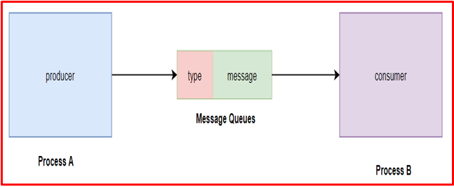   
</p>

+ Dựa vào type message mà các process có thể lấy ra tin nhắn phù hợp.Ở đây có 3 process

<p align="center">
  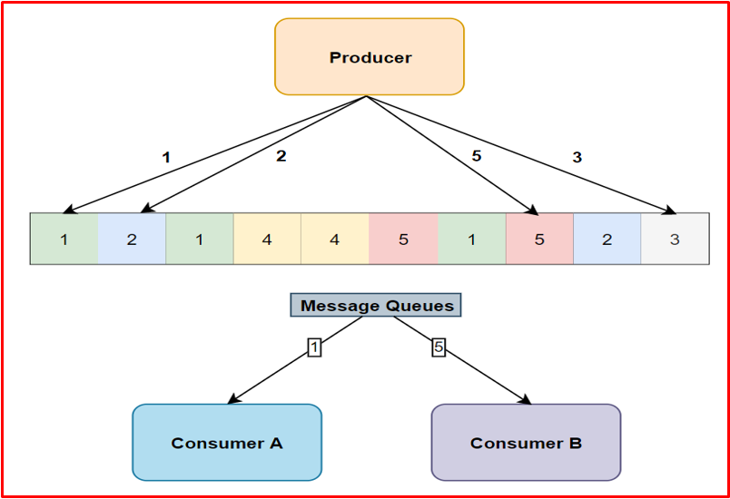   
</p>

+ Producer đẩy các mess có type riêng vào queues, và consumer có  thể lọc các type riêng đó ra để nhận mess, ví dụ thằng consumer A sẽ lấy tất cả các mess có type là 1, thằng B lấy type là 2


### 2️⃣ System V Message Queues
Các bước triển khai
+ Tạo key.
+ Tạo message queue hoặc mở một message queue có sẵn.
+ Ghi dữ liệu vào message queue.
+ Đọc dữ liệu từ message queue.
+ Giải phóng message queue

***Tạo key***
+ Key được sử dụng có thể là một số nguyên bất kì hoặc được tạo ra bởi hàm ftok().
+ Muốn dùng chung 1 queue thì cái key phải giống nhau, và cái queue này do mình tự đựt tên luôn
<p align="center">
  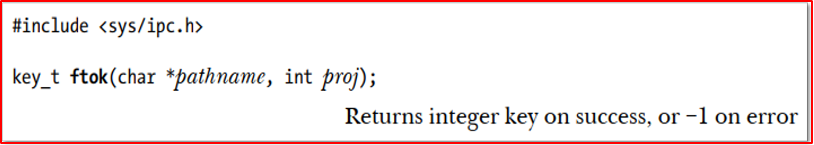   
</p>

***Create a message queue***
+ Để tạo mới hoặc mở một message queues đã tồn tại chúng ta sử dụng msgget().
  + key: key được tạo từ bước 1
  + msgflg:
    + IPC_CREAT: tạo mới
    + IPC_EXCL : nếu tồn tại rồi thì trả về mã lỗi
+ Trả về message id của message queue nếu thực hiện thành công
<p align="center">
  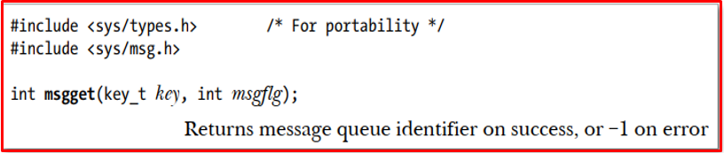   
</p>

***Write into message queue***
+ Để ghi dữ liệu (send/append) vào message queue chúng ta sử dụng msgsnd().
  + msqid: message id thu được từ msgget().
  + msgp: con trỏ tới message (send).
  + msgsz: kích thước message.
  + msgflg:
    + IPC_NOWAIT: Return ngay lập tức nếu message trong queue đã full
    + MSG_NOERROR: Cắt bớt message nếu kích thước mess lớn hơn msgsz. Nếu kích thước tối đa của mess thì 60 chẳng hặn mà size của mess mình gửi là 100 thì nó sẽ bị cắt bớt đi
<p align="center">
  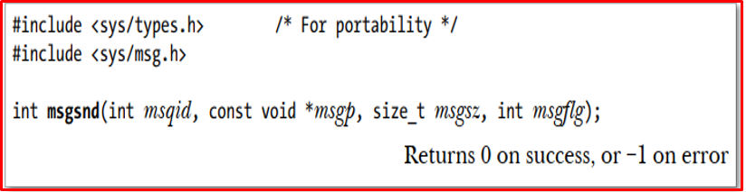   
</p>

***Read from the message queue***
+ Để đọc dữ liệu từ message queue chúng ta sử dụng msgrcv().
  + msqid: message id thu được từ msgget().
  + msgp: con trỏ tới buffer (read).
  + maxmsgsz: thường là kích thước của buffer.
  + msgtyp:
    + Đọc tin nhắn nhận được đầu tiên trong hàng đợi  
    + Số nguyên dương : thì lấy cái mess mà có type là số đó
    + Số nguyên âm, thì nó sẽ duyệt tất cả các type và lấy cái mess có cái type nhỏ nhất mà nhỏ hơn trị tuyệt đối của số nguyên âm, ví dụ có 1 2 3 4 mà truyền vào là -3 thì sẽ lấy 1, do 1 nhỏ nhất và 1 < |-3| 
  + msgflg:
    + IPC_NOWAIT: Return ngay lập tức nếu không tìm thấy message trong queue. 
    + MSG_NOERROR: Cắt bớt message nếu kích thước mess lớn hơn maxmsgsz
<p align="center">
  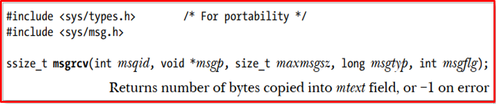   
</p>

***Delete message queue***
+ Để kiểm soát các hoạt động trên message queue chúng ta sử dụng msgctl().
  + msqid: message id thu được từ msgget().
  + cmd:
    + IPC_RMID: Xóa message queue ngay lập tức.
    + IPC_STAT
    + IPC_SET
+ Để xóa một message queue thông thường cmd chúng ta dùng là IPC_RMID và  buf để thành giá trị NULL
+ Bên system V thì xóa cái là xóa luôn

<p align="center">
  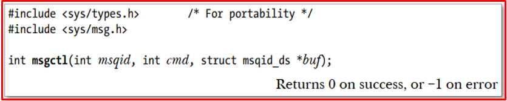   
</p>

+ Code : A nhận type là 1, B nhận type là 2, 2 thằng sẽ block do cờ nhận ta để là 0 còn nếu để IPC_NOWAIT thì nó return luôn chứ không bị block nữa, và đợi produced gửi 

+ File ConsumerA.c
```bash
#include <stdio.h>
#include <sys/ipc.h>
#include <sys/msg.h>
  
// structure for message queue
struct mesg_buffer {
    long mesg_type;
    char mesg_text[100];
} message;
  
int main()
{
  key_t key;
  int msgid;

  // ftok to generate unique key
  key = ftok("helloThoNV", 65);

  // msgget creates a message queue
  // and returns identifier
  msgid = msgget(key, 0666 | IPC_CREAT);

  // msgrcv to receive message
  msgrcv(msgid, &message, sizeof(message), 1, 0);  // type 1
  
  // display the message
  printf("Data Received is : %s \n", 
                  message.mesg_text);

  // to destroy the message queue
  msgctl(msgid, IPC_RMID, NULL);

  return 0;
}
```

+ File ConsumerB.c
```bash
#include <stdio.h>
#include <sys/ipc.h>
#include <sys/msg.h>
  
// structure for message queue
struct mesg_buffer {
    long mesg_type;
    char mesg_text[100];
} message;
  
int main()
{
  key_t key;
  int msgid;

  // ftok to generate unique key
  key = ftok("helloThoNV", 65);

  // msgget creates a message queue
  // and returns identifier
  msgid = msgget(key, 0666 | IPC_CREAT);

  // msgrcv to receive message
  msgrcv(msgid, &message, sizeof(message), 2, 0);

  // display the message
  printf("Data Received is : %s \n", 
                  message.mesg_text);

  // to destroy the message queue
  // msgctl(msgid, IPC_RMID, NULL);

  return 0;
}
```

+ File Produced.c
```bash
#include <stdio.h>
#include <sys/ipc.h>
#include <sys/msg.h>


#define BUFFER_SIZE 100
  
// structure for message queue
struct mesg_buffer {
    long mesg_type;
    char mesg_text[BUFFER_SIZE];
} message;
  
int main()
{
  key_t key;
  int msgid;
  
  // ftok to generate unique key
  key = ftok("helloThoNV", 65);

  // msgget creates a message queue
  // and returns identifier
  msgid = msgget(key, 0666 | IPC_CREAT);


  printf("Enter type message: "); 
  scanf("%ld", &message.mesg_type); 
  stdin = freopen(NULL,"r",stdin); // clear input buffer


  printf("Enter message: "); 
  fgets(message.mesg_text, BUFFER_SIZE, stdin);

  // msgsnd to send message
  msgsnd(msgid, &message, sizeof(message), 0);

  return 0;
}
```

### 3️⃣ POSIX Message Queues
***Các bước triển khai***
+ Tạo message queue hoặc mở một message queue có sẵn.
+ Ghi dữ liệu vào message queue.
+ Đọc dữ liệu từ message queue.
+ Đóng message queue khi không sử dụng.
+ Giải phóng message queue


***Opening a message queue***
+ Để tạo mới hoặc mở một message queues đã tồn tại chúng ta sử dụng mq_open().
  + name: Tên message queue
  + oflag: 
    + O_CREATE
    + O_EXCL
    + O_RDONLY
    + O_NONBLOCK:khi write 1 queue full hoặc read 1 queue NULL thì return luôn
  + mode: 0666: Khi tạo mới thì sét mode
  + attr: Chỉ định các thuộc tính của message queue. Nếu là NULL sẽ sử dụng các thuộc tính mặc định.

<p align="center">
  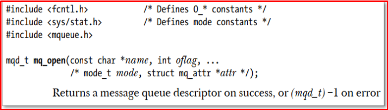   
</p>

<p align="center">
  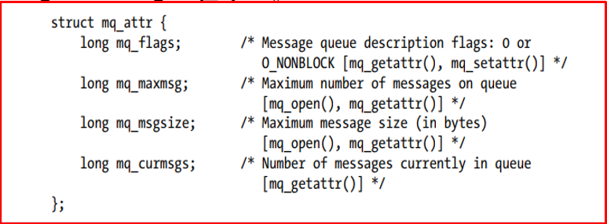   
</p>

***Sending message***
+ Để ghi dữ liệu vào message queue chúng ta sử dụng mq_send().
  + mqdes: mq descriptor được trả về
  + msg_ptr: con trỏ tới message.
  + msg_len: kích thước message.
  + msg_prio: priority của message: queue sẽ sắp xếp mess theo priority này, 0 là nhỏ nhất. còn nếu không muốn quan tâm đến độ ưu tiên thì cho cùng 1 priority hết

<p align="center">
  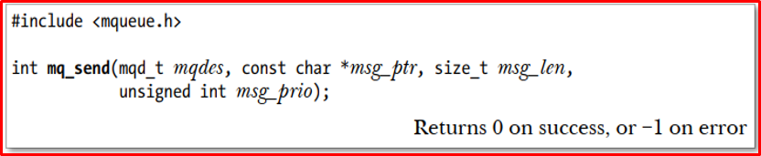   
</p>

***Receving message***
+ Đọc dữ liệu từ message queue chúng ta sử dụng mq_receive().
  + mqdes: mq descriptor được trả về 
  + msg_ptr: con trỏ tới message.
  + msg_len: kích thước message.
  + msg_prio: priority của message
+ Hàm mq_receive () loại bỏ message có mức độ ưu tiên cao nhất khỏi queue, được tham chiếu bởi mqdes và trả về thông báo đó trong bộ đệm do msg_ptr trỏ tới.
+ Nếu hàng đợi thông báo hiện đang trống, thì mq_receive () sẽ block cho đến khi có thông báo hoặc, nếu cờ O_NONBLOCK có hiệu lực, return ngay lập tức với lỗi EAGAIN.
<p align="center">
  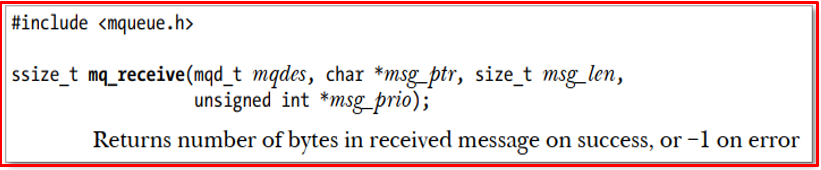   
</p>

***Clossing a message queue***
+ Để đóng message queue khi không còn sử dụng ta sử sử dụng mq_close().
  + mqdes: mq descriptor được trả về
<p align="center">
  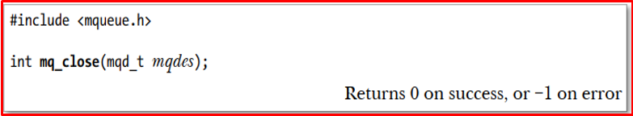   
</p>

***Remove a message queue***
+ Để xóa message queue khi không còn sử dụng ta sử sử dụng mq_ unlink().
+ Tuy nhiên như vậy thì vẫn chưa xóa được mà khi tất cả process đều unlink với queue thì nó mới xóa đi. Đây cũng là điểm khác biệt so với systemV

+ Chạy chương trình thì như dưới
> gcc -o main -g main.c -Wall -lrt

```bash
#include <stdio.h>
#include <string.h>
#include <mqueue.h>  
#include <errno.h>  

#define MQ_MODE (S_IRUSR | S_IWUSR ) 
  
int main(int argc, char *argv[])  
{  
    struct mq_attr attrp;
    
    printf("Create mqueu\n");  
    mqd_t mqid = mq_open("/mqueue", O_RDWR | O_CREAT, MQ_MODE, NULL);  
    if (mqid == -1) {  
        printf("mq_open() error %d: %s\n", errno, strerror(errno));  
        return -2;  
    }

    if (mq_getattr(mqid, &attrp) != 0) {  
        printf("mq_open() error %d: %s\n", errno, strerror(errno));  
        return -3;  
    }

    if (attrp.mq_flags == 0)  
        printf("mq_flags = 0\n");  
    else  
        printf("mq_flags = O_NONBLOCK\n");

    printf("mq_maxmsg = %ld,\n", attrp.mq_maxmsg);  
    printf("mq_msgsize = %ld\n", attrp.mq_msgsize);  
    printf("mq_curmsgs = %ld\n", attrp.mq_curmsgs);  

    mq_unlink("/mqueue");
    return 0;  
}
```

## ✔️ Conclusion
Ở bài này chúng ta đã biết về Message Queue. Tiếp theo chúng ta cùng đi tìm hiểu về Socket nhé.

## 💯 Exercise
Tạo 1 file .c trong đó tạo ra 2 process cha con A và B.
+ Bài 1: Tạo Message Queue theo System V giao tiếp với nhau.
+ Bài 2: Tạo Message Queue theo Posix giao tiếp với nhau.

## 📺 NOTE

+ Xem video sau để trực quan hơn nhé : [Video Youtube](https://youtu.be/KH_9rhuZCU8?si=vazdkMbc2hc5rVA-)

## 📌 Reference

[1] Professional Linux Kernel Development 3rd.pdf

[2] https://viblo.asia/p/giao-tiep-giua-cac-tien-trinh-trong-linux-phan-2-su-dung-share-memory-va-message-queue-djeZ1yyYZWz

[3] https://www.tutorialspoint.com/inter_process_communication/inter_process_communication_message_queues.htm 