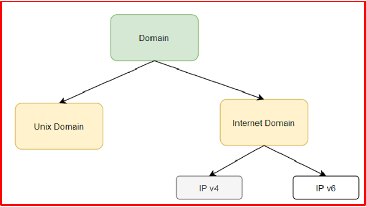
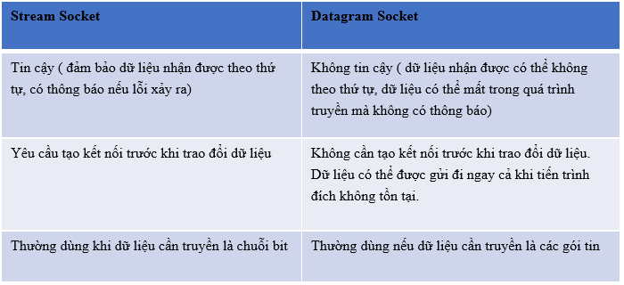
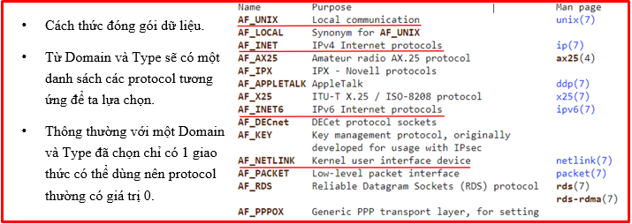
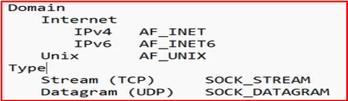
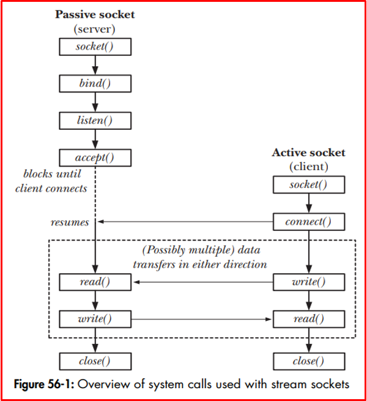
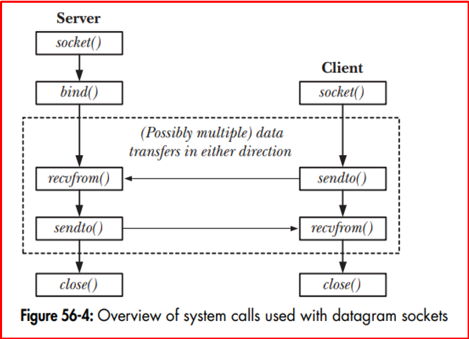
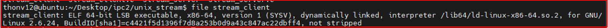
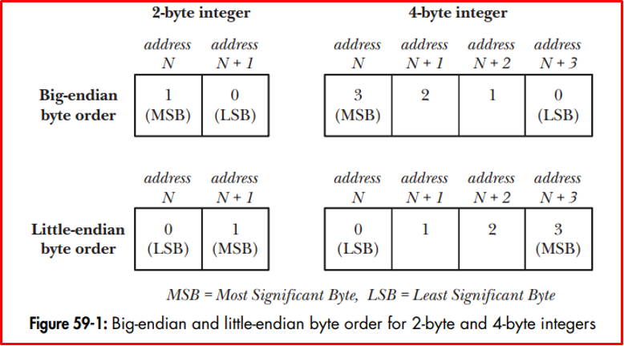
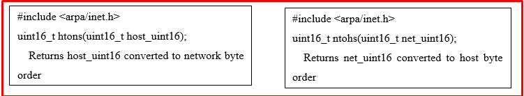
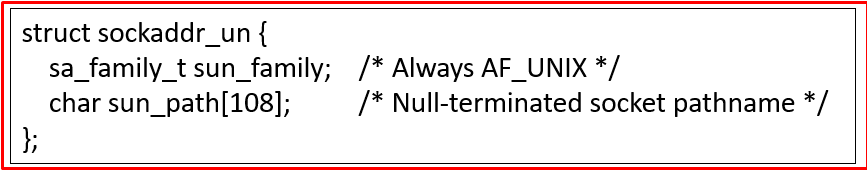

# 💚 IPC Socket 💛

## 👉 Introduction and Summary

### 1️⃣ Introduction

+ Ở bài trước chúng ta đã biết về Message Queue và cách hoạt động của nó trong linux. Nếu các bạn chưa đọc thì xem link này nha [011_IPC_Message_Queue.md](../011_IPC_Message_Queue/011_IPC_Message_Queue.md). Ở bài này chúng ta sẽ tìm hiểu về IPC Socket trong linux.

### 2️⃣ Summary

Nội dung của bài viết gồm có những phần sau nhé 📢📢📢:
- [I. Introduction and Summary](#👉-introduction-and-summary)

    - [1. Introduction](#1️⃣-introduction)
    - [2. Summary](#2️⃣-summary)
- [II. Contents](#👉-contents)
    - [1. Định nghĩa​](#1️⃣-định-nghĩa)
    - [2. Flow hoạt động của Stream Socket](#2️⃣-flow-hoạt-động-của-stream-socket)
    - [3. Flow hoạt động của Datagram Socket](#3️⃣-flow-hoạt-động-của-datagram-socket)
    - [4. Internet Domain Socket](#4️⃣-internet-domain-socket)
    - [5. Chuyển đổi địa chỉ Socket](#5️⃣-chuyển-đổi-địa-chỉ-socket)
    - [6. Unix Domain Socket](#6️⃣-unix-domain-socket)
- [III. Conclusion](#✔️-conclusion)
- [IV. Exercise](#💯-exercise)
- [V. NOTE](#📺-note)
- [VI. Reference](#📌-reference)

## 👉 Contents
### 1️⃣ Định nghĩa
+ Socket là cơ chế truyền thông cho phép các tiến trình có thể giao tiếp với nhau dù các tiến trình ở trên cùng thiết bị hay khác thiết bị
+ Socket được đại diện bởi một file socket descriptor
+ Thông tin được mô tả trong một file socket sẽ gồm: Domain, Type, Protocol

***Domain***
+ Tiến trình cần giao tiếp nằm trên cùng thiết bị hay khác thiết bị. Socket có 2 domain chính là 
  + Internet Domain
  + UNIX Domain

+ Socket hoạt động trên miền UNIX Domain nếu các tiến trình gửi nhận thông tin nằm trên cùng một host.(Như cùng nằm trên 1 con IMX8MM)

+ Socket hoạt động trên miền Internet Domain nếu các tiến trình gửi nhận thông tin nằm trên các host khác nhau.(2 thiết bị khác nhau)

<p align="center">
     
</p>

***Type***
+ Mô tả cơ chế truyền nhận thông tin
+ Socket có 2 type phổ biến là:
  + Stream(TCP)
  + Datagram.(UDP)
<p align="center">
     
</p>

***Protocol***
+ Cách thức đóng gói dữ liệu.
+ Từ Domain và Type sẽ có một danh sách các protocol tương ứng để ta lựa chọn.
+ Thông thường với một Domain và Type đã chọn chỉ có 1 giao thức có thể dùng nên protocol thường có giá trị 0
<p align="center">
     
</p>
<p align="center">
     
</p>


### 2️⃣ Flow hoạt động của Stream Socket
+ Stream socket yêu cầu tạo một kết nối trước khi truyền dữ liệu.
+ Tiến trình khởi tạo kết nối đóng vai trò là client, tiến trình nhận được yêu cầu kết nối là server

+ Cách tạo server socket
1. Tạo socket lấy ra được server_fd( file discrip), như là tạo ra 1 căn nhà trống
2. Có được căn nhà thì minh sẽ đi tạo địa chỉ 
3. Gán địa chỉ cho căn nhà đó (binding)
4. Sau khi gán rồi thì ta thoải mái giao tiếp với client thôi (listen()), rồi ta sét xem là 1 lúc tối đa bao nhiêu kết nối trong hàng đợi
5. Vào trong while 1 có hàm accept đợi thằng client connect , khi accept thành công thì sẽ tạo ra 1 socket khác để connect tiếp

+ Cách tạo client socket
1. Tạo socket
2. Connect tới server, write read..

<p align="center">
     
</p>

+ Xét ví dụ: Domain: ipv4, Type: stream, Protocol: 0
  + Sau khi make all thì chạy   sudo ./server 80    ( 80 là port 80 , muốn mấy cũng được)
+ Code ipv4_stream Stream_server
```bash
// sudo ./server 80
#include <stdio.h>
#include <stdlib.h>
#include <string.h>
#include <errno.h>
#include <sys/socket.h>     //  Chứa cấu trúc cần thiết cho socket. 
#include <netinet/in.h>     //  Thư viện chứa các hằng số, cấu trúc khi sử dụng địa chỉ trên internet
#include <arpa/inet.h>
#include <unistd.h>

#define LISTEN_BACKLOG 50
#define BUFF_SIZE 256
#define handle_error(msg) \
    do { perror(msg); exit(EXIT_FAILURE); } while (0)


/* Chức năng chat */
void chat_func(int new_socket_fd)
{       
    int numb_read, numb_write;
    char sendbuff[BUFF_SIZE];
    char recvbuff[BUFF_SIZE];
	
    while (1) {        
        memset(sendbuff, '0', BUFF_SIZE);
        memset(recvbuff, '0', BUFF_SIZE);

        /* Đọc dữ liệu từ socket */
        /* Hàm read sẽ block cho đến khi đọc được dữ liệu */
        numb_read = read(new_socket_fd, recvbuff, BUFF_SIZE);
        if(numb_read == -1)
            handle_error("read()");
        if (strncmp("exit", recvbuff, 4) == 0) {
            system("clear");
            break;
        }
        printf("\nMessage from Client: %s\n", recvbuff);

        /* Nhập phản hồi từ bàn phím */
        printf("Please respond the message : ");
        fgets(sendbuff, BUFF_SIZE, stdin);

        /* Ghi dữ liệu tới client thông qua hàm write */
        numb_write = write(new_socket_fd, sendbuff, sizeof(sendbuff));
        if (numb_write == -1)
            handle_error("write()");
        
        if (strncmp("exit", sendbuff, 4) == 0) {
            system("clear");
            break;
        }

        sleep(1);
    }
    close(new_socket_fd);
}

int main(int argc, char *argv[])
{
    int port_no, len, opt;
    int server_fd, new_socket_fd;
    struct sockaddr_in serv_addr, client_addr;

    /* Đọc portnumber trên command line */
    if (argc < 2) {
        printf("No port provided\ncommand: ./server <port number>\n");
        exit(EXIT_FAILURE);
    } else
    port_no = atoi(argv[1]);

    /* Gán về 0 hết */
    memset(&serv_addr, 0, sizeof(struct sockaddr_in));
    memset(&client_addr, 0, sizeof(struct sockaddr_in));
    
    /* Tạo socket */
    server_fd = socket(AF_INET, SOCK_STREAM, 0);
    if (server_fd == -1)
        handle_error("socket()");

    /* Ngăn lỗi : “address already in use” */
    if (setsockopt(server_fd, SOL_SOCKET, SO_REUSEADDR | SO_REUSEPORT, &opt, sizeof(opt)))
        handle_error("setsockopt()");  

    /* Khởi tạo địa chỉ cho server */
    serv_addr.sin_family = AF_INET;
    serv_addr.sin_port = htons(port_no);
    serv_addr.sin_addr.s_addr =  INADDR_ANY; //inet_addr("192.168.83.128"); //INADDR_ANY

    /* Gắn socket với địa chỉ server */
    if (bind(server_fd, (struct sockaddr*)&serv_addr, sizeof(serv_addr)) == -1)
        handle_error("bind()");

    /* Nghe tối đa 5 kết nối trong hàng đợi */
    if (listen(server_fd, LISTEN_BACKLOG) == -1)
        handle_error("listen()");

    /* Dùng để lấy thông tin client */
	len = sizeof(client_addr);

    while (1) {
        printf("Server is listening at port : %d \n....\n",port_no);
		new_socket_fd  = accept(server_fd, (struct sockaddr*)&client_addr, (socklen_t *)&len); 
		if (new_socket_fd == -1)
            handle_error("accept()");

		system("clear");
		
		printf("Server : got connection \n");
		chat_func(new_socket_fd);
        
    }
    close(server_fd);
    return 0;
}
```

+ Code ipv4-client  stream_client
+ Sau khi make all thì chạy   ./client 192.168…. 80    ( 80 là port server tạo ra)
```bash
// ./client 192.168…. 80
#include <stdio.h>
#include <stdlib.h>
#include <string.h>
#include <errno.h>
#include <sys/socket.h>     //  Chứa cấu trúc cần thiết cho socket. 
#include <netinet/in.h>     //  Thư viện chứa các hằng số, cấu trúc khi sử dụng địa chỉ trên internet
#include <arpa/inet.h>
#include <unistd.h>

#define BUFF_SIZE 256
#define handle_error(msg) \
    do { perror(msg); exit(EXIT_FAILURE); } while (0)
		
/* Chức năng chat */
void chat_func(int server_fd)
{
    int numb_write, numb_read;
    char recvbuff[BUFF_SIZE];
    char sendbuff[BUFF_SIZE];
    while (1) {
        memset(sendbuff, '0', BUFF_SIZE);
	   				     memset(recvbuff, '0', BUFF_SIZE);
        printf("Please enter the message : ");
        fgets(sendbuff, BUFF_SIZE, stdin);

        /* Gửi thông điệp tới server bằng hàm write */
        numb_write = write(server_fd, sendbuff, sizeof(sendbuff));
        if (numb_write == -1)     
            handle_error("write()");
        if (strncmp("exit", sendbuff, 4) == 0) {
            printf("Client exit ...\n");
            break;
        }
		
        /* Nhận thông điệp từ server bằng hàm read */
        numb_read = read(server_fd, recvbuff, sizeof(recvbuff));
        if (numb_read < 0) 
            handle_error("read()");
        if (strncmp("exit", recvbuff, 4) == 0) {
            printf("Server exit ...\n");
            break;
        }

        printf("\nMessage from Server: %s\n",recvbuff);   
    }
    close(server_fd); /*close*/ 
}

int main(int argc, char *argv[])
{
    int portno;
    int server_fd;
    struct sockaddr_in serv_addr;
	memset(&serv_addr, '0',sizeof(serv_addr));
	
    /* Đọc portnumber từ command line */
    if (argc < 3) {
        printf("command : ./client <server address> <port number>\n");
        exit(1);
    }
    portno = atoi(argv[2]);
	
    /* Khởi tạo địa chỉ server */
    serv_addr.sin_family = AF_INET;
    serv_addr.sin_port   = htons(portno);
    if (inet_pton(AF_INET, argv[1], &serv_addr.sin_addr) == -1) 
        handle_error("inet_pton()");
	
    /* Tạo socket */
    server_fd = socket(AF_INET, SOCK_STREAM, 0);
    if (server_fd == -1)
        handle_error("socket()");
	
    /* Kết nối tới server*/
    if (connect(server_fd, (struct sockaddr *)&serv_addr, sizeof(serv_addr)) == -1)
        handle_error("connect()");
	
    chat_func(server_fd);

    return 0;
}
```

+ Code makefile
```bash
all:
	gcc -o server stream_server.c
	gcc -o client stream_client.c
BBB:
	$(GCC) -o client stream_client.c

clean:
	rm -rf client server
```

### 3️⃣ Flow hoạt động của Datagram Socket
+ Trong Datagram socket vai trò của client và server khá mờ nhạt. Client khi gửi tín hiệu đi hoặc nhận tín hiệu về thì không cần quan tâm server có nhận được tín hiệu hay không
+ Về cơ bản các tiến trình có thể gửi dữ liệu đến một địa chỉ bất kể địa chỉ đó có tồn tại hay không.
+ Trong quá trình truyền nhận ta tạm coi tiến trình muốn gửi dữ liệu là client và tiến trình nhận dữ liệu là server.
<p align="center">
     
</p>

### 4️⃣ Internet Domain Socket
***Internet Socket Address***
+ Dùng để giao tiếp giữa các tiến trình nằm trên các thiết bị khác nhau
+ Domain: AF_INET/AF_INET6
+ Socket chỉ có một kiểu địa chỉ duy nhất là sockaddr
+ Tuy nhiên để tiện cho việc sử dụng với từng domain socket khác nhau người ta định nghĩa thêm các struct địa chỉ riêng cho từng domain sau đó sẽ ép kiểu về struct socaddr
```bash
struct sockaddr {
sa_family_t  sa_family;     /* address family, AF_xxx */
char         sa_data[14];   /* 14 bytes of protocol address*/
};
```

***IPv4 Socket Address***
```bash
struct sockaddr_in {         
    sa_family_t sin_family;  	/* Address family (AF_INET) */ 
    in_port_t sin_port;      	/* Port number */ 
    struct in_addr sin_addr; 	/* IPv4 address */ 
    unsigned char __pad[X];  	/* Pad to size of 'sockaddr' structure (16 bytes) */
};
struct in_addr {            	/* IPv4 4-byte address */ 
    in_addr_t s_addr;       	 /* Unsigned 32-bit integer */
};
```
+ Địa chỉ của IPv4 socket được chứa trong struct sockaddr_in được định nghĩa trong file <netinet/in.h>
+ Địa chỉ của IPv4 Socket đặc trưng bởi giá trị địa chỉ IPv4 và port

### 5️⃣ Chuyển đổi địa chỉ Socket
+ Hiển thị thông tin file:  lệnh file name_file
<p align="center">
     
</p>

+ ELF: file exe
+ LSB Little-endian
+ Địa chỉ của Internet Socket được đặc trưng bởi địa chỉ IP và port. Chúng đều được lưu trữ trên thiết bị dưới dạng số integer.
+ Các thiết bị sử dụng các kiến trúc phần cứng khác nhau sẽ lưu trữ địa chỉ theo thứ tự khác nhau.
+ Socket sử dụng một quy ước chung về cách lưu trữ địa chỉ gọi là network byte order ( thật ra là theo thứ tự của Big-endian)
<p align="center">
     
</p>

+ Các hàm được sử dụng để chuyển đổi
<p align="center">
     
</p>

### 6️⃣ Unix Domain Socket
***Internet Socket Address***
+ Linux hỗ trợ Internet Socket để giao tiếp giữa các tiến trình trên cùng một thiết bị.
+ Tuy Internet Socket cũng có thể truyền thông trên cùng thiết bị nhưng Unix socket nhanh và dễ sử dụng hơn.
+ Domain là AF_UNIX
+ UNIX Domain Socket hỗ trợ 2 loại socket chính là:
  + SOCK_STREAM (stream)
  + SOCK_DGRAM (datagram).
+ Protocol luôn là 0.
  + socket(AF_UNIX, SOCK_STREAM, 0)

***Unix Socket Address***
+ Sau khi chạy bind() để gán địa chỉ cho socket một socket file sẽ được tạo theo path_name
+ Không thể gán một socket vào một path_name đã tồn tại.
+ Một path_name chỉ có thể được gán cho một socket.
+ Path_name có thể là đường dẫn tuyệt đối (/home/thonv12/path_name) hoặc tương đối (./path_name)
+ Tuy socket được đặc trưng bởi một socket file nhưng ta không thể dùng open() để kết nối socket.
+ Sau khi socket được đóng hay chương trình đã tắt file path_name vẫn còn. Nếu muốn xóa file này ta có thể dùng unlink() hoặc remove().
+ Để kết nối hoặc gửi dữ liệu tới socket yêu cầu tiến trình phải có quyền write với file path_name. 
+ Lệnh bind() sẽ tạo socket file với đầy đủ các quyền cho tất cả tài khoản nhưng ta có thể thay đổi quyền hạn của chúng bằng umask() hoặc đơn giản là thay đổi quyền của thư mục chứa file socket
+ NOTE: nếu truyền data giữa 2 máy thì dùng internet socket còn cùng 1 máy thì dùng Unix socket
<p align="center">
     
</p>


+ Code Unix dgram socket 
+ Code server chạy ./server
```bash
// ./server
#include <sys/un.h>
#include <sys/socket.h>
#include <stddef.h>
#include <ctype.h>
#include <stdio.h>

#define BUF_SIZE 10
#define SOCK_PATH "./sock_dgram"

int main(int argc, char *argv[])
{
    struct sockaddr_un svaddr, claddr;
    int fd, j;
    ssize_t numBytes;
    socklen_t len;
    char buf[BUF_SIZE];

    fd = socket(AF_UNIX, SOCK_DGRAM, 0);
    if (fd == -1) 
        return 1;

    memset(&svaddr, 0, sizeof(struct sockaddr_un)); 
    svaddr.sun_family = AF_UNIX;
    strncpy(svaddr.sun_path, SOCK_PATH, sizeof(svaddr.sun_path)-1);

    if (bind(fd, (struct sockaddr *) &svaddr, sizeof(struct sockaddr_un)) == -1) 
        return 1; 
    printf("start listening on server\n");
	
    for (;;) {
        len = sizeof(struct sockaddr_un);
        numBytes = recvfrom(fd, buf, BUF_SIZE, 0, (struct sockaddr *) &claddr, &len);
		if (numBytes == -1)
			return 1;
			
		printf("Server received %ld bytes from %s \n", (long) numBytes, claddr.sun_path); 

		for (j = 0; j < numBytes; j++) 
			buf[j] = toupper((unsigned char) buf[j]);
			
		if (sendto(fd, buf, numBytes, 0, (struct sockaddr *) &claddr, len) != numBytes) 
			printf("sendto error\n");
	}
}
```

+ Code client unix dgram  chạy « ./client vantho » thì nó sẽ trả về vantho viết hoa
```bash
// ./client vantho
#include <sys/un.h>
#include <sys/socket.h>
#include <stddef.h>
#include <stdio.h>

#define BUF_SIZE 10 
#define SOCK_PATH "./sock_dgram"

int main(int argc, char *argv[])
{    
	struct sockaddr_un svaddr;
  int fd,optval;
  size_t msgLen;
  ssize_t numBytes;
  char resp[BUF_SIZE];

  fd = socket(AF_UNIX, SOCK_DGRAM, 0);      
  if (fd == -1)
    return 1;
	
	memset(&svaddr, 0, sizeof(struct sockaddr_un)); 
  svaddr.sun_family = AF_UNIX;
  strncpy(svaddr.sun_path, SOCK_PATH, sizeof(svaddr.sun_path)-1);
	
	optval = 1;
  setsockopt(fd, SOL_SOCKET, SO_PASSCRED, &optval, sizeof(optval));
	
	msgLen = strlen(argv[1]);
	if(sendto(fd, argv[1],msgLen,0,(struct sockaddr *)&svaddr, sizeof(struct sockaddr_un)) != msgLen)
		return 1;
	numBytes = recvfrom(fd, resp, BUF_SIZE, 0, NULL, NULL);
	if (numBytes == -1)
			return 1;
	else
		printf("Response : %s\n", resp);
    
  return 0;
}
```

+ Code Makefile
```bash
.PHONY: clean all

all:
	gcc -o client dgram_client.c
	gcc -o server dgram_server.c

clean:
	rm -rf client server 
```


+ IPV4_DGRAM 
+ Dgram_client
```bash
#include <netinet/in.h>
#include <sys/socket.h>
#include <stddef.h>

#define BUF_SIZE 10 
#define PORT_NUM 50002

int main(int argc, char *argv[])
{    
	struct sockaddr_in svaddr;
  int fd;
  size_t msgLen;
  ssize_t numBytes;
  char resp[BUF_SIZE];

  fd = socket(AF_INET, SOCK_DGRAM, 0);      
  if (fd == -1)
    return 1;
  memset(&svaddr, 0, sizeof(struct sockaddr_in));
  svaddr.sin_family = AF_INET;
  svaddr.sin_port = htons(PORT_NUM);
  if(inet_pton(AF_INET, argv[1], &svaddr.sin_addr) <= 0)
    return 1;

	msgLen = strlen(argv[2]);
	if(sendto(fd, argv[2],msgLen,0,(struct sockaddr *)&svaddr, sizeof(struct sockaddr_in)) != msgLen)
		return 1;
	numBytes = recvfrom(fd, resp, BUF_SIZE, 0, NULL, NULL);
	if (numBytes == -1)
			return 1;
	else
		printf("Response : %s\n", resp);
    
  return 0;
}
```

+ Dgram server
```bash
#include <netinet/in.h>
#include <arpa/inet.h>
#include <sys/socket.h>
#include <stddef.h>
#include <ctype.h>

#define BUF_SIZE 10
#define PORT_NUM 50002

int main(int argc, char *argv[])
{
    struct sockaddr_in svaddr, claddr;
    int fd, j;
    ssize_t numBytes;
    socklen_t len;
    char buf[BUF_SIZE];
    char claddrStr[INET_ADDRSTRLEN];

    fd = socket(AF_INET, SOCK_DGRAM, 0);
    if (fd == -1) 
        return 1;

    memset(&svaddr, 0, sizeof(struct sockaddr_in)); 
    svaddr.sin_family = AF_INET;
    svaddr.sin_addr.s_addr = INADDR_ANY;
    svaddr.sin_port = htons(PORT_NUM);

    if (bind(fd, (struct sockaddr *) &svaddr, sizeof(struct sockaddr_in)) == -1) 
        return 1; 
    printf("start listening on server\n");
	
    for (;;) {
        len = sizeof(struct sockaddr_in);
        numBytes = recvfrom(fd, buf, BUF_SIZE, 0, (struct sockaddr *) &claddr, &len);
		if (numBytes == -1)
			return 1;
			
		if (inet_ntop(AF_INET, &claddr.sin_addr, claddrStr, INET_ADDRSTRLEN) == NULL) 
			printf("Couldn't convert client address to string\n"); 
		else 
			printf("Server received %ld bytes from (%s, %u)\n", (long) numBytes, claddrStr, ntohs(claddr.sin_port)); 

		for (j = 0; j < numBytes; j++) 
			buf[j] = toupper((unsigned char) buf[j]);
			
		if (sendto(fd, buf, numBytes, 0, (struct sockaddr *) &claddr, len) != numBytes) 
			printf("sendto error\n");
	}
}
```


+ UNIX STREAM
+ Stream client
```bash
#include <sys/un.h>
#include <sys/socket.h>
#include <stddef.h>
#include <stdio.h>

#define BUF_SIZE 10 
#define SOCK_PATH "./sock_stream"

int main(int argc, char *argv[])
{    
	struct sockaddr_un svaddr;
  int fd;
  size_t msgLen;
  ssize_t numBytes;
  char buff[BUF_SIZE]={0};

  fd = socket(AF_UNIX, SOCK_STREAM, 0);      
  if (fd == -1)
    return 1;

  memset(&svaddr, 0, sizeof(struct sockaddr_un));
  svaddr.sun_family = AF_UNIX;
  strncpy(svaddr.sun_path, SOCK_PATH, sizeof(svaddr.sun_path)-1);
	
	if (connect(fd, (struct sockaddr*)&svaddr, sizeof(struct sockaddr)) != 0) 
	{ 
    printf("connection with the server failed...\n"); 
    return 1; 
  } 
    else
	{
    printf("connected to the server.\n"); 
	}
	printf("send : %s\n", argv[1]); 
	write(fd, argv[1], BUF_SIZE);
	
	while(1)
	{      
    if(read(fd, buff, sizeof(buff)) > 0) 
			printf("From Server : %s\n", buff); 
  } 
    
  return 0;
}
```

+ Stream server
```bash
#include <sys/un.h>
#include <sys/socket.h>
#include <stddef.h>
#include <ctype.h>
#include <stdio.h>

#define BUF_SIZE 10
#define SOCK_PATH "./sock_stream"

int main(int argc, char *argv[])
{
  struct sockaddr_un svaddr;
  int fd, datafd, j;
  ssize_t numBytes;
  socklen_t len;
  char buf[BUF_SIZE]={0};

  fd = socket(AF_UNIX, SOCK_STREAM, 0);
  if (fd == -1) 
    return 1;

  memset(&svaddr, 0, sizeof(struct sockaddr_un)); 
  svaddr.sun_family = AF_UNIX;
  strncpy(svaddr.sun_path, SOCK_PATH, sizeof(svaddr.sun_path)-1);

  if (bind(fd, (struct sockaddr *) &svaddr, sizeof(struct sockaddr_un)) == -1) 
    return 1;
 
  if ((listen(fd, 5)) == -1)
	  return 1; 
  else
	  printf("start listening on server\n");
	
  if((datafd = accept(fd, (struct sockaddr*)&svaddr, &len)) == -1)
	  return 1;
  else
	  printf("accept connect\n");
	
  while(1) 
  {
    if(read(datafd, buf, BUF_SIZE) > 0)
    {
      for (j = 0; j < BUF_SIZE; j++) 
        buf[j] = toupper((unsigned char) buf[j]);
      printf("start response %s\n",buf);
      write(datafd,buf,BUF_SIZE-1);
    }
  }
	close(fd);
	remove(SOCK_PATH);
}
```

## ✔️ Conclusion
Ở bài này chúng ta đã biết về Socket. Tiếp theo chúng ta cùng đi tìm hiểu về Semaphore nhé.

## 💯 Exercise
+ Viết chương trình dưới đây theo 4 kiểu ( Internet Datagram Socket, Internet Stream Socket, Unix Datagram Socket ,Unix Stream Socket) Tương đưuong 4 bài nhé.
  + Viết 1 file server và 1 file client dùng để giao tiếp gửi tin nhắn cho nhau ( Nội dung tin nhắn lấy từ arg). Bên client gửi tin nhắn trước, có thể gửi nhiều lần, đến khi nào bên client nhập chuỗi "Ket Thuc" thì tới lượt bên server gửi. Khi bên server nhập "kết thúc" thì lại chuyển qua bên client gửi, lặp lại liên tục như vậy. 

## 📺 NOTE

+ Xem video sau để trực quan hơn nhé : [Video Youtube](https://www.youtube.com/watch?v=KAiiyuMPCvE)

## 📌 Reference

[1] Professional Linux Kernel Development 3rd.pdf

[2] https://man7.org/linux/man-pages/man2/socket.2.html

[3] https://linux.die.net/man/2/socket 