# 💚 IPC Semaphore 💛

## 👉 Introduction and Summary

### 1️⃣ Introduction

+ Ở bài trước chúng ta đã biết về Socket và cách hoạt động của nó trong linux. Nếu các bạn chưa đọc thì xem link này nha [012_IPC_Socket.md](../012_IPC_Socket/012_IPC_Socket.md). Ở bài này chúng ta sẽ tìm hiểu về IPC Semaphore trong linux.

### 2️⃣ Summary

Nội dung của bài viết gồm có những phần sau nhé 📢📢📢:
- [I. Introduction and Summary](#👉-introduction-and-summary)

    - [1. Introduction](#1️⃣-introduction)
    - [2. Summary](#2️⃣-summary)
- [II. Contents](#👉-contents)
    - [1. Semaphore là gì​](#1️⃣-semaphore-là-gì)
    - [2. Semaphore Operation](#2️⃣-semaphore-operation)
    - [3. Named Semaphore​](#3️⃣-named-semaphore​)
    - [4. Unnamed Semaphore​](#4️⃣-unnamed-semaphore​​)
    - [5. Example code](#5️⃣-example-code)
- [III. Conclusion](#✔️-conclusion)
- [IV. Exercise](#💯-exercise)
- [V. NOTE](#📺-note)
- [VI. Reference](#📌-reference)

## 👉 Contents
### 1️⃣ Semaphore là gì
+ Tài nguyên tính toán và bộ nhớ trong một hệ thống bị giới hạn, và nhiều tiến trình cần chia sẻ những tài nguyên này để đảm bảo hệ thống hoạt động hiệu quả. Khi nhiều tiến trình cạnh tranh lẫn nhau để giành lấy những tài nguyên hạn chế này, chúng ta cần một phương pháp để kiểm soát việc chia sẻ tài nguyên giữa nhiều tiến trình một cách hiệu quả. Semaphore là một kỹ thuật như vậy.

+ Semaphores lần đầu tiên được giới thiệu bởi nhà khoa học người Hà Lan Edsger Dijkstra vào năm 1965 như một cách đơn giản để kiểm soát quyền truy cập vào tài nguyên dùng chung của các tiến trình. Khái niệm này sau đó được thêm vào nhân Unix và sau đó là nhân Linux.

<p align="center">
  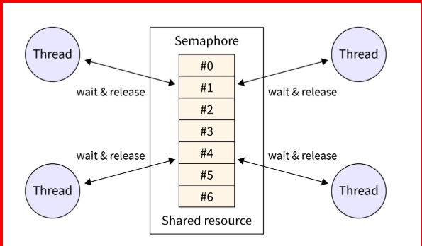   
</p>

+ Semaphore trong Linux là một kỹ thuật được sử dụng để phối hợp và đồng bộ hóa các hoạt động của nhiều tiến trình xử lý cạnh tranh cho cùng một tài nguyên.

+ Semaphore trong Linux về cơ bản là một biến số nguyên được sử dụng để kiểm soát quyền truy cập vào tài nguyên dùng chung trong Linux bởi nhiều tiến trình. Semaphore là các cơ chế điều khiển đơn giản giúp tạo điều kiện thuận lợi cho giao tiếp giữa các tiến trình (IPC) và cho phép các tiến trình phối hợp truy cập vào tài nguyên dùng chung để tránh tình trạng chạy đua và sử dụng tài nguyên quá mức.

+ Vừa được sử dụng để Đồng bộ giữa các thread trong  process vừa được sử dụng để đồng bộ giữa process khác nhau​. Mục đích chính được sử dụng để block process/thread truy cập vào 1 vùng nhớ (shared memory) mà đang được sử dụng bởi một process/thread khác

+ Có 2 loại semaphore được sử dụng dụng chủ yếu
  + System V semaphore (Tạm thời bỏ qua do nó cũ rồi)​
  + POSIX semaphore

+ Posix semaphore có 2 loại:
  + Named semaphores:
    + Là semaphore được đặt tên, được tạo thông qua việc sử dụng hàm sem_open(). Các unrelated-process có thể truy cập tới cùng một semaphore​

  + Unnamed semaphores
    + Là semaphore không được đặt tên, do không có name để sử dụng chung nên để sử dụng nó cần phải truy cập vào các vùng nhớ dùng chung (shared memory, global variable …)​
    + Được sử dụng cho việc chia sẻ truy cập giữa các Process hoặc các Thread.​
    + Đối với các process thì nó là vùng nhớ được shared (sử dụng system shm hoặc POSIX mmap)​
    + Đối với thread là vùng nhớ mà các thread được chia sẻ trong chương trình ví dụ: global hoặc heap.

### 2️⃣ Semaphore Operation
+ Semaphore là một số nguyên được duy trì bởi kernel có giá trị bị hạn chế lớn hơn hoặc bằng 0. ​

+ Semaphore thường được triển khai dưới dạng số nguyên với hai thao tác:
  1. Tăng dần: Thao tác tăng dần được sử dụng để tăng giá trị của một semaphore.
  2. Giảm (chờ hoặc lấy): Thao tác giảm được sử dụng để giảm hoặc giảm giá trị của một semaphore.

+ Trong Linux, một tài nguyên được chỉ định là "khả dụng" khi giá trị của semaphore là dương. Ngược lại, một tài nguyên được chỉ định là "bận" hoặc "bị chặn" khi giá trị của semaphore là âm.

+ Có thể thực hiện nhiều hoạt động khác trên semaphore, bao gồm những điều sau
  + Tăng giá trị hiện tại của semaphore lên 1 dùng sem_post
  + Trừ giá trị hiện tại của semaphore xuống 1 dùng sem_wait().
  + Đọc giá trị hiện tại của semaphore

<p align="center">
  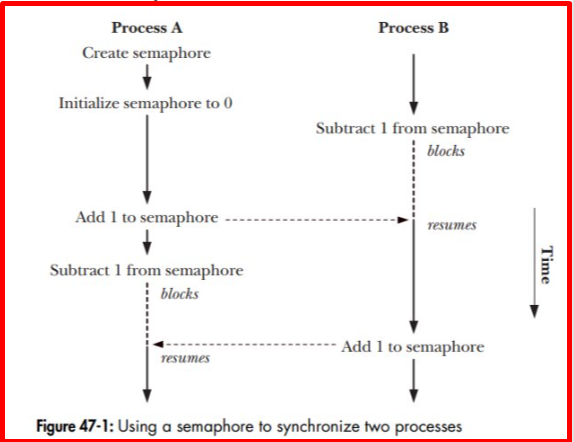   
</p>

***Waiting 1 Semaphore​***
+ Hàm sem_wait () giảm (giảm 1) giá trị của semaphore​

+ Nếu semaphore hiện có giá trị lớn hơn 0, sem_wait () trả về ngay lập tức. ​

+ Nếu giá trị của semaphore hiện là 0, sem_wait () sẽ block cho đến khi giá trị semaphore tăng trên 0.​

+ Sau khi sem_wait() được trả về thì giá trị của semaphore sẽ được giảm đi 1​

+ Hàm sem_trywait() là một phiên bản non-blocking của hàm sem_wait().​

+ Hàm sem_timedwait() Chỉ thực hiện chờ trong một thời gian nhất định, nếu sau timeout mà giá trị semaphore vẫn bằng 0 thì lỗi sẽ được trả về ETIMEDOUT.​

<p align="center">
  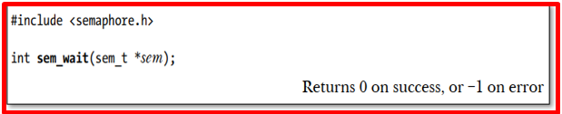   
</p>
<p align="center">
     
</p>
<p align="center">
  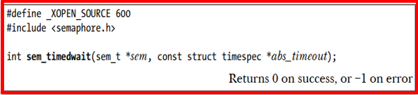   
</p>

***Posting 1 Semaphore​***
+ Hàm sem_post () tăng (tăng 1) giá trị của semaphore.​

+ Nếu giá trị của semaphore bằng 0 thì thực hiện tăng giá trị của semaphore value lên 1. Khi đó các process đang chờ sem_wait() sẽ được đánh thức.​

+ Nếu có nhiều process cùng đang chờ thì kernel sử dụng thuật toán round-robin, time-sharing để quyết đinh chứ ta không control được thứ tự​

+ Tức là không phải process wait trước sẽ được thực hiện trước mà sau khi sem_post() thì process nào là time slot tiếp theo của CPU thì sẽ được thực hiện.​

<p align="center">
     
</p>

***Read Semaphore value​***
+ Hàm sem_getvalue() trả về giá trị hiện tại của semaphore​
+ Giá trị semaphore được trả về trong con trỏ sval.​
<p align="center">
  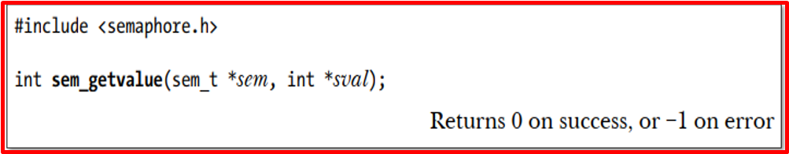   
</p>

### 3️⃣ Named Semaphore​
***Opening named semaphore​***
+ sem_open() được sử dụng để tạo một semaphore mới hoặc mở một semaphore đang tồn tại.​
  + name: tên định danh semaphore. Mỗi tên liên kết với một semaphore object.​
  + oflag: cho biết mode hoạt động của sem_open().​
    + 0: mở một semaphore đang tồn tại.​
    + O_CREAT: tạo một semaphore mới.​
    + O_CREAT và O_EXCL: tạo một semaphore mới và trả về lỗi nếu đã tồn tại semaphore liên kết với tên được đưa ra​
<p align="center">
  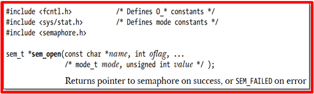   
</p>

+ Nếu O_CREAT được sử dụng thì 2 đối số nữa sẽ được dùng cho sem_open()​
  + mode: giá trị quyền của semaphore được tạo ra, giống như set quyền cho file (ví dụ full quyền r/w 0666).​
  + value: giá trị khởi tạo cho semaphore, là nguyên (>=0). ​
<p align="center">
  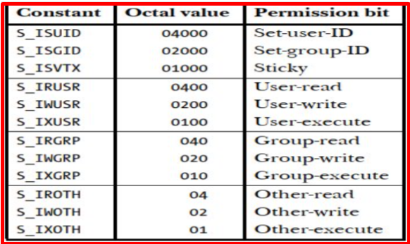   
</p>

***Closing named semaphore​***
+ Khi thực hiện sem_open() thì semaphore sẽ được liên kết với process. Hệ thống sẽ ghi lại mối liên kết này.​

+ sem_close() sẽ thực hiện kết thúc mối liên kết trên. Giải phóng bất kỳ tài nguyên nào mà hệ thống đã liên kết với semaphore cho process và giảm số lượng các process tham chiếu đến semaphore. Tuy nhiên thì nó vẫn tồn tại mà chỉ hủy bỏ sự liên kết đi thôi​

<p align="center">
  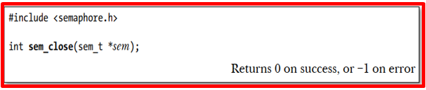   
</p>

***Removing named semaphore​***

+ Hàm sem_unlink () xóa semaphore được xác định bằng name và đánh dấu semaphore sẽ bị hủy sau khi tất cả các process ngừng sử dụng nó.​

+ Tức là semaphore sẽ bị hủy khi tất cả tiến trình sử dụng nó gọi sem_close().​

<p align="center">
  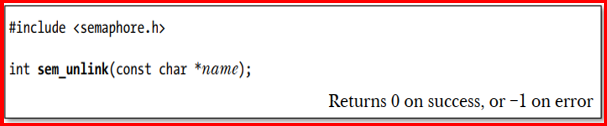   
</p>

### 4️⃣ Unnamed Semaphore​
***Initializing***
+ Hàm sem_init() được sử dụng để khởi tạo semaphore và inform cho kernel semaphore được sử dụng để shared giữa các process hoặc giữa các thread trong một process.​

+ Đối số pshared cho biết liệu semaphore có được chia sẻ giữa các threads hay giữa các process hay không.
  + pshared là 0: thì semaphore sẽ được chia sẻ giữa các thread của process. sem được tạo ra trỏ tới một địa chỉ của heap hoặc global.​
  + pshared khác 0: semaphore được shared giữa các process. sem sẽ là địa chỉ của một vùng nhớ được shared giữa các process (system V hoặc Posix mmap).​
  + value: giá trị semaphore được khởi tạo.​

<p align="center">
  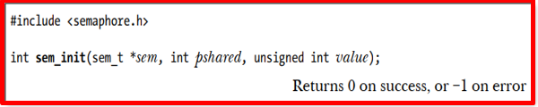   
</p>

***Destroying ***
+ Hàm sem_destroy() hủy semaphore, nó phải là một unnamed semaphore đã được khởi tạo trước đó bằng sem_init(). ​

+ Sau khi một unnamed semaphore đã bị hủy bằng sem_destroy(), nó có thể được khởi động lại bằng sem_init().​

<p align="center">
  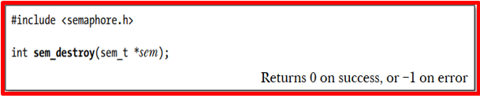   
</p>

### 5️⃣ Example code
***Code named semaphore***
+ Code main.c
```bash
#include <fcntl.h>
#include <stdio.h>
#include <stdlib.h>
#include <errno.h>
#include <string.h>
#include <time.h>
#include <sys/types.h>
#include <sys/stat.h>
#include <semaphore.h>


#define     POSIX_SEM_NAMED       "/named_hula"
#define     R_W_PERM               0666
#define     SEM_WAITING_TIMEOUT         10000
#define     MSECS_IN_SEC                1000

int main(int argc, char *argv[])
{   
    char c;
    int ret = -1;
    int current_value;
    sem_t *sem;
    struct timespec timeout;

    sem = sem_open(POSIX_SEM_NAMED, O_CREAT|O_EXCL, R_W_PERM, 1);
    if (sem == SEM_FAILED) {
        if (errno != EEXIST) {
            printf("Failed to open semaphore error: %s\n", strerror(errno));
            return -1;
        }

        printf("%s, Reading available semaphore.\n", argv[0] );
        sem = sem_open(POSIX_SEM_NAMED, 0);
        if (sem == SEM_FAILED) {
            printf("Failed to open semaphore error: %s\n", strerror(errno));
            return -1;
        }
    }

    /* Get current semaphore */
    sem_getvalue(sem, &current_value);
    printf("Current semaphore value =%d.\n", current_value);

    /* Locking with timeout */
    if (clock_gettime(CLOCK_REALTIME, &timeout) == -1)
    {
        printf("Failed to get current time error: %s\n", strerror(errno));
        return -1;
    }
    
    timeout.tv_sec += SEM_WAITING_TIMEOUT / MSECS_IN_SEC;
    ret = sem_timedwait(sem, &timeout);
    if (ret == -1)
    {
        printf("Failed to wait semaphore error: %s\n", strerror(errno));
        return -1;
    }

    /* Get current semaphore */
    sem_getvalue(sem, &current_value);
    printf("Current semaphore value =%d.\n", current_value);

    /* Get any character to go next */
    printf("%s, Please type any character: ", argv[0]);
    c = getchar();

    ret = sem_post(sem);
    if (ret == -1)
    {
        printf("Failed to release semaphore error: %s\n", strerror(errno));
        return -1;
    }

    /* Get current semaphore */
    sem_getvalue(sem, &current_value);
    printf("Current semaphore value =%d.\n", current_value);

    ret = sem_close(sem);
    if (ret == -1)
    {
        printf("%s, Failed to close semaphore error: %s\n", argv[0], strerror(errno));
        return -1;
    }

    sem_unlink(&sem);

    return ret;
}
```

+ Makefile
```bash
.PHONY: all clean

CC := gcc

all:
	$(CC) -o out main.c -lpthread 

clean:
	rm -rf  out 
```

***BÀI TOÁN producer-consumer Sử dụng semaphore ***
+ Link các bài toán khác: https://www.studytonight.com/operating-system/classical-synchronization-problems

+ Semaphore mà cứ cộng 1 rồi về 0 thì nó như mutex, và dùng mutex này để thằng nào cầm kghoas này thì thằng đó được quyền làm việc

+ 1 semaphore full, 1 empty

+ khi thằng empty về 0 là trống rồi, còn nếu full là 10 thì đang đầy

+ Code main.c
```bash
#include <stdlib.h>     
#include <sys/mman.h>   // mmap()
#include <stdio.h>      // io stuff
#include <unistd.h>     // sleep()
#include <semaphore.h>  // semaphore()
#include <time.h>       // time()


#define BUFFER_SIZE 10

typedef struct Buffer{
    char **Tuples;
    int inSlotIndex;
    int outSlotIndex;
} Buffer;

int main()
{
    /* Create shared memory */
    int *buffer = (char*)mmap(NULL, sizeof(int)*BUFFER_SIZE, PROT_READ | PROT_WRITE, MAP_SHARED | MAP_ANONYMOUS, -1, 0);

    /* Create shared semaphores */
    sem_t *mutex = (sem_t*)mmap(NULL, sizeof(sem_t*), PROT_READ | PROT_WRITE, MAP_SHARED | MAP_ANONYMOUS, -1, 0);
    sem_t *full = (sem_t*)mmap(NULL, sizeof(sem_t*), PROT_READ | PROT_WRITE, MAP_SHARED | MAP_ANONYMOUS, -1, 0);
    sem_t *empty = (sem_t*)mmap(NULL, sizeof(sem_t*), PROT_READ | PROT_WRITE, MAP_SHARED | MAP_ANONYMOUS, -1, 0);

    sem_init(mutex, 1, 1);
    sem_init(empty, 1, BUFFER_SIZE);
    sem_init(full, 1, 0);

    /* Forking */
    pid_t producer;
    pid_t consumer;

    /* Child producer process */
    if((producer = fork()) == 0)
    {
        while(1)
        {
            sem_wait(empty);

            sem_wait(mutex);
           
            printf("Producer creates something\n");
            sem_post(full);

            sem_post(mutex);

            /* Sleep between 0 and 5 seconds */
            srand(time(NULL));
            sleep(rand()% 5);
        }
    }

    /* Child consumer process */
    if((consumer = fork()) == 0)
    {
        while(1)
        {
            sem_wait(full);

            sem_wait(mutex);
            printf("Consumer takes something\n");
            sem_post(mutex);

            sem_post(empty);

            /* Sleep between 3 and 8 seconds */
            srand(time(NULL));
            sleep(3 + rand()% 5);
        }
    }
    /* Parent */
    else
    {
        while(1)
        {
            sleep(10);
            int takenSlots;
            sem_getvalue(full, &takenSlots);
            printf("Items in the buffer: %d/%d\n", takenSlots, BUFFER_SIZE);
        }
    }
}
```

+ Code makefile
```bash
.PHONY: all clean

CC := gcc

all:
	$(CC) -o out main.c -lpthread 

clean:
	rm -rf  out
```

## ✔️ Conclusion
+ Semaphores trong Linux là một cách để kiểm soát quyền truy cập vào tài nguyên được chia sẻ bởi nhiều tiến trình. Chúng là những cơ chế điều khiển đơn giản hỗ trợ Giao tiếp giữa các tiến trình.

+ Về mặt lý thuyết, chúng có hai loại: semaphore nhị phân có thể có giá trị 0 và 1 và semaphore đếm có thể có giá trị lớn hơn 1 và được sử dụng để kiểm soát nhiều tài nguyên.

+ Trong Linux, semaphor có hai loại: semaphor IPC System V cũ và semaphor có tên POSIX hiện đại.

+ Chúng ta sử dụng các hàm như semget() để mở semaphore trong semaphore System V và sem_open() để mở semaphore trong semaphore có tên POSIX.

Ở bài này chúng ta đã biết về Semaphore. Tiếp theo chúng ta cùng đi tìm hiểu về Debug code nhé.

## 💯 Exercise
+ Tạo 3 thread trong 1 process. 
  + Thread A, ghi vào file text.txt với nội dung A-message
  + Thread B, ghi vào file text.txt với nội dung B-message
  + Thread C, đọc file text.txt nếu là A-message thì print ra hello A, và nội dung mesage, tương tự với B.
***Yêu cầu sử dụng semaphore để tại 1 thời điểm chỉ 1 thread ghi hoặc đọc file text.txt***

## 📺 NOTE

+ Xem video sau để trực quan hơn nhé : [Video Youtube](https://www.youtube.com/watch?v=exYlvDWjZzM)

## 📌 Reference

[1] Professional Linux Kernel Development 3rd.pdf

[2] https://man7.org/linux/man-pages/man7/sem_overview.7.html

[3] https://linux.die.net/man/7/sem_overview

[4] https://www.scaler.com/topics/semaphore-in-linux/

[5] https://www.studytonight.com/operating-system/classical-synchronization-problems