# 💚 Debug Code 💛

## 👉 Introduction and Summary

### 1️⃣ Introduction

+ Ở bài trước chúng ta đã biết về Semaphore và cách hoạt động của nó trong linux. Nếu các bạn chưa đọc thì xem link này nha [013_IPC_Semaphore.md](../013_IPC_Semaphore/013_IPC_Semaphore.md). Ở bài này chúng ta sẽ tìm hiểu về debug code trong linux.

### 2️⃣ Summary

Nội dung của bài viết gồm có những phần sau nhé 📢📢📢:
- [I. Introduction and Summary](#👉-introduction-and-summary)

    - [1. Introduction](#1️⃣-introduction)
    - [2. Summary](#2️⃣-summary)
- [II. Contents](#👉-contents)
    - [1. GDB​](#1️⃣-gdb)
    - [2. Valgrind](#2️⃣-valgrind)
    - [3. Strace​](#3️⃣-strace​)
    - [4. Printk](#4️⃣-printk)
- [III. Conclusion](#✔️-conclusion)
- [IV. Exercise](#💯-exercise)
- [V. NOTE](#📺-note)
- [VI. Reference](#📌-reference)

## 👉 Contents
### 1️⃣ GDB

+ Ta có đoạn code sau:
```bash
#include <stdio.h>

void sum(int i)
{
    printf("Hello: %d \n",i);
}

int main()
{
  printf("Start Hello GDB\n");
  for(int i= 1;i<=10;i++)
  {
      sum(i);
  }
  return 1;
}
```
***Install***
+ Đầu tiên ta đi install GDB
> sudo apt install gdb

***Cách chạy***
+ Biên dịch ra file thực thi (app)​
+ gdb ./app
+ bấm run để chạy​
+ muốn chạy lại thì gõ : file ./app
+ bấm q để thoát​

***Đặt break point(có thể đặt theo dòng hoặc đặt theo tên hàm)​***
+ gcc –g –o app main.c
+ gdb
+ file ./app​
+ break 12  : đặt break point ở dòng 12​
+ run

***NOTE Thêm***
+ Để chạy câu lệnh tiếp theo thì : next​
+ Muốn nhảy vào hàm thì :step
+ Bỏ qua break point thì : continue​
+ Muốn hiện giá trị của biến nào ra thì : display i  (i là biến)​
+ Muốn in biến hay con trỏ ra thì : print &i​
+ In kiểu dữ liệu : ptype i​
+ set giá trị cho i: set variable i = 100​


***GDB fix lỗi segmentation fault, core dumped***
+ Ta có đoạn code sau
```bash
#include <stdio.h>
void sum()
{
    int *p = NULL;
    printf("ThoNV : %d\n", *p);
}
int main()
{
    printf("Start Hello Core dump\n");
    sum();
    return 1;
}
```
+ Khi chạy thì gây ra lỗi Segmentation fault như bên dưới, nhưng mình không biết bị lỗi ở line nào
<p align="center">
  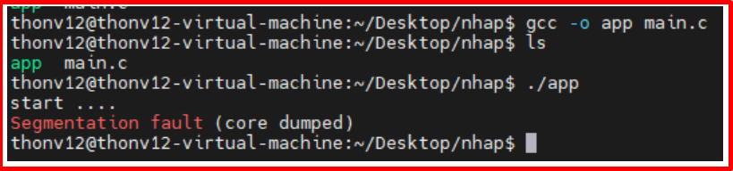   
</p>

+ Lỗi truy cập vùng nhớ không hợp lệ do:​
  + Một là đọc ghi ngoài mảng (tính sai chỉ số mảng hay sai cận)​
  + Liên quan đến con trỏ (viết sai, dùng con trỏ chưa khởi tạo, double-free, đọc ghi những chỗ đã free() rồi) ​
  + Ghi lên const (như literal string)​
  + Lỗi sử dụng tham biến (như scanf) như bị dư tham số (vẫn là scanf/printf).​

+ Để fix được lỗi này, và xem lỗi chỗ nào​ ta làm như sau:
1. Đầu tiên khi chạy cái ./app nó sẽ sinh ra 1 file core, để có file core này thì ta phải set cái ulimit 
  + Ban đầu nếu ta chưa cấu hình gì thì khi gõ ulimit -c nó  sẽ ra 0​
  + ulimit -c unlimited : set nó mới có file core
  + cat /proc/sys/kernel/core_uses_pid : ra 0​
  + sudo su​
  + sudo echo "1" > /proc/sys/kernel/core_uses_pid
  + echo "/tmp/corefiles/core" > /proc/sys/kernel/core_pattern: Thay đổi đường dẫn lưu core file
  + cat /proc/sys/kernel/core_pattern : để xem đường dẫn core file​
  + exit

​<p align="center">
  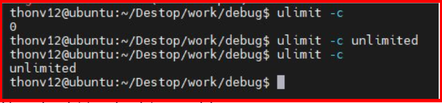   
</p>

2. Sau đó mình biên dịch lại : gcc -g -o app main.c​
  + mkdir /tmp/corefiles
  + ./app sau đó ls /tmp/core... sẽ ra cái file
  + Chạy  gdb ./app  /tmp/corefiles/core.187078

​<p align="center">
  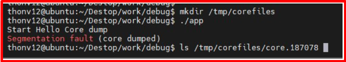   
</p>
​<p align="center">
  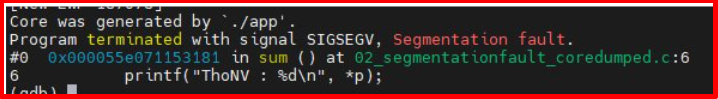   
</p>

+ Sau đó bấm backtrace nó sẽ chạy từ cuối chương trình tới đầu chương trình
+ Chạy hàm main rồi chạy hàm sum​
​<p align="center">
  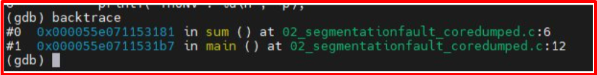   
</p>

### 2️⃣ Valgrind
+ Ta có đoạn code sau: Ta khởi tạo mà không free đi​
```bash
#include<stdio.h>
#include<stdlib.h>
int main(int argc, char* argv[])
{
  char *mem1 = NULL;
  char *mem2 = NULL;

  mem1 = (char*)malloc(sizeof(char) * 16);
  mem2 = (char*)malloc(sizeof(char) * 16);

  printf("checking memory leak using valgrind tool\n");

  free(mem1);
  //free(mem2);

  return 0;
}
```
+ Dùng để check lỗi về bộ nhớ như memory leak​
  + Memory chưa được khởi tạo​
  + Đọc/ghi memory sau khi nó đã được free​
  + Đọc/ghi ra phần cuối của khối malloc​
  + Đọc/ghi các vùng không thích hợp trên stack​
  + Memory leaks -- nơi các con trỏ đến các khối malloc đã bị mất vĩnh viễn​
  + Không đồng nhất trong việc sử dụng malloc/new/new [] và free/delete/delete []​
  + Dùng chồng chéo con trỏ ở src và dst trong memcpy () và các hàm liên quan​

***Install***
> sudo apt install valgrind

***Cách chạy***
+ gcc –o app main.c
+ valgrind --leak-check=yes ./app

​<p align="center">
     
</p>

+ Khi này thì ta thấy ta bị mất 4 byte , tuy nhiên ta chưa biết là bị lỗi ở dòng nào​
+ Khi này ta cần build lại và thêm option : gcc –o app 03_memoryleak.c –Wall –ggdb3
+ Sau đó ta chạy lại : Valgrind --leak-check=yes ./app  thì ra lỗi ở dòng
+ Như ảnh dưới thì thấy lỗi ở dòng 9 trong hàm main​

​<p align="center">
  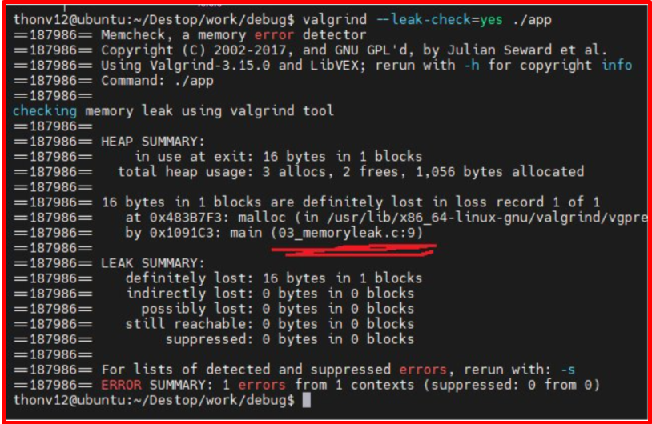   
</p>

### 3️⃣ Strace

+ Strace = Strack trace
+ Ta có đoạn code sau: Khi ta ghi vào file thì con trỏ leeksek đang ở cuối file, nên lúc đọc file ra sẽ không đọc được gì cả. nếu không có kiến thức về file thì rất khó phát hiện. Nên ta dùng strace để xem tường bước chạy code thì chương trình làm gì
```bash
#include <stdio.h>
#include <stdlib.h>
#include <string.h>
#include <fcntl.h>
#include <unistd.h>

int main()
{
  int8_t buffer_read[1024];
  int8_t buffer_write[1024]="Hello ThoNV\n";

  int fd = open("text.txt", O_RDWR | O_CREAT);

  if(fd<0)
  {
      printf("Cannot open file\n");
      return 1;
  }

  write(fd, buffer_write, strlen(buffer_write)+1);
  read(fd,buffer_read, 1024);
  printf("Data : %s\n", buffer_read);
  close(fd);
  return 1;
}
```

***Install***
> sudo apt install strace

***Cách chạy***
+ gcc –o app main.c
+ strace ./app

***Cách sửa lại***
+ Sử dụng hàm:  pread(fd, write_buf, strlen(write_buf)+1, 0)  thêm thông số 0 cuối là dưa con trỏ file về vị trí đầu tiên

***NOTE Thêm***
+ Trace linux command system call​:
  + strace ls –l

+ Trace process PID
  + sudo strace –p 1234

+ Redirect Trace Output to file​
  + sudo strace –o debug.txt ls -l​

### 4️⃣ Printk

​<p align="center">
  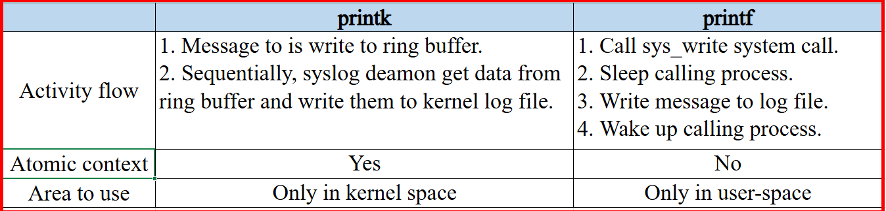   
</p>

+ Sử dụng giống hệt printf​
​<p align="center">
  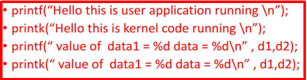   
</p>

​<p align="center">
  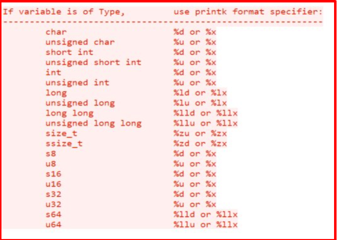   
</p>

+ Mức độ log
  + printk(KERN_INFO "Message: %s\n", arg);

​<p align="center">
  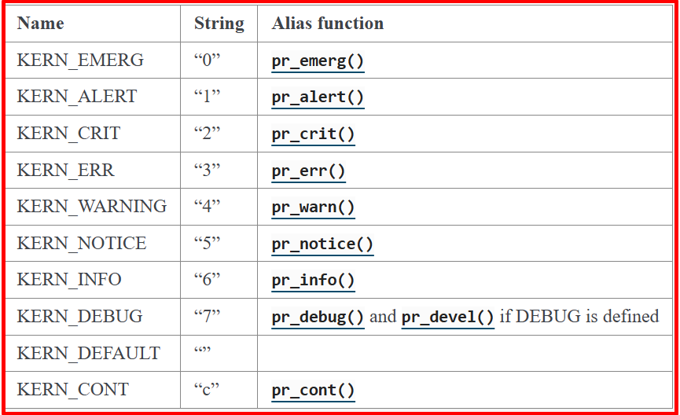   
</p>

​<p align="center">
  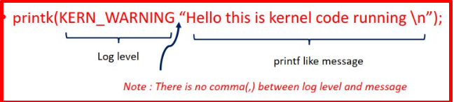   
</p>

+ Kernel logger system architecture​
  + Log level: Define the priority of this log. Kernel only print the log has priority higher than default value.​
  + Ring buffer: Printk() doesn’t directly write log to file, it write log to this buffer instead. So printk is atomic function.​
  + Syslog deamon: Because ring buffer stay in ram, so it will lose after power off. To resolve this issue, kernel has syslogd deamon, sequentially it flush ring buffer to file.​
  + Default log level: printk function only write log to ring buffer if this log has level higher than default log level. Default log level is depend on user, we can change it via dmesg command.​

​<p align="center">
  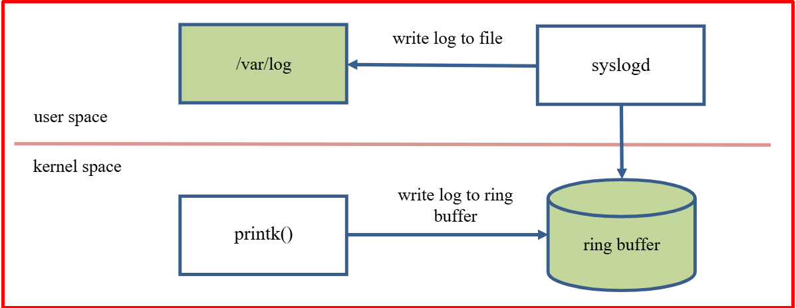   
</p>

## ✔️ Conclusion
+ gdb: giúp đọc break point, next từng dòng, check lỗi  segmentation fault, core dumped​
+ valgrind: kiểm tra tràn memory leak​
+ strace: chương trình bị chết đột ngột, xem qua trình chương trình chạy
+ printk: In log dưới kernel

Ở bài này chúng ta đã biết về debug code. Tiếp theo chúng ta cùng đi tìm hiểu về Uboot và thực hành nó trên board mạch IMX8MM nhé.

## 💯 Exercise
N/A

## 📺 NOTE

+ Xem video sau để trực quan hơn nhé : [Video Youtube](https://www.youtube.com/watch?v=8KcZS_9Ica0)

## 📌 Reference

[1] https://man7.org/linux/man-pages/man1/gdb.1.html

[2] https://funix.edu.vn/chia-se-kien-thuc/gdb-gnu-debugger-tren-linux/

[3] https://linux.die.net/man/1/gdb

[4] https://www.kernel.org/doc/html/latest/core-api/printk-formats.html

[5] https://docs.kernel.org/core-api/printk-basics.html