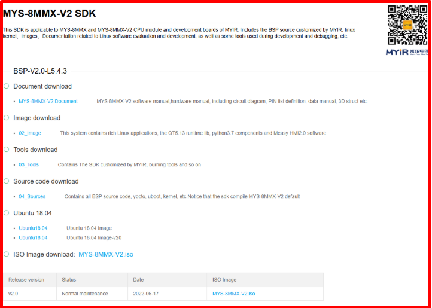
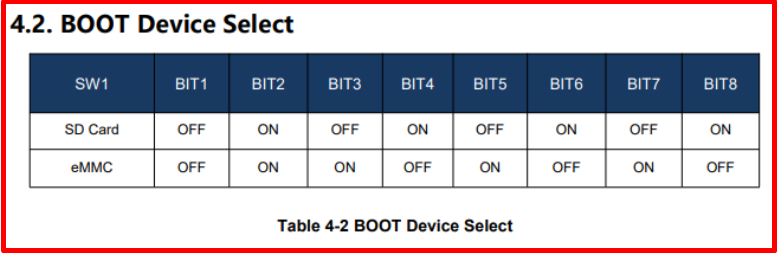

# 💚 Giới thiệu về board Myir IMX8MM V2 💛

## 👉 Introduction and Summary

### 1️⃣ Introduction

+ Ở bài trước chúng ta đã biết về Debug_Code và cách hoạt động của nó trong linux. Nếu các bạn chưa đọc thì xem link này nha [014_Debug_Code.md](../014_Debug_Code/014_Debug_Code.md). Ở bài này chúng ta sẽ tìm hiểu về board Myir IMX8MM V2 nhé.

### 2️⃣ Summary

Nội dung của bài viết gồm có những phần sau nhé 📢📢📢:
- [I. Introduction and Summary](#👉-introduction-and-summary)

    - [1. Introduction](#1️⃣-introduction)
    - [2. Summary](#2️⃣-summary)
- [II. Contents](#👉-contents)
    - [1. Myir Imx8mm](#1️⃣-myir-imx8mm)
    - [1. Insert .wic file vào thẻ nhớ SD](#2️⃣-insert-wic-file-vào-thẻ-nhớ-sd)
- [III. Conclusion](#✔️-conclusion)
- [IV. Exercise](#💯-exercise)
- [V. NOTE](#📺-note)
- [VI. Reference](#📌-reference)

## 👉 Contents

### 1️⃣ Myir Imx8mm

+ IMX8M mini là chip của bên NXP, tuy nhiên bên MYIR đã tạo ra 1 board custom dựa trên các tính năng của chip imx8mm. Từ đó ta có board MYIR IMX8MM.

+ Mọi document các bạn có thể tải về ở đây pass là myirdd: [LINK](https://bj11916.apps.aliyunfile.com/disk/s/Px3kwNVksNp) 

+ Ngoài ra các bạn có thể tải thêm docs ở đường dẫn này: [LINK](https://d.myirtech.com/MYS-8MMX/)

+ Vì là chip của nxp nên các bạn có thể tham khảo repo của nxp cho chip ở link sau: [LINK](https://github.com/nxp-imx)

+ Vì board là board custom do bên Myir nên các bạn nên follow theo Myir để chạy mọi thứ cho map được với board nhé. Link repo của Myir cung cấp ở đây: [LINK](https://github.com/MYiR-Dev)

​<p align="center">
     
</p>

+ Chú ý: Chip IMX8MM hỗ trợ 2 loại RAM là ddr4 và lpddr4, tuy nhiên board custom này chỉ hỗ trợ RAM là ddr4 nên mọi người chú ý cái này nhé.

+ Chúng ta sẽ chủ yếu follow theo docs này mà MYIR cung cấp nhé: 01-Documents/MYIR_Manual/English/MYS-8MMX-V2 Product Manual-V2.0.pdf

+ Khi này ta kéo tới mục 4.2 của docs MYS-8MMX-V2 Product Manual-V2.0.pdf ta sẽ thấy cách gạt các switch để lựa chọn boot device

​<p align="center">
     
</p>

### 2️⃣ Insert wic file vào thẻ nhớ SD
+ Ta kéo tới mục 4.3.2 của file MYS-8MMX-V2 Product Manual-V2.0.pdf, ta sẽ thấy hướng dẫn cách insert file .wic vào thử SD card

```bash
$ bunzip2 -dk -f myir-image-full-mys-8mmx.wic.bz2
$ sudo dd if=myir-image-full-mys-8mmx.wic of=/dev/sdb bs=1M && sync
$ source toolchain/environment-setup-aarch64-poky-linux
```

## ✔️ Conclusion
Ở bài này chúng ta đã biết cách lấy tài liệu của board do myir cung cấp cũng như cách insert file .wic vào thẻ nhớ để có thể boot được board. Tiếp theo chúng ta cùng đi tìm hiểu về Uboot và thực hành nó trên board mạch IMX8MM nhé.

## 💯 Exercise
N/A

## 📺 NOTE

+ Xem video sau về build yocto cho board myir imx8mm nhé : [Video Youtube](https://www.youtube.com/watch?v=VC0RBb2W9H0)

## 📌 Reference

[1] https://bj11916.apps.aliyunfile.com/disk/s/Px3kwNVksNp

[2] https://github.com/nxp-imx

[3] https://github.com/MYiR-Dev