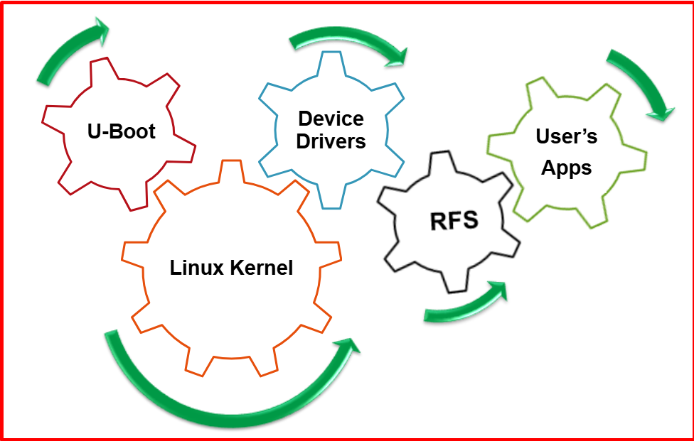
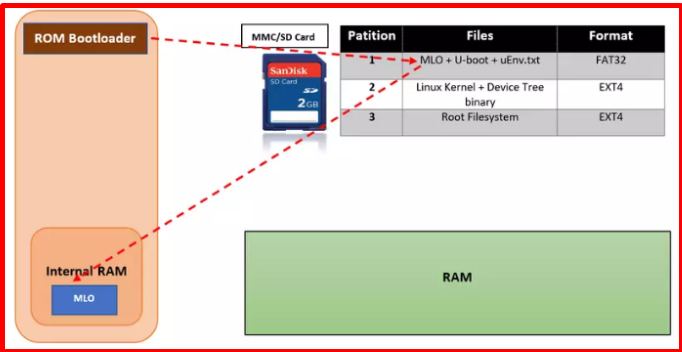
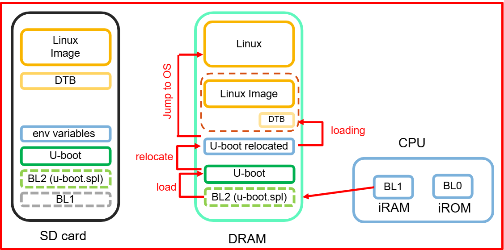
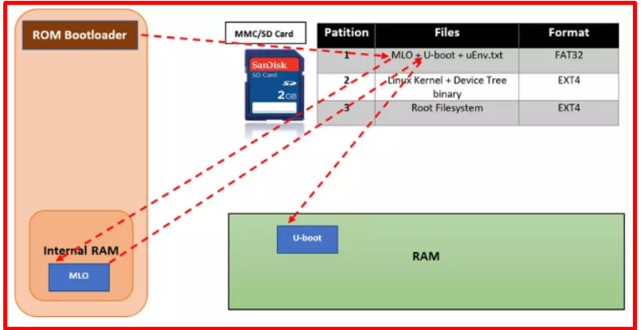
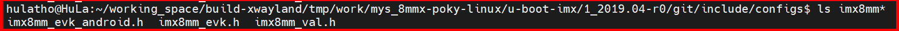
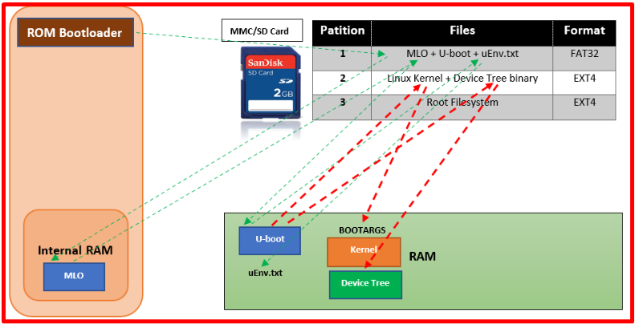

# 💚 Uboot 💛

## 👉 Introduction and Summary

### 1️⃣ Introduction

+ Ở bài trước chúng ta đã biết sơ lược về board myir imx8mm. Nếu các bạn chưa đọc thì xem link này nha [015_Board_Myir_Imx8mm.md](../015_Board_Myir_Imx8mm/015_Board_Myir_Imx8mm.md). Ở bài này chúng ta sẽ tìm hiểu về Uboot nhé.

### 2️⃣ Summary

Nội dung của bài viết gồm có những phần sau nhé 📢📢📢:
- [I. Introduction and Summary](#👉-introduction-and-summary)

    - [1. Introduction](#1️⃣-introduction)
    - [2. Summary](#2️⃣-summary)
- [II. Contents](#👉-contents)
    - [1. Uboot Overview](#1️⃣-uboot-overview)
    - [2. Boot Sequence](#2️⃣-boot-sequence)
- [III. Conclusion](#✔️-conclusion)
- [IV. Exercise](#💯-exercise)
- [V. NOTE](#📺-note)
- [VI. Reference](#📌-reference)

## 👉 Contents

### 1️⃣ Uboot Overview

​

     

​

     

+ Sau khi bật nguồn hoặc reset, hệ thống ở trạng thái rất tối thiểu. Bộ điều khiển DRAM chưa được thiết lập, do đó không thể truy cập bộ nhớ chính.

+ Tương tự, các giao diện khác chưa được cấu hình, do đó bộ nhớ được truy cập thông qua bộ điều khiển flash NAND, bộ điều khiển MMC, v.v. đều không khả dụng.

+ Các tài nguyên duy nhất hoạt động lúc đầu là lõi CPU, một số bộ nhớ tĩnh trên chip và ROM khởi động.

+ Chức năng chính của Uboot là khởi tạo phần cứng ở mức cơ bản và load các thành phần khác của OS (linux kernel, rootfs, device tree) lên RAM và trao quyền lại cho linux kernel.
    + Initialize all the low-level hardware details
    + Prepare the setup before chain loading any OS
    + Download and Check and OS binaries
    + Load an Operating System/runtime environment for the platform after self-tests
    + Jump to OS entry-point

+ Quá trình khởi động của một hệ thống nhúng có thể chia ra thành nhiều giai đoạn:

    + ROM code: Mã khởi động được ghi bởi nhà sản xuất, người dùng không thể thay đổi. Chức năng chính là setup hệ thống để load SPL vào Internal RAM

    + SPL: Chương trình tải phụ. Khởi tạo các thành phần cần thiết và load u-boot vào RAM

    + U-Boot: Load các thành phần của OS (Kernel, device tree, rootfs) vào RAM, truyền kernel parameters vào trao quyền điều khiển cho kernel.

    + Linux Kernel: Mount hệ thống file system (Roofs) và chạy tiến trình Init.
      
### 2️⃣ Boot Sequence

​

     

+ Boot Rom 
    + Khi hệ thống khởi động lần đầu tiên, hoặc reset thì quyền kiểm soát hệ thống sẽ thuộc về reset vector

    + Reset vector: nó là một đoạn mã assembly được ghi trước bởi nhà sản xuất chip (Manufaturer).

    + Sau đó reset vector sẽ trỏ tới địa chỉ vùng nhớ chứa các đoạn code khởi động đầu tiên, cụ thể là boot rom

        + Boot rom được nạp vào chip khi sản xuất, do đó code ROM là độc quyền và không thể thay thế bằng open source code tương đương.

        + Thông thường, ROM code không bao gồm code để initialize the memory controller, vì cấu hình DRAM rất cụ thể cho từng thiết bị, do đó nó chỉ có thể sử dụng Static Random Access Memory (SRAM), vốn không yêu cầu memory controller.

        + Trong SoC, khi SRAM không đủ lớn để load a full bootloader như U-Boot, cần phải có một bộ nạp trung gian gọi là Secondary Program Loader (SPL).

        + ROM code loads SPL tới SRAM

    + Nếu không có reset vector thì bộ xử lý sẽ không biết nên thực thi bắt đầu từ đâu.

    + Chức năng chính của boot rom chính là sao chép nội dung trong file "MLO" (còn được gọi là Second Program Loader (SPL)) vào RAM và excute nó.

    + Do bộ nhớ của boot rom khá nhỏ nên rom code cũng được giới hạn ở việc khởi tạo một số phần cứng cần thiết cho việc load SPL lên hệ thống như: MMC/eMMC, SDcard, NAND flash. Các phần cứng này được gọi chung là boot device.

    + Rom code lựa chọn boot device (load từ thẻ nhớ, flash vv..) phụ thuộc vào việc cấu các pin thông qua switch/jump trên phần cứng.

    + Tóm lại: Rom code is First code execute after reset, Located in a ROM on the SoC, Controls initial phase of boot process, Low level initialization, Performs different boot modes based on strap pins(RCONS settings) / fuses

    ​

         
    

    ​

         
    

    + Program Image - BootRom
        + IVT (Image Vector Table) Header: Là danh sách các con trỏ nằm tại một địa chỉ cố định mà ROM kiểm tra để xác định vị trí của các thành phần khác của Program Image như Entry Point (fixed offset), IVT Length, Version, Points to DCD table. 

        + Địa chỉ IVT thường nằm tại 0x1000 trong bộ nhớ QSPI Flash hoặc SD Card - nơi ROM bootloader sẽ tìm kiếm khi khởi động

        + DCD Table(Device Configuration Data): List of init commands

        + Boot Data: Bảng cho biết Program Image Location và kích thước của Program Image tính bằng byte

        + Secure CallBack Image: Địa chỉ tuyệt đối của Secure Callback Image. Được sử dụng để (authentication)xác thực Image.

    ​

         
    

+ SPL - Second Program Loader:
  + Đối với bbb là file MLO còn đối với Myir IMX8MM là A-TF (Arm Trusted Firmware)
  + Được store ở trong SD/eMMC, FLASH (NAND, NOR, HyperFlash)​
  + Low level initializations continued​
  + Đủ nhỏ để chạy từ internal RAM​ và có thể được updated
  + Cấu hình hoặc tương tác người dùng rất hạn chế, chủ yếu dùng để set-up boot process cho giai đoạn bootloader tiếp theo
  + Ngoài ra nó còn làm điều sau:
      + SPL phải thiết lập memory controller và các thành phần thiết yếu khác của system để chuẩn bị loading Tertiary Program Loader (TPL - Uboot) vào DRAM.
      + Chức năng của SPL bị giới hạn bởi kích thước của SRAM
      + Ở cuối giai đoạn SPL này thì TPL-Uboot sẽ có mặt trong DRAM

  

       
  

  + ARM Trusted Firmware Architecture
    + BL32 is OS OpTee
    + Optee: Giải mã cho các thằng có secure 
    + Arm trusted firmware: Chạy song song với linux mà không chết đi
    + Linux giao tiếp với BL31 qua PSCI và shared memory

    

         
    

    + Nhiệm vụ chính của SPL đó chính là tiếp tục setup các thành phần cần thiết như DRAM controler, eMMC vv.. Sau đó load U-boot tới địa chỉ ***CONFIG_SYS_TEXT_BASE*** của RAM.

    + Chức năng chính của SPL là để load được U-boot lên RAM.

    

         
    

+ U-Boot:

  + Giới thiệu uboot:
    + Open source firmware for hardware platforms​
    + Portable và dễ dàng debug (serial console output)
    + Hỗ trợ nhiều kiến ​​trúc: PPC, ARM, ARM64, MIPS, x86, m68k, NIOS, Microblaze, RISC-V
    + Được viết bằng ngôn ngữ c và assembly
    + Có thể khởi động nhiều hệ điều hành khác nhau: Linux, QNX, RTEMS, LynxOS, FreeBSD, NetBSD, VxWorks, WinCE

  + Thời điểm U-boot:
    + Tại thời điểm này, ta đang chạy một bộ nạp khởi động đầy đủ, đó chính là U-boot
    + Thông thường, có một command-line đơn giản cho phép ta thực hiện các tác vụ bảo trì, chẳng hạn như loading new boot and kernel images into flash storage, cũng như loading and booting a kernel

  + Công dụng:
    + Đưa board về trạng thái stable sau khi reset
    + Loads OS image onto board and starts OS​
    + Docs support: https://docs.u-boot.org/en/latest/

  + Important command on Uboot​
    + Help: print online help​
    + printenv: Shows all variables​
    + printenv variable-name: Shows the value of a variable​
    + setenv variable-name variable-value: Changes the value of a variable or defines a new one, only in RAM
    + editenv variable-name: Edits the value of a variable in-place, only in RAM
    + saveenv: Lưu trạng thái hiện tại của môi trường vào bộ nhớ để duy trì
    + tftp: loads a file from the network to RAM
    + ping: to test the network​
    + bootd: (có thể viết tắt là boot), chạy lệnh default boot command, được lưu trữ trong environment variable bootcmd
    + bootz address: Starts a compressed kernel image loaded at the given address in RAM​
    + usb: để khởi tạo và điều khiển hệ thống con USB, chủ yếu được sử dụng cho các thiết bị lưu trữ USB như ổ cứng USB.
    + mmc: to initialize and control the MMC subsystem, used for SD and microSD cards

  + Summary
    + RomBoot: tries to find a valid SPL from various storage sources, and load it into SRAM
    + SPL: runs from SRAM. Initializes the DRAM, the NAND or SPI controller, and loads the secondary bootloader into DRAM and starts it. No user interaction possible
    + U-Boot: runs from DRAM. Initializes some other hardware devices (network, USB, etc.). Loads the kernel image from storage or network to DRAM and starts it. Shell with commands provided.​
    + Linux Kernel: runs from DRAM. Takes over the system completely (the bootloader no longer exists).

    

         
    

    

         
    

    + Board configuration defines trong IMX8MM Yocto

    

         
    

    + Board Kconfig configuration ​trong IMX8MM Yocto

    

         
    

    + U-Boot command  

    

         
    

    + Sau khi được load vào RAM, u-boot sẽ thực hiện việc relocation. Di dời đến địa chỉ relocaddr của RAM (Thường là địa chỉ cuối của RAM) và nhảy đến mã của u-boot sau khi di dời.

    + Lúc này u-boot sẽ kiểm tra xem file uEnv.txt(Ở board BBB) có tồn tại hay không. Nếu có thực hiện load nó vào RAM ở bước tiếp theo

    + Bản thân uEnv.txt là một bootscript, nó định nghĩa các tham số cấu hình, kernel parameters. Các tham số này mặc định đã được cấu hình trong u-boot. Tuy nhiên chúng ta có thể thêm, sửa, xóa các cấu hình này thông qua file uEnv.txt. Việc load uEnv.txt là một sự tùy chọn (Optional), nghĩa là nó có thể có hoặc không. (Đối với BBB)

    

         
    

    + Tiếp theo u-boot sẽ tiếp tục load kernel, device tree vào RAM tại các địa chỉ mà đã được cấu hình từ trước ở trong mã nguồn u-boot hoặc trong file uEnv.txt. Sau cùng nó sẽ truyền toàn bộ kernel parameters và nhường quyền thực thi lại cho kernel.

    

         
    

+ Kernel:
  + Sau khi nhận được quyền kiểm soát và các kernel parameters từ u-boot. Kernel sẽ thực hiện mount hệ thống file system (Rootfs) và cho chạy tiến trình Init trên RAM. Đây là tiến trình được chạy đầu tiên khi hệ thống khởi động thành công và chạy cho tới khi hệ thống kết thúc. Tiến trình Init sẽ khởi tạo toàn bộ các tiến trình con khác trên user space, các applications tương tác trực tiếp với người dùng. Lúc này, hệ thống của chúng ta đã hoàn toàn sẵn sàng cho việc sử dụng.

  

       
  

+ Tại sao phải thực hiện Relocation?
  + Ở các giai đoạn trước của u-boot (ROM code or SPL). Chúng sẽ tải u-boot lên RAM mà không hề biết trước kế hoạch cho các vùng nhớ mà u-boot có thể tải lên là: bản thân u-boot, kernel-image, device tree, rootfs vv..

  + Nó đơn giản load u-boot lên RAM ở một địa chỉ thấp. Sau đó khi u-boot thực hiện một số khởi tạo cơ bản và phát hiện hiện tại nó không nằm ở vị trí được lập kế hoạch, chức năng relocation di chuyển u-boot đến vị trí đã lên kế hoạch và nhảy tới nó.

  + Bản chất việc relocation là để đảm bảo cho u-boot, kernel-image, device tree, rootfs vv.. khi load lên RAM sẽ không bị ghi đè lên nhau. Mà được load vào một vị trí tính toán từ trước.

## ✔️ Conclusion
Ở bài này chúng ta đã có lý thuyết về uboot. Tiếp theo chúng ta cùng áp dụng kiến thức này và thực hành nó trên board mạch IMX8MM nhé.

## 💯 Exercise
N/A

## 📺 NOTE

+ Xem video sau để trực quan hơn nhé : [Video Youtube](https://www.youtube.com/watch?v=qzUfeBrt8Bg)

## 📌 Reference

[1] https://bootlin.com/

[2] https://en.wikipedia.org/wiki/Das_U-Boot

[3] https://en.wikipedia.org/wiki/Booting

[4] https://www.bsdcan.org/2008/schedule/attachments/49_2008_uboot_freebsd.pdf

[5] https://www.slideshare.net/slideshow/uboot-startup-sequence/35290510

[6] https://www.slideshare.net/slideshow/wave-ubootppt/23703918

[7] https://wiki.tizen.org/w/images/6/62/3-Tizen_bootup(U-boot,Systemd).ppt

[8] [14] https://viblo.asia/p/linux-boot-process-a-z-1Je5E6XLKnL