# 💚 Practice Uboot IMX8MM 💛

## 👉 Introduction and Summary

### 1️⃣ Introduction

+ Ở bài trước chúng ta đã biết Uboot. Nếu các bạn chưa đọc thì xem link này nha [016_Uboot.md](../016_Uboot/016_Uboot.md). Ở bài này chúng ta sẽ practice về build uboot cho board Myir IMX8MM V2 nhé.

### 2️⃣ Summary

Nội dung của bài viết gồm có những phần sau nhé 📢📢📢:
- [I. Introduction and Summary](#👉-introduction-and-summary)

    - [1. Introduction](#1️⃣-introduction)
    - [2. Summary](#2️⃣-summary)
- [II. Contents](#👉-contents)
    - [1. Setup và check boot sequence](#1️⃣-setup-và-check-boot-sequence)
    - [2. Step to build](#2️⃣-step-to-build)
    - [3. Prepare SD card](#3️⃣-prepare-sd-card)
    - [4. Flash SD card](#4️⃣-flash-sd-card)
- [III. Conclusion](#✔️-conclusion)
- [IV. Exercise](#💯-exercise)
- [V. NOTE](#📺-note)
- [VI. Reference](#📌-reference)

## 👉 Contents

### 1️⃣ Setup và check boot sequence
+ Ở bài này chúng ta sẽ đọc tài liệu của NXP để làm theo: [LINK](https://drive.google.com/file/d/14sEQAQ3e72fjQo09eLYM4ZiIWacnUs4K/view?usp=sharing)

+ Tạo folder và config git
```bash
$ mkdir Build_Uboot
$ cd Build_Uboot
$ git config --global user.name "Your Name"
$ git config --global user.email "your.email@example.com"
```

+ Ta kéo đến page 5, ta có thể thấy các element cần thiết cho bộ BSP
<p align="center">
  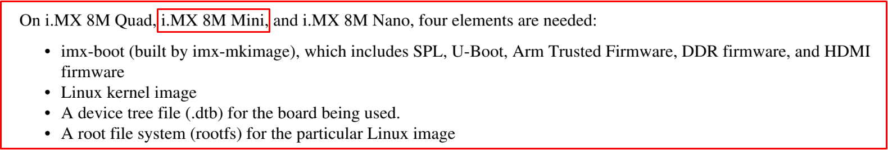   
</p>

+ Cũng ở trang 5 (4.1.1 Bootloader) ta thấy được boot sequence của MYIR IMX8MM như bên dưới
> Bootrom --> SPL --> BL31 --> BL33(u-boot) --> Linux kernel

<p align="center">
  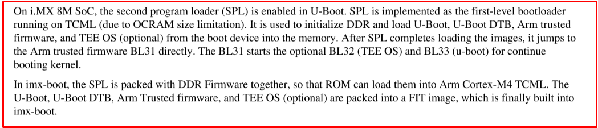   
</p>

<p align="center">
  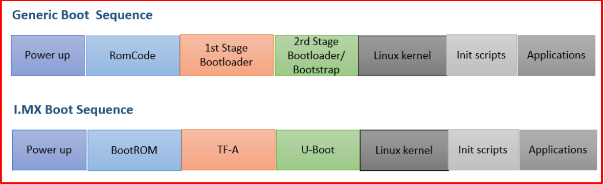   
</p>

<p align="center">
  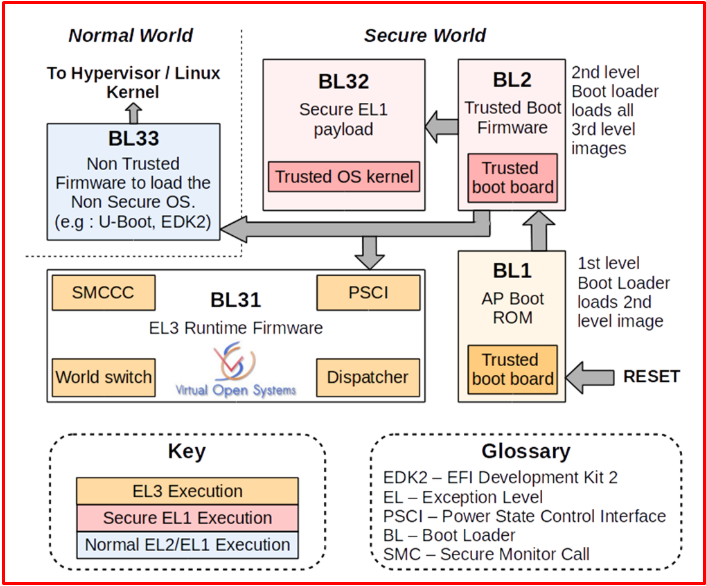   
</p>

### 2️⃣ Step to build

***Step 1: Build Arm Trusted Firmware***
```bash
$ git clone https://github.com/nxp-imx/imx-atf.git
$ cd imx-atf
$ git checkout lf_v2.6
$ ls -la
```

<p align="center">
  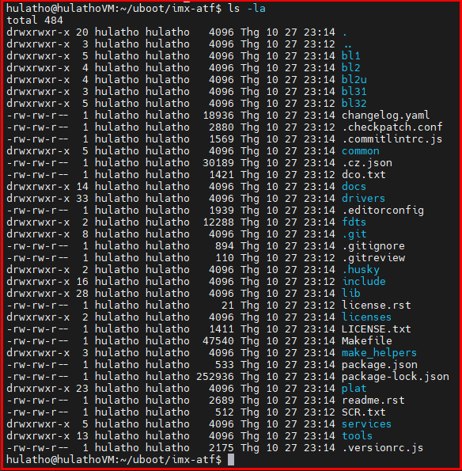   
</p>

+ Lấy file tool chain được build ra từ yocto, các bạn có thể lấy ra theo 2 cách:
  + Từ SDK myir cung cấp: 03-Tools\Toolchains\fsl-imx-xwayland-glibc-x86_64-myir-image-full-aarch64-imx8mpevk-toolchain-5.4-zeus.sh
  + File tool chain mình tự build yocto ra cho image full: [LINK](https://drive.google.com/file/d/1OjynGk-IDDVWj1t4Uyqu4hr7hwolDpG0/view?usp=sharing)

<br>

+ Sau đó ta đi tạo folder toolchain và chạy file .sh này, follow bên dưới
```bash
$ mkdir toolchain
$ tree -L 1 .
$ sudo chmod 0777 fsl-imx-xwayland-glibc-x86_64-meta-toolchain-aarch64-mys-8mmx-toolchain-5.4-zeus.sh
$ ./fsl-imx-xwayland-glibc-x86_64-meta-toolchain-aarch64-mys-8mmx-toolchain-5.4-zeus.sh
Nhập ./toolchain sau đó bấm Y
$ source ./toolchain/environment-setup-aarch64-poky-linux
```

<p align="center">
  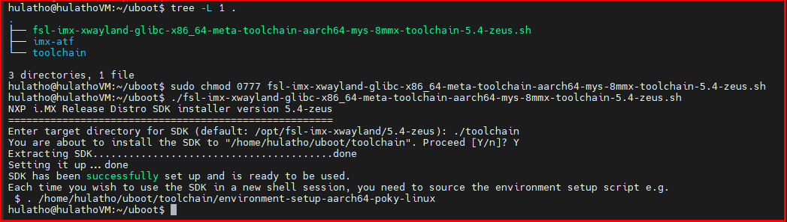   
</p>

+ Sau khi source xong thì gõ **export** để xem environment variable, nếu environment variable như ảnh dưới là OK

<p align="center">
  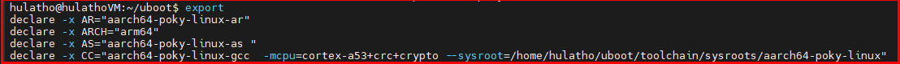   
</p>

+ Build bl31
  + Command line: CROSS_COMPILE=aarch64-linux-gnu- make PLAT=<Target_SoC> bl31
  + Target_SoC should be "imx8mq" for i.MX8MQ SoC.
  + Target_SoC should be "imx8mm" for i.MX8MM SoC.
```bash
$ cd imx-aft
$ make PLAT=imx8mm bl31
Nếu gặp lỗi: 
$ export AS="aarch64-poky-linux-gcc -c"
$ unset LDFLAGS
```

***Step 2: Build Uboot***
```bash
$ git clone https://github.com/nxp-imx/uboot-imx.git
$ cd uboot-imx
$ git checkout lf_v2022.04
```

<p align="center">
  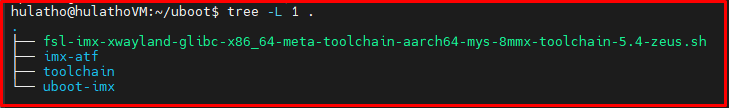   
</p>

+ Ở trong uboot-imx/configs, ta sẽ thấy có nhiều file *_deconfig, mà mỗi file đó sẽ là config uboot cho 1 board. Ở đây board của ta sẽ là imx8mm_ddr4_evk_defconfig
```bash
$ cd uboot-imx
$ make clean
$ make imx8mm_ddr4_evk_defconfig
$ make menuconfig, Set delay 5s
$ make -j16
Thêm extern vào biến yylloc trong file scripts/dtc/dtc-lexer.lex.c nếu ERROR
```

### 3️⃣ Prepare SD card
+ Đọc file file pdf i.MX_Linux_User's_Guide.pdf in page 27

<p align="center">
  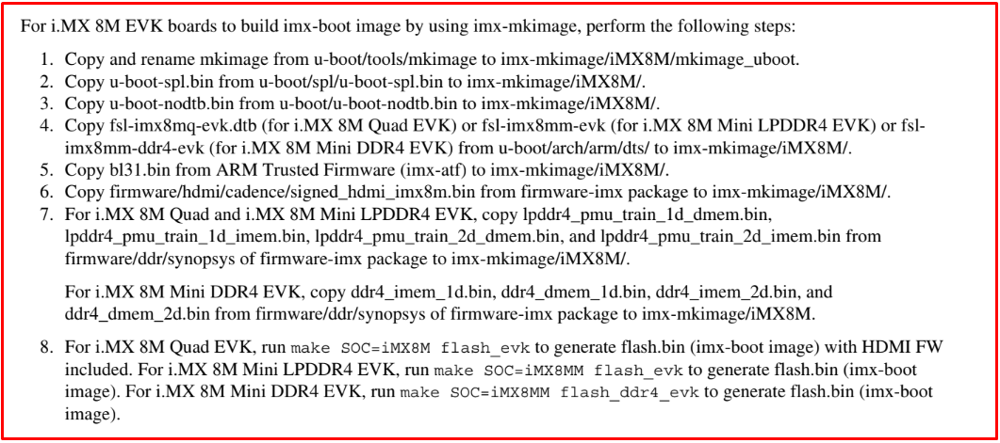   
</p>

+ Ta cần clone mkimage repo:
```bash
$ cd uboot
$ git clone https://github.com/nxp-imx/imx-mkimage.git
$ git checkout lf-5.15.32_2.0.0
``` 

<p align="center">
  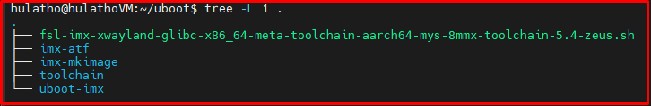   
</p>

### 4️⃣ Flash SD card
+ Thêm folder [firmware-imx-8.7](https://drive.google.com/drive/folders/1OAEZaFnkRFeN-G9ikguK_kPjoN6BAbxz?usp=sharing) và [uboot-mkimage-run.sh](https://drive.google.com/file/d/1Q43ztplyS01ScISvowGj3xwDMiUU-bSZ/view?usp=sharing) vào folder uboot như ảnh dưới để prepare data cho write SD Card

<p align="center">
  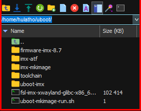   
</p>

+ Sau đó sửa lại đường dẫn cho giống đường dẫn bạn đang để tới folder uboot cho file uboot-mkimage-run.sh
  + File mặc định của mình thì đường dẫn đang là "/home/hulatho/uboot", các bạn thay đường dẫn trên thành đường dẫn của các bạn là được nha

<p align="center">
  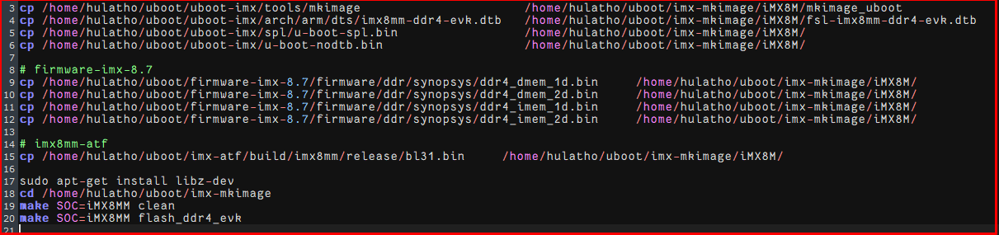   
</p>

+ Sau đó chạy file uboot-mkimage-run.sh là được
```bash
$ sudo chmod 0777 uboot-mkimage-run.sh
$ ./uboot-mkimage-run.sh
```

+ Sau khi chạy xong ta sẽ ra được file **flash.bin** trong **imx-mkimage/iMX8M**
+ Chúng ta cần **dd** file **flash.bin** vào SD card
+ Check trang 8 của file i.MX_Linux_User's_Guide.pdf 

<p align="center">
  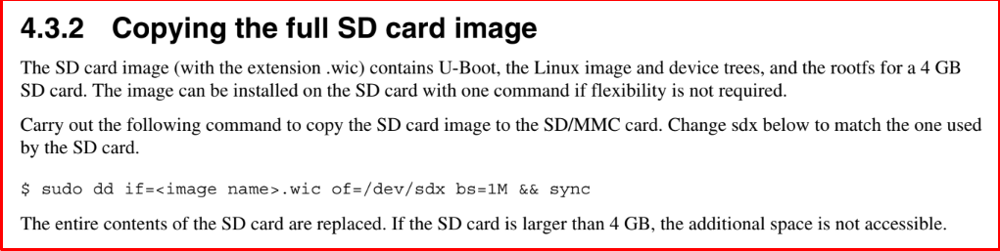   
</p>

+ Download file [HuLa_make_SDcard](https://drive.google.com/file/d/1ACu6SRb14qz-yw0R51OiSw93_8oNVjzW/view?usp=sharing) để tạo partision cho SD card và **dd** file **flash.bin** vào SD card 

```bash
$ mkdir flash_SDCrad
$ cp imx-mkimage/iMX8M/flash.bin flash_SDCrad/
$ cd flash_SDCrad
$ sudo chmod 0777 make_sdcard.sh
Cắm SD card vào và lsblk xem là /dev/sdx mấy
$ ./make_sdcard.sh -d=/dev/sdb -ub=flash.bin
```

<p align="center">
  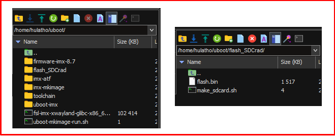   
</p>
<p align="center">
  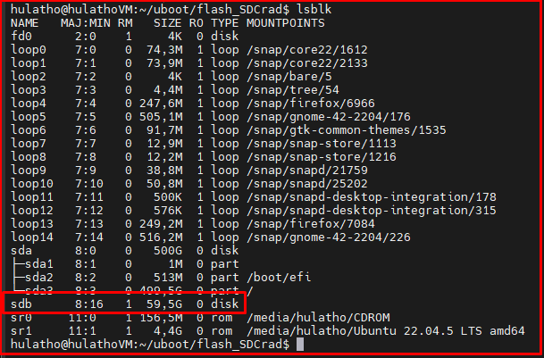   
</p>

+ DONE FLASH SD CARD

<p align="center">
  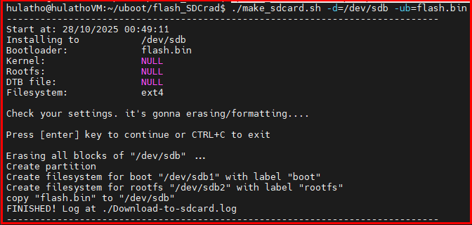   
</p>

+ Bây giờ cắm thẻ nhớ vào board mạch và set jump switch về SD card theo ảnh dưới là có thể boot board rồi.

<p align="center">
     
</p>

+ DONE BOOT BOARD

<p align="center">
  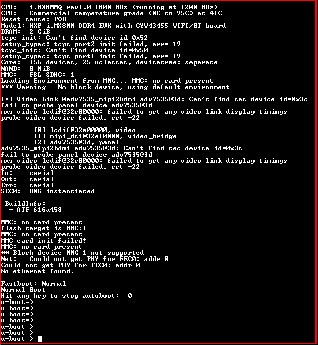   
</p>

***Review Image layout***
<p align="center">
  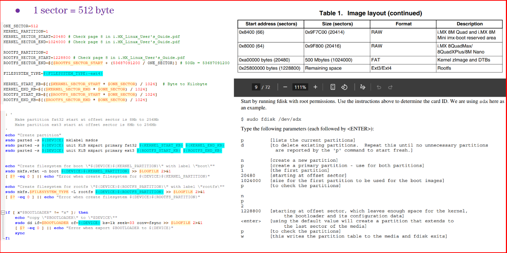   
</p>

## ✔️ Conclusion
Ở bài này chúng ta đã biết cách build uboot cho board myir imx8mm và đã boot được uboot lên board thành công. Tiếp theo chúng ta cùng đi tạo 1 command line mới cho trên uboot và từ command line đó có thể bật sáng hoặc tắt led nhé.

## 💯 Exercise
+ Tạo 1 command line trên uboot
+ Từ command line đó có thể bật sáng hoặc tắt led, ví dụ led on thì bật led còn nhập led off thì tắt led.

## 📺 NOTE
+ Sợ qua năm tháng link git sẽ thay đổi hoặc bị xóa branch, nên mình đã download nguyên project và lưu lại. Các bạn có thể download nguyên về để thực hành nhé. [Full Uboot  Myir Imx8mm](https://drive.google.com/file/d/1UYbw9kxyTlQKxM_ZEcacNyn_DwCJ69eh/view?usp=sharing)
+ Xem video sau để trực quan hơn nhé : [Video Youtube](https://www.youtube.com/watch?v=qzUfeBrt8Bg)

## 📌 Reference

[1] MYS-8MMX-V2 Product Manual-V2.0.pdf

[2] https://github.com/nxp-imx

[3] https://github.com/MYiR-Dev

[4] i.MX_Linux_User's_Guide.pdf