# 💚 Custom Uboot CMD 💛

## 👉 Introduction and Summary

### 1️⃣ Introduction

+ Ở bài trước chúng ta đã build được uboot và boot trên board. Nếu các bạn chưa đọc thì xem link này nha [017_Uboot_Practice_Imx8mm.md](../017_Uboot_Practice_Imx8mm/017_Uboot_Practice_Imx8mm.md). Ở bài này chúng ta sẽ tìm hiểu về cách tạo 1 cmd mới trong uboot và blynk led trên uboot nhé.

### 2️⃣ Summary

Nội dung của bài viết gồm có những phần sau nhé 📢📢📢:
- [I. Introduction and Summary](#👉-introduction-and-summary)

    - [1. Introduction](#1️⃣-introduction)
    - [2. Summary](#2️⃣-summary)
- [II. Contents](#👉-contents)
    - [1. Command uboot](#1️⃣-command-uboot)
    - [2. Create a command uboot](#2️⃣-create-a-command-uboot)
    - [3. Uboot Gpio](#3️⃣-uboot-gpio)
    - [4. Command uboot blynk led](#4️⃣-command-uboot-blynk-led)
- [III. Conclusion](#✔️-conclusion)
- [IV. Exercise](#💯-exercise)
- [V. NOTE](#📺-note)
- [VI. Reference](#📌-reference)

## 👉 Contents

### 1️⃣ Command uboot
+ Trong uboot sẽ có các command mặc định như help, printenv, saveenv... Tất cả các command này sẽ nằm trong thư mục uboot-imx/cmd

<p align="center">
  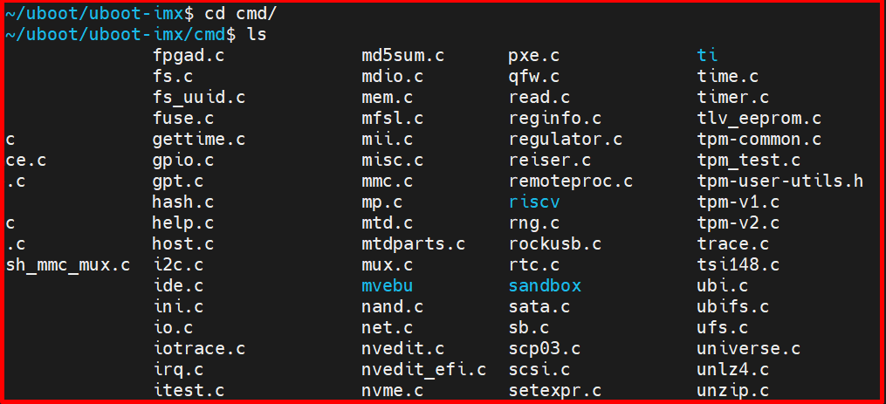   
</p>

### 2️⃣ Create a command uboot
***Để tạo 1 command uboot ta làm theo các bước sau:***
1. Trong folder uboot-imx/cmd ta tạo 1 file ví dụ hula.c
```bash
$ cd uboot-imx/cmd
$ touch hula.c
```

2. Nội dung của file hula.c sẽ như sau
```bash
#include <common.h>
#include <command.h>

#define CONFIG_MAX_ARGS 4
#define CONFIG_REPEATAVLE 1
#define USAGE "print hello hula"
#define HELP "u-booot hello hula command line help"

int do_hula(struct cmd_tbl *cmdtp, int flag, int argc, char * const argv[])
{
    int i;
    printf("***********************");
    printf("\n Hello U-Boot HuLa CMD \n");
    printf("***********************");

    for( i = 0; i< argc;i++)
    {
        printf("%s-%d: argv[%d]: %s\n",__func__, __LINE__, i+1, argv[i]);
    }
    return 1;
}

U_BOOT_CMD(
        hula_cmd,CONFIG_MAX_ARGS, CONFIG_REPEATAVLE, do_hula,
        USAGE,
        HELP
);
```

3. Sau đó ở trong folder uboot-imx/cmd ta mở file Makefile lên và thêm command ta mới tạo vào
```bash
$ cd uboot-imx/cmd
$ vim Makefile
$ obj-y += hula.o
```
<p align="center">
  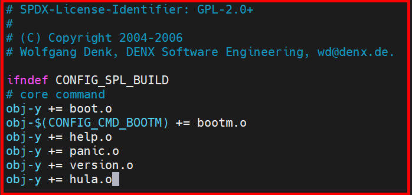   
</p>

4. Sau đó ta đi build lại uboot
```bash
$ cd uboot-imx
$ make clean
$ make imx8mm_ddr4_evk_defconfig
$ make -j16
```

5. Boot board và vào uboot, ta gõ hula_cmd sẽ in ra kết quả
```bash
$ hula_cmd hulatho
```
<p align="center">
  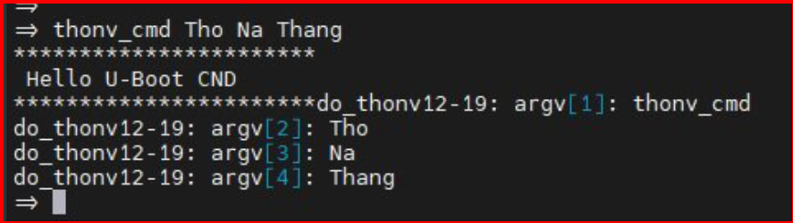   
</p>

### 3️⃣ Uboot Gpio

<p align="center">
  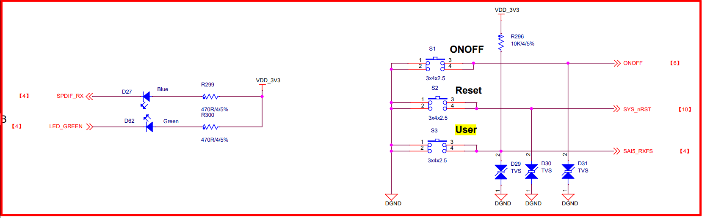   
</p>

<p align="center">
  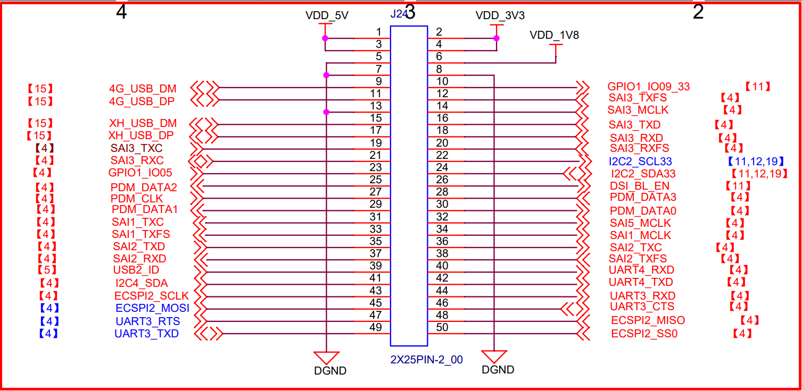   
</p>

<p align="center">
  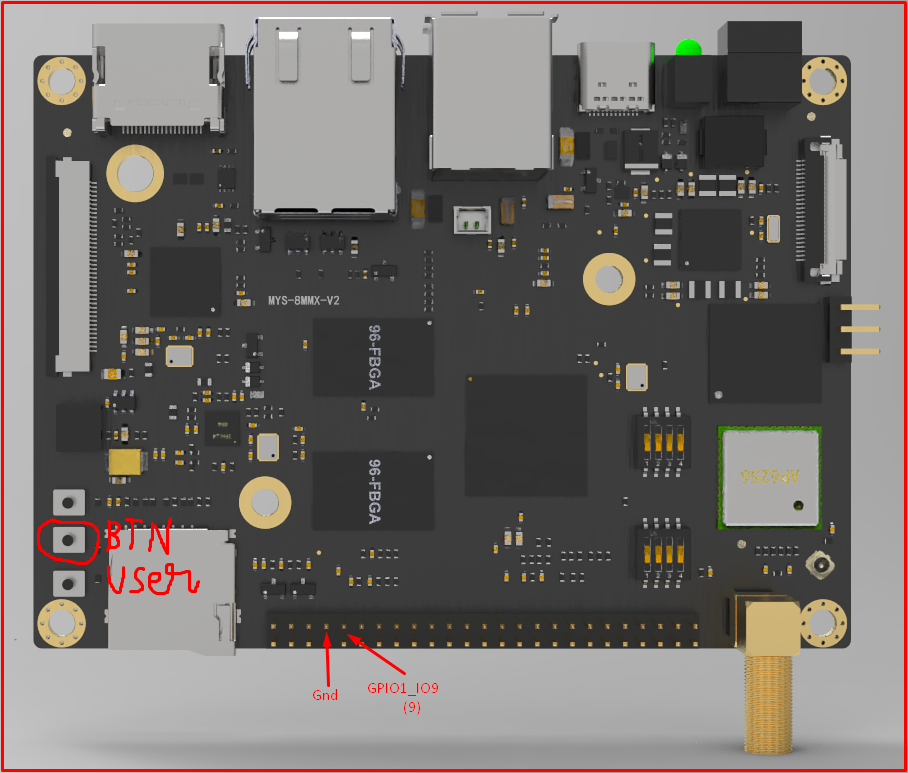   
</p>

+ Đầu tiên trên board Myir IMX8MM có Two LEDs (User LED – Blue, System indicator – Green) và 1 button user như ảnh trên. Tuy nhiên ta tìm không thấy pin trên docs nên ta sẽ sử dụng pin GPIO1_IO9 (9) được show trên header. Ta sẽ sử dụng led và cắm vào pin đó.  

+ Ngoài ra ta có thể dùng luôn led blue (D27), nó là GPIO5_IO4 = (5-1)*32 + 4 = 132

+ Khi đã vào uboot trong boot board ta có thể thực hiện nháy led bằng thao tác với gpio command. Làm theo hình bên dưới

+ Tính theo integer thì GPIO1_IO9 sẽ tương ứng với số 9

```bash
$ gpio
$ gpio set 9
$ gpio clear 9
```
<p align="center">
  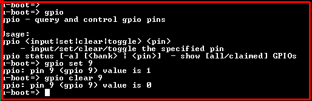   
</p>


### 4️⃣ Command uboot blynk led
***Các command read write thanh ghi***
+ md: memory display​
+ mw: memory write​
+ [.b, .w, .l] byte/word/long
+ mw.l 0x81000000 0x8
+ md.l 0x81000000 0x8​

+ Ví dụ:
  + md 0x30200000 4: Xem địa chỉ 16 byte bắt đầu từ địa chỉ 0x30200000
  + mw 0x30200000 0xFFFDFFFF​: Ghi giá trị 0xFFFDFFFF​ vào địa chỉ 0x30200000

<p align="center">
  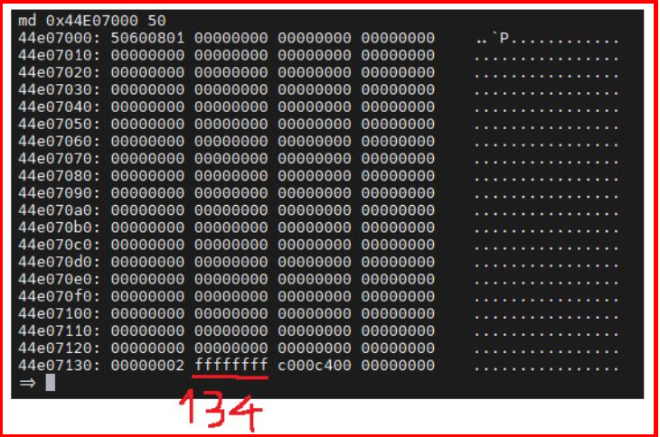   
</p>
<p align="center">
  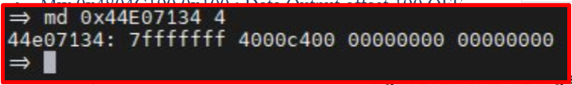   
</p>

+ Xét thêm 1 ví dụ, ta biết GPIO_1_ADDR_BASE=0x30200000 còn led GPIO1_IO9 là pin thứ 9. Vậy ta sẽ dùng gpio set và gpio clear để bật sáng tắt led và xem giá trị của thanh ghi DR có offset là 0
```bash
$ gpio set 9
$ md 0x30200000 4
$ gpio clear 9
$ md 0x30200000 4
```
<p align="center">
  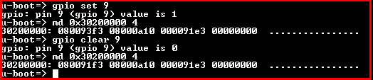   
</p>


***Dưới đây là ví vụ cho sáng led GPIO1_IO9***
+ Các thanh ghi base_addr_clk:
  + Clock có địa chỉ là CCM_CCGRn_ADDR_BASE=0x30380000
  + GPIO1_ENABLE_CLOCK_OFFSET (0x40B0)
  + Suy ra Clock Address là: 0x303840B0 

  + Clock có địa chỉ là CCM_CCGRn_ADDR_BASE=0x30380000
  + GPIO1_SET_CLOCK_OFFSET (0x40B4)
  + Suy ra Clock Address là: 0x303840B4 

+ Các thanh ghi base_addr_mux_gpio1_io9:
  + IO MUX là IOMUXC_SW_MUX_CTL_PAD_GPIO1_IO05_BASE 0x3033003C 

+ Các thanh ghi base_addr:
  + GPIO_1_ADDR_BASE có base address là 0x30200000
  + GPIO_DR_OFFSET có ofset là 0
  + GPIO_GDIR1_OFFSET (0x04)
  + Suy ra 0x30200004

+ Cần set như sau:
```bash
$ mw 0x303840B0 0x00003333    : Enable clock cho GPIO1_IO9
$ mw 0x303840B4 0x00003333    : Set clock cho GPIO1_IO9
$ mw 0x3033003C 0x00000010    : ENABLED SION, set bit 4
$ mw 0x3033003C 0x00000010    : Select signal GPIO1_IO9, clear bit 7
$ mw 0x30200004 0x00000200    : Set DR cho bit 9
$ mw 0x30200004 0x00000000    : Clear DR cho bit 9
$ md 0x30200004 4             : Xem thanh ghi DR
```


+ Từ ý tưởng dùng thanh ghi và câu lệnh như trên, ta sẽ viết command để thực hiện sáng tắt led
  + Gõ led_on thì led sáng
  + Gõ led_off thì led tắt

```bash
/**Use comand line u-boot on, off led
 * GPIO1_IO9
 * cmd: led_cmd LED_ON  => led on
 *      led_cmd LED_OFF => led off
**/
#include <common.h>
#include <command.h>
#include <string.h>
#include <stdint.h>

#define CONFIG_MAX_ARGS 4
#define CONFIG_REPEATAVLE 1
#define USAGE "print toogle led Linux"
#define HELP "u-booot hello hula command line"

#define IOMUXC_SW_MUX_CTL_PAD_GPIO1_IO05_BASE    (0x3033003C)
#define CCM_CCGRn_ADDR_BASE                      (0x30380000)
#define GPIO_1_ADDR_BASE                         (0x30200000)
#define GPIO1_ENABLE_CLOCK_OFFSET                (0x40B0)
#define GPIO1_SET_CLOCK_OFFSET                   (0x40B4)
#define GPIO_DR_OFFSET                           (0x00)
#define GPIO_GDIR1_OFFSET	                       (0x04)	      /* 0 input 1 output */	
#define LED                                      (1 << 9)     /* GPIO_1_IO9 (1-1)*32 + 9 */
#define CLK                                      (0x00003333)

volatile uint32_t  *base_addr = (uint32_t*)GPIO_1_ADDR_BASE;
volatile uint32_t  *base_addr_clk = (uint32_t*)CCM_CCGRn_ADDR_BASE;
volatile uint32_t  *base_addr_mux_gpio1_io9 = (uint32_t*)IOMUXC_SW_MUX_CTL_PAD_GPIO1_IO05_BASE;

int do_toggle_led(struct cmd_tbl *cmdtp, int flag, int argc, char * const argv[])
{  
  char *mode = argv[1];

  if(strcmp(mode, "LED_ON") == 0)
  {
    *(base_addr_clk + GPIO1_ENABLE_CLOCK_OFFSET / 4) |= CLK;
    *(base_addr_clk + GPIO1_SET_CLOCK_OFFSET / 4) |= CLK;

    *(base_addr_mux_gpio1_io9) |= 1 << 4;  /* ENABLED SION */
    *(base_addr_mux_gpio1_io9) &=~ 0x07;  /* Select signal GPIO1_IO05 */

    *(base_addr + GPIO_GDIR1_OFFSET / 4) |= LED;
    *(base_addr + GPIO_DR_OFFSET / 4) |= LED;

    printf("\n Led on sucess \n");
  }
  else if(strcmp(mode, "LED_OFF") == 0) 
  {
    *(base_addr + GPIO_DR_OFFSET / 4) &=~ LED;
    
    printf("\n Led off sucess \n");
  }
  else
  {
    printf("\n error CMD \n");
  }

  return 1;
}

U_BOOT_CMD(
      led_cmd,CONFIG_MAX_ARGS, CONFIG_REPEATAVLE, do_toggle_led,
      USAGE,
      HELP
);
```

+ led_cmd LED_ON  => led on
+ led_cmd LED_OFF => led off

<p align="center">
  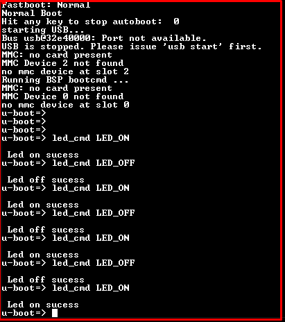   
</p>

<p align="center">
  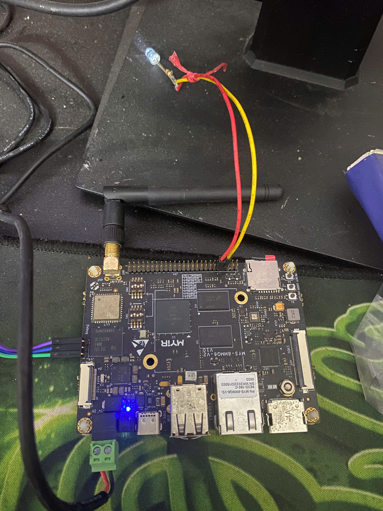   
</p>


## ✔️ Conclusion
Ở bài này chúng ta đã biết cách tạo 1 command line trên uboot và test trên board. Tiếp theo chúng ta cùng đi build yocto cho board myir imx8mm nhé.

## 💯 Exercise
+ Từ command line đó có thể bật sáng hoặc tắt led, ví dụ led on thì bật led còn nhập led off thì tắt led.

## 📺 NOTE
+ Xem video sau để trực quan hơn nhé : [Video Youtube](https://www.youtube.com/watch?v=qzUfeBrt8Bg)

## 📌 Reference

[1] MYS-8MMX-V2 Product Manual-V2.0.pdf

[2] https://github.com/nxp-imx

[3] https://github.com/MYiR-Dev

[4] i.MX_Linux_User's_Guide.pdf