# 💚 Build Yocto Myir Imx8mm 💛

## 👉 Introduction and Summary

### 1️⃣ Introduction

+ Ở bài trước chúng ta đã custom command uboot và dùng command trong uboot để sáng tắt led. Nếu các bạn chưa đọc thì xem link này nha [018_Custom_Uboot_Cmd.md](../018_Custom_Uboot_Cmd/018_Custom_Uboot_Cmd.md). Ở bài này chúng ta sẽ tìm hiểu về cách build yocto cho board Myir IMX8MM nhé. Dưới đây sẽ là 2 cách build, 1 cách thì build từ đầu, yêu cầu máy phải mạnh có dung lượng ổ cài đặt ubuntu khoảng 250GB vì build image và sdk cho board thì tổng đã ăn mất 220GB rồi. Còn cách thứ 2 là download nguyên bộ source, download, build của mình đã build sẵn về, rồi từ đó build tiếp thì sẽ đỡ tốn thời gian fetch source code upstream và ít công fix lỗi hơn.

### 2️⃣ Summary

Nội dung của bài viết gồm có những phần sau nhé 📢📢📢:
- [I. Introduction and Summary](#👉-introduction-and-summary)

    - [1. Introduction](#1️⃣-introduction)
    - [2. Summary](#2️⃣-summary)
- [II. Contents](#👉-contents)
    - [1. Yêu cầu](#1️⃣-yêu-cầu)
    - [2. Build yocto theo guideline](#2️⃣-build-yocto-theo-guideline)
    - [3. Build yocto từ source download](#3️⃣-build-yocto-từ-source-download)
- [III. Conclusion](#✔️-conclusion)
- [IV. Exercise](#💯-exercise)
- [V. NOTE](#📺-note)
- [VI. Reference](#📌-reference)

## 👉 Contents

### 1️⃣ Yêu cầu
1. Board Myir Imx8mm này support build yocto Zeus version 3.0 và để build được thì mọi người chạy trên Ubuntu 18.04.6. Link Ubuntu 18.04 mình để ở đây [LINK](https://releases.ubuntu.com/18.04/)

2. Để build yocto to board mọi người làm theo guideline sau: [LINK](https://drive.google.com/file/d/1gqVU-K1JttKSbkjafNdUaeNWy4wKiNsq/view)


### 2️⃣ Build yocto theo guideline
+ Config git
```bash
$ git config --global user.name "user"
$ git config --global user.email "email"
$ git config --list
```

+ Installation of necessary tools
```bash
$ sudo apt-get install gawk wget git-core diffstat unzip texinf o gcc-multilib build-essential chrpath socat libsdl1.2-dev libsdl1.2-dev xterm sed c vs subversion coreutils texi2html docbook-utils python-pysqlite2 help2man make gcc g++ desktop-file-utils libgl1-mesa-dev libglu1-mesa-dev mercurial autoconf automake groff curl lzop asciidoc u-boot-tools python3-pip
```

+ Setup env google repo
```bash
$ mkdir -p ~/.bin
$ PATH="${HOME}/.bin:${PATH}"
$ curl https://storage.googleapis.com/git-repo-downloads/repo > ~/.bin/repo
$ chmod a+rx ~/.bin/repo
$ cp repo ~/.bin/       (repo get from 03-tools/repo) if ERROR get from https://drive.google.com/file/d/16O0LP642exOF0eIXsZiKz1EoSHxOMzpo/view
```

+ Repo sync source from google repo
```bash
$ mkdir MYIR
$ cd MYIR
$ vim ~/.gitconfig     and add this below

[url "https://github.com/nxp-imx/"]
        insteadof = https://source.codeaurora.org/external/imx/
        insteadof = git://source.codeaurora.org/external/imx/
[url "https://github.com/"]
        insteadOf = git://github.com/
[url "https://git.yoctoproject.org/"]
        insteadOf = git://git.yoctoproject.org/
[url "http://sourceforge.net/projects/openil/files/DevIL/1.8.0/"]
        insteadOf = https://source.codeaurora.org/mirrored_source/external/imx/
[url "https://github.com/google/googletest/blob/main/LICENSE"]
        insteadOf = https://github.com/google/googletest/git/googlemock/LICENSE
[url "https://sourceforge.net/projects/openil/files/DevIL/1.8.0/DevIL-1.8.0.zip"]
        insteadOf = https://source.codeaurora.org/mirrored_source/external/imx/DevIL-1.8.0.zip
```

```bash
$ sudo apt install repo
$ repo init -u https://github.com/MYiR-Dev/myir-imx-manifest.git --no-clone-bundle --depth=1 -m myir-i.mx8m-5.4.3-2.0.0.xml -b i.MX8M-5.4-zeus
$ repo sync
```

<p align="center">
     
</p>

+ Check info source and choose version
```bash
$ sudo apt  install tree
$ tree -a -L 1 ../MYIR/
$ vim sources/meta-myir/meta-bsp/conf/machine/mys-8mmx.conf
```
<p align="center">
  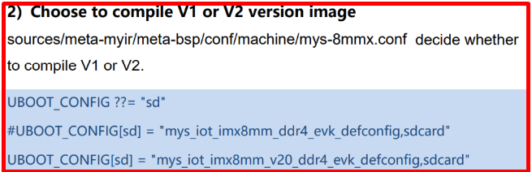   
</p>
<p align="center">
  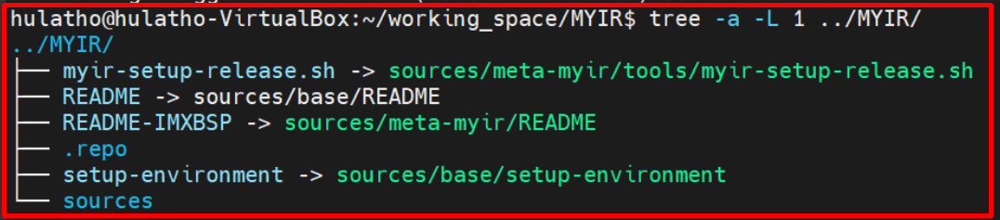   
</p>

+ Check command build
```bash
$ source setup-environment : You will see command and guideline command
$ DISTRO=fsl-imx-xwayland MACHINE=mys-8mmx source sources/meta-myir/tools/myir-setup-release.sh -b build-xwayland
Enter space until 100% and choose y
```
<p align="center">
  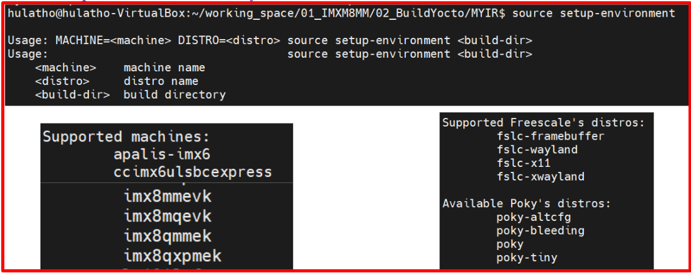   
</p>

+ Fetch all package to folder download
  + This command will download all infrastructure into folder download
    > $ bitbake myir-image-full --runall=fetch
  + Perform build yocto
    > $ bitbake myir-image-full

+ Build done image

<p align="center">
  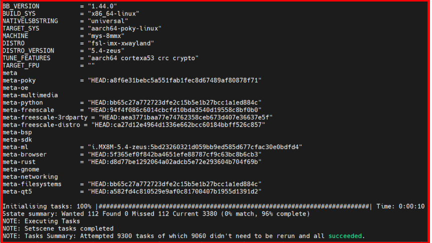   
</p>

+ Sau khi build xong image ta vào folder sau để xem output: tmp/deploy/images/mys-8mmx
<p align="center">
  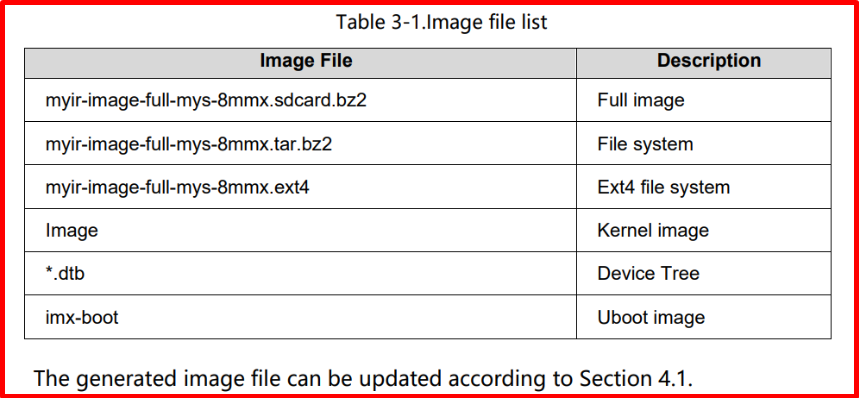   
</p>


+ Để build SDK ta chạy lệnh sau:
  > bitbake -c populate_sdk meta-toolchain
+ Sau khi build xong ta vào folder sau để lấy output: build-xwayland/tmp/deploy/sdk
<p align="center">
  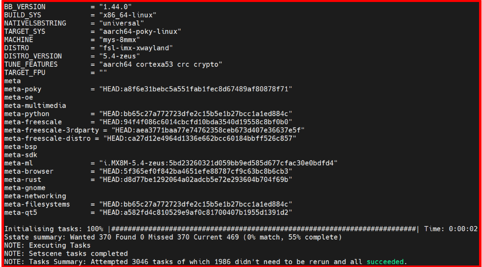   
</p>

<p align="center">
  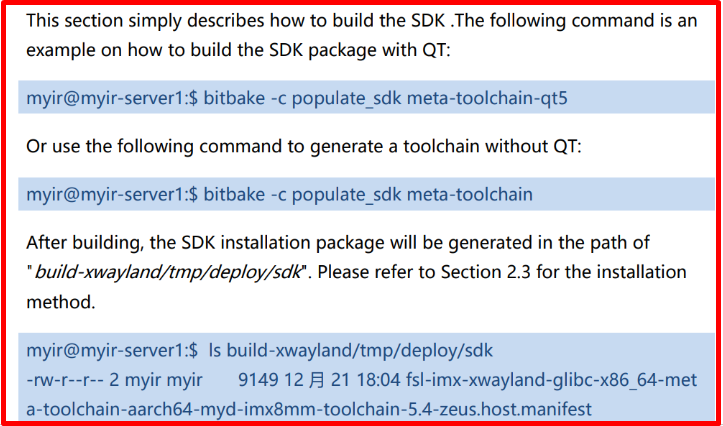   
</p>

***Fix lỗi build yocto***
+ Lỗi devil
  + Tải file [LINK](https://sourceforge.net/projects/openil/files/DevIL/1.8.0/DevIL-1.8.0.zip) này về rồi bỏ vào folder download
+ Lỗi devil
  + Một cách sửa nữa là vim sources/meta-myir/meta-sdk/recipes-graphics/devil/devil_1.8.0.bb, khi này cần sửa lại đường dẫn SRC URI như đường dẫn LINK bên trên. Xem ảnh dưới để rõ hơn
  + $ vim ~/.gitconfig   và sửa như ảnh dưới
<p align="center">
  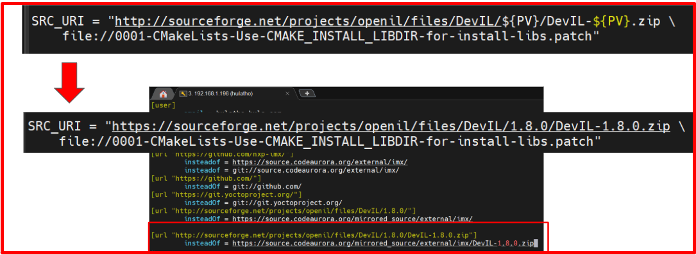   
</p>

+ Lỗi half
  + Check file này: https://sourceforge.net/projects/half/files/half/2.1.0/half-2.1.0.zip 
  + Sau đó vim sources/meta-myir/meta-sdk/recipes-devtools/half/half_2.1.0.bb
  + Và sửa lại như ảnh dưới
  + Nếu không được thì download về và bỏ vào downloads
<p align="center">
  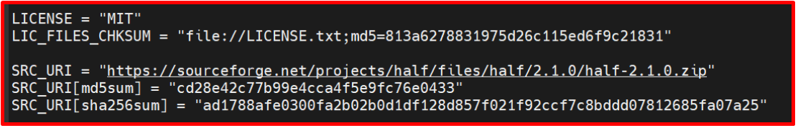   
</p>

+ Lỗi googletest-1.8.1-r0
  + Check file này: https://www.nuget.org/packages/googletest/1.8.1 
  + vim sources/meta-openembedded/meta-oe/recipes-test/googletest/googletest_1.8.1.bb
  + bitbake googletest -c cleansstate
  + bitbake googletest -c compile
  + Nếu không được thì download về và bỏ vào downloads
<p align="center">
  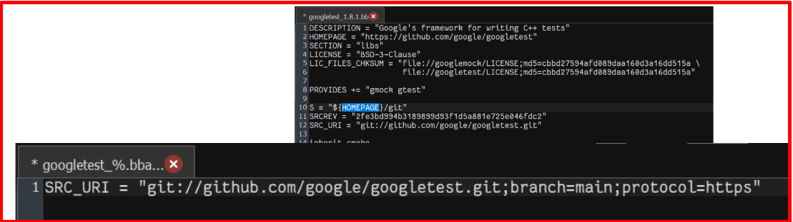   
</p>

+ Nếu lỗi armnn-onnx
  + change lại đường dẫn: SRC_URI = "git://github.com/onnx/onnx.git;branch=main"
  + bitbake -c cleansstate myir-image-full

+ Nếu lỗi DUT-WIFI
  + grep -nrwI "sigma-dut" ./sources
  + Mở vscode folder source: tìm sigma-dut: chỗ RDEPENS xoá dòng có sigma-dut đi
  + Sửa ở đây: sources/meta-myir/meta-sdk/recipes-fsl/packagegroup/packagegroup-fsl-tools-testapps.bbappend

+ Nếu bị lỗi qtbase
  + bitbake qtbase -c cleanall
  + sudo apt-get update
  + sudo apt-get install -y -q --no-install-recommends -o Dpkg::Options::="--force-confdef" -o Dpkg::Options::="--force-confold" build-essential chrpath cpio diffstat file g++-multilib gawk gcc-multilib git-core locales openssh-client python python3 socat sudo texinfo tmux unzip wget

+ Lỗi opencv 
  + bitbake opencv -c cleansstate
  + bitbake opencv -c complie


### 3️⃣ Build yocto từ source download
+ Nhiều đường link khi build yocto đã bị outdate nên cần sửa lại rất nhiều. Mình đã sửa và build thành công nên đã nén lại folder source, download, build để khi mọi người muốn build thì chỉ việc sử dụng lại. Có muốn build thêm cái gì thì xóa output và build lại nhé.

+ Download source code đã build thành công: [LINK](https://drive.google.com/drive/folders/1cjX2ECz1gjVw-uTc8ZTjmLuOu96SpG7L)

<p align="center">
  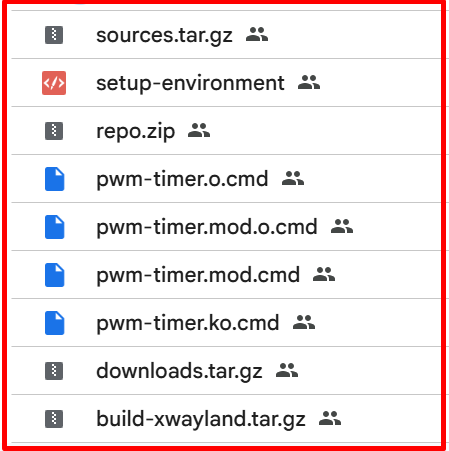   
</p>
<p align="center">
  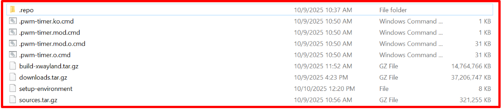   
</p>

+ Install environment tools
```bash
$ sudo apt-get install gawk wget git-core diffstat unzip texinfo gcc-multilib build-essential chrpath socat libsdl1.2-dev libsdl1.2-dev xterm sed cvs subversion coreutils texi2html docbook-utils python-pysqlite2 help2man make gcc g++ desktop-file-utils libgl1-mesa-dev libglu1-mesa-dev mercurial autoconf automake groff curl lzop asciidoc u-boot-tools python3-pip
```

+ Sau khi download về chúng ta làm theo các bước sau:
  + tar -xvf
    + build-xwayland.tar.gz
    + downloads.tar.gz
    + sources.tar.gz
  + DISTRO=fsl-imx-xwayland MACHINE=mys-8mmx source sources/meta-myir/tools/myir-setup-release.sh -b build-xwayland
  + bitbake myir-image-full
  + bitbake -c populate_sdk meta-toolchain

***Output cần lấy***
+ Sau khi build cả Image và Sdk thành công ta cần chú ý lấy 3 folder sau để sử dụng cho các bài tiếp theo:
  + Output Images: tmp/deploy/images/mys-8mmx
  + Output SDK: build-xwayland/tmp/deploy/sdk
  + Header file: build-xwayland/tmp/work/mys_8mmx-poky-linux/linux-imx/5.4-r0/build

***Flash Image SD card***
+ Sau khi build Image xong ta vào folder tmp/deploy/images/mys-8mmx sẽ thấy có 1 file đuôi là wic.bz2, ta chỉ cần giải nén file này và dd trực tiếp file này vào thẻ SD card là có thể boot board thành công, vì file này đã chứa tất cả các thành phần linux BSP rồi
```bash
$ bunzip2 -dk -f myir-image-full-mys-8mmx-20251008060345.rootfs.wic.bz2
$ sudo dd if=/dev/zero of=/dev/sdx bs=512 count=2048
$ sudo dd if=myir-image-full-mys-8mmx-20251008060345.rootfs.wic of=/dev/sdb bs=1M
```

## ✔️ Conclusion
Ở bài này chúng ta đã biết cách build yocto và load output vào thẻ SD card. Tiếp theo chúng ta cùng đi tìm hiểu lý thuyết về linux kernel nhé.

## 💯 Exercise
+ Build lại yocto cho board

## 📺 NOTE
+ Video build yocto MYIR IMX8MM : [Video Youtube](https://www.youtube.com/watch?v=VC0RBb2W9H0)

```bash
Host Comfiguration :
--CPU: i7-6700 4-core 8 threads
--Total memory: 32GB DDR4
--Windows 7 64bit
--USB3.1 SSD ( For Linux virtual machine)
Virtual Machine:
--Vmware player 15
--Ubuntu 18.04 LTS / 20.04 LTS /Debian-10

(1)Setting root user and password
If the step has been done, omit it, please!
# sudo passwd root
(2)Run these 2 commands to update software and system
# sudo apt-get update
# sudo apt-get upgrade
(3)Installing software packages for cross-compile linux BSP
# sudo apt-get install flex bison gperf build-essential zlib1g-dev
# sudo apt-get install lib32ncurses5-dev x11proto-core-dev
# sudo apt-get install libx11-dev lib32z1-dev libgl1-mesa-dev
# sudo apt-get install tofrodos python-markdown libxml2-utils xsltproc
# sudo apt-get install uuid-dev:i386 liblzo2-dev:i386 gcc-multilib g++-multilib
[commnent]
For Debian-10 uuid-dev:i386 liblzo2-dev:i386---> uuid-dev liblzo2-dev
# sudo apt-get install subversion openssh-server openssh-client uuid uuid-dev zlib1g-dev
# sudo apt-get install liblz-dev lzop liblzo2-2 liblzo2-dev git-core curl
# sudo apt-get install python3 python3-pip python3-pexpect python3-git python3-jinja2 pylint3
# sudo apt-get install u-boot-tools mtd-utils android-tools-fsutils
[commnent]
For ubuntu 20.04 LTS, don’t need android-tools-fsutils. So remove it, please!
# sudo apt-get install openjdk-8-jdk device-tree-compiler aptitude
[commnent]
For Debian-10 openjdk-8-jdk --- > default-jdk
# sudo apt-get install libcurl4-openssl-dev nss-updatedb
# sudo apt-get install chrpath texinfo gawk cpio diffstat
# sudo apt-get install libncursesw5-dev libssl-dev libegl1-mesa libncurses5
# sudo apt-get install net-tools python libsdl1.2-dev xterm socat
# sudo apt-get install icedtea-netx-common icedtea-netx
```

+ Cách tìm kí tự trong 1 folder
  > grep -nrwI "chuỗi_cần_tìm" /đường/dẫn/thư/mục

+ BB_NUMBER_THREADS = "20"
+ PARALLEL_MAKE = "-j 20"

***Build on Docker Container***
+ vim /home/bv_rzvt/imx-yocto-bsp/sources/poky/scripts/lib/wic/filemap.py
```py
def get_block_size(file_obj):
    """
    Returns block size for file object 'file_obj'. Errors are indicated by the
    'IOError' exception.
    """
    # Get the block size of the host file-system for the image file by calling
    # the FIGETBSZ ioctl (number 2).
#    try:
#        binary_data = fcntl.ioctl(file_obj, 2, struct.pack('I', 0))
#    except OSError:
#        raise IOError("Unable to determine block size")
#    bsize = struct.unpack('I', binary_data)[0]
#    if not bsize:
#        import os
#        stat = os.fstat(file_obj.fileno())
#        if hasattr(stat, 'st_blksize'):
#            bsize = stat.st_blksize
#        else:
#            raise IOError("Unable to determine block size")
#    return bsize
    try:
        stat = os.fstat(file_obj.fileno())
        if hasattr(stat, 'st_blksize') and stat.st_blksize > 0:
            return stat.st_blksize
        else:
            # fallback mặc định nếu hệ thống không cung cấp st_blksize
            return 4096
    except OSError:
        raise IOError("Unable to determine block size")
```
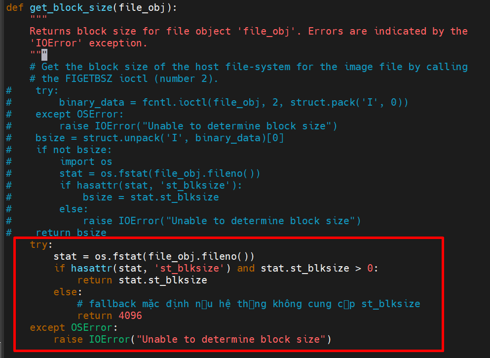

## 📌 Reference

[1] MYS-8MMX-V2 Product Manual-V2.0.pdf

[2] https://github.com/nxp-imx

[3] https://github.com/MYiR-Dev

[4] i.MX_Linux_User's_Guide.pdf

[5] MYS-8MMX Software Development Guide-V2.0.pdf 