# 💚 Yocto Project 💛

## 👉 Introduction and Summary

### 1️⃣ Introduction

+ Ở bài trước chúng ta đã build yocto cho board myir imx8mm. Nếu các bạn chưa đọc thì xem link này nha [019_Build_Yocto_Imx8mm.md](../019_Build_Yocto_Imx8mm/019_Build_Yocto_Imx8mm.md). Ở bài này chúng ta sẽ tìm hiểu lý thuyết và thực hành liên quan về yocto zues nhé.

### 2️⃣ Summary

Nội dung của bài viết gồm có những phần sau nhé 📢📢📢:
- [I. Introduction and Summary](#👉-introduction-and-summary)

    - [1. Introduction](#1️⃣-introduction)
    - [2. Summary](#2️⃣-summary)
- [II. Contents](#👉-contents)
    - [1. Giới thiệu Yocto](#1️⃣-giới-thiệu-yocto)
    - [2. Operators](#2️⃣-operators)
    - [3. Custom Yocto](#3️⃣-custom-yocto)
- [III. Conclusion](#✔️-conclusion)
- [IV. Exercise](#💯-exercise)
- [V. NOTE](#📺-note)
- [VI. Reference](#📌-reference)

## 👉 Contents

### 1️⃣ Giới thiệu Yocto
+ Dự án Yocto là một dự án mã nguồn mở có mục tiêu là cung cấp các công cụ giúp xây dựng các hệ thống nhúng hoạt động trên hệ điều hành Linux với bất kì phần cứng nào

+ Được thành lập vào năm 2010, với nỗ lực giảm thiểu sự trùng lặp trong công việc, cung cấp tài nguyên và thông tin phục vụ cho cả người dùng mới và người dùng có kinh nghiệm

+ Là sự hợp tác của nhiều nhà sản xuất phần cứng, các nhà cung cấp hệ điều hành nguồn mở và các công ty điện tử

+ Yocto Project là được hợp thành từ nhiều dự án mã nguồn mở nhỏ hơn như Poky, BitBake và OpenEmbedded-Core

***Ưu điểm***
+ Được áp dụng rộng rãi trong toàn ngành: Có các nhà cung cấp chất bán dẫn, hệ điều hành, phần mềm và dịch vụ có sản phẩm và dịch vụ áp dụng và hỗ trợ Dự án Yocto.Ví dụ. Intel, Facebook, Juniper Networks, LG, AMD, NXP, DELL

+ Architecture : hỗ trợ Intel, ARM, MIPS, AMD, PPC và các kiến trúc khác , các nhà cung cấp chip tạo và cung cấp BSP hỗ trợ phần cứng của họ, nếu ta có silicon tùy chỉnh, ta có thể tạo BSP hỗ trợ kiến trúc đó. Dự án Yocto hỗ trợ đầy đủ nhiều loại mô phỏng thiết bị thông qua EMUlator nhanh (QEMU)

+ Tính linh hoạt: Thông qua cấu hình tùy chỉnh và phân lớp, các dự án có thể tận dụng bản phân phối Linux cơ bản để tạo ra bản phân phối phù hợp với nhu cầu sản phẩm của họ.

+ Sử dụng mô hình layer: Cơ sở hạ tầng lớp Dự án Yocto nhóm chức năng liên quan thành các gói riêng biệt. Ta có thể dần dần thêm các chức năng được nhóm này vào dự án của mình nếu cần. Cho phép ta dễ dàng mở rộng hệ thống, thực hiện các tùy chỉnh và sắp xếp chức năng

***Version Yocto***
+ Check link sau để biết về các version yocto [LINK](https://wiki.yoctoproject.org/wiki/Releases)
+ Mỗi version yocto sẽ đi kèm theo là 1 bản ubuntu hỗ trợ, nên ta cần kiếm tra xem ta đang muốn dùng bản yocto nào để từ đó cài đặt ubuntu cho phù hợp. Check link sau để biết version nào đi kèm với yocto version nào, tính đến năm 2025 [LINK](https://dev.variscite.com/dart-mx8m-plus/yocto/yocto-development-environment/)

<p align="center">
  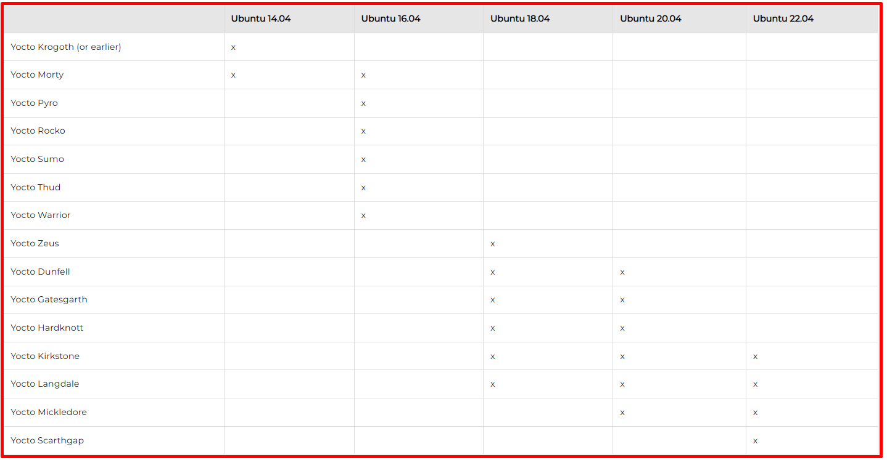   
</p>

***Các khái niệm***

+ Giao thức hiển thị đồ họa: X11, Wayland, v.v.
+ Các thư viện đồ họa: CGI, Kanzi, Qt,  v.v.
+ Build system đầu tiên xuất hiện là Buildroot
  + Mục tiêu ban đầu của Buildroot là sử dụng để build “root filesystems”
  + Buildroot dựa trên cấu trúc của Makefile, kconfig (công cụ cấu hình) và các bản vá lỗi cho các gói phần mềm khác nhau. 
  + Nhưng đến ngày này, ngoài việc dùng để build “root filesystems” thì Buildroot còn có thể được sử dụng để build “kernel” và “bootloader”.

+ Ra đời sau Buildroot không lâu là OpenEmbedded (viết tắt là OE)
  + Là công cụ để tạo ra các Linux distro
  + Sử dụng BitBake để thông dịch các files được gọi là các “recipes”
  + Một tính năng thú vị về OpenEmbedded là các “recipes” có thể chỉ định “dependencies” giữa các “packages”
  + BitBake sẽ phân tích tất cả các “recipes” và tạo ra một hàng đợi các “nhiệm vụ” – “tasks” cần phải làm theo đúng thứ tự

+ Một bản phân phối dựa trên OpenEmbedded khác là Poky Linux

***Poky là gì?***
+ Poky bao gồm OpenEmbedded Build System (BitBake + OpenEmbedded-Core) và một bộ các metadata mặc định có sẵn (bao gồm các recipes, các file cấu hình…) giúp chúng ta có thể bắt đầu build các Linux software packages của riêng mình

+ Poky = Bitbake + Metadata

+ Poky là một bản reference distro ví dụ của Yocto Project

+ Dự án Yocto sử dụng Poky để xây dựng hình ảnh (nhân, hệ thống và phần mềm ứng dụng) cho phần cứng được nhắm mục tiêu

+ Ở cấp độ kỹ thuật, nó là kho lưu trữ kết hợp của các thành phần
  + Bitbake
  + OpenEmbedded Core
  + meta-yocto-bsp
  + Documentation

+ Poky cho phép tạo ra một bộ công cụ hỗ trợ phát triển phần mềm (SDK – Software Development Kit) dành riêng  cho bản distro của ta. SDK này có thể được các engineers khác sử dụng để biên dịch các ứng dụng mà sau này sẽ chạy trên hệ thống Linux của ta

+ Sự khác biệt chính xác giữa Yocto và Poky là Yocto đề cập đến tổ chức (giống như người ta nói đến “Canonical”, công ty đứng sau Ubuntu) và Poky thì là 'Ubuntu'

+ Một số trường hợp thì metadata có sẵn của Poky không đủ để build ra software nên cần lấy từ nguồn khác bỏ vào ( ví dụ meta-ti...)
<p align="center">
  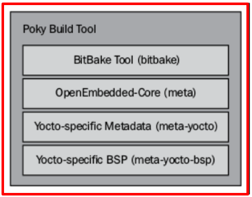   
</p>

+ Các Linux software packages có thể build dùng Poky bao gồm 
  + Bootloader Linux kernel 
  + Root filesystems 
  + Toolchains và Software Development Kits (SDKs) 

+ Ta mở folder source/poke lên sẽ thấy các file như ảnh dưới

<p align="center">
  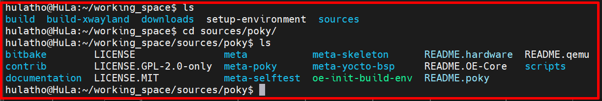   
</p>

***Metadata là gì***
+ Metadata là một tập dữ liệu mô tả và cung cấp thông tin về dữ liệu khác
+ Yocto sẽ chứa:
  + Metadata đề cập đến hướng dẫn xây dựng
  + Các lệnh và dữ liệu được sử dụng để cho biết phiên bản phần mềm nào được sử dụng và Chúng được lấy từ đâu
  + Những thay đổi hoặc bổ sung cho chính phần mềm (patches ) được sử dụng để sửa lỗi hoặc tùy chỉnh phần mềm để sử dụng trong một tình huống cụ thể
+ Metadata là tập hợp:
  + Configuration file (.conf)
  + Recipes( .bb and .bbappend)
  + Classes (.bbclass)
  + Include (.inc)

***OpenEmbedded là gì***
+ OpenEmbedded cung cấp môi trường biên dịch chéo tốt nhất. Nó cho phép ta tạo một bản phân phối Linux hoàn chỉnh cho các hệ thống nhúng.

+ Yocto project và OpenEmbedded chia sẻ một bộ sưu tập meta data cốt lõi được gọi là openembedded-core.

+ OpenEmbedded cung cấp một metadata toàn diện cho nhiều kiến trúc, tính năng và ứng dụng khác nhau

+ Yocto project tập trung vào việc cung cấp các công cụ, metadata và gói hỗ trợ bo mạch (BSP) mạnh mẽ, dễ sử dụng, có thể tương tác, được kiểm tra kỹ lưỡng cho một bộ kiến trúc cốt lõi và các bo mạch cụ thể.

+ Dự án Yocto và OpenEmbedded đã đồng ý hợp tác cùng nhau và chia sẻ một bộ metadata cốt lõi chung (recipes, classes và các tệp liên quan) là oe-core

***Bitbake***
+ Bitbake là thành phần cốt lõi của Dự án Yocto.

+ Về cơ bản nó thực hiện chức năng tương tự như make.

+ Đó là một công cụ lập lịch tác vụ phân tích mã hỗn hợp tập lệnh python và shell

+ Code được phân tích cú pháp sẽ tạo và chạy các tác vụ, về cơ bản là một tập hợp các bước được sắp xếp theo sự phụ thuộc của mã.

+ Nó đọc các recipes (công thức nấu ăn) và làm theo chúng bằng cách tìm nạp các gói, xây dựng chúng và kết hợp kết quả vào các image có thể khởi động.

+ Nó theo dõi tất cả các tác vụ đang được xử lý để đảm bảo hoàn thành, tối đa hóa việc sử dụng tài nguyên xử lý để giảm thời gian xây dựng và có thể dự đoán được.

***Meta-yocto-bsp***
+ A Board Support Package (BSP) là tập hợp thông tin xác định cách hỗ trợ một thiết bị phần cứng, bộ thiết bị hoặc nền tảng phần cứng cụ thể
+ BSP bao gồm thông tin về các tính năng phần cứng có trên thiết bị và thông tin cấu hình hạt nhân cùng với bất kỳ trình điều khiển phần cứng bổ sung nào được yêu cầu.
+ BSP cũng liệt kê bất kỳ thành phần phần mềm bổ sung nào được yêu cầu ngoài ngăn xếp phần mềm Linux chung cho cả các tính năng nền tảng thiết yếu và tùy chọn.
+ Lớp meta-yocto-bsp trong Poky duy trì một số BSP như Beaglebone, EdgeRouter và các phiên bản chung của cả máy IA 32 bit và 64 bit.
+ Các machine được hỗ trợ:
  + Texas Instruments BeagleBone (beaglebone)
  + Freescale MPC8315E-RDB (mpc8315e-rdb)
  + Intel x86-based PCs and devices (genericx86 and genericx86-64)
  + Ubiquiti Networks EdgeRouter Lite (edgerouter)
+ Lưu ý: Để phát triển trên các phần cứng khác nhau, ta sẽ cần bổ sung cho Poky các lớp Yocto dành riêng cho phần cứng

***Meta-poky***
+ Meta-poky, là siêu dữ liệu dành riêng cho Poky
+ Tài liệu chứa các tệp nguồn Dự án Yocto được sử dụng để tạo bộ hướng dẫn sử dụng.
+ Poky includes: 
  + Some OE components(oe-core)
	+ Bitbake
	+ Demo-BSP's
	+ Helper scripts to setup environment
	+ Emulator QEMU to test the image
<p align="center">
  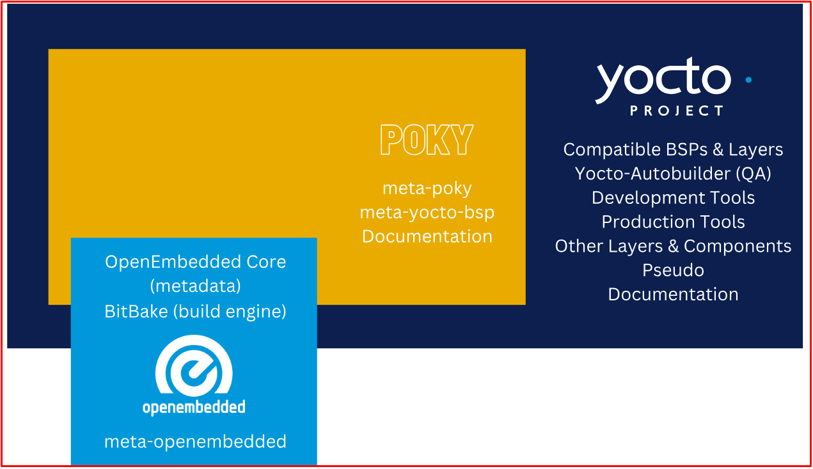   
</p>

***Workflow of Yocto Project***

+ Ta làm theo link docs sau: [LINK](https://www.yoctoproject.org/development/technical-overview/) và [LINK](https://docs.yoctoproject.org/brief-yoctoprojectqs/index.html) hoặc theo như bên dưới. Ở phần này mình đang làm với yocto Zues nhé.
+ Yocto zues

```s
Mkdir source
Cd source
Step 1: Download the Poky Source code
  $ git clone git://git.yoctoproject.org/poky
Step 2: Checkout the latest branch/release (zeus)
  $ git checkout zeus 
Step 3: Prepare the build environment
  Poky cung cấp cho bạn tập lệnh 'oe-init-build-env', tập lệnh này sẽ được sử dụng để thiết lập môi trường xây dựng,
  script sẽ thiết lập môi trường của ta để sử dụng hệ thống xây dựng Yocto bao gồm thêm BitBake vào đường dẫn của ta
  $ source source/poky/oe-init-build-env [ build_directory ] (../build)
  echo $PATH : xem đường dẫn ta vừa add
  Ở đây build_directory là một đối số tùy chọn cho tên của thư mục nơi môi trường được đặt, nó mặc định là "build"
  Đoạn script trên sẽ chuyển ta vào build folder và tạo hai tệp (local.conf, bblayers.conf) bên trong thư mục conf
Step 4: Building Linux Distribution
  $ bitbake <image_name>
  $ time bitbake core-image-minimal
  core-image-minimal là một image nhỏ cho phép thiết bị khởi động và nó rất hữu ích cho việc kiểm tra và phát triển kernel và bootloader
```

+ Yocto kirkstone
```s
sudo apt-get install gawk wget git-core diffstat unzip texinfo gcc-multilib \
     build-essential chrpath socat cpio python3 python3-pip python3-pexpect \
     libsdl1.2-dev xterm make xsltproc docbook-utils fop dblatex xmlto
git clone -b kirkstone git://git.yoctoproject.org/poky/
cd poky
git clone -b kirkstone git://git.openembedded.org/meta-openembedded
git clone -b kirkstone git://git.yoctoproject.org/meta-ti
git clone -b kirkstone https://git.yoctoproject.org/meta-arm
```

***Run the generated image in QEMU***
+ Sau khi build core-image-minimal ra image thành công, ta có thể chạy image đó với QEMU để test thử, thay vì phải nạp vào mạch thật rắc rối
+ Quick Emulator ( QEMU ) là gói phần mềm mã nguồn mở và miễn phí thực hiện ảo hóa phần cứng.
+ Hiện nay mô phỏng được hỗ trợ cho: ARM, MIPS, MIPS64, PowerPC, X86, X86_64...
+ Poky cung cấp tập lệnh 'runqemu' cho phép ta khởi động QEMU bằng hình ảnh do yocto tạo
+ Tập lệnh runqemu được chạy dưới dạng:
```bash
runqemu <machine> <zimage> <hệ thống tập tin>
  <machine> là kiến trúc sẽ sử dụng (qemuarm/qemumips/qemuppc/qemux86/qemux86-64)    
  <zimage> là đường dẫn đến kernel (ví dụ zimage-qemuarm.bin)    
  <filesystem> là đường dẫn đến image ext2 (ví dụ: filesystem-qemuarm.ext2) hoặc thư mục nfs
```

+ Thoát QEMU bằng cách nhấp vào biểu tượng tắt máy hoặc bằng cách nhập Ctrl C trong QEMU
+ Tóm tắt các câu lệnh chạy:
```bash
$ nproc: kiểm tra có bao nhiêu core
$ free –m : kiểm tra ram
$ cd build
$ runqemu qemux86-64 core-image-minimal
```

***Steps to Generate ARM image and Run in QEMU***
+ Khi ta thiết lập môi trường xây dựng, tệp cấu hình cục bộ có tên local.conf sẽ có sẵn trong thư mục con conf của Build Directory
+ Các giá trị mặc định được đặt để xây dựng cho target qemux86-64, ta sẽ sửa lại thành qemuarm
```bash
$ vim ./build/conf/local.conf
Tìm biến MACHINE và set MACHINE = "qemuarm"
$ source poky/oe-init-build-env
$ bitbake core-image-minimal
$ runqemu core-image-minimal
```

***Không sử dụng Graphic***
+ Khi ta chạy lệnh "runqemu core-image-minimal" thì mặc định nó sẽ mwor lên cả 1 cái giao diện nữa, tuy nhiên ta không cần cái giao diện qq này. Ta sẽ đi tắt đi bằng cách thêm vào trong command nographic
```bash
$ runqemu core-image-minimal nographic
$ poweroff
```

***Thêm 1 Package vào root file system***
+ Để kiểm tra 1 pacgake có tồn tại hay không ta vào folder build và gõ như dưới, đang check Package git
> $ bitbake-layers show-recipes git

+ Để thêm một Package cụ thể vào root file system ta làm như sau:
```bash
Mở tệp local.conf của ta và thêm tên công thức bên dưới
IMAGE_INSTALL += "recipe-name"
Ví dụ: 
  + IMAGE_INSTALL += "usbutils" or IMAGE_INSTALL_append = " usbutils"
  + IMAGE_INSTALL:append = " git"
  + IMAGE_INSTALL:append = " python3"
$ runqemu core-image-minimal nographic
```

+ Khi thêm package rồi thì khi boot board lên ta có thể dùng nó
<p align="center">
  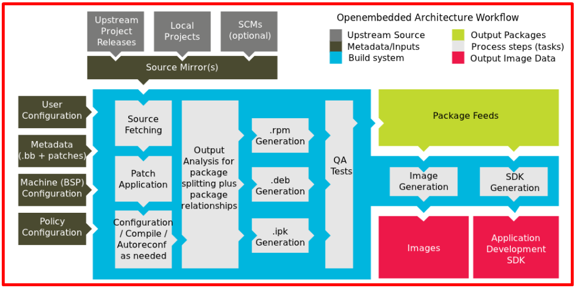   
</p>

***Recipes là gì***
+ Tập hợp các hướng dẫn mô tả cách chuẩn bị hoặc làm 1 món gì đó
+ Tuy nói nó là 1 tập hợp các hướng dẫn nhưng nó được đọc và xử lý bởi bitbake
+ Vì vậy tập hợp các hướng dẫn được bitbake xử lý, thì ta gọi là recipes trong yocto
+ Đuôi là .bb
+ 1 Recipes sẽ chứa các thông tin sau:
  + Nơi ta có thể lấy source code
  + Tất cả các bản vá (patchs) phải áp dụng sau khi tải mã nguồn về
  + Cách cấu hình code (config option)
  + compile option (library dêpndencies)
  + Install
  + License
+ Sau khi có thông tin ở trên xong thì bitbake sẽ tạo ra 1 tập hợp các nhiệm vụ được sắp xếp và sẽ thực hiện những nhiệm vụ này
+ Ví dụ về 1 recipe cơ bản
<p align="center">
  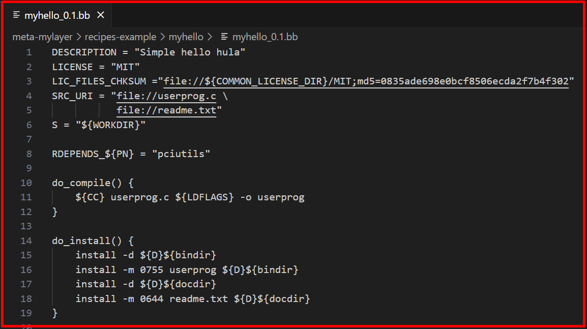   
</p>

***Configuration file***
+ Đuôi file sẽ là .conf
+ Các file config chứa:
  + định nghĩa chung của các biến
  + Chứa các biến do người dùng xác định
  + 1 số chứa thông tin cấu hình phần cứng
+ Các Configuration file này được hệ thống sử dụng để build và tạo image cho 1 phần cứng cụ thể
+ Nó đọc file này để biết sẽ xây dựng cái gì và image nào để tạo ra những gì cần có trong rootfs, bootloader nào sẽ tạo...
+ Có các loại file config khác nhau:
  + Machine Configuration Option
  + Distribution Configuration Options
  + Compiler turing Otion
  + General Common Configuration Optiton
  + User Configuration Option (local .conf)

***Class file là gì***
+ File Class được sử dụng theo chức năng chung trừu tượng và chia sẻ nó giữa nhiều recipe file (.bb)
+ Để sử dụng Class file, ta chỉ cần đảm bảo rằng recipe kế thừa Class đó là được
+ Đuôi: .bbclass
+ Chúng thường được đặt trong thư mục class bên trong thư mục meta (poky/meta/classes)
+ Ví dụ class:
  + cmake.bbclass: thực hiện cmake trong recipes
  + kernel.bbclass: thực hiện build kernel, chứa code để build all kernel tree
<p align="center">
  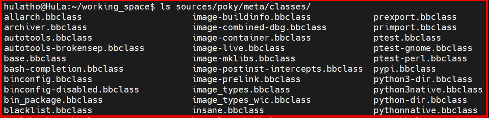   
</p>

***Layers là gì***
+ Việc đưa toàn bộ project của ta vào một Layer bị giới hạn và làm phức tạp việc custom và tái sử dụng trong tương lai.
+ Là 1 bộ tập hơp các recipes có liên quan đến nhau hoặc là nơi chứa recipe
+ Quy ước đặt tên điển hình: meta-<layername>
+ Poky có các Layer sau: meta, meta-poky, meta-selftest, meta-skeleton, meta-yocto-bsp
+ Layer cung cấp một cơ chế để tách biệt meta data theo chức năng, ví dụ như BSP, distribution configuration, v.v. Ta có thể có layer BSP, Layer GUI, Configuration distribute, middleware hoặc Aplication.
+ Ví dụ: 
  + meta-poky: Siêu dữ liệu của Distro          
  + meta-yocto-bsp: siêu dữ liệu BSP
+ Các layer cho phép dễ dàng thêm toàn bộ meta data và/hoặc thay thế các bộ bằng các bộ khác
+ Meta-poky: bản thân nó là một Layer được áp dụng trên layer metadata OE-Core

<p align="center">
  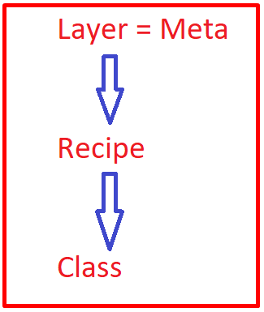   
</p>

<p align="center">
  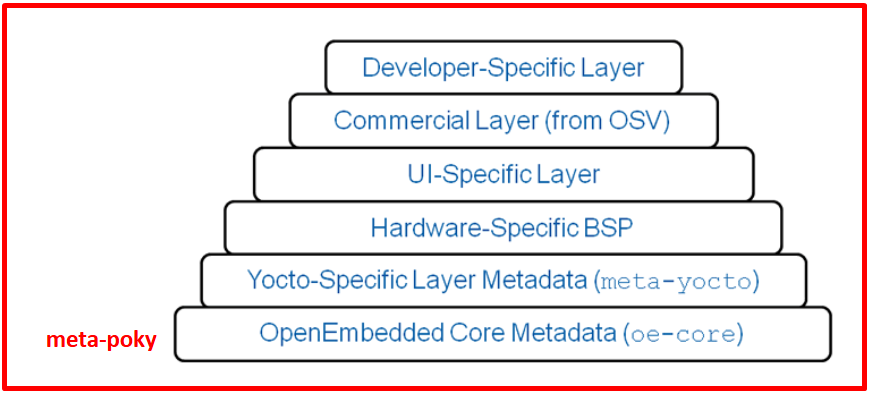   
</p>

+ Câu hỏi đặt ra: Những lớp nào được sử dụng bởi hệ thống xây dựng Poky?
  + Ta sẽ có biến BBLAYERS có trong file build/conf/bblayers.conf liệt kê các LAYER mà Bitbake sẽ dùng
  + Nếu bblayers.conf không xuất hiện khi ta khởi động build, hệ thống build OpenEmbedded sẽ tạo nó từ bblayers.conf.sample khi ta chạy lệnh oe-init-build-env
  + Ta có thể cung cấp bblayers.conf khác bằng cách dùng câu lệnh sau
    > TEMPLATECONF=$PWD/meta-renesas/meta-rz-distro/conf/templates/rz-conf/ source poky/oe-init-build-env build
  + Lệnh để tìm đang có những layer nào
    > $ bitbake-layers show-layers
  + Để thêm 1 layer mới thì ta mở file build/conf/bblayers.conf và thêm vào đây

<p align="center">
  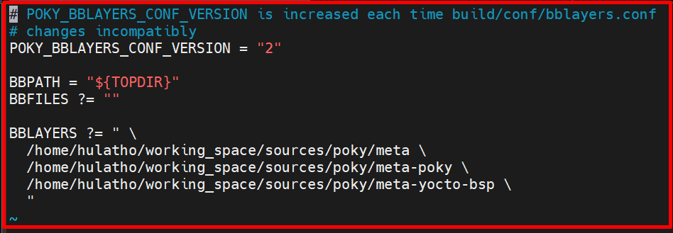   
</p>

***Image and Packages là gì***
+ Lệnh kiểm tra danh sách các recipe  hình ảnh có sẵn
> $ ls meta*/recipes*/images/*.bb
+ Packages là tệp nhị phân có tên *.rpm, *.deb hoặc *.ipkg
+ Một single recipe  tạo ra nhiều Packages. Tất cả các Packages mà recipe tạo ra đều được liệt kê trong variable recipe
+ Ví dụ ta kiểm tra biến PACKAGES
```bash
$ cd Poky
$ vim meta/recipes-multimedia/libtiff/tiff_4.0.10.bb
Check PACKAGES =+ "tiffxx tiff-utils"
```

***Poky source tree***
+ bitbake - Giữ tất cả các tập lệnh Python được sử dụng bởi lệnh bitbake
+ bitbake/bin - Được đặt vào biến môi trường PATH để có thể tìm thấy bitbake
+ Documentation - Tất cả các nguồn tài liệu cho tài liệu Dự án Yocto. Có thể được sử dụng để tạo các tệp PDF
+ meta - Chứa siêu dữ liệu oe-core
+ meta-poky - Giữ cấu hình cho phân phối tham chiếu Poky, local.conf.sample, bblayers.conf.sample đều có mặt ở đây
+ meta-skeleton - Chứa các công thức mẫu để phát triển BSP và kernel
+ meta-yocto-bsp - Duy trì một số BSP như Beaglebone, EdgeRouter,và các phiên bản chung của cả máy IA 32 bit và 64 bit.
+ Scripts - Chứa các tập lệnh được sử dụng để thiết lập môi trường, công cụ phát triển,và các công cụ để flash các hình ảnh được tạo ra trên mục tiêu.
+ License - Giấy phép mà Poky được phân phối (kết hợp giữa GPLv2 và MIT).

***Build dir - conf***
+ Khi ta chạy source poky/oe-init-build-env, nó sẽ tạo thư mục "build"
+ Bên trong thư mục build này, nó sẽ tạo thư mục "conf" chứa hai tệp: local.conf  bblayers.conf
+ File local.conf chứa các biến quan trọng sau:
  + Định cấu hình hầu hết mọi khía cạnh của hệ thống xây dựng, chứa cài đặt người dùng cục bộ
  + MACHINE: Máy nào đực tạo, Ví dụ: MACHINE = "qemux86-64"
  + DL_DIR: Nơi tải xuống, trong lần xây dựng đầu tiên, hệ thống sẽ tải xuống nhiều source code khác nhau, từ nhiều nguồn khác nhau. Tất cả đều được lưu trữ trong DL_DIR
  + TMP_DIR: Nơi đặt đầu ra bản dựng, Tùy chọn này chỉ định nơi phần lớn công việc xây dựng sẽ được thực hiện và nơi BitBake nên đặt các tệp tạm thời (trích xuất nguồn, biên dịch) và đầu ra
  + Tệp local.conf là một cách rất thuận tiện để ghi đè một số cấu hình mặc định trên tất cả các công cụ của Dự án Yocto.
  + Về cơ bản, chúng ta có thể thay đổi hoặc đặt bất kỳ biến nào, ví dụ: thêm các gói bổ sung vào file image
  + BB_NUMBER_THREADS
    + Xác định số lượng tác vụ mà Bitbake sẽ thực hiện song song
    + Các tác vụ này liên quan đến bitbake và không liên quan gì đến việc biên dịch
    + Mặc định về số lượng CPU trên hệ thống
    + $ bitbake -e core-image-minimal | grep ^BB_NUMBER_THREADS=
  + PARALLEL_MAKE
    + Tương ứng với tùy chọn -j make
    + chỉ định số lượng tiến trình mà GNU thực hiện có thể chạy song song trên một tác vụ biên dịch
    + Mặc định về số lượng CPU trên hệ thống
    + $ bitbake -e core-image-minimal | grep ^PARALLEL_MAKE=

    <p align="center">
      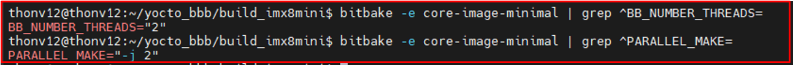   
    </p>

***Các folder quan trọng khác***
+ Downloads: downloaded upstream tarballs/git repositories of the recipes used in the build
+ sstate-cache - bộ đệm state được chia sẻ
+ tmp - Giữ tất cả đầu ra của hệ thống xây dựng
+ tmp/deploy/images/machine - Hình ảnh có mặt ở đây
+ cache - cache được sử dụng bởi trình phân tích cú pháp của bitbake

***Image được tạo bởi Poky Build***
+ Quá trình xây dựng ghi hình ảnh vào Build Directory  bên trong thư mục tmp/deploy/images/machine/
1. kernel-image :
  + A kernel binary file
  + Biến KERNEL_IMAGETYPE xác định sơ đồ đặt tên cho tệp hình ảnh hạt nhân.
  + cd build/tmp/deploy/images/qemux86-64
  + $ bitbake -e core-image-minimal | grep ^KERNEL_IMAGETYPE=
2. root-filesystem-image
  + Root filesystems for the target device (e.g. *.ext3 or *.bz2 files).
  + Biến IMAGE_FSTYPES xác định loại hình ảnh hệ thống tập tin gốc
  + Cd build/tmp/deploy/images/qemux86-64
  + $ bitbake -e core-image-minimal | grep ^IMAGE_FSTYPES=
3. kernel-modules
  + Tarball ( như .zip) chứa tất cả các mô-đun được xây dựng cho kernel
4. bootloaders
  + Nếu áp dụng cho máy mục tiêu, bộ nạp khởi động hỗ trợ hình ảnh

***Tiết kiệm ổ đĩa***
+ Tiết kiệm dung lượng ổ đĩa khi xây dựng Yocto
+ Hệ thống xây dựng Yocto có thể chiếm nhiều dung lượng ổ đĩa trong quá trình xây dựng. Nhưng bitbake cung cấp các tùy chọn để bảo toàn dung lượng ổ đĩa. nếu bạn muốn loại trừ mã nguồn xóa bitbake của một gói cụ thể, ta có thể thêm nó vào RM_WORK_EXCLUDE += "recipe-name"
```bash
$ Cd build/conf/local.conf
$ RM_WORK_EXCLUDE += "core-image-minimal"
```

***Build yocto image cho BBB***
```bash
$ source source/poky/oe-init-build-env build_bbb
$ vim conf/local.conf ( mở MACHINE ?= "beaglebone-yocto" ra)
$ bitbake core-image-minimal
```
<p align="center">
  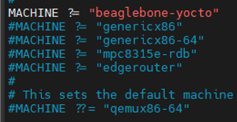   
</p>

+ Sau khi quá trình xây dựng hoàn tất, ta sẽ có image của mình tại tmp/deploy/images/beaglebone-yocto/
+ Thư mục này chứa
  + first-level bootloader MLO,
  + second-level bootloader u-boot (u-boot.img)
  + kernel image (zImage)
  + device tree blobs,
  + a root filesystem archive  (core-image-minimal-beaglebone-yocto.tar.bz2)
  + a modules archive.

***Booting Process in Beaglebone black***
+ Bốn giai đoạn bootloader là:
1. ROM code
2. SPL (or Secondary Program Loader)
3. U-BOOT
4. Linux Kernel

***1st Stage Bootloader: ROM Code***
+ Bộ tải khởi động giai đoạn đầu tiên được Texas Instruments flash vào ROM trên thiết bị.
+ Mã ROM là khối mã đầu tiên được tự động chạy khi khởi động thiết bị hoặc sau khi khởi động lại nguồn (POR)
+ Mã bootloader ROM được mã hóa cứng vào thiết bị và người dùng không thể thay đổi được.
+ Mã ROM có hai chức năng chính:
  - Cấu hình thiết bị và khởi tạo các thiết bị ngoại vi chính
    + Thiết lập ngăn xếp
    + Định cấu hình Bộ hẹn giờ Watchdog 1 (đặt thành ba phút)
    + Cấu hình PLL và Đồng hồ hệ thống
  - Thiết bị sẵn sàng cho bộ nạp khởi động tiếp theo
    + Kiểm tra nguồn khởi động cho bộ tải khởi động tiếp theo (SPL)
    + Di chuyển mã bootloader tiếp theo vào bộ nhớ để chạy
+ Mục đích chính của mã ROM là thiết lập thiết bị cho bộ nạp khởi động giai đoạn thứ hai.
+ Theo mặc định, mã ROM trong Sitara AM3359 sẽ khởi động từ giao diện MMC1 trước tiên (eMMC tích hợp), tiếp theo là MMC0 (uSD bên ngoài), UART0 và USB0.
+ Nếu công tắc khởi động (S2) được giữ trong khi bật nguồn, ROM sẽ khởi động từ Giao diện SPI0 trước tiên, tiếp theo là MMC0 (uSD bên ngoài), USB0 và UART0.

***2nd Stage Bootloader: SPL***
+ Một phiên bản U-Boot đầy đủ tính năng có thể trên 400KB và RAM bên trong trên AM335X là 128KB
+ Do đó không thể tải cái này ngay lập tức
+ Vì lý do này, một phiên bản rút gọn của U-Boot có tên U-Boot SPL (Trình tải chương trình thứ hai) sẽ được tải trước tiên, sau khi khởi tạo CPU, nó sẽ tải một phiên bản U-Boot đầy đủ tính năng (u-boot.img).
+ Tên của SPL phải là MLO
+ Nó phải được đặt trên phân vùng hoạt động đầu tiên của MMC, phân vùng này phải được định dạng là FAT12/16/32

***3rd Stage Bootloader - U-Boot***
+ U-BOOT cho phép kiểm soát dựa trên lệnh mạnh mẽ trên môi trường khởi động kernel thông qua thiết bị đầu cuối nối tiếp
+ Người dùng có quyền kiểm soát một số tham số như đối số khởi động và lệnh khởi động kernel
+ Ngoài ra, các biến môi trường U-boot có thể được cấu hình.
+ Các biến môi trường này được lưu trữ trong tệp uEnv.txt trên phương tiện lưu trữ của bạn.
+ Môi trường tích hợp trong u-boot tải am335x-boneblack.dts mặc định để chuyển tới kernel khi khởi động.
+ Trong uEnv.txt, bạn có thể chỉ định rõ ràng một DTS khác cũng như các đối số dòng lệnh để chuyển tới kernel
+ U-boot cũng có khả năng lấy thông tin mạng qua DHCP và tải nó vào các biến môi trường.
+ Cuối cùng U-boot tải kernel và DTS vào bộ nhớ và khởi động kernel bằng một số đối số dòng lệnh
+ kernel  khởi tạo và gắn kết  root filesystem.
+ Theo mặc định, root filesystem được chứa trong phân vùng thứ hai (mmcblk0p2) của thẻ nhớ microSD, được định dạng cho hệ thống tập tin ext3.

***Tạo partition cho Thẻ nhớ***
```bash
+ lsblk  : sẽ thấy sdb ( sdb1 sdb2)
1. Ngắt kết nối bất kỳ phân vùng đã gắn nào bằng lệnh umount:
$ umount /dev/sdb1
$ umount /dev/sdb2
2. xóa (các) phân vùng trước đó
$ sudo fdisk /dev/sdb
Command (m for help): d ( sau đó chọn partition 1) : d là delete
Bấm p để kiểm tra lại
3. Tạo phân vùng mới có tên BOOT 32 MB và type Primary:
 n p 1 enter +32MB
4. Tạo phân vùng thứ hai để chứa rootfs. Ta sẽ cung cấp tất cả không gian còn lại cho phân vùng này:
N p 2 enter can
5. Làm cho phân vùng đầu tiên có khả năng khởi động bằng cách đặt cờ khởi động: a 1 
6. Đặt phân vùng đầu tiên là WIN95 FAT32 (LBA): t 1 L c
7. Đặt phân vùng thứ 2: t 2 L 83
Lưu và thoát w
$ sudo mkfs.vfat -n "BOOT" /dev/sdb1
$ sudo mkfs.ext4 -L "ROOT" /dev/sdb2
```

***Copy vô thẻ nhớ***
+ sudo mkdir /media/thonv12/BOOT       
+ sudo mkdir /media/thonv12/ROOT
+ cd tmp/deploy/images/beaglebone-yocto/
+ Copy image u-boot MLO và u-boot bootloader vào phân vùng FAT32:
  + $ sudo cp MLO /media/$USER/BOOT
  + $ sudo cp u-boot.img /media/$USER/BOOT
  + $ sudo cp zImage /media/$USER/BOOT
  + $ sudo cp am335x-boneblack.dtb /media/$USER/BOOT
  + $ sudo tar -xf core-image-minimal-beaglebone-yocto.tar.bz2 -C /media/$USER/ROOT/
  + $ sudo umount /dev/sdb1
  + $ sudo umount /dev/sdb2

***Khởi động từ MMC***
+ Cắm nguồn nhấn enter liên tục
+ mmc dev 1 : chọn thẻ eMMC
+ mmc erase 0 512 : thực hiện xóa để BeagleBone không cố khởi động từ eMMC
+ Nhập root

***BSP layer***
+ Tập hợp thông tin (metadata) xác định cách hỗ trợ một thiết bị phần cứng, bộ thiết bị hoặc nền tảng phần cứng cụ thể
+ Quy ước đặt tên: meta-<bsp_name>
+ conf/machine/*.conf liệt kê tất cả các thiết bị phần cứng được lớp BSP hỗ trợ

***Add meta-TI***
+ $ cd yocto_bbb
+ $ git clone git://git.yoctoproject.org/meta-ti
+ git checkout zeus
+ Cd conf/machine   sau đó ls sẽ thấy có 1 mớ file
+ vim beaglebone.conf   : ta sẽ thấy device tree
+ vim beagleboard.conf  : ta sẽ thấy cấu hình MACHINE
+ vim pandaboard.conf  : ta thấy nó chỉ đi cấu hình cổng nối tiếp

***meta-ti vs meta-yocto-bsp***
+ meta-yocto-bsp:
  + cung cấp BSP "tham chiếu" cho từng kiến trúc được hỗ trợ
  + Một dành cho ARM (BeagleBone Black), một dành cho MIPS, PPC và x86.
  + Nó dựa trên kernel/bootloader dòng chính
  + Không hỗ trợ bất kỳ tính năng nâng cao nào hoặc bất kỳ thứ gì không có trong kerrnel
  + Mục đích của BSP này là để có một số trải nghiệm cơ bản ngay từ đầu đối với các nền tảng phần cứng được chọn trong Poky để đánh giá Dự án Yocto và khung OpenEmbedded, chứ không phải các nền tảng phần cứng cụ thể
+ meta-ti
  + BSP chính thức của Texas Instruments cung cấp latest WIP "staging" kernel và bootloader
  + Hầu hết các tính năng nâng cao và hỗ trợ ngoại vi cho nhiều nền tảng TI mới nhất

***Add meta-IT cho yocto***
+ cd yocto_bbb
+ source ./poky/oe-init-build-env build_bbb
+ bitbake-layers show-layers

+ Ta muốn thêm meta-ti vào thì:
  + vim conf/bblayers.conf và thêm vào như hình bên
  + Sau đó bitbake-layers show-layers
<p align="center">
  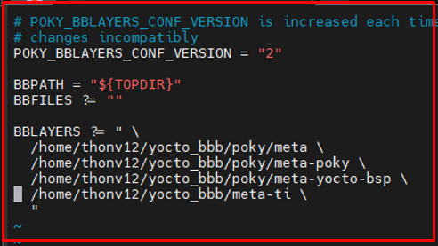   
</p>
<p align="center">
  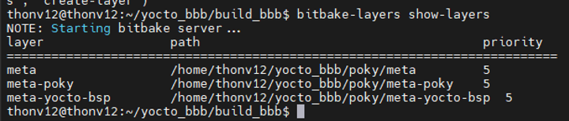   
</p>

***Các bước build image với meta-ti***

+ Bước 1: tìm source environment
  + $ source poky/oe-init-build-env
+ Bước 2: add layer meta-ti
  + bitbake-layers add-layer /home/thonv12/yocto_bbb/meta-ti
+ Bước 3: Mở local.conf và đặt Machine thành beaglebone
  + MACHINE='beaglebone’ ( trước đây build là build trong poky/meta-yocto-bsp và file là beaglebone-yocto.conf trong chỗ meta-ti/conf/machine nên sẽ để MACHINE là beaglebone-yocto   còn giờ là build trong meta-ti và tên của file đó là beaglebone.conf thôi nên tên của MACHINE sẽ là beaglebone)
  + vim conf/local.conf    và sửa
  + bitbake -e core-image-minimal | grep ^MACHINE           kiểm tra ( mất vài phts ☺))
+ Bước 4: Đồng thời thêm INHERIT += "rm_work" để tiết kiệm dung lượng ổ đĩa
  + vim conf/local.conf và thêm vào cuối cùng
+ Bước 5: generate 1 hình ảnh minimal
  + $ bitbake core-image-minimal
+ Bước 6: lấy kết quả
  + Ở đây $BUILDDIR/tmp/deploy/images/beaglebone


### 2️⃣ Operators
***Cách kiểm tra giá trị 1 biến***
+ Lệnh này hiển thị các giá trị thay đổi sau khi các tệp cấu hình (tức là local.conf, bblayers.conf, bitbake.conf, v.v.) đã được phân tích cú pháp.
> $ bitbake -e 
+ Recipe:
> $ bitbake recipe -e | grep VARIABLE=
+ cd tới source/poky/meta/recipes-core/images/core-image-minimal.bb: trong đây có biến LICENSE
  + Để kiểm tra được các biến trong đây thì cần: bitbake core-image-minimal –e
  + Sau đó bitbake core-image-minimal –e | grep ^LICENSE=

+ Chạy bitbake –e trước rồi mới kiểm tra biến được

+ Khi configuration change thì bitbake -e | grep ^VARIABLE=

+ Khi recipe change thì bitbake recipe -e | grep VARIABLE=

+ Các file .conf (local bblayers) đều kiểm tra được biến hết

<p align="center">
  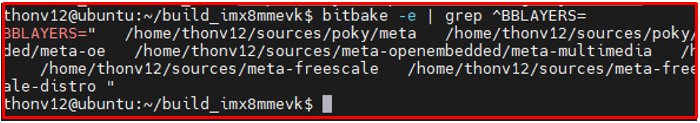   
</p>

***Biến***
+ Vào file local.conf và thêm vào dưới
  + A = "thonv12" : gán ngay lập tức
  + B = "${A} hello"
+ ?= : 
  + đặt giá trị mặc định
  + Nếu biến có giá trị thì phép gán sẽ bị mất
  + Nếu có nhiều ?= thì thằng đầu tiên sẽ được chạy
+ ??= : 
  + đặt giá trị mặc định yếu  hơn
  + Khi có nhiều "??=", thằng cuối cùng sẽ được sử dụng
  + Ví dụ:
    + MACHINE ??= "qemux86"
    + MACHINE ??= "qemuarm“
    + Nếu MACHINE không được đặt thì giá trị của MACHINE = "qemuarm" Nếu MACHINE được đặt, trước các câu lệnh thì giá trị sẽ không bị thay đổi

***Mở rộng biến***
+ Toán tử ":=" dẫn đến nội dung của biến được mở rộng ngay lập tức, thay vì khi biến đó thực sự được sử dụng
+ Toán tử "=" không ngay lập tức mở rộng các tham chiếu biến ở phía bên phải, việc mở rộng được trì hoãn cho đến khi biến được gán được sử dụng.
```bash
A = "hello“
B = "${A} world“
$ bitbake -e | grep ^A=
$ bitbake -e | grep ^B=

A = "${B} hello“
B = "${C} world“
C = "linux“
$ bitbake -e | grep ^A=

A = "11“
B = "B:${A}“
A = "22“
C := "C:${A}“
D = "${B}“

A = "11“
B := “
B:${A}“
A = "22“
C := "C:${A}“
D = "${B}"
```

+ Sự khác biệt giữa += và .= là khoảng trắng được tự động thêm vào +=
  + A = "hello"    A += "world"   A = "hello"   A .= " world"  

+ Ta có thể thêm vào trước giá trị của biến theo cú pháp ghi đè, ki này sẽ không có dấu cách nào thêm vào
  + A = "hello"  A_append = " world"

+ Bạn có thể xóa các giá trị khỏi danh sách bằng cú pháp kiểu ghi đè xóa
  + FOO = "123 456 789 123456 123 456 123 456"
  + FOO_remove = "123"
  + bitbake -e | grep ^FOO=

### 3️⃣ Custom Yocto

***What is a layer***
+ 1 layer là 1 tập hợp các recipes có liên quan đến nhau
+ Các type của layer: oe-core, BSP Layer, application layer
+ Tên lớp bắt đầu bằng meta-xxx
+ Tại sao cần tạ 1 lớp meta layer:
  + Mặc dù hầu hết các tùy chỉnh có thể được thực hiện bằng tệp cấu hình local.conf nhưng không thể:
    + Lưu trữ recipes cho các dự án phần mềm của riêng mình
    + Tạo hình ảnh của riêng mình
    + Hợp nhất các bản vá/sửa đổi cho recipes của người khác
    + Thêm kernel tùy chỉnh mới
    + Thêm machine mới
+ Điểm quan trọng nhất: Không chỉnh sửa Lớp POKY/UPSTREAM, vì nó làm phức tạp các bản cập nhật trong tương + lai
+ Ưu điểm: Điều này cho phép ta dễ dàng chuyển từ phiên bản Poky này sang phiên bản khác
+ Tùy thuộc vào type lớp, để thêm nội dung:
  + Nếu layer  đang thêm support cho machine, hãy thêm configuration vào conf/machine/
  + Nếu layer đang thêm distro policy, hãy thêm distro configuration trong conf/distro/
  + Nếu layer giới thiệu new recipes, hãy đặt các recipes ta cần vào thư mục con recipes-* layer directory
+ Thư mục Recipe  bên trong layers
  + Theo quy ước, công thức nấu ăn được chia thành các loại
  + Phần khó khăn nhất là quyết định xem công thức của ta sẽ thuộc loại nào
+ Layer Priority
+ Mỗi lớp có một mức độ ưu tiên, được bitbake sử dụng để quyết định lớp nào được ưu tiên nếu có các file công thức có cùng tên trong nhiều lớp
+ Giá trị số cao hơn thể hiện mức độ ưu tiên cao hơn.
+ Ở trong source/poky/meta:
  + Sẽ có rất nhiều recipes
  + Mỗi recipes sẽ có chức năng khác nhau
  + Xem file recipes.txt để biết recipes để biết thêm chi tiết
  + Nếu ta thêm 1 recipes liên quan đến kernel thì thêm recipes-kernel vào
  + Nếu liên quan đến wifi thì thêm recipes-connectivity vào

***Create layer***
+ Có hai cách để tạo lớp của riêng ta: Manually và Using script

+ Create layer bằng tay
  + Bước 1:
    + Tạo folder meta-mylayer trong source
  + Bước 2: Tạo conf/layer.conf
    + Đi copy cho nhanh
  + Bước 3: update vào bblayer.conf
```bash
Cd source
Mkdir meta-mylayer
Cd meta-mylayer
Mkdir conf
Cd conf
cp ../../poky/meta-skeleton/conf/layer.conf ./
Vim layer.conf : sửa tất cả từ skeleton thành mylayer
Cd build_bbb
Vim conf/bblayer.conf: them meta-mylayer của ta vào
bitbake-layers show-layers
```

<p align="center">
  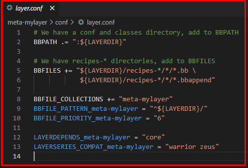   
</p>

+ Create layer bằng scrip
  + Ta có thể tạo lớp của riêng mình bằng lệnh bitbake-layers create-layer
    + bitbake-layers create-layer –help
    + Công cụ này tự động hóa việc tạo lớp bằng cách thiết lập thư mục con với tệp cấu hình layer.conf, thư mục con recipes-example chứa công thức example.bb, tệp cấp phép và README
```bash
Cd build
bitbake-layers create-layer ../source/meta-mylayer
Default priority of the layer is 6
bitbake-layers add-layer ../source/meta-mylayer
bitbake-layers show-layers
ls ../source/meta-mylayer/
```

+ Cách này tạo sẵn mọi thứ cho ta luôn, kể cả recipes, nên recommend dùng cách 2

***layer.conf trong meta-mylayer***
+ cd source/meta-mylayer
+ vim conf/layer.conf
+ Thư mục meta-mylayer được thêm vào BBPATH
  > BBPATH .= ":${LAYERDIR}"
+ Recipes của layer được thêm vào BBFILES: Tất cả .bb và .bbappend thêm vào cả
  > BBFILES += "${LAYERDIR}/recipes-*/*/*.bb ${LAYERDIR}/recipes-*/*/*.bbappend"
+ Biến BBFILE_COLLECTIONS sau đó được thêm vào tên lớp
  > BBFILE_COLLECTIONS += "meta-mylayer"
  > BBFILE_PATTERN_meta-mylayer = "^${LAYERDIR}/"
+ Biến BBFILE_PRIORITY sau đó chỉ định mức độ ưu tiên cho lớp.
  + BBFILE_PRIORITY_meta-mylayer = "6"
+ Điều này chỉ nên được tăng lên khi có những thay đổi quan trọng sẽ gây ra vấn đề tương thích với các lớp khác
  > LAYERVERSION_meta-mylayer = "1"
  > LAYERDEPENDS_meta-mylayer = "core"
  > LAYERSERIES_COMPAT_meta-mylayer = "warrior zeus"

***yocto-check-layer***
+ Tập lệnh yocto-check-layer cung cấp cho ta cách đánh giá mức độ tương thích của layer của ta với Dự án Yocto
+ Cd yocto_bbb/source
+ yocto-check-layer meta-mylayer: ta sẽ thấy được PASS hay FAIL
<p align="center">
  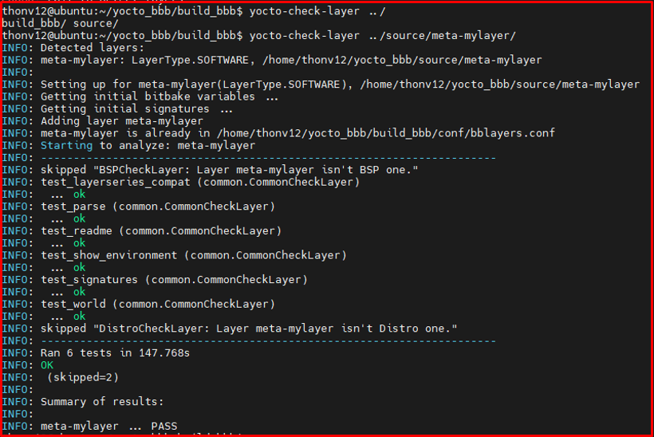   
</p>

***IMAGE***
+ Image is a top level recipe, Nó kế thừa một image.bbclass
+ Xây dựng hình ảnh tạo ra toàn bộ bản distribution Linux từ nguồn:
  + Compiler, tools, libraries
  + BSP: Bootloader, Kernel
  + Root filesystem:Base OS, services, Applications, ...
+ Ta thường cần tạo Image recipe của riêng mình để thêm các gói hoặc chức năng mới
  + Tạo một hình ảnh từ đầu
  + Mở rộng công thức hiện có (nên như này)

***Package group***
+ Recipe đi kế thừa package group
+ Package group là một tập hợp các package có thể được đưa vào bất kỳ hình ảnh nào.
+ Một Package group có thể chứa một tập hợp các package. 
+ Sử dụng tên Package group trong biến IMAGE_INSTALL để cài đặt tất cả các package được Package group xác định vào root file system của hình ảnh của ta.
+ Có nhiều Package group. Có mặt trong các thư mục con có tên là "packagegroups"
+ cd source/poky/meta
+ find . -name 'packagegroups’
+ Chúng là các recipe file (.bb) và bắt đầu bằng packagegroup-
+ Ví dụ:  packagegroup-core-boot: Cung cấp bộ gói tối thiểu cần thiết để tạo image có thể khởi động bằng console.
<p align="center">
  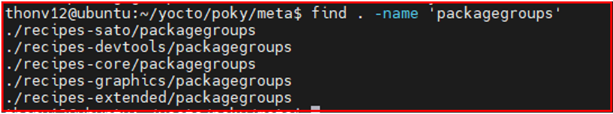   
</p>

***Tạo một IMAGE từ đầu***
+ Cách đơn giản nhất là kế thừa core-image.bbclass, vì trong thằng này đã kế thừa image rồi
+ IMAGE_INSTALL để chỉ định các gói cần cài đặt vào hình ảnh thông qua image.bbclass.
+ Cd source/poky/meta/classes   vim core-image.bbclass
<p align="center">
  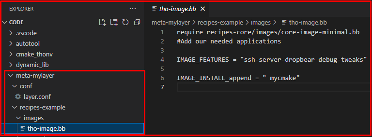   
</p>
<p align="center">
  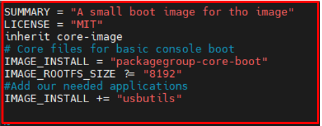   
</p>

+ cd source/meta-mylayer
+ mkdir -p recipes-examples/images
+ vim recipes-examples/images/tho-image.bb
+ Nội dung file
```bash
SUMMARY = "A small boot image for tho image"
LICENSE = "MIT"
inherit core-image
# Core files for basic console boot
IMAGE_INSTALL = "packagegroup-core-boot"
IMAGE_ROOTFS_SIZE ?= "8192"
#Add our needed applications
IMAGE_INSTALL += "usbutils"
```

+ Sau khi them image tho-image xong ta kiểm tra:
```bash
Cd build_bbb
bitbake -e tho-image | grep ^IMAGE_INSTALL=
Sau đó
bitbake tho-image
runqemu nographic
Khi này gõ lệnh cmd “lsusb” sẽ thành công
poweroff
```
<p align="center">
  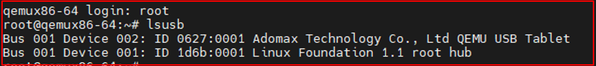   
</p>

***Sử dụng lại hình ảnh hiện có***
+ Khi một hình ảnh gần như phù hợp với nhu cầu của chúng ta và chúng ta cần thực hiện những điều chỉnh nhỏ trên đó, việc sử dụng lại mã của nó sẽ rất thuận tiện
+ Điều này làm cho việc bảo trì mã dễ dàng hơn và làm nổi bật sự khác biệt về chức năng
+ Ví dụ: nếu chúng ta muốn include  một application  (lsusb) ( lệnh )
+ Xoá nội dung của recipe cũ đi và them này vào:
  + vim recipes-examples/images/tho-image.bb
  + require recipes-core/images/core-image-minimal.bb  : khi require thì bất kì thứ gì trong file này ta có thể sử dụng được
  + IMAGE_INSTALL_append = " usbutils“
  + Sau khi xong thì bitbake tho-image
  + runqemu nographic   poweroff

<p align="center">
  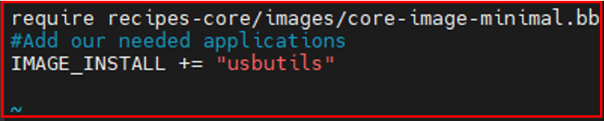   
</p>

***Image feature***
+ Ta có thể chỉnh image thông qua 2 biến này IMAGE_FEATURES và EXTRA_IMAGE_FEATURES
+ IMAGE_FEATURES/EXTRA_IMAGE_FEATURES được tạo để kích hoạt các tính năng đặc biệt cho hình ảnh của ta, chẳng hạn như mật khẩu trống cho root, debug image, special packages, x11, splash, ssh-server
+ Cách thực hành tốt nhất là
  + Use IMAGE_FEATURES from a recipe
  + Use EXTRA_IMAGE_FEATURES from local.conf
+ Để hiểu cách các tính năng này hoạt động, ta tham khảo poky/meta/classes/core-image.bbclass
+ Lớp này liệt kê các IMAGE_FEATURES có sẵn như debug-tweaks và read-only-rootfs.
+ Dựa trên thông tin này, hệ thống xây dựng sẽ tự động thêm các gói hoặc cấu hình thích hợp vào biến IMAGE_INSTALL

***Ví dụ về IMAGE_FEATURES***
+ vim recipes-examples/images/tho-image.bb
+ require recipes-core/images/core-image-minimal.bb  : khi require thì bất kì thứ gì trong file này ta có thể sử dụng được
+ IMAGE_INSTALL_append = " usbutils"
+ IMAGE_FEATURES = "debug-tweaks"  (khi này chạy thì sẽ không cần mật khẩu để đăng nhập nữa)
+ bitbake -e tho-image | grep ^IMAGE_FEATURES=
+ Sau khi xong thì bitbake tho-image
+ runqemu nographic poweroff

<p align="center">
  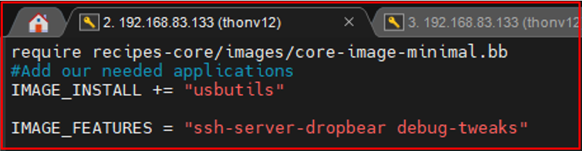   
</p>

***Read-Only Root Filesystem***
+ Làm thế nào để làm nó?
  + Để tạo Read-Only Root Filesystem, chỉ cần thêm tính năng "rootfs Read-Only" vào hình ảnh của bạn.
+ IMAGE_FEATURES = "read-only-rootfs" trong công thức của bạn Hoặc EXTRA_IMAGE_FEATURES += "read-only-rootfs" trong local.conf
+ Boot Splash screen: Hình ảnh logo khi chạy á mà, nhớ rumqemu phảp có graphic
  + IMAGE_FEATURES += "splash"
  + Or EXTRA_IMAGE_FEATURES += "splash"
+ Một số tính năng khác
  + tools-debug: Cài đặt các công cụ gỡ lỗi như strace và gdb.
  + tools-sdk: Cài đặt SDK đầy đủ chạy trên thiết bị.
	
***IMAGE_LINGUAS***
+ Chỉ định danh sách các ngôn ngữ để cài đặt vào hình ảnh trong quá trình xây dựng hệ thống tập tin gốc
+ IMAGE_LINGUAS = "zh-cn"
<p align="center">
  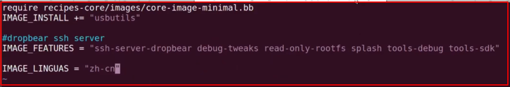   
</p>

***IMAGE_FSTYPES***
+ Biến IMAGE_FSTYPES xác định root filesystem image type
+ Nếu có nhiều định dạng được chỉ định, một hình ảnh cho mỗi định dạng sẽ được tạo
+ Hướng dẫn định dạng hình ảnh được cung cấp trong Poky: meta/classes/image_types.bbclass
+ bitbake -e <image_name> | grep ^IMAGE_FSTYPES=
+ Types supported: container     cpio     cpio.gz     cpio.lz4     cpio.lzma     cpio.xz     cramfs     elf     ext2     ext2.bz2     ext2.gz     ext2.lzma     ext3     ext3.gz     ext4     ext4.gz     f2fs     hddimg     iso     jffs2     jffs2.sum     multiubi     squashfs     squashfs-lz4     squashfs-lzo     squashfs-xz     tar     tar.bz2     tar.gz     tar.lz4     tar.xz     ubi     ubifs     wic     wic.bz2     wic.gz     wic.lzma

***IMAGE_NAME***
+ Tên của tệp hình ảnh đầu ra trừ đi phần mở rộng
+ Biến này được lấy bằng cách sử dụng các biến IMAGE_BASENAME, MACHINE và DATETIME
+ IMAGE_NAME = "${IMAGE_BASENAME}-${MACHINE}-${DATETIME}"
+ Ta muốn đổi tên image thì:
  + vim recipes-examples/images/tho-image.bb
  + Thêm vào cuối cùng:
    + IMAGE_NAME = "thonv"
  + Bitbake tho-image
  + Cd build_bbb và runqemu nographic
<p align="center">
  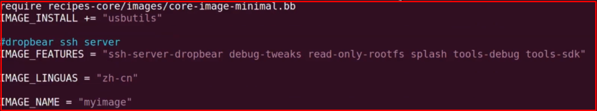   
</p>

***IMAGE_MANIFEST***
+ The manifest file for the image
  + Tệp này liệt kê tất cả các gói đã cài đặt tạo nên hình ảnh.
  + Lớp hình ảnh định nghĩa tệp kê khai như sau:
    + IMAGE_MANIFEST = "${DEPLOY_DIR_IMAGE}/${IMAGE_NAME}.rootfs.manifest“
  + cd build_bbb/tmp/deploy/images/qemux86-64
  + vim myimage.rootfs.manifest

***Recipes***
+ Recipes là thành phần cơ bản trong môi trường Dự án Yocto.
+ Recipes Yocto/OpenEmbedded là một tệp văn bản có phần mở rộng tệp .bb
+ Mỗi thành phần phần mềm được xây dựng bởi hệ thống xây dựng OpenEmbedded yêu cầu một công thức để xác định thành phần đó
+ Một công thức chứa thông tin về một phần mềm.
+ Những thông tin trong recipe:
  + Vị trí để tải xuống source
  + Bất kỳ bản vá nào được áp dụng cho nguồn đó (nếu cần)
  + Tùy chọn cấu hình đặc biệt để áp dụng
  + Cách biên dịch các tập tin nguồn
  + Cách đóng gói đầu ra đã biên dịch

***Recipe File Format***
+ File Format: <base_name>_<version>.bb
+ Ví dụ: file dropbear_2019.78.bb trong poky/meta/recipes-core/dropbear có
  + base name    : dropbear
  + version      : 2019.78

***Bitbake – build 1 recipe***
+ Công cụ xây dựng bitbake của Yocto/OpenEmbedded phân tích một công thức và tạo danh sách các tác vụ mà nó có thể thực thi để thực hiện các bước xây dựng
+ Nhiệm vụ quan trọng nhất là
  + do_fetch Lấy mã nguồn
  + do_unpack Giải nén mã nguồn vào một thư mục làm việc
  + do_patch Xác định vị trí các tập tin vá lỗi và áp dụng chúng vào mã nguồn
  + do_configure Định cấu hình nguồn bằng cách bật và tắt mọi thời gian xây dựng và các tùy chọn cấu hình cho phần mềm đang được xây dựng
  + do_compile Biên dịch mã nguồn trong thư mục biên dịch
  + do_install Sao chép các tập tin từ thư mục biên dịch vào vùng lưu trữ
  + do_package Phân tích nội dung của vùng lưu trữ và chia nó thành các tập con dựa trên các gói và tập tin có sẵn
  + do_package_write_rpm Tạo các gói RPM thực tế và đặt chúng vào khu vực Nguồn cấp dữ liệu gói
+ Nhiệm vụ duy nhất mà người dùng cần chỉ định trong công thức là
  + do_configure
  + do_compile
  + do_install
+ Các nhiệm vụ còn lại được hệ thống xây dựng xác định tự động
+ Danh sách nhiệm vụ trên theo đúng thứ tự phụ thuộc. Chúng được thực hiện từ trên xuống dưới.
+ Ta có thể sử dụng đối số -c để thực thi tác vụ cụ thể của một công thức.
  + $ bitbake -c compile dropbear
+ Để liệt kê tất cả các nhiệm vụ của một công thức cụ thể
  + bitbake <recipe name> -c listtasks

***Giai đoạn 1: Tìm nạp code (do_fetch)***
+ Điều đầu tiên mà recipes phải làm là chỉ định cách tìm nạp các tệp nguồn.
+ Việc tìm nạp được kiểm soát chủ yếu thông qua biến SRC_URI
+ Công thức của bạn phải có biến SRC_URI trỏ đến vị trí của nguồn.
+ Biến SRC_URI trong công thức của bạn phải xác định từng vị trí duy nhất cho tệp nguồn của bạn.
+ Bitbake hỗ trợ tìm nạp mã nguồn từ git, svn, https, ftp, v.v.
+ Cú pháp lược đồ URI: diagram://url;param1;param2
+ lược đồ có thể mô tả một tệp cục bộ bằng cách sử dụng file:// hoặc các vị trí từ xa với https://, git://, svn://, hg://, ftp://
+ Theo mặc định, các nguồn được tìm nạp trong $BUILDDIR/download
+ Ví dụ về SRC_URI
  + SRC_URI = "git://git.yoctoproject.org/linux-yocto.git"
  + SRC_URI = "https://busybox.net/downloads/busybox-${PV}.tar.bz2"
  + SRC_URI = "file://thonv12"

***Giai đoạn 2: Giải nén (do_unpack)***
+ Tất cả các tệp được tìm thấy trong SRC_URI đều được sao chép vào thư mục làm việc của recipes, trong $BUILDDIR/tmp/work/
+ Khi giải nén tarball, BitBake mong muốn tìm thấy các tệp được giải nén trong thư mục có tên <application>-<version>. Điều này được điều khiển bởi biến S.
+ Nếu tarball tuân theo định dạng trên thì bạn không cần xác định biến S
  + Ví dụ. SRC_URI = "https://busybox.net/downloads/busybox-${PV}.tar.bz2;name=tarball”
+ Nếu thư mục có tên khác thì bạn phải xác định rõ ràng S
+ Nếu bạn đang tìm nạp từ SCM như git hoặc SVN hoặc tệp của bạn là cục bộ trên máy của bạn, bạn cần xác định S
+ Nếu là git thì , S = ${WORKDIR}/git

***Giai đoạn 3: Patching Code (do_patch)***
+ Đôi khi cần phải vá mã sau khi nó được tìm nạp.
+ Bất kỳ tệp nào được đề cập trong SRC_URI có tên kết thúc bằng .patch hoặc .diff hoặc phiên bản nén của các hậu tố này (ví dụ: diff.gz) đều được coi là bản vá
+ Tác vụ do_patch tự động áp dụng các bản vá này.
+ Hệ thống xây dựng sẽ có thể áp dụng các bản vá bằng tùy chọn "-p1" (tức là một cấp thư mục trong đường dẫn sẽ bị loại bỏ).
+ Nếu bản vá của bạn cần loại bỏ nhiều cấp thư mục hơn, hãy chỉ định số cấp bằng cách sử dụng tùy chọn "striplevel" trong mục nhập SRC_URI cho bản vá

<p align="center">
  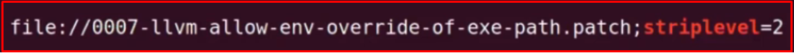   
</p>

***Licensing***
+ Công thức của bạn cần có cả biến LICENSE và LIC_FILES_CHKSUM:
+ LICENSE
  + Biến này chỉ định giấy phép cho phần mềm.
  + Các tệp điển hình chứa thông tin này bao gồm các tệp COPYING, LICENSE và README.
+ Ví dụ: với một phần mềm được cấp phép theo Giấy phép Công cộng GNU phiên bản 2, bạn sẽ đặt LICENSE như sau:
  + LICENSE = "GPLv2“
  + Đối với giấy phép tiêu chuẩn, hãy sử dụng tên của các tệp trong source/poky/meta/files/common-licenses 
  + LIC_FILES_CHKSUM:
    + Hệ thống xây dựng OpenEmbedded sử dụng biến này để đảm bảo văn bản giấy phép không thay đổi.
    + Nếu có, bản dựng sẽ tạo ra lỗi và nó cho bạn cơ hội tìm ra lỗi và khắc phục sự cố.
    + Ví dụ giả sử phần mềm có tệp COPYING :
      + LIC_FILES_CHKSUM = "tệp://COPYING;md5=xxx"
<p align="center">
  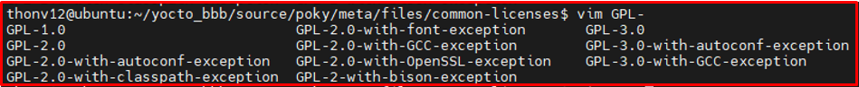   
</p>

***Giai đoạn 4: Cấu hình (do_configure)***
+ Hầu hết phần mềm đều cung cấp một số phương tiện để thiết lập các tùy chọn cấu hình thời gian xây dựng trước khi biên dịch
+ Thông thường, việc thiết lập các tùy chọn này được thực hiện bằng cách chạy tập lệnh cấu hình với các tùy chọn hoặc bằng cách sửa đổi tệp cấu hình bản dựng
+ Autotools: Nếu tệp nguồn của bạn có tệp configure.ac thì phần mềm của bạn được xây dựng bằng Autotools.
+ CMake: Nếu tệp nguồn của bạn có tệp CMakeLists.txt thì phần mềm của bạn được xây dựng bằng Cmake
+ Nếu tệp nguồn của bạn không có tệp configure.ac hoặc CMakeLists.txt, thông thường bạn cần cung cấp tác vụ do_configure trong recipes của mình trừ khi không có gì để định cấu hình.

***Các giai đoạn còn lại***
+ Giai đoạn 5: do_compile
  + Tác vụ do_compile xảy ra sau khi nguồn được tìm nạp, giải nén và định cấu hình.

+ Giai đoạn 6: Cài đặt (do_install)
  + Sau khi quá trình biên dịch hoàn tất, BitBake thực thi tác vụ do_install
  + Trong do_install, tác vụ sao chép các tệp đã xây dựng cùng với hệ thống phân cấp của chúng tới các vị trí phản ánh vị trí của chúng trên thiết bị đích.

+ Giai đoạn 7: Đóng gói (do_package)
  + Tác vụ do_package chia các tệp do công thức tạo ra thành các thành phần logic.
  + Ngay cả phần mềm tạo ra một tệp nhị phân vẫn có thể có các ký hiệu gỡ lỗi, tài liệu và các thành phần logic khác cần được tách ra.
  + Tác vụ do_package đảm bảo rằng các tệp được chia nhỏ và đóng gói chính xác.

***Create recipe***
+ Bây giờ ta có 1 file .c như dưới, ta muốn đưa chương trình này vào rootfs của mình
+ Mà mỗi thành phần phần mềm đều phải có 1 recipes, chỉ khi có recipes ta mới có thể đưa vào rootfs hay image
+ Nên ta cần viết 1 công thức cho thành phần vied mềm cụ thể này để có thể biên dịch và cài đặt phần mềm này
+ Bước 1: Create a file userprog.c :
```bash
#include <stdio.h>
int main()
{	
	printf("Hello ThoNV12\n");	
	return 0;
}
```
+ cd source/meta-mylayer/recipes-exambles
+ Bước 2: Create folder "myhello": Tên thư mục phải trùng với tên công thức
> mkdir -p recipes-examples/myhello
> Cd myhello
+ Bước 3: Tạo folder tên là “files” ở trong myhello và bỏ file userprog.c vào
  + mkdir -p recipes-examples/myhello/files
+ Bước 4: Tạo file 'myhello_0.1.bb’ (tên và phiên bản)  với nội dung như dưới: Ta install là bỏ file của mình vào folder bin
```bash
DESCRIPTION = "Simple helloworld application"	
LICENSE = "MIT"	
LIC_FILES_CHKSUM ="file://${COMMON_LICENSE_DIR}/MIT;md5=0835ade698e0bcf8506ecda2f7b4f302"	
SRC_URI = "file://userprog.c"	
S = "${WORKDIR}"	
do_compile() {		
  ${CC} userprog.c ${LDFLAGS} -o userprog	
}		
do_install() {		
  install -d ${D}${bindir}		
  install -m 0755 userprog ${D}${bindir}	
}
```

+ Bước 5: bitbake myhello
<p align="center">
  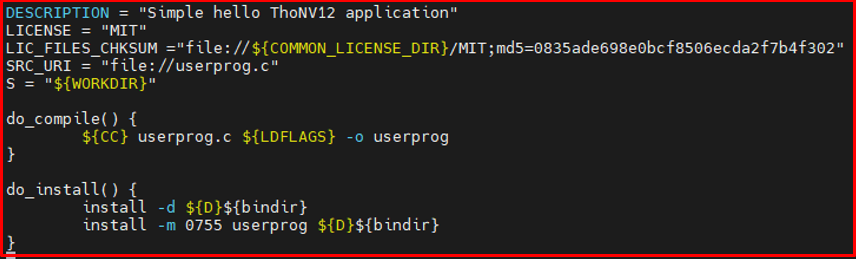   
</p>

***Lệnh install***
+ Lợi ích của lệnh install:
  + Trong 1 lệnh install duy nhất ta có thể:
    + Thực hiện nhiều bước, vừa copy vừa thay đổi quyền file, vừa có thể remove debugging
<p align="center">
  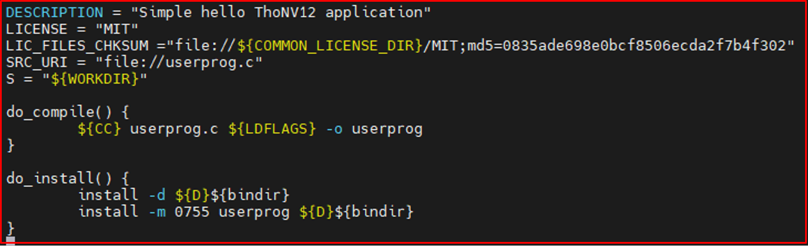   
</p>

***Cách lấy checksum md5***
+ Vì ta đang lấy checksum license là MIT nên
+ Cd source/poky/meta/files/common-licenses
+ md5sum MIT
+ Khi này sẽ có đoạn mã
<p align="center">
  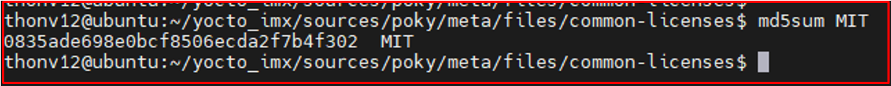   
</p>

***WORKDIR***
+ bitbake -e myhello | grep ^WORKDIR=: để xem đường dẫn
+ Trong đường dẫn này có cả file userprog mà ta mới tạo luôn
+ bitbake -e myhello | grep ^PN 
+ Thư mục này nằm trong cấu trúc thư mục TMPDIR và dành riêng cho công thức đang được xây dựng cũng như hệ thống mà nó đang được xây dựng.
+ Thư mục WORKDIR được định nghĩa như sau:
  + ${TMPDIR}/work/${MULTIMACH_TARGET_SYS}/${PN}/${EXTENDPE}${PV}-${PR}
  + TMPDIR: Thư mục đầu ra của bản dựng cấp cao nhất
  + MULTIMACH_TARGET_SYS: Mã định danh hệ thống đích
  + PN: Tên công thức
  + EXTENDPE: Hầu hết để trống
  + PV: Phiên bản công thức
  + PR: Bản sửa đổi công thức
<p align="center">
  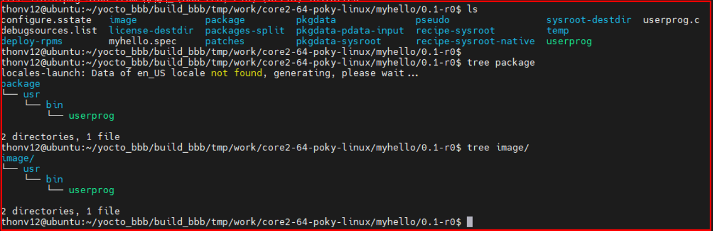   
</p>

***OpenEmbedded Variables***
+ S : Chứa các tệp nguồn đã giải nén cho một công thức nhất định
+ D: Thư mục đích (thư mục gốc nơi các tập tin được cài đặt, trước khi tạo image)
+ WORKDIR: Vị trí nơi hệ thống xây dựng OpenEmbedded xây dựng một công thức (tức là thực hiện công việc tạo gói).
+ PN : Tên công thức dùng để build package
+ PV: Phiên bản của công thức được sử dụng để xây dựng gói
+ PR : Bản sửa đổi công thức được sử dụng để xây dựng gói.
+ PN (Package Name)
+ PV (Package Version)
+ PR (Package Revision)
+ WORKDIR (Working Directory)
+ S (Source)
+ D (Destination)
+ B (Build Directory)

***Giải thích recipes***
+ Các tác vụ phù hợp nhất sẽ được thực thi khi gọi bitbake myhello như sau:
+ bitbake -c cleanall myhello
+ 1. do_fetch:
  + Trong trường hợp này, vì biến SRC_URI được chỉ định trỏ đến một tệp cục bộ, BitBake sẽ chỉ copy file trong recipe WORKDIR. Đây là lý do tại sao biến môi trường S (đại diện cho vị trí mã nguồn) được đặt thành WORKDIR.
  + bitbake -c fetch myhello
  + bitbake -c unpack myhello
  + bitbake -c configure myhello
+ Sysroot là gì?
  + Chứa các header và library cần thiết để tạo các tệp nhị phân chạy trên kiến trúc đích
  + recipe-sysroot-native:
    + Bao gồm các build dependencies của bản dựng được sử dụng trong hệ thống trong quá trình xây dựng.
    + Điều này rất quan trọng đối với quá trình biên dịch chéo vì nó bao gồm trình biên dịch, trình liên kết, công cụ tập lệnh xây dựng, v.v.
  + recipe-sysroot:
    + Các thư viện và tiêu đề được sử dụng trong code target
+ 2. do_compile:
  + khi thực hiện tác vụ này, BB sẽ gọi trình biên dịch chéo C để biên dịch tệp nguồn myhello.c.
  + Kết quả của quá trình biên dịch sẽ nằm trong thư mục được trỏ bởi biến môi trường B (trong hầu hết các trường hợp, giống với thư mục S).
+ 3. do_install:
  + Nhiệm vụ này chỉ định nơi cài đặt nhị phân helloworld vào rootfs.Cần lưu ý rằng quá trình cài đặt này sẽ chỉ diễn ra trong thư mục rootfs tạm thời trong công thức WORKDIR (được trỏ bởi biến D)
  + Image: Phần này chứa các file được cài đặt theo công thức (trỏ tới biến D).
+ 4. do_package:
  + Trong giai đoạn này, tệp được cài đặt trong thư mục D sẽ được đóng gói trong gói có tên myhello.
  + Gói này sẽ được BitBake sử dụng sau này khi xây dựng hình ảnh rootfs chứa gói công thức helloworld
  + Packages : Nội dung được trích xuất của các gói được lưu trữ ở đây
  + Packages-split: Nội dung của các gói được trích xuất và phân chia được lưu trữ ở đây. Cái này có một thư mục con cho mỗi gói

***Thêm công thức vào rootfs***
+ cd source/meta-mylayer/recipes-exambles/images
+ vim tho-image.bb  : them vào IMAGE_INSTALL 
+ IMAGE_INSTALL += "myhello“
+ Ai xác định tìm nạp, định cấu hình và các tác vụ khác ?
  + Khi bitbake được chạy để xây dựng một công thức, tệp base.bbclass sẽ được kế thừa tự động bởi bất kỳ công thức nào
  + Bạn có thể tìm thấy nó trong class/base.bbclass
  + Lớp này chứa các định nghĩa cho các tác vụ cơ bản tiêu chuẩn như tìm nạp, giải nén, định cấu hình (trống theo mặc định), biên dịch (chạy mọi Makefile hiện có), cài đặt (trống theo mặc định) và đóng gói (trống theo mặc định)
  + Các lớp này thường bị ghi đè hoặc mở rộng bởi các lớp khác như lớp autotools hoặc lớp gói.
+ Sau khi xong, chạy máy ảo
+ cd /usr/bin/userprog và chạy sẽ hiện hello world

+ cd source/meta-mylayer/recipes-exambles/myhello/images
+ vim tho-image.bb: Thêm vào IMAGE_INSTALL 
+ IMAGE_INSTALL += "myhello"
+ Sau đó  bitbake tho-image
<p align="center">
  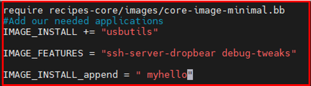   
</p>

***Run qemu***
+ Sau khi build image xong
+ bitbake tho-image
+ runqemu nographic
+ ls /usr/bin/userprog
+ userprog   (sẽ ra hello thonv12)

<p align="center">
  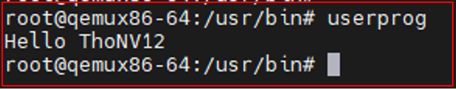   
</p>

***Build logs file***
+ Mỗi bản dựng đều tạo ra nhiều đầu ra log file để chẩn đoán và theo dõi lỗi
+ Đầu ra của bitbake được ghi vào tmp/log/cooker/<machine>/
+ Đối với mỗi công thức riêng lẻ, có một thư mục "temp" trong thư mục công việc
+ Trong hệ thống xây dựng, thư mục này được trỏ đến bởi biến T
> bitbake -e <recipename> | grep ^T=
+ Mỗi tác vụ chạy cho một công thức sẽ tạo ra các tệp "log" và "run" trong ${WORKDIR}/temp
+ Bạn có thể tìm thấy tệp nhật ký cho từng tác vụ trong thư mục tạm thời của công thức
+ Các tệp nhật ký được đặt tên là log.taskname (ví dụ: log.do_configure, log.do_fetch và log.do_compile)
+ Chúng ta có thể chạy các tập lệnh cho mọi tác vụ bằng mẫu run.<task>.<pid>
+ Các tệp này chứa các lệnh tạo ra kết quả xây dựng

+ cd /home/thonv12/yocto_bbb/build_bbb/tmp/work/core2-64-poky-linux/myhello/0.1-r0/temp
+ vim log.do_compile
+ vim run.do_install

<p align="center">
  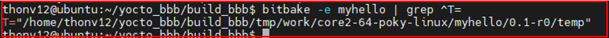   
</p>

***Print log***
+ BitBake cung cấp các chức năng ghi nhật ký để sử dụng trong mã Python và Shell Script, như được mô tả
+ 1. Python: 
  + Để sử dụng trong các hàm Python, BitBake hỗ trợ một số cấp độ nhật ký, đó là bb.fatal, bb.error, bb.warn, bb.note, bb.plain và bb.debug
  + Các chức năng ghi nhật ký trong Python được BitBake xử lý trực tiếp, được xem trên bảng điều khiển và được lưu trữ trong nhật ký thực thi có thể thấy bên trong build/tmp/log/cooker/<machine>
+ 2. Shell Script: 
  + Để sử dụng trong các hàm Shell Script, tồn tại cùng một tập hợp các cấp độ nhật ký và được truy cập bằng cú pháp tương tự: bbfatal, bberror, bbwarn, bbnote, bbplain và bbdebug
  + Khi các chức năng ghi nhật ký được sử dụng trong Shell Script, thông tin sẽ được xuất ra trên tệp nhật ký tác vụ tương ứng của tác vụ, tệp này có sẵn trong build/tmp/work/<arch>/<recipe name>/<software version>/temp

+ bb.fatal và bbfatal: Chúng có mức độ ưu tiên cao nhất trong việc ghi nhật ký thông báo khi chúng in thông báo và chấm dứt quá trình xử lý. Chúng khiến việc xây dựng bị gián đoạn.
+ bb.error và bberror: Chúng được sử dụng để hiển thị lỗi nhưng không buộc quá trình xây dựng phải dừng lại.
+ bb.warn và bbwarn: Chúng được sử dụng để cảnh báo người dùng về điều gì đó.
+ bb.note và bbnote: Những thứ này thêm ghi chú cho người dùng. Chúng chỉ mang tính thông tin.
+ bb.plain và bbplain: Chúng xuất ra một thông báo.
+ bb.debug và bbdebug: Những thông tin này thêm thông tin gỡ lỗi được hiển thị tùy thuộc vào mức độ gỡ lỗi được sử dụng.
```bash
do_compile() { 
bbplain "*************************************" 
bbplain "* *" 
bbplain "* Example recipe created by bitbake-layers *" 
bbplain "* *" 
bbplain "*************************************“
}
```

<p align="center">
  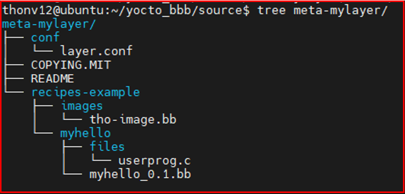   
</p>

***Debug Output***
+ Ta có thể xem kết quả gỡ lỗi từ Bitbake bằng cách sử dụng tùy chọn –D
+ Output gỡ lỗi cung cấp thêm thông tin về những gì BitBake đang làm và lý do đằng sau nó
+ Mỗi tùy chọn -D ta sử dụng sẽ tăng mức ghi nhật ký.
+ Cách sử dụng phổ biến nhất là –DDD
> bitbake myhello -DDD
<p align="center">
  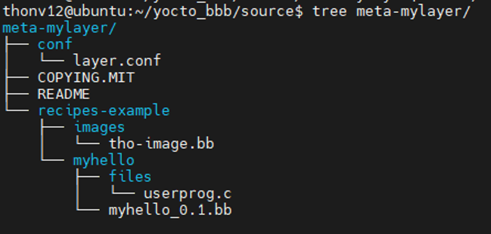   
</p>

***Recipe multi file***
<p align="center">
  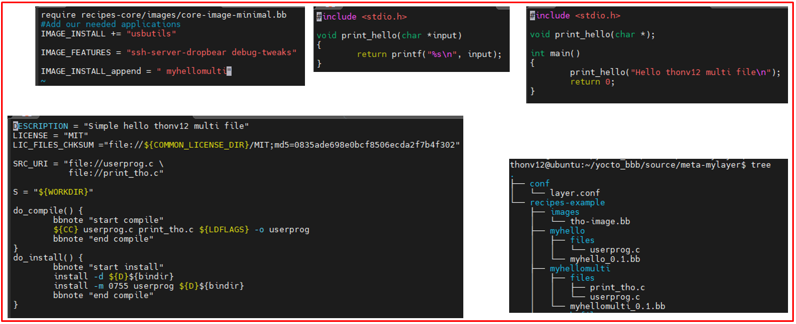   
</p>
```bash
Bitbake myhellomulti
bitbake -e myhellomulti | grep ^T=
cd đường dẫn
cd ..
vim temp/run.do_    ( check compile và install)
bitbake tho-image
runqemu nographic
userprog
```
<p align="center">
  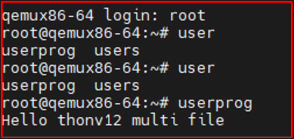   
</p>

***Nếu recipe mà có make file***
+ Ví dụ recipe của ta có 1 file c và 1 makefile thì:
  + Trong folder meta-mylayer/recipes-exambles: mk cd mymakefile
  + Mk cd files
  + Cd ../
  + Cp ../myhello/myhello_0.1.bb mymakefile_0.1.bb
  + Và khi này vim mymakefile_0.1.bb chỗ do-compile bỏ hêt bên trong và sửa lại thành make
  + Cd images
  + Vim tho-image.bb  Sửa lại thành mymakefle
<p align="center">
  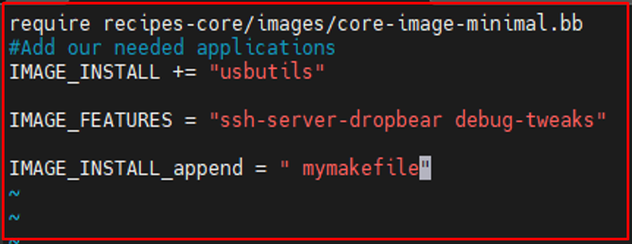   
</p>

```bash
cd build_bbb
bitbake -c cleanall mymakefile
bitbake mymakefile
bitbake tho-image
runqemu nographic
userprog
```
<p align="center">
  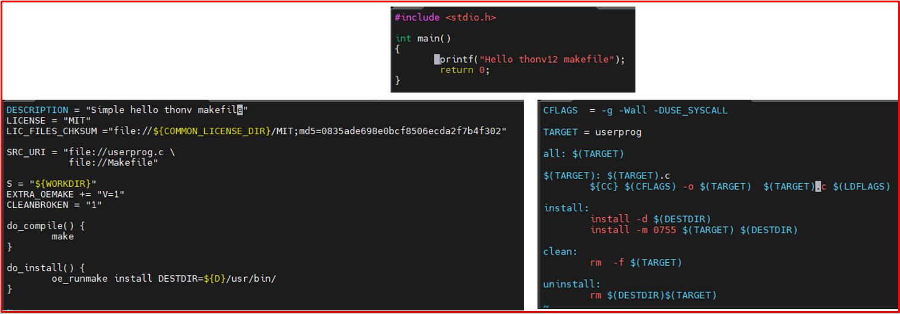   
</p>

***oe_runmake***
+ cd /home/thonv12/yocto_bbb/source/poky/meta/classes
+ vim base.bbclass  (rồi  /do_compile để xem )
+ Hoạt động của tác vụ do_compile là chạy hàm oe_runmake nếu tìm thấy tệp makefile (Makefile, makefile hoặc GNUMakefile). Nếu không tìm thấy tệp như vậy, tác vụ do_compile sẽ không làm gì cả
+ Hành vi mặc định của tác vụ do_configure là chạy oe_runmake clean nếu tìm thấy tệp makefile (Makefile, makefile hoặc GNUmakefile)
+ oe_runmake vs make
  + Hàm oe_runmake được sử dụng để chạy make.
  + oe_runmake
    + Vượt qua cài đặt EXTRA_OEMAKE để thực hiện
    + Hiển thị lệnh tạo
    + Kiểm tra các lỗi được tạo thông qua cuộc gọi.
  + Trong môi trường OE, bạn không nên gọi trực tiếp make mà hãy sử dụng oe_runmake khi bạn cần chạy make.
  + oe_runmake là một trong nhiều hàm trợ giúp được xác định bởi lớp cơ sở
  + kiểm tra định nghĩa của oe_runmake trong base.bbclass mà xem

***EXTRA_OEMAKE***
+ Thay vì gọi make V=1 thì ta dùng biến EXTRA_OEMAKE
+ Sau đó
  + bitbake -c clean mymakefile
  + bitbake mymakefile
<p align="center">
  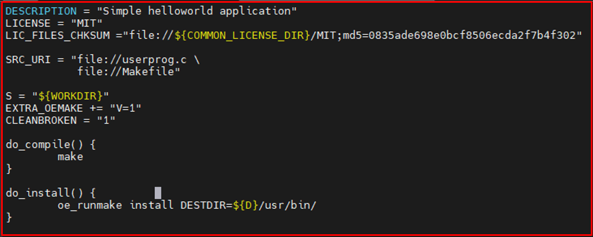   
</p>

***CLEANBROKEN***
+ Khi CLEANBROKEN = 1 thì là đang chỉ định rằng Makefile của ta không có Clean, nên khi chạy thì openembedded sẽ không chạy make clean, còn make clean là hành động mặc định
<p align="center">
  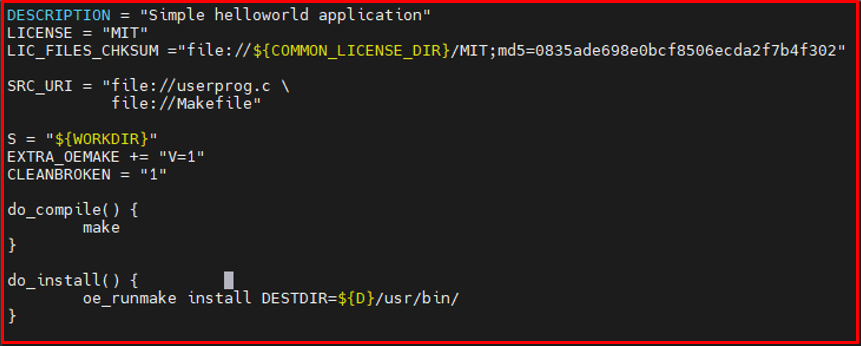   
</p>

***GIT-RECIPE***
+ Viết recipe cho kho lưu trữ git từ xa
  + Yocto hỗ trợ khả năng lấy code từ kho git trực tuyến như một phần của quá trình xây dựng.
  + Bước 1: Đặt SRC_URI
    + SRC_URI = "git://<URL>;protocol=https“
  + Bước 2: Đặt biến môi trường S
    + S = ${WORKDIR}/git
  + Bước 3: Đặt biến môi trường SRCREV
+ Công dụng của SRCREV là gì?
  + Khi tìm nạp kho lưu trữ, bitbake sử dụng biến SRCREV để xác định bản sửa đổi cụ thể để xây dựng
  + Có hai tùy chọn cho biến này:
    + 1) AUTOREV:  SRCREV = “${AUTOREV}”
      + Khi SRCREV được đặt thành giá trị của biến này, nó chỉ định sử dụng bản sửa đổi nguồn mới nhất trong kho lưu trữ
      + Hệ thống xây dựng truy cập mạng nhằm xác định phiên bản phần mềm mới nhất từ SCM
    + 2) Một bản sửa đổi cụ thể : commit 
      + Nếu bạn muốn xây dựng một bản sửa đổi cố định và muốn tránh thực hiện truy vấn trên kho lưu trữ từ xa mỗi khi BitBake phân tích công thức của bạn
      + SRCREV = "d6918c8832793b4205ed3bfede78c2f915c23385"

+ Cd source/meta-mylayer/recipes-exambles
+ mkcd mygit
  + cd /home/thonv12/yocto_bbb/source/meta-mylayer/recipes-example/mygit/
  + Git clone https://github.com/VANTHO15/git_recipe.git
+ vim mygit_0.1.bb: thêm code như dưới vào
+ bitbake mygit
+ Không cần folder files nữa vì userprog.c sẽ lấy ở github
+ Check các biến ở source/poky/meta/conf/bitbake.conf : ví dụ ${bindir}
<p align="center">
  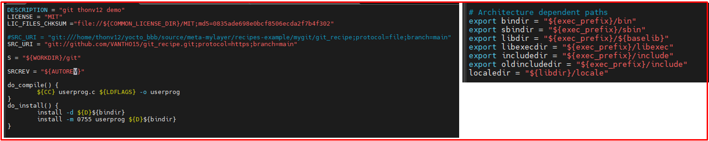   
</p>

+ Chỉ định một branch khác
  + Bạn có thể chỉ định chi nhánh bằng cách sử dụng mẫu sau:
  + SRC_URI = "git://server.name/repository;branch=branchname“
  + Nếu bạn không chỉ định một nhánh, BitBake sẽ tìm trong nhánh “main" mặc định.
  + BitBake bây giờ sẽ xác thực giá trị SRCREV đối với nhánh.
<p align="center">
  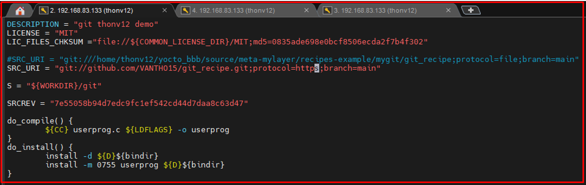   
</p>

+ Thêm mygit vào image
<p align="center">
  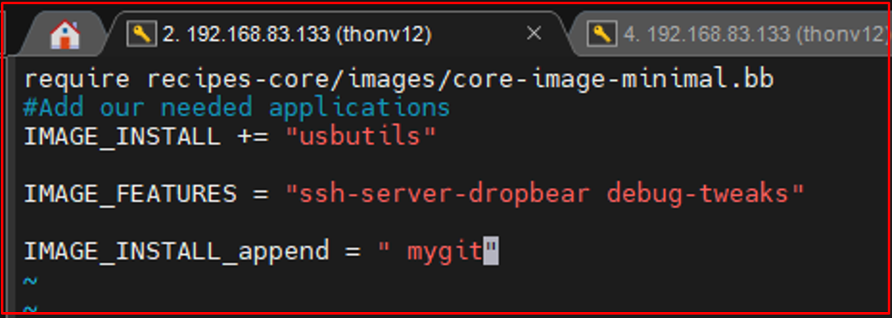   
</p>

***Nguồn git local***
+ Dùng đường dẫn trỏ lới folder git clone
  + SRC_URI = "git:///home/user/git/myTest/;protocol=file“
  + cd /home/thonv12/yocto_bbb/source/meta-mylayer/recipes-example/mygit/
  + Git clone https://github.com/VANTHO15/git_recipe.git
  + Git log  : sau đó lấy commit bỏ vào dưới
<p align="center">
  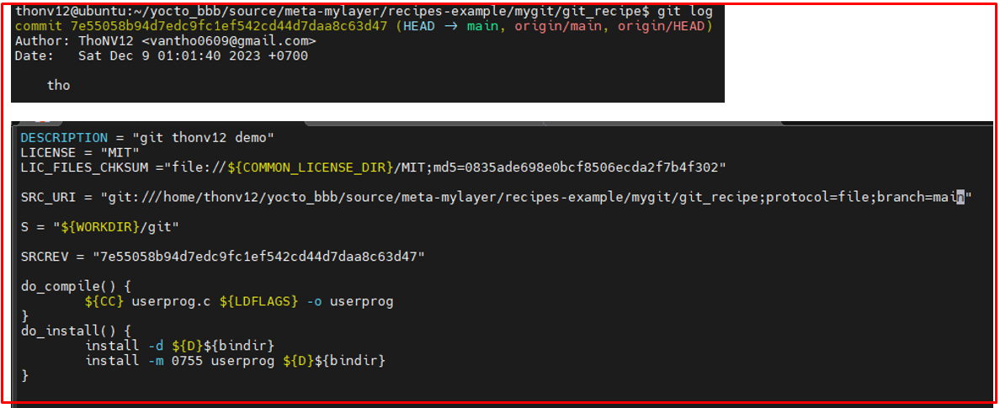   
</p>

***private repositories***
+ Các kho lưu trữ riêng có thêm sự phức tạp khi yêu cầu xác thực trước khi bạn có thể tải xuống (còn gọi là bản sao) chúng.
+ May mắn thay, Yocto hỗ trợ giao thức ssh.
+ Để khiến Yocto sử dụng kho lưu trữ GitHub:
+ SRC_URI="git://git@github.com/group_name/repo_name.git;protocol=ssh“
+ Để sử dụng SSH, bạn phải tạo cặp khóa SSH trên máy tính và thêm khóa chung vào tài khoản GitHub của mình

***Cách chuyển tag vào công thức git***
+ Tham số tag của trình tìm nạp git
+ "tag": Chỉ định thẻ để sử dụng cho quá trình thanh toán. Để giải quyết chính xác các thẻ, BitBake phải truy cập vào mạng
+ SRCREV không cần thiết trong trường hợp này
<p align="center">
  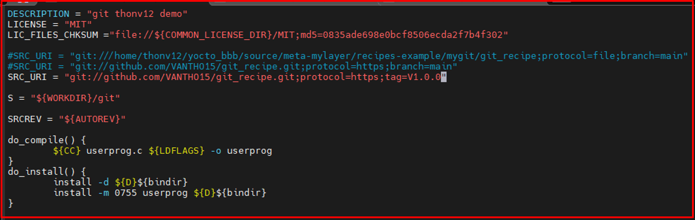   
</p>

***Bản vá lỗi***
+ Các bản vá có thể được tạo dễ dàng bằng Git
+ Sau khi clone xuống thì thay đổi và commit
+ Sau đó, ta tạo 1 bản vá: git format-patch -1
+ Nếu tất cả các thay đổi được chứa trong một commit bổ sung, bạn có thể sử dụng lệnh sau:
+ git show HEAD > my-patch.patch
+ Cd mygit  ; mkdir files  ; cd files
+ Sau đo copy file này vào files
+ Các bản vá phải luôn nằm trong thư mục con chứa công thức.
+ Yocto sẽ tự động áp dụng các bản vá này khi cần xây dựng công thức của bạn.
<p align="center">
  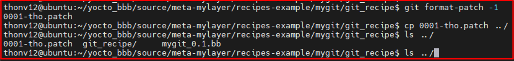   
</p>

+ Thêm file patch vào
+ Bitbake mygit
<p align="center">
     
</p>

***PACKAGES variable***
+ PACKAGES - Danh sách các PACKAGES mà recipe của ta tạo ra
  + bitbake –e myhello | grep ^WORKDIR
  + bitbake -e myhello | grep ^PACKAGES
  + tree packages-split
  + Trong packages-split sẽ có: 
    + ${PN}-dbg ${PN}-staticdev ${PN}-dev ${PN}-doc ${PN}-locale ${PACKAGE_BEFORE_PN} ${PN}
+ FILES - Danh sách các tập tin và thư mục được đặt trong một PACKAGES
  + bitbake –e myhello | grep ^FILES_myhello=
  + Ví dụ. FILES_${PN} chỉ định các tệp sẽ đi vào PACKAGES chính
  + Ví dụ. FILES_${PN} += "${bindir}/mydir1 ${bindir}/mydir2/myfile“
+ Nên sử dụng ${sysconfdir} thay vì /etc hoặc ${bindir} thay vì /usr/bin
+ Các biến PACKAGES và FILES_* cho biết cách các tệp được install bởi tác vụ do_install được đóng gói ở đâu
<p align="center">
  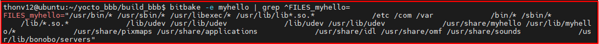   
</p>
<p align="center">
  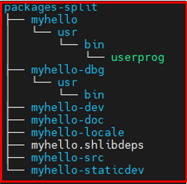   
</p>

+ Cd source/poky
+ vim meta/conf/bitbake.conf   : ta sẽ thấy các biến như bindir, datadir …
<p align="center">
  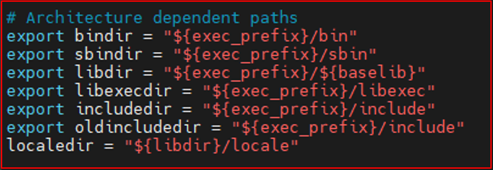   
</p>

***Add README file***
+ Cd myhello/files
+ Vim readme.txt : viết lung tung vào
+ Sửa bb file  ( tao folder docdir rồi copy readme file vào đó )
+ Bitbake myhello
+ bitbake –e myhello | grep ^WORKDIR     ( trong này sẽ có file readme.txt )
+ tree image
+ bitbake tho-image
+ Runqemu nographic
<p align="center">
  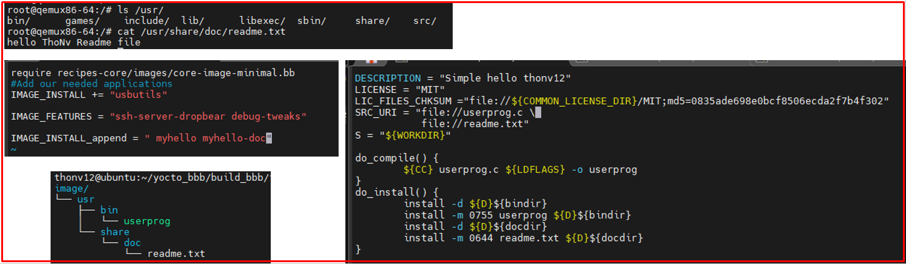   
</p>

***1 file ở nhiều PACKAGE***
+ Nếu một file khớp với biến FILES của nhiều gói trong PACKAGES, thì tệp đó sẽ được gán cho PACKAGES sớm + nhất (ngoài cùng bên trái).
+ FILES_${PN}-dbg += "${bindir}/userprog“
+ FILES_${PN} += "${bindir}/userprog“
+ bitbake myhello
+ bitbake -e myhello | grep ^PACKAGES=
+ (ta thấy myhello-dbg nằm phía trước myhello)

<p align="center">
  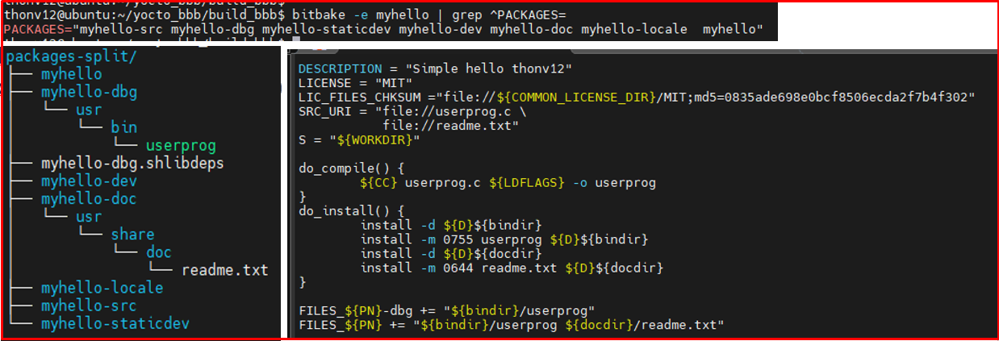   
</p>

***Create PACKAGE của ta***
+ Ta sẽ tạo 1 packages tên là ThoNV12 và them file readme.txt vào PACKAGES đó
+ bitbake myhello
+ tree packages-split/
+ bitbake tho-image
+ runqemu nographic
<p align="center">
  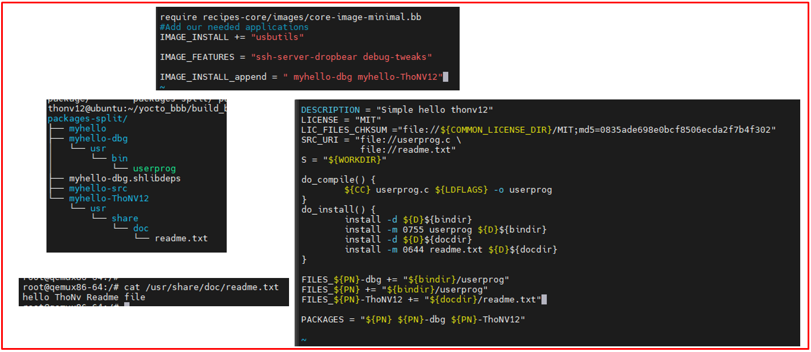   
</p>

***STATIC LIB***
+ Là 1 tập hợp các file object được sao chép vào 1 file duy nhất .a
+ Tool được sử dụng để tạo static library là 1 program tên là ar ( archiver )
+ Chức năng của tool ar:
  + Create static lib, giống như archive files
  + Sửa static file trong static lib
  + List ra name của object file trong library
+ Cần 2 bước để tạo static lib:
  + Bước 1: tạo object file từ source code
  + Bước 2: Tạo static lib từ object file
<p align="center">
  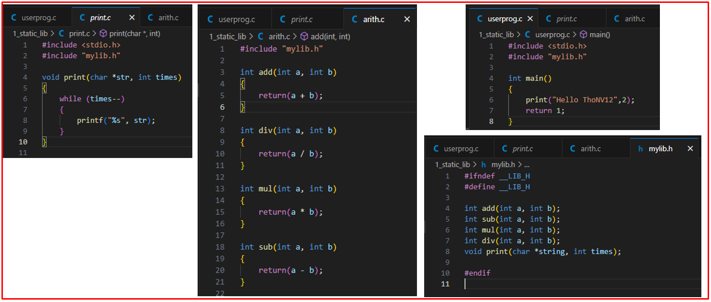   
</p>

+ Bước 1: Tạo file .o
  + gcc -c arith.c
  + gcc -c print.c 
+ Bước 2: Create Static library
  + ar rcs libtho.a arith.o print.o   ( phải có lib )
+ Bước 3: Sử dụng
  + gcc userprog.c -o userprog -I. -ltho -L.       ( phải có –l)

+ r -- thay thế các file object cũ trong thư viện bằng các file object mới
+ c -- tạo archive file nếu nó không tồn tại
+ s -- Ghi object-file index vào kho archive
<p align="center">
  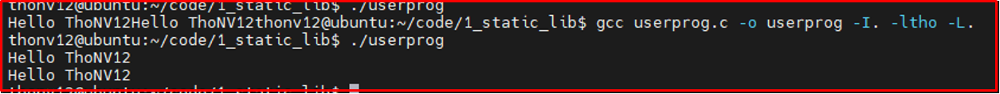   
</p>

+ File thư viện ta cần bỏ vào/user/lib
+ File include ta cần bỏ vào /user/include
+ Khi này chạy gcc nó sẽ tự lấy

+ sudo cp libtho.a /usr/lib
+ sudo cp mylib.h /usr/include/
+ gcc userprog.c -o userprog -ltho
<p align="center">
  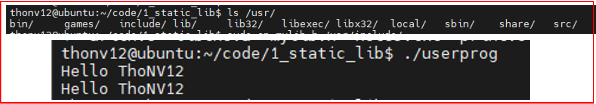   
</p>

***Create Static library recipe yocto***
<p align="center">
  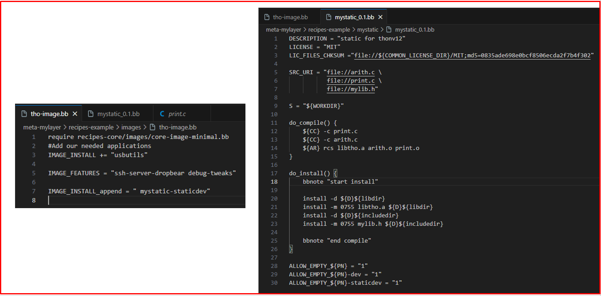   
</p>

+ bitbake mystatic
+ bitbake -e mystatic | grep ^WORKDIR=
+ tree image/
+ tree deploy-rpms/
+ bitbake tho-image
+ runqemu nographic
+ ls /usr/lib/libtho.a
+ ls /usr/include/mylib.h
+ Biến ALLOW_EMPTY Chỉ định có tạo gói đầu ra ngay cả khi nó trống hay không.
<p align="center">
  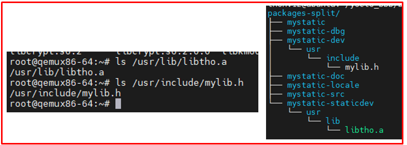   
</p>


***Dependencies***
+ Hầu hết các software packages đều có một danh sách các packages khác mà chúng yêu cầu
+ Ví dụ tạo menuconfig cần thư viện ncurses
+ Sự phục thuộc này có 2 loại chính:
  + build-time dependencies: bắt buộc khi phần mềm được xây dựng
    + Ví dụ: Phần mềm của ta sử dụng một thư viện cụ thể
  + runtime dependencies: bắt buộc phải được cài đặt để phần mềm có thể thực thi
    + Ví dụ: nếu phần mềm của ta gọi một lệnh cụ thể
+ Có 2 biến Yocto cung cấp:
  + DEPENDS: Chỉ định các phần phụ thuộc vào thời gian xây dựng, thông qua danh sách các công thức bitbake cần xây dựng trước khi xây dựng công thức
  + RDEPENDS: Chỉ định các phần phụ thuộc vào thời gian chạy, thông qua danh sách các gói cần cài đặt trước khi cài đặt gói hiện tại

+ Bây giờ trong myhello include mylib và gọi hàm print
+ Khi này trong bb của myhello phải có DEPEND mystatic
+ bitbake -c configure myhello
+ bitbake -c compile myhello
+ bitbake myhello

<p align="center">
  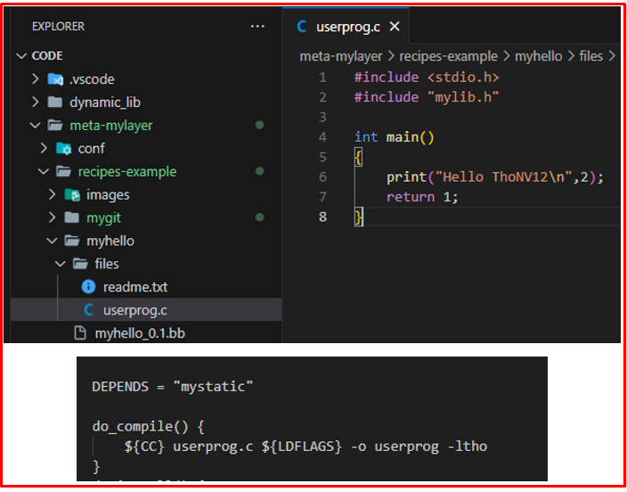   
</p>

***RDEPENDS***
+ RDEPENDS Danh sách các phụ thuộc thời gian chạy
+ Phải là gói cụ thể (ví dụ: với _${PN})
+ RDEPENDS_${PN} = "package_name“
+ Ví dụ chương trình muốn gọi 1 system call

+ bitbake myhello
+ bitbake tho-image
+ runqemu nographic
<p align="center">
  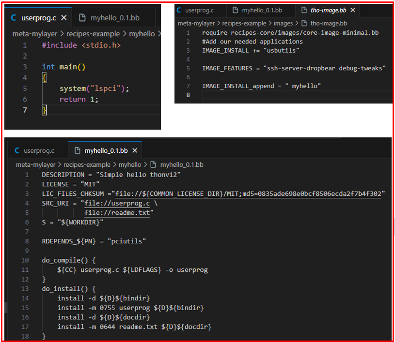   
</p>

***noexec***
+ Khi set mấy cái do_xxx này =1, nghĩa là cái task này sẽ empty và khi này bitbake sẽ bỏ qua
+ do_configure[noexec] = "1“
+ do_compile[noexec] = "1"
<p align="center">
  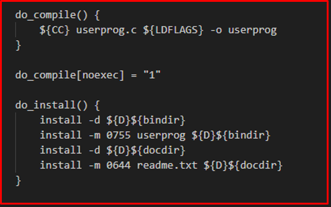   
</p>

***Recipe cmake***
+ bitbake mycmake
+ bitbake tho-image
+ runqemu nographic
<p align="center">
  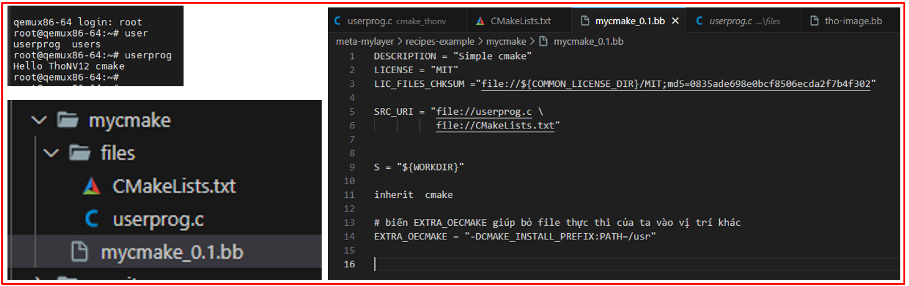   
</p>

***bbappend***
+ Tốt nhất là không sửa đổi các công thức nấu ăn có sẵn trong Poky
+ Nhưng đôi khi việc sửa đổi công thức hiện có cũng rất hữu ích
+ Bitbake Append là gì?
  + Một recipe gắn thêm Metadata vào một recipe khác được gọi là BitBake append file.
  + Phần mở rộng tệp: .bbappend
  + Bạn có thể sử dụng tệp .bbappend trong lớp của mình để bổ sung hoặc thay đổi nội dung công thức của lớp khác mà không cần phải sao chép công thức của lớp khác vào lớp của bạn
  + file .bbappend nằm trong lớp của bạn
  + file recipe  .bb mà bạn đang thêm Metadata vào nằm trong một lớp khác.
+ Lưu ý về .bbappend
  + Các tệp được thêm vào phải có cùng tên gốc với công thức mà chúng mở rộng
    + Ví dụ. example_0.1.bbappend áp dụng cho example_0.1.bb
  + Nếu thêm tệp mới, bạn phải thêm vào trước biến FILESEXTRAPATHS đường dẫn đến thư mục tệp

***Prioriti .bbappend ***
+ Mỗi lớp được gán một giá trị ưu tiên.
+ File công thức từ lớp có số ưu tiên cao hơn sẽ được ưu tiên.
+ Để chỉ định mức độ ưu tiên của lớp theo cách thủ công, hãy sử dụng biến BBFILE_PRIORITY và nối thêm tên gốc của lớp:
  + BBFILE_PRIORITY_mylayer = "1"
+ Lưu ý: mức độ ưu tiên của lớp hiện không ảnh hưởng đến thứ tự ưu tiên của tệp .conf hoặc .bbclass.

***Các kiểu build***
+ Có 2 kiểu build
  + build tất cả luôn
    + Này dễ rồi
  + Chỉ build những cái đã thay đổi
    + Yocto triển khai 1 cái gọi là ‘shared state cache” , cái này sẽ được dùng chung cho việc chỉ build những cái thay đổi này
    + Để tính năng này hoạt động thì build system sẽ tính toán 1 checksum kiểm tra dữ liệu đầu vào cho 1 task vụ:
      + Nếu data đầu vào thay đổi thì cần phải build lại task này
      + Nếu tất cả đầu vào không thay đổi, thì các build artifacts sẽ được copy từ sstate-cache tới đầu ra

***sstate-cache***
+ Ý 1: Các phần của hệ thống đã thay đổi như thế nào và những phần nào không thay đổi được phát hiện?
  + Hệ thống xây dựng phát hiện các thay đổi trong "inputs" của một tác vụ nhất định bằng cách tạo checksum  (hoặc chữ ký) của đầu vào của tác vụ.
  + Nếu checksum thay đổi, hệ thống sẽ cho rằng đầu vào đã thay đổi và tác vụ cần được chạy lại
+ Ý 2: Các phần mềm đã thay đổi được loại bỏ và thay thế bằng sstate-cache như thế nào?
  + Shared state (sstate) được chia sẻ để theo dõi tác vụ nào thêm đầu ra nào vào quá trình build 
  + Điều này có nghĩa là đầu ra từ một tác vụ nhất định có thể bị xóa, nâng cấp hoặc bị thao tác.
+ Ý 3: Các thành phần pre-built không cần phải xây dựng lại từ đầu được sử dụng như thế nào khi có sẵn?
build system có thể fetch các state objects từ các vị trí ở xa và cài đặt chúng nếu chúng được coi là hợp lệ
```bash
cd build_bbb
ls state-cache
trong local.conf sẽ chưa đường dẫn này (SSTATE_DIR)
```

***TASK***
+ Khi phát triển yocto ta thường nghĩ về recipes, tuy nhiên bitbake lại làm việc theo TASK
+ Bitbake làm việc trên task hay vì recipe để xác định cái nào của hệ thống cần được build
+ What is a task
  + Một tác vụ là một tập lệnh shell hoặc Python được thực thi để hoàn thành một việc gì đó, thường tạo ra một số dạng đầu ra
  + Ví dụ. do_install, do_package
  + Thông thường, một tác vụ phụ thuộc vào đầu ra từ một số tác vụ khác và BitBake cung cấp các cơ chế để chỉ định các phụ thuộc này
  + BitBake sẽ thực thi các tác vụ với mức độ song song nhiều nhất có thể trong khi vẫn duy trì thứ tự phụ thuộc.

***Bitbake clean***
+ bitbake -c clean <recipename>
  + Xóa tất cả các tệp đầu ra cho mục tiêu khỏi tác vụ do_unpack trở đi (tức là do_unpack, do_configure, do_compile, do_install và do_package.)
  + Chạy tác vụ này không loại bỏ các tập tin bộ nhớ đệm trạng thái.
+ bitbake -c cleanall <recipename>
  + Xóa tất cả các tệp đầu ra, bộ đệm trạng thái được chia sẻ và các tệp nguồn đã tải xuống cho một mục tiêu
+ bitbake -c cleansstate <recipename>
  + Xóa tất cả các tệp đầu ra và bộ đệm trạng thái
  + Khi chạy tác vụ do_cleansstate, hệ thống xây dựng OpenEmbedded không còn sử dụng bất kỳ trạng thái nào nữa. Do đó, việc xây dựng công thức từ đầu được đảm bảo.

***Providers***
+ Khi ta chạy bitbake <target>
  + Bitbake phân tích tất cả các recipes
  + Bitbake xem qua danh sách PROVIDES  cho từng recipes
  + Khi mục tiêu khớp với danh sách PROVIDES , nó sẽ build recipes đó
+ PROVIDES list:
  + Danh sách PROVIDES  là danh sách các tên mà công thức có thể được biết đến.
  + Theo mặc định, PN được tự động thêm vào danh sách PROVIDES 
  + bitbake -e myhello | grep ^PROVIDES=
<p align="center">
  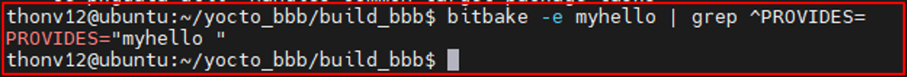   
</p>

+ Ta vào trong recipe của ta và thêm   PROVIDES += "mytho"
+ khi này ta có thể build recipe của ta bằng 2 cách:
  + bitbake myhello
  + bitbake mytho
<p align="center">
  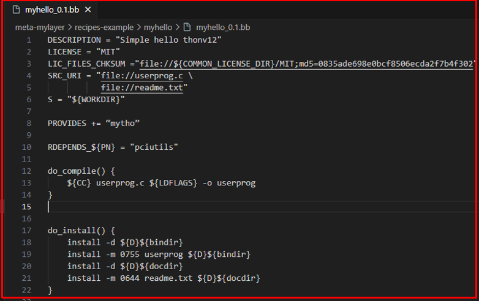   
</p>

## ✔️ Conclusion
Ở bài này chúng ta đã biết các kiến thức về yocto và thực hành xung quanh yocto. Tiếp theo chúng ta cùng đi tìm hiểu lý thuyết về linux kernel nhé.
+ Full source code: [LINK](https://drive.google.com/drive/folders/1s8h6QW4vlCNO7eVSL54xVwDzIXY5TAqk?usp=sharing)

## 💯 Exercise
+ Thực hành lại theo bài viết

## 📺 NOTE
***Tổng hợp các comamnd hay dùng trong yocto***
```bash
$ source source/poky/oe-init-build-env [ build_directory ] (../build)
$ bitbake -c <task> <recipes>
$ bitbake <recipes>
$ bitbake -e <recipes> | grep ^<Variable>
$ bitbake core-image-minimal
$ nproc: kiểm tra có bao nhiêu core 
$ free –m : kiểm tra ram 
$ runqemu qemux86-64 core-image-minimal
$ nographic
$ poweroff
$ bitbake-layers show-layers
$ bitbake-layers add-layer /home/thonv12/yocto_bbb/meta-ti
$ bitbake-layers create-layer
$ bitbake -c clean|cleansstate|cleanall <recipes> 
```

+ Có 2 cái thay đổi chính trong linux BSP là version yocto và version kernel. Link docs kernel [LINK](https://docs.kernel.org/driver-api/gpio/driver.html)

+ Video yocto part 1: [Video](https://www.youtube.com/watch?v=y4CshZ8-qZo)
+ Video yocto part 2: [Video](https://www.youtube.com/watch?v=qeuKi8_doug)
+ Video yocto part 3: [Video](https://www.youtube.com/watch?v=L7qzXkHmFVc)

## 📌 Reference

[1] Embedded Linux Projects Using Yocto Project Cookbook

[2] https://www.youtube.com/playlist?list=PLwqS94HTEwpQmgL1UsSwNk_2tQdzq3eVJ

[3] https://docs.yoctoproject.org/ref-manual/#ubuntu-packages

[4] https://docs.yoctoproject.org/brief-yoctoprojectqs/index.html 

[5] https://www.yoctoproject.org/development/technical-overview/#getting-started

[6] https://github.com/Munawar-git/YoctoTutorials/
