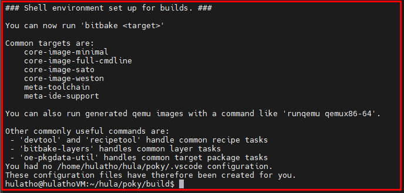
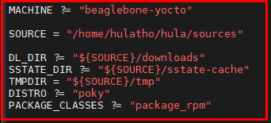
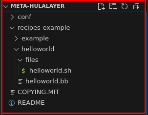
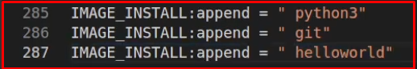
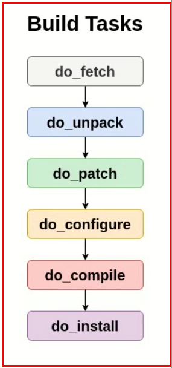
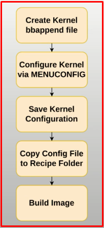
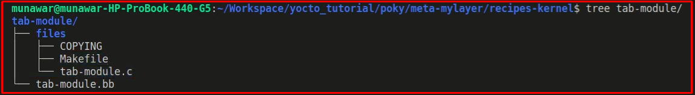

# 💚 Yocto Project 💛

## 👉 Introduction and Summary

### 1️⃣ Introduction

+ Ở bài trước chúng ta đã biết về lý thuyết yocto và thực hành với yocto Zues. Nếu các bạn chưa đọc thì xem link này nha [020_Yocto_Part1.md](../020_Yocto_Part1/020_Yocto_Part1.md). Ở bài này chúng ta sẽ tìm hiểu thêm về lý thuyết và thực hành liên quan về yocto Scarthgap nhé.

### 2️⃣ Summary

Nội dung của bài viết gồm có những phần sau nhé 📢📢📢:
- [I. Introduction and Summary](#👉-introduction-and-summary)

    - [1. Introduction](#1️⃣-introduction)
    - [2. Summary](#2️⃣-summary)
- [II. Contents](#👉-contents)
    - [1. Lý thuyết và thực hành](#1️⃣-lý-thuyết-và-thực-hành)
- [III. Conclusion](#✔️-conclusion)
- [IV. Exercise](#💯-exercise)
- [V. NOTE](#📺-note)
- [VI. Reference](#📌-reference)

## 👉 Contents

### 1️⃣ Lý thuyết và thực hành

+ Để chạy yocto Scarthgap thì ta cần cài ununtu 22.04 nhé
+ Chúng ta follow theo docs của yocto project để làm nhé: [LINK](https://docs.yoctoproject.org/5.0.13/brief-yoctoprojectqs/index.html#build-host-packages)

***Sử dụng VSCode***
```bash
# Installing VS code using CLI
sudo apt update
sudo apt install snapd
sudo snap install --classic code
```
+ Khi này ta có thể gõ code . để mở VScode lên trên command line

***What is Poky***
+ Poky is a *reference distribution* of the Yocto Project®. It contains the OpenEmbedded Build System (BitBake and OpenEmbedded Core) as well as a set of metadata to get you started building your own distro. 

***Install required packages***
```bash
$ sudo apt install build-essential chrpath cpio debianutils diffstat file gawk gcc git iputils-ping libacl1 liblz4-tool locales python3 python3-git python3-jinja2 python3-pexpect python3-pip python3-subunit socat texinfo unzip wget xz-utils zstd
```
+ Reference: https://docs.yoctoproject.org/5.0.13/brief-yoctoprojectqs/index.html#build-host-packages

***Use Git to Clone Poky***
```bash
$ mkdir hula
$ cd hula
$ git clone git://git.yoctoproject.org/poky
$ cd poky
$ git checkout -t origin/scarthgap -b my-scarthgap
$ git pull
```

***Initialize Build Environment***
```bash
cd poky
source oe-init-build-env
```
<p align="center">
     
</p>

+ Sau đó ta tạo folder sources nằm song song với poky, tất cả code sau này ta sẽ bỏ hết vào đây
```bash
mkdir ../../sources
```

***Mở file local.conf và sửa lại như dưới***
* Change Machine: beaglebone-yocto
* Thêm biến SOURCE để trỏ tới đường dẫn folder source ta mới tạo bên trên
* Set following
  * RM_OLD_IMAGE = "1"
  * INHERIT += "rm_work"
* Save
<p align="center">
     
</p>

***Build Image***
```bash
bitbake core-image-minimal
```

***Image File***
+ Image file sẽ nằm ở đường dẫn sau
```bash
cd ../../sources/tmp/deploy/images/beaglebone-yocto
```
+ Khi này ta sẽ thấy file sau: core-image-minimal-beaglebone-yocto.wic


***Sử dụng picocom UART***
+ Để install Picocom  ta làm như sau:
```bash
sudo apt-get install picocom
```

+ Sau đó kết nối cổng COM và đi tìm tên cổng COM
```bash
dmesg | grep ftdi
```

+ Khi này ta sẽ thấy 1 cái tương tự như ttyUSB0:
+ Khi này ta check sẽ thấy: /dev/ttyUSB0
+ Kết nối terminal đến COM
```bash
sudo picocom /dev/ttyUSB0 -b 115200
```

***Default Configurations in local.conf file***
+ MACHINE ?= "beaglebone-yocto"
+ DL_DIR, SSTATE_DIR, TMPDIR
+ DISTRO ?= "poky"
+ PACKAGE_CLASSES ?= "package_rpm"
+ EXTRA_IMAGE_FEATURES ?= "debug-tweaks"
+ USER_CLASSES ?= "buildstats"
+ PATCHRESOLVE = "noop"
+ BB_DISKMON_DIRS
+ CONF_VERSION = "2"

+ Ta đã thêm config sau:
  + RM_OLD_IMAGE = "1"
  + INHERIT += "rm_work"

***MACHINE***
+ Specifies the target device for which the image is built.
+ List of default Machines: MACHINE ?= "qemuarm" MACHINE ?= "qemuarm64" MACHINE ?= "qemumips" MACHINE ?= "qemumips64" MACHINE ?= "qemuppc" MACHINE ?= "qemux86" MACHINE ?= "qemux86-64" MACHINE ?= "genericx86" MACHINE ?= "genericx86-64" MACHINE ?= "beaglebone" MACHINE ?= "edgerouter"
+ Default Machine Conf File locations:
  + poky/meta/conf/machines
  + poky/meta-yocto-bsp

***DL_DIR***
+ DL_DIR là một biến trong hệ thống dựng Yocto Project, dùng để chỉ định thư mục chứa mã nguồn của các gói sẽ được tải xuống. Thư mục này được hệ thống dựng sử dụng để lưu trữ mã nguồn đã tải xuống của các gói, giúp hệ thống không cần phải tải lại nếu cần cho lần dựng tiếp theo.
+ Mặc định là folder download

***SSTATE_DIR***
+ SSTATE_DIR là một biến chỉ định thư mục lưu trữ các shared state cache files. shared state cache chứa các binary packages được build sẵn cho các software components được sử dụng trong quá trình build.

+ Mục đích của việc sử dụng shared state cache chung là để tăng tốc build process bằng cách tránh việc phải rebuild packages đã được xây dựng trước đó. Khi một gói được xây dựng lần đầu tiên, build system sẽ lưu trữ các compiled binaries, headers, and other artifacts đã build trong shared state cache, và các bản build tiếp theo của cùng một gói có thể sử dụng lại các thành phần đã được lưu trong bộ đệm này, giúp tiết kiệm thời gian và tài nguyên.

***TMPDIR***
+ TMPDIR là 1 environment variable chỉ định thư mục được sử dụng cho các tệp tạm thời của nhiều chương trình và tập lệnh khác nhau. Trong Yocto và OpenEmbedded, TMPDIR được sử dụng làm vị trí cho thư mục build, nơi tất cả các thành phần build được lưu trữ trong quá trình build.


***DISTRO ***
+ DISTRO ?= "poky"
  + Biến DISTRO chỉ định name của bản phân phối đang được xây dựng.
  + Bản phân phối là tập hợp các software components và configuration files hoạt động cùng nhau để tạo ra một hệ điều hành hoàn chỉnh dựa trên Linux
  + Đặt DISTRO thành "poky" có nghĩa là build system sẽ sử dụng các configuration files và package recipes là một phần của reference distribution.

***PACKAGE_CLASSES***
+ PACKAGE_CLASSES ?= "package_rpm"
  + PACKAGE_CLASSES là configuration variable chỉ định types of packages sẽ được create cho target system.
  + Trong trường hợp này, nó được đặt thành "package_rpm", nghĩa là Yocto Project sẽ tạo các RPM packages.
  + RPM là package management system được sử dụng rộng rãi trong nhiều Linux distributions, including Red Hat, Fedora, CentOS, and openSUSE.
  + DEB package management được sử dụng trên hệ thống Debian và Ubuntu.

***EXTRA_IMAGE_FEATURES***
+ EXTRA_IMAGE_FEATURES ?= "debug-tweaks"
+ EXTRA_IMAGE_FEATURES là biến chỉ định các tính năng bổ sung sẽ được đưa vào target image
+ debug-tweaks là một trong những tính năng có thể được đưa vào image.
+ Resulting image sẽ chứa các công cụ và tiện ích bổ sung có thể giúp gỡ lỗi và khắc phục sự cố.
  + dbg-pkgs: thêm package -dbg cho all installed packages bao gồm symbol information for debugging and profiling.
  + debug-tweaks: làm cho image phù hợp để gỡ lỗi. Ví dụ: cho phép root login mà không cần mật khẩu và enable post-installation logging.
  + dev-pkgs: thêm gói -dev cho all installed packages. Điều này hữu ích nếu bạn muốn phát triển dựa trên các libraries trong image.
  + read-only-rootfs: tạo một image có root filesystem is read-only. 
  + tools-debug: thêm các công cụ debugging như gdb và strace.
  + tools-sdk: thêm các công cụ phát triển như gcc, make, pkgconfig, v.v.

***USER_CLASSES***
+ USER_CLASSES ?= "buildstats"
+ Class buildstats ghi lại số liệu thống kê hiệu suất về từng tác vụ được thực hiện trong quá trình xây dựng (ví dụ: thời gian đã trôi qua, mức sử dụng CPU và mức sử dụng I/O).
+ Class buildstats tạo ra số liệu thống kê về thời gian xây dựng tác vụ, do đó có thể giúp xác định các điểm nghẽn trong build process. Class này tạo ra một cơ sở dữ liệu buildstats có thể được sử dụng để phân tích build process.
+ Khi bạn sử dụng Class này, đầu ra sẽ đi vào thư mục BUILDSTATS_BASE , mặc định là ${TMPDIR}/buildstats/ .

***PATCHRESOLVE***
+ PATCHRESOLVE = "noop"
+ Xác định hành động cần thực hiện khi bản patch bị lỗi. Bạn có thể đặt biến này thành một trong hai giá trị: noop và user .
+ Giá trị mặc định của noop khiến quá trình xây dựng thất bại khi hệ thống xây dựng không thể áp dụng bản patch thành công.
+ Đặt giá trị cho người dùng sẽ khiến hệ thống xây dựng khởi chạy một shell và đưa bạn đến đúng vị trí để bạn có thể giải quyết xung đột theo cách thủ công.


***BB_DISKMON_DIRS***
+ Theo dõi dung lượng đĩa và inode khả dụng trong quá trình xây dựng và cho phép bạn kiểm soát quá trình xây dựng dựa trên các thông số này.
+ STOPTASKS,${TMPDIR},1G,100K dừng quá trình xây dựng sau khi tất cả các tác vụ đang thực thi hoàn tất khi dung lượng đĩa tối thiểu trong ${TMPDIR}thư mục giảm xuống dưới 1 Gbyte.
+ HALT,${TMPDIR},100M,1K sẽ dừng ngay quá trình xây dựng khi dung lượng đĩa trong ${TMPDIR}thư mục giảm xuống dưới 100 Mbyte.


***CONF_VERSION***
+ CONF_VERSION được sử dụng để chỉ định phiên bản cú pháp cấu hình sẽ sử dụng.
+ Nó xác định cú pháp mà hệ thống xây dựng nên sử dụng khi phân tích cú pháp các tệp cấu hình như local.conf và bblayers.conf .
+ Trong các phiên bản trước của Yocto, CONF_VERSION mặc định là 1
+ Trong thực tế, việc thiết lập CONF_VERSION = "2" cho local.conf phép sử dụng các tính năng và cú pháp mới hơn trong Yocto

***RM_OLD_IMAGE***
+ RM_OLD_IMAGE = "1"
+ Đặt RM_OLD_IMAGE thành 1 có nghĩa là Yocto sẽ xóa hình ảnh cũ trước khi xây dựng hình ảnh mới, giúp tránh các sự cố với các tệp còn sót lại và các phụ thuộc từ các bản dựng trước đó

***INHERIT***
+ INHERIT += "rm_work"
+ Class rm_work được sử dụng để xóa các file làm việc tạm thời sau khi gói được xây dựng.
Những tệp này không cần thiết để gói hoạt động bình thường và chiếm dung lượng đĩa, do đó xóa chúng có thể giải phóng dung lượng trên thiết bị.

***bblayers.conf***
+ Hiển thị các lớp trong bblayers.conf
> bitbake-layers show-layers
+ Thêm lớp vào bblayers.conf?
> bitbake-layers add-layer <path/to/layer>
+ Xóa lớp khỏi bblayers.conf?
> bitbake-layers remove-layer <path/to/layer>

***Add Packages***
+ Ta mở file local.conf và thêm như câu lệnh dưới
```bash
IMAGE_INSTALL:append = " package_name"

E.g:
IMAGE_INSTALL:append = " python3"
IMAGE_INSTALL:append = " git"
```

***How to Find Packages?***
```bash
bitbake-layers show-recipes 
bitbake-layers show-recipes python3
bitbake-layers show-recipes git
```

+ Sau đó build lại yocto và run qemu là có thể chạy được git và python.

***What is a Layer***
+ Layers are repositories that contain related metadata (i.e. sets of instructions) that tell the OpenEmbedded build system how to build a target. It contains the recipes to build the target package.
+ It may also contain, target machines configuration, distro configuration.

+ Show layers
> bitbake-layers show-layers
+ Create Layer
> bitbake-layers create-layer <path/to/meta-layername>
+ Add layer
> bitbake-layers add-layer  <path/to/meta-layername>

+ Thực hành theo
```bash
$ cd build
$ bitbake-layers create-layer meta-hulalayer
$ bitbake-layers add-layer meta-hulalayer
$ bitbake-layers show-layers
```

<p align="center">
     
</p>


***Variables***
+ Basic Variables
* **PN** (Package Name)
* **PV** (Package Version)
* **PR** (Package Revision)
* **WORKDIR** (Working Directory)
* **S** (Source)
* **D** (Destination)
* **B** (Build Directory)

+ Recipe Name Pattern
**PN_PV_PR.bb**

Example:

**example2_0.2_r0**

***How to Read Variable Value***
```bash
bitbake -e <RECIPE_NAME> | grep ^<VARIABLE_NAME>=
```

### Package Name (PN)

**PN** là tên recipe được Yocto build system sử dụng làm đầu vào để tạo create a package. The name được trích xuất từ ​​tên recipe file.

### Package Version (PV)

**PV** là phiên bản của of the recipe. The version thường được trích xuất từ ​​tên recipe filename.

### Package Revision (PR)

Bản sửa đổi of the recipe. The default value for this variable is "r0"

### Working Directory (WORKDIR)

WORKDIR là tên đường dẫn của thư mục làm việc mà hệ thống xây dựng Yocto dùng để xây dựng công thức. Thư mục này nằm trong cấu trúc thư mục TMPDIR và dành riêng cho công thức đang được xây dựng và hệ thống mà công thức đó được xây dựng.

### Source (S)

**S** is the location in the Build Directory where unpacked recipe source code resides. By default, this directory is **WORKDIR/BPN-PV**,  trong đó **BPN** là tên công thức cơ sở and **PV** là phiên bản công thức.

### Destination (D)

**D** is the destination directory. It is the  location in the Build Directory where components are installed by the do_install task. This location defaults to **WORKDIR/image**.

### Build Directory (B)

Nó giống như **S**.

***Types of Variable Assignments***
* **?=**   : Dùng để gán giá trị mặc định cho biến. Giá trị này có thể bị ghi đè.
* **??=** : Phép gán này được dùng để gán giá trị mặc định cho biến. Tuy nhiên, đây là một phép gán yếu. Nó có thể bị ghi đè. Nếu nhiều phép gán được thực hiện với kiểu này, phép gán cuối cùng sẽ được xem xét.
* **=**   : Đây là một phép gán biến đơn giản. Nó yêu cầu ký tự " " và khoảng trắng là đáng kể. Tuy nhiên, các biến sẽ được khai triển ở cuối.
* **:=** : Đây là phép khai triển biến tức thời. Giá trị được gán sẽ được khai triển ngay lập tức.
* **+=** : Phép toán này thêm một giá trị vào một biến. Toán tử chèn một **khoảng trắng** giữa giá trị hiện tại và giá trị được thêm vào. Phép toán này có hiệu lực ngay lập tức.
* **=+** : Thêm một giá trị vào trước một biến. Toán tử này chèn một **khoảng trắng** giữa giá trị hiện tại và giá trị được thêm vào trước. Hiệu lực ngay lập tức.
* **.=** :  Phép toán này sẽ thêm một giá trị vào một biến. Toán tử này **không chèn** khoảng trắng giữa giá trị hiện tại và giá trị được thêm vào. Phép toán này có hiệu lực ngay lập tức.
* **=.** : Phép toán này sẽ thêm một giá trị vào trước một biến. Toán tử **không chèn khoảng trắng** giữa giá trị hiện tại và giá trị được thêm vào. Phép toán này có hiệu lực ngay lập tức.
* **:append** :  Thao tác này sẽ thêm một giá trị vào một biến. Toán tử này **không chèn khoảng trắng** giữa giá trị hiện tại và giá trị được thêm vào. Các hiệu ứng được áp dụng tại thời điểm mở rộng biến thay vì được áp dụng ngay lập tức.
* **:prepend** :  Thao tác này sẽ thêm một giá trị vào một biến. Toán tử này **không chèn khoảng trắng** giữa giá trị hiện tại và giá trị được thêm vào. Các hiệu ứng được áp dụng tại thời điểm mở rộng biến thay vì được áp dụng ngay lập tức.
* **:remove** : Lệnh này xóa các giá trị khỏi danh sách. Chỉ định giá trị để xóa sẽ xóa tất cả các lần xuất hiện của giá trị đó khỏi biến.

***Cách đọc giá trị biến***
```bash
bitbake -e <RECIPE_NAME> | grep ^<VARIABLE_NAME>=
```


### Assignment Type ?= 

```bitbake
TEST ?= "foo"
TEST ?= "bar"
TEST ?= "val"
TEST ?= "var"

# The final value is TEST="foo" 
```

### Assignment Type ??= 

```bitbake
TEST ??= "foo"
TEST ??= "bar"
TEST ??= "val"
TEST ??= "var"

# The final value is TEST="var" 
```

```bitbake
TEST ??= "foo"
TEST ?= "bar"
TEST ?= "val"
TEST ??= "var"

# The final value is TEST="bar" 
```

### Assignment Type = 

```bitbake
# Override
A ?= "foo"
A = "bar"

# The final value is A="bar" 

# Variable Expansion
A = "foo"
B = "${A}"
A = "bar"

# The final value is B="bar" 
```

### Assignment Type := 

```bitbake
# Override
A ?= "foo"
A := "bar"

# The final value is A="bar" 

# Variable Expansion
A = "foo"
B := "${A}"
A = "bar"
# The final value is B="foo" 
```

### Assignment Type +=  and =+

```bitbake
# Spaces are added here

# Append
A = "foo"
A += "bar"

# The final value is A="foo bar" 

# Prepend
B = "foo"
B =+ "bar"

# The final value is B="bar foo"

# Append
A ?= "val"
A += "var"

# The final value is A="var"

# Prepend
B ??= "val"
B =+ "var"

# The final value is B="var"
```

### Assignment Type .=  and =.

```bitbake
# No Spaces are added here
# Needs to add extra space

# Append
A = "foo"
A .= "bar"

# The final value is A="foobar" 

# Prepend
B = "foo"
B =. "bar"

# The final value is B="barfoo"
```

### Assignment Type :append, :prepend and :remove

```bitbake
# No Spaces are added here
# Needs to add extra space
# Parsed at the end

# Append
A = "foo"
A:append = "bar"
# The final value is A="foobar" 

# Append
A = "foo"
A:append = "bar"
A += "val"
# The final value is A="foo valbar" 

# Append
A = "foo"
A:append = " bar"
# The final value is A="foo bar" 


# Prepend
A = "foo"
A:prepend = "bar"
# The final value is A="barfoo" 

# Prepend
A = "foo"
A:prepend = "bar"
A =+ "val"
# The final value is A="barval foo" 

# Prepend
A = "foo"
A:prepend = "bar "
# The final value is A="bar foo" 

#remove

A = "foo bar"
A:remove = "foo"
# The final value is A=" bar" 

A = "foo bar"
A:remove = "var"
A += "var"
# The final value is A=" foo bar val" 
```

***Hello World Recipe***
* A **helloworld.c** program
* **SUMMARY** : A brief description of the Recipe
* **LICENSE** : Which Type of License are we going to use E.g MIT, GPL, BSD etc.
* **LIC_FILES_CHKSUM** : License file location and its **md5** checksum.
* Calculate checksum using **md5sum** utility
* **SRC_URI** : Source Files
* **do_compile**: Here the compilation takes place.
* **do_install** : Here we tells the recipe where to put the binary file in final image.

***How to Generate md5 Checksum***
```bash
md5sum FILENAME
```

+ Ta sẽ tạo folder helloworld trong recipe mới tạo hồi nảy như ảnh dưới

<p align="center">
     
</p>

+ File helloworld.bb
```bitbake
SUMMARY = "Hello HuLa"

LICENSE = "MIT"

LIC_FILES_CHKSUM = "file://${COREBASE}/meta/COPYING.MIT;md5=1858040ecb262272323795c5ae77cb95"

SRC_URI = "file://helloworld.c"

S = "${WORKDIR}/build"

do_compile() {
  ${CC} ${CFLAGS} ${LDFLAGS} ${WORKDIR}/helloworld.c -o ${S}/helloworld
}

do_install() {
  install -d ${D}${bindir}
  install -m 0755 ${S}/helloWorld.c ${D}${bindir}/
}
```

+ File helloworld.c
```c
#include <stdio.h>

int main()
{
  printf("Hello HuLa\n");
  return 1;
}
```

+ Biến ${COREBASE} là đường dẫn trỏ tới folder poky, còn biến ${WORKDIR} thì nằm ở chỗ tmp/work/...
> bitbake -e helloworld | grep ^COREBASE=

+ Sau đó ở trong local.conf ta thêm helloworld package vào
> IMAGE_INSTALL:append = " helloworld"
<p align="center">
     
</p>

+ How to list the build tasks of a recipe:
> bitbake -c listtasks <recipe-name>

* **Fetch** (do_fetch) :   Lấy mã nguồn
* **Unpack** (do_upack) : Giải nén mã nguồn vào một thư mục làm việc
* **Patch** (do_patch) : Xác định vị trí các tệp bản vá và áp dụng chúng vào mã nguồn
* **Configure** (do_configure) : Cấu hình nguồn bằng cách bật và tắt mọi tùy chọn thời gian xây dựng và cấu hình cho phần mềm đang được xây dựng.
* **Compile** (do_compile) : Biên dịch mã nguồn trong thư mục biên dịch
* **Install** (do_install) : Sao chép các tập tin từ thư mục biên dịch vào vùng lưu trữ

<p align="center">
     
</p>

+ Nếu là git thì khi **bitbake -c do_fetch helloworld** thì nó sẽ được downlaod về và bỏ vào downloads/git2 và sẽ có 2 file là file .git và file .git.done
+ Khi do_unpack thì recipe chứa git đó sẽ được giải nén ở trong folder S = "${WORKDIR}/git"
+ Do_config là kiểu như mình echo "#define WELCOME y" > hellohula.h


***Steps to create and Apply a Patch***
- **bitbake -c devshell \*recipe\***

- **git init**

- **git add \***

- **git commit** (sourcetree recorded by git)

- Edit the file in any editor you like and then save it **eg.(vi \*/path/to/file\*)**

- **git status** (shows that the file is modified)

- **git add \*/path/to/file\***

- **git commit -m \*"a sutaible comment according to the changes you made"\***

- **git log** (shows that changes have be made and commit history)

- **git format-patch HEAD~1** (output sthe patch file created by the last commit)

- **ls** (checks if patch file is there)

- Copy the patch file into **recipe/files** folder

- execute **exit** to exit devshell

- Edit **recipe.bb** OR create **recipe.bbappend** file and add patch file in **SRC_URI** variable

```bitbake
FILESEXTRAPATHS:prepend := "${THISDIR}/${PN}:"
SRC_URI += " file://patchfile.patch "
```

***RDEPENDS***
+ In Yocto Project, RDEPENDS is a variable used to specify runtime dependencies for a particular package or recipe. It is used to define the other packages or components that must be present on the target system for the package to function correctly during runtime.
+ Biến này RDEPENDS thường được định nghĩa trong recipe file (.bb hoặc .bbappend) của package. Nó chứa package name được phân tách bằng dấu cách mà current package phụ thuộc vào để thực thi đúng trong thời gian chạy.
+ Giả sử bạn có recipe cho một package có tên "myapp", application yêu cầu thư viện "openssl" để chạy. Trong recipe file cho "myapp" (ví dụ: myapp.bb), bạn có thể chỉ định runtime dependency chạy bằng cách sử dụng RDEPENDS biến như sau:
> RDEPENDS_${PN} = "openssl"
+ Trong ví dụ trên, ${PN}tham chiếu đến chính tên gói, trong trường hợp này là "myapp". Vì vậy, chúng ta đang nói rằng "myapp" có sự phụ thuộc thời gian chạy vào "openssl".
+ Bạn có thể chỉ định nhiều phụ thuộc bằng cách phân tách chúng bằng khoảng trắng:
> RDEPENDS_${PN} = "libfoo libbar openssl"

+ File rdepends-example.bb
```bash
#!/bin/bash

echo "Hello World"
```

+ File helloWorld.sh
```bash
SUMMARY = "Copies bash script in /usr/bin"

LICENSE = "MIT"

LIC_FILES_CHKSUM = "file://${COREBASE}/meta/COPYING.MIT;md5=3da9cfbcb788c80a0384361b4de20420"

SRC_URI = "file://helloWorld.sh"

S = "${WORKDIR}"

RDEPENDS:${PN}  = "bash"

do_install() {
    install -d ${D}${bindir}
    install -m 0755 ${S}/helloWorld.sh ${D}${bindir}/
}
```

***RPROVIDES***
+ A list of package name aliases that a package also provides. These aliases are useful for satisfying runtime dependencies of other packages both during the build and on the target (as specified by RDEPENDS).
> RPROVIDES:${PN} = "foobar"

***BBMASK***
+ Dùng để che file .bb đi, ví dụ
> BBMASK:append = " meta-mylayer/recipes-example/hellohula"

***menuconfig***
> bitbale -c cleansstate virtual/kernal
> bitbale -c menuconfig virtual/kernal
> bitbale -c savedeconfig virtual/kernal

<p align="center">
     
</p>


***Recipe Character divice***
<p align="center">
     
</p>
+ Check source code ở [GITHUB](https://github.com/Munawar-git/meta-tab-layer) hoặc ở [HERE](./meta-tab-layer/). Source code của Tech-A-Byte, các bạn có thể search youtube để xem kênh này

***BBCLASS**
Tạo file .bbclass sau đó các recipe đi inhenrit nó


## ✔️ Conclusion
Ở bài này chúng ta đã biết các kiến thức về yocto và thực hành xung quanh yocto. Tiếp theo chúng ta cùng đi tìm hiểu lý thuyết về linux kernel nhé.

## 💯 Exercise
+ Thực hành lại theo bài viết

## 📺 NOTE
+ N/A

## 📌 Reference

[1] https://github.com/Munawar-git/YoctoTutorials/

[2] https://www.youtube.com/playlist?list=PLwqS94HTEwpQmgL1UsSwNk_2tQdzq3eVJ

[3] https://docs.yoctoproject.org/ref-manual/variables.html#

[4] https://docs.yoctoproject.org/dev/overview-manual/yp-intro.html#the-yocto-project-layer-model

[5] https://docs.yoctoproject.org/dev/dev-manual/layers.html#creating-your-own-layer

[6] https://docs.yoctoproject.org/dev/overview-manual/yp-intro.html#the-yocto-project-layer-model

[7] https://docs.yoctoproject.org/bitbake/2.2/bitbake-user-manual/bitbake-user-manual-metadata.html 

[8] https://docs.yoctoproject.org/bitbake/2.2/bitbake-user-manual/bitbake-user-manual-metadata.html