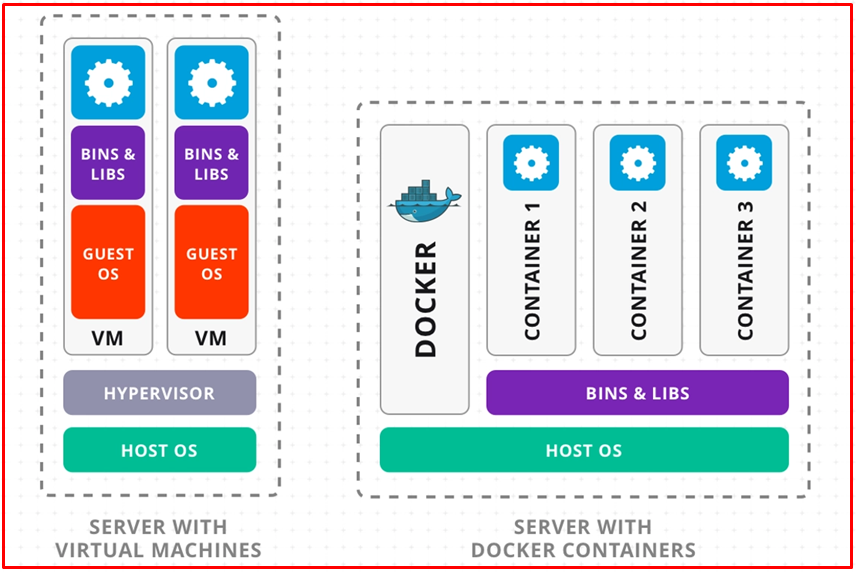
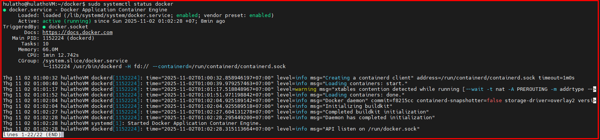
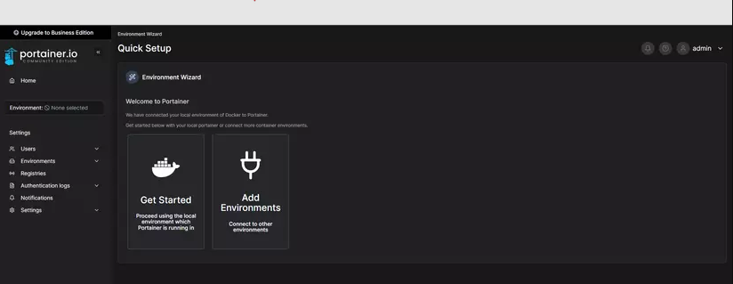

# 💚 Docker 💛

## 👉 Introduction and Summary

### 1️⃣ Introduction

+ Ở bài trước chúng ta đã biết về lý thuyết yocto và thực hành với yocto Scarthgap. Nếu các bạn chưa đọc thì xem link này nha [021_Yocto_Part2.md](../021_Yocto_Part2/021_Yocto_Part2.md). Ở bài này chúng ta sẽ tìm hiểu về docker nhé.

+ Lý thuyết docker mình sẽ bỏ qua mọi người có thể đọc trên mạng. Ở bài này chủ yếu chúng ta tạo ra docker image từ docker file sau đó từ docker file tạo ra container. Lưu ý mỗi container là 1 máy Ubuntu. Ví dụ container 1 tạo ubuntu 18.08 còn container 2 tạo ra ubuntu 22.04.

### 2️⃣ Summary

Nội dung của bài viết gồm có những phần sau nhé 📢📢📢:
- [I. Introduction and Summary](#👉-introduction-and-summary)

    - [1. Introduction](#1️⃣-introduction)
    - [2. Summary](#2️⃣-summary)
- [II. Contents](#👉-contents)
    - [1. Giới thiệu](#1️⃣-giới-thiệu)
    - [2. Install docker](#2️⃣-install-docker)
    - [3. Tạo docker file](#3️⃣-tạo-docker-file)
    - [4. Chạy các command](#4️⃣-chạy-các-command)
    - [5. Portainer ](#5️⃣-portainer)
- [III. Conclusion](#✔️-conclusion)
- [IV. Exercise](#💯-exercise)
- [V. NOTE](#📺-note)
- [VI. Reference](#📌-reference)

## 👉 Contents

### 1️⃣ Giới thiệu

+ Mục đích: Vì có quá nhiều version ubuntu trong khi chúng ta làm việc mà cài nhiều máy ảo rất mệt, hơn nữa khi cài máy ảo chỉ cho sử dụng 1 phần sức mạnh của máy tính thôi. Còn cài docker ở đâu thì có thể dùng đầy đủ sức mạnh đối với máy host là máy ubuntu. Hơn nửa chỉ mất vài giây để mở 1 container docker lên, quá nhanh.

+ Mỗi container là 1 máy ubuntu, mà container chỉ cần 1GB - 2GB dung lượng ổ cứng. Vì vậy, nó hiệu quả hơn nhiều so với việc cài đặt một máy ảo hoàn chỉnh.

+ Dockerfile mô tả nội dung của một hình ảnh Docker, và một container Docker là một thể hiện của hình ảnh đó. Các container Docker chia sẻ kernel của máy chủ nhưng có hệ thống tệp gốc riêng như được chỉ định trong Dockerfile. Điều này cho phép bạn chạy các ứng dụng yêu cầu một phiên bản hệ điều hành cụ thể trên một máy chủ có hệ điều hành khác. Nó đảm bảo rằng môi trường của bạn không bị ảnh hưởng bởi các gói đã cài đặt khác và cho phép bạn đảm bảo rằng ứng dụng chỉ hoạt động với các gói được chỉ định trong Dockerfile.

<p align="center">
     
</p>

+ Trong khi máy host là ubuntu 20.04, thì docker image ta có thể tạo version ubuntu tùy ý. Tuy nhiên máy host sẽ không thể truy cập được vào máy docker
<pre>
┌─────────────────────────────────────────────┐
│ Host System: Ubuntu 22.04                   │
│                                             │
│                         Docker Container    │
│                      ┌───────────────────┐  │
│ Host cannot access   │ Ubuntu 20.04      │  │
│ files inside         │ Mini OS system    │  │
│ conatiner -------->  │                   │  │
│                      │ <-- Cannot access │  │
│                      │     files outside │  │
│                      │     container     │  │
│                      └───────────────────┘  │
└─────────────────────────────────────────────┘
</pre>

+ Khi tọa docker ubuntu riêng, nên tạo 1 share folder để copy qua lại giữa máy host và máy docker. Câu lệnh để tạo share folder sẽ có ở phần sau. Nó sẽ có dạng
> --volume=/home/hula/yocto:/home/hula/yocto

<pre>
┌────────────────────────────────────────────────┐
│ Host System: Ubuntu 22.04                      │
│                                                │
│                         Docker Container       │
│                      ┌───────────────────────┐ │
│ Host cannot access   │ Ubuntu 20.04          │ │
│ files inside         │ Mini OS system        │ │
│ conatiner -------->  │                       │ │
│                      │ <-- Cannot access     │ │
│                      │     files outside     │ │
│                      │     container         │ │
│                      ┴                       │ │
│ /home/hula/yocto <-----> /home/hula/yocto    │ │  
│              (direct accesss)                │ │
│                      ┬                       │ │
│                      └───────────────────────┘ │
└────────────────────────────────────────────────┘
</pre>

### 2️⃣ Install docker
+ Install docker theo link sau: [LINK](https://docs.docker.com/engine/install/ubuntu/#install-using-the-repository). Cứ làm theo y hệt là được thôi
+ Check thông số của docker khi docker đang run
> $ sudo systemctl status docker --no-pager

<p align="center">
     
</p>

+ Thêm quyền sudo, sau đó restart lại mới được
```bash
$ sudo usermod -a -G docker ${USER}
$ usermod -aG sudo ${USER}
```

+ Kiểm tra xem mình đã là 1 phần của docker group chưa
> $ id -nG | grep docker
+ Verify that you can run docker commands without sudo.
> docker run hello-world

+ Khi này quá trình install docker mới hoàn tất. Docs chi tiết hơn ở đây nhé: [LINK](https://docs.docker.com/engine/install/linux-postinstall/)


### 3️⃣ Tạo docker file

***Dockerfile***
+ Để tạo ra được docker image chúng ta cần tạo ra file dockerfile trước tiên.

+ Template bạn có thể lấy ở đây:
  + 16.04: https://github.com/renesas-rz/docker_setup/blob/main/Dockerfile.rzg_ubuntu-16.04
  + 18.04: https://github.com/renesas-rz/docker_setup/blob/main/Dockerfile.rzg_ubuntu-18.04
  + 20.04: https://github.com/renesas-rz/docker_setup/blob/main/Dockerfile.rzg_ubuntu-20.04
  + 22.04: https://github.com/renesas-rz/docker_setup/blob/main/Dockerfile.rzg_ubuntu-22.04
+ Hoặc dùng lệnh sau để download về
> $ wget https://raw.githubusercontent.com/renesas-rz/docker_setup/master/Dockerfile.rzg_ubuntu-20.04

+ Container: Ngoài ra, có thể sử dụng trực tiếp image từ hub. Hãy sử dụng những image có check Trusted content. Link docker hub [LINK](https://hub.docker.com/search)

+ Dùng Docker File hoặc commit từ Container đang sử dụng để tạo ra Image chứa môi trường lập trình phù hợp cho project của bạn.

+ Gửi Image sang cho đồng đội trong team để chạy project bằng cách tạo ra Container, việc khởi tạo các Container mất khoảng vài giây.

+ Bạn có thể upload các Image bạn đã tạo ra lên Docker Hub để chia sẽ.

+ Từ Docker Hub, bất kì người dùng nào cũng có thể pull Image của bạn về để chạy tạo ra các Container.

***Vài lưu ý về dockerfile***
+ RUN DEBIAN_FRONTEND=noninteractive: Cài đặt bất cứ thứ gì cũng không cần phải bấm YES
+ ENV TZ=$TZ_VALUE: Cài đặt múi giờ
+ RUN apt-get install -y curl nano: Install các package cần thiết. Vào docs yocto package mà lấy
+ ENV: để lưu các biến môi trường

### 4️⃣ Chạy các command
1. Để file [Dockerfile](./docker_images/Dockerfile) vào thư mục làm việc sau đó chạy lệnh:
```bash
docker build -t u1804:latest .
```

hoặc

```bash
docker build --no-cache \
  --build-arg "host_uid=$(id -u)" \
  --build-arg "host_gid=$(id -g)" \
  --build-arg "USERNAME=$USER" \
  --build-arg "TZ_VALUE=$(cat /etc/timezone)" \
  --tag rz_ubuntu-20.04 \
  --file Dockerfile.rzg_ubuntu-20.04  .
```


2. Khởi tạo container từ image u1804:latest vừa build xong:
```bash
docker run -it \
  --name="u1804_$(date +%s)" \
  --volume="/home/hulatho/share_folder_VM":"/home/hulathodocker/share_folder_VM" \
  --workdir="/home/hulathodocker" \
  u1804
```

hoặc 

```bash
mkdir -p /home/$USER/yocto
docker run -it \
  --name=my_container_for_20.04 \
  --volume="/home/$USER/yocto:/home/$USER/yocto" \
  --workdir="/home/$USER" \
  rz_ubuntu-20.04
```


+ Có thể sử dụng: "apt list" Để kiểm tra các gói chúng ta cần cài ở dockerfile có đúng hay không?
+ lscpu: để xem thông số cpu trên máy docker container

3. Để thoát khỏi container
exit

4. Kiểm tra tên các container đang được chạy start trên máy host
docker ps

5. Kiểm tra tên các container đang có trên máy host
docker ps -a

6. Để khởi động lại container sau khi exit hoặc stop
+ docker exec -it <id hoặc name container> /bin/bash
+ docker exec -it --user root <id hoặc name container> /bin/bash
+ Exit (nếu muốn thoát)
+ docker attach <id hoặc name container> (vào lại)
+ docker stop <id hoặc name container> (nếu muốn dừng)
 
---

### **1. Build Image từ Dockerfile**
```bash
docker build -t u1804:latest .
```
- **`-t`**: Đặt tên cho image (`u1804`) và tag (`latest`).
- **`.`**: Xác định Dockerfile nằm tại thư mục hiện tại.

---

### **2. Khởi tạo Container từ Image**
```bash
docker run -it \
  --name="u1804_$(date +%s)" \
  --volume="D:\share_folder_VM":"/home/hulathodocker/share_folder_VM" \
  --workdir="/home/hulathodocker" \
  u1804
```
- **`-it`**: Mở giao diện tương tác với container (cho phép bạn nhập lệnh).
- **`--name`**: Đặt tên động cho container với thời gian `$(date +%s)` để tránh trùng lặp.
- **`--volume`**: Gắn thư mục từ máy host vào container.
- **`--workdir`**: Thiết lập thư mục làm việc mặc định khi container khởi động.

---

### **3. Thoát khỏi Container**
```bash
exit
```
- Lệnh này thoát khỏi container và **dừng** container đó.

---

### **4. Kiểm tra Các Container Đang Chạy**
```bash
docker ps
```
- Danh sách các container đang **chạy**.

---

### **5. Kiểm tra Tất Cả Container (Bao Gồm Cả Container Đã Dừng)**
```bash
docker ps -a
```
- Hiển thị cả container **đã dừng** và **đang chạy**.

---

### **6. Khởi Động Lại Container**
```bash
docker start <container_id hoặc container_name>
```
- Khởi động container đã dừng.

```bash
docker exec -it <container_id hoặc container_name> /bin/bash
```
- Vào lại container đang chạy bằng **exec** với quyền bash.

### **7. Rename a container (in case you don't like the name)**
```bash
$ docker rename CONTAINER NEW_NAME
```

### **8. Change your prompt inside your container**
When you are **inside** your container, you can change the prompt in your terminal to make it easier to remember what window is your docker window.
When you are inside your container, simply add the following 2 lines to your contianer's  ~/.bashrc file.
<br>
**If you used the supplied dockerfile to create your Images, this is already done.**
<pre>
PS1="\[\e[33m\]dir: \w\n\[\e[1;31m\](docker)$\[\e[00m\] "

printf "\e]2;docker\a"
</pre>

### **9. Change time zone inside container**
+ Container sẽ lấy ngày giờ từ máy chủ, nhưng múi giờ có thể khác. Do đó, hãy đặt múi giờ bên trong container cho khớp với máy chủ của bạn bằng cách sử dụng tzdata.
```bash
[ inside the container ]
$ sudo apt-get install tzdata
$ sudo dpkg-reconfigure tzdata
$ ls -la /etc/localtime
```

### **10. Add 'tumx' so things like menuconfig will display correctly**
+ Khi bạn ở trong một container, "terminal" mà bạn đang thực thi lệnh không phải là standard terminal và một số thứ sẽ không hiển thị chính xác. Tuy nhiên, bạn có thể chạy 'tumx', chương trình mô phỏng standard terminal, và khi đó mọi thứ (như menuconfig) sẽ hiển thị chính xác bên trong container của bạn.
```bash
#Install tmux
[ inside the container ]
$ sudo apt-get install tmux
```
+ Run this each time you enter the container (before you start to do any Yocto work)
```bash
$ tmux
```

### **11. Suggestions software packages to add inside your container**
+ Here are some common packages that are useful inside your container even though you will only be using it for Yocto builds.

+ For menuconfig, you need the ncurser package:
```bash
$ sudo apt-get install libncurses5-dev libncursesw5-dev
```

---
### **Gợi ý thêm**:
- **Xóa container đã dừng**:
  ```bash
  docker rm <container_id hoặc container_name>
  ```
- **Xóa image không cần thiết**:
  ```bash
  docker rmi <image_id>
  ```
- **Xem dung lượng Docker đang chiếm dụng**:
  ```bash
  docker system df
  ```
- **Cập nhật lại số nhân CPU cho các container**:
  ```bash
  docker update --cpus="44" --memory="64g" <container_name>
  ```
- **Nếu tạo mới thêm option như ví dụ dưới đây**:
  ```bash
  docker run -d --name <container_name> \
  --cpus="44" \
  --memory="64g" \
  --memory-swap="32g" \
  <image_name>:latest
  ```
- **Kiểm tra container nào đang chiếm nhiều dung lượng**:
  ```bash
  docker stats redis1 redis2

  CONTAINER           CPU %               MEM USAGE / LIMIT     MEM %               NET I/O             BLOCK I/O
  redis1              0.07%               796 KB / 64 MB        1.21%               788 B / 648 B       3.568 MB / 512 KB
  redis2              0.07%               2.746 MB / 64 MB      4.29%               1.266 KB / 648 B    12.4 MB / 0 B
  ```
---

## Cách build image Docker mà không cần Dockerfile
### 1. **Chạy container từ một image có sẵn**  
- Chạy container từ một image base (ví dụ `ubuntu:18.04`):  
```s
docker run -it ubuntu:18.04 /bin/bash
```
 
- Bên trong container, bạn có thể cài đặt các gói, tạo file hoặc thực hiện các thay đổi tùy ý. Ví dụ:  
```s
apt update && apt install -y python3 python3-pip locales
apt install sudo zip
apt update && apt install -y libssl-dev
apt install gawk wget git-core diffstat unzip texinfo gcc-multilib \
>   build-essential chrpath socat cpio python3 python3-pip python3-pexpect \
>   xz-utils debianutils iputils-ping python3-git python3-jinja2 libegl1-mesa \
>   libsdl1.2-dev pylint xterm
adduser hulatho
usermod -aG sudo hulatho
locale-gen en_US.UTF-8 && update-locale LANG=en_US.UTF-8

 
- Sau đó, bạn có thể **thoát** khỏi container bằng lệnh:  
```bash
exit
```


### 2. **Liệt kê các container đang chạy và đã dừng**  
- Dùng lệnh sau để xem container bạn vừa tạo:
```s
docker ps -a
```
- Bạn sẽ thấy danh sách các container, cùng với **CONTAINER ID** của container vừa thoát.

 
### 3. **Commit container thành image mới**  
- Dùng lệnh sau để **tạo một image mới** từ container đã thay đổi:
 
```bash
docker commit <container_id> my_custom_image:latest
```
- **`<container_id>`**: ID của container bạn vừa dùng.
- **`my_custom_image:latest`**: Tên và tag của image mới.
 
 
### 4. **Kiểm tra image mới**  
Sau khi commit thành công, kiểm tra image bằng lệnh:
 
```s
docker images
```
 
 
### 5. **Chạy container từ image mới**  
- Bây giờ, bạn có thể khởi chạy một container từ image tùy chỉnh:
 
```s
docker run -it my_custom_image:latest /bin/bash
```
 
 
### 6. **Push image lên Docker Hub (nếu cần)**  
- Nếu bạn muốn chia sẻ image này, thực hiện theo các bước sau:
1. **Tag image:**
```s
docker tag my_custom_image:latest <your_dockerhub_username>/my_custom_image:latest
```
2. **Push image lên Docker Hub:**
```s
docker push <your_dockerhub_username>/my_custom_image:latest
```


### 5️⃣ Portainer
***Portainer là gì?***
+ Portainer là công cụ quản lý Docker Containter miễn phí với kích thước gọn nhẹ và giao diện quản lý trực quan, đơn giản để triển khai cũng như sử dụng, cho phép người dùng dễ dàng quản lý Docker host hoặc Swarm cluster.
+ Portainer được chia làm 2 phiên bản là Community Edition (CE) và Business Edition (BE). Bảng CE là phiên bản miễn phí nhưng những tính năng nó cung cấp hoàn toàn đủ để chúng ta có thể sử dụng

***Cách cài đặt Portainer***
+ Để cài đặt và sử dụng Portainer, VPS của bạn phải được cài đặt Docker và Docker Compose. Ở những phiên bản sau này, Docker Compose đã được tích hợp sẵn vào trong Docker. Sử dụng câu lệnh sau để đảm bảo Docker và Docker Compose đã được cài đặt:
```bash
docker --version # Kiểm tra Docker đã được cài chưa
docker compose --version # Kiểm tra Docker Compose đã được cài chưa
```

+ Nếu VPS đã được cài đặt đầy đủ docker và docker compose, tiến hành tạo volume để Portainer Server lưu trữ dữ liệu
```bash
docker volume create portainer_data
```

+ Tiến hành download và cài đặt Portainer Server container:
```bash
docker run -d -p 8000:8000 -p 9443:9443 --name portainer --restart=always -v /var/run/docker.sock:/var/run/docker.sock -v portainer_data:/data portainer/portainer-ce:latest
```

+ Đợi vài phút để Docker pull Potainer image về máy và cài đặt. Sau khi cài đặt xong, mở trình duyệt truy cập vào địa chỉ sau để thiết lập Portainer
```bash
$ docker start portainer
$ ifconfig
$ http://<IP-Address>:9000
```

+ Khi truy cập Portainer lần đầu, hệ thống sẽ yêu cầu tạo mật khẩu cho tài khoản admin. Nhập mật khẩu của bạn (tối thiểu 12 ký tự) sau đó nhấn **Create User**

+ Giao diện sau khi đã tạo user thành công:

<p align="center">
     
</p>

+ Nhấn vào nút **Get Started** để tiến hành kết nối Portainer Server với thiết bị nó đang khởi chạy


## ✔️ Conclusion
Ở bài này chúng ta đã biết các kiến thức về docker và thực hành xung quanh docker. Tiếp theo chúng ta cùng đi tìm hiểu lý thuyết về linux kernel nhé.

## 💯 Exercise
+ Thực hành lại theo bài viết

## 📺 NOTE
+ N/A

## 📌 Reference

[1] https://www.docker.com/

[2] https://docs.docker.com/engine/install/

[3] https://docs.docker.com/get-started/introduction/

[4] https://docs.yoctoproject.org/5.0.13/brief-yoctoprojectqs/index.html#build-host-packages

[5] https://github.com/renesas-rz/docker_setup

[6] https://docs.docker.com/install/linux/docker-ce/ubuntu

[7] https://www.digitalocean.com/community/tutorials/how-to-install-and-use-docker-on-ubuntu-18-04

[8] https://docs.portainer.io/start/install-ce/server/docker/linux 
