# 💚 Linux Kernel Module Basic 💛

## 👉 Introduction and Summary

### 1️⃣ Introduction

+ Ở bài trước chúng ta đã biết về lý thuyết Docker và tạo 1 container để chạy được ubuntu 18.04. Nếu các bạn chưa đọc thì xem link này nha [022_Docker.md](../022_Docker/022_Docker.md). Ở bài này chúng ta sẽ tìm hiểu về linux kernel module nhé. Ở bài này sẽ chưa cần đụng đến mạch đâu nhé.

### 2️⃣ Summary

Nội dung của bài viết gồm có những phần sau nhé 📢📢📢:
- [I. Introduction and Summary](#👉-introduction-and-summary)

    - [1. Introduction](#1️⃣-introduction)
    - [2. Summary](#2️⃣-summary)
- [II. Contents](#👉-contents)
    - [1. Linux kernel header](#1️⃣-linux-kernel-header)
    - [2. Kernal module basic](#2️⃣-kernel-module-basic)
    - [3. Thực hành](#3️⃣-thực-hành)
- [III. Conclusion](#✔️-conclusion)
- [IV. Exercise](#💯-exercise)
- [V. NOTE](#📺-note)
- [VI. Reference](#📌-reference)

## 👉 Contents

​<p align="center">
  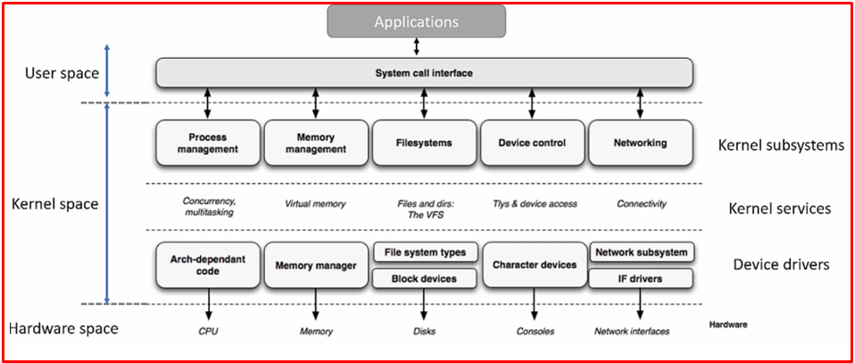   
</p>

### 1️⃣ Linux kernel header
+ Như cái tên gọi của nó, kernel header sẽ là các header file ở kernel (.h) để các module include vào và gọi các chức năng ra.
+ Là thành phần được sử dụng để compile cho module của kernel.
+ Kernel header được cài đặt phải trùng với kernel version mà bạn muốn sử dụng (uname –r).
+ Để kiểm tra kernel version ta sẽ gõ lệnh:
```s
uname -r
```

​<p align="center">
  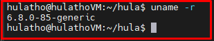   
</p>

+ Để install kernel header ta chạy câu lệnh dưới
```s
sudo apt install -y linux-headers-`uname -r`
```

+ Khi này kernel header của ta sẽ nằm trong thư mục: /lib/modules

​<p align="center">
  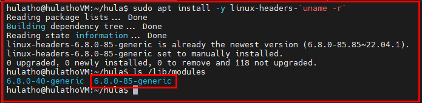   
</p>


### 2️⃣ Kernal module basic

***What is Kernel module***
+ Chúng ta đã quen với code MCU, nghĩa là ta sẽ dùng 1 compiler để compile source code của chúng ta ra 1 file elf, sau đó load file elf duy nhất đó vào chip. Khi này chíp sẽ chạy theo nội dung của file elf.
+ Tuy nhiên, với linux kernal sẽ khác. Hãy tưởng tượng ta có thể load được nhiều file elf lên chip mà mỗi file elf đó là 1 process. Trong linux file elf này tên là file .ko. Ta boot board lên sau đó chỉ việc load các file .ko này vào
+ Linux sẽ cung cấp cho ta cơ chế có thể insert hoặc remove file này đi.
+ Một mô-đun Kernel cung cấp một (hoặc nhiều) new service có sẵn cho users
+ Sau khi một mô-đun được load và service mới được register. Service có thể được sử dụng bởi tất cả các processes, miễn là mô-đun còn trong memory

​<p align="center">
  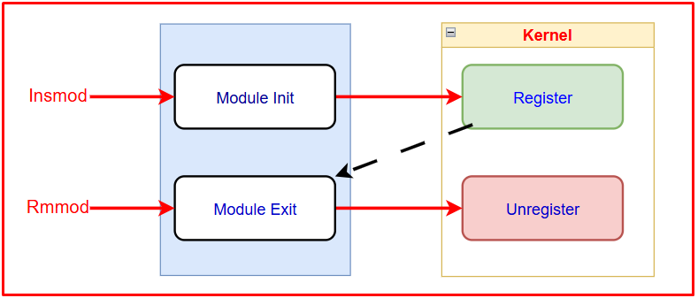   
</p>

***Kernel module feature***
+ Kernel Module cho phép ta load một số object file chứa code mở rộng cho kernel đang chạy. Khi không cần thiết nữa thì ta có thể giải phóng đi
+ Kernel có thể hoạt động như 1 driver như get some data from kernel, unit test, implement new feature cho linux
+ Process Modprobe quản lý tất cả các kernel module. Vì vậy chúng ta không thể load một kernel module trước khi tiến trình này được tải. Vì vậy, đối với mọi sự kiện xảy ra trước khi Modprobe được tải, chúng ta không thể sử dụng kernel module để thay đổi chúng. Ví dụ: khởi tạo CPU, khởi tạo bộ nhớ, v.v.

***Data structure***
+ Sau khi tải một module kernel vào system, kernel sẽ tạo một object module từ struct module. Sau đó, nó push new object vào double linker list. Bất cứ khi nào phát hiện một new device được plug vào system, kernel sẽ tra cứu correct driver từ danh sách này. 
+ Linux kernel define struct module (linux/include/module.h) to store all information of a kernel module.

​<p align="center">
  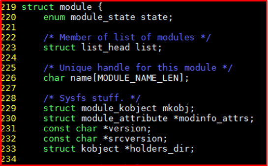   
</p>

***Link giữa external function***
+ Kernel module có thể call 1 function từ kernel source hoặc từ 1 kernel module khác, nhưng sẽ có sự khác biệt với việc chúng ta hay call hàm ở MCU.
+ Ví dụ ở kernel module sẽ call function good_bye() và biến name từ 1 kernel module khác.
​<p align="center">
  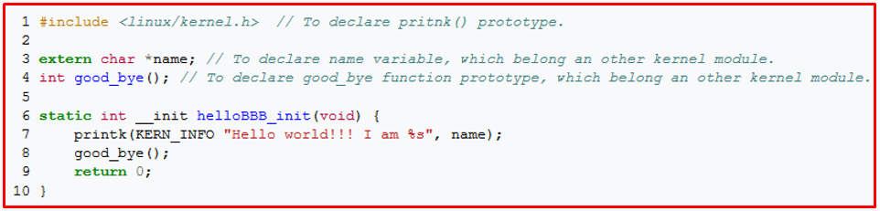   
</p>

+ Khi này ở kernel module khác sẽ phải sử dụng EXPORT_SYMBOL() để public ra. Hàm này sẽ đặt địa chỉ hàm và biến trong dấu ngoặc đơn vào phần ksymtab, để một kernel module bên ngoài có thể tra cứu trong đó và truy cập địa chỉ cần thiết.
​<p align="center">
  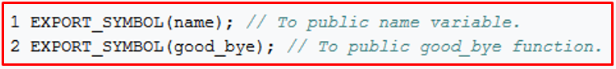   
</p>


***MODULE DEPENDENCY***
+ Nếu 1 module A call 1 function của module B thì cần phải load module B trước sau đó mới load module A.
+ Ta có thể sử dụng lsmod để xem các module trong kernel và sự phụ thuộc giữa chúng
​<p align="center">
  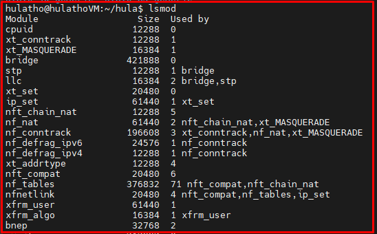   
</p>

+ Module user counter: Đây là số lượng module kernel phụ thuộc vẫn đang chạy trong hệ thống. Bất cứ khi nào một module kernel sử dụng bất kỳ hàm nào của module kernel khác thì user_count được lưu trong object module của module kernel sẽ tăng lên. Chúng ta không thể rmmod một module kernel có trường này lớn hơn 0. Kernel Linux sẽ kiểm tra trường này trước khi rmmod một module kernel.
+ Kernel phải làm điều này vì việc dỡ bỏ một module kernel trong khi một module phụ thuộc khác đang chạy là rất nguy hiểm. Khi một module kernel phụ thuộc gọi một hàm trong module chưa được dỡ bỏ, hệ thống có thể bị sập.
+ Trong  binary file của bất kỳ module kernel nào đều luuw trữ 1 list các name of function and variable cần dùng từ bên ngoài. Vì vậy, trước khi kernel tải một module, nó sẽ đọc danh sách tên này trước và tra cứu tất cả các tên trong phần ksymtab. Nếu tìm thấy tất cả các tên, module sẽ được tải. Nếu không, kernel sẽ trả về giá trị lỗi và không tải module này.

***Load 1 kernel module***
+ System có 3 cách để load 1 kernel module
    + Trong khi booting time, system có một số code hoặc script, chúng gọi lệnh "insmod" để load 1 kernel lên
    + Trong running time, user có thể run "insmod" command cùng với path  để load 1 kernel module chỉ định lên
    + Khi 1 device mới đực cắm vào hệ thống: Kernel sẽ nhận được một số thông tin phần cứng như major number, minor number, sau đó nó sẽ tạo sự kiện plug vào user-space. Chương trình /sbin/hotplug xử lý sự kiện này. Nó sẽ nhận được chuỗi "bustype:vendor:product:version" lưu trữ thông tin thiết bị. Chương trình hotplug sẽ đọc file /lib/modules/3.13.0-24-generic/modules.alias để tìm một kernel module khớp với thiết bị này. Sau đó, nó sẽ tải một kernel module chính xác để điều khiển thiết bị mới.

***Communication với 1 kernel module***
+ Chúng ta có 2 cách để communication với 1 kernel module đó là dùng IPC và Module parammeter. Với IPC chugs ta sẽ nói ở các bài sau. Còn với parammeter chính là các đối số mà chúng ta truyền vào 1 module kernel khi load module đó lên
```c
int g_Counter_i = 15;
module_param(g_Counter_i, short, 0444);
static int __init hula_init(void)
{
    /* Do something */
}
```
+ Trong đoạn code trên module_param là 1 macro để định nghĩa parammeter module, 0444 là quyền tham số. Chúng ta có thể đọc hoặc ghi vào parammeter của module trong đường dẫn sau:
```bash
/sys/module/your_module_name/parameters/your_param_name
```

***Init Exit function***
+ __init là chức năng đầu tiên được thực thi khi module được load vào kernel
+ __exit là chức năng được thực thi sau cùng khi module được unload khỏi kernel
+ Khi có __init và __exit thì compiler sẽ đưa vào vùng tương ứng là .init.text và .exit.text

​<p align="center">
  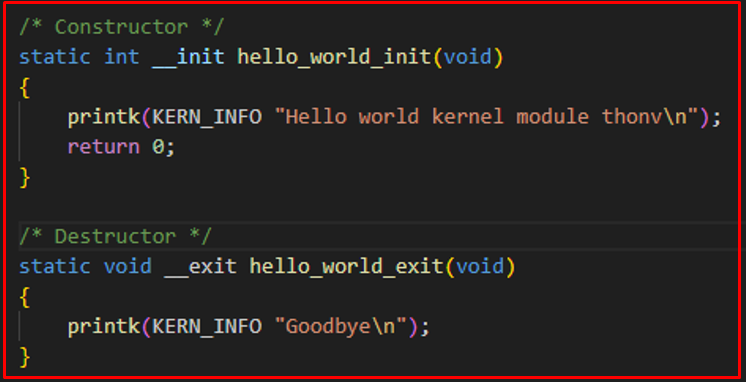   
</p>

​<p align="center">
  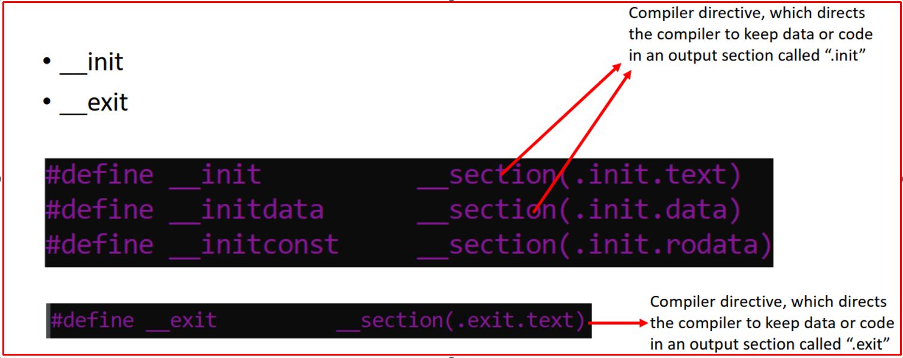   
</p>

***Các thông số khác***
+ License: Giấy phép GPL
+ GPL là bản quyền mà cho phép mang code đi đâu, thương mại cũng được
+ Author: Nhà phát triển module
+ Module despciption: Mô tả sơ bộ về module
+ Module version: Phiên bản module

***Ví dụ về 1 hello kernel module***
+ File hello.c
```c
#include <linux/module.h>  /* Thu vien nay dinh nghia cac macro nhu module_init va module_exit */
#include <linux/fs.h>      /* Thu vien nay dinh nghia cac ham allocate major & minor number */

#define DRIVER_AUTHOR "hula xxxxxxxx@gmail.com"
#define DRIVER_DESC   "Hello world kernel module"
#define DRIVER_VERS   "1.0"

/* Constructor */
static int  __init hello_world_init(void)
{
    printk(KERN_INFO "Hello world kernel module\n");
    return 0;
}

/* Destructor */
static void  __exit hello_world_exit(void)
{
    printk(KERN_INFO "Goodbye HuLa\n");
}

module_init(hello_world_init);
module_exit(hello_world_exit);

MODULE_LICENSE("GPL");
MODULE_AUTHOR(DRIVER_AUTHOR);
MODULE_DESCRIPTION(DRIVER_DESC);  
MODULE_VERSION(DRIVER_VERS);
```

+ File Makefile

```Makefile
EXTRA_CFLAGS = -Wall
obj-m = hello.o

KDIR = /lib/modules/`uname -r`/build

all:
    make -C $(KDIR) M=`pwd` modules
    # make -C /lib/modules/$(shell uname -r)/build M=$(PWD) modules

clean:
    make -C $(KDIR) M=`pwd` clean
    # make -C /lib/modules/$(shell uname -r)/build M=$(PWD) clean
```

+ Giải thích về file makefile:
    + Object-m: Nghĩa là mình sẽ đi load module bằng tay vào kernel
    + Object-y: Là build-in, ở 1 bài sau này mình sẽ thực hành về build-in
    + /lib/modules/`uname -r`/build: là trỏ tưới mấy file.h của header_kernel

+ Hướng dẫn chạy
```bash
$ make all                       : build kernel module sẽ ra file hello.ko
$ modinfo hello.ko               : modinfo là module infor, dùng để kiểm tra thông tin module trên hệ thống
$ sudo insmod hello.ko           : insmod là insert module
$ sudo rmmod hello               : rmmod là remove module
$ sudo dmesg | tail              : check log in ra từ printk
$ lsmod | grep hello             : kiểm tra module đang tồn tại trên hệ thống
```
​<p align="center">
  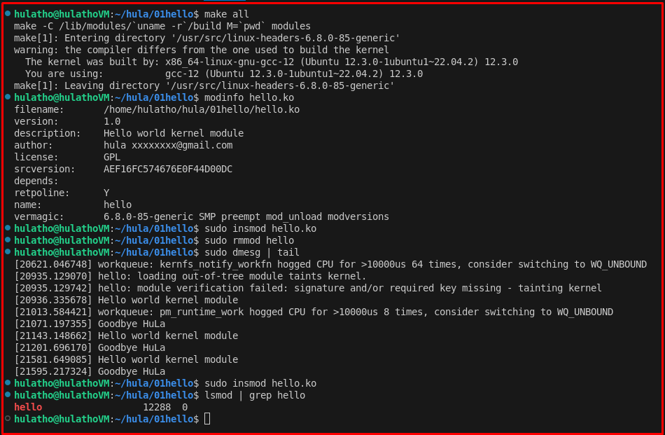   
</p>

***Lưu ý***
+ modprobe hoạt động như insmod và nó check module dependencies. Nó chỉ có thể load một module nằm trong thư mục /lib/modules/
+ rmmod xóa một module đã tải và tất cả các dịch vụ của nó
+ lsmod liệt kê các module hiện đang được tải trong kernel, hoạt động thông qua /proc/modules
+ Khi "sudo insmod hello.ko" sau đó "dmesg | tail" sẽ hiện "Hello world kernel module"
+ Khi "sudo rmmod hello" sau đó "dmesg | tail" sẽ hiện "Goodbye HuLa"


### 3️⃣ Thực hành
+ Mỗi bài thực hành ta sẽ có 2 file là file .c và file Makefile.

***Bài số 1***
+ File hello1.c
```c
#include <linux/module.h> /* Needed by all modules */
#include <linux/kernel.h> /* Needed for KERN_INFO */
int init_module(void)
{
    printk(KERN_INFO "Hello hula 1.\n");
/*
* A non 0 return means init_module failed; module can't be loaded.
*/
    return 0;
}
void cleanup_module(void)
{
    printk(KERN_INFO "Goodbye hula 1.\n");
}
```
+ File Makefile
```Makefile
EXTRA_CFLAGS = -Wall
obj-m += hello1.o
# obj-m += hello2.o
# obj-m += hello3.o
# obj-m += hello4.o
# obj-m += hello5.o

KDIR = /lib/modules/`uname -r`/build

all:
    make -C $(KDIR) M=`pwd` modules
    # make -C /lib/modules/$(shell uname -r)/build M=$(PWD) modules

clean:
    make -C $(KDIR) M=`pwd` clean
    # make -C /lib/modules/$(shell uname -r)/build M=$(PWD) clean
```

***Bài số 2***
+ File hello2.c
```c
#include <linux/module.h> /* Needed by all modules */
#include <linux/kernel.h> /* Needed for KERN_INFO */
#include <linux/init.h> /* Needed for the macros */
static int __init hello_2_init(void)
{
    printk(KERN_INFO "Hello, hula 2\n");
    return 0;
}
static void __exit hello_2_exit(void)
{
    printk(KERN_INFO "Goodbye, hula 2\n");
}

module_init(hello_2_init);
module_exit(hello_2_exit);
```
+ File Makefile
```Makefile
EXTRA_CFLAGS = -Wall
obj-m = hello2.o

KDIR = /lib/modules/`uname -r`/build

all:
    make -C $(KDIR) M=`pwd` modules
    # make -C /lib/modules/$(shell uname -r)/build M=$(PWD) modules

clean:
    make -C $(KDIR) M=`pwd` clean
    # make -C /lib/modules/$(shell uname -r)/build M=$(PWD) clean
```

***Bài số 3***
+ File hello3.c
```c
#include <linux/module.h>   /* Needed by all modules */
#include <linux/kernel.h>   /* Needed for KERN_INFO */
#include <linux/init.h>     /* Needed for the macros */

static int hello3_data __initdata = 3;

static int __init hello_3_init(void)
{
    printk(KERN_INFO "Hello, world %d\n", hello3_data);
    return 0;
}

static void __exit hello_3_exit(void)
{
    printk(KERN_INFO "Goodbye, world 3\n");
}

module_init(hello_3_init);
module_exit(hello_3_exit);
```
+ File Makefile
```Makefile
EXTRA_CFLAGS = -Wall
obj-m = hello3.o

KDIR = /lib/modules/`uname -r`/build

all:
    make -C $(KDIR) M=`pwd` modules
    # make -C /lib/modules/$(shell uname -r)/build M=$(PWD) modules

clean:
    make -C $(KDIR) M=`pwd` clean
    # make -C /lib/modules/$(shell uname -r)/build M=$(PWD) clean
```

***Bài số 4***
+ File hello4.c
```c
#include <linux/module.h>   /* Needed by all modules */
#include <linux/kernel.h>   /* Needed for KERN_INFO */
#include <linux/init.h>     /* Needed for the macros */

#define DRIVER_AUTHOR "HuLaTho <hulatho@hula.com.vn>"
#define DRIVER_DESC   "A sample driver"

static int __init init_hello_4(void)
{
    printk(KERN_INFO "Hello, world 4\n");
    return 0;
}

static void __exit cleanup_hello_4(void)
{
    printk(KERN_INFO "Goodbye, world 4\n");
}

module_init(init_hello_4);
module_exit(cleanup_hello_4);

MODULE_LICENSE("GPL");              /* License use for module*/
MODULE_AUTHOR(DRIVER_AUTHOR);       /* Who wrote this module? */
MODULE_DESCRIPTION(DRIVER_DESC);    /* What does this module do */

/*
 *  This module uses /dev/testdevice.  The MODULE_SUPPORTED_DEVICE macro might
 *  be used in the future to help automatic configuration of modules, but is
 *  currently unused other than for documentation purposes.
 */
MODULE_SUPPORTED_DEVICE("testdevice");
```
+ File Makefile
```Makefile
EXTRA_CFLAGS = -Wall
obj-m = hello4.o

KDIR = /lib/modules/`uname -r`/build

all:
    make -C $(KDIR) M=`pwd` modules
    # make -C /lib/modules/$(shell uname -r)/build M=$(PWD) modules

clean:
    make -C $(KDIR) M=`pwd` clean
    # make -C /lib/modules/$(shell uname -r)/build M=$(PWD) clean
```

***Bài số 5***
+ Demo command line argument, chạy lệnh sau
```bash
$ make all
$ sudo insmod hello5.ko myshort=3 mystring="Hello" myint=15
$ sudo dmesg | tail -7
```
+ File hello5.c
```c
#include <linux/module.h>
#include <linux/moduleparam.h>
#include <linux/kernel.h>
#include <linux/init.h>
#include <linux/stat.h>

MODULE_LICENSE("GPL");
MODULE_AUTHOR("HuLaTho <hulatho@hula.com.vn>");

static short int myshort = 1;
static int myint = 520;
static long int mylong = 9999;
static char *mystring = "Hello HuLaTho";
static int myintArray[2] = { -1, 15 };
static int arr_argc = 0;

/* 
 * module_param(foo, int, 0000)
 * The first param is the parameters name
 * The second param is it's data type
 * The final argument is the permissions bits, 
 * for exposing parameters in sysfs (if non-zero) at a later stage.
 */

module_param(myshort, short, S_IRUSR | S_IWUSR | S_IRGRP | S_IWGRP);
MODULE_PARM_DESC(myshort, "A short integer");

module_param(myint, int, S_IRUSR | S_IWUSR | S_IRGRP | S_IROTH);
MODULE_PARM_DESC(myint, "An integer");

module_param(mylong, long, S_IRUSR);
MODULE_PARM_DESC(mylong, "A long integer");

module_param(mystring, charp, 0000);
MODULE_PARM_DESC(mystring, "A character string");

/*
 * module_param_array(name, type, num, perm);
 * The first param is the parameter's (in this case the array's) name
 * The second param is the data type of the elements of the array
 * The third argument is a pointer to the variable that will store the number 
 * of elements of the array initialized by the user at module loading time
 * The fourth argument is the permission bits
 */
module_param_array(myintArray, int, &arr_argc, 0000);
MODULE_PARM_DESC(myintArray, "An array of integers");

static int __init hello_5_init(void)
{
    int i;
    printk(KERN_INFO "Hello HuLa\n=============\n");
    printk(KERN_INFO "myshort is a short integer: %hd\n", myshort);
    printk(KERN_INFO "myint is an integer: %d\n", myint);
    printk(KERN_INFO "mylong is a long integer: %ld\n", mylong);
    printk(KERN_INFO "mystring is a string: %s\n", mystring);
    for (i = 0; i < (sizeof myintArray / sizeof (int)); i++)
    {
        printk(KERN_INFO "myintArray[%d] = %d\n", i, myintArray[i]);
    }
    printk(KERN_INFO "got %d arguments for myintArray.\n", arr_argc);
    return 0;
}

static void __exit hello_5_exit(void)
{
    printk(KERN_INFO "Goodbye HuLa\n");
}

module_init(hello_5_init);
module_exit(hello_5_exit);
```
+ File Makefile
```Makefile
EXTRA_CFLAGS = -Wall
obj-m = hello5.o

KDIR = /lib/modules/`uname -r`/build

all:
    make -C $(KDIR) M=`pwd` modules
    # make -C /lib/modules/$(shell uname -r)/build M=$(PWD) modules

clean:
    make -C $(KDIR) M=`pwd` clean
    # make -C /lib/modules/$(shell uname -r)/build M=$(PWD) clean
```

​<p align="center">
  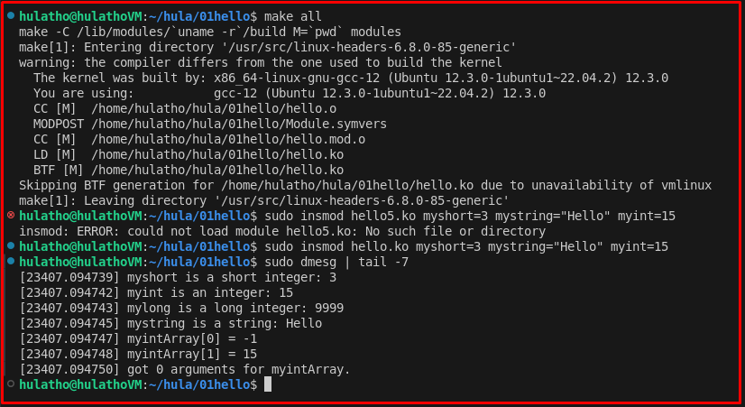   
</p>

## ✔️ Conclusion
Ở bài này chúng ta đã viết được 1 hello kernel module. Tiếp theo chúng ta cùng đi viết kernel module để blynk led trên board myir imx8mm nhé.

## 💯 Exercise
+ Create a kernel module to print value of any export variable in driver or kernel source code.
+ Create a kernel module to print log every time you plugin a keyboard to PC

## 📺 NOTE
+ N/A

## 📌 Reference

[1] Building Embedded Linux Systems.pdf

[2] Linux Device Drivers.pdf

[3] linux-kernel-intro.pdf bootlin

[4] Understanding the LINUX KERNEL.pdf

[5] Linux Device Drivers - ldd3.pdf

[6] Professional Linux Kernel Development 3rd.pdf
