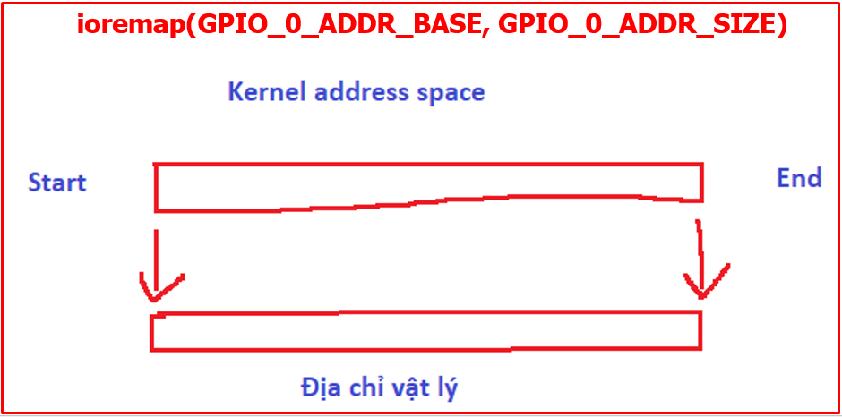

# 💚 Kernel Module Blynk Led 💛

## 👉 Introduction and Summary

### 1️⃣ Introduction

+ Ở bài trước chúng ta đã biết về cách tạo 1 module kernel basic. Nếu các bạn chưa đọc thì xem link này nha [022_Docker.md](../022_Docker/022_Docker.md). Ở bài này chúng ta sẽ tìm hiểu về ioremap và blynk led trên module kernel. Ở bài này dùng đến mạch rồi á nha.

### 2️⃣ Summary

Nội dung của bài viết gồm có những phần sau nhé 📢📢📢:
- [I. Introduction and Summary](#👉-introduction-and-summary)

    - [1. Introduction](#1️⃣-introduction)
    - [2. Summary](#2️⃣-summary)
- [II. Contents](#👉-contents)
    - [1. Cross Compile](#1️⃣-cross-compile)
    - [2. Ioremap Blynk Led](#2️⃣-ioremap-blynk-led)
- [III. Conclusion](#✔️-conclusion)
- [IV. Exercise](#💯-exercise)
- [V. NOTE](#📺-note)
- [VI. Reference](#📌-reference)

## 👉 Contents

### 1️⃣ Cross Compile
+ Laptop bình thường thì sẽ là máy X86, còn con IMX8MM là con ARM, nên sẽ có 2 khái niệm là cross compile và native compile

+ Native compile: Con X86 thì build ra nên chỉ chạy trên con X86 được thôi, con ARM build ra thì chỉ chạy được trên con ARM thôi

+ Cross compile: là build trên con X86 nhưng có thể chạy trên con ARM, lý do là vì bộ source sẽ rất lớn mà build trên con ARM thì rất lâu nên cần 1 con X86 mạnh để build được bộ source và sau đó copy qua ARM và chạy

+ Khi build yocto ta có được folder "build-xwayland/tmp/work/mys_8mmx-poky-linux/linux-imx/5.4-r0/build" đây chính là kernel header. Còn file "build-xwayland/tmp/deploy/sdk/fsl-imx-xwayland-glibc-x86_64-meta-toolchain-aarch64-mys-8mmx-toolchain-5.4-zeus.sh" chính là toolchain và ta sẽ dùng toolchain này để build thay vì dùng gcc thì khi này sẽ chạy được trên con IMX8MM

***Setup toolchain từ output build yocto***
+ Sau khi build yocto ta có file build-xwayland/tmp/deploy/sdk fsl-imx-xwayland-glibc-x86_64-meta-toolchain-aarch64-mys-8mmx-toolchain-5.4-zeus.sh. Ta sẽ làm như sau để chạy file này ra toolchain cho chúng ta
```bash
$ mkdir toolchain
$ sudo chmod 0777 build-xwayland/tmp/deploy/sdk fsl-imx-xwayland-glibc-x86_64-meta-toolchain-aarch64-mys-8mmx-toolchain-5.4-zeus.sh
$ ./build-xwayland/tmp/deploy/sdk fsl-imx-xwayland-glibc-x86_64-meta-toolchain-aarch64-mys-8mmx-toolchain-5.4-zeus.sh
Sau đó nhập đường dẫn trỏ tới folder toolchain ta mới tạo: ./toolchain
$ cd toolchain
$ source environment-setup-aarch64-poky-linux
```
+ Sau đó ta gõ lênh export để xem các biến môi trường như CC đã có chưa. Nếu có là OKAY

***Ví dụ về Cross Compile và Native Compile***
+ Ta có file main.c và Makefile như sau
```c
#include <stdio.h>

void main()
{
	printf("Hello world HuLaTho\n");
}
```

```Makefile
# Toolchain
HULA := gcc

ifeq (${X}, arm)
	CC := $(CC)
endif

all:
	$(HULA) -o hello main.c

clean:
	rm -rf hello
```

+ Giải thích: Bây giờ biến {CC} đã chứa compiler được chúng ta export ở bên trên. Nên giờ nếu dùng gcc thì chỉ chạy được trên VMware, còn dùng ${CC} thì chạy được trên IMX8MM. 
```bash
$ make all           : chạy trên VMware
$ make all X=arm     : chạy trên IMX8MM
```

***Copy file hello.exe tới SD card***
+ Cắm thẻ nhớ vào rồi lsblk xem thẻ nhớ đang là sdx (x = a hay b hay c). Thường là b
```bash
$ mkdir hula
$ sudo mount /dev/sdb1 ./hula
$ cp -rf hello.exe ./hula
$ sync
$ sudo unmount /dev/sdb1
```

+ Sau đó nhổ usb ra và cắm vào con IMX8MM rồi mount tương tự để lấy file hello.exe ra và chạy. Khi này ta sẽ thấy hello.exe chạy được trên môi trường board IMX8MM


### 2️⃣ Ioremap Blynk Led
+ Để có thể mapping được address từ Kernel address space tới Physical address ta sẽ dùng hàm ioremap.
```s
+ ioremap(Address Start, Size)
    + Address Start: Địa chỉ bắt đầu ta muốn map 1-1 tới địa chỉ vật lý
    + Size: Kích thước 
```

​<p align="center">
     
</p>


+ Vậy giờ ta sẽ đi xác định pin để cắm led vào
    + Ta chọn pin GPIO1_IO9 được show trên header trên mạch. IO này tương đương với sô integer number là 9

​<p align="center">
     
</p>

+ RM của chip: [LINK](https://drive.google.com/file/d/1j-nrvYm9T7cYhN-TMmDFVQMU_viTamub/view?usp=sharing)

***Code***
+ Ta làm phương pháp gọi là Kbuild, nghĩa là trong file Kbuild này ta thêm obj-m := led.o vào là được.
+ obj-y : Build-in kernel module
+ obj-m : Build module (.ko)
+ Tổng cộng ta có 4 file là Kbuild, led.c, led.h và Makefile

+ File Kbuild
```Kbuild
EXTRA_CFLAGS=-Wall

obj-m := led.o
```

+ File Makefile
```Makefile
# KERNELDIR ?= /home/bv_rzvt/imx-yocto-bsp/build-xwayland/tmp/work/mys_8mmx-poky-linux/linux-imx/5.4-r0/build
KERNELDIR ?= /home/hulatho/hula/build/

all:
	$(MAKE) -C $(KERNELDIR) M=$(PWD) modules
	
clean:
	$(MAKE) -C $(KERNELDIR) M=$(PWD) clean
```

+ File led.h
```h
#ifndef __GPIO__MODULE_H__
#define __GPIO__MODULE_H__

#define CCM_CCGRn_ADDR_BASE            (0x30380000)
#define GPIO_1_ADDR_BASE               (0x30200000)

#define GPIO1_ENABLE_CLOCK_OFFSET      (0x40B0)
#define GPIO1_SET_CLOCK_OFFSET         (0x40B4)
     
#define GPIO_DR_OFFSET                 (0x00)	    
#define GPIO_GDIR1_OFFSET	           (0x04)	/* 0 input ; 1 output */	

#define GPIO_1_ADDR_SIZE	           (0x3020FFFF - GPIO_1_ADDR_BASE)
#define CCM_CCGRn_ADDR_SIZE            (0x3038FFFF - CCM_CCGRn_ADDR_BASE)

#define IOMUXC_SW_MUX_CTL_PAD_GPIO1_IO09_BASE    (0x3033003C)
#define IOMUXC_SW_MUX_CTL_PAD_GPIO1_IO09_SIZE    (0x30330040 - 0x3033003C)

#define LED     (1 << 9)                /* GPIO_1_IO9 (1-1)*32 + 9 */
#define CLK     (0x00003333)

#endif  /* __LEDA_MODULE_H__ */
```
+ File led.c
```c
#include <linux/module.h>	/* This module defines functions such as module_init/module_exit */
#include <linux/io.h>		/* This module defines functions such as ioremap/iounmap */
#include "led.h"		    /* LED modules */

#define DRIVER_AUTHOR "HuLaTho <hulatho@hula.com.vn>"
#define DRIVER_DESC   "IOremap Led Blynk"

uint32_t __iomem *base_addr;
uint32_t __iomem *base_addr_clk;
uint32_t __iomem *base_addr_mux_gpio1_io9;

/* Constructor */
static int __init led_init(void)
{
	base_addr = ioremap(GPIO_1_ADDR_BASE, GPIO_1_ADDR_SIZE);
	base_addr_clk = ioremap(CCM_CCGRn_ADDR_BASE, CCM_CCGRn_ADDR_SIZE);
	base_addr_mux_gpio1_io9 = ioremap(IOMUXC_SW_MUX_CTL_PAD_GPIO1_IO09_BASE, IOMUXC_SW_MUX_CTL_PAD_GPIO1_IO09_SIZE);

	if(!base_addr)
		return -ENOMEM;
	if(!base_addr_clk)
		return -ENOMEM;
	if(!base_addr_mux_gpio1_io9)
		return -ENOMEM;

	*(base_addr_clk + GPIO1_ENABLE_CLOCK_OFFSET / 4) |= CLK;
	*(base_addr_clk + GPIO1_SET_CLOCK_OFFSET / 4) |= CLK;

	*(base_addr_mux_gpio1_io9) |= 1 << 4;  /* ENABLED SION */
	*(base_addr_mux_gpio1_io9) &=~ 0x07;  /* Select signal GPIO1_IO05, ALT Function */

	*(base_addr + GPIO_GDIR1_OFFSET / 4) |= LED;
	*(base_addr + GPIO_DR_OFFSET / 4) |= LED;

	pr_info("Initizliaze Led successfully HuLa IOREMAP!\n");
	return 0;
}

/* Destructor */    
static void __exit led_exit(void)
{
	*(base_addr + GPIO_DR_OFFSET / 4) &=~ LED; 

	iounmap(base_addr);
	iounmap(base_addr_clk);
	iounmap(base_addr_mux_gpio1_io9);

	pr_info("Good bye Led HuLa IOREMAP!!!\n");
}

module_init(led_init);
module_exit(led_exit);

MODULE_LICENSE("GPL");
MODULE_AUTHOR(DRIVER_AUTHOR);
MODULE_DESCRIPTION(DRIVER_DESC); 
MODULE_VERSION("1.0");      
```

+ Hướng dẫn chạy
```bash
$ make all                 
$ modinfo led.ko         
$ sudo insmod led.ko     : Led On
$ sudo rmmod led         : Led Off 
$ sudo dmesg | tail        
$ lsmod | grep hello       
```


## ✔️ Conclusion
Ở bài này chúng ta đã viết được 1 kernel module và dùng ioremap để blynk led. Tiếp theo chúng ta cùng tới bài Linux BuildIn Customization nhé.

## 💯 Exercise
+ Blynk được led

## 📺 NOTE
+ /home/bv_rzvt/share_folder_VM/bin/imx-yocto-bsp/build-xwayland/tmp/work-shared/mys-8mmx/kernel-source/Makefile

## 📌 Reference

[1] i.MX Linux Reference Manual

[2] https://man.cx/ioremap(9)
