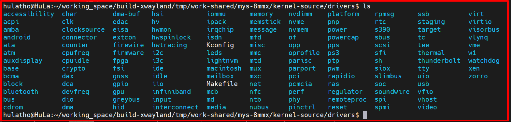
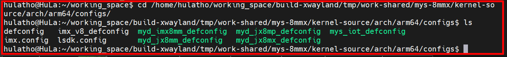
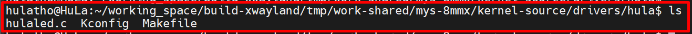
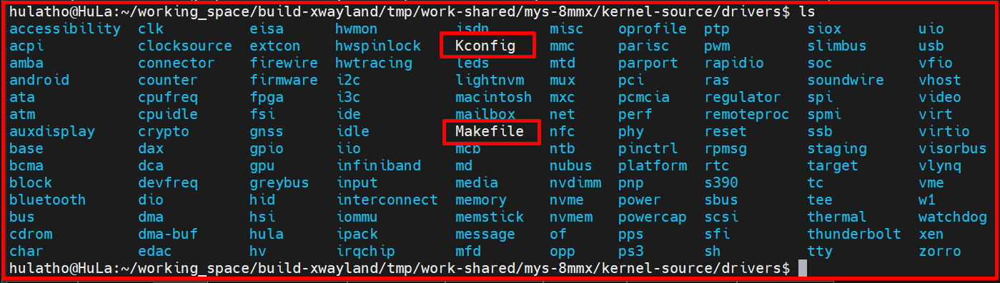
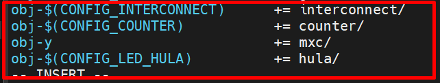

# 💚 Linux BuildIn Customization 💛

## 👉 Introduction and Summary

### 1️⃣ Introduction

+ Ở bài trước chúng ta đã blynk led sử dụng kernel module. Nếu các bạn chưa đọc thì xem link này nha [024_Kernel_Module_Blynk_Led.md](../024_Kernel_Module_Blynk_Led/024_Kernel_Module_Blynk_Led.md). Ở bài này chúng ta sẽ tìm hiểu về linux customization và build in trong linux.

### 2️⃣ Summary

Nội dung của bài viết gồm có những phần sau nhé 📢📢📢:
- [I. Introduction and Summary](#👉-introduction-and-summary)

    - [1. Introduction](#1️⃣-introduction)
    - [2. Summary](#2️⃣-summary)
- [II. Contents](#👉-contents)
    - [1. Các bước để tạo driver buildin](#1️⃣-các-bước-để-tạo-driver-buildin)
    - [2. Driver Blynk Led Buildin](#2️⃣-driver-blynk-led-buildin)
- [III. Conclusion](#✔️-conclusion)
- [IV. Exercise](#💯-exercise)
- [V. NOTE](#📺-note)
- [VI. Reference](#📌-reference)

## 👉 Contents

### 1️⃣ Các bước để tạo driver buildin
+ Chúng ta sẽ tạo ra 3 file có tên như sau: hulaled.c, Kconfig và Makefile. Các bạn làm theo từng bước như sau nhé:

***Bước 1: Tìm folder drivers trong linux kernel***
+ Khi build xong yocto ta sẽ có đường dẫn sau: /home/hulatho/working_space/build-xwayland/tmp/work-shared/mys-8mmx/kernel-source/drivers/. Đường dẫn này sẽ chứa tất cả device driver trong kernel của chúng ta

​<p align="center">
     
</p>

+ File config sẽ nằm ở đường dẫn sau: /home/hulatho/working_space/build-xwayland/tmp/work-shared/mys-8mmx/kernel-source/arch/arm64/configs/
+ Nó là file: mys_iot_defconfig

​<p align="center">
     
</p>

+ Chúng ta vim file mys_iot_defconfig chúng ta sẽ thấy các biến được gán giá trị là y hay m. y tương ứng với Build-in kernel module còn m tương ứng với module, nghĩa là Build module (.ko)

***Bước 2: Tạo driver***
+ Khi này ta quay lại đường dẫn /home/hulatho/working_space/build-xwayland/tmp/work-shared/mys-8mmx/kernel-source/drivers/ và tạo 1 driver tên hula gồm 3 file hulaled.c, Kconfig và Makefile.

```bash
$ cd /home/hulatho/working_space/build-xwayland/tmp/work-shared/mys-8mmx/kernel-source/drivers/
$ mkdir hula
$ cd hula
```

+ File Makefile
```Makefile
EXTRA_CFLAGS=-Wall

obj-$(CONFIG_LED_HULA) += hulaled.o
```

+ Giải thích file Makefile
	+ -Wall: Hiển thị các warning khi conpile
	+ CONFIG_LED_HULA: có thể được chọn là y hay m. Ta sẽ chọn trong menuconfig
	+ obj-y : Build-in kernel module
	+ obj-m : Build module (.ko)

+ File Kconfig
```c
menu "Hello hula led build-in"

config LED_HULA
	bool "hello hula led"
	depends on ARM64
	default y if ARM64
	help
		Select this option to run a Hello HuLa Led Build-In!
endmenu
```

+ Giải thích file Kconfig
	+ Tạo ra 1 menu nữa khi ta chạy lệnh make menuconfig
	+ config LED_HULA: Define 1 config option
	+ bool : Type definition
	+ depends on : Dependencies
	+ default : default value
	+ help : help text

+ File hulaled.c
```c
#include <linux/module.h>   /* Needed by all modules */
#include <linux/kernel.h>   /* Needed for KERN_INFO */
#include <linux/init.h>     /* Needed for the macros */

#define DRIVER_AUTHOR "HuLaTho <hulatho@hula.com.vn>"
#define DRIVER_DESC   "A hula led build-in"

static int __init init_led(void)
{
    printk(KERN_INFO "Hello hula led build-in\n");
    return 0;
}

static void __exit cleanup_led(void)
{
    printk(KERN_INFO "Goodbye hula led build-in\n");
}

module_init(init_led);
module_exit(cleanup_led);

MODULE_LICENSE("GPL");              /* License use for module*/
MODULE_AUTHOR(DRIVER_AUTHOR);       /* Who wrote this module? */
MODULE_DESCRIPTION(DRIVER_DESC);    /* What does this module do */
```

​<p align="center">
     
</p>

***Bước 3: Update Makefile and Kconfig to Build Sytem***
+ Ta quay lại folder /home/hulatho/working_space/build-xwayland/tmp/work-shared/mys-8mmx/kernel-source/drivers/. Trong này sẽ có file Makefile và file Kconfig
+ File Makefile: Trong file này ta phải thêm đường dẫn trỏ tới folder driver mà ta mới tạo (hula)
	> obj-$(CONFIG_LED_HULA) += hula/
+ File Kconfig: Trong file này ta phải thêm đường dẫn trỏ tới file Kconfig trong driver ta mới tạo
	> source "drivers/hula/Kconfig"

```bash
$ cd /home/hulatho/working_space/build-xwayland/tmp/work-shared/mys-8mmx/kernel-source/drivers/
$ vim Makefile     : Thêm obj-$(CONFIG_LED_HULA) += hula/
$ vim Kconfig      : Thêm source "drivers/hula/Kconfig"
```

​<p align="center">
     
</p>
​<p align="center">
     
</p>
​<p align="center">
     
</p>

***Bước 4: Mở menu để chọn***
+ Đi tới đường dẫn /home/hulatho/working_space/build-xwayland/tmp/work-shared/mys-8mmx/kernel-source/ và chạy make menuconfig
```bash
$ cd /home/hulatho/working_space/build-xwayland/tmp/work-shared/mys-8mmx/kernel-source/
$ make menuconfig ARCH=arm64
```
+ Khi mở menuconfig lên rồi thì enter vào Device Driver rồi kéo xuống dưới cùng sẽ thấy config của ta mới tạo


***Bước 5: Save cofig and check***
+ Sau đó ta đi make mys_iot_deconfig, thì nó lưu lại các config vào file .config
+ Ta có thể tìm kiếm trong file .config này để xem cái ta chọn đã là build-in hay chưa
```bash
$ make mys_iot_defconfig
$ cat .config | grep HULA
```

+ Linux kernel configuration hay nằm ở kernel source và trong file KERNEL_SOURCE/.config. Không nên chỉnh sửa trực tiếp file này mà nên sử dụng một trong các configuration option sau:
	+ kernel sẽ tìm kiếm các configuration trong file .config và build các module tương ứng với config đó.
	+ Mỗi board đều có 1 file <device>_defconfig thường được nằm ở KERNEL_SOURCE/arch/$(ARCH)/configs. Như board IMX8MM của ta là file mys_iot_defconfig

***Note thêm để giải thích thôi***
+ Kernel Source Cleaning
```bash
$ make clean        : Delete generated file
$ make mrproper		: Delete current config and generated file
$ make distclean    : Xóa các file backup, patch file ...
```

+ make menuconfig
```bash
+ Allows để load và save file with filesname different from ".config"
```

+ make <device>_defconfig
```c
+ Creates a ".config" file with default options from the ARCH supplied defconfig
+ Configurations are generally stored in the directory: arch/$(ARCH)/configs
```

+ make oldconfig
```c
+ Reads the existing .config file and prompts the user for options in the current kernel source not found in the .config file.
+ Useful when you are moving the existing kernel configuration to a new kernel version.
+ If you run 'make oldconfig' second time after you have run it once, the second time will not ask you any options
```


***Bước 6: Build lại yocto, bootboard và check log***
```bash
$ make -j16
$ sudo dmesg | tail -10
```

+ Check log kernel xem có print ra "Hello hula led build-in" hay không, nếu có thì là thành công

### 2️⃣ Driver Blynk Led Buildin
+ Tương tự với các bước như bên trên, ta chỉ đổi lại file .c và thêm file .h như bên dưới vào

+ File hulaled.c
```c
#include <linux/module.h>	/* This module defines functions such as module_init/module_exit */
#include <linux/io.h>		/* This module defines functions such as ioremap/iounmap */
#include "hulaled.h"        /* LED modules */

#define DRIVER_AUTHOR "HuLaTho <hulatho@hula.com.vn>"
#define DRIVER_DESC   "Kernel buildin Led Blynk"

uint32_t __iomem *base_addr;
uint32_t __iomem *base_addr_clk;
uint32_t __iomem *base_addr_mux_gpio1_io9;

/* Constructor */
static int __init led_init(void)
{
	base_addr = ioremap(GPIO_1_ADDR_BASE, GPIO_1_ADDR_SIZE);
	base_addr_clk = ioremap(CCM_CCGRn_ADDR_BASE, CCM_CCGRn_ADDR_SIZE);
	base_addr_mux_gpio1_io9 = ioremap(IOMUXC_SW_MUX_CTL_PAD_GPIO1_IO09_BASE, IOMUXC_SW_MUX_CTL_PAD_GPIO1_IO09_SIZE);

	if(!base_addr)
		return -ENOMEM;
	if(!base_addr_clk)
		return -ENOMEM;
	if(!base_addr_mux_gpio1_io9)
		return -ENOMEM;

	*(base_addr_clk + GPIO1_ENABLE_CLOCK_OFFSET / 4) |= CLK;
	*(base_addr_clk + GPIO1_SET_CLOCK_OFFSET / 4) |= CLK;

	*(base_addr_mux_gpio1_io9) |= 1 << 4;  /* ENABLED SION */
	*(base_addr_mux_gpio1_io9) &=~ 0x07;  /* Select signal GPIO1_IO05, ALT Function */

	*(base_addr + GPIO_GDIR1_OFFSET / 4) |= LED;
	*(base_addr + GPIO_DR_OFFSET / 4) |= LED;

	pr_info("Initizliaze Led successfully HuLa IOREMAP!\n");
	return 0;
}

/* Destructor */    
static void __exit led_exit(void)
{
	*(base_addr + GPIO_DR_OFFSET / 4) &=~ LED; 

	iounmap(base_addr);
	iounmap(base_addr_clk);
	iounmap(base_addr_mux_gpio1_io9);

	pr_info("Good bye Led HuLa IOREMAP!!!\n");
}

module_init(led_init);
module_exit(led_exit);

MODULE_LICENSE("GPL");
MODULE_AUTHOR(DRIVER_AUTHOR);
MODULE_DESCRIPTION(DRIVER_DESC); 
MODULE_VERSION("1.0");    
```

+ File hulaled.h
```h
#ifndef __GPIO__MODULE_H__
#define __GPIO__MODULE_H__

#define CCM_CCGRn_ADDR_BASE            (0x30380000)
#define GPIO_1_ADDR_BASE               (0x30200000)

#define GPIO1_ENABLE_CLOCK_OFFSET      (0x40B0)
#define GPIO1_SET_CLOCK_OFFSET         (0x40B4)
     
#define GPIO_DR_OFFSET                 (0x00)	    
#define GPIO_GDIR1_OFFSET	           (0x04)	/* 0 input ; 1 output */	

#define GPIO_1_ADDR_SIZE	           (0x3020FFFF - GPIO_1_ADDR_BASE)
#define CCM_CCGRn_ADDR_SIZE            (0x3038FFFF - CCM_CCGRn_ADDR_BASE)

#define IOMUXC_SW_MUX_CTL_PAD_GPIO1_IO09_BASE    (0x3033003C)
#define IOMUXC_SW_MUX_CTL_PAD_GPIO1_IO09_SIZE    (0x30330040 - 0x3033003C)

#define LED     (1 << 9)                /* GPIO_1_IO9 (1-1)*32 + 9 */
#define CLK     (0x00003333)

#endif  /* __LEDA_MODULE_H__ */
```

## ✔️ Conclusion
Ở bài này chúng ta đã biết build in là gì và tạo 1 module kernel để thực hiện quá trình buil-in và sáng led. Tiếp theo chúng ta cùng tới bài Kernel Synchronization nhé.

## 💯 Exercise
+ Thay đổi 1 pin khác và tạo 1 driver kernel build-in để khi boot board lên thì led sáng được.

## 📺 NOTE
+ N/A

## 📌 Reference

[1] i.MX Linux Reference Manual

[2] https://man.cx/ioremap(9)

[3] https://www.kernel.org/doc/html/next/kbuild/kconfig-language.html
