# 💚 Character Device Driver 💛

## 👉 Introduction and Summary

### 1️⃣ Introduction

+ Ở bài trước chúng ta đã blynk led sử dụng kernel module build-in. Nếu các bạn chưa đọc thì xem link này nha [025_Linux_BuildIn_Customization.md](../025_Linux_BuildIn_Customization/025_Linux_BuildIn_Customization.md). Ở bài này chúng ta sẽ tìm hiểu về Character Device Driver trong linux.

### 2️⃣ Summary

Nội dung của bài viết gồm có những phần sau nhé 📢📢📢:
- [I. Introduction and Summary](#👉-introduction-and-summary)

    - [1. Introduction](#1️⃣-introduction)
    - [2. Summary](#2️⃣-summary)
- [II. Contents](#👉-contents)
    - [1. Cách tương tác với hardware](#1️⃣-cách-tương-tác-với-hardware)
    - [2. Tạo character device driver](#2️⃣-tạo-character-device-driver)
    - [3. Thực hành](#3️⃣-thực-hành)
- [III. Conclusion](#✔️-conclusion)
- [IV. Exercise](#💯-exercise)
- [V. NOTE](#📺-note)
- [VI. Reference](#📌-reference)

## 👉 Contents

### 1️⃣ Cách tương tác với hardware

+ Để user tương tác được với hardware thì trong kernel ta tạo ra 1 device driver, trong bài này device driver sẽ là character device driver và sau đó device driver sẽ tương tác với hardware tương ứng với driver đó. User sẽ không trực tiếp tương tác được với hardware

+ Device driver thì có nhiều loại trong đó character device driver là 1 trong số đó. Như cái tên của nó Device driver nghĩa là driver để quản lý 1 thiết bị. Khi device driver được load vào OS, nó sẽ hiển thị các giao diện không gian người dùng để ứng dụng người dùng có thể giao tiếp với device. Ví dụ giờ mình có 1 con RTC DS1307, và mình muốn cấu hình nó, về cơ bản thì ta sẽ tạo 1 thiết bị và thực hiện đọc ghi với nó 

​<p align="center">
  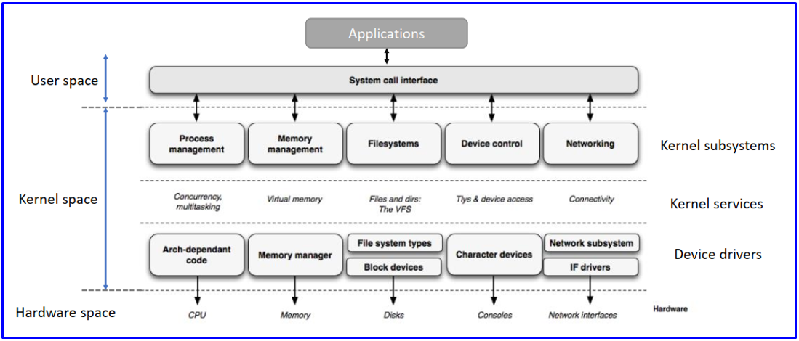   
</p>

+ Gọi là character device driver nghĩa là ta sẽ tạo ra 1 "System object" giống như 1 file dưới kernel. Mà File thì ta có thể dùng các API từ user như open, read, write, close, mmap, ioctl, release.

+ Tất cả device file đều được lưu trong đường dẫn /dev

​<p align="center">
  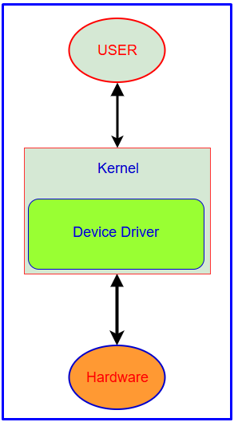   
</p>

​<p align="center">
     
</p>

​<p align="center">
  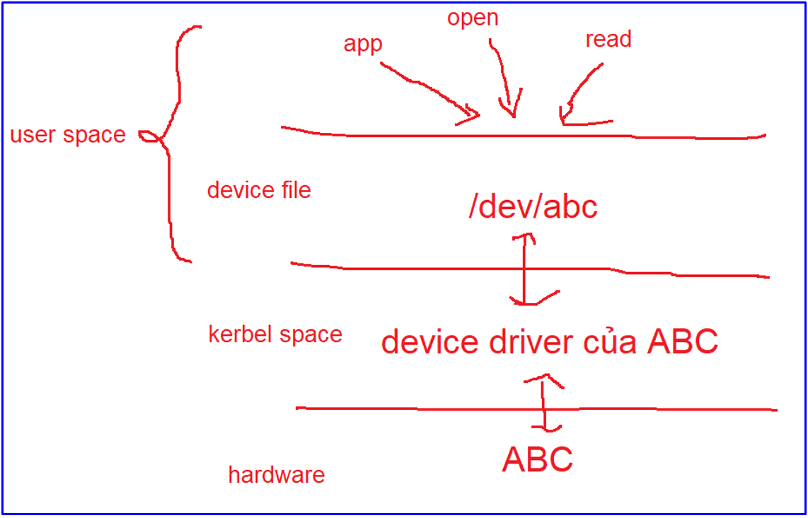   
</p>

### 2️⃣ Tạo character device driver
+ Để tạo 1 Character Device Driver ta thực hiện qua 3 bước:
	1. Allocate device number (major/minor): Tạo ra ID cho Character Device Driver
	2. Create Device File: Tạo Device File và gán với ID
	3. Register File operations: Đăng kí Device File với các API open, read, write...

+ Bây giờ chúng ta đi vào từng bước tạo Device File nhé

***Bước 1: Allocate device number***
+ Device number
	+ Major number: Là số xác định liên kết giữa driver và device. Một major number có thể được chia sẻ giữa nhiều device driver
	+ Minor number: Là số dùng để phân biệt các thiết bị vật lý riêng lẻ
	+ Như điện thoại thì có điện thoại iphone, Samsung, nên để phân biệt thì có major number, nhưng iphone thì có nhiều loại như ip13 13 pro nên sẽ có thêm minor number

+ Để cấp phát device number ta có thể sử dụng một trong hai cách là Static allocating và Dynamic allocating.
  + Static allocating: Ta dùng hàm register_chrdev_region
  + Dynamic allocating: Ta dùng hàm alloc_chrdev_region
    + Cách này hay dùng hơn vì Khi ta cấp phát là Dynamic thì hệ thống sẽ tìm một số phù hợp mà chưa được sử dụng bởi số nào hết

+ Device number được đại diện bởi struct dev_t, bản chất nó cũng là số nguyên thôi

+ alloc_chrdev_region(&mdev.dev_num, 0, 1, "m-cdev")
  + Số 0: là giá trị minor bắt đầu
  + Số 1: là số lượng minor 
  + Ví dụ major là 99 và số lượng minor là 3 thì ta sẽ có 99 và 4 , 99 và 5, 99 và 6

```c
int alloc_chrdev_region(dev_t * dev, unsigned baseminor, unsigned count, const char * name);
  + *dev: truyền vào device number để lấy được device number
  + Baseminor: minor bắt đầu từ số này
  + Count: Số lượng của số minor  được yêu cầu
  + Name: là tên mà mình đặt cho phạm vi số device
```

+ Chú ý bất cứ 1 thằng cấp phát nào cũng có 1 hàm hủy

​<p align="center">
  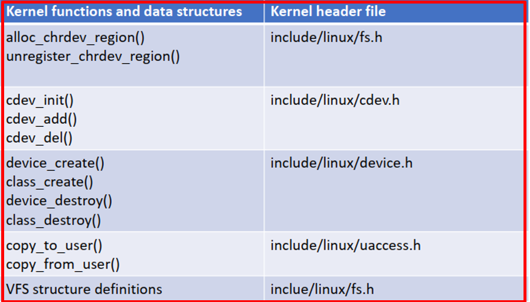   
</p>

​<p align="center">
  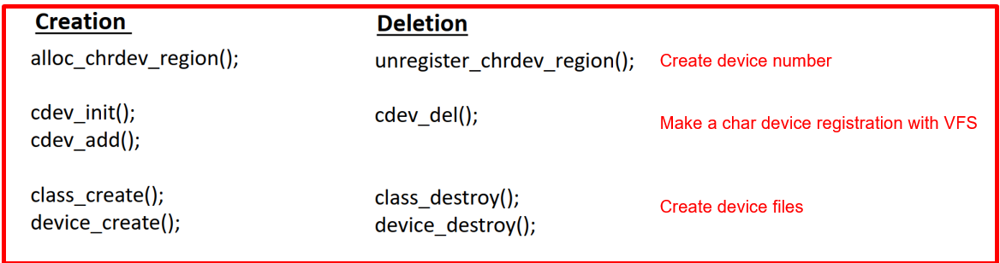   
</p>

+ File code majorminor.c
```c
#include <linux/module.h> /* Thu vien nay dinh nghia cac macro nhu module_init va module_exit */
#include <linux/fs.h>     /* Thu vien nay dinh nghia cac ham allocate major & minor number */

#define DRIVER_AUTHOR "hulatho hulatho@hula.com.vn"
#define DRIVER_DESC "Hello world kernel module"

struct m_foo_dev
{
    dev_t dev_num; 
} mdev;

static int
    __init
    hello_world_init(void) /* Constructor */
{
    /* 1.1 Dynamic allocating device number (cat /pro/devices) */
    if (alloc_chrdev_region(&mdev.dev_num, 0, 1, "m-cdev") < 0) 
    {
        pr_err("Failed to alloc chrdev region\n");
        return -1;
    }

    /* 1.2 Static allocating device number (cat /pro/devices) */
    /* register_chrdev_region(&mdev.dev_num, 1, "m-cdev") */

    pr_info("Major = %d Minor = %d\n", MAJOR(mdev.dev_num), MINOR(mdev.dev_num));

    pr_info("Hello HuLa\n");
    return 0;
}
static void
    __exit
    hello_world_exit(void) /* Destructor */
{
    /* 1. Unallocating device number */
    unregister_chrdev_region(mdev.dev_num, 1);
    pr_info("Goodbye HuLa\n");
}

module_init(hello_world_init);
module_exit(hello_world_exit);

MODULE_LICENSE("GPL");
MODULE_AUTHOR(DRIVER_AUTHOR);
MODULE_DESCRIPTION(DRIVER_DESC);
```

+ File code Makefile
```Makefile
EXTRA_CFLAGS = -Wall
obj-m = majorminor.o

KDIR = /lib/modules/`uname -r`/build

all:
	make -C $(KDIR) M=`pwd` modules

clean:
	make -C $(KDIR) M=`pwd` clean
```

+ Giải thích cách chạy. Khi chạy chương trình trên và insmod thì chương trình sẽ in ra số major number, ví dụ ở đây là 240
```bash
$ make all
$ sudo insmod majorminor.ko
$ sudo dmesg | tail
$ vim /proc/devices      : Để kiểm tra major được ghi vào hệ thống, ta thấy số 240 m-cdev
$ ls –l /dev/ | grep 240 : Để kiểm tra số major và tên ta đã đặt, ta thấy 240 m-device
```

​<p align="center">
  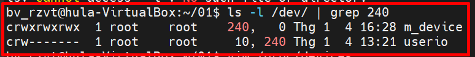   
</p>

***Bước 2: Create Device File***
+ Bây giờ ta sẽ tạo device file để liên kết với device number
+ Ta nhìn vào ảnh dưới, ta thấy Device file sẽ nằm trong class device nên trước khi tạo device ta sẽ phải tạo class trước
​<p align="center">
  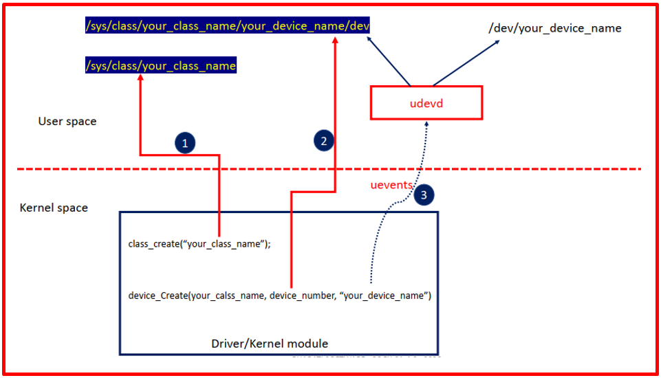   
</p>

+ Ta tạo class
  + *Owner: Con trỏ trở tới OWM
  + Name: tên của class này

​<p align="center">
  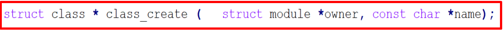   
</p>

+ Ta tạo Device
  + Class: pointer trở tới class
  + Parent: pointer trở tới parent struct device của device mới này
  + Devt: device number
  + Drvdata: dữ liệu sẽ được thêm vào thiết bị để gọi lại
  + Fmt: tên của device

​<p align="center">
  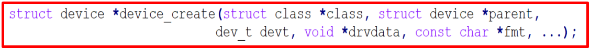   
</p>

+ Xem code 2 bước tạo ở dưới đây

​<p align="center">
     
</p>

+ Source code tạo Device file và Makefile

+ File devicefile.c
```c
#include <linux/module.h> /* Thu vien nay dinh nghia cac macro nhu module_init/module_exit */
#include <linux/fs.h>     /* Thu vien nay dinh nghia cac ham allocate major/minor number */
#include <linux/device.h> /* Thu vien nay dinh nghia cac ham class_create/device_create */

#define DRIVER_AUTHOR "hulatho hulatho@hula.com.vn"
#define DRIVER_DESC "Hello world kernel module"

struct m_foo_dev
{
    dev_t dev_num;
    struct class *m_class;
} mdev;

static int __init hello_world_init(void) /* Constructor */
{
    /* 1. Allocating device number */
    if (alloc_chrdev_region(&mdev.dev_num, 0, 1, "m-driver") < 0)
    {
        pr_err("Failed to alloc chrdev region\n");
        return -1;
    }
    pr_info("Major = %d Minor = %d\n", MAJOR(mdev.dev_num), MINOR(mdev.dev_num));

    /* 02. Creating struct class */
    if ((mdev.m_class = class_create(THIS_MODULE, "m_class")) == NULL)
    {
        pr_err("Cannot create the struct class for my device\n");
        goto rm_device_numb;
    }

    /* 03. Creating device*/
    if ((device_create(mdev.m_class, NULL, mdev.dev_num, NULL, "m_device")) == NULL)
    {
        pr_err("Cannot create my device\n");
        goto rm_class;
    }

    pr_info("Hello world kernel module\n");
    return 0;

rm_class:
    class_destroy(mdev.m_class);
rm_device_numb:
    unregister_chrdev_region(mdev.dev_num, 1);
    return -1;
}

static void
    __exit
    hello_world_exit(void) /* Destructor */
{
    device_destroy(mdev.m_class, mdev.dev_num); /* 03 */
    class_destroy(mdev.m_class);                /* 02 */
    unregister_chrdev_region(mdev.dev_num, 1);  /* 01 */

    pr_info("Goodbye\n");
}

module_init(hello_world_init);
module_exit(hello_world_exit);

MODULE_LICENSE("GPL");
MODULE_AUTHOR(DRIVER_AUTHOR);
MODULE_DESCRIPTION(DRIVER_DESC);
```

+ File Makefile
```Makefile
EXTRA_CFLAGS = -Wall
obj-m = devicefile.o

KDIR = /lib/modules/`uname -r`/build

all:
	make -C $(KDIR) M=`pwd` modules

clean:
	make -C $(KDIR) M=`pwd` clean
```

+ Giải thích cách chạy.
  + Để xem class ta mới tạo thì: ls /sys/class/ 
  + Để xem device file và major number thì: ls –l /dev/ | grep 243


***Bước 3: Register File operations***
+ Nghĩa là ta đăng kí các hoạt động của file như open, read, write ... tới device file
+ Struct inode là struct chứa toàn bộ thông tin của một file

​<p align="center">
  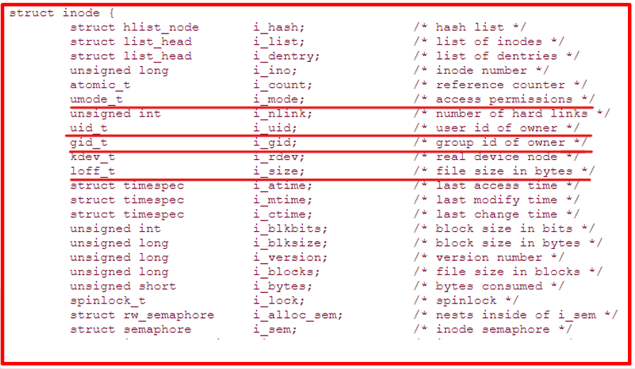   
</p>

+ Struct cdev là một phần tử của **struct inode** và nó là struct đại diện cho **character device**

​<p align="center">
  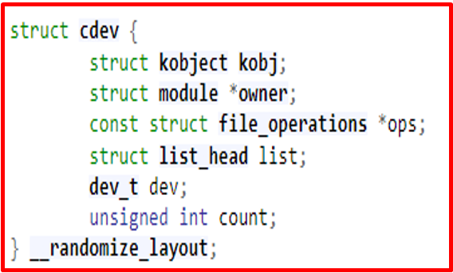   
</p>

+ Struct file_operations là một phần tử của **struct cdev**. Staruct này định nghĩa toàn bộ các hoạt động của file (open/read/write/close/mmap/ioctl)

​<p align="center">
  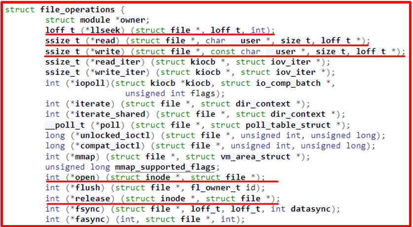   
</p>

***Open operations***
+ Khởi tạo thiết bị hoặc làm cho thiết bị phản hồi cho read/write
+ Trong open có thể làm gì thì làm không thì bỏ trống
+ Nếu không làm gì thì open luôn thành công

​<p align="center">
  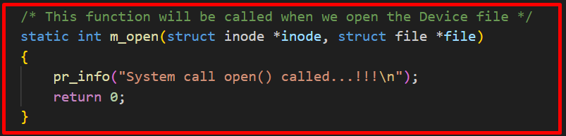   
</p>
​<p align="center">
  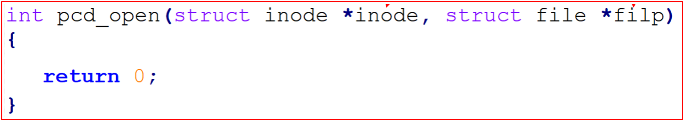   
</p>

+ Inode: con trỏ tới inode
+ File: Con trỏ tới file object
+ Return 0 nếu thành công, còn không return vè mã lỗi

***Read operations***
​<p align="center">
     
</p>

+ Parammeter
  + Filp: pointer của file obj
  + Buf: pointer của user buffer
  + Count: Số đọc từ user
  + offset: Con trỏ của vị trí file hiện tại mà từ đó quá trình đọc phải bắt đầu

+ Read method
  + Đọc ‘Counter’ byte từ thiết bị bắt đầu từ vị trí Offset’.
  + Cập nhật ‘Offset’ bằng cách thêm số byte đã đọc thành công
  + Trả về số byte đã đọc thành công
  + Trả về 0 nếu không có byte nào để đọc (EOF)
  + Trả về mã lỗi thích hợp (giá trị -ve) nếu có lỗi
  + Giá trị trả về nhỏ hơn 'count' không có nghĩa là đã xảy ra lỗi

​<p align="center">
  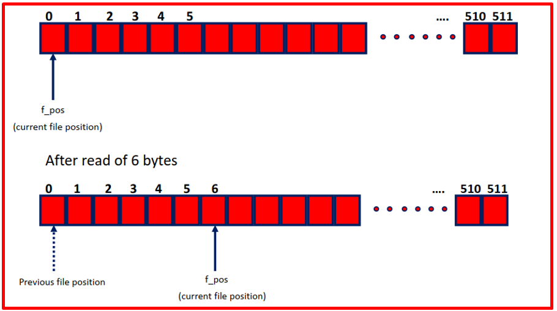   
</p>

​<p align="center">
  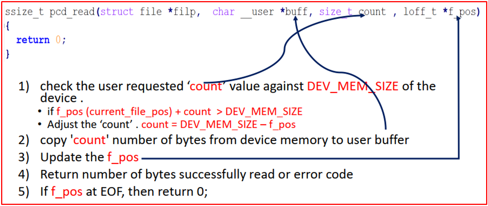   
</p>


***Write operations***

​<p align="center">
  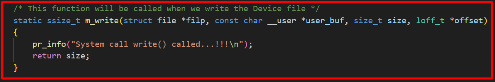   
</p>

+ Write method
  + Ghi ‘count’ byte vào thiết bị bắt đầu từ vị trí ‘Offset’.
  + Cập nhật ‘Offset’ bằng cách thêm số byte được ghi thành công
  + Trả về số byte được ghi thành công

​<p align="center">
  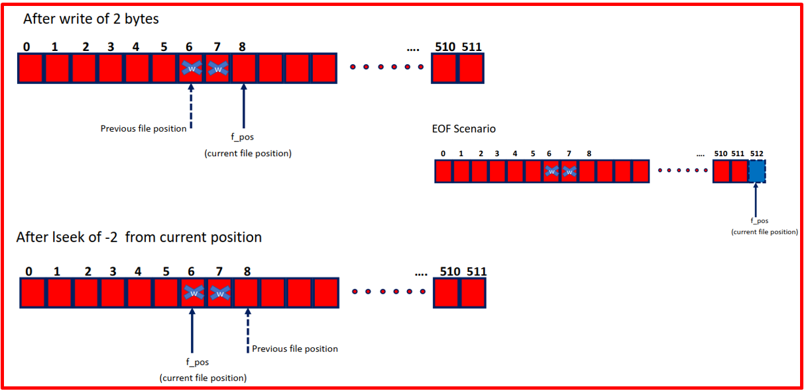   
</p>

​<p align="center">
  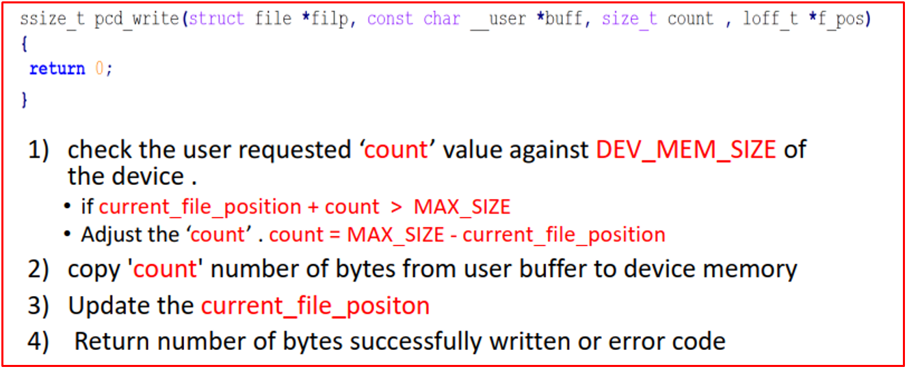   
</p>

***Lseek operations***
+ llseek method
  + Trong llseek method, Driver nên cập nhật con trỏ file bằng cách sử dụng thông tin 'offset' và 'wherece’
  + Trình xử lý llseek sẽ trả về vị trí tệp mới cập nhật hoặc có lỗi

​<p align="center">
  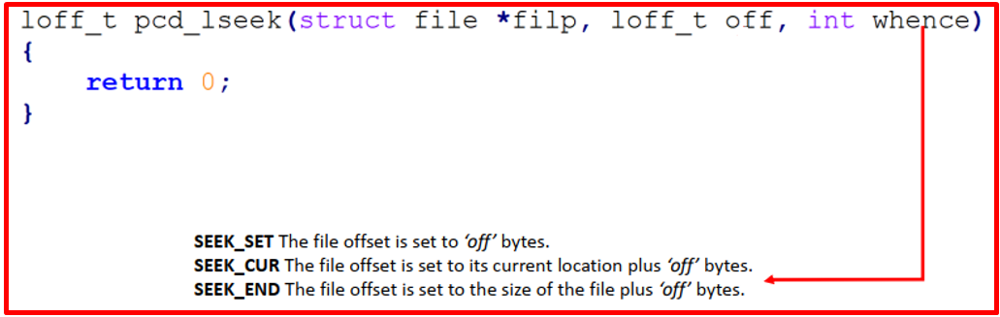   
</p>

​<p align="center">
  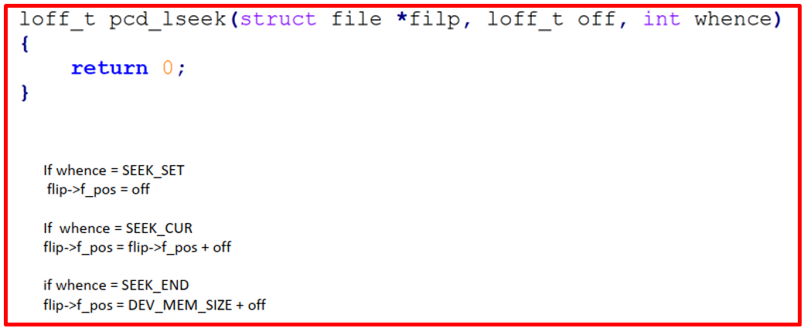   
</p>


***Copy data***
​<p align="center">
  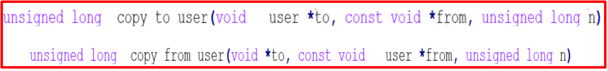   
</p>

***Hardware Interface***
+ Hãy đọc 1 kernel driver source và tìm hiểu về các đăng kí 1 IRQ và request memory
  + devm_request_irq(pdev, irq_num, handler, flags, dev_name, dev_id)
  + devm_irq(pdev, irq, dev_id)
  + request_mem_region(base_addr, size, dev_name)
  + ioremap
  + request_region, inb/outb
  + ioremap_nocache(base_addr, size)


+ Code cho phàn file operation
+ File fileoperation.c
```c
/******************************************************************************
 *  @author     hulatho hulatho@hula.com.vn
 *******************************************************************************/

#include <linux/module.h> /* Thu vien nay dinh nghia cac macro nhu module_init/module_exit */
#include <linux/fs.h>     /* Thu vien nay dinh nghia cac ham allocate major/minor number */
#include <linux/device.h> /* Thu vien nay dinh nghia cac ham class_create/device_create */
#include <linux/cdev.h>   /* Thu vien nay dinh nghia cac ham cdev_init/cdev_add */

#define DRIVER_AUTHOR "hulatho hulatho@hula.com.vn"
#define DRIVER_DESC "Hello world kernel module"

struct m_foo_dev
{
    dev_t dev_num;
    struct class *m_class;
    struct cdev m_cdev;
} mdev;

/*  Function Prototypes */
static int __init hello_world_init(void);
static void __exit hello_world_exit(void);

static int m_open(struct inode *inode, struct file *file);
static int m_release(struct inode *inode, struct file *file);
static ssize_t m_read(struct file *filp, char __user *user_buf, size_t size, loff_t *offset);
static ssize_t m_write(struct file *filp, const char *user_buf, size_t size, loff_t *offset);

static struct file_operations fops =
    {
        .owner = THIS_MODULE,
        .read = m_read,
        .write = m_write,
        .open = m_open,
        .release = m_release,
};

/* This function will be called when we open the Device file */
static int m_open(struct inode *inode, struct file *file)
{
    pr_info("System call open() called...!!!\n");
    return 0;
}

/* This function will be called when we close the Device file */
static int m_release(struct inode *inode, struct file *file)
{
    pr_info("System call close() called...!!!\n");
    return 0;
}

/* This function will be called when we read the Device file */
static ssize_t m_read(struct file *filp, char __user *user_buf, size_t size, loff_t *offset)
{
    pr_info("System call read() called...!!!\n");
    return 0;
}

/* This function will be called when we write the Device file */
static ssize_t m_write(struct file *filp, const char __user *user_buf, size_t size, loff_t *offset)
{
    pr_info("System call write() called...!!!\n");
    return size;
}

static int __init hello_world_init(void) /* Constructor */
{
    /* 1. Allocating device number (cat /pro/devices)*/
    if (alloc_chrdev_region(&mdev.dev_num, 0, 1, "m-cdev") < 0)
    {
        pr_err("Failed to alloc chrdev region\n");
        return -1;
    }
    pr_info("Major = %d Minor = %d\n", MAJOR(mdev.dev_num), MINOR(mdev.dev_num));

    /* 02.1 Creating cdev structure */
    cdev_init(&mdev.m_cdev, &fops);

    /* 02.2 Adding character device to the system */
    if ((cdev_add(&mdev.m_cdev, mdev.dev_num, 1)) < 0)
    {
        pr_err("Cannot add the device to the system\n");
        goto rm_device_numb;
    }

    /* 03. Creating struct class */
    if ((mdev.m_class = class_create(THIS_MODULE, "m_class")) == NULL)
    {
        pr_err("Cannot create the struct class for my device\n");
        goto rm_device_numb;
    }

    /* 04. Creating device*/
    if ((device_create(mdev.m_class, NULL, mdev.dev_num, NULL, "m_device")) == NULL)
    {
        pr_err("Cannot create my device\n");
        goto rm_class;
    }

    pr_info("Hello world kernel module\n");
    return 0;

rm_class:
    class_destroy(mdev.m_class);
rm_device_numb:
    unregister_chrdev_region(mdev.dev_num, 1);
    return -1;
}

static void
__exit hello_world_exit(void) /* Destructor */
{
    device_destroy(mdev.m_class, mdev.dev_num); /* 04 */
    class_destroy(mdev.m_class);                /* 03 */
    cdev_del(&mdev.m_cdev);                     /* 02 */
    unregister_chrdev_region(mdev.dev_num, 3);  /* 01 */

    pr_info("Goodbye\n");
}

module_init(hello_world_init);
module_exit(hello_world_exit);

MODULE_LICENSE("GPL");
MODULE_AUTHOR(DRIVER_AUTHOR);
MODULE_DESCRIPTION(DRIVER_DESC);
```

+ File Makefile
```Makefile
EXTRA_CFLAGS = -Wall
obj-m = fileoperation.o

KDIR = /lib/modules/`uname -r`/build

all:
	make -C $(KDIR) M=`pwd` modules

clean:
	make -C $(KDIR) M=`pwd` clean
```

+ Cách chạy
```bash
$ make all
$ sudo insmod fileoperation.ko
$ sudo chmod 0777 /dev/m_device
$ echo "hello" > /dev/m_device           : khi echo thì nó sẽ chạy 3 câu lệnh, open write, close
$ cat /dev/m_device                      : khi cat thì nó sẽ chạy 3 câu lệnh, open read, close
$ Dmesg | tail                           : Ta sẽ thấy hiện các log in ra
```

### 3️⃣ Thực hành
+ Viết 1 character device driver và 1 app iwr user space để từ user space đọc ghi data từ character device driver
+ Bài này sẽ gồm 3 file là: cdevhula.c, Makefile và user.c

+ File user.c
```c
/******************************************************************************
 *  @brief      Userspace application to test the Device driver
 *
 *  @author     hulatho hulatho@hula.com.vn
 *******************************************************************************/

#include <stdio.h>
#include <stdlib.h>
#include <string.h>
#include <fcntl.h>
#include <unistd.h>
#include <stdio.h>
#include <stdio_ext.h>

#define CDEV_PATH "/dev/m_device"

int fd, option;
char write_buf[1024];
char read_buf[1024];

void printMenu()
{
  printf("****Please Enter the Option******\n");
  printf("        1. Write                 \n");
  printf("        2. Read                  \n");
  printf("        3. Exit                  \n");
  printf("*********************************\n");
  printf(">>> ");
}

int main()
{
  printf("*********************************\n");
  printf("********HuLa Linux***************\n");
  printf("*********************************\n");

  fd = open(CDEV_PATH, O_RDWR);
  if (fd < 0)
  {
    printf("Cannot open device file: %s...\n", CDEV_PATH);
    return -1;
  }

  while (1)
  {
      printMenu();

      scanf("%d", &option);
      switch (option)
      {
      case 1:
          printf("Enter the string to write into driver: ");
          scanf("  %[^\t\n]s", write_buf);
          printf("Data Writing ... ");
          write(fd, write_buf, strlen(write_buf) + 1);
          printf("Done!\n\n\n");
          break;

      case 2:
          printf("Data Reading ... ");
          read(fd, read_buf, 1024);
          printf("Done!\n");
          printf("Data: %s\n\n\n", read_buf);
          break;

      case 3:
          close(fd);
          exit(1);
          break;

      default:
          printf("Enter Valid option = %c\n", option);
          break;
      }
  }

  close(fd);

  return 0;
}
```

+ File Makefile
```Makefile
EXTRA_CFLAGS = -Wall
obj-m = cdevhula.o

KDIR := /lib/modules/`uname -r`/build
CC := gcc

all:
	make -C $(KDIR) M=`pwd` modules
	$(CC) -o user user.c

clean:
	make -C $(KDIR) M=`pwd` clean
	rm -rf user
```

+ File cdevhula.c
```c
/******************************************************************************
 *  @brief      Simple Linux device driver
 *
 *  @author     hulatho hulatho@hula.com.vn
 *******************************************************************************/

#include <linux/module.h>  /* Thu vien nay dinh nghia cac macro nhu module_init/module_exit */
#include <linux/fs.h>      /* Thu vien nay dinh nghia cac ham allocate major/minor number */
#include <linux/device.h>  /* Thu vien nay dinh nghia cac ham class_create/device_create */
#include <linux/cdev.h>    /* Thu vien nay dinh nghia cac ham kmalloc */
#include <linux/slab.h>    /* Thu vien nay dinh nghia cac ham cdev_init/cdev_add */
#include <linux/uaccess.h> /* Thu vien nay dinh nghia cac ham copy_to_user/copy_from_user */

#define DRIVER_AUTHOR "hulatho hulatho@hula.com.vn"
#define DRIVER_DESC "Hello world kernel module"

#define NPAGES 1

struct m_foo_dev
{
    int size;
    char *kmalloc_ptr;
    dev_t dev_num;
    struct class *m_class;
    struct cdev m_cdev;
} mdev;

/*  Function Prototypes */
static int __init hello_world_init(void);
static void __exit hello_world_exit(void);

static int m_open(struct inode *inode, struct file *file);
static int m_release(struct inode *inode, struct file *file);
static ssize_t m_read(struct file *filp, char __user *user_buf, size_t size, loff_t *offset);
static ssize_t m_write(struct file *filp, const char *user_buf, size_t size, loff_t *offset);

static struct file_operations fops =
{
    .owner = THIS_MODULE,
    .read = m_read,
    .write = m_write,
    .open = m_open,
    .release = m_release,
};

/* This function will be called when we open the Device file */
static int m_open(struct inode *inode, struct file *file)
{
    pr_info("System call open() called...!!!\n");
    return 0;
}

/* This function will be called when we close the Device file */
static int m_release(struct inode *inode, struct file *file)
{
    pr_info("System call close() called...!!!\n");
    return 0;
}

/* This function will be called when we read the Device file */
static ssize_t m_read(struct file *filp, char __user *user_buffer, size_t size, loff_t *offset)
{
    size_t to_read;

    pr_info("System call read() called...!!!\n");

    /* Check size doesn't exceed our mapped area size */
    to_read = (size > mdev.size - *offset) ? (mdev.size - *offset) : size;

    /* Copy from mapped area to user buffer */
    if (copy_to_user(user_buffer, mdev.kmalloc_ptr + *offset, to_read))
        return -EFAULT;

    *offset += to_read;

    return to_read;
}

/* This function will be called when we write the Device file */
static ssize_t m_write(struct file *filp, const char __user *user_buffer, size_t size, loff_t *offset)
{
    size_t to_write;

    pr_info("System call write() called...!!!\n");

    /* Check size doesn't exceed our mapped area size */
    to_write = (size + *offset > NPAGES * PAGE_SIZE) ? (NPAGES * PAGE_SIZE - *offset) : size;

    /* Copy from user buffer to mapped area */
    memset(mdev.kmalloc_ptr, 0, NPAGES * PAGE_SIZE);
    if (copy_from_user(mdev.kmalloc_ptr + *offset, user_buffer, to_write) != 0)
        return -EFAULT;
    
    

    pr_info("Data from usr: %s", mdev.kmalloc_ptr);

    *offset += to_write;
    mdev.size = *offset;

    return to_write;
}

static int
    __init
    hello_world_init(void) /* Constructor */
{
    /* 1. Allocating device number (cat /pro/devices)*/
    if (alloc_chrdev_region(&mdev.dev_num, 0, 1, "m-cdev") < 0)
    {
        pr_err("Failed to alloc chrdev region\n");
        return -1;
    }
    pr_info("Major = %d Minor = %d\n", MAJOR(mdev.dev_num), MINOR(mdev.dev_num));

    /* 02.1 Creating cdev structure */
    cdev_init(&mdev.m_cdev, &fops);

    /* 02.2 Adding character device to the system*/
    if ((cdev_add(&mdev.m_cdev, mdev.dev_num, 1)) < 0)
    {
        pr_err("Cannot add the device to the system\n");
        goto rm_device_numb;
    }

    /* 03. Creating struct class */
    if ((mdev.m_class = class_create(THIS_MODULE, "m_class")) == NULL)
    {
        pr_err("Cannot create the struct class for my device\n");
        goto rm_device_numb;
    }

    /* 04. Creating device*/
    if ((device_create(mdev.m_class, NULL, mdev.dev_num, NULL, "m_device")) == NULL)
    {
        pr_err("Cannot create my device\n");
        goto rm_class;
    }

    /* 05. Creating Physical memory tao vung nho duoi kernel */
    if ((mdev.kmalloc_ptr = kmalloc(1024, GFP_KERNEL)) == 0)
    {
        pr_err("Cannot allocate memory in kernel\n");
        goto rm_device;
    }

    pr_info("Hello world kernel module\n");
    return 0;

rm_device:
    device_destroy(mdev.m_class, mdev.dev_num);
rm_class:
    class_destroy(mdev.m_class);
rm_device_numb:
    unregister_chrdev_region(mdev.dev_num, 1);
    return -1;
}

static void
    __exit
    hello_world_exit(void) /* Destructor */
{
    kfree(mdev.kmalloc_ptr);                    /* 05 */
    device_destroy(mdev.m_class, mdev.dev_num); /* 04 */
    class_destroy(mdev.m_class);                /* 03 */
    cdev_del(&mdev.m_cdev);                     /* 02 */
    unregister_chrdev_region(mdev.dev_num, 3);  /* 01 */

    pr_info("Goodbye\n");
    ;
}

module_init(hello_world_init);
module_exit(hello_world_exit);

MODULE_LICENSE("GPL");
MODULE_AUTHOR(DRIVER_AUTHOR);
MODULE_DESCRIPTION(DRIVER_DESC);
```


+ Cách chạy
```bash
$ make all
$ sudo insmod cdevhula.ko
$ sudo chmod 0777 /dev/m_device
$ ./user
```

​<p align="center">
  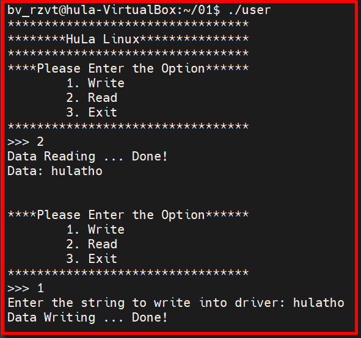   
</p>

***Ví dụ mới nhất***
+ File thonv.c
```c
#include<linux/module.h>
#include<linux/fs.h>
#include<linux/cdev.h>
#include<linux/device.h>
#include<linux/kdev_t.h>
#include<linux/uaccess.h>


#undef pr_fmt
#define pr_fmt(fmt) "%s : " fmt,__func__

#define DEV_MEM_SIZE 512

/* pseudo device's memory */
char device_buffer[DEV_MEM_SIZE];

/* This holds the device number */
dev_t device_number;

/* Cdev variable */
struct cdev thonv_cdev;

/*holds the class pointer */
struct class *class_thonv;

struct device *device_thonv;


loff_t thonv_lseek(struct file *filp, loff_t offset, int whence)
{
	loff_t temp;

	pr_info("lseek requested \n");
	pr_info("Current value of the file position = %lld\n",filp->f_pos);

	switch(whence)
	{
		case SEEK_SET:
			if((offset > DEV_MEM_SIZE) || (offset < 0))
				return -EINVAL;
			filp->f_pos = offset;
			break;
		case SEEK_CUR:
			temp = filp->f_pos + offset;
			if((temp > DEV_MEM_SIZE) || (temp < 0))
				return -EINVAL;
			filp->f_pos = temp;
			break;
		case SEEK_END:
			temp = DEV_MEM_SIZE + offset;
			if((temp > DEV_MEM_SIZE) || (temp < 0))
				return -EINVAL;
			filp->f_pos = temp;
			break;
		default:
			return -EINVAL;
	}
	
	pr_info("New value of the file position = %lld\n",filp->f_pos);

	return filp->f_pos;

}

ssize_t thonv_read(struct file *filp, char __user *buff, size_t count, loff_t *f_pos)
{
	pr_info("Read requested for %zu bytes \n",count);
	pr_info("Current file position = %lld\n",*f_pos);

	
	/* Adjust the 'count' */
	if((*f_pos + count) > DEV_MEM_SIZE)
		count = DEV_MEM_SIZE - *f_pos;

	/*copy to user */
	if(copy_to_user(buff,&device_buffer[*f_pos],count)){
		return -EFAULT;
	}

	/*update the current file postion */
	*f_pos += count;

	pr_info("Number of bytes successfully read = %zu\n",count);
	pr_info("Updated file position = %lld\n",*f_pos);

	/*Return number of bytes which have been successfully read */
	return count;
}

ssize_t thonv_write(struct file *filp, const char __user *buff, size_t count, loff_t *f_pos)
{
	pr_info("Write requested for %zu bytes\n",count);
	pr_info("Current file position = %lld\n",*f_pos);

	
	/* Adjust the 'count' */
	if((*f_pos + count) > DEV_MEM_SIZE)
		count = DEV_MEM_SIZE - *f_pos;

	if(!count){
		pr_err("No space left on the device \n");
		return -ENOMEM;
	}

	/*copy from user */
	if(copy_from_user(&device_buffer[*f_pos],buff,count)){
		return -EFAULT;
	}

	/*update the current file postion */
	*f_pos += count;

	pr_info("Number of bytes successfully written = %zu\n",count);
	pr_info("Updated file position = %lld\n",*f_pos);

	/*Return number of bytes which have been successfully written */
	return count;
}

int thonv_open(struct inode *inode, struct file *filp)
{
	pr_info("open was successful\n");

	return 0;
}

int thonv_release(struct inode *inode, struct file *flip)
{
	pr_info("release was successful\n");

	return 0;
}


/* file operations of the driver */
struct file_operations thonv_fops=
{
	.open = thonv_open,
	.release = thonv_release,
	.read = thonv_read,
	.write = thonv_write,
	.llseek = thonv_lseek,
	.owner = THIS_MODULE
};


static int __init thonv_driver_init(void)
{
	int ret;

	/*1. Dynamically allocate a device number */
	ret = alloc_chrdev_region(&device_number,0,1,"thonv_devices");
	if(ret < 0){
		pr_err("Alloc chrdev failed\n");
		goto out;
	}

	pr_info("Device number <major>:<minor> = %d:%d\n",MAJOR(device_number),MINOR(device_number));

	/*2. Initialize the cdev structure with fops*/
	cdev_init(&thonv_cdev,&thonv_fops);

	/* 3. Register a device (cdev structure) with VFS */
	thonv_cdev.owner = THIS_MODULE;
	ret = cdev_add(&thonv_cdev,device_number,1);
	if(ret < 0){
		pr_err("Cdev add failed\n");
		goto unreg_chrdev;
	}

	/*4. create device class under /sys/class/ */
	class_thonv = class_create(THIS_MODULE,"thonv_class");
	if(IS_ERR(class_thonv)){
		pr_err("Class creation failed\n");
		ret = PTR_ERR(class_thonv);
		goto cdev_del;
	}

	/*5.  populate the sysfs with device information */
	device_thonv = device_create(class_thonv,NULL,device_number,NULL,"thonv");
	if(IS_ERR(device_thonv)){
		pr_err("Device create failed\n");
		ret = PTR_ERR(device_thonv);
		goto class_del;
	}

	pr_info("Module init was successful\n");

	return 0;

class_del:
	class_destroy(class_thonv);
cdev_del:
	cdev_del(&thonv_cdev);	
unreg_chrdev:
	unregister_chrdev_region(device_number,1);
out:
	pr_info("Module insertion failed\n");
	return ret;
}


static void __exit thonv_driver_cleanup(void)
{
	device_destroy(class_thonv,device_number);
	class_destroy(class_thonv);
	cdev_del(&thonv_cdev);
	unregister_chrdev_region(device_number,1);
	pr_info("module unloaded\n");
}


module_init(thonv_driver_init);
module_exit(thonv_driver_cleanup);

MODULE_LICENSE("GPL");
MODULE_AUTHOR("hulatho");
MODULE_DESCRIPTION("character driver");
```

+ File Makefile
```Makefile
# obj-m := pcd.o
# EXTRA_CFLAGS = -Wall
# ARCH=arm
# CROSS_COMPILE=arm-linux-gnueabihf-
# KERN_DIR = /home/thonv12/Desktop/bbb/kernel
# HOST_KERN_DIR = /lib/modules/$(shell uname -r)/build/

# all:
# 	make ARCH=$(ARCH) CROSS_COMPILE=$(CROSS_COMPILE) -C $(KERN_DIR) M=$(PWD) modules
# clean:
# 	make -C $(HOST_KERN_DIR) M=$(PWD) clean
# 	make ARCH=$(ARCH) CROSS_COMPILE=$(CROSS_COMPILE) -C $(KERN_DIR) M=$(PWD) clean
# help:
# 	make ARCH=$(ARCH) CROSS_COMPILE=$(CROSS_COMPILE) -C $(KERN_DIR) M=$(PWD) help
# host:
# 	make -C $(HOST_KERN_DIR) M=$(PWD) modules


EXTRA_CFLAGS = -Wall
obj-m = thonv.o

KDIR := /lib/modules/`uname -r`/build
CC := gcc

all:
	make -C $(KDIR) M=`pwd` modules
	$(CC) -o app test_app.c

clean:
	make -C $(KDIR) M=`pwd` clean
	rm -rf app
```

+ File test_app.c
```c
/******************************************************************************
 *  @brief      Userspace application to test the Device driver
 *
 *  @author     thonv - thonv12@gmail.com
 *******************************************************************************/

#include <stdio.h>
#include <stdlib.h>
#include <string.h>
#include <fcntl.h>
#include <unistd.h>
#include <stdio.h>
#include <stdio_ext.h>

#define CDEV_PATH "/dev/thonv"

int fd, option,of,length;
char write_buf[1024];
char read_buf[1024];

void printMenu()
{

    printf("****Please Enter the Option******\n");
    printf("        1. Write                 \n");
    printf("        2. Read                  \n");
    printf("        3. Lseek                  \n");
    printf("        4. Exit                  \n");
    printf("*********************************\n");
    printf(">>> ");
}

int main()
{
    printf("*********************************\n");
    printf("*******Linux HuLaTho*******\n\n");
    printf("*********************************\n");

    fd = open(CDEV_PATH, O_RDWR);
    if (fd < 0)
    {
        printf("Cannot open device file: %s...\n", CDEV_PATH);
        return -1;
    }

    while (1)
    {
        printMenu();

        scanf("%d", &option);
        switch (option)
        {
        case 1:
            printf("Enter the string to write into driver: ");
            scanf("  %[^\t\n]s", write_buf);
            printf("Data Writing ... ");
            write(fd, write_buf, strlen(write_buf) + 1);
            printf("Done!\n\n\n");
            break;

        case 2:
            printf("length = ");
            scanf("%d", &length);
            printf("Data Reading ... ");
            read(fd, read_buf, length);
            printf("Done!\n");
            printf("Data: %s\n\n\n", read_buf);
            break;

        case 3:
            printf("enter offset from SEEK_SET = ");
            scanf("%d", &of);
            lseek(fd,of,SEEK_SET);
            break;

        case 4:
            close(fd);
            exit(1);
            break;

        default:
            printf("Enter Valid option = %c\n", option);
            break;
        }
    }

    close(fd);

    return 0;
}
```


***Character Device New***
+ Gồm 3 file test_app.c, Makefilem và thonv.c

+ File test_app.c
```c
/******************************************************************************
 *  @brief      Userspace application to test the Device driver
 *
 *  @author     thonv - thonv12@gmail.com
 *******************************************************************************/

#include <stdio.h>
#include <stdlib.h>
#include <string.h>
#include <fcntl.h>
#include <unistd.h>
#include <stdio.h>
#include <stdio_ext.h>

#define CDEV_PATH "/dev/thonv"

int fd, option,of,length;
char write_buf[1024];
char read_buf[1024];

void printMenu()
{

    printf("****Please Enter the Option******\n");
    printf("        1. Write                 \n");
    printf("        2. Read                  \n");
    printf("        3. Lseek                  \n");
    printf("        4. Exit                  \n");
    printf("*********************************\n");
    printf(">>> ");
}

int main()
{
    printf("*********************************\n");
    printf("*******Linux*******\n\n");
    printf("*********************************\n");

    fd = open(CDEV_PATH, O_RDWR);
    if (fd < 0)
    {
        printf("Cannot open device file: %s...\n", CDEV_PATH);
        return -1;
    }

    while (1)
    {
        printMenu();

        scanf("%d", &option);
        switch (option)
        {
        case 1:
            printf("Enter the string to write into driver: ");
            scanf("  %[^\t\n]s", write_buf);
            printf("Data Writing ... ");
            write(fd, write_buf, strlen(write_buf) + 1);
            printf("Done!\n\n\n");
            break;

        case 2:
            printf("length = ");
            scanf("%d", &length);
            printf("Data Reading ... ");
            read(fd, read_buf, length);
            printf("Done!\n");
            printf("Data: %s\n\n\n", read_buf);
            break;

        case 3:
            printf("enter offset from SEEK_SET = ");
            scanf("%d", &of);
            lseek(fd,of,SEEK_SET);
            break;

        case 4:
            close(fd);
            exit(1);
            break;

        default:
            printf("Enter Valid option = %c\n", option);
            break;
        }
    }

    close(fd);

    return 0;
}
```

+ File Makefile
```Makefile
EXTRA_CFLAGS = -Wall
obj-m = thonv.o

KDIR := /lib/modules/`uname -r`/build
CC := gcc

all:
	make -C $(KDIR) M=`pwd` modules
	$(CC) -o app test_app.c

clean:
	make -C $(KDIR) M=`pwd` clean
	rm -rf app
```

+ File thonv.c
```c
#include<linux/module.h>
#include<linux/fs.h>
#include<linux/cdev.h>
#include<linux/device.h>
#include<linux/kdev_t.h>
#include<linux/uaccess.h>


#undef pr_fmt
#define pr_fmt(fmt) "%s : " fmt,__func__

#define DEV_MEM_SIZE 512

/* pseudo device's memory */
char device_buffer[DEV_MEM_SIZE];

/* This holds the device number */
dev_t device_number;

/* Cdev variable */
struct cdev thonv_cdev;

/*holds the class pointer */
struct class *class_thonv;

struct device *device_thonv;


loff_t thonv_lseek(struct file *filp, loff_t offset, int whence)
{
	loff_t temp;

	pr_info("lseek requested \n");
	pr_info("Current value of the file position = %lld\n",filp->f_pos);

	switch(whence)
	{
		case SEEK_SET:
			if((offset > DEV_MEM_SIZE) || (offset < 0))
				return -EINVAL;
			filp->f_pos = offset;
			break;
		case SEEK_CUR:
			temp = filp->f_pos + offset;
			if((temp > DEV_MEM_SIZE) || (temp < 0))
				return -EINVAL;
			filp->f_pos = temp;
			break;
		case SEEK_END:
			temp = DEV_MEM_SIZE + offset;
			if((temp > DEV_MEM_SIZE) || (temp < 0))
				return -EINVAL;
			filp->f_pos = temp;
			break;
		default:
			return -EINVAL;
	}
	
	pr_info("New value of the file position = %lld\n",filp->f_pos);

	return filp->f_pos;

}

ssize_t thonv_read(struct file *filp, char __user *buff, size_t count, loff_t *f_pos)
{
	pr_info("Read requested for %zu bytes \n",count);
	pr_info("Current file position = %lld\n",*f_pos);

	
	/* Adjust the 'count' */
	if((*f_pos + count) > DEV_MEM_SIZE)
		count = DEV_MEM_SIZE - *f_pos;

	/*copy to user */
	if(copy_to_user(buff,&device_buffer[*f_pos],count)){
		return -EFAULT;
	}

	/*update the current file postion */
	*f_pos += count;

	pr_info("Number of bytes successfully read = %zu\n",count);
	pr_info("Updated file position = %lld\n",*f_pos);

	/*Return number of bytes which have been successfully read */
	return count;
}

ssize_t thonv_write(struct file *filp, const char __user *buff, size_t count, loff_t *f_pos)
{
	pr_info("Write requested for %zu bytes\n",count);
	pr_info("Current file position = %lld\n",*f_pos);

	
	/* Adjust the 'count' */
	if((*f_pos + count) > DEV_MEM_SIZE)
		count = DEV_MEM_SIZE - *f_pos;

	if(!count){
		pr_err("No space left on the device \n");
		return -ENOMEM;
	}

	/*copy from user */
	if(copy_from_user(&device_buffer[*f_pos],buff,count)){
		return -EFAULT;
	}

	/*update the current file postion */
	*f_pos += count;

	pr_info("Number of bytes successfully written = %zu\n",count);
	pr_info("Updated file position = %lld\n",*f_pos);

	/*Return number of bytes which have been successfully written */
	return count;
}

int thonv_open(struct inode *inode, struct file *filp)
{
	pr_info("open was successful\n");

	return 0;
}

int thonv_release(struct inode *inode, struct file *flip)
{
	pr_info("release was successful\n");

	return 0;
}


/* file operations of the driver */
struct file_operations thonv_fops=
{
	.open = thonv_open,
	.release = thonv_release,
	.read = thonv_read,
	.write = thonv_write,
	.llseek = thonv_lseek,
	.owner = THIS_MODULE
};


static int __init thonv_driver_init(void)
{
	int ret;

	/*1. Dynamically allocate a device number */
	ret = alloc_chrdev_region(&device_number,0,1,"thonv_devices");
	if(ret < 0){
		pr_err("Alloc chrdev failed\n");
		goto out;
	}

	pr_info("Device number <major>:<minor> = %d:%d\n",MAJOR(device_number),MINOR(device_number));

	/*2. Initialize the cdev structure with fops*/
	cdev_init(&thonv_cdev,&thonv_fops);

	/* 3. Register a device (cdev structure) with VFS */
	thonv_cdev.owner = THIS_MODULE;
	ret = cdev_add(&thonv_cdev,device_number,1);
	if(ret < 0){
		pr_err("Cdev add failed\n");
		goto unreg_chrdev;
	}

	/*4. create device class under /sys/class/ */
	class_thonv = class_create(THIS_MODULE,"thonv_class");
	if(IS_ERR(class_thonv)){
		pr_err("Class creation failed\n");
		ret = PTR_ERR(class_thonv);
		goto cdev_del;
	}

	/*5.  populate the sysfs with device information */
	device_thonv = device_create(class_thonv,NULL,device_number,NULL,"thonv");
	if(IS_ERR(device_thonv)){
		pr_err("Device create failed\n");
		ret = PTR_ERR(device_thonv);
		goto class_del;
	}

	pr_info("Module init was successful\n");

	return 0;

class_del:
	class_destroy(class_thonv);
cdev_del:
	cdev_del(&thonv_cdev);	
unreg_chrdev:
	unregister_chrdev_region(device_number,1);
out:
	pr_info("Module insertion failed\n");
	return ret;
}


static void __exit thonv_driver_cleanup(void)
{
	device_destroy(class_thonv,device_number);
	class_destroy(class_thonv);
	cdev_del(&thonv_cdev);
	unregister_chrdev_region(device_number,1);
	pr_info("module unloaded\n");
}


module_init(thonv_driver_init);
module_exit(thonv_driver_cleanup);

MODULE_LICENSE("GPL");
MODULE_AUTHOR("hulatho");
MODULE_DESCRIPTION("character driver");
```

***Ví dụ tham khảo***
```c
B1: Build charDev bang cach su dung lenh make.
B2: Xem major trong log bang lenh dmesg
B3: Chinh sua file loadcript.sh de phu hop voi major trong he thong
B4: Build va chay chuong trinh test kiem tra ket qua
```

+ FIle charDev.c
```c
#include <linux/module.h>
#include <linux/kernel.h>
#include <linux/fs.h> /*this is the file structure, file open read close */
#include <linux/cdev.h> /* this is for character device, makes cdev avilable*/
#include <linux/semaphore.h> /* this is for the semaphore*/
#include <linux/uaccess.h> /*this is for copy_user vice vers*/

int chardev_init(void);
void chardev_exit(void);
static int device_open(struct inode *, struct file *);
static int device_close(struct inode *, struct file *);
static ssize_t device_read(struct file *, char *, size_t, loff_t *);
static ssize_t device_write(struct file *, const char *, size_t, loff_t *);
static loff_t device_lseek(struct file *file, loff_t offset, int orig);

/*new code*/
#define BUFFER_SIZE 1024
static char device_buffer[BUFFER_SIZE];
struct semaphore sem;
struct cdev *mcdev; 	/* this is the name of my char driver that i will be registering*/
int major_number;       /* will store the major number extracted by dev_t*/
int ret;                /* used to return values*/
dev_t dev_num; 		/* will hold the major number that the kernel gives*/

#define DEVICENAME "charDev"

/* inode reffers to the actual file on disk*/
static int device_open(struct inode *inode, struct file *filp) 
{
 	if(down_interruptible(&sem) != 0) 
 	{
        		printk(KERN_ALERT "charDev : the device has been opened by some other device, unable to open lock\n");
        		return -1;
    }
    //buff_rptr = buff_wptr = device_buffer;
    printk(KERN_INFO "charDev : device opened succesfully\n");
   	return 0;
}

static ssize_t device_read(struct file *fp, char *buff, size_t length, loff_t *ppos) 
{
	int maxbytes; 		/*maximum bytes that can be read from ppos to BUFFER_SIZE*/
   	int bytes_to_read; 	/* gives the number of bytes to read*/
        int bytes_read;		/*number of bytes actually read*/
        maxbytes = BUFFER_SIZE - *ppos;
        
        if(maxbytes > length) 
   		bytes_to_read = length;
   	else
   	    bytes_to_read = maxbytes;
   	if(bytes_to_read == 0)
       	printk(KERN_INFO "charDev : Reached the end of the device\n");
   	 
	bytes_read = bytes_to_read - copy_to_user(buff, device_buffer + *ppos, bytes_to_read);
   	printk(KERN_INFO "charDev : device has been read %d\n",bytes_read);
    	
   	*ppos += bytes_read;
   	printk(KERN_INFO "charDev : device has been read\n");
   	
   	return bytes_read;
}

static ssize_t device_write(struct file *fp, const char *buff, size_t length, loff_t *ppos) 
{
   	int maxbytes; 		/*maximum bytes that can be read from ppos to BUFFER_SIZE*/
   	int bytes_to_write; 	/* gives the number of bytes to write*/
   	int bytes_writen;	/*number of bytes actually writen*/
   	maxbytes = BUFFER_SIZE - *ppos;
   	if(maxbytes > length) 
    	bytes_to_write = length;
   	else
   		bytes_to_write = maxbytes;
   
   	bytes_writen = bytes_to_write - copy_from_user(device_buffer + *ppos, buff, bytes_to_write);

   	printk(KERN_INFO "charDev : device has been written %d\n",bytes_writen);
   	
        *ppos += bytes_writen;
   	printk(KERN_INFO "charDev : device has been written\n");
   	
        return bytes_writen;
}

static loff_t device_lseek(struct file *file, loff_t offset, int orig) 
{
    	loff_t new_pos = 0;
    	printk(KERN_INFO "charDev : lseek function in work\n");
    	switch(orig) 
    	{
        		case 0 : /*seek set*/
            	new_pos = offset;
            	break;
        	case 1 : 	/*seek cur*/
            	new_pos = file->f_pos + offset;
            	break;
        	case 2 : 	/*seek end*/
           		 new_pos = BUFFER_SIZE - offset;
            break;
    	}
    	if(new_pos > BUFFER_SIZE)
        		new_pos = BUFFER_SIZE;
    	if(new_pos < 0)
        		new_pos = 0;
    	file->f_pos = new_pos;
    	return new_pos;
}

static int device_close(struct inode *inode, struct file *filp) 
{
    	up(&sem);
    	printk(KERN_INFO "charDev : device has been closed\n");
    	return ret;
}

struct file_operations fops = 
{ /* these are the file operations provided by our driver */
    	.owner = THIS_MODULE, 	   /*prevents unloading when operations are in use*/
    	.open = device_open,       /*to open the device*/
    	.write = device_write, 	   /*to write to the device*/
    	.read = device_read,       /*to read the device*/
    	.release = device_close,   /*to close the device*/
    	.llseek = device_lseek
};


int chardev_init(void) 
{
   	 /* we will get the major number dynamically this is recommended please read ldd3*/
   	 ret = alloc_chrdev_region(&dev_num,0,1,DEVICENAME);
   	 if(ret < 0) {
       	        printk(KERN_ALERT " charDev : failed to allocate major number\n");
       	        return ret;
        } else
   		printk(KERN_INFO " charDev : mjor number allocated succesful\n");
   	
        major_number = MAJOR(dev_num);
   	printk(KERN_INFO "charDev : major number of our device is %d\n",major_number);
   	printk(KERN_INFO "charDev : to use mknod /dev/%s c %d 0\n",DEVICENAME,major_number);
   	
   	mcdev = cdev_alloc(); /*create, allocate and initialize our cdev structure*/
   	mcdev->ops = &fops;   /*fops stand for our file operations*/
   	mcdev->owner = THIS_MODULE;

   	/*we have created and initialized our cdev structure now we need to add it to the kernel*/
   	ret = cdev_add(mcdev,dev_num,1);

   	if(ret < 0){
   		printk(KERN_ALERT "charDev : device adding to the kerknel failed\n");
       	        return ret;
   	} else
   	  	printk(KERN_INFO "charDev : device additin to the kernel succesful\n");
    	
        sema_init(&sem,1);  /* initial value to one*/

   	return 0;
}

void chardev_exit(void)
{
        cdev_del(mcdev);    /*removing the structure that we added previously*/
        printk(KERN_INFO " charDev : removed the mcdev from kernel\n");

        unregister_chrdev_region(dev_num,1);
   	printk(KERN_INFO  " charDev : unregistered the device numbers\n");
   	printk(KERN_ALERT " charDev : character driver is exiting\n");
}

MODULE_AUTHOR("hula");
MODULE_DESCRIPTION("A BASIC CHAR DRIVER");


module_init(chardev_init);
module_exit(chardev_exit);
```

+ FIle Makefile
```Makefile
obj-m   := charDev.o

# Option build for KIT
export ARCH=arm64
export export CROSS_COMPILE=aarch64-linux-gnu-

#KERNELDIR ?= /lib/modules/$(shell uname -r)/build

KERNELDIR ?= /home/thonv12/yocto_imx/build-xwayland/tmp/work/mys_8mmx-poky-linux/linux-imx/5.4-r0/build
PWD       := $(shell pwd)

all:
        $(MAKE) -C $(KERNELDIR) M=$(PWD)
clean:
        rm -rf *.o *~ core .depend .*.cmd *.ko *.mod.c .tmp_versions *.symvers *.order
```

+ File test_charDev_user_space.c
```c
#include <stdio.h>
#include <fcntl.h>
#include <string.h>
#include <malloc.h>

#define DEVICE "/dev/charDev"

int debug = 1, fd = 0;
// Test
int ppos = 0;

int write_device() 
{
        int write_length = 0;
        ssize_t ret;
        char *data = (char *)malloc(1024 * sizeof(char));
        
        printf("please enter the data to write into device\n");
        scanf(" %[^\n]",data); /* a space added after"so that it reads white space, %[^\n] is 	addeed so that it takes input until new line*/
        write_length = strlen(data);
        if(debug)
             printf("the length of dat written = %d\n",write_length);
        ret = write(fd, data, write_length, &ppos);
        if(ret == -1)
            printf("writting failed\n");
        else
            printf("writting success\n");
        if(debug)fflush(stdout);/*not to miss any log*/
    	free(data);
        return 0;
}

int read_device() {
    int read_length = 0;
    ssize_t ret;
    char *data = (char *)malloc(1024 * sizeof(char));
    
    printf("enter the length of the buffer to read\n");
    scanf("%d",&read_length);
    
    if(debug)
        printf("the read length selected is %d\n",read_length,&ppos);
    memset(data,0,sizeof(data));
    data[0] = '\0';
    ret = read(fd,data,read_length,&ppos);
    printf("DEVICE_READ : %s\n",data);
    if(ret == -1)
        printf("reading failed\n");
    else
        printf("reading success\n");
    if(debug)
        fflush(stdout);/*not to miss any log*/
    free(data);
    return 0;
}

int lseek_device() 
{
        int lseek_offset = 0,seek_value = 0;
        int counter = 0; /* to check if function called multiple times or loop*/
        counter++;
        printf("counter value = %d\n",counter);
        printf("enter the seek offset\n");
        scanf("%d",&lseek_offset);
        if(debug) 
            printf("seek_offset selected is %d\n",lseek_offset);
        printf("1 for SEEK_SET, 2 for SEEK_CUR and 3 for SEEK_END\n");
        scanf("%d", &seek_value);
        printf("seek value = %d\n", seek_value);
        switch(seek_value) {
            case 1: lseek(fd,lseek_offset,SEEK_SET);
                return 0;
                break;  
            case 2: lseek(fd,lseek_offset,SEEK_CUR);
                return 0;
                break;          
            case 3: lseek(fd,lseek_offset,SEEK_END);
                return 0;
                break;  
            default : 
                printf("unknown  option selected, please enter right one\n");
                break;  
    }
        if(debug)
            fflush(stdout);/*not to miss any log*/
        return 0;
}

int lseek_write() 
{
    lseek_device();
    write_device();
	return 0;
}

int lseek_read() 
{
    lseek_device();
    read_device();
	return 0;
}

int main()
{
    int value = 0;
    if(access(DEVICE, F_OK) == -1) {
        printf("module %s not loaded\n",DEVICE);
        return 0;
    }
    else
        printf("module %s loaded, will be used\n",DEVICE);

        while(1)
        {
            printf("please enter:\n\
                    \t 1 to write\n\
                    \t 2 to read\n\
                    \t 3 to lseek and write\n\
                    \t 4 to lseek and read\n");
        scanf("%d",&value);
        switch(value) {
            case 1 :printf("write option selected\n");
                fd = open(DEVICE, O_RDWR);
                write_device();
                close(fd); /*closing the device*/
                break;
            case 2 :printf("read option selected\n"); 
            /* dont know why but i am suppoesed to open it for writing and close it, i cant keep  open and read.
            its not working, need to sort out why is that so */
                fd = open(DEVICE, O_RDWR);
                read_device();
                close(fd); /*closing the device*/
                break;
            case 3 :printf("lseek  option selected\n");
                fd = open(DEVICE, O_RDWR);
                lseek_write();
                close(fd); /*closing the device*/
                break;  
            case 4 :printf("lseek  option selected\n");
                fd = open(DEVICE, O_RDWR);
                lseek_read();   
                close(fd); /*closing the device*/
                break;
                default : printf("unknown  option selected, please enter right one\n");
            break;
        }
    }
    return 0;
}
```

+ File loadcript.sh
```sh
#!/bin/sh

sudo insmod charDev.ko
# can thay doi major dua vao log de phu hop voi thiet bi
sudo mknod /dev/charDev c 249 0
sudo chmod 777 /dev/charDev
```

+ File unLoadCript.sh
```sh
#!/bin/sh

sudo rmmod charDev
sudo rm /dev/charDev
```

## ✔️ Conclusion
Ở bài này chúng ta đã biết cách tạo ra 1 Character Device Driver file. Tiếp theo chúng ta sẽ áp dụng và có thể nháy led nhé.

## 💯 Exercise
+ Thực hành theo bài viết

## 📺 NOTE
+ N/A

## 📌 Reference

[1] i.MX Linux Reference Manual

[2] https://vimentor.com/vi/lesson/cap-phat-device-number

[3] https://vimentor.com/vi/lesson/cap-phat-dong-device-number-1
