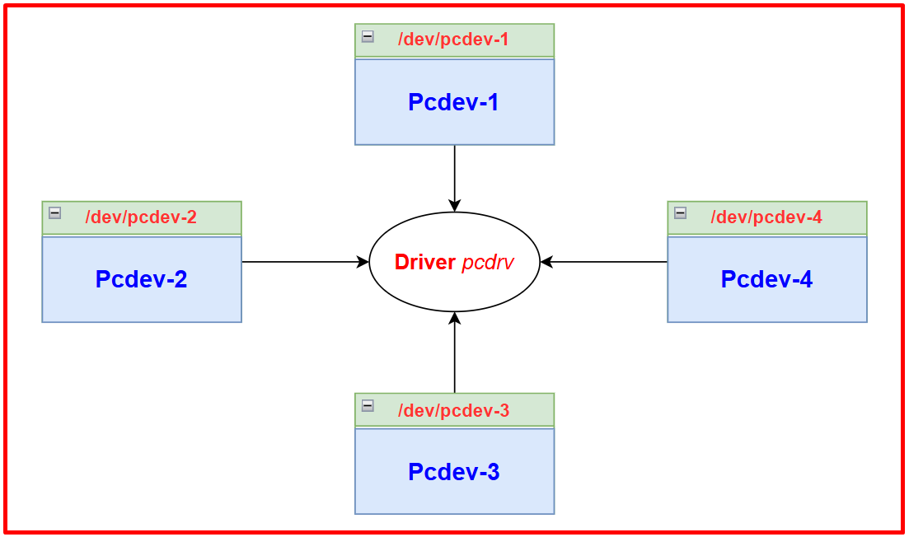
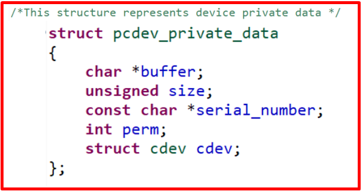
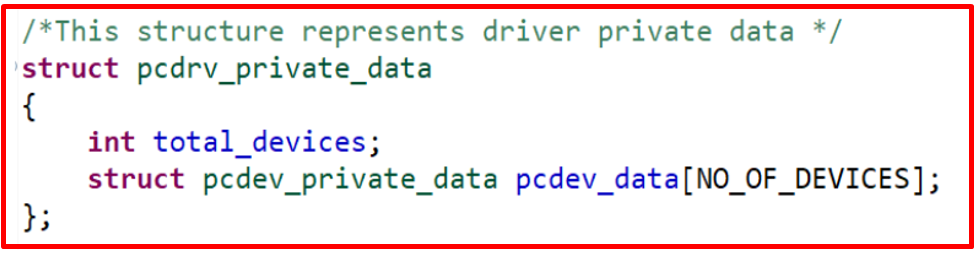
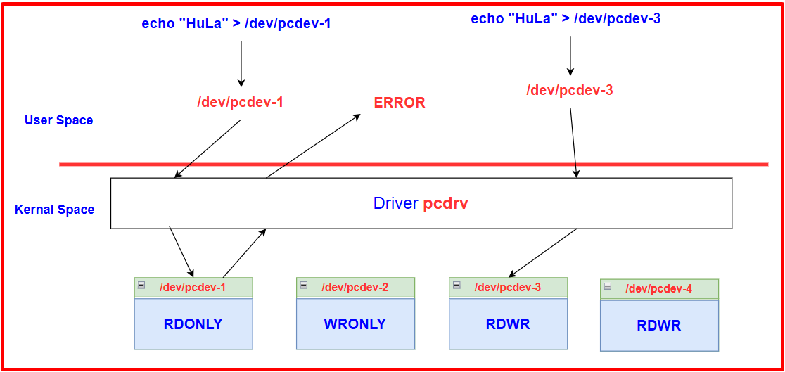
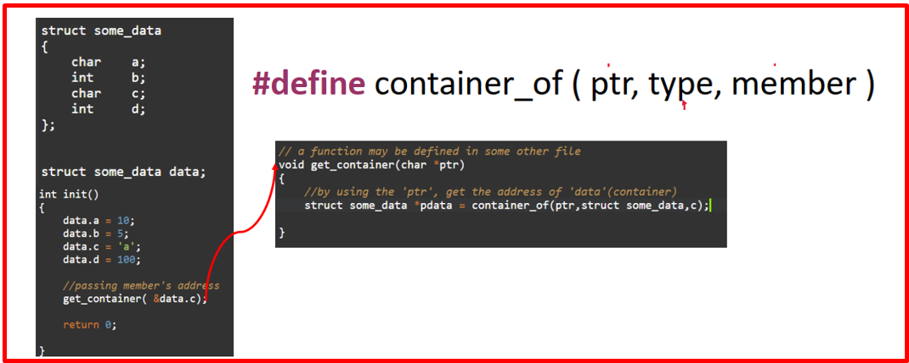

# 💚 Character Driver Multi Device 💛

## 👉 Introduction and Summary

### 1️⃣ Introduction

+ Ở bài trước chúng ta đã tạo ra được character device sử dụng IOCTL để control led. Nếu các bạn chưa đọc thì xem link này nha [028_Character_Device_IOCTL.md](../028_Character_Device_IOCTL/028_Character_Device_IOCTL.md). Ở bài này chúng ta sẽ tìm hiểu về cách 1 driver có thể điều khiển được nhiều device và cách tạo ra nó nhé.

### 2️⃣ Summary

Nội dung của bài viết gồm có những phần sau nhé 📢📢📢:
- [I. Introduction and Summary](#👉-introduction-and-summary)

    - [1. Introduction](#1️⃣-introduction)
    - [2. Summary](#2️⃣-summary)
- [II. Contents](#👉-contents)
    - [1. Character Driver Multi Device](#1️⃣-character-driver-multi-device)
    - [2. Thực hành](#2️⃣-thực-hành)
- [III. Conclusion](#✔️-conclusion)
- [IV. Exercise](#💯-exercise)
- [V. NOTE](#📺-note)
- [VI. Reference](#📌-reference)

## 👉 Contents

### 1️⃣ Character Driver Multi Device
+ Bài này được áp dụng cho trường hợp khi ta tạo ra 1 driver nhưng lại muốn điều khiển nhiều device.
+ Bài này mình sẽ lấy ví dụ và làm để mọi người theo dõi và dễ hiểu hơn nhé, vì lý thuyết thì bài trước đã khá đầy đủ rồi

***Đề bài***
+ 1 driver sẽ quản lý 4 device, chi tiết tên device sẽ như ảnh bên dưới đây. Và việc quan trọng trước tiên là làm sao ta có thể xác định được device nào đang được truy cập để thực hiện.

​<p align="center">
     
</p>

+ Điều quan trọng thứ 2 là mỗi device sẽ có 1 **provate data** riêng. Làm sao ta có thể truy cập được đúng private data này và sử dụng chúng. Chú ý Pcdev nghĩa là Pseudo Character Device nhá

​<p align="center">
     
</p>

+ Điều quan trọng thứ 3 là Driver cũng có **private data** của riêng nó

​<p align="center">
     
</p>

+ Cách tương tác sẽ như hình dưới, và mỗi device private data sẽ có quyền truy cập riêng

​<p align="center">
     
</p>

+ 1 macro quan trọng sẽ sử dụng trong bài là macro container_of. Truyền vào 1 phần tử trong struct sẽ trả về địa chỉ của cả struct.
    + Các bạn có thể xem đoạn code sau để hiểu hơn: https://onlinegdb.com/2Br5_wDWI

​<p align="center">
     
</p>

### 2️⃣ Thực hành
***Bài 1: Character device new***
+ File Makefile
```Makefile
EXTRA_CFLAGS = -Wall
obj-m = pcd.o

KDIR := /lib/modules/`uname -r`/build
CC := gcc

all:
	make -C $(KDIR) M=`pwd` modules
	$(CC) -o app test_app.c

clean:
	make -C $(KDIR) M=`pwd` clean
	rm -rf app
```

+ File pcd.c
```c
#include<linux/module.h>
#include<linux/fs.h>
#include<linux/cdev.h>
#include<linux/device.h>
#include<linux/kdev_t.h>
#include<linux/uaccess.h>


#undef pr_fmt
#define pr_fmt(fmt) "%s : " fmt,__func__

#define DEV_MEM_SIZE 512

/* pseudo device's memory */
char device_buffer[DEV_MEM_SIZE];

/* This holds the device number */
dev_t device_number;

/* Cdev variable */
struct cdev pcd_cdev;

/*holds the class pointer */
struct class *class_pcd;

struct device *device_pcd;


loff_t pcd_lseek(struct file *filp, loff_t offset, int whence)
{
	loff_t temp;

	pr_info("lseek requested \n");
	pr_info("Current value of the file position = %lld\n",filp->f_pos);

	switch(whence)
	{
		case SEEK_SET:
			if((offset > DEV_MEM_SIZE) || (offset < 0))
				return -EINVAL;
			filp->f_pos = offset;
			break;
		case SEEK_CUR:
			temp = filp->f_pos + offset;
			if((temp > DEV_MEM_SIZE) || (temp < 0))
				return -EINVAL;
			filp->f_pos = temp;
			break;
		case SEEK_END:
			temp = DEV_MEM_SIZE + offset;
			if((temp > DEV_MEM_SIZE) || (temp < 0))
				return -EINVAL;
			filp->f_pos = temp;
			break;
		default:
			return -EINVAL;
	}
	
	pr_info("New value of the file position = %lld\n",filp->f_pos);

	return filp->f_pos;

}

ssize_t pcd_read(struct file *filp, char __user *buff, size_t count, loff_t *f_pos)
{
	pr_info("Read requested for %zu bytes \n",count);
	pr_info("Current file position = %lld\n",*f_pos);

	
	/* Adjust the 'count' */
	if((*f_pos + count) > DEV_MEM_SIZE)
		count = DEV_MEM_SIZE - *f_pos;

	/*copy to user */
	if(copy_to_user(buff,&device_buffer[*f_pos],count)){
		return -EFAULT;
	}

	/*update the current file postion */
	*f_pos += count;

	pr_info("Number of bytes successfully read = %zu\n",count);
	pr_info("Updated file position = %lld\n",*f_pos);

	/*Return number of bytes which have been successfully read */
	return count;
}

ssize_t pcd_write(struct file *filp, const char __user *buff, size_t count, loff_t *f_pos)
{
	pr_info("Write requested for %zu bytes\n",count);
	pr_info("Current file position = %lld\n",*f_pos);

	
	/* Adjust the 'count' */
	if((*f_pos + count) > DEV_MEM_SIZE)
		count = DEV_MEM_SIZE - *f_pos;

	if(!count){
		pr_err("No space left on the device \n");
		return -ENOMEM;
	}

	/*copy from user */
	if(copy_from_user(&device_buffer[*f_pos],buff,count)){
		return -EFAULT;
	}

	/*update the current file postion */
	*f_pos += count;

	pr_info("Number of bytes successfully written = %zu\n",count);
	pr_info("Updated file position = %lld\n",*f_pos);

	/*Return number of bytes which have been successfully written */
	return count;
}

int pcd_open(struct inode *inode, struct file *filp)
{
	pr_info("open was successful\n");

	return 0;
}

int pcd_release(struct inode *inode, struct file *flip)
{
	pr_info("release was successful\n");

	return 0;
}


/* file operations of the driver */
struct file_operations pcd_fops=
{
	.open = pcd_open,
	.release = pcd_release,
	.read = pcd_read,
	.write = pcd_write,
	.llseek = pcd_lseek,
	.owner = THIS_MODULE
};


static int __init pcd_driver_init(void)
{
	int ret;

	/*1. Dynamically allocate a device number */
	ret = alloc_chrdev_region(&device_number,0,1,"pcd_devices");
	if(ret < 0){
		pr_err("Alloc chrdev failed\n");
		goto out;
	}

	pr_info("Device number <major>:<minor> = %d:%d\n",MAJOR(device_number),MINOR(device_number));

	/*2. Initialize the cdev structure with fops*/
	cdev_init(&pcd_cdev,&pcd_fops);

	/* 3. Register a device (cdev structure) with VFS */
	pcd_cdev.owner = THIS_MODULE;
	ret = cdev_add(&pcd_cdev,device_number,1);
	if(ret < 0){
		pr_err("Cdev add failed\n");
		goto unreg_chrdev;
	}

	/*4. create device class under /sys/class/ */
	class_pcd = class_create(THIS_MODULE,"pcd_class");
	if(IS_ERR(class_pcd)){
		pr_err("Class creation failed\n");
		ret = PTR_ERR(class_pcd);
		goto cdev_del;
	}

	/*5.  populate the sysfs with device information */
	device_pcd = device_create(class_pcd,NULL,device_number,NULL,"pcd");
	if(IS_ERR(device_pcd)){
		pr_err("Device create failed\n");
		ret = PTR_ERR(device_pcd);
		goto class_del;
	}

	pr_info("Module init was successful\n");

	return 0;

class_del:
	class_destroy(class_pcd);
cdev_del:
	cdev_del(&pcd_cdev);	
unreg_chrdev:
	unregister_chrdev_region(device_number,1);
out:
	pr_info("Module insertion failed\n");
	return ret;
}


static void __exit pcd_driver_cleanup(void)
{
	device_destroy(class_pcd,device_number);
	class_destroy(class_pcd);
	cdev_del(&pcd_cdev);
	unregister_chrdev_region(device_number,1);
	pr_info("module unloaded\n");
}


module_init(pcd_driver_init);
module_exit(pcd_driver_cleanup);

MODULE_LICENSE("GPL");
MODULE_AUTHOR("thonv12");
MODULE_DESCRIPTION("character driver");
```

+ File test_app.c
```c
/******************************************************************************
 *  @brief      Userspace application to test the Device driver
 *
 *  @author     thonv - thonv12@gmail.com
 *******************************************************************************/

#include <stdio.h>
#include <stdlib.h>
#include <string.h>
#include <fcntl.h>
#include <unistd.h>
#include <stdio.h>
#include <stdio_ext.h>

#define CDEV_PATH "/dev/pcd"

int fd, option,of,length;
char write_buf[1024];
char read_buf[1024];

void printMenu()
{

    printf("****Please Enter the Option******\n");
    printf("        1. Write                 \n");
    printf("        2. Read                  \n");
    printf("        3. Lseek                  \n");
    printf("        4. Exit                  \n");
    printf("*********************************\n");
    printf(">>> ");
}

int main()
{
    printf("*********************************\n");
    printf("*******Linux*******\n\n");
    printf("*********************************\n");

    fd = open(CDEV_PATH, O_RDWR);
    if (fd < 0)
    {
        printf("Cannot open device file: %s...\n", CDEV_PATH);
        return -1;
    }

    while (1)
    {
        printMenu();

        scanf("%d", &option);
        switch (option)
        {
        case 1:
            printf("Enter the string to write into driver: ");
            scanf("  %[^\t\n]s", write_buf);
            printf("Data Writing ... ");
            write(fd, write_buf, strlen(write_buf) + 1);
            printf("Done!\n\n\n");
            break;

        case 2:
            printf("length = ");
            scanf("%d", &length);
            printf("Data Reading ... ");
            read(fd, read_buf, length);
            printf("Done!\n");
            printf("Data: %s\n\n\n", read_buf);
            break;

        case 3:
            printf("enter offset from SEEK_SET = ");
            scanf("%d", &of);
            lseek(fd,of,SEEK_SET);
            break;

        case 4:
            close(fd);
            exit(1);
            break;

        default:
            printf("Enter Valid option = %c\n", option);
            break;
        }
    }

    close(fd);

    return 0;
}
```

***Bài 2: Character multi device***


+ Bài gồm 3 file là Makefile, driver.c và test_app.c

+ FIle Makefile
```Makefile
EXTRA_CFLAGS = -Wall
obj-m = driver.o

KDIR := /lib/modules/`uname -r`/build
CC := gcc

all:
	make -C $(KDIR) M=`pwd` modules
	$(CC) -o app test_app.c

clean:
	make -C $(KDIR) M=`pwd` clean
	rm -rf app
```

+ File driver.c
```c
#include<linux/module.h>
#include<linux/fs.h>
#include<linux/cdev.h>
#include<linux/device.h>
#include<linux/kdev_t.h>
#include<linux/uaccess.h>


#undef pr_fmt
#define pr_fmt(fmt) "%s : " fmt,__func__


#define NO_OF_DEVICES 4

#define MEM_SIZE_MAX_PCDEV1  1024
#define MEM_SIZE_MAX_PCDEV2  512
#define MEM_SIZE_MAX_PCDEV3  1024
#define MEM_SIZE_MAX_PCDEV4  512


/*permission codes */
#define RDONLY 0x01
#define WRONLY 0X10
#define RDWR   0x11

/* device's memory giả */
char device_buffer_pcdev1[MEM_SIZE_MAX_PCDEV1];
char device_buffer_pcdev2[MEM_SIZE_MAX_PCDEV2];
char device_buffer_pcdev3[MEM_SIZE_MAX_PCDEV3];
char device_buffer_pcdev4[MEM_SIZE_MAX_PCDEV4];


/*Device private data structure */

struct pcdev_private_data
{
	char *buffer;
	unsigned size;
	const char *serial_number;
	int perm;
	struct cdev cdev;
};


/*Driver private data structure */
struct pcdrv_private_data
{
	int total_devices;
	/* This holds the device number */
	dev_t device_number;
	struct class *class_pcd;
	struct device *device_pcd;
	struct pcdev_private_data  pcdev_data[NO_OF_DEVICES];
};


struct pcdrv_private_data pcdrv_data = 
{
	.total_devices = NO_OF_DEVICES,
	.pcdev_data = {

		[0] = {
			.buffer = device_buffer_pcdev1,
			.size = MEM_SIZE_MAX_PCDEV1,
			.serial_number = "THONV01",
			.perm = RDONLY
		},
 		
		[1] = {
			.buffer = device_buffer_pcdev2,
			.size = MEM_SIZE_MAX_PCDEV2,
			.serial_number = "THONV02",
			.perm = WRONLY 
		},
		
		[2] = {
			.buffer = device_buffer_pcdev3,
			.size = MEM_SIZE_MAX_PCDEV3,
			.serial_number = "THONV03",
			.perm = RDWR 
		},

		[3] = {
			.buffer = device_buffer_pcdev4,
			.size = MEM_SIZE_MAX_PCDEV4,
			.serial_number = "THONV04",
			.perm = RDWR 
		}

	}
};


loff_t pcd_lseek(struct file *filp, loff_t offset, int whence)
{

	struct pcdev_private_data *pcdev_data = (struct pcdev_private_data*)filp->private_data;

	int max_size = pcdev_data->size;
	
	loff_t temp;

	pr_info("lseek requested \n");
	pr_info("Current value of the file position = %lld\n",filp->f_pos);

	switch(whence)
	{
		case SEEK_SET: /* first */
			if((offset > max_size) || (offset < 0))
				return -EINVAL;
			filp->f_pos = offset;
			break;
		case SEEK_CUR: /* Now */
			temp = filp->f_pos + offset;
			if((temp > max_size) || (temp < 0))
				return -EINVAL;
			filp->f_pos = temp;
			break;
		case SEEK_END: /* End */
			temp = max_size + offset;
			if((temp > max_size) || (temp < 0))
				return -EINVAL;
			filp->f_pos = temp;
			break;
		default:
			return -EINVAL;
	}
	
	pr_info("New value of the file position = %lld\n",filp->f_pos);

	return filp->f_pos;
}

ssize_t pcd_read(struct file *filp, char __user *buff, size_t count, loff_t *f_pos)
{
	
	struct pcdev_private_data *pcdev_data = (struct pcdev_private_data*)filp->private_data;

	int max_size = pcdev_data->size;

	pr_info("Read requested for %zu bytes \n",count);
	pr_info("Current file position = %lld\n",*f_pos);

	
	/* Adjust the 'count' */
	if((*f_pos + count) > max_size)
		count = max_size - *f_pos;

	/*copy to user */
	if(copy_to_user(buff,pcdev_data->buffer+(*f_pos),count)){
		return -EFAULT;
	}

	/*update the current file postion */
	*f_pos += count;

	pr_info("Number of bytes successfully read = %zu\n",count);
	pr_info("Updated file position = %lld\n",*f_pos);

	/*Return number of bytes which have been successfully read */
	return count;

}

ssize_t pcd_write(struct file *filp, const char __user *buff, size_t count, loff_t *f_pos)
{
	struct pcdev_private_data *pcdev_data = (struct pcdev_private_data*)filp->private_data;

	int max_size = pcdev_data->size;
	
	pr_info("Write requested for %zu bytes\n",count);
	pr_info("Current file position = %lld\n",*f_pos);

	
	/* Adjust the 'count' */
	if((*f_pos + count) > max_size)
		count = max_size - *f_pos;

	if(!count){
		pr_err("No space left on the device \n");
		return -ENOMEM;
	}

	/*copy from user */
	if(copy_from_user(pcdev_data->buffer+(*f_pos),buff,count)){
		return -EFAULT;
	}

	/*update the current file postion */
	*f_pos += count;

	pr_info("Number of bytes successfully written = %zu\n",count);
	pr_info("Updated file position = %lld\n",*f_pos);

	/*Return number of bytes which have been successfully written */
	return count;
}


int check_permission(int dev_perm, int acc_mode)
{

	if(dev_perm == RDWR)
		return 0;
	
	//ensures readonly access
	if( (dev_perm == RDONLY) && ( (acc_mode & FMODE_READ) && !(acc_mode & FMODE_WRITE) ) )
		return 0;
	
	//ensures writeonly access
	if( (dev_perm == WRONLY) && ( (acc_mode & FMODE_WRITE) && !(acc_mode & FMODE_READ) ) )
		return 0;

	return -EPERM;

}


/* linux/include/linux/fs.h*/
int pcd_open(struct inode *inode, struct file *filp)
{
	int ret;

	int minor_n;
	
	struct pcdev_private_data *pcdev_data;

	/*Check  inode->i_rdev sẽ biết thiết bị nào đang được truy cập*/

	minor_n = MINOR(inode->i_rdev);
	pr_info("minor access = %d\n",minor_n);

	/*get device's private data structure */
	pcdev_data = container_of(inode->i_cdev,struct pcdev_private_data,cdev);

	/*Dùng filp->private_data để cung cấp dữ liệu riêng rư của thiết bị cho các phương thức open raed write ... */
	filp->private_data = pcdev_data;
		
	/*check permission */
	ret = check_permission(pcdev_data->perm,filp->f_mode);

	(!ret)?pr_info("open was successful\n"):pr_info("open was unsuccessful\n");

	return ret;
}

int pcd_release(struct inode *inode, struct file *flip)
{
	pr_info("release was successful\n");

	return 0;
}


/* file operations of the driver */
struct file_operations pcd_fops=
{
	.open = pcd_open,
	.release = pcd_release,
	.read = pcd_read,
	.write = pcd_write,
	.llseek = pcd_lseek,
	.owner = THIS_MODULE
};


static int __init pcd_driver_init(void)
{
	int ret;
	int i;

	/*Dynamically allocate  device numbers */
	ret = alloc_chrdev_region(&pcdrv_data.device_number,0,NO_OF_DEVICES,"pcdevs");
	if(ret < 0){
		pr_err("Alloc chrdev failed\n");
		goto out;
	}

	/*create device class under /sys/class/ */
	pcdrv_data.class_pcd = class_create(THIS_MODULE,"pcd_class");
	if(IS_ERR(pcdrv_data.class_pcd)){
		pr_err("Class creation failed\n");
		ret = PTR_ERR(pcdrv_data.class_pcd);
		goto unreg_chrdev;
	}

	for(i=0;i<NO_OF_DEVICES;i++){
		pr_info("Device number <major>:<minor> = %d:%d\n",MAJOR(pcdrv_data.device_number+i),MINOR(pcdrv_data.device_number+i));

		/*Initialize the cdev structure with fops*/
		cdev_init(&pcdrv_data.pcdev_data[i].cdev,&pcd_fops);

		/*  Register a device (cdev structure) with VFS */
		pcdrv_data.pcdev_data[i].cdev.owner = THIS_MODULE;
		ret = cdev_add(&pcdrv_data.pcdev_data[i].cdev,pcdrv_data.device_number+i,1);
		if(ret < 0){
			pr_err("Cdev add failed\n");
			goto cdev_del;
		}

		/*populate the sysfs with device information */
		pcdrv_data.device_pcd = device_create(pcdrv_data.class_pcd,NULL,pcdrv_data.device_number+i,NULL,"pcdev-%d",i+1);
		if(IS_ERR(pcdrv_data.device_pcd)){
			pr_err("Device create failed\n");
			ret = PTR_ERR(pcdrv_data.device_pcd);
			goto class_del;
		}
	}


	pr_info("Module init was successful\n");

	return 0;

cdev_del:
class_del:
	for(;i>=0;i--){
		device_destroy(pcdrv_data.class_pcd,pcdrv_data.device_number+i);
		cdev_del(&pcdrv_data.pcdev_data[i].cdev);
	}
	class_destroy(pcdrv_data.class_pcd);

unreg_chrdev:
	unregister_chrdev_region(pcdrv_data.device_number,NO_OF_DEVICES);
out:
	pr_info("Module insertion failed\n");
	return ret; 
}


static void __exit pcd_driver_cleanup(void)
{
	int i;

	for(i=0;i<NO_OF_DEVICES;i++){
		device_destroy(pcdrv_data.class_pcd,pcdrv_data.device_number+i);
		cdev_del(&pcdrv_data.pcdev_data[i].cdev);
	}
	class_destroy(pcdrv_data.class_pcd);

	unregister_chrdev_region(pcdrv_data.device_number,NO_OF_DEVICES);
	
	pr_info("module unloaded\n");
}


module_init(pcd_driver_init);
module_exit(pcd_driver_cleanup);

MODULE_LICENSE("GPL");
MODULE_AUTHOR("thonv");
MODULE_DESCRIPTION("driver which handles n devices");
```

+ File test_app.c
```c
/******************************************************************************
 *  @brief      Userspace application to test the Device driver
 *
 *  @author     thonv - thonv12@gmail.com
 *******************************************************************************/

#include <stdio.h>
#include <stdlib.h>
#include <string.h>
#include <fcntl.h>
#include <unistd.h>
#include <stdio.h>
#include <stdio_ext.h>

#define CDEV_PATH "/dev/pcdev-3"

int fd, option,of,length;
char write_buf[1024];
char read_buf[1024];

void printMenu()
{

    printf("****Please Enter the Option******\n");
    printf("        1. Write                 \n");
    printf("        2. Read                  \n");
    printf("        3. Lseek                  \n");
    printf("        4. Exit                  \n");
    printf("*********************************\n");
    printf(">>> ");
}

int main()
{
    printf("*********************************\n");
    printf("*******Linux*******\n\n");
    printf("*********************************\n");

    fd = open(CDEV_PATH, O_RDWR);
    if (fd < 0)
    {
        printf("Cannot open device file: %s...\n", CDEV_PATH);
        return -1;
    }

    while (1)
    {
        printMenu();

        scanf("%d", &option);
        switch (option)
        {
        case 1:
            printf("Enter the string to write into driver: ");
            scanf("  %[^\t\n]s", write_buf);
            printf("Data Writing ... ");
            write(fd, write_buf, strlen(write_buf) + 1);
            printf("Done!\n\n\n");
            break;

        case 2:
            printf("length = ");
            scanf("%d", &length);
            printf("Data Reading ... ");
            read(fd, read_buf, length);
            printf("Done!\n");
            printf("Data: %s\n\n\n", read_buf);
            break;

        case 3:
            printf("enter offset from SEEK_SET = ");
            scanf("%d", &of);
            lseek(fd,of,SEEK_SET);
            break;

        case 4:
            close(fd);
            exit(1);
            break;

        default:
            printf("Enter Valid option = %c\n", option);
            break;
        }
    }

    close(fd);

    return 0;
}
```

## ✔️ Conclusion
Ở bài này chúng ta đã biết cách tạo 1 driver để điều khiển được nhiều device. Tiếp theo chúng ta sẽ đến bài Proc Filesystem nhé.

## 💯 Exercise
+ Thực hành theo bài viết

## 📺 NOTE
+ N/A

## 📌 Reference

[1] i.MX Linux Reference Manual

[2] https://linux-kernel-labs.github.io/refs/heads/master/labs/device_drivers.html
