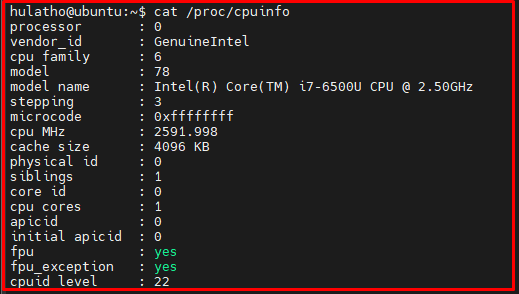
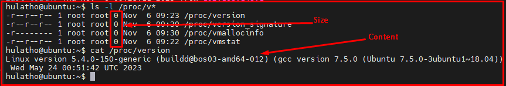
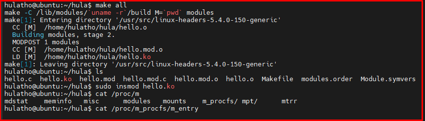

# 💚 Proc Filesystem 💛

## 👉 Introduction and Summary

### 1️⃣ Introduction

+ Ở bài trước chúng ta đã tạo ra được character multi device. Nếu các bạn chưa đọc thì xem link này nha [029_Character_Multi_Device.md](../029_Character_Multi_Device/029_Character_Multi_Device.md). Ở bài này chúng ta sẽ tìm hiểu về Proc filesystem nhé.

### 2️⃣ Summary

Nội dung của bài viết gồm có những phần sau nhé 📢📢📢:
- [I. Introduction and Summary](#👉-introduction-and-summary)

    - [1. Introduction](#1️⃣-introduction)
    - [2. Summary](#2️⃣-summary)
- [II. Contents](#👉-contents)
    - [1. Proc filesystem](#1️⃣-proc-filesystem)
    - [2. Thực hành](#2️⃣-thực-hành)
- [III. Conclusion](#✔️-conclusion)
- [IV. Exercise](#💯-exercise)
- [V. NOTE](#📺-note)
- [VI. Reference](#📌-reference)

## 👉 Contents

### 1️⃣ Proc filesystem
+ Hệ thống file /proc là 1 filesystem đặc biệt được tạo bằng software và được sử dụng để export thông tin ra thế giới bên ngoài
+ Mỗi file trong /proc được liên kết với 1 kernel function. Function này sẽ generate ra nội dung của file ngay khi file được read

​<p align="center">
     
</p>

+ File trong /proc là một "pseudo" filesystems và nó không chiếm bất kì dung lượng nào trên disk
+ Nội dung của proc filesystem thường được generated dynamically mỗi khi truy cập chúng.

​<p align="center">
     
</p>

+ /proc filesystem được các kernel developer sử dụng cho mục đích ban đầu là cung cấp thông tin về các tiến trình đang chạy trong hệ thống.
```bash
/proc/cpuinfo Thông tin về processor, chẳng hạn như type, make, model...
/proc/devices Danh sách các device drivers được cấu hình trong kernel.
/proc/interrupts Hiển thị các interrupts đang được sử dụng
/proc/meminfo Thông tin về việc sử dụng memory, cả memory physical và memory swap.
/proc/modules Các mô-đun kernel nào đang được load tại thời điểm này.
```

+ Chúng ta dùng hàm seq_printf để ghi thông ti vào proc file và dùng hàm proc_create để tạo procfile

***Create proc filesystem***
+ Bản thân tệp proc không có tác dụng gì cả nên điều cần thiết là ta triển khai cái ta mong muốn khi đọc ghi từ file đó
+ Proc file chỉ print ra 1 single page output được define bởi PAGE_SIZE in kernel.

### 2️⃣ Thực hành
***Bài 1***
+ Gồm 2 file là file hello_proc.c và file Makefile
+ File hello_proc.c
```c
#include <linux/module.h>
#include <linux/proc_fs.h>
#include <linux/seq_file.h>

static int hello_proc_show(struct seq_file *m, void *v) {
  seq_printf(m, "Hello proc!\n");
  return 0;
}

static int hello_proc_open(struct inode *inode, struct  file *file) {
  return single_open(file, hello_proc_show, NULL);
}

static const struct file_operations hello_proc_fops = {
  .owner = THIS_MODULE,
  .open = hello_proc_open,
  .read = seq_read,
  .llseek = seq_lseek,
  .release = single_release,
};

static int __init hello_proc_init(void) {
  proc_create("hello_proc", 0, NULL, &hello_proc_fops);
  return 0;
}

static void __exit hello_proc_exit(void) {
  remove_proc_entry("hello_proc", NULL);
}

MODULE_LICENSE("GPL");
module_init(hello_proc_init);
module_exit(hello_proc_exit);
```

+ File Makefile
```Makefile
KERNELDIR ?= /lib/modules/$(shell uname -r)/build

all:
	$(MAKE) -C $(KERNELDIR)  M=$(PWD) modules
clean:
	$(MAKE) -C $(KERNELDIR)  M=$(PWD) clean
```

+ Sau khi tạo xong, chúng ta có thể cat file /proc/hello_proc ra để xem "hello proc?"
```bash
cat /proc/hello_proc
Hello proc!
```


***Bài 2***
+ Bài này gồm 2 file là hello.c và Makefile
+ File Makefile
```Makefile
EXTRA_CFLAGS = -Wall
obj-m = hello.o

KDIR := /lib/modules/`uname -r`/build
CC := gcc

all:
	make -C $(KDIR) M=`pwd` modules

clean:
	make -C $(KDIR) M=`pwd` clean
```

+ File hello.c
```c
/******************************************************************************
*  @brief      Simple Linux device driver
*
*  @author     thonv12 - thonv@gmail.com
*******************************************************************************/

#include <linux/module.h>  /* Thu vien nay dinh nghia cac macro nhu module_init/module_exit */
#include <linux/fs.h>      /* Thu vien nay dinh nghia cac ham allocate major/minor number */
#include <linux/device.h>  /* Thu vien nay dinh nghia cac ham class_create/device_create */
#include <linux/cdev.h>    /* Thu vien nay dinh nghia cac ham kmalloc */
#include <linux/slab.h>    /* Thu vien nay dinh nghia cac ham cdev_init/cdev_add */
#include <linux/uaccess.h> /* Thu vien nay dinh nghia cac ham copy_to_user/copy_from_user */
#include <linux/proc_fs.h> /* Thu vien nay dinh nghia cac ham proc_mkdir/proc_create */

#define DRIVER_AUTHOR "thonv12 tho@gmail.com"
#define DRIVER_DESC   "Hello world kernel module"

#define NPAGES  1

/* 
** I am using the kernel 5.4.0-107-generic . So I have set this as 540.
** If you are using the kernel 3.10, then set this as 310,
** and for kernel 5.1, set this as 501. Because the API proc_create()
** changed in kernel above v5.5.
**
*/ 
#define LINUX_KERNEL_VERSION  540

#define WR_VALUE _IOW('a', '1', int32_t *)
#define RD_VALUE _IOR('a', '2', int32_t *)

static int32_t value = 0;

struct m_foo_dev {
    int32_t size;
    char *kmalloc_ptr;
    dev_t dev_num;
    struct class *m_class;
    struct cdev m_cdev;
    struct proc_dir_entry *parent;
} mdev;

/*************** Function Prototypes *******************/
static int      __init hello_world_init(void);
static void     __exit hello_world_exit(void);

/*************** Driver Functions **********************/
static int      m_open(struct inode *inode, struct file *file);
static int      m_release(struct inode *inode, struct file *file);
static ssize_t  m_read(struct file *filp, char __user *user_buf, size_t size,loff_t *offset);
static ssize_t  m_write(struct file *filp, const char *user_buf, size_t size, loff_t *offset);
static long     m_ioctl(struct file *file, unsigned int cmd, unsigned long arg);

/***************** Procfs Functions *******************/
static int      open_proc(struct inode *inode, struct file *file);
static int      release_proc(struct inode *inode, struct file *file);
static ssize_t  read_proc(struct file *filp, char __user *buffer, size_t length,loff_t * offset);
static ssize_t  write_proc(struct file *filp, const char *buff, size_t length, loff_t * offset);

static struct file_operations fops =
{
    .owner      = THIS_MODULE,
    .read       = m_read,
    .write      = m_write,
    .open       = m_open,
    .release    = m_release,
    .unlocked_ioctl = m_ioctl,
};

#if ( LINUX_KERNEL_VERSION < 505 )
//LINUX_KERNEL_VERSION < 505
static struct proc_ops proc_fops = {
        .proc_open = open_proc,
        .proc_read = read_proc,
        .proc_write = write_proc,
        .proc_release = release_proc
};
#else 
//LINUX_KERNEL_VERSION > 505
static struct file_operations proc_fops = {
        .open = open_proc,
        .read = read_proc,
        .write = write_proc,
        .release = release_proc
};
#endif //LINUX_KERNEL_VERSION > 505

/* This function will be called when we open the procfs file */
static int open_proc(struct inode *inode, struct file *file)
{
    pr_info("proc file opend.....\t");
    return 0;
}

/* This function will be called when we close the procfs file */
static int release_proc(struct inode *inode, struct file *file)
{
    pr_info("proc file released.....\n");
    return 0;
}

/* This function will be called when we read the procfs file */
static ssize_t read_proc(struct file *filp, char __user *buffer, size_t length,loff_t * offset)
{
    pr_info("proc file read.....\n");
    return length;;
}

/* This function will be called when we write the procfs file */
static ssize_t write_proc(struct file *filp, const char *buff, size_t length, loff_t * offset)
{
    pr_info("proc file wrote.....\n");
    return length;
}

/* This function will be called when we open the Device file */
static int m_open(struct inode *inode, struct file *file)
{
    pr_info("System call open() called...!!!\n");
    return 0;
}

/* This function will be called when we close the Device file */
static int m_release(struct inode *inode, struct file *file)
{
    pr_info("System call close() called...!!!\n");
    return 0;
}

/* This function will be called when we read the Device file */
static ssize_t m_read(struct file *filp, char __user *user_buffer, size_t size, loff_t *offset)
{
    size_t to_read;

    pr_info("System call read() called...!!!\n");

    /* Check size doesn't exceed our mapped area size */
    to_read = (size > mdev.size - *offset) ? (mdev.size - *offset) : size;

	/* Copy from mapped area to user buffer */
	if (copy_to_user(user_buffer, mdev.kmalloc_ptr + *offset, to_read))
		return -EFAULT;

    *offset += to_read;

	return to_read;
}

/* This function will be called when we write the Device file */
static ssize_t m_write(struct file *filp, const char __user *user_buffer, size_t size, loff_t *offset)
{
    size_t to_write;

    pr_info("System call write() called...!!!\n");

    /* Check size doesn't exceed our mapped area size */
	to_write = (size + *offset > NPAGES * PAGE_SIZE) ? (NPAGES * PAGE_SIZE - *offset) : size;

	/* Copy from user buffer to mapped area */
	memset(mdev.kmalloc_ptr, 0, NPAGES * PAGE_SIZE);
	if (copy_from_user(mdev.kmalloc_ptr + *offset, user_buffer, to_write) != 0)
		return -EFAULT;

    *offset += to_write;
    mdev.size = *offset;

	return to_write;
}

static long m_ioctl(struct file *file, unsigned int cmd, unsigned long arg)
{
    switch(cmd) {
        case WR_VALUE:
            if (copy_from_user(&value , (int32_t*)arg, sizeof(value))) {
                pr_err("Data Write : Err!\n");
            }
            pr_info("Value = %d\n", value);
            break;

        case RD_VALUE:
            if (copy_to_user((int32_t*)arg, &value, sizeof(value))) {
                    pr_err("Data Read : Err!\n");
            }
            break;

        default:
                pr_info("Default\n");
                break;
    }

    return 0;
}

static int 
__init hello_world_init(void)   /* Constructor */
{   
    /* 1. Allocating device number (cat /pro/devices)*/
    if (alloc_chrdev_region(&mdev.dev_num, 0, 1, "m-cdev") < 0) {
	    pr_err("Failed to alloc chrdev region\n");
	    return -1;
    }
    pr_info("Major = %d Minor = %d\n", MAJOR(mdev.dev_num), MINOR(mdev.dev_num));

    /* 02.1 Creating cdev structure */
    cdev_init(&mdev.m_cdev, &fops);

    /* 02.2 Adding character device to the system*/
    if ((cdev_add(&mdev.m_cdev, mdev.dev_num, 1)) < 0) {
        pr_err("Cannot add the device to the system\n");
        goto rm_device_numb;
    }

    /* 03. Creating struct class */
    if ((mdev.m_class = class_create(THIS_MODULE, "m_class")) == NULL) {
        pr_err("Cannot create the struct class for my device\n");
        goto rm_device_numb;
    }

    /* 04. Creating device*/
    if ((device_create(mdev.m_class, NULL, mdev.dev_num, NULL, "m_device")) == NULL) {
        pr_err("Cannot create my device\n");
        goto rm_class;
    }

    /* 05. Creating Physical memory*/
    if ((mdev.kmalloc_ptr = kmalloc(NPAGES * PAGE_SIZE , GFP_KERNEL)) == 0) {
        pr_err("Cannot allocate memory in kernel\n");
        goto rm_device;
    }

    /* 06.1 Create proc directory. It will create a directory under "/proc" */
    if ((mdev.parent = proc_mkdir("m_procfs", NULL)) == NULL) {
        pr_info("Error creating proc entry");
        goto rm_device;
    }
        
    /* 06.2 Creating Proc entry under "/proc/m_procfs/" */
    proc_create("m_entry", 0666, mdev.parent, &proc_fops);

    pr_info("Hello world kernel module\n");
    return 0;

rm_device:
    device_destroy(mdev.m_class, mdev.dev_num);
rm_class:
    class_destroy(mdev.m_class);
rm_device_numb:
    unregister_chrdev_region(mdev.dev_num, 1);
    return -1;
}

static void 
__exit hello_world_exit(void)   /* Destructor */
{
    //remove_proc_entry("m_procfs/m_entry", mdev.parent);   /* 06.2 Removes single proc entry */
    proc_remove(mdev.parent);                               /* 06.1 remove complete /proc/etx */
    kfree(mdev.kmalloc_ptr);                        /* 05 */
    device_destroy(mdev.m_class, mdev.dev_num);     /* 04 */
    class_destroy(mdev.m_class);                    /* 03 */
    cdev_del(&mdev.m_cdev);                         /* 02 */
    unregister_chrdev_region(mdev.dev_num, 3);      /* 01 */

    pr_info("Goodbye\n");;
}

module_init(hello_world_init);
module_exit(hello_world_exit);

MODULE_LICENSE("GPL");
MODULE_AUTHOR(DRIVER_AUTHOR);
MODULE_DESCRIPTION(DRIVER_DESC); 
MODULE_VERSION("1.0"); 
```

​<p align="center">
     
</p>

## ✔️ Conclusion
Ở bài này chúng ta đã biết cách tạo 1 proc file system. Tiếp theo chúng ta sẽ tìm hiểu về timer để tạo delay và interrupt nhé.


## 💯 Exercise
+ Thực hành theo bài viết

## 📺 NOTE
+ N/A

## 📌 Reference

[1] i.MX Linux Reference Manual

[2] https://docs.kernel.org/filesystems/proc.html
