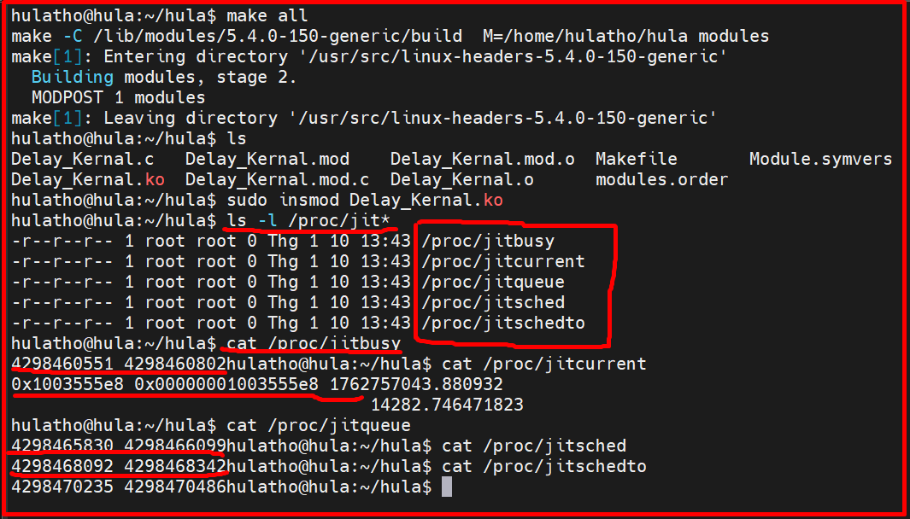
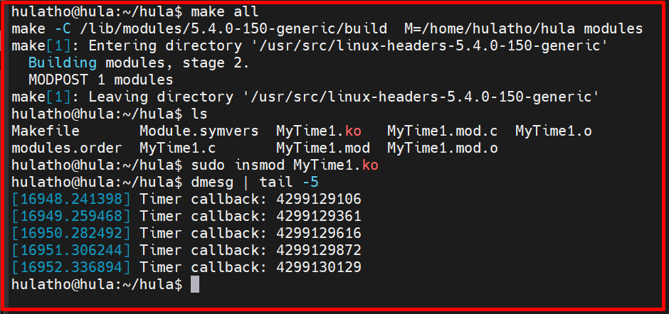
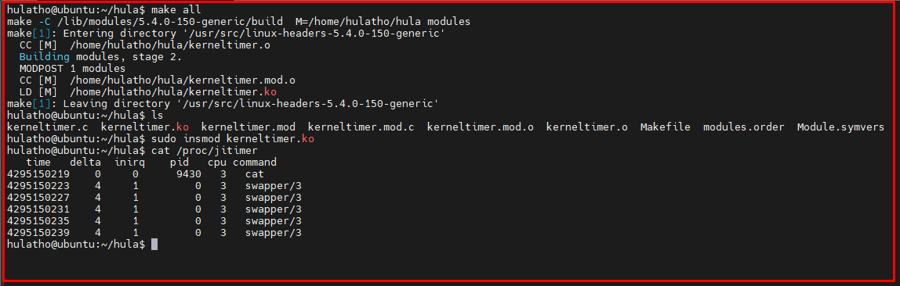
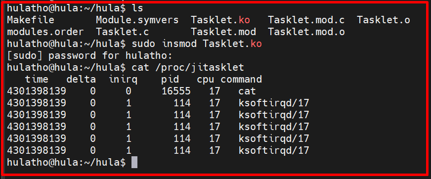
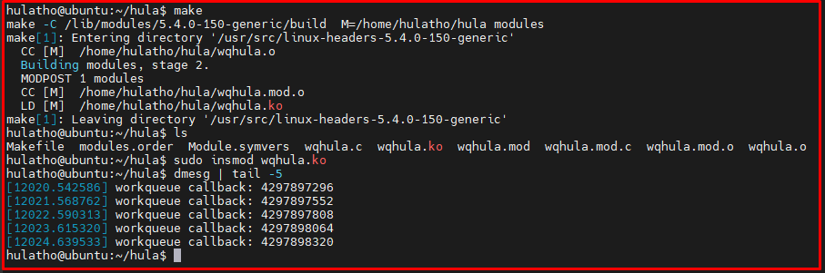
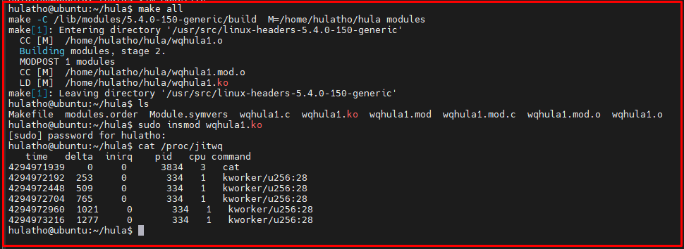

# 💚 Timer 💛

## 👉 Introduction and Summary

### 1️⃣ Introduction

+ Ở bài trước chúng ta đã biết và tạo ra được proc filesystem. Nếu các bạn chưa đọc thì xem link này nha [030_Proc_Filesystem.md](../030_Proc_Filesystem/030_Proc_Filesystem.md). Ở bài này chúng ta sẽ tìm hiểu về timer  nhé.

### 2️⃣ Summary

Nội dung của bài viết gồm có những phần sau nhé 📢📢📢:
- [I. Introduction and Summary](#👉-introduction-and-summary)

    - [1. Introduction](#1️⃣-introduction)
    - [2. Summary](#2️⃣-summary)
- [II. Contents](#👉-contents)
    - [1. Timer](#1️⃣-timer)
    - [2. Tasklet](#2️⃣-tasklet)
    - [3. Workqueues](#3️⃣-workqueues)
- [III. Conclusion](#✔️-conclusion)
- [IV. Exercise](#💯-exercise)
- [V. NOTE](#📺-note)
- [VI. Reference](#📌-reference)

## 👉 Contents

### 1️⃣ Timer
+ Nhiều tình huống trong kernel sẽ sử dụng tới timer như việc viết kernel theo kiểu điều khiển bằng thời gian hoặc theo kiểu điều khiển về sự kiện. Khi này ta cần tạo ra các khoảng thời gian(perior). Rồi delay để lên lịch cho công việc tiếp theo
+ Khi này kernel sử dụng hardware timer để đo thời gian. Chu kỳ của hardware timer là một tick
+ Frequency của system timer (the tick rate) là HZ. Khi này ta sẽ có 1 biến toàn cục **jiffies** để lưu trữ số tích tắc đã xảy ra kể từ khi hệ thống khởi động.
+ Ví dụ
```c
unsigned long later = jiffies + 5*HZ;                   /* five seconds from now */
unsigned long fraction = jiffies + HZ / 10;             /* 1/10 second from now
```

+ Ta có 3 loại delay là Long Delay, Short Delay và Kernel Delay

***Loại 1 Long Delay***
+ Trong loại này ta có 4 trường hợp cần cho delay tương ứng với 4 case bên dưới.
```c
switch ((long)arg) {
	case JIT_BUSY:
		while (time_before(jiffies, j1))
			cpu_relax();
		break;
	case JIT_SCHED:
		while (time_before(jiffies, j1))
			schedule();
		break;
	case JIT_QUEUE:
		wait_event_interruptible_timeout(wait, 0, delay);
		break;
	case JIT_SCHEDTO:
		set_current_state(TASK_INTERRUPTIBLE);
		schedule_timeout (delay);
		break;
	}
```


***Ví dụ tạo delay trong proc file***
+ Bài này gồm 2 file là Delay_Kernal.c và Makefile. Ta sẽ tạo ra 4 proc file và ghi các delay vào đó, sau đó ta sẽ đi cat nó ra

+ File Delay_Kernal.c
```c
#include <linux/module.h>
#include <linux/moduleparam.h>
#include <linux/init.h>
#include <linux/time.h>
#include <linux/timer.h>
#include <linux/kernel.h>
#include <linux/proc_fs.h>
#include <linux/types.h>
#include <linux/spinlock.h>
#include <linux/interrupt.h>
#include <linux/sched.h>

#include <linux/slab.h>
#include <linux/seq_file.h>
#include <linux/jiffies.h>
#include <linux/timekeeping.h>

#include <asm/hardirq.h>

/*
 * This module is a silly one: it only embeds short code fragments
 * that show how time delays can be handled in the kernel.
 */

int delay = HZ; /* the default delay, expressed in jiffies */

module_param(delay, int, 0);

MODULE_AUTHOR("HuLaTho");
MODULE_LICENSE("GPL");


/* use these as data pointers, to implement four files in one function */
enum jit_files {
	JIT_BUSY,
	JIT_SCHED,
	JIT_QUEUE,
	JIT_SCHEDTO
};

/*
 * This function prints one line of data, after sleeping one second.
 * It can sleep in different ways, according to the data pointer
 */

static int jit_fn(struct seq_file *m, void* arg)
{
	unsigned long j0, j1;  /* jiffies */
	wait_queue_head_t wait;

	init_waitqueue_head(&wait);
	j0 = jiffies;
	j1 = j0 + delay;

	switch ((long)arg) {
	case JIT_BUSY:
		while (time_before(jiffies, j1))
			cpu_relax();
		break;
	case JIT_SCHED:
		while (time_before(jiffies, j1))
			schedule();
		break;
	case JIT_QUEUE:
		wait_event_interruptible_timeout(wait, 0, delay);
		break;
	case JIT_SCHEDTO:
		set_current_state(TASK_INTERRUPTIBLE);
		schedule_timeout (delay);
		break;
	}

	j1 = jiffies; /* actual value after we delayed*/
	seq_printf(m, "%9li %9li", j0, j1);

	return 0;
}

static int jit_fn_open(struct inode *inode, struct file *file)
{
	return single_open(file, jit_fn, NULL);
}

static const struct file_operations jit_fn_fpos = {
	.owner = THIS_MODULE,
	.open  = jit_fn_open,
	.read  = seq_read,
	.llseek = seq_lseek,
	.release = single_release,
};


/*
 * This file, on the other hand, returns the current time forever
 */
static int jit_currentime(struct seq_file *file, void *arg)
{
    struct timespec64 ts_real, ts_mono;
    unsigned long j1;
    u64 j2;

    /* Lấy thời gian jiffies */
    j1 = jiffies;
    j2 = get_jiffies_64();

    /* Lấy thời gian thực (real time) và thời gian hệ thống (monotonic) */
    ktime_get_real_ts64(&ts_real);   // thay cho do_gettimeofday()
    ktime_get_ts64(&ts_mono);        // thay cho current_kernel_time()

    /* In ra */
    seq_printf(file,
               "0x%08lx 0x%016llx %10lld.%06ld\n"
               "%40lld.%09ld\n",
               j1, j2,
               (s64)ts_real.tv_sec, ts_real.tv_nsec / 1000,
               (s64)ts_mono.tv_sec, ts_mono.tv_nsec);

    return 0;
}

static int jit_currentime_open(struct inode *inode, struct file *file)
{
	return single_open(file, jit_currentime, NULL);
}

static const struct file_operations jit_currentime_fpos = {
	.owner = THIS_MODULE,
	.open  = jit_currentime_open,
	.read  = seq_read,
	.llseek = seq_lseek,
	.release = single_release,
};


int __init jit_init(void)
{
	proc_create("jitcurrent", 0, NULL, &jit_currentime_fpos);

	proc_create_data("jitbusy",    0, NULL, &jit_fn_fpos, (void*)JIT_BUSY);
	proc_create_data("jitsched",   0, NULL, &jit_fn_fpos, (void*)JIT_SCHED);
	proc_create_data("jitqueue",   0, NULL, &jit_fn_fpos, (void*)JIT_QUEUE);
	proc_create_data("jitschedto", 0, NULL, &jit_fn_fpos, (void*)JIT_SCHEDTO);

	return 0; /* success */
}

void __exit jit_cleanup(void)
{
	remove_proc_entry("jitcurrent", NULL);
	remove_proc_entry("jitbusy"   , NULL);
	remove_proc_entry("jitsched"  , NULL);
	remove_proc_entry("jitqueue"  , NULL);
	remove_proc_entry("jitschedto", NULL);
}

module_init(jit_init);
module_exit(jit_cleanup);
```

+ File Makefile
```Makefile
obj-m += Delay_Kernal.o

KERNELDIR ?= /lib/modules/$(shell uname -r)/build

all:
	$(MAKE) -C $(KERNELDIR)  M=$(PWD) modules
clean:
	$(MAKE) -C $(KERNELDIR)  M=$(PWD) clean
```

+ Cách chạy:
```bash
$ make all
$ sudo insmod Delay_Kernal.ko
$ ls -l /proc/jit*
$ cat /proc/jitbusy
$ cat /proc/jitcurrent
$ cat /proc/jitqueue
$ cat /proc/jitsched
$ cat /proc/jitschedto
```

​<p align="center">
     
</p>

***Loại 2 Short Delay***
+ Với loại này ta có các hàm hỗ trợ sau
```c
void udelay(unsigned long usecs)
void ndelay(unsigned long nsecs)
void mdelay(unsigned long msecs)
void msleep(unsigned int millisecs)
unsigned long msleep_interruptible(unsigned int millisecs)
void ssleep(unsigned int seconds)
```

***Loại 3 Kernel Timer***
+ Bất cứ khi nào bạn cần lên lịch cho một hành động xảy ra sau đó, mà không cần block process hiện tại cho đến khi thời điểm đó đến, Kernel Timer chính là cái ta sẽ cần.
+ Kernel Timer này được sử dụng để lên lịch thực thi một function tại một thời điểm cụ thể trong tương lai, dựa trên clock tick, và có thể được sử dụng cho nhiều task khác nhau.
+ Kernel Timer có thể tự đăng ký để chạy lại sau => có thể được sử dụng để polling một device bằng cách kiểm tra trạng thái của nó theo các khoảng thời gian đều đặn.

+ Ví dụ sau sẽ gồm 2 file là MyTime1.c và file Makefile
+ File MyTime1.c
```c
#include <linux/kernel.h>
#include <linux/module.h>
#include <linux/timer.h>

static struct timer_list my_timer;

/* Callback mới: nhận struct timer_list* */
static void my_timer_callback(struct timer_list *t)
{
    printk(KERN_INFO "Timer callback: %lu\n", jiffies);
    mod_timer(&my_timer, jiffies + msecs_to_jiffies(1000));
}

static int __init my_timer_init(void)
{
    printk(KERN_INFO "Initializing timer...\n");

    /* Khởi tạo timer với kiểu callback mới */
    timer_setup(&my_timer, my_timer_callback, 0);

    /* Đặt thời gian kích hoạt đầu tiên sau 1000ms */
    mod_timer(&my_timer, jiffies + msecs_to_jiffies(1000));

    return 0;
}

static void __exit my_timer_exit(void)
{
    printk(KERN_INFO "Cleaning up timer...\n");
    del_timer(&my_timer);
}

module_init(my_timer_init);
module_exit(my_timer_exit);

MODULE_LICENSE("GPL");
MODULE_AUTHOR("hula");
MODULE_DESCRIPTION("Kernel timer example using timer_setup()");
```

+ File Makefile
```Makefile
obj-m += MyTime1.o

KERNELDIR ?= /lib/modules/$(shell uname -r)/build

all:
	$(MAKE) -C $(KERNELDIR)  M=$(PWD) modules
clean:
	$(MAKE) -C $(KERNELDIR)  M=$(PWD) clean
```

+ Giải thích
```c
#include <linux/timer.h>
void init_timer(struct timer_list * timer);
struct timer_list TIMER_INITIALIZER(_function, _expires, _data);
	+ Hàm này và static declaration của timer structure là hai cách để khởi tạo một timer_list data structure.
void add_timer(struct timer_list * timer);
	+ Đăng ký timer structure để chạy trên CPU hiện tại.
int mod_timer(struct timer_list *timer, unsigned long expires);
	+ Thay đổi thời gian hết hạn của cấu trúc timer đã được lên lịch. Nó cũng có thể hoạt động như một phương án thay thế cho add_timer.
int timer_pending(struct timer_list * timer);
	+ Macro trả về giá trị Boolean cho biết cấu trúc timer đã được đăng ký để chạy hay chưa.
void del_timer(struct timer_list * timer);
void del_timer_sync(struct timer_list * timer);
	+ Xóa một timer khỏi danh sách các timer đang hoạt động. Chức năng sau đảm bảo rằng bộ đếm thời gian hiện không chạy trên CPU khác.
```

+ Cách chạy
```bash
$ make all
$ sudo insmod MyTime1.ko
$ dmesg | tail -5
```

​<p align="center">
     
</p>


+ Ví dụ về Kernel Timer
+ File kerneltimer.c
```c
#include <linux/module.h>
#include <linux/moduleparam.h>
#include <linux/init.h>

#include <linux/time.h>
#include <linux/timer.h>
#include <linux/kernel.h>
#include <linux/proc_fs.h>
#include <linux/types.h>
#include <linux/spinlock.h>
#include <linux/interrupt.h>
#include <linux/sched.h>
#include <linux/slab.h>
#include <linux/seq_file.h>
#include <linux/jiffies.h>
#include <linux/wait.h>
#include <linux/sched/signal.h>

MODULE_LICENSE("GPL");
MODULE_AUTHOR("Nguyen Van Tho (adapted)");
MODULE_DESCRIPTION("JIT timer example updated for kernel 5.4+");

static int tdelay = 10; /* ms */
module_param(tdelay, int, 0);
MODULE_PARM_DESC(tdelay, "Delay time in ms");

/* This data structure used as 'data' for the timer */
struct timer_data {
	struct timer_list timer;
	wait_queue_head_t wait;
	unsigned long prevjiffies;
	struct seq_file *file;
	int loops;
};

#define JIT_ASYNC_LOOPS 5

/* New-style timer callback (takes struct timer_list * instead of unsigned long) */
static void jit_timer_fn(struct timer_list *t)
{
	struct timer_data *data = from_timer(data, t, timer);
	unsigned long j = jiffies;

	seq_printf(data->file, "%9lu  %3lu     %i    %6i   %i   %s\n",
	           j, j - data->prevjiffies, in_interrupt() ? 1 : 0,
	           current->pid, smp_processor_id(), current->comm);

	if (--data->loops) {
		data->prevjiffies = j;
		mod_timer(&data->timer, j + msecs_to_jiffies(tdelay));
	} else {
		wake_up_interruptible(&data->wait);
	}
}

/* the /proc function: allocate everything to allow concurrency */
static int jit_timer(struct seq_file *file, void *v)
{
	struct timer_data *data;
	unsigned long j = jiffies;
	int ret = 0;

	data = kmalloc(sizeof(*data), GFP_KERNEL);
	if (!data)
		return -ENOMEM;

	init_waitqueue_head(&data->wait);

	seq_printf(file, "   time   delta  inirq    pid   cpu command\n");
	seq_printf(file, "%9lu  %3lu     %i    %6i   %i   %s\n",
	           j, 0L, in_interrupt() ? 1 : 0,
	           current->pid, smp_processor_id(), current->comm);

	data->file = file;
	data->prevjiffies = j;
	data->loops = JIT_ASYNC_LOOPS;

	/* Initialize new-style timer */
	timer_setup(&data->timer, jit_timer_fn, 0);
	mod_timer(&data->timer, j + msecs_to_jiffies(tdelay));

	wait_event_interruptible(data->wait, !data->loops);

	if (signal_pending(current))
		ret = -ERESTARTSYS;

	del_timer_sync(&data->timer);
	kfree(data);
	return ret;
}

static int jit_timer_open(struct inode *inode, struct file *file)
{
	return single_open(file, jit_timer, NULL);
}

static const struct file_operations jit_timer_fops = {
	.owner   = THIS_MODULE,
	.open    = jit_timer_open,
	.read    = seq_read,
	.llseek  = seq_lseek,
	.release = single_release,
};

static int __init jit_init(void)
{
	proc_create("jitimer", 0, NULL, &jit_timer_fops);
	pr_info("jitimer: module loaded (tdelay=%d ms)\n", tdelay);
	return 0;
}

static void __exit jit_cleanup(void)
{
	remove_proc_entry("jitimer", NULL);
	pr_info("jitimer: module unloaded\n");
}

module_init(jit_init);
module_exit(jit_cleanup);
```

```Makefile
obj-m += kerneltimer.o

KERNELDIR ?= /lib/modules/$(shell uname -r)/build

all:
	$(MAKE) -C $(KERNELDIR)  M=$(PWD) modules
clean:
	$(MAKE) -C $(KERNELDIR)  M=$(PWD) clean
```

​<p align="center">
     
</p>

### 2️⃣ Tasklet
+ Tasklet chủ yếu được sử dụng trong quản lý ngắt.
+ Không giống như bộ đếm thời gian Kernel, bạn không thể yêu cầu thực thi hàm tại một thời điểm cụ thể. Kernel sẽ tự chọn thời điểm thực thi.
+ Phù hợp với trình xử lý ngắt, nơi ngắt phần cứng phải được quản lý càng nhanh càng tốt, nhưng phần lớn việc data management có thể được delay an toàn đến thời điểm sau.
+ Một tasklet có thể bị disabled và re-enabled sau đó, nó sẽ không được executed cho đến khi được enabled bằng số lần đã bị disabled.
+ Cũng giống như bộ định thời, một tasklet có thể tự đăng ký lại.
+ Một tasklet có thể được lên lịch để thực thi ở mức độ ưu tiên bình thường hoặc mức độ ưu tiên cao. Latter group luôn được thực thi trước.
+ Các tasklet có thể được chạy ngay lập tức nếu hệ thống không chịu tải nặng nhưng không bao giờ muộn hơn tích tắc bộ định thời tiếp theo.
+ Một tasklet có thể chạy đồng thời với các tasklet khác nhưng được tuần tự hóa nghiêm ngặt đối với chính nó. Một same tasklet không bao giờ chạy đồng thời trên nhiều hơn một bộ xử lý. Ngoài ra, như đã lưu ý, một tasklet luôn chạy trên cùng một CPU lập lịch cho nó.

+ Code gồm 2 file là Tasklet.c và Makefile. Dùng để kiểm tra và hiển thị thông tin thời gian thực thi của một tasklet thông qua /proc/jitasklet
+ File Tasklet.c
```c
#include <linux/module.h>
#include <linux/moduleparam.h>
#include <linux/init.h>
#include <linux/time.h>
#include <linux/timer.h>
#include <linux/kernel.h>
#include <linux/proc_fs.h>
#include <linux/types.h>
#include <linux/spinlock.h>
#include <linux/interrupt.h>
#include <linux/sched.h>
#include <linux/slab.h>
#include <linux/seq_file.h>
#include <linux/sched/signal.h>

#define JIT_ASYNC_LOOPS 5

/*
 * The timer example follows
 */
int tdelay = 10; /* ms */
module_param(tdelay, int, 0);

/* This data structure used as "data" for the timer and tasklet functions */
struct tasklet_data {
    struct tasklet_struct tlet;
    wait_queue_head_t wait;
    unsigned long prevjiffies;
    struct seq_file *file;
    int loops;
};

static void jit_tasklet_fn(unsigned long arg)
{
    struct tasklet_data *data = (struct tasklet_data *)arg;
    unsigned long j = jiffies;

    seq_printf(data->file, "%9lu  %3lu     %i    %6i   %i   %s\n",
               j, j - data->prevjiffies, in_interrupt() ? 1 : 0,
               current->pid, smp_processor_id(), current->comm);

    if (--data->loops) {
        data->prevjiffies = j;
        tasklet_schedule(&data->tlet);
    } else {
        wake_up_interruptible(&data->wait);
    }
}

/* the /proc function: allocate everything to allow concurrency */
static int jit_tasklet(struct seq_file *file, void *arg)
{
    struct tasklet_data *data;
    unsigned long j = jiffies;

    data = kmalloc(sizeof(*data), GFP_KERNEL);
    if (!data)
        return -ENOMEM;

    init_waitqueue_head(&data->wait);

    /* write the first lines in the buffer */
    seq_printf(file, "   time   delta  inirq    pid   cpu command\n");
    seq_printf(file, "%9lu  %3lu     %i    %6i   %i   %s\n",
               j, 0UL, in_interrupt() ? 1 : 0,
               current->pid, smp_processor_id(), current->comm);

    /* fill the data for our tasklet function */
    data->prevjiffies = j;
    data->file = file;
    data->loops = JIT_ASYNC_LOOPS;

    /* register the tasklet */
    tasklet_init(&data->tlet, jit_tasklet_fn, (unsigned long)data);
    tasklet_schedule(&data->tlet);

    /* wait for the buffer to fill */
    wait_event_interruptible(data->wait, !data->loops);

    if (signal_pending(current)) {
        kfree(data);
        return -ERESTARTSYS;
    }

    kfree(data);
    return 0;
}

static int jit_tasklet_open(struct inode *inode, struct file *file)
{
    return single_open(file, jit_tasklet, NULL);
}

static const struct file_operations jit_tasklet_fops = {
    .owner   = THIS_MODULE,
    .open    = jit_tasklet_open,
    .read    = seq_read,
    .llseek  = seq_lseek,
    .release = single_release,
};

static int __init jit_init(void)
{
    proc_create("jitasklet", 0, NULL, &jit_tasklet_fops);
    return 0;  /* success */
}

static void __exit jit_cleanup(void)
{
    remove_proc_entry("jitasklet", NULL);
}

module_init(jit_init);
module_exit(jit_cleanup);

MODULE_LICENSE("GPL");
MODULE_AUTHOR("HuLaTho");
MODULE_DESCRIPTION("Tasklet timing demo for kernel 5.4");
```

+ File Makefile
```Makefile
obj-m += Tasklet.o

KERNELDIR ?= /lib/modules/$(shell uname -r)/build

all:
	$(MAKE) -C $(KERNELDIR)  M=$(PWD) modules
clean:
	$(MAKE) -C $(KERNELDIR)  M=$(PWD) clean
```

+ Cách chạy
```bash
$ make all
$ sudo insmod Tasklet.ko
$ cat /proc/jitasklet
$ sudo rmmod  Tasklet
```

+ Cho thấy tasklet được gọi lặp lại, mỗi lần cách nhau vài jiffies.
​<p align="center">
     
</p>

### 3️⃣ Workqueues
+ Workqueues về cơ bản khá giống với tasklets. chúng cho phép kernel code request một function được gọi vào một thời điểm nào đó trong tương lai.

+ Tasklets chạy trong ngữ cảnh ngắt phần mềm, do đó tất cả code Tasklets phải là atomic. Thay vào đó, các workqueue functions chạy trong ngữ cảnh của một kernel process đặc biệt, do đó, chúng linh hoạt hơn. Cụ thể, workqueue functions có thể ngủ.

+ Tasklets luôn chạy trên processor mà chúng được gửi ban đầu. Workqueues hoạt động theo cùng một cách, theo mặc định.

+ Kernel code có thể request delay việc thực thi các workqueue functions trong một khoảng thời gian cụ thể.

+ File wqhula.c
```c
#include <linux/module.h>
#include <linux/kernel.h>
#include <linux/workqueue.h>

static void my_workqueue_callback(struct work_struct *w);

static struct workqueue_struct *wq = 0;
static DECLARE_DELAYED_WORK(my_workqueue, my_workqueue_callback);

static void my_workqueue_callback(struct work_struct *w)
{
        printk(KERN_INFO "workqueue callback: %ld\n", jiffies);
        queue_delayed_work(wq, &my_workqueue, msecs_to_jiffies(1000));
}

static int __init mykmod_init(void)
{
        wq = create_singlethread_workqueue("mykmod");
        if(!wq)
                return -EINVAL;

        queue_delayed_work(wq, &my_workqueue, msecs_to_jiffies(1000));
        return 0;
}

static void __exit mykmod_exit(void)
{
        if (wq) {
                flush_workqueue(wq);
                destroy_workqueue(wq);
        }
}

module_init(mykmod_init);
module_exit(mykmod_exit);

MODULE_LICENSE("GPL");
```

+ File Makefile
```Makefile
obj-m += wqhula.o

KERNELDIR ?= /lib/modules/$(shell uname -r)/build

all:
	$(MAKE) -C $(KERNELDIR)  M=$(PWD) modules
clean:
	$(MAKE) -C $(KERNELDIR)  M=$(PWD) clean
```

```bash
$ make all
$ sudo insmod wqhula.ko
$ sudo dmesg | tail -5
```
​<p align="center">
     
</p>

+ File wqhula1.c
```c
#include <linux/module.h>
#include <linux/kernel.h>
#include <linux/init.h>

#include <linux/time.h>
#include <linux/proc_fs.h>
#include <linux/types.h>
#include <linux/spinlock.h>
#include <linux/interrupt.h>
#include <linux/sched.h>

#include <linux/slab.h>
#include <linux/seq_file.h>
#include <asm/hardirq.h>

#include <linux/workqueue.h>
#include <linux/sched/signal.h>

int tdelay = 10; /*ms*/
module_param(tdelay, int, 0);

/* This data structure used as "data" for the delayed work */
struct workqueue_data {
	struct workqueue_struct *wq;
	wait_queue_head_t wait;
	unsigned long prevjiffies;
	struct seq_file *file;
	int loops;

	/* per-instance delayed work (so multiple /proc readers can run concurrently) */
	struct delayed_work dwork;
};

#define JIT_ASYNC_LOOPS 5

/* Callback must accept struct work_struct * on newer kernels */
void jit_workqueue_fn(struct work_struct *work)
{
	struct delayed_work *dwork = to_delayed_work(work);
	struct workqueue_data *data =
		container_of(dwork, struct workqueue_data, dwork);
	unsigned long j = jiffies;

	if (!data || !data->file)
		return;

	seq_printf(data->file, "%9li  %3li     %i    %6i   %i   %s\n",
	           j, j - data->prevjiffies, in_interrupt() ? 1 : 0,
	           current->pid, smp_processor_id(), current->comm);

	if (--data->loops) {
		queue_delayed_work(data->wq, &data->dwork, msecs_to_jiffies(1000));
	} else {
		wake_up_interruptible(&data->wait);
	}
}

/* the /proc function: allocate everything to allow concurrency */
int jit_workqueue(struct seq_file *file, void* arg)
{
	struct workqueue_data *data;
	unsigned long j = jiffies;

	data = kmalloc(sizeof(*data), GFP_KERNEL);
	if (!data)
		return -ENOMEM;

	init_waitqueue_head(&data->wait);

	/* write the first lines in the buffer */
	seq_printf(file, "   time   delta  inirq    pid   cpu command\n");
	seq_printf(file, "%9li  %3li     %i    %6i   %i   %s\n",
	           j, 0L, in_interrupt() ? 1 : 0,
	           current->pid, smp_processor_id(), current->comm);

	/* fill the data for our workqueue function */
	data->file = file;
	data->prevjiffies = j;
	data->loops = JIT_ASYNC_LOOPS;

	/* register the per-instance workqueue */
	data->wq = create_singlethread_workqueue("mykmod");
	if (!data->wq) {
		kfree(data);
		return -EINVAL;
	}

	/* initialize per-instance delayed work and queue it */
	INIT_DELAYED_WORK(&data->dwork, jit_workqueue_fn);
	queue_delayed_work(data->wq, &data->dwork, msecs_to_jiffies(1000));

	/* wait for the buffer to fill */
	wait_event_interruptible(data->wait, !data->loops);

	/* if we were interrupted by a signal, cancel pending work and return -ERESTARTSYS */
	if (signal_pending(current)) {
		cancel_delayed_work_sync(&data->dwork);
		/* ensure worker finished, then destroy the workqueue */
		destroy_workqueue(data->wq);
		kfree(data);
		return -ERESTARTSYS;
	}

	/* normal completion: destroy the workqueue and free data */
	/* by now the work should have finished, but be safe and cancel any leftover work */
	cancel_delayed_work_sync(&data->dwork);
	destroy_workqueue(data->wq);
	kfree(data);
	return 0;
}


static int jit_workqueue_open(struct inode *inode, struct file *file)
{
	return single_open(file, jit_workqueue, NULL);
}

static const struct file_operations jit_workqueue_fpos = {
	.owner = THIS_MODULE,
	.open  = jit_workqueue_open,
	.read  = seq_read,
	.llseek = seq_lseek,
	.release = single_release,
};


int __init jit_init(void)
{
	proc_create("jitwq", 0, NULL, &jit_workqueue_fpos);

	return 0; /* success */
}

void __exit jit_cleanup(void)
{
	remove_proc_entry("jitwq", NULL);
}

module_init(jit_init);
module_exit(jit_cleanup);

MODULE_LICENSE("GPL");
```

+ File Makefile
```Makefile
obj-m += wqhula1.o

KERNELDIR ?= /lib/modules/$(shell uname -r)/build

all:
	$(MAKE) -C $(KERNELDIR)  M=$(PWD) modules
clean:
	$(MAKE) -C $(KERNELDIR)  M=$(PWD) clean
```

​<p align="center">
     
</p>

## ✔️ Conclusion
Ở bài này chúng ta đã biết cách tạo timer. Tiếp theo chúng ta sẽ tìm hiểu về interrupt nhé.


## 💯 Exercise
+ Thực hành theo bài viết

## 📺 NOTE
+ N/A

## 📌 Reference

[1] i.MX Linux Reference Manual

[2] https://docs.kernel.org/filesystems/proc.html

[3] Linux Device Drivers 3rd Edition (LDD3)
