# 💚 Kernel Synchronization 💛

## 👉 Introduction and Summary

### 1️⃣ Introduction

+ Ở bài trước chúng ta đã biết về Interrupt. Nếu các bạn chưa đọc thì xem link này nha [032_Interrupt.md](../032_Interrupt/032_Interrupt.md). Ở bài này chúng ta sẽ tìm hiểu về Kernel Synchronization nhé.

### 2️⃣ Summary

Nội dung của bài viết gồm có những phần sau nhé 📢📢📢:
- [I. Introduction and Summary](#👉-introduction-and-summary)

    - [1. Introduction](#1️⃣-introduction)
    - [2. Summary](#2️⃣-summary)
- [II. Contents](#👉-contents)
    - [1. Concurrency and race conditions](#1️⃣-concurrency-and-race-conditions)
    - [2. Tasklet](#2️⃣-tasklet)
    - [3. Workqueues](#3️⃣-workqueues)
    - [3. Workqueues](#4️⃣-workqueues)
- [III. Conclusion](#✔️-conclusion)
- [IV. Exercise](#💯-exercise)
- [V. NOTE](#📺-note)
- [VI. Reference](#📌-reference)

## 👉 Contents

### 1️⃣ Concurrency and race conditions
+ Để xử lý Concurrency and race conditions chúng ta sẽ dùng Semaphore, Mutex hoặc spinlock

***What is concurrency***
+ Concurrency xảy ra khi hệ thống cố gắng thực hiện nhiều tác vụ cùng một lúc. 
+ Nếu hệ thống sử dụng shared resource, nó phải đảm bảo shared resource được bảo vệ khỏi truy cập đồng thời.

​<p align="center">
  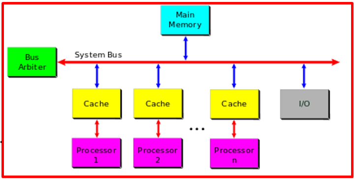   
</p>

***Thuật ngữ cơ bản***
+ Đoạn code mà truy cập và thao tác trên shared data được gọi là critical regions (còn gọi là critical sections).
+ Các thao tác được hoàn thành mà không interruption như thể toàn bộ critical region là một lệnh không thể chia cắt được gọi là atomically.
+ Khi nhiều luồng thực thi được thực thi đồng thời trong cùng một critical region, chúng ta gọi đó là race condition.
+ Việc đảm bảo ngăn chặn tình trạng unsafe concurrency và không xảy ra tình trạng race conditions được gọi là synchronization.

***Why do we needed protection***
+ Khi nhiều thread cùng truy cập vào 1 vùng thì có thể dấn đến data không nhất quán. Ví dụ như biến global bên dưới

​<p align="center">
  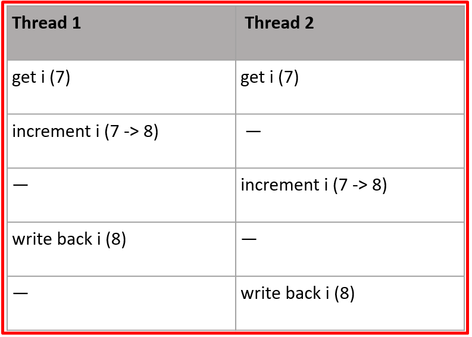   
</p>

+ Chúng ta sẽ bảo vệ share reosurce như sau:

​<p align="center">
  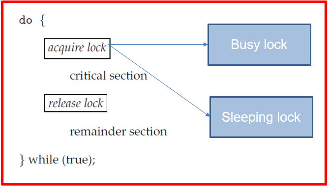   
</p>

***Nguyên nhân gây ra concurrency***
+ Interrupt: Một ngắt có thể xảy ra bất đồng bộ gần như bất kỳ lúc nào, làm gián đoạn mã đang được thực thi.
+ Symmetrical multiprocessing: Hai hoặc nhiều bộ xử lý có thể thực thi mã kernel cùng một lúc.
+ Softirqs and tasklets: Kernel có thể khởi tạo hoặc lập lịch cho một softirq hoặc tasklet gần như bất kỳ lúc nào, làm gián đoạn mã đang được thực thi.
+ Kernel preemption: Vì kernel có tính chiếm quyền ưu tiên, một tác vụ trong kernel có thể chiếm quyền ưu tiên của tác vụ khác.
+ Sleeping and synchronization with user-space: Một tác vụ trong kernel có thể ngủ nên khi gọi scheduler, dẫn đến việc chạy một tiến trình mới.

***Xử lý với semaphore***
+ Ví dụ về semaphore
​<p align="center">
  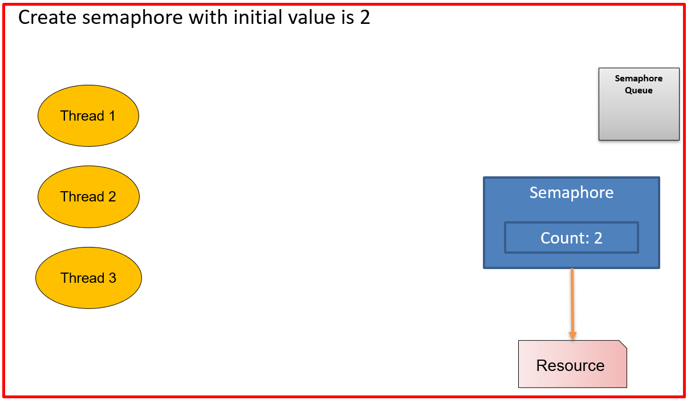   
</p>
​<p align="center">
  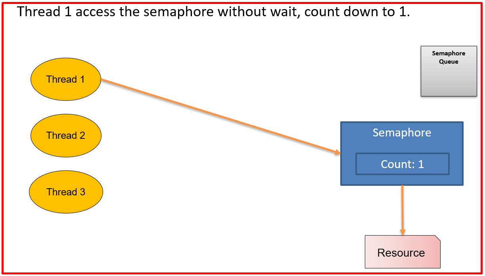   
</p>
​<p align="center">
  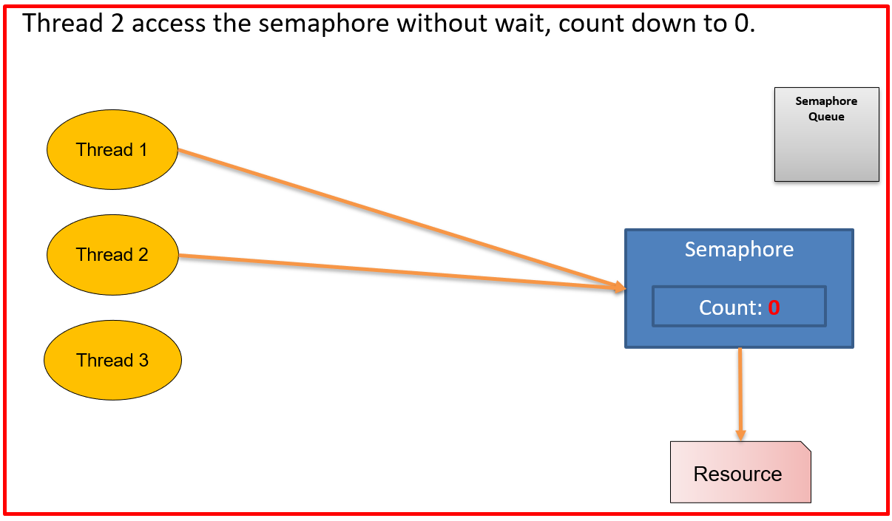   
</p>
​<p align="center">
  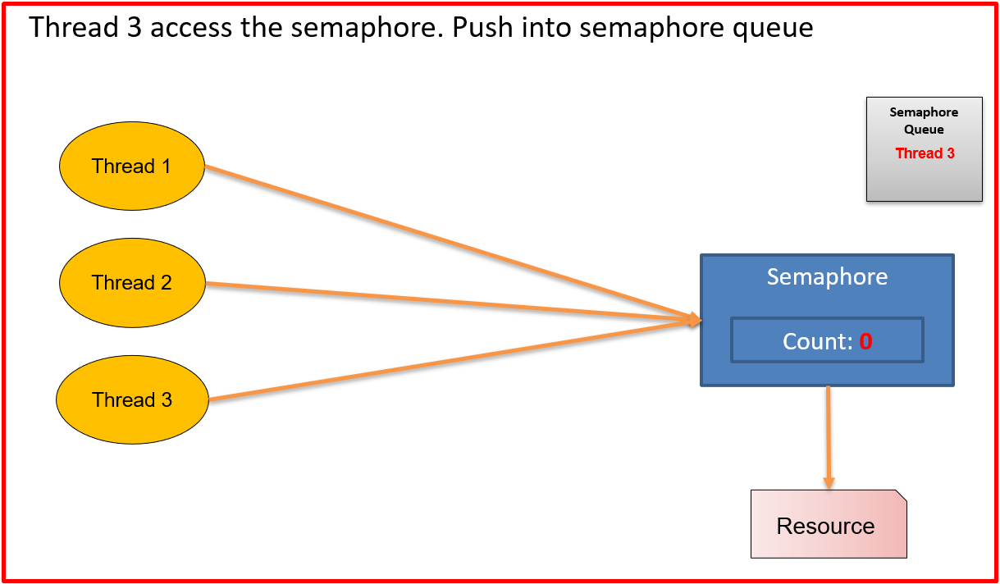   
</p>
​<p align="center">
  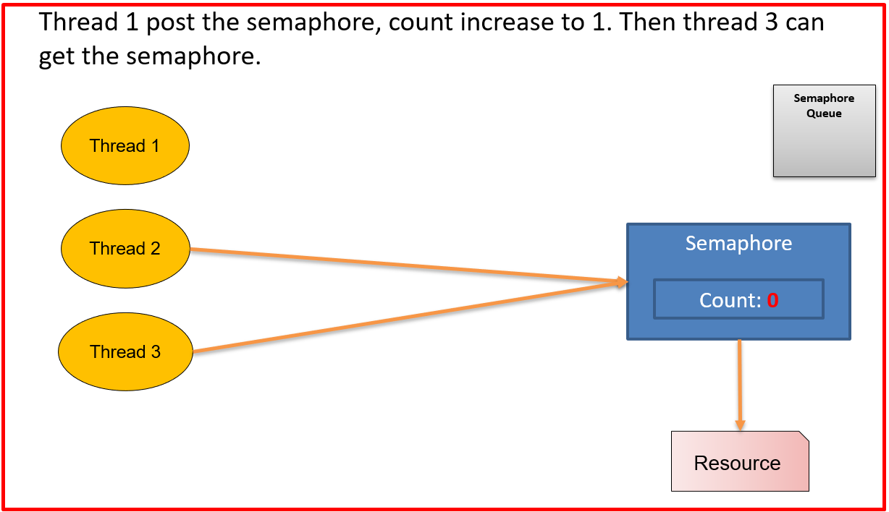   
</p>
​<p align="center">
  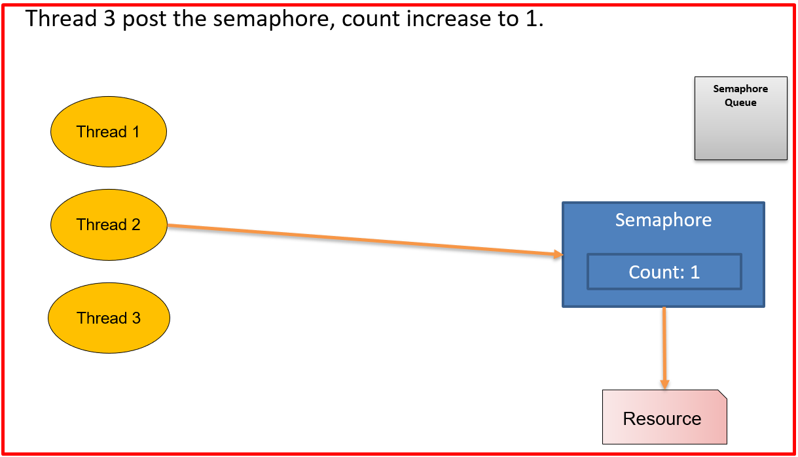   
</p>

+ Kiến thức về samephore các bạn có thể xem ở bài trước nhé. Dưới đây là thêm kiến thức về semaphore kernel
+ Semaphore trong Linux là "sleeping lock".
+ Khi một tác vụ cố gắng lấy một semaphore không khả dụng, semaphore sẽ đặt tác vụ đó vào hàng đợi chờ và đưa tác vụ vào trạng thái ngủ. Sau đó, bộ xử lý có thể thực thi code khác.
+ Khi semaphore khả dụng, một trong các tác vụ trong hàng đợi chờ sẽ được đánh thức để nó có thể lấy semaphore.
+ Semaphore đặt tác vụ vào hàng đợi và ngủ khi chờ đợi, do đó nó phù hợp với các khóa được giữ trong thời gian dài.
+ Semaphore không tối ưu cho các khóa trong thời gian ngắn do phải ngủ, duy trì hàng đợi chờ, thức dậy...

***Semaphore API***
​<p align="center">
  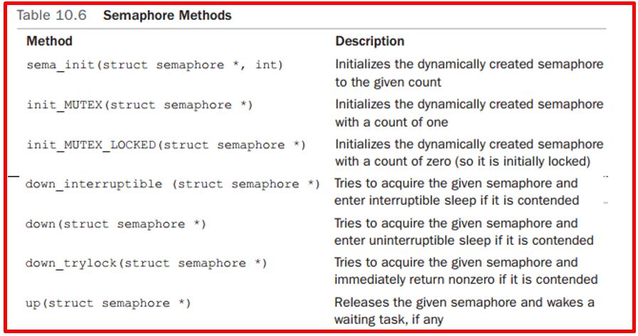   
</p>


### 2️⃣ Thực hành semaphore
+ Thực hành 1: Use 3 process access to module at the same time
+ File kernel_semaphore.c
```c
#include <linux/kernel.h>
#include <linux/module.h>
#include <linux/init.h>

#include <linux/types.h>        /* dev_t type*/
#include <linux/kdev_t.h>       /* macro for major, minor ...*/
#include <linux/fs.h>           /* struct file, struct file_operations, struct inode..*/
#include <linux/cdev.h>         /* struct cdev*/
#include <linux/slab.h>         /* kmalloc()*/
#include <linux/device.h>       /* device_create(), device_destroy()*/

#include <linux/uaccess.h>      /* copy_user()*/
#include <linux/sched.h>        /* task_pid_nr*/
#include <linux/delay.h>        /* delay API*/

#include <linux/semaphore.h>    /* semaphore API*/

MODULE_LICENSE("GPL");
MODULE_AUTHOR("HuLaTho");
MODULE_DESCRIPTION("Demo using semaphore for kernel module");

#define DEV_NAME "char_dev_sem"
#define DEV_PER 0666  /* permission for /dev/char_dev_sem */
static dev_t dev_num; /* Global variable store device number*/

/* Default device number, can change when instmod*/
static int device_major  = 0; /* Default is dynamic alloc*/
static int device_minor  = 0;
static int count_devices = 1;

module_param(device_major, int, 0660);
module_param(device_minor, int, 0660);

/* Create new data type for char dev*/
struct chrdev {
        struct semaphore sem;
        struct cdev cdev;
};

struct chrdev* dev; /* Global pointer to chrdev struct, allocated in module_init */
static struct class *chrdev_class; /* Global variable for the device class*/

/* Function prototype user for file_operations*/
static int my_open(struct inode *inode, struct file *filp);
static int my_release(struct inode *inode, struct file *filp);
static ssize_t my_read(struct file *filp, char __user *buf, size_t count, loff_t *f_pos);
static ssize_t my_write(struct file *filp, const char __user *buf, size_t count, loff_t *f_pos);


static struct file_operations chrdev_ops = {
        .owner    = THIS_MODULE,
        .open     = my_open,
        .release  = my_release,
        .read     = my_read,
        .write    = my_write,
};

static int my_open(struct inode *inode, struct file *filp)
{
        struct chrdev *pdev;
        printk(KERN_INFO DEV_NAME": process ID: %d open()\n", (int)task_pid_nr(current));

        pdev = container_of(inode->i_cdev, struct chrdev, cdev);
        filp->private_data = pdev;  /* Store for other methods*/

        return 0;
}

static int my_release(struct inode *inode, struct file *filp)
{
        printk(KERN_INFO DEV_NAME ": process ID: %d close()\n", (int)task_pid_nr(current));
        return 0;
}

static ssize_t my_read(struct file *filp, char __user *buf, size_t count, loff_t *f_pos)
{
        struct chrdev* pdev = filp->private_data;

        printk(KERN_INFO DEV_NAME ": process ID: %d read() -> start reading\n", (int)task_pid_nr(current));
        printk(KERN_INFO DEV_NAME ": process ID: %d read() -> Waiting for semaphore... \n", (int)task_pid_nr(current));
        
        /* Acquire semaphore*/
        down_interruptible(&pdev->sem);
        
        printk(KERN_INFO DEV_NAME ": process ID: %d read() -> got the semaphore\n", (int)task_pid_nr(current));
        printk(KERN_INFO DEV_NAME ": process ID: %d read() -> reading...\n", (int)task_pid_nr(current));
        
        ssleep(5);

        printk(KERN_INFO DEV_NAME ": process ID: %d read() -> Done\n", (int)task_pid_nr(current));
        up(&pdev->sem);

        return 0;
}

static ssize_t my_write(struct file *filp, const char __user *buf, size_t count,
                        loff_t *f_pos)
{
        struct chrdev* pdev = filp->private_data;

        printk(KERN_INFO DEV_NAME ": process ID: %d write() -> start writing\n", (int)task_pid_nr(current));
        printk(KERN_INFO DEV_NAME ": process ID: %d write() -> Waiting for semaphore...\n", (int)task_pid_nr(current));
        
        /* Acquire semaphore*/
        down_interruptible(&pdev->sem);
        
        printk(KERN_INFO DEV_NAME ": process ID: %d write() -> got the semaphore\n", (int)task_pid_nr(current));
        printk(KERN_INFO DEV_NAME ": process ID: %d write() -> writing...\n", (int)task_pid_nr(current));
        
        ssleep(5);

        printk(KERN_INFO DEV_NAME ": process ID: %d read() -> Done\n", (int)task_pid_nr(current));
        up(&pdev->sem);

        return count;
}

/* Set permission for file */
static char *set_devnode(struct device *dev, umode_t *mode)
{
        if (mode) *mode = DEV_PER;
        return NULL;
}

static int __init chrdev_init(void)
{
        int result = 0;
        /*
         * Get a range of minor numbers to work with, asking for a dynamic
         * major unless directed otherwise at load time.
         */
        if (device_major) {
                dev_num = MKDEV(device_major, device_minor);
                result = register_chrdev_region(dev_num, count_devices, DEV_NAME);
        } else {
                result = alloc_chrdev_region(&dev_num, device_minor, count_devices, DEV_NAME);
                device_major = MAJOR(dev_num);
        }

        if ( result < 0) {
                printk(KERN_WARNING "Can't get major %d \n", device_major);
                goto error_get_major;
        }

        printk(KERN_WARNING DEV_NAME": MAJOR: %d MINOR: %d ", device_major, device_minor);

        /* Create class device */
        chrdev_class = class_create(THIS_MODULE, DEV_NAME);
        if (!chrdev_class) {
                printk(KERN_WARNING DEV_NAME ": Error to create class\n");
                goto error_class_create;
        }

        /* Set devnode for device*/
        chrdev_class->devnode = set_devnode;

        /* Create devide in /dev/ */
        if (device_create(chrdev_class, NULL, dev_num, NULL, DEV_NAME) == NULL) {
                printk(KERN_WARNING DEV_NAME ": Error to create device\n");
                goto error_device_create;
        }

        /* Allocate the devide*/
        dev = kmalloc(count_devices * sizeof(struct chrdev), GFP_KERNEL);
        if (!dev) {
                result = -ENOMEM;
                goto error_kmalloc_dev; /* Make this more graceful */
        }

        /* Initialize device */
        sema_init(&dev->sem, 1);

        /* Register char driver*/
        cdev_init(&dev->cdev, &chrdev_ops);
        dev->cdev.owner = THIS_MODULE;
        dev->cdev.ops = &chrdev_ops;

        /* we already created and initialized our cdev structure now we need to
        add it to the kernel*/
        result = cdev_add(&dev->cdev, dev_num, 1);
        if (result) {
                printk(KERN_WARNING DEV_NAME ": Error to add chrdev\n");
                goto error_cdev_add;
        }

        return 0; /* Success */

error_cdev_add:
        kfree(dev);
error_kmalloc_dev:
        device_destroy(chrdev_class, dev_num);
error_device_create:
        class_destroy(chrdev_class);
error_class_create:
        unregister_chrdev_region(dev_num, count_devices);
error_get_major:
        return result;
}

static void __exit chrdev_exit(void)
{
        kfree(dev);
        cdev_del(&dev->cdev);
        device_destroy(chrdev_class, dev_num);
        class_destroy(chrdev_class);
        unregister_chrdev_region(dev_num, count_devices);
        printk(KERN_INFO DEV_NAME ": unregistered\n");
}

module_init(chrdev_init);
module_exit(chrdev_exit);
```
+ File Makefile
```Makefile
obj-m += kernel_semaphore.o

KERNELDIR ?= /lib/modules/$(shell uname -r)/build

all:
	$(MAKE) -C $(KERNELDIR)  M=$(PWD) modules
clean:
	$(MAKE) -C $(KERNELDIR)  M=$(PWD) clean
```

​<p align="center">
  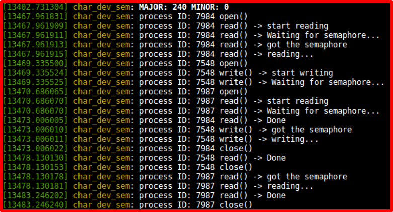   
</p>

***Reader-Writer Semaphore***
+ Có 2 type để access shared resource
	+ Reader: read data, never modify it
	+ Writer: read data and modify it
+ Vậy nên việc sử dụng một khóa duy nhất sẽ quá hạn chế mà ta sẽ dùng Using reader-writer semaphore
	+ Mỗi lần đọc hoặc ghi dữ liệu được chia sẻ phải diễn ra trong một vùng quan trọng
	+ Đảm bảo loại trừ lẫn nhau cho các trình writer
	+ Cho phép nhiều trình đọc thực thi trong vùng quan trọng cùng một lúc

+ Ví dụ Using 2 threads read and 1 thread write to device
+ File kernel_semaphore_rw.c
```c

#include <linux/kernel.h>
#include <linux/module.h>
#include <linux/init.h>

#include <linux/types.h>        /* dev_t type*/
#include <linux/kdev_t.h>       /* macro for major, minor ...*/
#include <linux/fs.h>           /* struct file, struct file_operations, struct inode..*/
#include <linux/cdev.h>         /* struct cdev*/
#include <linux/slab.h>         /* kmalloc()*/
#include <linux/device.h>       /* device_create(), device_destroy()*/

#include <linux/uaccess.h>      /* copy_user()*/
#include <linux/sched.h>        /* task_pid_nr*/
#include <linux/delay.h>        /* delay API*/

#include <linux/semaphore.h>    /* semaphore API*/

MODULE_LICENSE("GPL");
MODULE_AUTHOR("hulatho");
MODULE_DESCRIPTION("Demo using semaphore read write for kernel module");

#define DEV_NAME "char_dev_rwsem"
#define DEV_PER 0666  /* permission for /dev/char_dev_sem */
static dev_t dev_num; /* Global variable store device number*/

/* Default device number, can change when instmod*/
static int device_major  = 0; /* Default is dynamic alloc*/
static int device_minor  = 0;
static int count_devices = 1;

module_param(device_major, int, 0660);
module_param(device_minor, int, 0660);

/* Create new data type for char dev*/
struct chrdev {
        struct rw_semaphore rwsem;
        struct cdev cdev;
};

struct chrdev* dev; /* Global pointer to chrdev struct, allocated in module_init */
static struct class *chrdev_class; /* Global variable for the device class*/

/* Function prototype user for file_operations*/
static int my_open(struct inode *inode, struct file *filp);
static int my_release(struct inode *inode, struct file *filp);
static ssize_t my_read(struct file *filp, char __user *buf, size_t count, loff_t *f_pos);
static ssize_t my_write(struct file *filp, const char __user *buf, size_t count, loff_t *f_pos);


static struct file_operations chrdev_ops = {
        .owner    = THIS_MODULE,
        .open     = my_open,
        .release  = my_release,
        .read     = my_read,
        .write    = my_write,
};

static int my_open(struct inode *inode, struct file *filp)
{
        struct chrdev *pdev;
        printk(KERN_INFO DEV_NAME": process ID: %d open()\n", (int)task_pid_nr(current));

        pdev = container_of(inode->i_cdev, struct chrdev, cdev);
        filp->private_data = pdev;  /* Store for other methods*/

        return 0;
}

static int my_release(struct inode *inode, struct file *filp)
{
        printk(KERN_INFO DEV_NAME ": process ID: %d close()\n", (int)task_pid_nr(current));
        return 0;
}

static ssize_t my_read(struct file *filp, char __user *buf, size_t count, loff_t *f_pos)
{
        struct chrdev* pdev = filp->private_data;

        printk(KERN_INFO DEV_NAME ": process ID: %d read() -> start reading\n", (int)task_pid_nr(current));
        printk(KERN_INFO DEV_NAME ": process ID: %d read() -> Waiting for rw semaphore... \n", (int)task_pid_nr(current));
        
        /* Acquire semaphore*/
        down_read(&pdev->rwsem);
        
        printk(KERN_INFO DEV_NAME ": process ID: %d read() -> got the rw semaphore\n", (int)task_pid_nr(current));
        printk(KERN_INFO DEV_NAME ": process ID: %d read() -> reading...\n", (int)task_pid_nr(current));
        
        ssleep(5);

        printk(KERN_INFO DEV_NAME ": process ID: %d read() -> Done\n", (int)task_pid_nr(current));
        up_read(&pdev->rwsem);

        return 0;
}

static ssize_t my_write(struct file *filp, const char __user *buf, size_t count,
                        loff_t *f_pos)
{
        struct chrdev* pdev = filp->private_data;

        printk(KERN_INFO DEV_NAME ": process ID: %d write() -> start writing\n", (int)task_pid_nr(current));
        printk(KERN_INFO DEV_NAME ": process ID: %d write() -> Waiting for rw semaphore...\n", (int)task_pid_nr(current));
        
        /* Acquire semaphore*/
        down_write(&pdev->rwsem);
        
        printk(KERN_INFO DEV_NAME ": process ID: %d write() -> got the rw semaphore\n", (int)task_pid_nr(current));
        printk(KERN_INFO DEV_NAME ": process ID: %d write() -> writing...\n", (int)task_pid_nr(current));
        
        ssleep(5);

        printk(KERN_INFO DEV_NAME ": process ID: %d read() -> Done\n", (int)task_pid_nr(current));
        up_write(&pdev->rwsem);

        return count;
}

/* Set permission for file */
static char *set_devnode(struct device *dev, umode_t *mode)
{
        if (mode) *mode = DEV_PER;
        return NULL;
}

static int __init chrdev_init(void)
{
        int result = 0;
        /*
         * Get a range of minor numbers to work with, asking for a dynamic
         * major unless directed otherwise at load time.
         */
        if (device_major) {
                dev_num = MKDEV(device_major, device_minor);
                result = register_chrdev_region(dev_num, count_devices, DEV_NAME);
        } else {
                result = alloc_chrdev_region(&dev_num, device_minor, count_devices, DEV_NAME);
                device_major = MAJOR(dev_num);
        }

        if ( result < 0) {
                printk(KERN_WARNING "Can't get major %d \n", device_major);
                goto error_get_major;
        }

        printk(KERN_WARNING DEV_NAME": MAJOR: %d MINOR: %d ", device_major, device_minor);

        /* Create class device */
        chrdev_class = class_create(THIS_MODULE, DEV_NAME);
        if (!chrdev_class) {
                printk(KERN_WARNING DEV_NAME ": Error to create class\n");
                goto error_class_create;
        }

        /* Set devnode for device*/
        chrdev_class->devnode = set_devnode;

        /* Create devide in /dev/ */
        if (device_create(chrdev_class, NULL, dev_num, NULL, DEV_NAME) == NULL) {
                printk(KERN_WARNING DEV_NAME ": Error to create device\n");
                goto error_device_create;
        }

        /* Allocate the devide*/
        dev = kmalloc(count_devices * sizeof(struct chrdev), GFP_KERNEL);
        if (!dev) {
                result = -ENOMEM;
                goto error_kmalloc_dev; /* Make this more graceful */
        }

        /* Initialize device */
        init_rwsem(&dev->rwsem);

        /* Register char driver*/
        cdev_init(&dev->cdev, &chrdev_ops);
        dev->cdev.owner = THIS_MODULE;
        dev->cdev.ops = &chrdev_ops;

        /* we already created and initialized our cdev structure now we need to
        add it to the kernel*/
        result = cdev_add(&dev->cdev, dev_num, 1);
        if (result) {
                printk(KERN_WARNING DEV_NAME ": Error to add chrdev\n");
                goto error_cdev_add;
        }

        return 0; /* Success */

error_cdev_add:
        kfree(dev);
error_kmalloc_dev:
        device_destroy(chrdev_class, dev_num);
error_device_create:
        class_destroy(chrdev_class);
error_class_create:
        unregister_chrdev_region(dev_num, count_devices);
error_get_major:
        return result;
}

static void __exit chrdev_exit(void)
{
        kfree(dev);
        cdev_del(&dev->cdev);
        device_destroy(chrdev_class, dev_num);
        class_destroy(chrdev_class);
        unregister_chrdev_region(dev_num, count_devices);
        printk(KERN_INFO DEV_NAME ": unregistered\n");
}

module_init(chrdev_init);
module_exit(chrdev_exit);
```

+ File Makefile
```Makefile
obj-m += kernel_semaphore_rw.o

KERNELDIR ?= /lib/modules/$(shell uname -r)/build

all:
	$(MAKE) -C $(KERNELDIR)  M=$(PWD) modules
clean:
	$(MAKE) -C $(KERNELDIR)  M=$(PWD) clean
```

​<p align="center">
  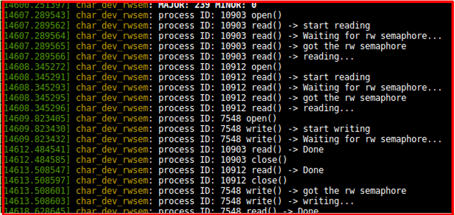   
</p>

### 3️⃣ Mutex
+ Dựa trên khái niệm semaphore, chỉ một luồng thực thi có thể giữ khóa tại một thời điểm.
+ Hoạt động tương tự như semaphore với số lượng là một
+ Giao diện đơn giản hơn, hiệu suất hiệu quả hơn và có thêm các hạn chế khi sử dụng.

***Mutex API***
​<p align="center">
  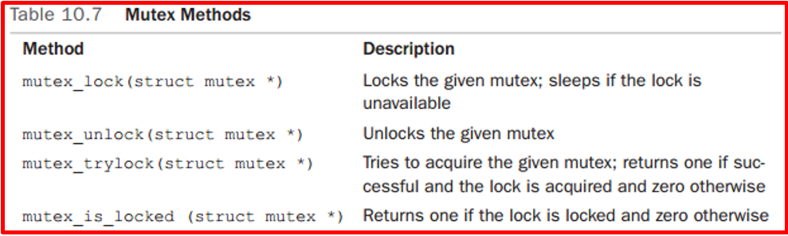   
</p>

### 4️⃣ Spinlock
+ Spinlock là "busy lock", luồng không thể chuyển sang trạng thái ngủ.
+ Chỉ một luồng thực thi có thể giữ khóa tại một thời điểm
+ Phù hợp cho thời gian giữ khóa ngắn.
+ Khi thread này có spinlock mà thread kia cũng gọi thì nó sẽ phải đợi cho tới khi spinlock available
+ Spinlock có thể được sử dụng trong các trình xử lý ngắt, trong khi semaphore không thể được sử dụng vì chúng ở trạng thái ngủ.
+ Spinlock có cơ chế đọc-ghi giống như semaphore.
+ Spinlock là lựa chọn duy nhất có sẵn để khoá phần quan trọng khỏi trình xử lý ngắt
+ "Interrupt context" thì spinlock còn "process context" thì Mutex


​<p align="center">
     
</p>

***Spinlock API***
​<p align="center">
     
</p>

***Khởi tạo***
+ Có 2 cách khởi tạo là static và Dynamic
```c
Static
	Static DEFINE_SPINLOCK(tho_lock)
Dynamic
	Spinlock_t *tho_lock;
	tho_lock= kmalloc();
	Spin_lock_init(&tho_lock)
```

+ Các kernel thread thông thường được sinh ra để phục vụ yêu cầu của các tiến trình trên user space. Nếu chỉ có các kernel thread thông thường muốn sử dụng critical resource, thì ta sẽ đặt hàm spin_lock và spin_unlock vào trước và sau vùng critical section của tất cả các thread đó

​<p align="center">
  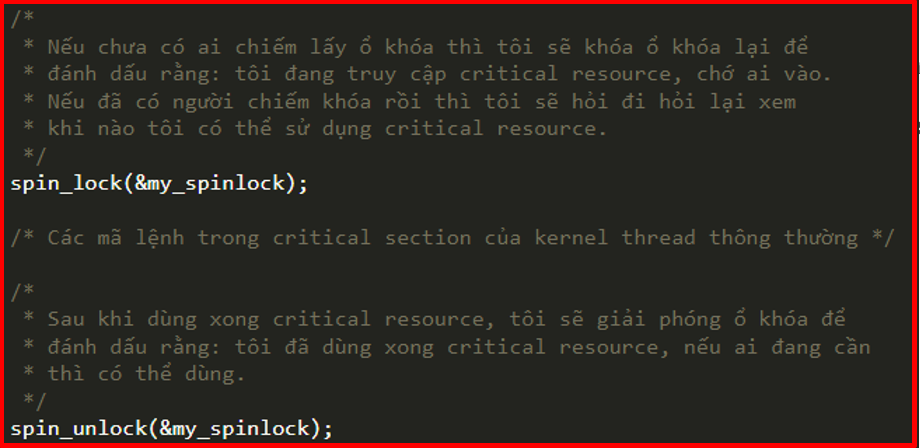   
</p>

+ Cặp spin_lock_irq/spin_unlock_irq: 
	+ Giả sử, các kernel thread thông thường và các ISR đều có nhu cầu sử dụng critical resource. Nếu Interrupt xuất hiện trong lúc kernel thread thông thường đang sử dụng critical resource, thì CPU sẽ tạm dừng kernel thread đó rồi chuyển sang thực thi ISR. Điều này có thể dẫn tới race condition. Để tránh, Interrupt cần phải bị vô hiệu hóa trước khi CPU thực thi critical section của kernel thread thông thường.
	+ Trước khi thực thi critical section của các kernel thread thông thường, nếu bạn luôn chắc chắn rằng Interrupt đang không bị vô hiệu hóa, thì ta có thể đặt hàm spin_lock_irq và spin_unlock_irq vào trước và sau vùng critical section của các thread đó

​<p align="center">
  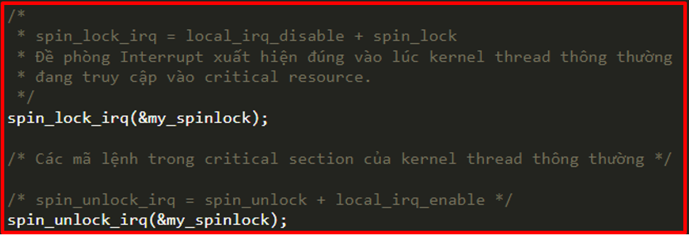   
</p>

***Thực hành Spinlock***
+ Bài số 1
+ File kernel_spinlock.c
```c
#include <linux/kernel.h>
#include <linux/module.h>
#include <linux/init.h>

#include <linux/types.h>        /* dev_t type*/
#include <linux/kdev_t.h>       /* macro for major, minor ...*/
#include <linux/fs.h>           /* struct file, struct file_operations, struct inode..*/
#include <linux/cdev.h>         /* struct cdev*/
#include <linux/slab.h>         /* kmalloc()*/
#include <linux/device.h>       /* device_create(), device_destroy()*/

#include <linux/uaccess.h>      /* copy_user()*/
#include <linux/sched.h>        /* task_pid_nr*/
#include <linux/delay.h>        /* delay API*/

#include <linux/spinlock_types.h>

MODULE_LICENSE("GPL");
MODULE_AUTHOR("hulatho");
MODULE_DESCRIPTION("Demo using spinlock for kernel module");

#define DEV_NAME "char_dev_spinlock"
#define DEV_PER 0666  /* permission for /dev/char_dev_sem */
static dev_t dev_num; /* Global variable store device number*/

/* Default device number, can change when instmod*/
static int device_major  = 0; /* Default is dynamic alloc*/
static int device_minor  = 0;
static int count_devices = 1;

static unsigned long j0, j1, delay;

module_param(device_major, int, 0660);
module_param(device_minor, int, 0660);

/* Create new data type for char dev*/
struct chrdev {
        spinlock_t spinlock;
        struct cdev cdev;
};

struct chrdev* dev; /* Global pointer to chrdev struct, allocated in module_init */
static struct class *chrdev_class; /* Global variable for the device class*/

/* Function prototype user for file_operations*/
static int my_open(struct inode *inode, struct file *filp);
static int my_release(struct inode *inode, struct file *filp);
static ssize_t my_read(struct file *filp, char __user *buf, size_t count, loff_t *f_pos);
static ssize_t my_write(struct file *filp, const char __user *buf, size_t count, loff_t *f_pos);


static struct file_operations chrdev_ops = {
        .owner    = THIS_MODULE,
        .open     = my_open,
        .release  = my_release,
        .read     = my_read,
        .write    = my_write,
};

static int my_open(struct inode *inode, struct file *filp)
{
        struct chrdev *pdev;
        printk(KERN_INFO DEV_NAME": process ID: %d open()\n", (int)task_pid_nr(current));

        pdev = container_of(inode->i_cdev, struct chrdev, cdev);
        filp->private_data = pdev;  /* Store for other methods*/

        return 0;
}

static int my_release(struct inode *inode, struct file *filp)
{
        printk(KERN_INFO DEV_NAME ": process ID: %d close()\n", (int)task_pid_nr(current));
        return 0;
}

static ssize_t my_read(struct file *filp, char __user *buf, size_t count, loff_t *f_pos)
{
        struct chrdev* pdev = filp->private_data;

        printk(KERN_INFO DEV_NAME ": process ID: %d read() -> start reading\n", (int)task_pid_nr(current));
        printk(KERN_INFO DEV_NAME ": process ID: %d read() -> Waiting for spinlock... \n", (int)task_pid_nr(current));

        /* Acquire spinlock*/
        spin_lock(&pdev->spinlock);

        printk(KERN_INFO DEV_NAME ": process ID: %d read() -> got the spinlock\n", (int)task_pid_nr(current));
        printk(KERN_INFO DEV_NAME ": process ID: %d read() -> reading...\n", (int)task_pid_nr(current));

        // ssleep(5);
        delay = msecs_to_jiffies(2000); /* 2 sec delay */
        j0 = jiffies;
        j1 = j0 + delay;

        while (time_before(jiffies, j1));

        printk(KERN_INFO DEV_NAME ": process ID: %d read() -> Done\n", (int)task_pid_nr(current));
        spin_unlock(&pdev->spinlock);

        return 0;
}

static ssize_t my_write(struct file *filp, const char __user *buf, size_t count,
                        loff_t *f_pos)
{
        struct chrdev* pdev = filp->private_data;

        printk(KERN_INFO DEV_NAME ": process ID: %d write() -> start writing\n", (int)task_pid_nr(current));
        printk(KERN_INFO DEV_NAME ": process ID: %d write() -> Waiting for spinlock...\n", (int)task_pid_nr(current));

        /* Acquire spinlock*/
        spin_lock(&pdev->spinlock);

        printk(KERN_INFO DEV_NAME ": process ID: %d write() -> got the spinlock\n", (int)task_pid_nr(current));
        printk(KERN_INFO DEV_NAME ": process ID: %d write() -> writing...\n", (int)task_pid_nr(current));

        delay = msecs_to_jiffies(2000); /* 2 sec delay */
        j0 = jiffies;
        j1 = j0 + delay;

        while (time_before(jiffies, j1));

        printk(KERN_INFO DEV_NAME ": process ID: %d read() -> Done\n", (int)task_pid_nr(current));
        spin_unlock(&pdev->spinlock);

        return count;
}

/* Set permission for file */
static char *set_devnode(struct device *dev, umode_t *mode)
{
        if (mode) *mode = DEV_PER;
        return NULL;
}

static int __init chrdev_init(void)
{
        int result = 0;
        /*
         * Get a range of minor numbers to work with, asking for a dynamic
         * major unless directed otherwise at load time.
         */
        if (device_major) {
                dev_num = MKDEV(device_major, device_minor);
                result = register_chrdev_region(dev_num, count_devices, DEV_NAME);
        } else {
                result = alloc_chrdev_region(&dev_num, device_minor, count_devices, DEV_NAME);
                device_major = MAJOR(dev_num);
        }

        if ( result < 0) {
                printk(KERN_WARNING "Can't get major %d \n", device_major);
                goto error_get_major;
        }

        printk(KERN_WARNING DEV_NAME": MAJOR: %d MINOR: %d ", device_major, device_minor);

        /* Create class device */
        chrdev_class = class_create(THIS_MODULE, DEV_NAME);
        if (!chrdev_class) {
                printk(KERN_WARNING DEV_NAME ": Error to create class\n");
                goto error_class_create;
        }

        /* Set devnode for device*/
        chrdev_class->devnode = set_devnode;

        /* Create devide in /dev/ */
        if (device_create(chrdev_class, NULL, dev_num, NULL, DEV_NAME) == NULL) {
                printk(KERN_WARNING DEV_NAME ": Error to create device\n");
                goto error_device_create;
        }

        /* Allocate the devide*/
        dev = kmalloc(count_devices * sizeof(struct chrdev), GFP_KERNEL);
        if (!dev) {
                result = -ENOMEM;
                goto error_kmalloc_dev; /* Make this more graceful */
        }

        /* Initialize device */
        spin_lock_init(&dev->spinlock);

        /* Register char driver*/
        cdev_init(&dev->cdev, &chrdev_ops);
        dev->cdev.owner = THIS_MODULE;
        dev->cdev.ops = &chrdev_ops;

        /* we already created and initialized our cdev structure now we need to
        add it to the kernel*/
        result = cdev_add(&dev->cdev, dev_num, 1);
        if (result) {
                printk(KERN_WARNING DEV_NAME ": Error to add chrdev\n");
                goto error_cdev_add;
        }

        return 0; /* Success */

error_cdev_add:
        kfree(dev);
error_kmalloc_dev:
        device_destroy(chrdev_class, dev_num);
error_device_create:
        class_destroy(chrdev_class);
error_class_create:
        unregister_chrdev_region(dev_num, count_devices);
error_get_major:
        return result;
}

static void __exit chrdev_exit(void)
{
        kfree(dev);
        cdev_del(&dev->cdev);
        device_destroy(chrdev_class, dev_num);
        class_destroy(chrdev_class);
        unregister_chrdev_region(dev_num, count_devices);
        printk(KERN_INFO DEV_NAME ": unregistered\n");
}

module_init(chrdev_init);
module_exit(chrdev_exit);
```

+ File Makefile
```Makefile
obj-m += kernel_spinlock.o

KERNELDIR ?= /lib/modules/$(shell uname -r)/build

all:
	$(MAKE) -C $(KERNELDIR)  M=$(PWD) modules
clean:
	$(MAKE) -C $(KERNELDIR)  M=$(PWD) clean
```

+ Bài số 2, Spinlock or Mutex
+ File spinlock_mutex.c
```c
#include<linux/module.h>
#include<linux/fs.h>
#include<linux/cdev.h>
#include<linux/device.h>
#include<linux/kdev_t.h>
#include<linux/uaccess.h>
#include<linux/spinlock.h>
#include<linux/mutex.h>

#undef pr_fmt
#define pr_fmt(fmt) "%s : " fmt,__func__

#define DEV_MEM_SIZE 512

/* pseudo device's memory */
char device_buffer[DEV_MEM_SIZE];

/* This holds the device number */
dev_t device_number;

/* Cdev variable */
struct cdev pcd_cdev;

/*holds the class pointer */
struct class *class_pcd;

struct device *device_pcd;


//static DEFINE_SPINLOCK(pcd_spin_lock);
static DEFINE_MUTEX(pcd_mutex_lock);

loff_t pcd_lseek(struct file *filp, loff_t offset, int whence)
{
	loff_t temp;

	pr_info("lseek requested \n");
	pr_info("Current value of the file position = %lld\n",filp->f_pos);

	switch(whence)
	{
		case SEEK_SET:
			if((offset > DEV_MEM_SIZE) || (offset < 0))
				return -EINVAL;
			filp->f_pos = offset;
			break;
		case SEEK_CUR:
			temp = filp->f_pos + offset;
			if((temp > DEV_MEM_SIZE) || (temp < 0))
				return -EINVAL;
			filp->f_pos = temp;
			break;
		case SEEK_END:
			temp = DEV_MEM_SIZE + offset;
			if((temp > DEV_MEM_SIZE) || (temp < 0))
				return -EINVAL;
			filp->f_pos = temp;
			break;
		default:
			return -EINVAL;
	}
	
	pr_info("New value of the file position = %lld\n",filp->f_pos);

	return filp->f_pos;

}

ssize_t pcd_read(struct file *filp, char __user *buff, size_t count, loff_t *f_pos)
{
	//spin_lock(&pcd_spin_lock);//Not suitable since critical section sleeps
	//mutex_lock(&pcd_mutex_lock);
	
	if(mutex_lock_interruptible(&pcd_mutex_lock))
			return -EINTR;
		
	pr_info("Read requested for %zu bytes \n",count);
	pr_info("Current file position = %lld\n",*f_pos);

	
	/* Adjust the 'count' */
	if((*f_pos + count) > DEV_MEM_SIZE)
		count = DEV_MEM_SIZE - *f_pos;

	/*copy to user */
	if(copy_to_user(buff,&device_buffer[*f_pos],count)){
		mutex_unlock(&pcd_mutex_lock);
		return -EFAULT;
	}
	/*update the current file postion */
	*f_pos += count;

	pr_info("Number of bytes successfully read = %zu\n",count);
	pr_info("Updated file position = %lld\n",*f_pos);

	//spin_unlock(&pcd_spin_lock);
	mutex_unlock(&pcd_mutex_lock);
	
	/*Return number of bytes which have been successfully read */
	return count;
}

ssize_t pcd_write(struct file *filp, const char __user *buff, size_t count, loff_t *f_pos)
{
	//spin_lock(&pcd_spin_lock);
	//mutex_lock(&pcd_mutex_lock);
	/* dùng thằng này vì khi ta ctrl C hoặc Ctrl Z thì còn có thể chạy được*/
	if(mutex_lock_interruptible(&pcd_mutex_lock))
			return -EINTR;;

	pr_info("Write requested for %zu bytes\n",count);
	pr_info("Current file position = %lld\n",*f_pos);

	
	/* Adjust the 'count' */
	if((*f_pos + count) > DEV_MEM_SIZE)
		count = DEV_MEM_SIZE - *f_pos;

	if(!count){
		pr_err("No space left on the device \n");
		return -ENOMEM;
	}

	/*copy from user */
	/* không dùng spinlock vì hàm copy_from_user có thể có sleep*/
	if(copy_from_user(&device_buffer[*f_pos],buff,count)){
		mutex_unlock(&pcd_mutex_lock);
		return -EFAULT;
	}
	/*update the current file postion */
	*f_pos += count;

	pr_info("Number of bytes successfully written = %zu\n",count);
	pr_info("Updated file position = %lld\n",*f_pos);
	
	//spin_unlock(&pcd_spin_lock);
	mutex_unlock(&pcd_mutex_lock);

	/*Return number of bytes which have been successfully written */
	return count;
}

int pcd_open(struct inode *inode, struct file *filp)
{
	pr_info("open was successful\n");

	return 0;
}

int pcd_release(struct inode *inode, struct file *flip)
{
	pr_info("release was successful\n");

	return 0;
}


/* file operations of the driver */
struct file_operations pcd_fops=
{
	.open = pcd_open,
	.release = pcd_release,
	.read = pcd_read,
	.write = pcd_write,
	.owner = THIS_MODULE
};


static int __init pcd_driver_init(void)
{
	int ret;

	/*1. Dynamically allocate a device number */
	ret = alloc_chrdev_region(&device_number,0,1,"pcd_devices");
	if(ret < 0){
		pr_err("Alloc chrdev failed\n");
		goto out;
	}

	pr_info("Device number <major>:<minor> = %d:%d\n",MAJOR(device_number),MINOR(device_number));

	/*2. Initialize the cdev structure with fops*/
	cdev_init(&pcd_cdev,&pcd_fops);

	/* 3. Register a device (cdev structure) with VFS */
	pcd_cdev.owner = THIS_MODULE;
	ret = cdev_add(&pcd_cdev,device_number,1);
	if(ret < 0){
		pr_err("Cdev add failed\n");
		goto unreg_chrdev;
	}

	/*4. create device class under /sys/class/ */
	class_pcd = class_create(THIS_MODULE,"pcd_class");
	if(IS_ERR(class_pcd)){
		pr_err("Class creation failed\n");
		ret = PTR_ERR(class_pcd);
		goto cdev_del;
	}

	/*5.  populate the sysfs with device information */
	device_pcd = device_create(class_pcd,NULL,device_number,NULL,"pcd");
	if(IS_ERR(device_pcd)){
		pr_err("Device create failed\n");
		ret = PTR_ERR(device_pcd);
		goto class_del;
	}

	pr_info("Module init was successful\n");

	return 0;

class_del:
	class_destroy(class_pcd);
cdev_del:
	cdev_del(&pcd_cdev);	
unreg_chrdev:
	unregister_chrdev_region(device_number,1);
out:
	pr_info("Module insertion failed\n");
	return ret;
}


static void __exit pcd_driver_cleanup(void)
{
	device_destroy(class_pcd,device_number);
	class_destroy(class_pcd);
	cdev_del(&pcd_cdev);
	unregister_chrdev_region(device_number,1);
	pr_info("module unloaded\n");
}


module_init(pcd_driver_init);
module_exit(pcd_driver_cleanup);

MODULE_LICENSE("GPL");
MODULE_AUTHOR("tho");
MODULE_DESCRIPTION("character driver");
```

+ File Makefile
```Makefile
EXTRA_CFLAGS = -Wall
obj-m = spinlock_mutex.o

KDIR := /lib/modules/`uname -r`/build
CC := gcc

all:
	make -C $(KDIR) M=`pwd` modules
	$(CC) -o app test_app.c

clean:
	make -C $(KDIR) M=`pwd` clean
	rm -rf app
```

+ File test_app.c
```c
/******************************************************************************
 *  @brief      Userspace application to test the Device driver
 *
 *  @author     thonv - thonv12@gmail.com
 *******************************************************************************/

#include <stdio.h>
#include <stdlib.h>
#include <string.h>
#include <fcntl.h>
#include <unistd.h>
#include <stdio.h>
#include <stdio_ext.h>

#define CDEV_PATH "/dev/pcd"

int fd, option;
char write_buf[1024];
char read_buf[1024];

void printMenu()
{

    printf("****Please Enter the Option******\n");
    printf("        1. Write                 \n");
    printf("        2. Read                  \n");
    printf("        3. Exit                  \n");
    printf("*********************************\n");
    printf(">>> ");
}

int main()
{
    printf("*********************************\n");
    printf("*******Linux*******\n\n");
    printf("*********************************\n");

    fd = open(CDEV_PATH, O_RDWR);
    if (fd < 0)
    {
        printf("Cannot open device file: %s...\n", CDEV_PATH);
        return -1;
    }

    while (1)
    {
        printMenu();

        scanf("%d", &option);
        switch (option)
        {
        case 1:
            printf("Enter the string to write into driver: ");
            scanf("  %[^\t\n]s", write_buf);
            printf("Data Writing ... ");
            write(fd, write_buf, strlen(write_buf) + 1);
            printf("Done!\n\n\n");
            break;

        case 2:
            printf("Data Reading ... ");
            read(fd, read_buf, 1024);
            printf("Done!\n");
            printf("Data: %s\n\n\n", read_buf);
            break;

        case 3:
            close(fd);
            exit(1);
            break;

        default:
            printf("Enter Valid option = %c\n", option);
            break;
        }
    }

    close(fd);

    return 0;
}
```

## ✔️ Conclusion
Ở bài này chúng ta đã biết về Kernel Synchronization. Tiếp theo chúng ta sẽ tìm hiểu về Sysfs nhé.


## 💯 Exercise
+ Thực hành theo bài viết

## 📺 NOTE
+ N/A

## 📌 Reference

[1] i.MX Linux Reference Manual

[2] https://notes.eddyerburgh.me/operating-systems/linux/kernel-synchronization

[3] Linux Device Drivers 3rd Edition (LDD3)

[4] L. R., Linux Kernel Development (Developer’s Library), 3rd ed. Addison-Wesley Professional, 2010.
