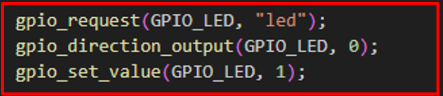
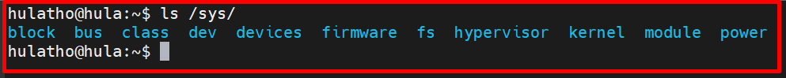
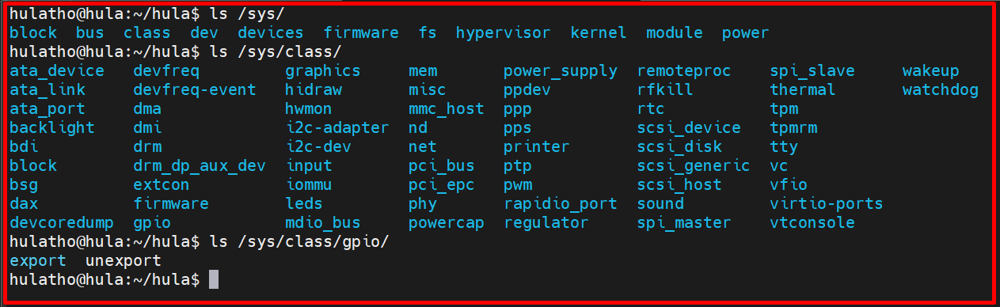
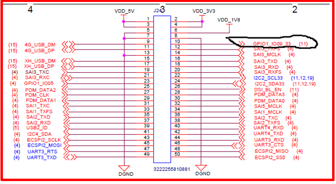
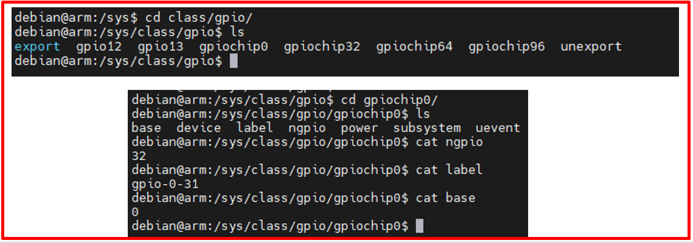

# 💚 SysFs Integer Base 💛

## 👉 Introduction and Summary

### 1️⃣ Introduction

+ Ở bài trước chúng ta đã biết về Kernel Synchronization. Nếu các bạn chưa đọc thì xem link này nha [033_Kernel_Synchronization.md](../033_Kernel_Synchronization/033_Kernel_Synchronization.md). Ở bài này chúng ta sẽ tìm hiểu về SysFs Integer nhé.

### 2️⃣ Summary

Nội dung của bài viết gồm có những phần sau nhé 📢📢📢:
- [I. Introduction and Summary](#👉-introduction-and-summary)

    - [1. Introduction](#1️⃣-introduction)
    - [2. Summary](#2️⃣-summary)
- [II. Contents](#👉-contents)
    - [1. Sysfs](#1️⃣-sysfs)
    - [2. Sử dụng command line để blynk led](#2️⃣-sử-dụng-command-line-để-blynk-led)
    - [3. Code c tạo gpio commandline](#3️⃣-code-c-tạo-gpio-commandline)
    - [4. Sử dụng thư viện gpio](#4️⃣-sử-dụng-thư-viện-gpio)
- [III. Conclusion](#✔️-conclusion)
- [IV. Exercise](#💯-exercise)
- [V. NOTE](#📺-note)
- [VI. Reference](#📌-reference)

## 👉 Contents

### 1️⃣ Sysfs
+ Trong linux thì gpio có rất nhiều chức năng nên linux hỗ trợ cho ta 2 hệ thống con là:
    + Gpio subsystem : Điều khiển chân gpio dễ dàng
    + Pin control subsystem : Giúp chuyển đổi các chế độ hoạt động của 1 chân dễ dàng hơn

+ Trong Gpio subsystem, chúng ta có 2 bộ API là
    + Integer based: Điều khiển chân gpio theo số nguyen dương để điều khiển chân gpio ( Dùng thư viện thôi )
    + Descriptor based: sử dụng 1 device tree để điều khiển.

+ Ở bài này chúng ta sẽ học về SysFs Integer Based còn về Descriptor based sẽ được học ở phần sau nhé.

​<p align="center">
     
</p>

+ The sysfs is a virtual file system in Linux. It means that the files on sysfs do not reside on a disk or any physical media. However, the contents of the file systems are stored in memory

​<p align="center">
     
</p>

+ Chúng ta tạo ra các đối tượng để sử dụng. Gpio sẽ có sẵn trong /sys/class

​<p align="center">
     
</p>

### 2️⃣ Sử dụng command line để blynk led

​<p align="center">
     
</p>

+ Ta đang dùng GPIO1_IO9 để bật tắt led. Mà tính theo số integer thì  GPIO1_IO9 = (1-1)*32 + 9 = 9

***Các bước làm***
```bash
$ cd /sys/class/gpio
$ cd gpiochip0
$ cat ngpio
$ cat lable
$ cat base
$ echo 9 > /sys/class/gpio/export
$ cd gpio9
$ echo "out" > /sys/class/gpio/gpio9/direction
$ reboot
$ echo 1 > /sys/class/gpio/gpio9/value
$ echo 0 > /sys/class/gpio/gpio9/value
$ echo 9 > /sys/class/gpio/unexport
```

​<p align="center">
     
</p>

### 3️⃣ Code c tạo gpio commandline
+ Ta sẽ dùng code c để tạo ra các function thực hiện các commandline ở phần trên
+ Bài gồm 4 file là gpio.c, gpio.h, Makefile, app.c
+ File gpio.c
```c
#include "gpio.h"

int32_t GPIOExport( int32_t pin_ )
{
        char buffer[BUFFER_MAX];
        ssize_t bytes_written;
        int32_t fd;
        fd = open( "/sys/class/gpio/export", O_WRONLY );
        if ( -1 == fd )
        {
                fprintf( stderr, "Failed to open export for writing!\n" );
                return( -1 );
        }

        bytes_written = snprintf( buffer, BUFFER_MAX, "%d", pin_ );
        write( fd, buffer, bytes_written );
        close( fd );
        return( 0 );
}


int32_t GPIODirection( int32_t pin_, int32_t dir_ )
{
        static const char s_directions_str[]  = "in\0out";

        char path[DIRECTION_MAX];
        int32_t fd;
        snprintf( path, DIRECTION_MAX, "/sys/class/gpio/gpio%d/direction", pin_ );
        fd = open( path, O_WRONLY );
        if ( -1 == fd )
        {
                fprintf( stderr, "Failed to open gpio direction for writing!\n" );
                return( -1 );
        }

        if ( -1 == write( fd, &s_directions_str[IN == dir_ ? 0 : 3], IN == dir_ ? 2 : 3 ) )
        {
                fprintf( stderr, "Failed to set direction!\n" );
                return( -1 );
        }

        close( fd );
        return( 0 );
}

int32_t GPIOWrite( int32_t pin_, int32_t value_ )
{
        static const char s_values_str[] = "01";

        char path[VALUE_MAX];
        int32_t fd;
        snprintf( path, VALUE_MAX, "/sys/class/gpio/gpio%d/value", pin_ );
        fd = open( path, O_WRONLY );
        if ( -1 == fd )
        {
                fprintf( stderr, "Failed to open gpio value for writing!\n" );
                return( -1 );
        }

        if ( 1 != write( fd, &s_values_str[LOW == value_ ? 0 : 1], 1 ) )
        {
                fprintf( stderr, "Failed to write value!\n" );
                return( -1 );
        }

        close( fd );
        return( 0 );
}
```

+ File gpio.h
```h

#ifndef GPIO_H 
#define GPIO_H

#include <fcntl.h>
#include <stdio.h>
#include <unistd.h>
#include <stdlib.h>
#include <sys/stat.h>
#include <sys/types.h>
#include <signal.h>
#include <time.h>
#include <errno.h>


#define IN  	( 0 )	///< GPIO direction as input
#define OUT 	( 1 )	///< GPIO direction as output
 
#define LOW 	( 0 )	///< GPIO value Low
#define HIGH 	( 1 )	///< GPIO value High

#define BUFFER_MAX 		( 4 )
#define DIRECTION_MAX 	( 35 )

#define VALUE_MAX 		( 30 )

/*
** @brief GPIO pin
** @param[in] pin : gpio pin number
** @return 0 if success 
**         -1 otherwise
*/
int32_t GPIOExport( int32_t pin_ );

/*
** @brief Set GPIO direction
** @param[in] pin : gpio pin number
** @param[in] dir : pin direction (IN or OUT)
** @return 0 if success 
**         -1 otherwise
*/
int32_t GPIODirection( int32_t pin_, int32_t dir_ );


/* 
** @brief write value on GPIO pin
** @param[in] pin : gpio pin number
** @param[in] value : gpio pin value (HIGH or LOW)
** @return 0 if success 
**         -1 otherwise
*/ 
int32_t GPIOWrite( int32_t pin_, int32_t value_ );

#endif /// End of GPIO_H
```

+ File Makefile
```Makefile
all:
	$(CC) -o app gpio.c app.c -I.

clean:
	rm -rf app
```

+ File app.c
```c
#include <stdio.h>
#include <stdlib.h>
#include "gpio.h"

#define LED  (9)

int main()
{
    printf(" Begin Led HIGH \n");

    GPIOExport(LED);
    GPIODirection(LED, OUT);
    GPIOWrite(LED, HIGH);
    
    return 0;
}
```

### 4️⃣ Sử dụng thư viện gpio
***Ví dụ 1: Led Integer***
+ File led.c
```c
#include <linux/init.h>
#include <linux/module.h>
#include <linux/kernel.h>
#include <linux/gpio.h>

#define DRIVER_AUTHOR "thonv tho@gmail.com"
#define DRIVER_DESC   "LED blinking"

static unsigned int GPIO_LED = 9;

/* Constructor */
static int __init led_init(void)
{
	gpio_request(GPIO_LED, "led");
	gpio_direction_output(GPIO_LED, 0);
	gpio_set_value(GPIO_LED, 1);
	
	pr_info("Hello! Initizliaze successfully!\n");
	return 0;
}

/* Destructor */
static void __exit led_exit(void)
{
	gpio_set_value(GPIO_LED, 0);
	gpio_free(GPIO_LED);

	pr_info("Good bye!!!\n");
}

module_init(led_init);
module_exit(led_exit);

MODULE_LICENSE("GPL");
MODULE_AUTHOR(DRIVER_AUTHOR);
MODULE_DESCRIPTION(DRIVER_DESC); 
MODULE_VERSION("1.0"); 
```

+ File Makefile
```Makefile
KERNELDIR ?= /home/thonv12/yocto_imx/build-xwayland/tmp/work/mys_8mmx-poky-linux/linux-imx/5.4-r0/build

all:
	$(MAKE) -C $(KERNELDIR) M=$(PWD) modules
	
clean:
	$(MAKE) -C $(KERNELDIR) M=$(PWD) clean
```

***Ví dụ 2: Button Integer***

+ File button_interrupt.c
```c
#include <linux/init.h>
#include <linux/module.h>
#include <linux/kernel.h>
#include <linux/gpio.h>
#include <linux/interrupt.h>

#define DRIVER_AUTHOR "thonv thonv@gmail.com"
#define DRIVER_DESC "Control LED with button"

static unsigned int GPIO_BTN = 26;
static unsigned int GPIO_LED = 31;
static int irq;

static irqreturn_t btn_pushed_irq_handler(int irq, void *dev_id)
{
    int state;
    state = gpio_get_value(GPIO_LED);

    if (state == 0)
		gpio_set_value(GPIO_LED, 1);
	else
		gpio_set_value(GPIO_LED, 0);

    pr_info("BTN interrupt - LED state is: %d\n", state);
	return IRQ_HANDLED;
}

static int __init btn_init(void)
{
    int retval;

    gpio_request(GPIO_LED, "led");
    gpio_request(GPIO_BTN, "button");

    gpio_direction_input(GPIO_BTN);
    gpio_direction_output(GPIO_LED, 0);

    irq = gpio_to_irq(GPIO_BTN);
    retval = request_threaded_irq(irq, NULL,
								  btn_pushed_irq_handler,
								  IRQF_TRIGGER_LOW | IRQF_ONESHOT,
								  "BTN-sample", NULL);

    pr_info("Hello! Initizliaze successfully!\n");
	return 0;
}


static void __exit btn_exit(void)
{
    free_irq(irq, NULL);
	gpio_free(GPIO_LED);
	gpio_free(GPIO_BTN);

    pr_info("Good bye my fen !!!\n");
}

module_init(btn_init);
module_exit(btn_exit);

MODULE_LICENSE("GPL");
MODULE_AUTHOR(DRIVER_AUTHOR);
MODULE_DESCRIPTION(DRIVER_DESC);
MODULE_VERSION("1.0");
```

+ File button_polling.c
```c
#include <linux/init.h>
#include <linux/module.h>
#include <linux/kernel.h>
#include <linux/gpio.h>
#include <linux/interrupt.h>

#define DRIVER_AUTHOR "thonv thonv@gmail.com"
#define DRIVER_DESC "Control LED with button"

static unsigned int GPIO_BTN = 83;
static unsigned int GPIO_LED = 9;
static int irq;
int Count = 0,i;

static int __init btn_init(void)
{

    gpio_request(GPIO_LED, "led");
    gpio_request(GPIO_BTN, "button");

    gpio_direction_input(GPIO_BTN);
    gpio_direction_output(GPIO_LED, 0);
    while (1)
    {
        if( gpio_get_value(GPIO_BTN) == 0)
        {
            for(i= 1;i<=10000;i++);
            while(gpio_get_value(GPIO_BTN) == 0);
            for(i= 1;i<=10000;i++);

            gpio_set_value(GPIO_LED, 1);
            Count ++;
            pr_info("%d \n", Count);
        }
    }
    
    pr_info("BTN LED GPIOD successfully! \n");
	return 0;
}


static void __exit btn_exit(void)
{
    free_irq(irq, NULL);
	gpio_free(GPIO_LED);
	gpio_free(GPIO_BTN);

    pr_info("BTN LED GPIOD Good Bey \n");
}

module_init(btn_init);
module_exit(btn_exit);

MODULE_LICENSE("GPL");
MODULE_AUTHOR(DRIVER_AUTHOR);
MODULE_DESCRIPTION(DRIVER_DESC);
MODULE_VERSION("1.0");
```

+ File Makefile
```Makefile
EXTRA_CFLAGS=-Wall

obj-m += button_polling.o
obj-m += button_interrupt.o

KERNELDIR ?= /home/thonv12/yocto_imx/build-xwayland/tmp/work/mys_8mmx-poky-linux/linux-imx/5.4-r0/build

all:
	$(MAKE) -C $(KERNELDIR) M=$(PWD) modules
	
clean:
	$(MAKE) -C $(KERNELDIR) M=$(PWD) clean
```

## ✔️ Conclusion
Ở bài này chúng ta đã biết về SysFs Integer. Tiếp theo chúng ta sẽ tìm hiểu về cách tạo ra 1 SysFs từ đầu nhé.


## 💯 Exercise
+ Thực hành theo bài viết

## 📺 NOTE
+ N/A

## 📌 Reference

[1] i.MX Linux Reference Manual

[2] Linux Device Drivers 3rd Edition (LDD3)

[3] L. R., Linux Kernel Development (Developer’s Library), 3rd ed. Addison-Wesley Professional, 2010.
