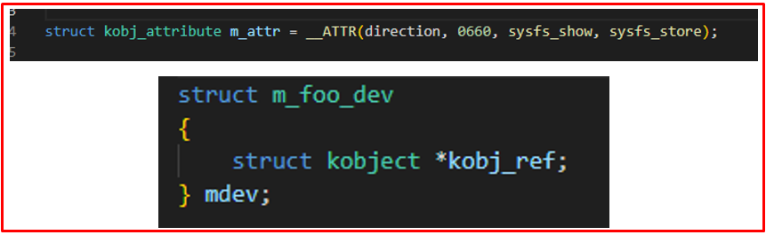

# 💚 Create SysFs💛

## 👉 Introduction and Summary

### 1️⃣ Introduction

+ Ở bài trước chúng ta đã biết về SysFs Integer. Nếu các bạn chưa đọc thì xem link này nha [034_SysFs_Integer.md](../034_SysFs_Integer/034_SysFs_Integer.md). Ở bài này chúng ta sẽ tìm hiểu về cách tạo ra SysFs từ đầu nhé.

### 2️⃣ Summary

Nội dung của bài viết gồm có những phần sau nhé 📢📢📢:
- [I. Introduction and Summary](#👉-introduction-and-summary)

    - [1. Introduction](#1️⃣-introduction)
    - [2. Summary](#2️⃣-summary)
- [II. Contents](#👉-contents)
    - [1. Sysfs](#1️⃣-sysfs)
    - [2. Thực hành](#2️⃣-thực-hành)
- [III. Conclusion](#✔️-conclusion)
- [IV. Exercise](#💯-exercise)
- [V. NOTE](#📺-note)
- [VI. Reference](#📌-reference)

## 👉 Contents

### 1️⃣ Sysfs
+ Các thành viên nằm trong /Sys/ sẽ được đại diện bởi 1 struct gọi là Kobject
    + Hàm sysfs_show là hàm read
    + Hàm sysfs_store là hàm write

​<p align="center">
     
</p>

+ Sau đây mình sẽ dùng ví dụ code để mọi người đọc code theo từng bước. Bài 1 sẽ là tạo sysfs direction, Bài 2 sẽ là tạo sysfs group chứa direction và value. Bài 3 sẽ là bài hoàn chỉnh và kết hợp sáng tắt led sử dụng thư viện gpio.

### 2️⃣ Thực hành
***Tạo sysfs direction***
+ File sysfs_dir.c
```c
#include <linux/module.h>  /* This module defines macro such as module_init/module_exit */
#include <linux/fs.h>      /* This module defines functions such as allocate major/minor number */
#include <linux/device.h>  /* This module defines functions such as class_create/device_create */
#include <linux/cdev.h>    /* This module defines functions such as kmalloc */
#include <linux/slab.h>    /* This module defines functions such as cdev_init/cdev_add */
#include <linux/uaccess.h> /* This module defines functions such as copy_to_user/copy_from_user */

#define DRIVER_AUTHOR "thonv thonv@gmail.com"
#define DRIVER_DESC "GPIO sysfs driver (interger-based)"

struct m_foo_dev
{
    struct kobject *kobj_ref;
} mdev;

/*************** Function Prototypes *******************/
static int __init hello_world_init(void);
static void __exit hello_world_exit(void);

/***************** Sysfs functions *******************/
static ssize_t sysfs_show(struct kobject *kobj, struct kobj_attribute *attr, char *buf);
static ssize_t sysfs_store(struct kobject *kobj, struct kobj_attribute *attr, const char *buf, size_t count);

struct kobj_attribute m_attr = __ATTR(direction, 0660, sysfs_show, sysfs_store);

/* This function will be called when we read the sysfs file */
static ssize_t sysfs_show(struct kobject *kobj, struct kobj_attribute *attr, char *buf)
{
    pr_info("Sysfs read.....\n");

    return 0;
}

/* This function will be called when we write the sysfsfs file */
static ssize_t sysfs_store(struct kobject *kobj, struct kobj_attribute *attr, const char *buf, size_t count)
{
    pr_info("Sysfs write.....\n");

    return count;
}

static int __init hello_world_init(void) /* Constructor */
{

    /* 01. It will create a directory under "/sys" , [firmware_kobj, class_kobj] */
    mdev.kobj_ref = kobject_create_and_add("test_thonv", NULL);

    /* 02. Creating sys entry under "/sys/test_thonv/" */
    if (sysfs_create_file(mdev.kobj_ref, &m_attr.attr))
    {
        pr_err("Cannot create sysfs file......\n");
        goto rm_kobj;
    }

    pr_info("Hello! Initizliaze successfully!\n");
    return 0;

rm_kobj:
    kobject_put(mdev.kobj_ref);
    return -1;
}

static void
    __exit
    hello_world_exit(void) /* Destructor */
{
    sysfs_remove_file(mdev.kobj_ref, &m_attr.attr); /* 02 */
    kobject_put(mdev.kobj_ref);                     /* 01 */

    pr_info("Good by !!!\n");
}

module_init(hello_world_init);
module_exit(hello_world_exit);

MODULE_LICENSE("GPL");
MODULE_AUTHOR(DRIVER_AUTHOR);
MODULE_DESCRIPTION(DRIVER_DESC);
MODULE_VERSION("1.0");
```

+ File Makefile
```Makefile
EXTRA_CFLAGS = -Wall

obj-m = sysfs_dir.o

KERNELDIR ?= /home/thonv12/yocto_imx/build-xwayland/tmp/work/mys_8mmx-poky-linux/linux-imx/5.4-r0/build

all:
	$(MAKE) -C $(KERNELDIR) M=$(PWD) modules
	
clean:
	$(MAKE) -C $(KERNELDIR) M=$(PWD) clean
```

***Tạo sysfs group***
+ File sysfs_group.c
```c
/******************************************************************************
 *  @brief      GPIO sysfs driver (interger-based)
 *
 *  @author     thonv - thonv12@gmail.com
 *******************************************************************************/

#include <linux/module.h>  /* This module defines macro such as module_init/module_exit */
#include <linux/fs.h>      /* This module defines functions such as allocate major/minor number */
#include <linux/device.h>  /* This module defines functions such as class_create/device_create */
#include <linux/cdev.h>    /* This module defines functions such as kmalloc */
#include <linux/slab.h>    /* This module defines functions such as cdev_init/cdev_add */
#include <linux/uaccess.h> /* This module defines functions such as copy_to_user/copy_from_user */

#define DRIVER_AUTHOR "thonv thonv@gmail.com"
#define DRIVER_DESC "GPIO sysfs driver (interger-based)"

struct m_foo_dev
{
    struct kobject *kobj_ref;
} mdev;

static int __init hello_world_init(void);
static void __exit hello_world_exit(void);


static ssize_t value_show(struct kobject *kobj, struct kobj_attribute *attr, char *buf);
static ssize_t value_store(struct kobject *kobj, struct kobj_attribute *attr, const char *buf, size_t count);
static ssize_t direction_show(struct kobject *kobj, struct kobj_attribute *attr, char *buf);
static ssize_t direction_store(struct kobject *kobj, struct kobj_attribute *attr, const char *buf, size_t count);

struct kobj_attribute value = __ATTR(value, 0660, value_show, value_store);
struct kobj_attribute direction = __ATTR(direction, 0660, direction_show, direction_store);


static ssize_t value_show(struct kobject *kobj, struct kobj_attribute *attr, char *buf)
{
    pr_info("value read.....\n");

    return 0;
}


static ssize_t value_store(struct kobject *kobj, struct kobj_attribute *attr, const char *buf, size_t count)
{
    pr_info("value write.....\n");

    return count;
}


static ssize_t direction_show(struct kobject *kobj, struct kobj_attribute *attr, char *buf)
{
    pr_info("direction read.....\n");

    return 0;
}


static ssize_t direction_store(struct kobject *kobj, struct kobj_attribute *attr, const char *buf, size_t count)
{
    pr_info("direction write.....\n");

    return count;
}

/* Initialize group attrs */
static struct attribute *attrs[] = {
    &direction.attr,
    &value.attr,
    NULL,
};

static struct attribute_group attr_group = {
    .attrs = attrs,
};

static int __init hello_world_init(void) 
{

    /* 01. It will create a directory under "/sys" , [firmware_kobj, class_kobj] */
    mdev.kobj_ref = kobject_create_and_add("ThoNV_group", NULL);

    /* 02. Creating group sys entry under "/sys/ThoNV_group/" */
    if (sysfs_create_group(mdev.kobj_ref, &attr_group))
    {
        pr_err("Cannot create group atrributes......\n");
        goto rm_kobj;
    }

    pr_info("Hello Led !\n");
    return 0;

rm_kobj:
    kobject_put(mdev.kobj_ref);
    return -1;
}

static void
    __exit
    hello_world_exit(void) /* Destructor */
{
    sysfs_remove_group(mdev.kobj_ref, &attr_group); /* 02 */
    kobject_put(mdev.kobj_ref);                     /* 01 */

    pr_info("Good bye led \n");
}

module_init(hello_world_init);
module_exit(hello_world_exit);

MODULE_LICENSE("GPL");
MODULE_AUTHOR(DRIVER_AUTHOR);
MODULE_DESCRIPTION(DRIVER_DESC);
MODULE_VERSION("1.0");
```

+ File Makefile
```Makefile
EXTRA_CFLAGS = -Wall

obj-m = sysfs_group.o

KERNELDIR ?= /home/thonv12/yocto_imx/build-xwayland/tmp/work/mys_8mmx-poky-linux/linux-imx/5.4-r0/build

all:
	$(MAKE) -C $(KERNELDIR) M=$(PWD) modules
	
clean:
	$(MAKE) -C $(KERNELDIR) M=$(PWD) clean
```


***Sysfs full blynk led***
+ File sysfs_led.c
```c
/******************************************************************************
 *  @brief      GPIO sysfs driver (interger-based)
 *
 *  @author     thonv - thonv12@gmail.com
 *******************************************************************************/

#include <linux/module.h>  /* This module defines macro such as module_init/module_exit */
#include <linux/fs.h>      /* This module defines functions such as allocate major/minor number */
#include <linux/device.h>  /* This module defines functions such as class_create/device_create */
#include <linux/cdev.h>    /* This module defines functions such as kmalloc */
#include <linux/slab.h>    /* This module defines functions such as cdev_init/cdev_add */
#include <linux/uaccess.h> /* This module defines functions such as copy_to_user/copy_from_user */
#include <linux/string.h>  /* This module defines functions such as strncpy/strcmp */
#include <linux/gpio.h>    /* This module defines functions such as gpio_request/gpio_set_value */

#define DRIVER_AUTHOR "thonv thonv@gmail.com"
#define DRIVER_DESC "GPIO sysfs driver (interger-based)"

static unsigned int GPIO_LED = 9;

static int32_t _value = 0;
static char _direct[8] = {};

struct m_foo_dev
{
    struct kobject *kobj_ref;
} mdev;


static int __init hello_world_init(void);
static void __exit hello_world_exit(void);


static ssize_t value_show(struct kobject *kobj, struct kobj_attribute *attr, char *buf);
static ssize_t value_store(struct kobject *kobj, struct kobj_attribute *attr, const char *buf, size_t count);
static ssize_t direction_show(struct kobject *kobj, struct kobj_attribute *attr, char *buf);
static ssize_t direction_store(struct kobject *kobj, struct kobj_attribute *attr, const char *buf, size_t count);

struct kobj_attribute value = __ATTR(value, 0660, value_show, value_store);
struct kobj_attribute direction = __ATTR(direction, 0660, direction_show, direction_store);

static ssize_t value_show(struct kobject *kobj, struct kobj_attribute *attr, char *buf)
{
    return sprintf(buf, "%d\n", _value);
}

static ssize_t value_store(struct kobject *kobj, struct kobj_attribute *attr, const char *buf, size_t count)
{
    int32_t numb = 0;
    /* Đưa về định dạng */
    sscanf(buf, "%d", &numb);

    switch (numb)
    {
        case 0: 
            /* Off */
            gpio_set_value(GPIO_LED, 0);
            break;
        case 1: 
            /* On */
            gpio_set_value(GPIO_LED, 1);
            break;

        default:
            return count;
    }

    sscanf(buf, "%d", &_value);

    return count;
}

static ssize_t direction_show(struct kobject *kobj, struct kobj_attribute *attr, char *buf)
{
    return sprintf(buf, "%s", _direct);
}

static ssize_t direction_store(struct kobject *kobj, struct kobj_attribute *attr, const char *buf, size_t count)
{
    if ( buf[0] == 'o' )
    {
        pr_info("OUT \n");
        gpio_direction_output(GPIO_LED, 0);
    }
    else /* In */
    {   
        pr_info("IN \n");
        gpio_direction_input(GPIO_LED);
    }

    sscanf(buf, "%s", _direct);

    return count;
}

/* Initialize group attrs */
static struct attribute *attrs[] = {
    &direction.attr,
    &value.attr,
    NULL,
};

static struct attribute_group attr_group = {
    .attrs = attrs,
};

static int
    __init
    hello_world_init(void) /* Constructor */
{

    /* 01. It will create a directory under "/sys" , [firmware_kobj, class_kobj] */
    mdev.kobj_ref = kobject_create_and_add("ThoNV_LED", NULL);

    /* 02. Creating group sys entry under "/sys/ThoNV_LED/" */
    if (sysfs_create_group(mdev.kobj_ref, &attr_group))
    {
        pr_err("Cannot create group atrributes......\n");
        goto rm_kobj;
    }

    /* 03. Request GPIO */
    gpio_request(GPIO_LED, "led");
    pr_info("Initizliaze successfully OK \n");
    return 0;

rm_kobj:
    kobject_put(mdev.kobj_ref);
    return -1;
}

static void __exit hello_world_exit(void) /* Destructor */
{
    gpio_free(GPIO_LED);                            /* 03 */
    sysfs_remove_group(mdev.kobj_ref, &attr_group); /* 02 */
    kobject_put(mdev.kobj_ref);                     /* 01 */

    pr_info("Good bye Led \n");
}

module_init(hello_world_init);
module_exit(hello_world_exit);

MODULE_LICENSE("GPL");
MODULE_AUTHOR(DRIVER_AUTHOR);
MODULE_DESCRIPTION(DRIVER_DESC);
MODULE_VERSION("1.0");
```

+ File Makefile
```Makefile
EXTRA_CFLAGS = -Wall

obj-m = sysfs_led.o

KERNELDIR ?= /home/thonv12/yocto_imx/build-xwayland/tmp/work/mys_8mmx-poky-linux/linux-imx/5.4-r0/build

all:
	$(MAKE) -C $(KERNELDIR) M=$(PWD) modules
	
clean:
	$(MAKE) -C $(KERNELDIR) M=$(PWD) clean
```

## ✔️ Conclusion
Ở bài này chúng ta đã biết tạo ra SysFs. Tiếp theo chúng ta sẽ tìm hiểu về sử dụng ioremap để blynk led trên sysfs nhé.


## 💯 Exercise
+ Thực hành theo bài viết

## 📺 NOTE
+ N/A

## 📌 Reference

[1] i.MX Linux Reference Manual

[2] Linux Device Drivers 3rd Edition (LDD3)

[3] L. R., Linux Kernel Development (Developer’s Library), 3rd ed. Addison-Wesley Professional, 2010.
