# 💚 Device Tree 💛

## 👉 Introduction and Summary

### 1️⃣ Introduction

+ Ở bài trước chúng ta đã sử dụng sysfs vaf ioremap ddeer blynk led. Nếu các bạn chưa đọc thì xem link này nha [036_SysFs_Led_Ioremap.md](../036_SysFs_Led_Ioremap/036_SysFs_Led_Ioremap.md). Ở bài này chúng ta sẽ tìm hiểu về device tree nhé.

### 2️⃣ Summary

Nội dung của bài viết gồm có những phần sau nhé 📢📢📢:
- [I. Introduction and Summary](#👉-introduction-and-summary)

    - [1. Introduction](#1️⃣-introduction)
    - [2. Summary](#2️⃣-summary)
- [II. Contents](#👉-contents)
    - [1. DeviceTree](#1️⃣-devicetree)
    - [2. Thực hành](#2️⃣-thực-hành)
- [III. Conclusion](#✔️-conclusion)
- [IV. Exercise](#💯-exercise)
- [V. NOTE](#📺-note)
- [VI. Reference](#📌-reference)

## 👉 Contents

### 1️⃣ DeviceTree
+ Sau khi build yocto cho board imx8mm xong thì kernel source sẽ nằm ở đường dẫn sau:
```bash
$ cd /home/bv_rzvt/hula/imx-yocto-bsp/build-xwayland/tmp/work-shared/mys-8mmx/kernel-source
```

+ Ta sẽ lấy 3 folder sau: deploy, linux-imx, work-shared. Vị trí 3 folder như sau
```bash
+ deploy: /home/bv_rzvt/hula/imx-yocto-bsp/build-xwayland/tmp/deploy
+ linux-imx: /home/bv_rzvt/hula/imx-yocto-bsp/build-xwayland/tmp/work/mys_8mmx-poky-linux/linux-imx
+ work-shared: /home/bv_rzvt/hula/imx-yocto-bsp/build-xwayland/tmp/work-shared
```

​<p align="center">
  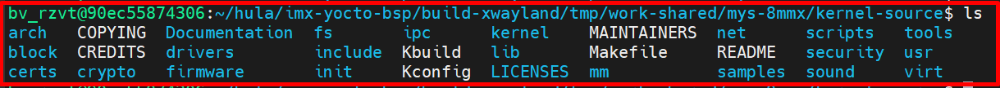   
</p>


+ Device Tree là cái file để mô tả phần cứng, ta có thể xem file đó để biết nó support driver nào, thuộc tính nào, từ đó ta có thể thêm bớt hay tối ưu các driver, thiết bị thông qua device tree này
+ Đường dẫn nằm ở vị trí sau. Trong đây chứa tất cả device tree mà kernel này support
```bash
$ cd /home/bv_rzvt/hula/imx-yocto-bsp/build-xwayland/tmp/work-shared/mys-8mmx/kernel-source/arch/arm64/boot/dts/myir
```
​<p align="center">
  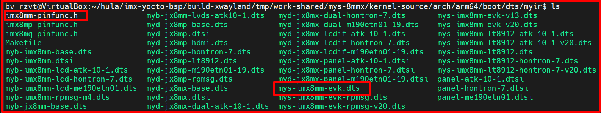   
</p>

+ Thứ tự các file device tree sẽ include nhau sẽ như sau:
```bash
$ cd /home/bv_rzvt/hula/imx-yocto-bsp/build-xwayland/tmp/work-shared/mys-8mmx/kernel-source/arch/arm64/boot/dts/myir
$ mys-imx8mm-evk.dts ---> myb-imx8mm.dtsi ---> imx8mm-pinfunc.h
```

***Phương pháp descriptor-based GPIO interface***
+ Được khuyên dùng vì nó là mới và nó được dùng để kết hợp với device tree​
+ Integer thì đại diện là 1 số nguyen, thì descriptor lại được đại diện bằng 1 struct​
+ Sẽ không có init và deinit mà sẽ có probe và remove

​<p align="center">
  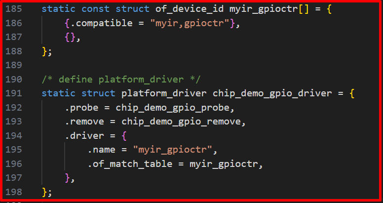   
</p>

***So sánh***
+ Khi ta code mcu kiểu bermetal ta sẽ phải define các base address của từng ngoại vi rồi define từng thanh ghi từng bit. Khi này nếu dùng trong linux thì ta sẽ sử dụng các based address và offset đó rồi dùng hàm __writel để ghi vào thanh ghi, hoặc dùng regist_irq để đăng kí 1 sự kiện ngắt. Tuy nhiên khi thay đổi chip khác thì sẽ rất khó sử dụng lại đoạn code trên.
+ Từ đây họ đưa ra khái niệm device tree, để mô tả phần cứng cho ta luôn
+ Khi này ta có thể thay đổi config được trong device tree, dễ dàng support cho new device

​<p align="center">
  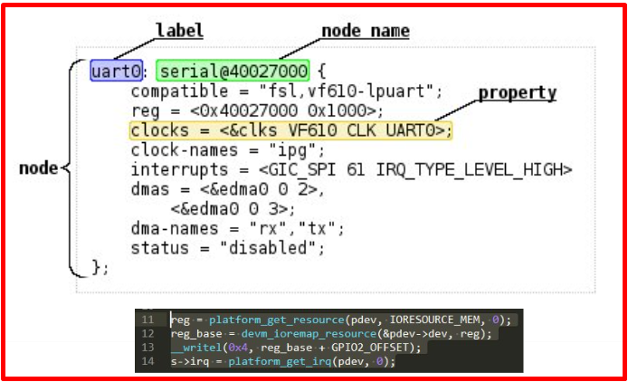   
</p>

***BOOTING FLOW***
​<p align="center">
     
</p>

***Basic Device Tree syntax​***
​<p align="center">
  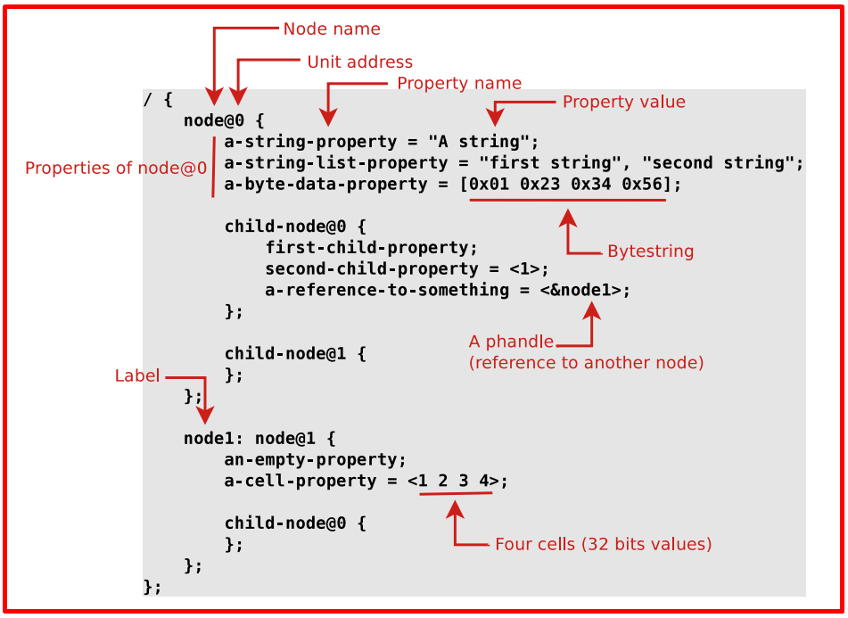   
</p>

​<p align="center">
  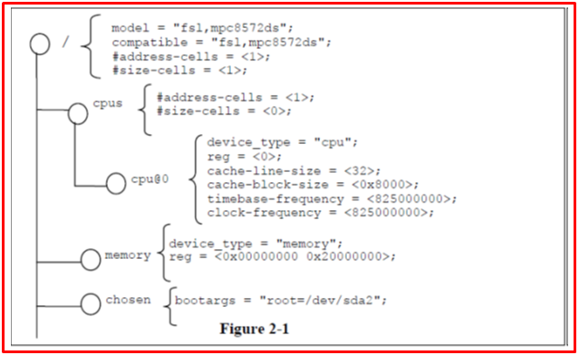   
</p>

+ Các trường cơ bản: Node name, Unit address​, Property name​, Property value​, Value encode​, Reference with other node

***Node name và Unit address​***

+ Mỗi node trong device tree có tên follow theo cú pháp sau *name@unit-address*
  + unit-address phải là duy nhất
  + unit-address phải match với first address được chỉ định trong thuộc tính reg của node.

​<p align="center">
  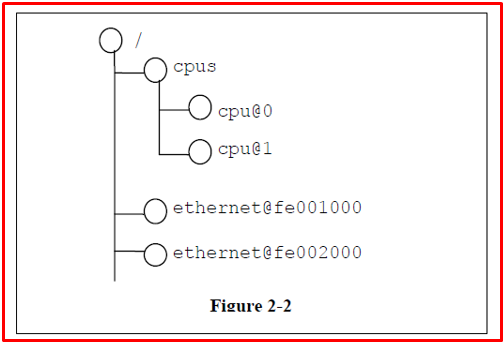   
</p>

+ Các nút có tên cpu được phân biệt bằng giá trị địa chỉ đơn vị là 0 và 1
+ Các nút có tên ethernet được phân biệt bằng giá trị địa chỉ đơn vị là FE001000 và FE002000.

***Property name​ và Property value​***
+ Mỗi nút có các cặp  property/value mô tả các đặc điểm của thiết bị được biểu diễn.
+ A property value là một mảng gồm 0 hoặc nhiều byte chứa thông tin liên quan đến thuộc tính đó.
+ Properties có thể có giá trị empty nếu truyền tải thông tin true-false.
+ Node values có thể là numeric, strings, list of strings, tables, other structured information

```c
<u32>: A 32-bit integer in big-endian format. 
	Example: the 32-bit value 0x11223344 would be represented in memory as: 
		address 	0x11
		address+1	0x22
		address+2	0x33
		address+3	0x44

<u64>: A 64-bit integer in big-endian format
	Example: the 64-bit value 0x1122334455667788 would be represented as two cells as: <0x11223344 0x55667788>. 	

<string>: Strings are printable and NULL-terminated 	
<phandle>: Reference to another node in device tree
<stringlist>: A list of <string> values concatenated together 	
```

***compatible***
+ Property: compatible 
+ Value type: <stringlist> 
+ Description: 
  + Một hoặc nhiều chuỗi xác định mô hình lập trình cụ thể cho thiết bị.
  + Được client program sử dụng để lựa chọn device driver.
  + Danh sách các chuỗi từ cụ thể nhất đến chung chung nhất
  + Định dạng được đề xuất là "manufacturer,model", trong đó manufacturer là chuỗi mô tả tên nhà sản xuất, và model chỉ định số hiệu model.
+ Ví dụ: compatible = "hula,hula15-uart", "ns16550";
  + Trong ví dụ này, trước tiên OS sẽ cố gắng tìm device driver support hula,hula15-uart. Nếu không tìm thấy driver, OS sẽ cố gắng tìm driver mà support device type ns16550 chung hơn

***phandle***
+ Property: phandle 
+ Value type: <u32> 
+ Description: 
  + Chỉ định một numerical identifier cho một node duy nhất trong device tree.
  + Được sử dụng bởi các node khác cần tham chiếu đến node được liên kết với property
+ Example:
```bash
pic@10000000 { 
phandle = <1>; 
interrupt-controller; 
};
```
+ Giá trị phandle là 1 được xác định. Một nút thiết bị khác có thể tham chiếu đến nút pic với giá trị phandle là 1: interrupt-parent = <1>;

***#address-cells and #size-cells***
+ Property: #address-cells, #size-cells 
+ Value type: <u32> 
+ Description: 
  + Có thể được sử dụng trong bất kỳ device node nào có nút con trong hệ thống phân cấp device tree
  + Describe how child device nodes should be addressed. 
  + #address-cells the number of <u32> cells used to encode the address field in a child node’s reg property.
  + #size-cells property defines the number of <u32> cells used to encode the size field in a child node’s reg property.  
  + Các thuộc tính #address-cells và #size-cells không được kế thừa từ các nút tổ tiên trong device tree. Chúng phải được định nghĩa rõ ràng.
  + Nếu thiếu, client program nên giả định giá trị mặc định là 2 cho #address-cells và giá trị 1 cho #size-cells.

***reg***
+ Property: reg
+ Value type: <prop-encoded-array> được thể hiện thành số lượng tùy ý các cặp (address, length).
+ Description: 
  + Mô tả address và length của device’s memory mapped register space trong parent’s address space.
  + Giá trị là một <prop-encoded-array>, bao gồm một số lượng tùy ý các cặp address and length, <address, length>.
  + Phụ thuộc vào các thuộc tính #address-cells và #size-cells trong node mẹ của device.

+ Example: Giả sử một device trong system-on-chip có two blocks of registers, a 32-byte block at offset 0x3000 in the SOC and a 256-byte block at offset 0xFE00. Thuộc tính reg sẽ được thể hiện như sau (giả sử #address-cells và #size-cells có giá trị là 1): reg = <0x3000 0x20 0xFE00 0x100>;

​<p align="center">
  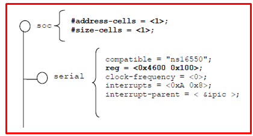   
</p>

+ Thuộc tính #address-cells và #size-cells của nút soc đều được đặt thành 1.
+ Thuộc tính reg của serial device nhất thiết phải tuân theo thông số kỹ thuật này được đặt trong nút cha (soc)-địa chỉ được biểu thị bằng một ô duy nhất (0x4600) và kích thước được biểu thị bằng một ô duy nhất (0x100).

***Ranges***
+ Property: ranges
+ Value type: <empty> or <prop-encoded-array> được mã hóa thành số lượng bộ ba tùy ý của (child-bus-address, parent-bus-address, length)
+ Description:
  + Describes the address mapping of a memory-mapped bus. Provides a means of defining a mapping or translation between the physical address space of the bus (the child address space) and that of the bus node’s parent (the parent address space).
  + Nếu thuộc tính được định nghĩa với giá trị <empty>, nó chỉ định rằng không gian địa chỉ cha và con giống hệt nhau và không cần chuyển đổi địa chỉ.
  + If the property is not present in a bus node, it is assumed that no mapping exists between children of the node and the parent address space.

​<p align="center">
  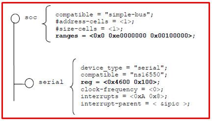   
</p> 

+ Nút soc chỉ định thuộc tính ranges là <0x0 0xe0000000 0x00100000>;
+ Giá trị thuộc tính này chỉ định rằng đối với phạm vi không gian địa chỉ 1024KB, một nút con được định địa chỉ tại 0x0 vật lý sẽ ánh xạ đến địa chỉ cha là 0xe0000000 vật lý.
+ Với ánh xạ này, serial device node có thể được định địa chỉ bằng lệnh tải hoặc lệnh lưu trữ tại địa chỉ 0xe0004600, một offset là 0x4600 (được chỉ định trong reg) cộng với ánh xạ 0xe0000000 được chỉ định trong ranges.

***status***
+ Property: status
+ Value type: <string>
+ Description: -- indicates the operational status of a device

​<p align="center">
  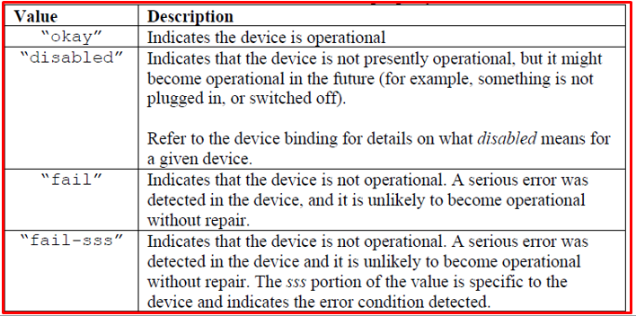   
</p> 

***Device Nodes Requirements***
+ Tất cả các cây thiết bị phải có một nút gốc và các nút sau đây phải có mặt ở gốc của tất cả các cây thiết bị:
  + cpu node
    + Describes CPUs or cores in the system
    + Standard properties include: reg, clock-frequency, reservation-granule-size, etc

  + memory node
    + Required for all DT
    + Describes physical memory layout of the system
    + Only read/write memory should be described using memory node
    
  + Number of other device nodes
    + See Documentation/powerpc/booting-without-of.txt file in Linux source code
    + Various bindings to “IEEE 1275” standard

***Root Node***
+ The full path to the root node is /. 

​<p align="center">
  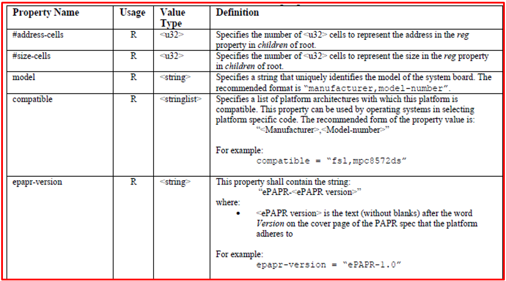   
</p> 

***Alias Node***
+ Client program hoặc bất kỳ device tree property đều có thể sử dụng tên alias property để tham chiếu đến full device path hoặc một phần string value của device path. Khi xem xét một chuỗi là device path, client program sẽ phát hiện và sử dụng alias.

```bash
Example: 
aliases { 
serial0 = "/simple-bus@fe000000/serial@llc500"; 
ethernet0 = "/simple-bus@fe000000/ethernet@31c000"; 
}
```
+ Với alias serial0, client program có thể xem xét node /aliases và xác định alias tham chiếu đến device path /simple-bus@fe000000/serial@llc500.


***Memory node***
​<p align="center">
  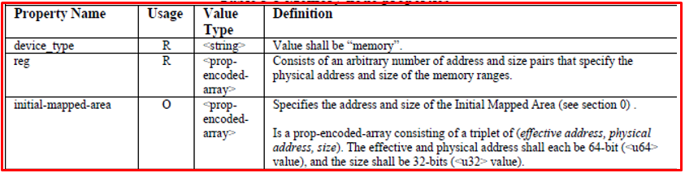   
</p> 

+ Given a 64-bit PowerPC system with the following physical memory layout: 
  + RAM: starting address 0x0, length 0x80000000 (2GB) 
  + RAM: starting address 0x100000000, length 0x100000000 (4GB) 

```c
#address-cells = 2 and a #size-cells = 2: 
memory@0 { 
	device_type = "memory"; 
	reg = <0x000000000 0x00000000 0x00000000 0x80000000 
	           0x000000001 0x00000000 0x00000001 0x00000000>; 
};
```

***CPU Node***
+ container for child cpu nodes which represent the systems CPUs
+ node name is cpus

​<p align="center">
  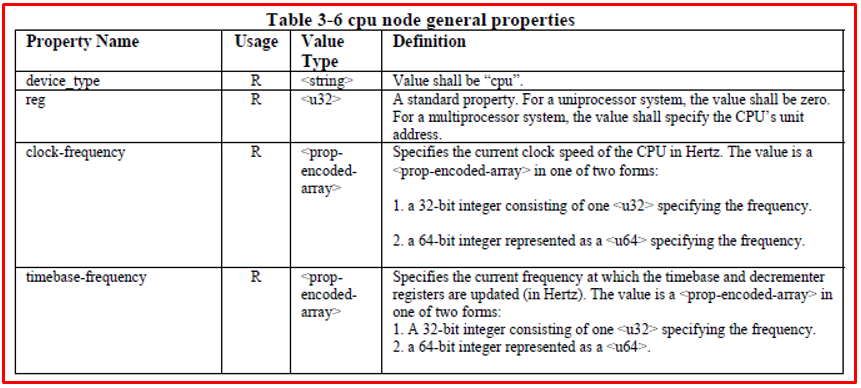   
</p> 
​<p align="center">
  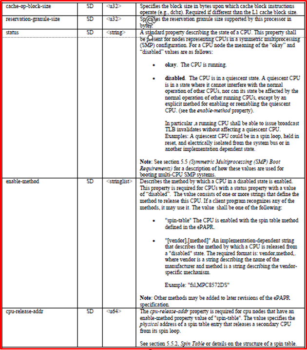   
</p> 

***Interrupt Mapping***
+ Tín hiệu ngắt có thể bắt nguồn từ và kết thúc tại bất kỳ device nào trong máy.
+ Tín hiệu ngắt được biểu thị dưới dạng liên kết giữa các node độc lập với cây.
+ Four properties are used to describe interrupt connections:
  + interrupt-controller - Một empty property khai báo một node là device receives interrupt signals .
  + #interrupt-cells - Đây là thuộc tính của interrupt controller node. Thuộc tính này cho biết có bao nhiêu ô trong bộ chỉ định ngắt cho interrupt controller này (Tương tự như #address-cells và #size-cells).
  + interrupt-parent - Thuộc tính của một device node chứa phandle đến interrupt controller mà nó được gắn vào. Các nút không có thuộc tính interrupt-parent cũng có thể kế thừa thuộc tính này từ nút cha của chúng.
  + interrupts - Thuộc tính của một device node chứa danh sách các bộ chỉ định ngắt, mỗi bộ cho một  interrupt output signal trên thiết bị.

​<p align="center">
  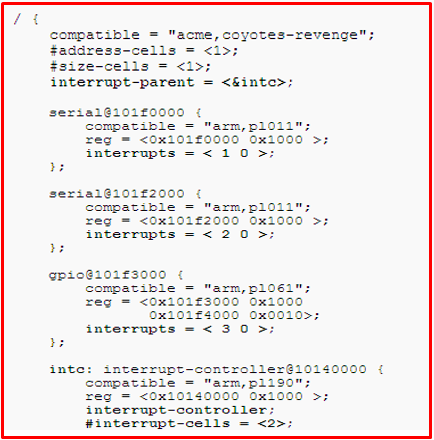   
</p> 

+ The machine có một bộ điều khiển ngắt duy nhất, interrupt-controller@10140000.
+ The label 'intc:' đã được thêm vào interrupt controller node, và nhãn này được sử dụng để gán một phandle cho thuộc tính ngắt cha trong root node. Interrupt-parent value trở thành giá trị mặc định cho hệ thống vì tất cả các nút con đều kế thừa nó trừ khi nó được ghi đè rõ ràng.
+ Each device uses an interrupt property to specify a different interrupt input line.
+ #interrupt-cells là 2, vì vậy mỗi bộ chỉ định interrupt có 2 cell. Ví dụ này sử dụng mô hình chung là sử dụng cell đầu tiên để encode the interrupt line number, và cell thứ hai để encode flags such as active high vs. active low, hoặc edge vs. level sensitive. Đối với bất kỳ bộ interrupt controller, hãy tham khảo tài liệu ràng buộc của bộ điều khiển để tìm hiểu cách encode bộ chỉ định.


***Loại file***
+ Chỉ các file .dtsi mới có thể được include, còn .dts file là final
+ Tool để compile nằm trong scripts/dtc
+ Device Tree Blob = .dtb = .dts + .dtsi

​<p align="center">
     
</p>

***Creating a new device tree representation for a device***
+ Some recommended practices include: 

1. Define a compatible string
. 
2. Use the standard properties as applicable for the new device. 

3. Use the conventions if the new device fits into one the ePAPR defined device classes. 

4. If new properties are needed by the binding, the recommended format for property names is: “<company>,<property-name>”, where <company> is an OUI or short unique string that identifies the creator of the binding. 

***Chú ý***
+ Các Device có thể được phát hiện dynamically thường không cần phải được included.
+ Các USB device thường không cần phải được bao gồm vì chúng có thể được liệt kê dễ dàng.
+ PCI host bridges generally have to be included
+ Devices with atypical interrupt routing should be included

***Flattened Device tree***
​<p align="center">
  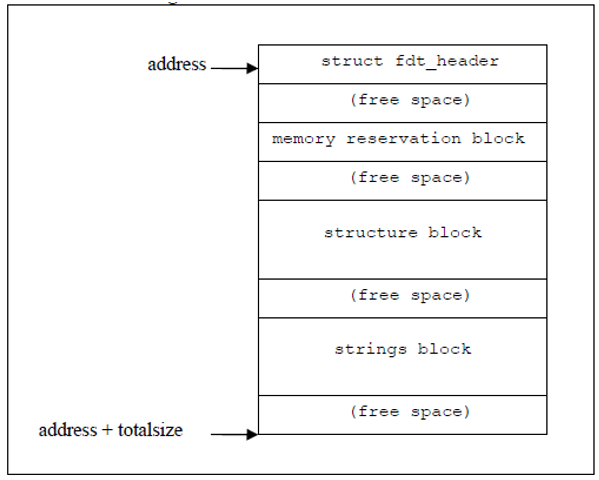   
</p>

+ Flattened DT represents DT in a compact binary format
+ Có thể Relocatable. Có thể di chuyển mà không cần biết các thành phần bên trong (không có con trỏ)
+ Permits easy insert/delete/update operations (limits use of internal offsets)
+ Compact. Use of common string block.
+ Dễ dàng phân tích cú pháp bằng software
+ DT phẳng được tạo thành từ 4 section
  + Header: Cung cấp offsets to other sections và các basic information (boot CPU ID)
  + Memory reserve table (information contained in /memreserve node)
  + String block: Tất cả chuỗi ASCII biểu diễn tên thuộc tính đều nằm trong section này
  + Structure block: Contains structured data representing the DT

***Device Tree Compiler***
+ Việc xây dựng biểu diễn nhị phân của DT bằng tay rất dễ xảy ra lỗi.
+ Device Tree Compiler (DTC) converts various DT Input format:
  + Input format
  + Text format , binary representation 
  + Filesystem (format in the /proc/device-tree filesystem)
  + Output format: binary representation, text format, assembler source
+ Sample device tree files can be found under arch/powerpc/boot/dts
+ DTC package contains library (libfdt) of functions that manipulate binary DT

***Truy cập thông tin DT***
+ of_find_compatible_node(), tìm nút dựa trên mã thông báo trong thuộc tính "compatible"
+ of_get_property(), tìm thuộc tính được chỉ định bởi nút và tên thuộc tính
+ of_find_node_by_type(), tìm kiếm nút được chỉ định bởi thuộc tính "device_type"
+ of_translate_address(), dịch địa chỉ từ DT sang địa chỉ vật lý của CPU
+ At run time the DT information can be accessed through /proc/device-tree FS

***General function in device tree API​***
+ Ví dụ về 1 device tree và code c
​<p align="center">
     
</p>

+ Tất cả function được nằm trong file include/linux/of.h
+ Cây thiết bị được tạo thành từ các nút mô tả các thiết bị vật lý trong một hệ thống.
+ Mỗi nút có các cặp thuộc tính/giá trị mô tả các đặc điểm của thiết bị được biểu diễn.
+ Mỗi nút chỉ có một nút cha, ngoại trừ nút gốc, nút này không có nút cha.

​<p align="center">
  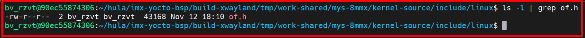   
</p>
​<p align="center">
  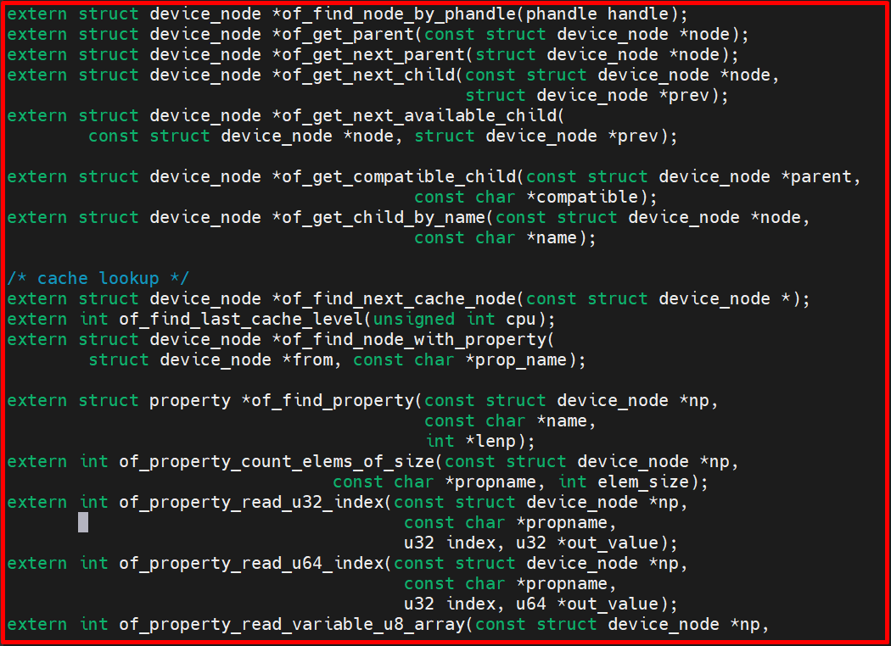   
</p>

+ Các hàm cơ bản hay dùng như:
    + Getting a reference to the clock: clk_get(&pdev->dev, NULL)​
    + Getting the I/O registers resource​: platform_get_resource(pdev, IORESOURCE_MEM, 0)​
    + Check some custom property: 
        + struct device_node *np = pdev->dev.of_node
        + of_get_property(np, "fsl,uart-has-rtscts",NULL)​

### 2️⃣ Thực hành

+ Ta đọc file hướng dẫn của Myir [LINK](https://drive.google.com/file/d/1gqVU-K1JttKSbkjafNdUaeNWy4wKiNsq/view) trang 61

+ Ta nhớ rằng ở dưới kernel sẽ có 2 danh sách: 1 là danh sách các thiết bị ở trong các **file device tree**, 2 là danh sách các **driver được load lên hệ thống**. Danh sách driver được load này thì ta cần đi đăng kí ở struct **platform_driver**
+ Nó sẽ đi lấy compatible trong struct của ta và đi so sánh với tất cả các compatible của các node của các file device tree
+ Nếu compatible giống nhau thì ngay lập tức sẽ load driver đấy lên hệ thống


***pinctrl configuration rules***
+ NXP pinctrl configuration format: **<mux_reg conf_reg input_reg mux_val input_val pad_val>**
    + mux_reg: Multiplex register offset address
    + conf_reg: Configure register offset address
    + input_reg: Input register offset address
    + mux_val: Multiplex register value
    + input_val: Input register value
    + pad_val: Configuration of pin speed, up and down, etc

+ Trong file imx8mm-pinfunc.h ta sẽ thấy MX8MM_IOMUXC_GPIO1_IO09_GPIO1_IO9

​<p align="center">
  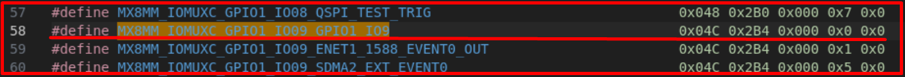   
</p>

***Ví dụ mẫu flatform device với led GOIO5_IO4 trong device tree***
+ Ta vào file mys-imx8mm-evk.dts và kéo xuống dưới cùng rồi thêm node sau vào.
```c
/ {
  #address-cells = <1>;
  #size-cells = <1>;
  gpioctr_device {
    compatible = "myir,gpioctr";
    #pinctrl-names = "default";
    #pinctrl-0 = <&pinctrl_gpio_blue>;
    status = "okay";
    gpioctr-gpios = <&gpio3 16 GPIO_ACTIVE_LOW>;
  };
};
```
+ gpioctr_device là 1 node
+ Ngoặc bên ngoài là 1 root
+ Khi thêm như này thì node sẽ được merge với các file .dtsi khác, cái nào trùng thì ghi đè, còn không trùng thì thêm vào

+ File gpioctr.c
```c
#include <linux/module.h>
#include <linux/of_device.h>
#include <linux/fs.h>
#include <linux/errno.h>
#include <linux/miscdevice.h>
#include <linux/kernel.h>
#include <linux/major.h>
#include <linux/mutex.h>
#include <linux/proc_fs.h>
#include <linux/seq_file.h>
#include <linux/stat.h>
#include <linux/init.h>
#include <linux/device.h>
#include <linux/tty.h>
#include <linux/kmod.h>
#include <linux/gfp.h>
#include <linux/gpio/consumer.h>
#include <linux/platform_device.h>

/* 1.Determine the master device number */
static int major = 0;
static struct class *gpioctr_class;
static struct gpio_desc *gpioctr_gpio;

/* 2. Implement the corresponding open/read/write functions and fill in the file_operations structure*/
static ssize_t gpio_drv_read(struct file *file, char __user *buf, size_t size, loff_t *offs et)
{
    printk("%s %s line %d\n", __FILE__, __FUNCTION__, __LINE__);
    return 0;
}

static ssize_t gpio_drv_write(struct file *file, const char __user *buf, size_t size, loff_ t *offset)
{
    int err;
    char status;

    printk("%s %s line %d\n", __FILE__, __FUNCTION__, __LINE__);
    err = copy_from_user(&status, buf, 1);

    gpiod_set_value(gpioctr_gpio, status);

    return 1;
}

static int gpio_drv_open(struct inode *node, struct file *file)
{
    gpiod_direction_output(gpioctr_gpio, 0);

    return 0;
}

static int gpio_drv_close(struct inode *node, struct file *file)
{
    printk("%s %s line %d\n", __FILE__, __FUNCTION__, __LINE__);
    return 0;
}

/* Define your own file_ operations structure*/
static struct file_operations gpioctr_drv = {
    .owner = THIS_MODULE,
    .open = gpio_drv_open,
    .read = gpio_drv_read,
    .write = gpio_drv_write,
    .release = gpio_drv_close,
};

/* get GPIO resources from platform_ Device and register driver */
static int chip_demo_gpio_probe(struct platform_device *pdev)
{
    /* Defined in device tree: gpioctr-gpios=<...>; */
    gpioctr_gpio = gpiod_get(&pdev->dev, "gpioctr", 0);
    if (IS_ERR(gpioctr_gpio))
    {
        dev_err(&pdev->dev, "Failed to get GPIO for led\n");
        return PTR_ERR(gpioctr_gpio);
    }

    /* Register file_operations */
    major = register_chrdev(0, "myir_gpioctr", &gpioctr_drv); /* /dev/gpioctr */

    gpioctr_class = class_create(THIS_MODULE, "myir_gpioctr_class");
    if (IS_ERR(gpioctr_class))
    {
        printk("%s %s line %d\n", __FILE__, __FUNCTION__, __LINE__);
        unregister_chrdev(major, "gpioctr");
        gpiod_put(gpioctr_gpio);
        return PTR_ERR(gpioctr_class);
    }

    device_create(gpioctr_class, NULL, MKDEV(major, 0), NULL, "myir_gpioctr%d", 0);

    return 0;
}

static int chip_demo_gpio_remove(struct platform_device *pdev)
{
    device_destroy(gpioctr_class, MKDEV(major, 0));
    class_destroy(gpioctr_class);
    unregister_chrdev(major, "myir_gpioctr");
    gpiod_put(gpioctr_gpio);

    return 0;
}

static const struct of_device_id myir_gpioctr[] = {
    {.compatible = "myir,gpioctr"},
    {},
};

/* define platform_driver */
static struct platform_driver chip_demo_gpio_driver = {
    .probe = chip_demo_gpio_probe,
    .remove = chip_demo_gpio_remove,
    .driver = {
        .name = "myir_gpioctr",
        .of_match_table = myir_gpioctr,
    },
};

/* Register platform_ driver in entry function*/
static int __init gpio_init(void)
{
    int err;
    err = platform_driver_register(&chip_demo_gpio_driver);

    return err;
}

/* If there is an entry function, there should be an exit function: when the driver is unregister, the exit function will be called unregister platform_driver */
static void __exit gpio_exit(void)
{
    platform_driver_unregister(&chip_demo_gpio_driver);
}

/* Other improvements: provide equipment information and automatically create device nodes */
module_init(gpio_init);
module_exit(gpio_exit);

MODULE_LICENSE("GPL");
```

+ File Makefile
```Makefile
KERNELDIR = /home/bv_rzvt/hula/imx-yocto-bsp/build-xwayland/tmp/work/mys_8mmx-poky-linux/linux-imx/5.4-r0/build

obj-m += gpioctr.o

all:
    make -C $(KERN_DIR) M=`pwd` modules

clean:
    make -C $(KERN_DIR) M=`pwd` modules clean
    rm -rf modules.order
```

+ File gpiotest.c
```c
// gpiotest.c
#include <sys/types.h>
#include <sys/stat.h>
#include <fcntl.h>
#include <unistd.h>
#include <stdio.h>
#include <string.h>

/*
 * ./gpiotest /dev/myir_gpioctr0 on
 * ./gpiotest /dev/myir_gpioctr0 off
 */
int main(int argc, char **argv)
{
    int fd;
    char status;

    /* 1. Parameter judgment */
    if (argc != 3)
    {
        printf("Usage: %s <dev> <on | off>\n", argv[0]);
        return -1;
    }

    /* 2. Open file*/
    fd = open(argv[1], O_RDWR);
    if (fd == -1)
    {
        printf("can not open file %s\n", argv[1]);
        return -1;
    }

    /* 3. write file */
    if (0 == strcmp(argv[2], "on"))
    {
        status = 1;
        write(fd, &status, 1);
    }
    else
    {
        status = 0;
        write(fd, &status, 1);
    }

    close(fd);

    return 0;
}
```

+ Compile file trên và test
```bash
$ $CC gpiotest.c -o gpiotest
$ gpiotest /dev/myir_gpioctr0 on
$ gpiotest /dev/myir_gpioctr0 off
```

## ✔️ Conclusion
Ở bài này chúng ta đã biết về device tree. Tiếp theo chúng ta sẽ thực hành thêm về Device Tree nhé.


## 💯 Exercise
+ Thực hành theo bài viết

## 📺 NOTE
+ N/A

## 📌 Reference

[1] i.MX Linux Reference Manual

[2] Linux Device Drivers 3rd Edition (LDD3)

[3] https://events.static.linuxfound.org/sites/events/files/slides/petazzoni-device-tree-dummies.pdf

[4] David Gibson, Benjamin Herrenschmidt “Device Trees Everywhere”, OzLabs, 13 February2006, <http://www.ozlabs.com/~dgibson/home/papers/dtc-paper.pdf>
