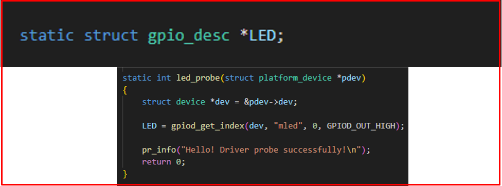
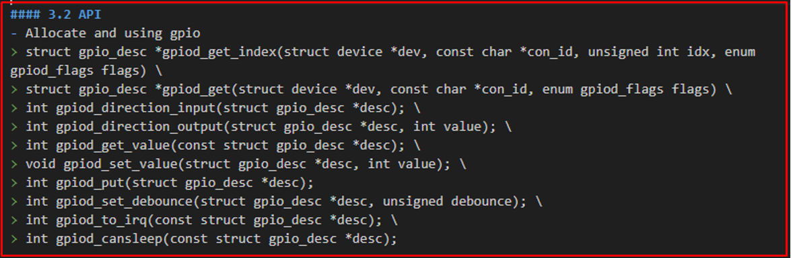
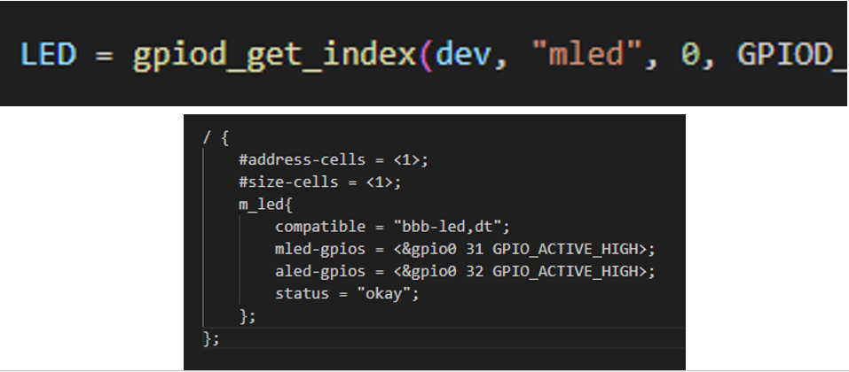

# 💚 Device Tree Practice 💛

## 👉 Introduction and Summary

### 1️⃣ Introduction

+ Ở bài trước chúng ta đã có lý thuyết về device tree. Nếu các bạn chưa đọc thì xem link này nha [037_DeviceTree.md](../037_DeviceTree/037_DeviceTree.md). Ở bài này chúng ta sẽ thực hành thêm về device tree nhé.

### 2️⃣ Summary

Nội dung của bài viết gồm có những phần sau nhé 📢📢📢:
- [I. Introduction and Summary](#👉-introduction-and-summary)

    - [1. Introduction](#1️⃣-introduction)
    - [2. Summary](#2️⃣-summary)
- [II. Contents](#👉-contents)
    - [1. Practice](#1️⃣-practice)
    - [2. Thực hành](#2️⃣-thực-hành)
- [III. Conclusion](#✔️-conclusion)
- [IV. Exercise](#💯-exercise)
- [V. NOTE](#📺-note)
- [VI. Reference](#📌-reference)

## 👉 Contents

### 1️⃣ Practice

***descriptor-based***
+ Descriptor base gpio thì sẽ được đại diện bởi 1 struct là gpio_desc như dưới
+ Còn integer base gpio thì sẽ là 1 số nguyên như bài hôm trước
+ Khi compatible của ta mà giống với 1 compatible trong device tree thì cái node trong device sẽ được driver của ta nhìn thấy luôn. Khi đó ta có thể sử dụng được 1 bộ hàm là gpio d. ( d là descriptor)
+ Thằng param *pdev chính là thằng node đã được tìm thấy

​<p align="center">
     
</p>

***Các API của GPIO D***
+ Thay vì dung GPIO thì có thể dùng bộ thư viện của linux cung cấp như bên trên
+ https://www.kernel.org/doc/Documentation/driver-model/devres.txt


​<p align="center">
     
</p>

+ Ví dụ như trong node của ta có 2 led là mled và aled, thì ta luôn loon có hậu tố phía sau là gpios. Còn khi gọi API thì ta lấy mình tiền tố và bỏ hậu tố đi, trong trường hợp này là lấy mình mled và aled
+ <&gpio0 31 : nghĩa là pin 31 đang thuộc blank 0
+ Chỗ status: phải là okay

​<p align="center">
     
</p>

### 2️⃣ Thực hành
***Bài 1 Led Desciptor Based***
+ Mình sẽ tạo thêm file là hula.dtsi và trong file mys-imx8mm-evk.dts ta include file hula.dtsi vào
+ File led.c
```c
#include <linux/module.h>          /* This module defines functions such as module_init/module_exit */
#include <linux/platform_device.h> /* For platform device */
#include <linux/gpio/consumer.h>   /* For GPIO Descriptor */
#include <linux/of.h>              /* For Device Tree */

#define DRIVER_AUTHOR "thonv thonv@gmail.com"
#define DRIVER_DESC "LED blinking"

static struct gpio_desc *LED;

static const struct of_device_id gpiod_dt_ids[] = {
  {
      .compatible = "imx-led,dt",
  },
  {/* sentinel */}};

static int led_probe(struct platform_device *pdev)
{
    struct device *dev = &pdev->dev;

    LED = gpiod_get_index(dev, "mled", 0, GPIOD_OUT_HIGH);

    gpiod_set_value(LED, 1);

    pr_info("Hello! Driver probe successfully!\n");
    return 0;
}

static int led_remove(struct platform_device *pdev)
{
    gpiod_set_value(LED, 0);
    gpiod_put(LED);

    pr_info("Good bye probe!!!\n");
    return 0;
}

static struct platform_driver my_led_drv = {
    .probe = led_probe,
    .remove = led_remove,
    .driver = {
        .name = "imx-led,dt_sample",
        .of_match_table = of_match_ptr(gpiod_dt_ids),
        .owner = THIS_MODULE,
    },
};

module_platform_driver(my_led_drv);

MODULE_LICENSE("GPL");
MODULE_AUTHOR(DRIVER_AUTHOR);
MODULE_DESCRIPTION(DRIVER_DESC);
MODULE_VERSION("1.0");
```

+ Nội dung file dtsi
```xml
/ {	
	#address-cells = <1>;
	#size-cells = <1>;
	m_led {
		compatible = "imx-led,dt";
		mled-gpios = <&gpio5 4 GPIO_ACTIVE_HIGH>;
		status = "okay"; 
	};
};
```

+ File Makefile
```Makefile
KERNELDIR = /home/bv_rzvt/hula/imx-yocto-bsp/build-xwayland/tmp/work/mys_8mmx-poky-linux/linux-imx/5.4-r0/build

obj-m += led.o

all:
    make -C $(KERN_DIR) M=`pwd` modules

clean:
    make -C $(KERN_DIR) M=`pwd` modules clean
```

***Bài 2 Get infor from device tree***
+ File get_info.c
```c
#include <linux/kernel.h>
#include <linux/module.h>
#include <linux/init.h>
#include <linux/err.h>
#include <linux/platform_device.h>
#include <linux/of.h>

#define DEV_NAME "foo_dtb_demo"

static int foo_probe(struct platform_device *pdev);
static int foo_remove(struct platform_device *pdev);
static int foo_suspend(struct platform_device *pdev, pm_message_t state);
static int foo_resume(struct platform_device *pdev);

static struct of_device_id foo_match_table[] = {
	{
		.compatible = "fsoft,foo_dtb_demo",
	},
	{},
};
MODULE_DEVICE_TABLE(of, foo_match_table);

static struct platform_driver foo_driver = {
	.probe   = foo_probe,
	.remove  = foo_remove,
	.suspend = foo_suspend,
	.resume  = foo_resume,
	.driver = {
		.name = "fsoft,foo_dtb_demo",
		.owner = THIS_MODULE,
		.of_match_table = foo_match_table,
	},
};

static int foo_probe(struct platform_device *pdev)
{
	int ret;
	const char *str;
	int val;
	unsigned int arr_val[3];

	printk(KERN_INFO DEV_NAME ": %s entry\n", __func__);

	/*Get infomation from device tree*/
	if (pdev->dev.of_node) {
		/*Get string property*/
		ret = of_property_read_string(pdev->dev.of_node, "string_property", &str);
		if (ret) {
			printk(KERN_INFO DEV_NAME ":cannot get string_property");
		} else {
			printk(KERN_INFO DEV_NAME ":string_property: %s\n", str);
		}


		/* get string list property*/
		ret = of_property_read_string_index(pdev->dev.of_node, "string_list_property", 1 , &str);
		if (ret) {
			printk(KERN_INFO DEV_NAME ":cannot get property");
		} else {
			printk(KERN_INFO DEV_NAME ":string_list_property (index 1): %s\n", str);
		}


		/*Get byte data*/
		ret = of_property_read_u32(pdev->dev.of_node, "u32_data", &val);
		if (ret) {
			printk(KERN_INFO DEV_NAME ":cannot get u32_data");
		} else {
			printk(KERN_INFO DEV_NAME ":u32_data: %d\n", val);
		}


		/*Get u32_data_array property*/
		ret = of_property_read_u32_array(pdev->dev.of_node, "u32_data_array", &arr_val[0], 3);
		if (ret) {
			printk(KERN_INFO DEV_NAME ":cannot get u32_data_array");
		} else {
			printk(KERN_INFO DEV_NAME ":u32_data_array (index 2): %d\n", arr_val[2]);
		}


		/*Get string property*/
		ret = of_property_read_u32(pdev->dev.of_node, "led_gpio", &val);
		if (ret) {
			printk(KERN_INFO DEV_NAME ":cannot get led_gpio");
		} else {
			printk(KERN_INFO DEV_NAME ":led_gpio: %d\n", val);
		}

		/*Get string property*/
		ret = of_property_read_u32(pdev->dev.of_node, "led_freq", &val);
		if (ret) {
			printk(KERN_INFO DEV_NAME ":cannot get led_freq");
		} else {
			printk(KERN_INFO DEV_NAME ":led_freq: %d\n", val);
		}
	}

	return ret;
}

static int foo_remove(struct platform_device *pdev)
{
	printk(KERN_INFO DEV_NAME ": %s entry\n", __func__);
	return 0;
}

static int foo_suspend(struct platform_device *pdev, pm_message_t state)
{

	return 0;
}

static int foo_resume(struct platform_device *pdev)
{
	return 0;
}


static int __init foo_init(void)
{
	int ret;

	/* register the platform driver */
	ret = platform_driver_register(&foo_driver);
	if (ret < 0) {
		printk(KERN_INFO DEV_NAME ": unable to register platform driver\n");
		goto err_platform_driver_register;
	}

	printk(KERN_INFO DEV_NAME ": driver initalized\n");
	return 0;

err_platform_driver_register:
	return ret;
}

static void __exit foo_exit(void)
{
	platform_driver_unregister(&foo_driver);
	printk(KERN_INFO DEV_NAME ": driver exited\n");
}

module_init(foo_init);
module_exit(foo_exit);

MODULE_LICENSE("GPL");
MODULE_AUTHOR("HuLaTho");
MODULE_DESCRIPTION("dtb binding demo");
```

+ File device tree node
```xml
foo_device {
	compatible = "fsoft,foo_dtb_demo"
	status = "okay"

        string_property = "A string";
        string_list_property = "first string", "second string";
        u32_data = <1234>;
        u32_data_array = <1 2 3 4>; /* each number (cell) is a uint32 */

        led_gpio = <23>;
        led_freq = <100>; /*HZ*/
    };
};
```

+ File Makefile
```Makefile
obj-m += get_info.o

KERNELDIR = /home/bv_rzvt/hula/imx-yocto-bsp/build-xwayland/tmp/work/mys_8mmx-poky-linux/linux-imx/5.4-r0/build

all:
	$(MAKE) -C $(KERNELDIR) M=$(PWD) M=$(PWD) modules
clean:
	$(MAKE) -C $(KERNELDIR) M=$(PWD) M=$(PWD) clean
```

***Bài 3 Led Device Tree readl writel***

+ File hula.dtsi
```xml
led_module: led@44e07000 {
		compatible = "led, module";
		reg = <0x44e07000 0x1000>;
		status = "okay";
};
```

+ File Makefile
```Makefile
obj-m += led_module.o

KERNELDIR = /home/bv_rzvt/hula/imx-yocto-bsp/build-xwayland/tmp/work/mys_8mmx-poky-linux/linux-imx/5.4-r0/build

all:
	$(MAKE) -C $(KERNELDIR) M=$(PWD) M=$(PWD) modules
clean:
	$(MAKE) -C $(KERNELDIR) M=$(PWD) M=$(PWD) clean
```

+ File led_module.c
```c
#include <linux/module.h>
#include <linux/kernel.h>
#include <linux/io.h>
#include <linux/platform_device.h>
#include "led_module.h"

#define AUTHOR  "tho"
#define DESC    "This module is led"

static int led_probe(struct platform_device *pdev)
{
	struct resource *res;
	uint32_t val;
	uint32_t __iomem *base_addr;

	res = platform_get_resource(pdev, IORESOURCE_MEM, 0);
	if(!res)
		return -ENOMEM;
	
	base_addr = ioremap(res->start, res->end - res->start);
	if(!base_addr)
		return -ENOMEM;
	
	val = readl(base_addr + GPIO_OE_OFFSET);
	val &= ~(LED);
	writel(val, base_addr + GPIO_OE_OFFSET);
	
	val = readl(base_addr + GPIO_SETDATAOUT_OFFSET);
	val |= LED;
	writel(val, base_addr + GPIO_SETDATAOUT_OFFSET);

	platform_set_drvdata(pdev, base_addr);
	
	printk(KERN_INFO "tho: %s\t%d\n", __func__, __LINE__);
	return 0;
}

static int led_remove(struct platform_device *pdev)
{
	uint32_t val;
	uint32_t __iomem *base_addr = platform_get_drvdata(pdev);

	val = readl(base_addr + GPIO_CLEARDATAOUT_OFFSET);
	val |= LED;
	writel(val, base_addr + GPIO_CLEARDATAOUT_OFFSET);

	iounmap(base_addr);
	return 0;
}

static struct of_device_id led_of_id[] = {
	{.compatible = "led, module", },
	{ }
};

static struct platform_driver led_driver = {
	.probe = led_probe,
	.remove = led_remove,
	.driver = {
		.name = "led, module",
		.of_match_table = led_of_id,
	},
};

module_platform_driver(led_driver);

MODULE_LICENSE("GPL");
MODULE_AUTHOR(AUTHOR);
MODULE_DESCRIPTION(DESC);
```

+ File led_module.h
```h
#ifndef __LED_MODULE_H__
#define __LED_MODULE_H__

#define GPIO_ADDR_BASE  0x44E07000
#define ADDR_SIZE       (0x44E07FFF - 0x44E07000)
#define GPIO_SETDATAOUT_OFFSET          0x194
#define GPIO_CLEARDATAOUT_OFFSET        0x190
#define GPIO_OE_OFFSET                  0x134
#define LED                             (1 << 31)

#endif
```

***Bài 4 Led Device Tree ioremap***
+ File hula.dtsi
```xml
led_module: led@44e07000 {
		compatible = "led, module";
		reg = <0x44e07000 0x1000>;
		status = "okay";
};
```

+ File Makefile
```Makefile
obj-m += mLED.o

KERNELDIR = /home/bv_rzvt/hula/imx-yocto-bsp/build-xwayland/tmp/work/mys_8mmx-poky-linux/linux-imx/5.4-r0/build

all:
	$(MAKE) -C $(KERNELDIR) M=$(PWD) M=$(PWD) modules
clean:
	$(MAKE) -C $(KERNELDIR) M=$(PWD) M=$(PWD) clean
```

+ FIle mLED.c
```c
#include <linux/module.h>
#include <linux/kernel.h>
#include <linux/io.h>
#include <linux/platform_device.h>
#include <linux/of.h>
#include "mLED.h"

#define DRIVER_AUTHOR "ThoNV12 xxxxxxxx@gmail.com"
#define DRIVER_DESC   "LED blinking"

static int led_probe(struct platform_device *pdev)
{
	struct resource *res;
	uint32_t val;
	uint32_t __iomem *base_addr;

	res = platform_get_resource(pdev, IORESOURCE_MEM, 0);
	if(!res)
		return -ENOMEM;
	
	base_addr = ioremap(res->start, res->end - res->start);
	if(!base_addr)
		return -ENOMEM;
	
	*(base_addr + GPIO_OE_OFFSET / 4) &= ~GPIO_0_31;
	*(base_addr + GPIO_SETDATAOUT_OFFSET / 4) |= GPIO_0_31;

	platform_set_drvdata(pdev, base_addr);
	
	pr_info("ThoNV12: %s\t%d\n", __func__, __LINE__);
	return 0;
}

static int led_remove(struct platform_device *pdev)
{
	uint32_t val;
	uint32_t __iomem *base_addr = platform_get_drvdata(pdev);

	*(base_addr + GPIO_CLEARDATAOUT_OFFSET / 4) |= GPIO_0_31; 

	iounmap(base_addr);
	return 0;
}

static const struct of_device_id led_of_id[] = {
	{ .compatible = "led, module", },
	{ /* sentinel */ }
};

static struct platform_driver led_driver = {
	.probe = led_probe,
	.remove = led_remove,
	.driver = {
		.name = "led, module",
		.of_match_table = led_of_id,
	},
};
module_platform_driver(led_driver);

MODULE_LICENSE("GPL");
MODULE_AUTHOR(DRIVER_AUTHOR);
MODULE_DESCRIPTION(DRIVER_DESC); 
MODULE_VERSION("1.0"); 
```

+ File mLED.h
```h
#ifndef __LED_MODULE_H__
#define __LED_MODULE_H__

#define GPIO_0_ADDR_BASE    0x44E07000
#define GPIO_0_ADDR_SIZE	(0x44E07FFF - 0x44E07000)
#define GPIO_SETDATAOUT_OFFSET		0x194
#define GPIO_CLEARDATAOUT_OFFSET	0x190
#define GPIO_OE_OFFSET			    0x134

#define GPIO_0_31   (1 << 31)

#endif
```

## ✔️ Conclusion
Ở bài này chúng ta đã biết về device tree. Tiếp theo chúng ta sẽ thực hành thêm về Device Tree nhé.


## 💯 Exercise
+ Thực hành theo bài viết

## 📺 NOTE
+ N/A

## 📌 Reference

[1] i.MX Linux Reference Manual

[2] Linux Device Drivers 3rd Edition (LDD3)

[3] https://events.static.linuxfound.org/sites/events/files/slides/petazzoni-device-tree-dummies.pdf

[4] David Gibson, Benjamin Herrenschmidt “Device Trees Everywhere”, OzLabs, 13 February2006, <http://www.ozlabs.com/~dgibson/home/papers/dtc-paper.pdf>
