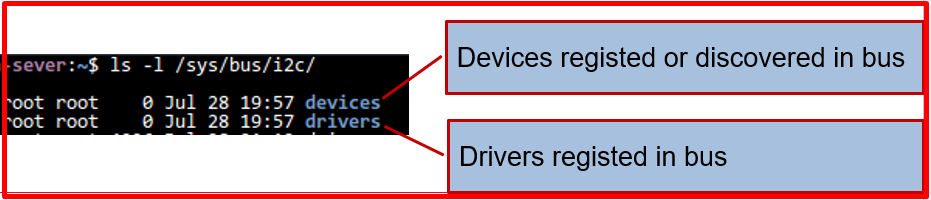
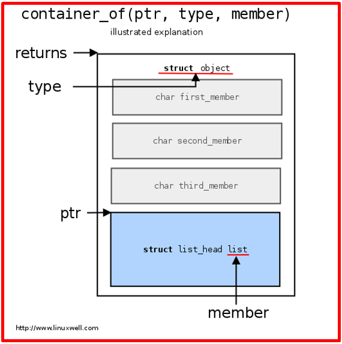

# 💚 Driver Model 💛

## 👉 Introduction and Summary

### 1️⃣ Introduction

+ Ở bài trước chúng ta đã thực hành về device tree. Nếu các bạn chưa đọc thì xem link này nha [038_DeviceTree_Practice.md](../038_DeviceTree_Practice/038_DeviceTree_Practice.md). Ở bài này chúng ta sẽ thực hành thêm về driver model nhé.

### 2️⃣ Summary

Nội dung của bài viết gồm có những phần sau nhé 📢📢📢:
- [I. Introduction and Summary](#👉-introduction-and-summary)

    - [1. Introduction](#1️⃣-introduction)
    - [2. Summary](#2️⃣-summary)
- [II. Contents](#👉-contents)
    - [1. Driver model overview](#1️⃣-driver-model-overview)
    - [2. Thực hành platform](#2️⃣-thực-hành)
- [III. Conclusion](#✔️-conclusion)
- [IV. Exercise](#💯-exercise)
- [V. NOTE](#📺-note)
- [VI. Reference](#📌-reference)

## 👉 Contents

### 1️⃣ Driver model overview
+ Ở bài này chúng ta sẽ tìm hiểu về các khái niệm sau:
    + Driver Model Overview: Bus, Class, Device, Driver
    + Platform Device
    + Platform Driver
    + Device tree
    + Binding Device and Driver

+ Bus là một thiết bị đóng vai trò là điểm kết nối cho các thiết bị khác.
+ Class là một loại thiết bị cụ thể được expected sẽ hoạt động theo những cách nhất định. Các lớp có thể bao gồm disks, partitions, serial ports, etc.
+ Device là một đối tượng vật lý hoặc ảo được kết nối với một bus (có thể là ảo).
+ Driver là một software có thể dò tìm(probe) và được liên kết với các device, và có thể thực hiện một số management functions nhất định.

​<p align="center">
     
</p>

***Mục đích của Driver Model***
+ Driver model sẽ theo dõi:
    + Những thiết bị nào tồn tại trong hệ thống, power state của chúng, chúng được kết nối với bus nào và driver nào chịu trách nhiệm cho chúng.
    + Cấu trúc bus của hệ thống.
    + Các device driver mà hệ thống biết đến, những device nào chúng có thể hỗ trợ và loại bus nào chúng biết.
    + Những loại devices ("classes") nào tồn tại và những thiết bị thực tế nào của mỗi class được kết nối

***Bus***
+ Each bus type in the kernel (PCI, USB, I2C ...or virtual bus) should declare one static object of this type. The structure should be exported to drivers in a header file
​<p align="center">
     
</p>

+ When a bus driver is initialized, it calls bus_register to initializes and insert it into a **global list of bus type.**
+ In sysfs, bus located in /sys/bus. 
​<p align="center">
     
</p>

***Class***
+ Class là góc nhìn cấp cao hơn của một device
+ A device class mô tả một loại thiết bị, chẳng hạn như thiết bị audio hoặc thiết network . Các device class sau đây đã được xác định
```bash
ls –l /sys/class
drwxr-xr-x 2 root root 0 Jul 25 8:46 gpio
drwxr-xr-x 2 root root 0 Jul 25 8:46 graphics
drwxr-xr-x 2 root root 0 Jul 25 8:46 hidraw
drwxr-xr-x 2 root root 0 Jul 25 8:46 hwmon
drwxr-xr-x 2 root root 0 Jul 25 8:46 i2c-dev
drwxr-xr-x 2 root root 0 Jul 25 8:46 input
drwxr-xr-x 2 root root 0 Jul 25 8:46 leds
drwxr-xr-x 2 root root 0 Jul 25 8:46 pci_bus
```
+ Các Device classes không phụ thuộc vào bus mà device nằm trên đó.
+ Các Device trong class thường là liên kết tượng trưng(symlink) đến các device trong thư mục thiết bị của bus.

***Device***
+ Ở cấp độ thấp nhất, mọi thiết bị trong Linux đều được biểu diễn bằng một instance của struct device.

```c
struct device {
    struct device *parent;
    struct kobject kobj;
    char bus_id[BUS_ID_SIZE];
    struct bus_type *bus;
    struct device_driver *driver;
    void *driver_data;
    void (*release)(struct device *dev);
    /* Several fields omitted */
};

/* API to register and unregister device to system */
int device_register(struct device *dev);
void device_unregister(struct device *dev);
```

+ Hầu hết các hệ thống con cần nhiều thông tin hơn về thiết bị, do đó hãy định nghĩa một new struct có embedded struct device bên trong.

```c
struct ldd_device
{ 
    char *name;
    struct ldd_driver *driver;
    struct device dev;
};

#define to_ldd_device(dev) \
container_of(dev, struct ldd_device, dev);
```

+ This design called "Embedded obj pattern"
​<p align="center">
     
</p>

***Driver***
+ Được sử dụng để biểu diễn kernel driver có thể xử lý các devices cụ thể
+ Khi một **device** được registed có thể được xử lý bởi một **driver** cụ thể, **probe function** sẽ khởi tạo **driver** cho **device** cụ thể đó

```c
struct device_driver 
{
    char *name;
    struct bus_type *bus;
    struct kobject kobj;
    struct list_head devices;
    int (*probe)(struct device *dev);
    int (*remove)(struct device *dev);
    void (*shutdown) (struct device *dev);
};
/* API used to register driver to system */
int driver_register(struct device_driver *drv);
void driver_unregister(struct device_driver *drv);
```
+ Can use "embedded object pattern" to create new driver type (eg pci_driver, i2c_driver...)

***Platform Device***
+ Trên các hệ thống nhúng, các thiết bị thường không được kết nối thông qua bus allowing enumeration, hotplugging, and providing unique identifiers for devices. Tuy nhiên, chúng ta vẫn muốn các device là một phần của device model.
+ Giải pháp cho vấn đề này là platform driver/platform device infrastructure. 
+ Các platform device là các device được kết nối trực tiếp với CPU, không có bất kỳ loại bus nào.
+ Các Platform device được đặt tên, sử dụng trong driver binding và list of resources như addresses và IRQs.
```c
struct platform_device 
{
    const char *name;
    u32 id;
    struct device dev;
    u32 num_resources;
    struct resource *resource;
};

Ví dụ:

static struct platform_device foo_device = 
{
    .name = "foo",
    .id   = PLATFORM_DEVID_NONE,        
};
/* register the platform driver */
ret = platform_driver_register(&foo_driver);
if (ret < 0) 
{
    printk(KERN_INFO "foo: unable to register driver\n");
}
```

***Platform Driver***
+ Follow the standard driver model convention, trong đó việc discovery/enumeration được xử lý outside the driver.
+ Driver cung cấp các phương thức probe() và remove().

```c
struct platform_driver 
{
    int (*probe)(struct platform_device *);
    int (*remove)(struct platform_device *);
    void (*shutdown)(struct platform_device *);
    int (*suspend)(struct platform_device *, pm_message_t state);
    int (*suspend_late)(struct platform_device *, pm_message_t state);
    int (*resume_early)(struct platform_device *);
    int (*resume)(struct platform_device *);
    struct device_driver driver;
};
/* API to register driver to system */
int platform_driver_register(struct platform_driver *drv);
```

+ Ví dụ
```c
static struct platform_driver foo_driver = 
{
    .probe   = foo_probe,
    .remove  = foo_remove,
    .suspend = foo_suspend,
    .resume  = foo_resume,
    .driver = {
        .name = "foo",
        .owner = THIS_MODULE,
    },
};

/* register the platform driver */
ret = platform_driver_register(&foo_driver);
if (ret < 0) 
        printk(KERN_INFO "foo: unable to register driver\n");
```

***device tree***
+ Device tree là một cấu trúc dữ liệu dạng cây đơn giản, có thể mô tả non-discoverable hardware configuration cho kernel.
+ Platform devices are created at run-time by the kernel by parsing the device tree nodes
+ Device nodes có thể mang dữ liệu configuration/platform cho các device.
+ Cho phép tách rời kernel code and platform data.

***Get config from device tree in driver***
```c
/ {
    tag_n1: node1@addr {
        compatible = "manufacture,device";
        a-string-property = "A string";
        a-string-list-property = "first string", "second string";
        // hex is implied in byte arrays. no '0x' prefix is required
        a-byte-data-property = [01 23 34 56];
        a-cell-property = <1 2 3 4>; /* each number (cell) is a uint32 */
        tag_ch1 : child-node1@addr {
        compatible = "manufacture,device";
        first-child-property;
        second-child-property = <1>;
        };
        child-node2 {
                    // ...
        };
    };
};
&tag_n1{
    a-string-property = "A string 2";
};


static struct of_device_id my_match_table[] = 
{
    {
        .compatible = "my_driver",
    },
    {0}
};

MODULE_DEVICE_TABLE(of, my_match_table);

static struct platform_driver my_platform_driver = {
    .probe = my_probe,
    .remove = my_remove,
    .driver = {
        .name = "my_driver",
        .owner = THIS_MODULE,
        .of_match_table = my_match_table,
    },
};

#include <linux/of.h>
/* In probe function */
if (pdev->dev.of_node)
{
    ret = of_property_read_string(pdev->dev.of_node, "string_property", &str);
    ret = of_property_read_string_index(pdev->dev.of_node, "string_list_property", 1, &str);
    ret = of_property_read_u32(pdev->dev.of_node, "u32_data", &val);
    ret = of_property_read_u32_array(pdev->dev.of_node, "u32_data_array", &arr_val[0], 3);
}
```


### 2️⃣ Thực hành
+ File foo_driver.c
```c
/*
* foo_driver.c − Demonstration of a simple flatform_driver
* 
*  
* If register success :
* - Created a device "foo" in /sys/bus/platform/devices/
* - Created a driver "foo" in /sys/bus/platform/driver/
* - Device and Driver matching success, the foo_probed will be called.
* 
*/

#include <linux/kernel.h>
#include <linux/module.h>
#include <linux/init.h>
#include <linux/platform_device.h>

#define DEV_NAME "foo"

static int foo_probe(struct platform_device *pdev);
static int foo_remove(struct platform_device *pdev);
static int foo_remove(struct platform_device *pdev);
static int foo_suspend(struct platform_device *pdev, pm_message_t state);
static int foo_resume(struct platform_device *pdev);

static void foo_device_release(struct device *pdev);

static struct platform_device foo_device = {
	.name = DEV_NAME,
	.id   = PLATFORM_DEVID_NONE,
	.dev  = {
		.release = foo_device_release
	}
};

static struct platform_driver foo_driver = {
	.probe   = foo_probe,
	.remove  = foo_remove,
	.suspend = foo_suspend,
	.resume  = foo_resume,
	.driver = {
		.name = DEV_NAME,
		.owner = THIS_MODULE,
	},
};


static int foo_probe(struct platform_device *pdev)
{
	pr_info(DEV_NAME": %s entry\n", __func__);
	return 0;
}

static int foo_remove(struct platform_device *pdev)
{
	pr_info(DEV_NAME": %s entry\n", __func__);
	return 0;
}

static int foo_suspend(struct platform_device *pdev, pm_message_t state)
{

	return 0;
}

static int foo_resume(struct platform_device *pdev)
{
	return 0;
}


static void foo_device_release(struct device *pdev) {
	return ;
}


static int __init foo_init(void)
{
	int ret;

	/* register the platform driver */
	ret = platform_driver_register(&foo_driver);
	if (ret < 0) {
		pr_info(DEV_NAME": unable to register platform driver\n");
		goto err_platform_driver_register;
	}

	/* register the platform device */
	ret = platform_device_register(&foo_device);
	if (ret < 0) {
		pr_info(DEV_NAME": unable to add platform device\n");
		goto err_platform_device_register;
	}

	pr_info(DEV_NAME": driver initalized\n");
	return 0;

err_platform_device_register:
	platform_driver_unregister(&foo_driver);
err_platform_driver_register:
	return ret;
}

static void __exit foo_exit(void)
{
	platform_driver_unregister(&foo_driver);
	platform_device_unregister(&foo_device);
	pr_info(DEV_NAME": driver exited\n");
}

module_init(foo_init);
module_exit(foo_exit);

MODULE_LICENSE("GPL");
MODULE_AUTHOR("HuLaTho");
```

+ File foo_driver_2.c
```c
/*
* foo_driver_2.c − Demonstration of a simple flatform_driver
*                - Dynamic allocate and create device
*  
* If register success :
* - Created 2 device "foo2.0" and "foo2.1" in /sys/bus/platform/devices/
* - Created a driver "foo2" in /sys/bus/platform/driver/
* - Device and Driver matching success, the foo_probed will be called.
*  
*/

#include <linux/kernel.h>
#include <linux/module.h>
#include <linux/init.h>
#include <linux/err.h>
#include <linux/platform_device.h>

#define DEV_NAME "foo2"

static int foo_probe(struct platform_device *pdev);
static int foo_remove(struct platform_device *pdev);
static int foo_suspend(struct platform_device *pdev, pm_message_t state);
static int foo_resume(struct platform_device *pdev);

struct platform_device *foo_dev1, *foo_dev2;

static struct platform_driver foo_driver = {
	.probe   = foo_probe,
	.remove  = foo_remove,
	.suspend = foo_suspend,
	.resume  = foo_resume,
	.driver = {
		.name = DEV_NAME,
		.owner = THIS_MODULE,
	},
};

static int foo_probe(struct platform_device *pdev)
{
	pr_info(DEV_NAME ": %s entry\n", __func__);
	return 0;
}

static int foo_remove(struct platform_device *pdev)
{
	pr_info(DEV_NAME ": %s entry\n", __func__);
	return 0;
}

static int foo_suspend(struct platform_device *pdev, pm_message_t state)
{
	return 0;
}

static int foo_resume(struct platform_device *pdev)
{
	return 0;
}


static int __init foo_init(void)
{
	int ret;

	/* register the platform driver */
	ret = platform_driver_register(&foo_driver);
	if (ret < 0) {
		pr_info( DEV_NAME ": unable to register platform driver\n");
		goto err_platform_driver_register;
	}

	if((foo_dev1 = platform_device_alloc(DEV_NAME, 0)) == NULL) {
		ret = -ENOMEM;
		goto err_alloc_dev1;
	}

	if((foo_dev2 = platform_device_alloc(DEV_NAME, 1)) == NULL) {
		ret = -ENOMEM;
		goto err_alloc_dev2;
	}

	if ((ret = platform_device_add(foo_dev1))){
		pr_info( DEV_NAME ": failed to add device 1\n");
		goto err_add_dev1;
	}
	
	if ((ret = platform_device_add(foo_dev2))){
		pr_info( DEV_NAME ": failed to add device 2\n");
		goto err_add_dev2;
	}

	pr_info( DEV_NAME ": driver initalized\n");
	return 0;

err_add_dev2:
	platform_device_del(foo_dev1);
err_add_dev1:
	platform_device_put(foo_dev2);
err_alloc_dev2:
	platform_device_unregister(foo_dev1);
err_alloc_dev1:
	platform_driver_unregister(&foo_driver);
err_platform_driver_register:

	return ret;
}

static void __exit foo_exit(void)
{
	platform_device_unregister(foo_dev1);
	platform_device_unregister(foo_dev2);
	platform_driver_unregister(&foo_driver);
	pr_info(DEV_NAME ": driver exited\n");
}

module_init(foo_init);
module_exit(foo_exit);

MODULE_LICENSE("GPL");
MODULE_AUTHOR("HuLaTho");
```

+ File foo_driver_3.c
```c
/*
* foo_driver_3.c − Demonstration of a simple flatform_driver
*                - Create attribute in devices folder
*  
* If register success :
* - Created device "foo3" /sys/bus/platform/devices/
* - Created status attribute in "foo3" entry folder
* - Created a driver "foo3" in /sys/bus/platform/driver/
* - Device and Driver matching success, the foo_probed will be called.
* 
*/

#include <linux/kernel.h>
#include <linux/module.h>
#include <linux/init.h>
#include <linux/platform_device.h>

#define DEV_NAME "foo3"

static int foo_probe(struct platform_device *pdev);
static int foo_remove(struct platform_device *pdev);
static int foo_suspend(struct platform_device *pdev, pm_message_t state);
static int foo_resume(struct platform_device *pdev);
static void foo_device_release(struct device *pdev);

static ssize_t foo_status_show(struct device *dev, struct device_attribute *attr,
                                   char *buf);
static ssize_t foo_status_store(struct device *dev, struct device_attribute *attr,
                                    const char *buf, size_t count);

static DEVICE_ATTR(status, S_IRUGO | S_IWUSR, foo_status_show, foo_status_store);

static struct platform_device foo_device = {
	.name = DEV_NAME,
	.id   = PLATFORM_DEVID_NONE,
	.dev  = {
		.release = foo_device_release
	}
};

static struct platform_driver foo_driver = {
	.probe   = foo_probe,
	.remove  = foo_remove,
	.suspend = foo_suspend,
	.resume  = foo_resume,
	.driver = {
		.name  = DEV_NAME,
		.owner = THIS_MODULE,
	},
};

static ssize_t foo_status_show(struct device *dev, struct device_attribute *attr,
                                   char *buf)
{
	return 0;
}

static ssize_t foo_status_store(struct device *dev, struct device_attribute *attr,
                                    const char *buf, size_t count)
{
	return 0;
}


static int foo_probe(struct platform_device *pdev)
{
	int ret;

	pr_info(DEV_NAME": %s entry\n", __func__);

	ret = device_create_file(&pdev->dev, &dev_attr_status);

	return ret;
}

static int foo_remove(struct platform_device *pdev)
{
	pr_info(DEV_NAME": %s entry\n", __func__);

	device_remove_file(&pdev->dev, &dev_attr_status);

	return 0;
}

static int foo_suspend(struct platform_device *pdev, pm_message_t state)
{

	return 0;
}

static int foo_resume(struct platform_device *pdev)
{
	return 0;
}

static void foo_device_release(struct device *pdev)
{
	return ;
}

static int __init foo_init(void)
{
	int ret;

	/* register the platform driver */
	ret = platform_driver_register(&foo_driver);
	if (ret < 0) {
		pr_info(DEV_NAME": unable to register platform driver\n");
		goto err_platform_driver_register;
	}

	/* register the platform device */
	ret = platform_device_register(&foo_device);
	if (ret < 0) {
		pr_info(DEV_NAME": unable to add platform device\n");
		goto err_platform_device_register;
	}

	pr_info(DEV_NAME": driver initalized\n");
	return 0;

err_platform_device_register:
	platform_driver_unregister(&foo_driver);
err_platform_driver_register:
	return ret;
}

static void __exit foo_exit(void)
{
	platform_driver_unregister(&foo_driver);
	platform_device_unregister(&foo_device);
	pr_info(DEV_NAME": driver exited\n");
}

module_init(foo_init);
module_exit(foo_exit);

MODULE_LICENSE("GPL");
MODULE_AUTHOR("HuLaTho");
```

+ File foo_driver_4.c
```c
/*
* foo_driver_4.c − Demonstration of a simple flatform_driver
*                - Use platform_data to hold device's data
*  
* If register success :
* - Created device "foo4" /sys/bus/platform/devices/
* - Created a driver "foo4" in /sys/bus/platform/driver/
* - Device and Driver matching success, the foo_probed will be called.
* 
*/

#include <linux/kernel.h>
#include <linux/module.h>
#include <linux/init.h>
#include <linux/platform_device.h>
#include <linux/delay.h>

#define DEV_NAME "foo4"

struct foo_device_platform_data {
	int reset_gpio;
	int power_on_gpio;
	void (*power_on)(struct foo_device_platform_data * ppdata);
	void (*power_off)(struct foo_device_platform_data * ppdata);
	void (*reset)(struct foo_device_platform_data * pdata);
};

static void foo_device_power_on(struct foo_device_platform_data* pdata);
static void foo_device_power_off(struct foo_device_platform_data* pdata);
static void foo_device_reset(struct foo_device_platform_data* pdata);

static int foo_probe(struct platform_device *pdev);
static int foo_remove(struct platform_device *pdev);
static int foo_suspend(struct platform_device *pdev, pm_message_t state);
static int foo_resume(struct platform_device *pdev);

static void foo_device_release(struct device *pdev) ;

struct foo_device_platform_data foo_dev_pdata = {
	.reset_gpio 	= 100,
	.power_on_gpio 	= 101,
	.power_on 	= foo_device_power_on,
	.power_off 	= foo_device_power_off,
	.reset 		= foo_device_reset,
};

static struct platform_device foo_device = {
	.name = "foo2",
	.id   = PLATFORM_DEVID_NONE,
	.dev  = {
		.platform_data = &foo_dev_pdata,
		.release = foo_device_release
	}
};

static struct platform_driver foo_driver = {
	.probe   = foo_probe,
	.remove  = foo_remove,
	.suspend = foo_suspend,
	.resume  = foo_resume,
	.driver  = {
		.name  = "foo2",
		.owner = THIS_MODULE,
	},
};

/* Power on the device. */
static void foo_device_power_on(struct foo_device_platform_data* pdata)
{
	pr_info(DEV_NAME ": %s entry\n", __func__);
}

/* Power Off the device. */
static void foo_device_power_off(struct foo_device_platform_data* pdata)
{
	pr_info(DEV_NAME ": %s entry\n", __func__);
}

/* Reset the device. */
static void foo_device_reset(struct foo_device_platform_data* pdata)
{
	pr_info(DEV_NAME ": %s entry\n", __func__);
}

static int foo_probe(struct platform_device *pdev)
{
	struct foo_device_platform_data *dev_pdata;

	pr_info(DEV_NAME ": %s entry\n", __func__);

	dev_pdata = dev_get_platdata(&pdev->dev);

	/* Power on device*/
	dev_pdata->power_on(dev_pdata);

	mdelay(5);

	dev_pdata->reset(dev_pdata);

	return 0;
}

static int foo_remove(struct platform_device *pdev)
{
	struct foo_device_platform_data *dev_pdata;
	pr_info(DEV_NAME ": %s entry\n", __func__);

	dev_pdata = dev_get_platdata(&pdev->dev);
	dev_pdata->power_off(dev_pdata);

	return 0;
}

static int foo_suspend(struct platform_device *pdev, pm_message_t state)
{
	return 0;
}

static int foo_resume(struct platform_device *pdev)
{
	return 0;
}

static void foo_device_release(struct device *pdev) {
	return ;
}

static int __init foo_init(void)
{
	int ret;

	/* register the platform device */
	ret = platform_device_register(&foo_device);
	if (ret < 0) {
		pr_info(DEV_NAME ": unable to add platform device\n");
		goto err_platform_device_register;
	}

	/* register the platform driver */
	ret = platform_driver_register(&foo_driver);
	if (ret < 0) {
		pr_info(DEV_NAME ": unable to register platform driver\n");
		goto err_platform_driver_register;
	}

	pr_info(DEV_NAME ": driver initalized\n");
	return 0;

err_platform_driver_register:
	platform_device_unregister(&foo_device);
err_platform_device_register:
	return ret;

}

static void __exit foo_exit(void)
{
	platform_driver_unregister(&foo_driver);
	platform_device_unregister(&foo_device);
	pr_info(DEV_NAME ": driver exited\n");
}

module_init(foo_init);
module_exit(foo_exit);

MODULE_LICENSE("GPL");
MODULE_AUTHOR("HuLaTho");
```

+ File Makefile
```Makefile
obj-m += foo_driver.o
obj-m += foo_driver_2.o
obj-m += foo_driver_3.o
obj-m += foo_driver_4.o

KERNELDIR ?= /lib/modules/$(shell uname -r)/build

all:
	$(MAKE) -C $(KERNELDIR) M=$(PWD) M=$(PWD) modules
clean:
	$(MAKE) -C $(KERNELDIR) M=$(PWD) M=$(PWD) clean
```

## ✔️ Conclusion
Ở bài này chúng ta đã biết về driver model. Tiếp theo chúng ta sẽ tìm hiểu về platform device nhé.


## 💯 Exercise
+ Thực hành theo bài viết

## 📺 NOTE
+ N/A

## 📌 Reference

[1] https://www.cs.columbia.edu/~sedwards/classes/2014/4840/device-drivers.pdf

[2] https://static.lwn.net/images/pdf/LDD3/ch14.pdf

[3] https://www.kernel.org/doc/Documentation/driver-model/

[4] https://bootlin.com/pub/conferences/2013/elce/petazzoni-device-tree-dummies/petazzoni-device-tree-dummies.pdf
