# 💚 Platform device 💛

## 👉 Introduction and Summary

### 1️⃣ Introduction

+ Ở bài trước chúng ta đã tìm hiểu về device model. Nếu các bạn chưa đọc thì xem link này nha [039_DriverModel.md](../039_DriverModel/039_DriverModel.md). Ở bài này chúng ta sẽ tìm hiểu thêm về platform device nhé.

### 2️⃣ Summary

Nội dung của bài viết gồm có những phần sau nhé 📢📢📢:
- [I. Introduction and Summary](#👉-introduction-and-summary)

    - [1. Introduction](#1️⃣-introduction)
    - [2. Summary](#2️⃣-summary)
- [II. Contents](#👉-contents)
    - [1. Platform driver](#1️⃣-platform-driver)
    - [2. Thực hành platform](#2️⃣-thực-hành)
- [III. Conclusion](#✔️-conclusion)
- [IV. Exercise](#💯-exercise)
- [V. NOTE](#📺-note)
- [VI. Reference](#📌-reference)

## 👉 Contents

### 1️⃣ Platform driver

+ Platform bus: Là các bus dẫn tới ngoại vi như I2c UART ...
+ Platform devices: Các thiết bị được kết nối với bus platform được gọi là platform device ( LCD GY86...)​
+ Platform driver: Driver chịu trách nhiện xử lý platorm device được gọi là platform driver​

+ Ví dụ khi ta làm việc với BBB, TI cung cấp cho ta các flatform driver sẵn như bên dưới​
​<p align="center">
  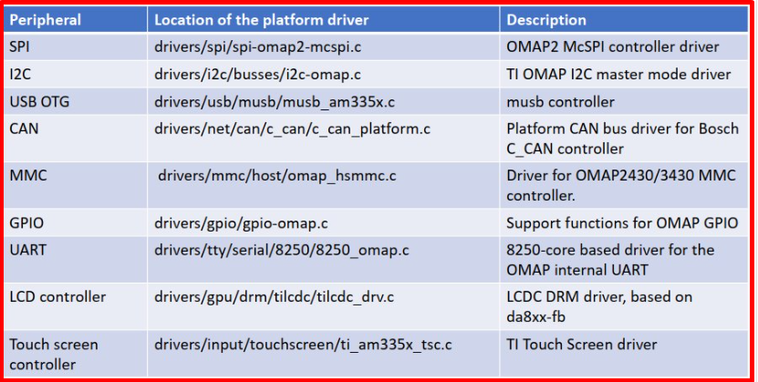   
</p>

***Để Đăng kí platform driver​***
+ Ta sử dụng **platform_driver_register**
+ /include/linux/platform_device.h ​

​<p align="center">
     
</p>
​<p align="center">
     
</p>

***Dánh sách​***
+ Dưới kernel sẽ có 2 danh sách: 1 là danh sách platform device, 2 là danh sách các driver được load lên hệ thống. ​
+ Bất cứ khi nào mình them 1 platsform device hoặc driver thì dnahs sách này sẽ được cập nhật​

​<p align="center">
  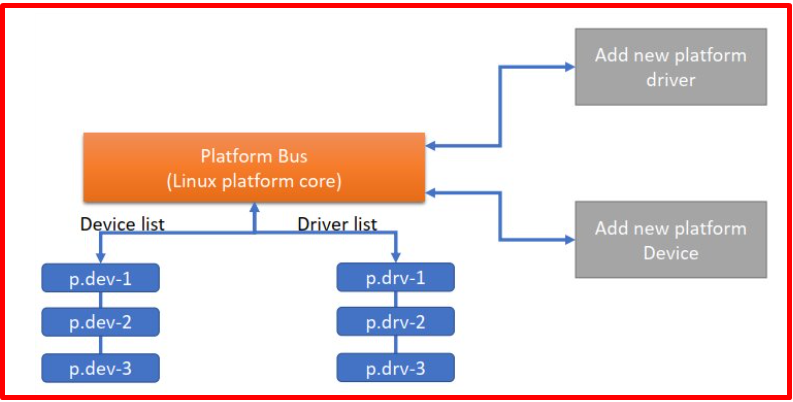   
</p>

+ Phương thức probe của driver ( p.drv-3) sẽ call cùng với cùng với device p.dev-1 thông qua argument

​<p align="center">
     
</p>

***Probe function***
+ Bất cứ khi nào một new device hoặc new driver được thêm vào, chức năng matching của bus platform sẽ
chạy và nếu nó tìm thấy platform device phù hợp cho platform driver, probe function của driver phù hợp sẽ được gọi. Bên trong probe function, driver sẽ cấu hình device được phát hiện.​
+ Thông tin chi tiết về platform device phù hợp sẽ được chuyển đến probe function của driver phù hợp để
driver có thể trích xuất data và định cấu hình nó
+ Probe function phải được platform driver triển khai và phải được đăng ký trong platform_driver_register().​
+ Khi chức năng khớp bus phát hiện device và driver khớp, probe function của driver sẽ được gọi với platform device được phát hiện làm input argument​
+ Lưu ý rằng probe() nói chung phải xác minh rằng phần cứng thiết bị được chỉ định thực sự tồn tại.​
    + Phát hiện và khởi tạo thiết bị​
    + Phân bổ bộ nhớ cho các cấu trúc dữ liệu khác nhau​
    + Ánh xạ bộ nhớ vào/ra​
    + Đăng ký xử lý ngắt​
    + Đăng ký thiết bị với kernel framework, tạo điểm truy cập ở cấp độ người dùng, v.v.​

***remove function​***
+ Hàm Remove được gọi khi một device platform bị xóa khỏi kernel để hủy liên kết một thiết bị khỏi
driver hoặc khi kernel không còn sử dụng thiết bị nền tảng nữa​
+ Chức năng remove có trách nhiệm là
    + Hủy đăng ký thiết bị khỏi kernel framework​
    + Giải phóng bộ nhớ nếu được phân bổ thay mặt cho thiết bị​
    + Tắt/khởi tạo lại thiết bị

​<p align="center">
  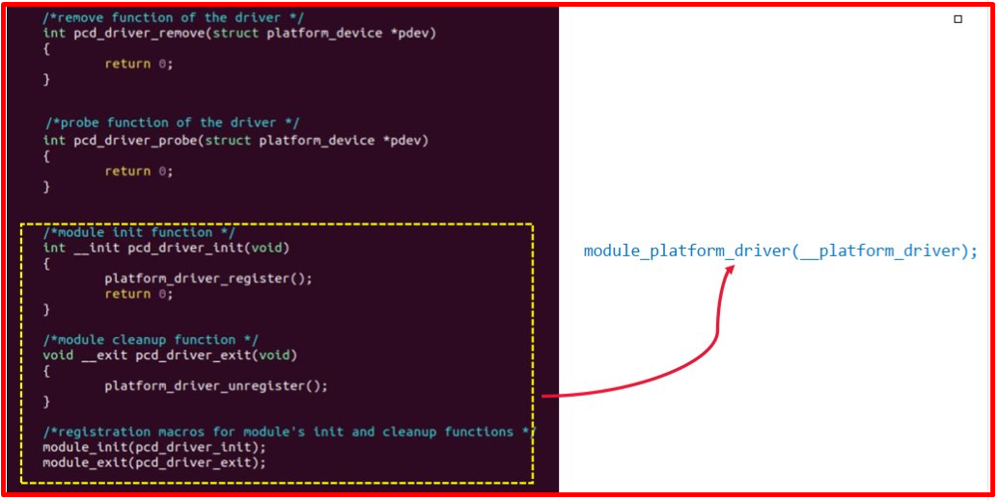   
</p>

+ Cấu trúc include device tree trên BBB

​<p align="center">
     
</p>

+ Ví dụ Bus I2C

​<p align="center">
  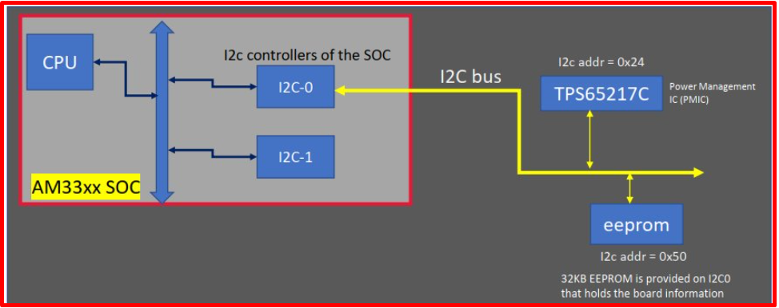   
</p>

+ Ví dụ device tree

​<p align="center">
     
</p>

​<p align="center">
  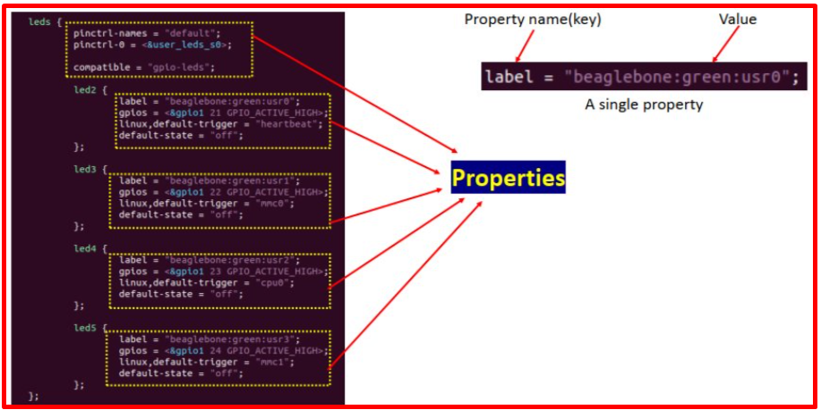   
</p>

### 2️⃣ Thực hành
***Bài 1 platform***
+ Bài này sẽ gồm pcd_device_setup.c, pcd_platform_driver.c, platform.h, Makefile
+ File pcd_device_setup.c
```c
#include<linux/module.h>
#include<linux/platform_device.h>

#include "platform.h"

#undef pr_fmt
#define pr_fmt(fmt) "%s : " fmt,__func__

void pcdev_release(struct device *dev)
{
	pr_info("Device released \n");
}


/*1. create n platform data */
struct pcdev_platform_data  pcdev_pdata[] = {
	[0] = {.size = 512, .perm = RDWR,   .serial_number = "PCDEVABC1111"},
	[1] = {.size = 1024,.perm = RDWR,   .serial_number = "PCDEVXYZ2222"},
	[2] = {.size = 128, .perm = RDONLY, .serial_number = "PCDEVXYZ3333"},
	[3] = {.size = 32,  .perm = WRONLY, .serial_number = "PCDEVXYZ4444"}
};

/*2. create n platform devices */ 

struct platform_device platform_pcdev_1 = {
	.name = "pcdev-A1x",
	.id = 0,
	.dev = {
		.platform_data = &pcdev_pdata[0],
		.release = pcdev_release
	}
};


struct platform_device platform_pcdev_2 = {
	.name = "pcdev-B1x",
	.id = 1,
	.dev = {
		.platform_data = &pcdev_pdata[1],
		.release = pcdev_release
	}
};


struct platform_device platform_pcdev_3 = {
	.name = "pcdev-C1x",
	.id = 2,
	.dev = {
		.platform_data = &pcdev_pdata[2],
		.release = pcdev_release
	}
};


struct platform_device platform_pcdev_4 = {
	.name = "pcdev-D1x",
	.id = 3,
	.dev = {
		.platform_data = &pcdev_pdata[3],
		.release = pcdev_release
	}
};


struct platform_device *platform_pcdevs[] = 
{
	&platform_pcdev_1,
	&platform_pcdev_2,
	&platform_pcdev_3,
	&platform_pcdev_4
};

static int __init pcdev_platform_init(void)
{
	/* register n platform devices */

	//platform_device_register(&platform_pcdev_1);
	//platform_device_register(&platform_pcdev_2);
	
	platform_add_devices(platform_pcdevs,ARRAY_SIZE(platform_pcdevs) );

	pr_info("Device setup module loaded \n");

	return 0;
}


static void __exit pcdev_platform_exit(void)
{

	platform_device_unregister(&platform_pcdev_1);
	platform_device_unregister(&platform_pcdev_2);
	platform_device_unregister(&platform_pcdev_3);
	platform_device_unregister(&platform_pcdev_4);
	pr_info("Device setup module unloaded \n");


}

module_init(pcdev_platform_init);
module_exit(pcdev_platform_exit);


MODULE_LICENSE("GPL");
MODULE_DESCRIPTION("Module which registers n platform devices ");
MODULE_AUTHOR("HuLaTho");
```

+ File pcd_platform_driver.c
```c
#include<linux/module.h>
#include<linux/fs.h>
#include<linux/cdev.h>
#include<linux/device.h>
#include<linux/kdev_t.h>
#include<linux/uaccess.h>
#include <linux/platform_device.h>
#include<linux/slab.h>
#include<linux/mod_devicetable.h>
#include "platform.h"


#undef pr_fmt
#define pr_fmt(fmt) "%s : " fmt,__func__

#define MAX_DEVICES 10

enum pcdev_names
{
	PCDEVA1X,
	PCDEVB1X,
	PCDEVC1X,
	PCDEVD1X
};

struct device_config 
{
	int config_item1;
	int config_item2;
};


/*configuration data of the driver for devices */
struct device_config pcdev_config[] = 
{
	[PCDEVA1X] = {.config_item1 = 60, .config_item2 = 21},
	[PCDEVB1X] = {.config_item1 = 50, .config_item2 = 22},
	[PCDEVC1X] = {.config_item1 = 40, .config_item2 = 23},
	[PCDEVD1X] = {.config_item1 = 30, .config_item2 = 24}
	
};

/* Device private data structure */
struct pcdev_private_data
{
	struct pcdev_platform_data pdata;
	char *buffer;
	dev_t dev_num;
	struct cdev cdev;
};


/*Driver private data structure */
struct pcdrv_private_data
{
	int total_devices;
	dev_t device_num_base;
	struct class *class_pcd;
	struct device *device_pcd;
};


/*Driver's private data */
struct pcdrv_private_data pcdrv_data;

int check_permission(int dev_perm, int acc_mode)
{

	if(dev_perm == RDWR)
		return 0;
	
	//ensures readonly access
	if( (dev_perm == RDONLY) && ( (acc_mode & FMODE_READ) && !(acc_mode & FMODE_WRITE) ) )
		return 0;
	
	//ensures writeonly access
	if( (dev_perm == WRONLY) && ( (acc_mode & FMODE_WRITE) && !(acc_mode & FMODE_READ) ) )
		return 0;

	return -EPERM;

}


loff_t pcd_lseek(struct file *filp, loff_t offset, int whence)
{

	struct pcdev_private_data *pcdev_data = (struct pcdev_private_data*)filp->private_data;

	int max_size = pcdev_data->pdata.size;
	
	loff_t temp;

	pr_info("lseek requested \n");
	pr_info("Current value of the file position = %lld\n",filp->f_pos);

	switch(whence)
	{
		case SEEK_SET:
			if((offset > max_size) || (offset < 0))
				return -EINVAL;
			filp->f_pos = offset;
			break;
		case SEEK_CUR:
			temp = filp->f_pos + offset;
			if((temp > max_size) || (temp < 0))
				return -EINVAL;
			filp->f_pos = temp;
			break;
		case SEEK_END:
			temp = max_size + offset;
			if((temp > max_size) || (temp < 0))
				return -EINVAL;
			filp->f_pos = temp;
			break;
		default:
			return -EINVAL;
	}
	
	pr_info("New value of the file position = %lld\n",filp->f_pos);

	return filp->f_pos;
}

ssize_t pcd_read(struct file *filp, char __user *buff, size_t count, loff_t *f_pos)
{
	struct pcdev_private_data *pcdev_data = (struct pcdev_private_data*)filp->private_data;

	int max_size = pcdev_data->pdata.size;

	pr_info("Read requested for %zu bytes \n",count);
	pr_info("Current file position = %lld\n",*f_pos);

	
	/* Adjust the 'count' */
	if((*f_pos + count) > max_size)
		count = max_size - *f_pos;

	/*copy to user */
	if(copy_to_user(buff,pcdev_data->buffer+(*f_pos),count)){
		return -EFAULT;
	}

	/*update the current file postion */
	*f_pos += count;

	pr_info("Number of bytes successfully read = %zu\n",count);
	pr_info("Updated file position = %lld\n",*f_pos);

	/*Return number of bytes which have been successfully read */
	return count;

}

ssize_t pcd_write(struct file *filp, const char __user *buff, size_t count, loff_t *f_pos)
{
	struct pcdev_private_data *pcdev_data = (struct pcdev_private_data*)filp->private_data;

	int max_size = pcdev_data->pdata.size;
	
	pr_info("Write requested for %zu bytes\n",count);
	pr_info("Current file position = %lld\n",*f_pos);

	
	/* Adjust the 'count' */
	if((*f_pos + count) > max_size)
		count = max_size - *f_pos;

	if(!count){
		pr_err("No space left on the device \n");
		return -ENOMEM;
	}

	/*copy from user */
	if(copy_from_user(pcdev_data->buffer+(*f_pos),buff,count)){
		return -EFAULT;
	}

	/*update the current file postion */
	*f_pos += count;

	pr_info("Number of bytes successfully written = %zu\n",count);
	pr_info("Updated file position = %lld\n",*f_pos);

	/*Return number of bytes which have been successfully written */
	return count;

}


int pcd_open(struct inode *inode, struct file *filp)
{

	int ret;

	int minor_n;
	
	struct pcdev_private_data *pcdev_data;

	/*find out on which device file open was attempted by the user space */

	minor_n = MINOR(inode->i_rdev);
	pr_info("minor access = %d\n",minor_n);

	/*get device's private data structure */
	pcdev_data = container_of(inode->i_cdev,struct pcdev_private_data,cdev);

	/*to supply device private data to other methods of the driver */
	filp->private_data = pcdev_data;
		
	/*check permission */
	ret = check_permission(pcdev_data->pdata.perm,filp->f_mode);

	(!ret)?pr_info("open was successful\n"):pr_info("open was unsuccessful\n");

	return ret;
}

int pcd_release(struct inode *inode, struct file *flip)
{
	pr_info("release was successful\n");

	return 0;
}


/* file operations of the driver */
struct file_operations pcd_fops=
{
	.open = pcd_open,
	.release = pcd_release,
	.read = pcd_read,
	.write = pcd_write,
	.llseek = pcd_lseek,
	.owner = THIS_MODULE
};


/*Called when the device is removed from the system */
int pcd_platform_driver_remove(struct platform_device *pdev)
{

	struct pcdev_private_data  *dev_data = dev_get_drvdata(&pdev->dev);

	/*1. Remove a device that was created with device_create() */
	device_destroy(pcdrv_data.class_pcd,dev_data->dev_num);
	
	/*2. Remove a cdev entry from the system*/
	cdev_del(&dev_data->cdev);

	pcdrv_data.total_devices--;

	pr_info("A device is removed\n");

	return 0;
}

/*Called when matched platform device is found */
int pcd_platform_driver_probe(struct platform_device *pdev)
{
	int ret;

	struct pcdev_private_data *dev_data;

	struct pcdev_platform_data *pdata;

	pr_info("A device is detected\n");

	/* 1 Get the platform data */
	pdata = (struct pcdev_platform_data*)dev_get_platdata(&pdev->dev);
	if(!pdata){
		pr_info("No platform data available\n");
		return -EINVAL;
	}

	/* 2 Dynamically allocate memory for the device private data  */
	dev_data = devm_kzalloc(&pdev->dev, sizeof(*dev_data),GFP_KERNEL);
	if(!dev_data){
		pr_info("Cannot allocate memory \n");
		return -ENOMEM;
	}

	/*save the device private data pointer in platform device structure */
	dev_set_drvdata(&pdev->dev,dev_data);

	dev_data->pdata.size = pdata->size;
	dev_data->pdata.perm = pdata->perm;
	dev_data->pdata.serial_number = pdata->serial_number;

	pr_info("Device serial number = %s\n",dev_data->pdata.serial_number);
	pr_info("Device size = %d\n", dev_data->pdata.size);
	pr_info("Device permission = %d\n",dev_data->pdata.perm);

	pr_info("Config item 1 = %d\n",pcdev_config[pdev->id_entry->driver_data].config_item1 );
	pr_info("Config item 2 = %d\n",pcdev_config[pdev->id_entry->driver_data].config_item2 );


	/* 3 Dynamically allocate memory for the device buffer using size 
	information from the platform data */
	dev_data->buffer = devm_kzalloc(&pdev->dev,dev_data->pdata.size,GFP_KERNEL);
	if(!dev_data->buffer){
		pr_info("Cannot allocate memory \n");
		return -ENOMEM;
	}

	/* 4 Get the device number */
	dev_data->dev_num = pcdrv_data.device_num_base + pdev->id;

	/* 5 Do cdev init and cdev add */
	cdev_init(&dev_data->cdev,&pcd_fops);
	
	dev_data->cdev.owner = THIS_MODULE;
	ret = cdev_add(&dev_data->cdev,dev_data->dev_num,1);
	if(ret < 0){
		pr_err("Cdev add failed\n");
		return ret;
	}

	/* 6 Create device file for the detected platform device */
	pcdrv_data.device_pcd = device_create(pcdrv_data.class_pcd,NULL,dev_data->dev_num,NULL,"pcdev-%d",pdev->id);
	if(IS_ERR(pcdrv_data.device_pcd)){
		pr_err("Device create failed\n");
		ret = PTR_ERR(pcdrv_data.device_pcd);
		cdev_del(&dev_data->cdev);
		return ret;
		
	}

	pcdrv_data.total_devices++;

	pr_info("Probe was successful\n");

	return 0;

}

struct platform_device_id pcdevs_ids[] = 
{
	[0] = {.name = "pcdev-A1x",.driver_data = PCDEVA1X},
	[1] = {.name = "pcdev-B1x",.driver_data = PCDEVB1X},
	[2] = {.name = "pcdev-C1x",.driver_data = PCDEVC1X},
	[3] = {.name = "pcdev-D1x",.driver_data = PCDEVD1X},
	{ } /*Null termination */
};

struct platform_driver pcd_platform_driver = 
{
	.probe = pcd_platform_driver_probe,
	.remove = pcd_platform_driver_remove,
	.id_table = pcdevs_ids,
	.driver = {
		.name = "pseudo-char-device"
	}

};


static int __init pcd_platform_driver_init(void)
{
	int ret;

	/*Dynamically allocate a device number for MAX_DEVICES */
	ret = alloc_chrdev_region(&pcdrv_data.device_num_base,0,MAX_DEVICES,"pcdevs");
	if(ret < 0){
		pr_err("Alloc chrdev failed\n");
		return ret;
	}

	/*Create device class under /sys/class */
	pcdrv_data.class_pcd = class_create(THIS_MODULE,"pcd_class");
	if(IS_ERR(pcdrv_data.class_pcd)){
		pr_err("Class creation failed\n");
		ret = PTR_ERR(pcdrv_data.class_pcd);
		unregister_chrdev_region(pcdrv_data.device_num_base,MAX_DEVICES);
		return ret;
	}

	/*Register a platform driver */
	platform_driver_register(&pcd_platform_driver);
	
	pr_info("pcd platform driver loaded\n");
	
	return 0;

}


static void __exit pcd_platform_driver_cleanup(void)
{
	/*Unregister the platform driver */
	platform_driver_unregister(&pcd_platform_driver);

	/*Class destroy */
	class_destroy(pcdrv_data.class_pcd);

	/*Unregister device numbers for MAX_DEVICES */
	unregister_chrdev_region(pcdrv_data.device_num_base,MAX_DEVICES);
	
	pr_info("pcd platform driver unloaded\n");

}


module_init(pcd_platform_driver_init);
module_exit(pcd_platform_driver_cleanup);

//module_platform_driver(pcd_platform_driver);

MODULE_LICENSE("GPL");
MODULE_AUTHOR("HuLaTho");
MODULE_DESCRIPTION("A pseudo character platform driver which handles n platform pcdevs");
```

+ File platform.h
```h

/*platform data of the pcdev */
struct pcdev_platform_data
{
	int size;
	int perm;
	const char *serial_number;
};

/*Permission codes */

#define RDWR 0x11
#define RDONLY 0x01
#define WRONLY 0x10
```

+ File Makefile
```Makefile
obj-m := pcd_device_setup.o pcd_platform_driver.o

KERNELDIR = /home/bv_rzvt/hula/imx-yocto-bsp/build-xwayland/tmp/work/mys_8mmx-poky-linux/linux-imx/5.4-r0/build

all:
	$(MAKE) -C $(KERNELDIR) M=$(PWD) M=$(PWD) modules
clean:
	$(MAKE) -C $(KERNELDIR) M=$(PWD) M=$(PWD) clean
```


+ Tạo 2 module kernel, 1 cái là driver platform còn 1 cái là platform device​
+ ls /sys/devices/platform/

​<p align="center">
  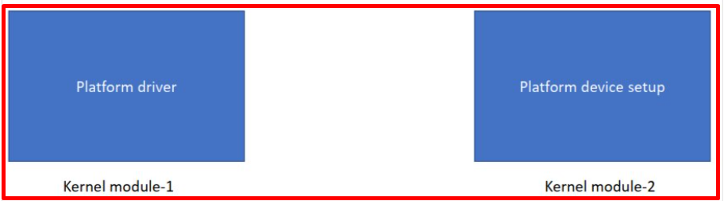   
</p>

+ Có bao nhiêu thiết bị thì sẽ có bấy nhiêu lần thăm dò ( probe ) thực hiện​

​<p align="center">
     
</p>

+ Ở trong probe, sau khi lấy được data platform ra rồi thì cần tạo 1 memory ở kernel để lưu các biến mới get được này​

​<p align="center">
  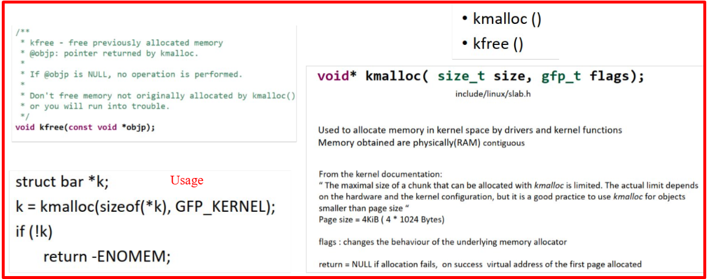   
</p>

+ Kzalloc thì oke hơn kmalloc, vì kmalloc không trả về 1 bộ nhớ
+ Như hình bên dưới, khi pbarr->name NULL thì name chưa được allocate khi này dung name sẽ chết​

​<p align="center">
  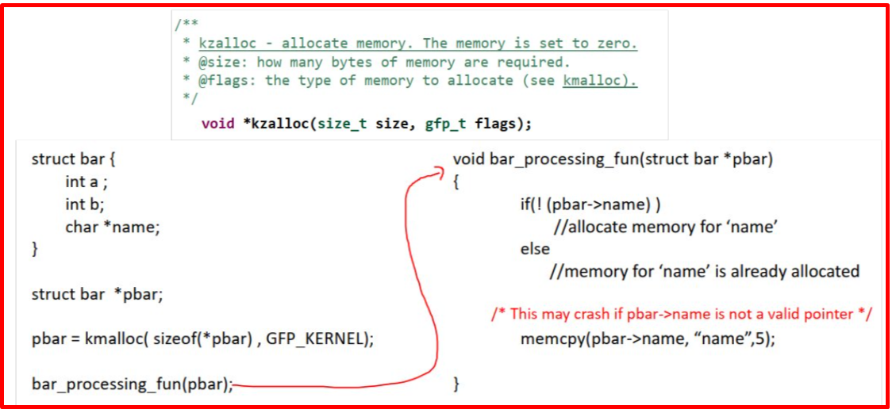   
</p>
​<p align="center">
     
</p>

+ kmalloc() : This allocates a resource ( kernel memory)​
+ devm_kmalloc() : Điều này cũng cấp phát một tài nguyên nhưng nó “ghi nhớ”những gì đã được phân bổ. (Đây là API được quản lý tài nguyên)​

​<p align="center">
  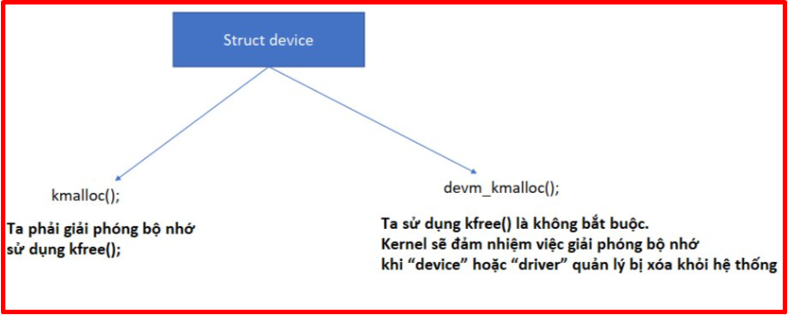   
</p>

+ Trong quá trình làm chip/device, thì khi họ update chip /device thì tên của chip /device có thể được update, khi này trong driver của ta cần kiểm tra xem có phải ID này không, phải thì dùng
+ Từ đây sinh ra struct patform_device_id, chỉ những device nào có name trùng với name trong struct này thì mới probe được.​

​<p align="center">
     
</p>

+ Như phần trên là ta đang lấy dữ liệu từ flatform device ở trong probe và ta lưu nó vào struct data của driver.​
+ Trong tường hợp driver sẽ lưu trữ 1 số dữ liệu cấu hình liên quan đến thiết bị đó, khi device được phát hiện và chiu vào probe, khi này driver có thể lấy data này trong probe và có thể cấu hình device đó

​<p align="center">
  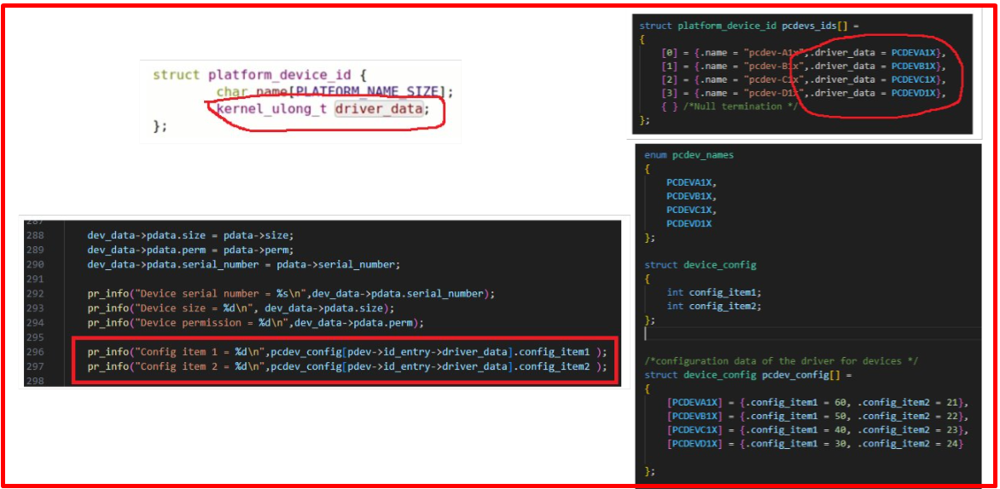   
</p>

+ Đầu tiên insmod device_setup sau đó insmod platform_driver , sau đó dmesg | tail​
+ Khi này ta thấy bên platform_driver đã lấy được thông tin bên device_setup và in ra​
+ Bên pcd_device_setup.c sẽ tạo ra 4 cái device và mỗi device có data của riêng nó


***Bài 2 Platform Device Tree***


+ File hula.dtsi
```xml
/ {
	pcdev1: pcdev-1 {
		compatible = "pcdev-E1x","pcdev-A1x";
		org,size = <512>;
		org,device-serial-num = "PCDEV1ABC123";
		org,perm = <0x11>;
	};
	
	pcdev2: pcdev-2 {
		compatible = "pcdev-B1x";
		org,size = <1024>;
		org,device-serial-num = "PCDEV2ABC456";
		org,perm = <0x11>;
	};

	pcdev3: pcdev-3 {
		compatible = "pcdev-C1x";
		org,size = <256>;
		org,device-serial-num = "PCDEV3ABC789";
		org,perm = <0x11>;
	};
	
	pcdev4: pcdev-4 {
		compatible = "pcdev-D1x";
		org,size = <2048>;
		org,device-serial-num = "PCDEV4ABC000";
		org,perm = <0x11>;
	};

};
```

+ File Makefile
```Makefile
obj-m := pcd_platform_driver_dt.o

KERNELDIR = /home/bv_rzvt/hula/imx-yocto-bsp/build-xwayland/tmp/work/mys_8mmx-poky-linux/linux-imx/5.4-r0/build

all:
	$(MAKE) -C $(KERNELDIR) M=$(PWD) M=$(PWD) modules
clean:
	$(MAKE) -C $(KERNELDIR) M=$(PWD) M=$(PWD) clean
```

+ File pcd_platform_driver_dt.c
```c
#include<linux/module.h>
#include<linux/fs.h>
#include<linux/cdev.h>
#include<linux/device.h>
#include<linux/kdev_t.h>
#include<linux/uaccess.h>
#include <linux/platform_device.h>
#include<linux/slab.h>
#include<linux/mod_devicetable.h>
#include<linux/of.h>
#include<linux/of_device.h>
#include "platform.h"


#undef pr_fmt
#define pr_fmt(fmt) "%s : " fmt,__func__


enum pcdev_names
{
	PCDEVA1X,
	PCDEVB1X,
	PCDEVC1X,
	PCDEVD1X
};

struct device_config 
{
	int config_item1;
	int config_item2;
};

struct device_config pcdev_config[] = 
{
	[PCDEVA1X] = {.config_item1 = 60, .config_item2 = 21},
	[PCDEVB1X] = {.config_item1 = 50, .config_item2 = 22},
	[PCDEVC1X] = {.config_item1 = 40, .config_item2 = 23},
	[PCDEVD1X] = {.config_item1 = 30, .config_item2 = 24}
	
};

/*Device private data structure */
struct pcdev_private_data
{
	struct pcdev_platform_data pdata;
	char *buffer;
	dev_t dev_num;
	struct cdev cdev;
};


/*Driver private data structure */
struct pcdrv_private_data
{
	int total_devices;
	dev_t device_num_base;
	struct class *class_pcd;
	struct device *device_pcd;
};

/*Driver's private data */
struct pcdrv_private_data pcdrv_data;

int check_permission(int dev_perm, int acc_mode)
{

	if(dev_perm == RDWR)
		return 0;
	
	//ensures readonly access
	if( (dev_perm == RDONLY) && ( (acc_mode & FMODE_READ) && !(acc_mode & FMODE_WRITE) ) )
		return 0;
	
	//ensures writeonly access
	if( (dev_perm == WRONLY) && ( (acc_mode & FMODE_WRITE) && !(acc_mode & FMODE_READ) ) )
		return 0;

	return -EPERM;

}


loff_t pcd_lseek(struct file *filp, loff_t offset, int whence)
{

	struct pcdev_private_data *pcdev_data = (struct pcdev_private_data*)filp->private_data;

	int max_size = pcdev_data->pdata.size;
	
	loff_t temp;

	pr_info("lseek requested \n");
	pr_info("Current value of the file position = %lld\n",filp->f_pos);

	switch(whence)
	{
		case SEEK_SET:
			if((offset > max_size) || (offset < 0))
				return -EINVAL;
			filp->f_pos = offset;
			break;
		case SEEK_CUR:
			temp = filp->f_pos + offset;
			if((temp > max_size) || (temp < 0))
				return -EINVAL;
			filp->f_pos = temp;
			break;
		case SEEK_END:
			temp = max_size + offset;
			if((temp > max_size) || (temp < 0))
				return -EINVAL;
			filp->f_pos = temp;
			break;
		default:
			return -EINVAL;
	}
	
	pr_info("New value of the file position = %lld\n",filp->f_pos);

	return filp->f_pos;
}

ssize_t pcd_read(struct file *filp, char __user *buff, size_t count, loff_t *f_pos)
{
	struct pcdev_private_data *pcdev_data = (struct pcdev_private_data*)filp->private_data;

	int max_size = pcdev_data->pdata.size;

	pr_info("Read requested for %zu bytes \n",count);
	pr_info("Current file position = %lld\n",*f_pos);

	
	/* Adjust the 'count' */
	if((*f_pos + count) > max_size)
		count = max_size - *f_pos;

	/*copy to user */
	if(copy_to_user(buff,pcdev_data->buffer+(*f_pos),count)){
		return -EFAULT;
	}

	/*update the current file postion */
	*f_pos += count;

	pr_info("Number of bytes successfully read = %zu\n",count);
	pr_info("Updated file position = %lld\n",*f_pos);

	/*Return number of bytes which have been successfully read */
	return count;

}

ssize_t pcd_write(struct file *filp, const char __user *buff, size_t count, loff_t *f_pos)
{
	struct pcdev_private_data *pcdev_data = (struct pcdev_private_data*)filp->private_data;

	int max_size = pcdev_data->pdata.size;
	
	pr_info("Write requested for %zu bytes\n",count);
	pr_info("Current file position = %lld\n",*f_pos);

	
	/* Adjust the 'count' */
	if((*f_pos + count) > max_size)
		count = max_size - *f_pos;

	if(!count){
		pr_err("No space left on the device \n");
		return -ENOMEM;
	}

	/*copy from user */
	if(copy_from_user(pcdev_data->buffer+(*f_pos),buff,count)){
		return -EFAULT;
	}

	/*update the current file postion */
	*f_pos += count;

	pr_info("Number of bytes successfully written = %zu\n",count);
	pr_info("Updated file position = %lld\n",*f_pos);

	/*Return number of bytes which have been successfully written */
	return count;

}


int pcd_open(struct inode *inode, struct file *filp)
{

	int ret;

	int minor_n;
	
	struct pcdev_private_data *pcdev_data;

	/*find out on which device file open was attempted by the user space */

	minor_n = MINOR(inode->i_rdev);
	pr_info("minor access = %d\n",minor_n);

	/*get device's private data structure */
	pcdev_data = container_of(inode->i_cdev,struct pcdev_private_data,cdev);

	/*to supply device private data to other methods of the driver */
	filp->private_data = pcdev_data;
		
	/*check permission */
	ret = check_permission(pcdev_data->pdata.perm,filp->f_mode);

	(!ret)?pr_info("open was successful\n"):pr_info("open was unsuccessful\n");

	return ret;
}

int pcd_release(struct inode *inode, struct file *flip)
{
	pr_info("release was successful\n");

	return 0;
}


/* file operations of the driver */
struct file_operations pcd_fops=
{
	.open = pcd_open,
	.release = pcd_release,
	.read = pcd_read,
	.write = pcd_write,
	.llseek = pcd_lseek,
	.owner = THIS_MODULE
};


/*Called when the device is removed from the system */
int pcd_platform_driver_remove(struct platform_device *pdev)
{

#if 1
	struct pcdev_private_data  *dev_data = dev_get_drvdata(&pdev->dev);

	/*1. Remove a device that was created with device_create() */
	device_destroy(pcdrv_data.class_pcd,dev_data->dev_num);
	
	/*2. Remove a cdev entry from the system*/
	cdev_del(&dev_data->cdev);


	pcdrv_data.total_devices--;

#endif 
	dev_info(&pdev->dev,"A device is removed\n");
	return 0;
}

struct pcdev_platform_data* pcdev_get_platdata_from_dt(struct device *dev)
{
	struct device_node *dev_node = dev->of_node;
	struct pcdev_platform_data *pdata;

	if(!dev_node)
		/* this probe didnt happen because of device tree node */
		return NULL;

	pdata = devm_kzalloc(dev,sizeof(*pdata),GFP_KERNEL);
	if(!pdata){
		dev_info(dev,"Cannot allocate memory \n");
		return ERR_PTR(-ENOMEM);
	}

	if(of_property_read_string(dev_node,"org,device-serial-num",&pdata->serial_number) ){
		dev_info(dev,"Missing serial number property\n");
		return ERR_PTR(-EINVAL);

	}


	if(of_property_read_u32(dev_node,"org,size",&pdata->size) ){
		dev_info(dev,"Missing size property\n");
		return ERR_PTR(-EINVAL);
	}

	if(of_property_read_u32(dev_node,"org,perm",&pdata->perm) ){
		dev_info(dev,"Missing permission property\n");
		return ERR_PTR(-EINVAL);
	}


	return pdata;


}

struct of_device_id org_pcdev_dt_match[] ;

/*Called when matched platform device is found */
int pcd_platform_driver_probe(struct platform_device *pdev)
{
	int ret;

	struct pcdev_private_data *dev_data;

	struct pcdev_platform_data *pdata;

	struct device *dev = &pdev->dev;

	int driver_data;

	/* used to store matched entry of 'of_device_id' list of this driver */
	const struct of_device_id *match;

	dev_info(dev,"A device is detected\n");

	/*match will always be NULL if LINUX doesnt support device tree i.e CONFIG_OF is off */
	match = of_match_device(of_match_ptr(org_pcdev_dt_match),dev);

	if(match){
		pdata = pcdev_get_platdata_from_dt(dev);
		if(IS_ERR(pdata))
			return PTR_ERR(pdata);
		driver_data = (long)match->data;
	}else{
		pdata = (struct pcdev_platform_data*)dev_get_platdata(dev);
		driver_data =  pdev->id_entry->driver_data;
	}


	if(!pdata){
		dev_info(dev,"No platform data available\n");
		return -EINVAL;
	}

	/*2. Dynamically allocate memory for the device private data  */
	dev_data = devm_kzalloc(&pdev->dev, sizeof(*dev_data),GFP_KERNEL);
	if(!dev_data){
		dev_info(dev,"Cannot allocate memory \n");
		return -ENOMEM;
	}

	/*save the device private data pointer in platform device structure */
	dev_set_drvdata(&pdev->dev,dev_data);

	dev_data->pdata.size = pdata->size;
	dev_data->pdata.perm = pdata->perm;
	dev_data->pdata.serial_number = pdata->serial_number;

	pr_info("Device serial number = %s\n",dev_data->pdata.serial_number);
	pr_info("Device size = %d\n", dev_data->pdata.size);
	pr_info("Device permission = %d\n",dev_data->pdata.perm);

	pr_info("Config item 1 = %d\n",pcdev_config[driver_data].config_item1 );
	pr_info("Config item 2 = %d\n",pcdev_config[driver_data].config_item2 );


	/*3. Dynamically allocate memory for the device buffer using size 
	information from the platform data */
	dev_data->buffer = devm_kzalloc(&pdev->dev,dev_data->pdata.size,GFP_KERNEL);
	if(!dev_data->buffer){
		dev_info(dev,"Cannot allocate memory \n");
		return -ENOMEM;
	}

	/*4. Get the device number */
	dev_data->dev_num = pcdrv_data.device_num_base + pcdrv_data.total_devices;

	/*5. Do cdev init and cdev add */
	cdev_init(&dev_data->cdev,&pcd_fops);
	
	dev_data->cdev.owner = THIS_MODULE;
	ret = cdev_add(&dev_data->cdev,dev_data->dev_num,1);
	if(ret < 0){
		dev_err(dev,"Cdev add failed\n");
		return ret;
	}

	/*6. Create device file for the detected platform device */
	pcdrv_data.device_pcd = device_create(pcdrv_data.class_pcd,dev,dev_data->dev_num,NULL,\
								"pcdev-%d",pcdrv_data.total_devices);
	if(IS_ERR(pcdrv_data.device_pcd)){
		dev_err(dev,"Device create failed\n");
		ret = PTR_ERR(pcdrv_data.device_pcd);
		cdev_del(&dev_data->cdev);
		return ret;
		
	}

	pcdrv_data.total_devices++;

	dev_info(dev,"Probe was successful\n");

	return 0;

}

struct platform_device_id pcdevs_ids[] = 
{
	{.name = "pcdev-A1x",.driver_data = PCDEVA1X},
	{.name = "pcdev-B1x",.driver_data = PCDEVB1X},
	{.name = "pcdev-C1x",.driver_data = PCDEVC1X},
	{.name = "pcdev-D1x",.driver_data = PCDEVD1X},
	{ } /*Null termination */
};

struct of_device_id org_pcdev_dt_match[] = 
{
	{.compatible = "pcdev-A1x",.data = (void*)PCDEVA1X},
	{.compatible = "pcdev-B1x",.data = (void*)PCDEVB1X},
	{.compatible = "pcdev-C1x",.data = (void*)PCDEVC1X},
	{.compatible = "pcdev-D1x",.data = (void*)PCDEVD1X},
	{ } /*Null termination*/

};

struct platform_driver pcd_platform_driver = 
{
	.probe = pcd_platform_driver_probe,
	.remove = pcd_platform_driver_remove,
	.id_table = pcdevs_ids,
	.driver = {
		.name = "pseudo-char-device",
		.of_match_table = of_match_ptr(org_pcdev_dt_match)
	}
};


#define MAX_DEVICES 10

static int __init pcd_platform_driver_init(void)
{
	int ret;

	/*1. Dynamically allocate a device number for MAX_DEVICES */
	ret = alloc_chrdev_region(&pcdrv_data.device_num_base,0,MAX_DEVICES,"pcdevs");
	if(ret < 0){
		pr_err("Alloc chrdev failed\n");
		return ret;
	}

	/*2. Create device class under /sys/class */
	pcdrv_data.class_pcd = class_create(THIS_MODULE,"pcd_class");
	if(IS_ERR(pcdrv_data.class_pcd)){
		pr_err("Class creation failed\n");
		ret = PTR_ERR(pcdrv_data.class_pcd);
		unregister_chrdev_region(pcdrv_data.device_num_base,MAX_DEVICES);
		return ret;
	}

	/*3. Register a platform driver */
	platform_driver_register(&pcd_platform_driver);
	
	pr_info("pcd platform driver loaded\n");
	
	return 0;

}


static void __exit pcd_platform_driver_cleanup(void)
{
	/*1.Unregister the platform driver */
	platform_driver_unregister(&pcd_platform_driver);

	/*2.Class destroy */
	class_destroy(pcdrv_data.class_pcd);

	/*3.Unregister device numbers for MAX_DEVICES */
	unregister_chrdev_region(pcdrv_data.device_num_base,MAX_DEVICES);
	
	pr_info("pcd platform driver unloaded\n");

}


module_init(pcd_platform_driver_init);
module_exit(pcd_platform_driver_cleanup);

//module_platform_driver(pcd_platform_driver);

MODULE_LICENSE("GPL");
MODULE_AUTHOR("HuLaTho");
MODULE_DESCRIPTION("A pseudo character platform driver which handles n platform pcdevs");
```

+ File platform.h
```h
/*platform data of the pcdev */
struct pcdev_platform_data
{
	int size;
	int perm;
	const char *serial_number;
};

/*Permission codes */

#define RDWR 0x11
#define RDONLY 0x01
#define WRONLY 0x10
```

​<p align="center">
  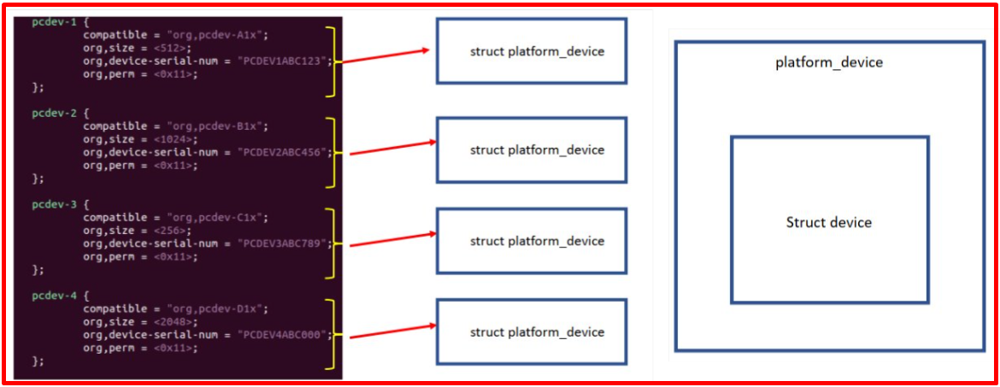   
</p>

+ Ta có thể vào file mys-imx8mm-evk.dts để include thêm 1 file dtsi nữa, và trong đây sẽ thêm node của ta vào ​

+ Cái struct platform_device_id chỉ được sử dụng cho flatform mà được đăng kí bằng tay như bài trước thôi, còn giờ là flatform device tree thì không dung được nữa
+ Tuy nhiên sẽ có 1 struct tương tự cung cấp cho device tree là of_device_id 

​<p align="center">
     
</p>

+ Quá trình binding, nó sẽ nhảy vào hàm này để thực hiện, khi này device tree sẽ được struct thành (struct device *dev), còn driver của mình sẽ là struct device_driver
+ Khi này nó sẽ vào hàm of-driver_match_device để kiểm tra
+ Trong of-driver_match_device nó sẽ vào of_match_table để lấy

​<p align="center">
     
</p>

+ Of_match_table thuộc of_device_id của struct device-driver Và nó lại thuộc of_device_id nên ta sẽ tạo 1 struct of_device_id

​<p align="center">
  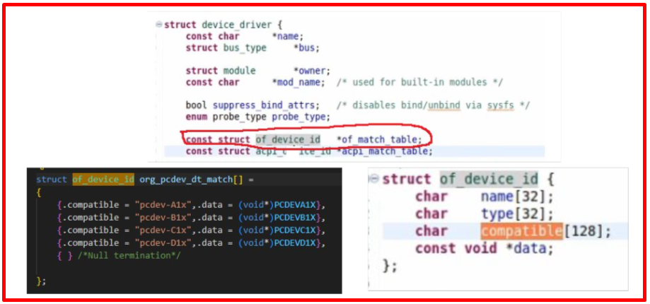   
</p>

​<p align="center">
     
</p>

​<p align="center">
     
</p>

​<p align="center">
     
</p>

​<p align="center">
     
</p>

+ Trong linux, CONFIG_OF là biến để xác định device tree có được support hay không, nếu CONFIG_OF là disable thì linux không hỗ trợ, nên ta phải kiểm tra biến này trước

​<p align="center">
  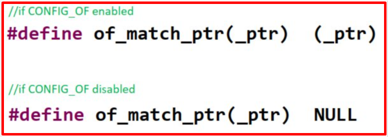   
</p>

## ✔️ Conclusion
Ở bài này chúng ta đã biết về platform device. Tiếp theo chúng ta sẽ thực hành thêm về platform device nhé.


## 💯 Exercise
+ Thực hành theo bài viết

## 📺 NOTE
+ N/A

## 📌 Reference

[1] https://www.cs.columbia.edu/~sedwards/classes/2014/4840/device-drivers.pdf

[2] https://static.lwn.net/images/pdf/LDD3/ch14.pdf

[3] https://www.kernel.org/doc/Documentation/driver-model/

[4] https://bootlin.com/pub/conferences/2013/elce/petazzoni-device-tree-dummies/petazzoni-device-tree-dummies.pdf
