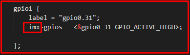
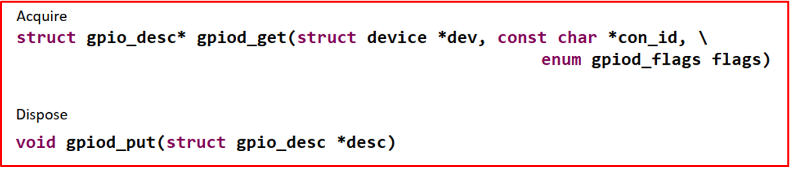
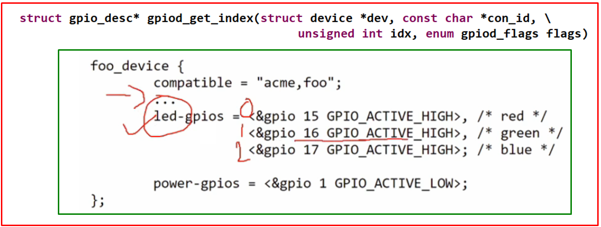
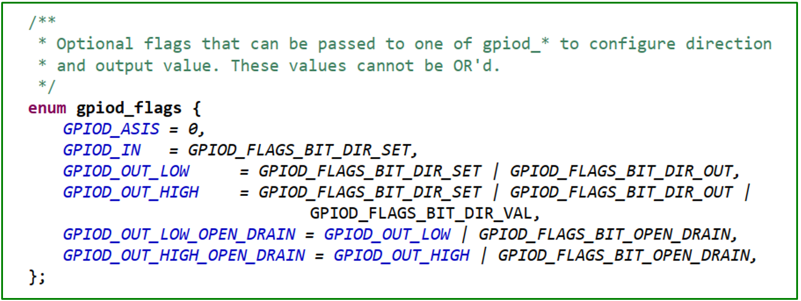
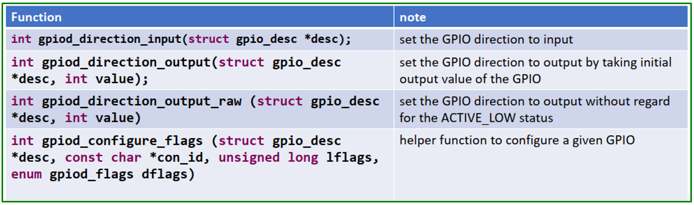
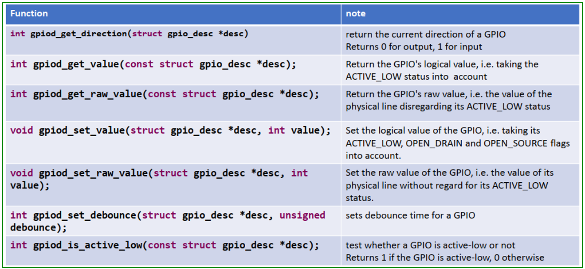
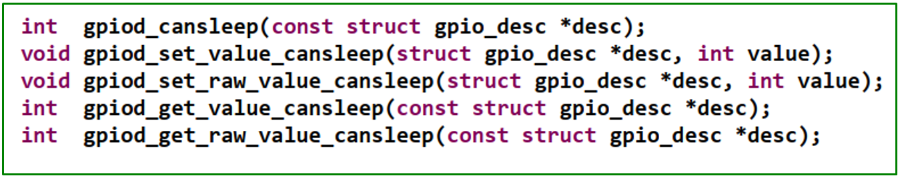

# 💚 Gpio SysFs Device Tree 💛

## 👉 Introduction and Summary

### 1️⃣ Introduction

+ Ở bài trước chúng ta đã tìm hiểu về platform device practice. Nếu các bạn chưa đọc thì xem link này nha [041_Platform_Device_Practice.md](../041_Platform_Device_Practice/041_Platform_Device_Practice.md). Ở bài này chúng ta sẽ thực hành về gpio sysfs device nhé.

### 2️⃣ Summary

Nội dung của bài viết gồm có những phần sau nhé 📢📢📢:
- [I. Introduction and Summary](#👉-introduction-and-summary)

    - [1. Introduction](#1️⃣-introduction)
    - [2. Summary](#2️⃣-summary)
- [II. Contents](#👉-contents)
    - [1. Lý thuyết](#1️⃣-lý-thuyết)
    - [2. Thực hành](#2️⃣-thực-hành)
- [III. Conclusion](#✔️-conclusion)
- [IV. Exercise](#💯-exercise)
- [V. NOTE](#📺-note)
- [VI. Reference](#📌-reference)

## 👉 Contents

### 1️⃣ Lý thuyết
+ Nội dung của bài thực hành là xử lý các GPIO của phần cứng thông qua giao diện Sysfs
+ Thu thập và loại bỏ GPIO, con_id là "imx"

​<p align="center">
     
</p>

+ Thay vì dung mấy hàm bên trên thì ta dung hàm ở dưới vì liên quan đến quản lý resource 

​<p align="center">
     
</p>

+ Con_id = imx

​<p align="center">
     
</p>

+ Hàm dưới để lấy từng thằng 1 trong led-gpios

​<p align="center">
     
</p>

***GPIOD***
+ Trong đường dẫn include/linux/consumer.h 

​<p align="center">
     
</p>

+ Configuring direction and flags 

​<p align="center">
     
</p>

+ Get and set 

​<p align="center">
     
</p>

+ Accessing GPIO value from atomic context 

​<p align="center">
     
</p>

### 2️⃣ Thực hành
+ File dtsi
```xml
/ {
    imx_gpio_devs {
	  
		compatible = "org,imx-gpio-sysfs";
		
		gpio1 {
			label = "gpio0.31";
			imx-gpios = <&gpio0 31 GPIO_ACTIVE_HIGH>;
				
		};

		gpio2 {
			label = "gpio2.3";
			imx-gpios = <&gpio2 3 GPIO_ACTIVE_HIGH>;
		};
		

		gpio3 {
			label = "gpio2.4";
			imx-gpios = <&gpio2 4 GPIO_ACTIVE_HIGH>;
		};
		

		gpio4 {
			label = "usrled0:gpio1.21";
			imx-gpios = <&gpio1 21 GPIO_ACTIVE_HIGH>;
		};

		gpio5 {
			label = "usrled1:gpio1.22";
			imx-gpios = <&gpio1 22 GPIO_ACTIVE_HIGH>;
		};

		gpio6 {
			label = "usled2:gpio1.23";
			imx-gpios = <&gpio1 23 GPIO_ACTIVE_HIGH>;
		};

	};//imx_gpio_devs

}; //root node
```

+ File gpio-sysfs.c
```c
#include <linux/module.h>
#include <linux/kernel.h>
#include <linux/platform_device.h>
#include <linux/string.h>
#include <linux/fs.h>
#include <asm/uaccess.h>
#include <linux/init.h>
#include <linux/device.h>
#include <linux/io.h>
#include <linux/of.h>
#include <linux/of_device.h>
#include<linux/gpio/consumer.h>

#undef pr_fmt
#define pr_fmt(fmt) "%s : " fmt,__func__


MODULE_LICENSE("GPL");
MODULE_AUTHOR("thonv12");
MODULE_DESCRIPTION("A gpio sysfs driver");

/*Device private data structure */
struct gpiodev_private_data
{
	char label[20];
	struct gpio_desc *desc;
};


/*Driver private data structure */
struct gpiodrv_private_data
{
	int total_devices;
	struct class *class_gpio;
	struct device **dev;
};

struct gpiodrv_private_data gpio_drv_data;


ssize_t direction_show(struct device *dev, struct device_attribute *attr,char *buf)
{
	struct gpiodev_private_data *dev_data = dev_get_drvdata(dev);

	int dir;
	char *direction;

	dir = gpiod_get_direction(dev_data->desc);
	if(dir < 0)
		return dir;
	/* if dir = 0 , then show "out". if dir =1 , then show "in" */
	direction = (dir == 0) ? "out":"in";

	return sprintf(buf,"%s\n",direction);

}

ssize_t direction_store(struct device *dev, struct device_attribute *attr,const char *buf, size_t count)
{

	int ret;
	struct gpiodev_private_data *dev_data = dev_get_drvdata(dev);
	if(sysfs_streq(buf,"in") )  /* so sánh 2 chuỗi*/
		ret = gpiod_direction_input(dev_data->desc);
	else if (sysfs_streq(buf,"out"))
		ret = gpiod_direction_output(dev_data->desc,0);
	else
		ret = -EINVAL;

	return ret ? : count;
}

ssize_t value_show(struct device *dev, struct device_attribute *attr,char *buf)
{
	struct gpiodev_private_data *dev_data = dev_get_drvdata(dev);
	int value;
	value = gpiod_get_value(dev_data->desc);
	return sprintf(buf,"%d\n",value);
}

ssize_t value_store(struct device *dev, struct device_attribute *attr,const char *buf, size_t count)
{

	struct gpiodev_private_data *dev_data = dev_get_drvdata(dev);
	int ret;
	long value;

	ret = kstrtol(buf,0,&value);
	if(ret)
		return ret;
	
	gpiod_set_value(dev_data->desc,value);

	return count;
}


ssize_t label_show(struct device *dev, struct device_attribute *attr,char *buf)
{
	struct gpiodev_private_data *dev_data = dev_get_drvdata(dev);
	return sprintf(buf, "%s\n", dev_data->label);
}

static DEVICE_ATTR_RW(direction);
static DEVICE_ATTR_RW(value);
static DEVICE_ATTR_RO(label);

static struct attribute *gpio_attrs[] = 
{
	&dev_attr_direction.attr,
	&dev_attr_value.attr,
	&dev_attr_label.attr,
	NULL
};

static struct attribute_group gpio_attr_group =
{
	.attrs = gpio_attrs
};

static const struct attribute_group *gpio_attr_groups[] = 
{
	&gpio_attr_group,
	NULL

};

int gpio_sysfs_remove(struct platform_device *pdev)
{
	int i;
	
	dev_info(&pdev->dev,"Remove called\n");

	for(i = 0 ; i < gpio_drv_data.total_devices ; i++){
		device_unregister(gpio_drv_data.dev[i]);
	}
	return 0;

}


int gpio_sysfs_probe(struct platform_device *pdev)
{
	struct device *dev = &pdev->dev;

	int i = 0;

	int ret;

	const char *name;


	/*parent device node */
	struct device_node *parent = pdev->dev.of_node;
	struct device_node *child = NULL;

	struct gpiodev_private_data *dev_data;


	gpio_drv_data.total_devices = of_get_child_count(parent);
	if(!gpio_drv_data.total_devices){
		dev_err(dev,"No devices found\n");
		return -EINVAL;
	}

	dev_info(dev,"Total devices found = %d\n",gpio_drv_data.total_devices);

	gpio_drv_data.dev = devm_kzalloc(dev, sizeof(struct device *) * gpio_drv_data.total_devices , GFP_KERNEL);

	for_each_available_child_of_node(parent,child)
	{

		dev_data = devm_kzalloc(dev,sizeof(*dev_data), GFP_KERNEL);
		if(!dev_data){
			dev_err(dev,"Cannot allocate memory\n");
			return -ENOMEM;
		}

		if(of_property_read_string(child,"label",&name) )
		{
			dev_warn(dev,"Missing label information\n");
			snprintf(dev_data->label,sizeof(dev_data->label),"unkngpio%d",i);
		}else{
			strcpy(dev_data->label,name);
			dev_info(dev,"GPIO label = %s\n",dev_data->label);
			
		}

		/* Nhận được tham chiếu đên GPIO dưới dạng con trỏ tới GPIO*/
		dev_data->desc = devm_fwnode_get_gpiod_from_child(dev,"imx",&child->fwnode,\
							GPIOD_ASIS,dev_data->label);
		if(IS_ERR( dev_data->desc)){
			ret = PTR_ERR(dev_data->desc);
			if(ret == -ENOENT)
				dev_err(dev,"No GPIO has been assigned to the requested function and/or index\n");
			return ret;
		}

		/* set the gpio direction to output */
		ret = gpiod_direction_output(dev_data->desc,0);
		if(ret){
			dev_err(dev,"gpio direction set failed \n");
			return ret;
		}

		/*Create devices under /sys/class/imx_gpios */
		gpio_drv_data.dev[i] = device_create_with_groups(gpio_drv_data.class_gpio,dev,0,dev_data,gpio_attr_groups,\
								dev_data->label);
		if(IS_ERR(gpio_drv_data.dev[i])){
			dev_err(dev,"Error in device_create \n");
			return PTR_ERR(gpio_drv_data.dev[i]);
		}
				

		i++;

	}
	return 0;

}


struct of_device_id  gpio_device_match[] = 
{
	{.compatible = "org,imx-gpio-sysfs"},
	{ }
};

struct platform_driver gpiosysfs_platform_driver = 
{
	.probe = gpio_sysfs_probe,
	.remove = gpio_sysfs_remove,
	.driver = {
	       .name = "imx-gpio-syfs",
	       .of_match_table = of_match_ptr(gpio_device_match)
	}      

};

int __init gpio_sysfs_init(void)
{
	gpio_drv_data.class_gpio = class_create(THIS_MODULE,"imx_gpios");
	if(IS_ERR(gpio_drv_data.class_gpio)){
		pr_err("Error in creating class \n");
		return PTR_ERR(gpio_drv_data.class_gpio);
	}

	platform_driver_register(&gpiosysfs_platform_driver);
	pr_info("module load success\n");
	return 0;

}


void __exit gpio_sysfs_exit(void)
{
	platform_driver_unregister(&gpiosysfs_platform_driver);
	
	class_destroy(gpio_drv_data.class_gpio);
	
}

module_init(gpio_sysfs_init);
module_exit(gpio_sysfs_exit);
```

+ File Makefile
```Makefile
KERNELDIR = /home/bv_rzvt/hula/imx-yocto-bsp/build-xwayland/tmp/work/mys_8mmx-poky-linux/linux-imx/5.4-r0/build

obj-m += gpio-sysfs.o

all:
    make -C $(KERN_DIR) M=`pwd` modules

clean:
    make -C $(KERN_DIR) M=`pwd` modules clean
```


+ cd /sys/class/imx_gpios

## ✔️ Conclusion
Ở bài này chúng ta đã biết về sự kết hợp giữa Gpio SysFs và DeviceTree. Tiếp theo chúng ta sẽ tìm hiểu về DeviceTree Overlay nhé.


## 💯 Exercise
+ Thực hành theo bài viết

## 📺 NOTE
+ N/A

## 📌 Reference

[1] https://www.cs.columbia.edu/~sedwards/classes/2014/4840/device-drivers.pdf

[2] https://static.lwn.net/images/pdf/LDD3/ch14.pdf

[3] https://www.kernel.org/doc/Documentation/driver-model/

[4] https://bootlin.com/pub/conferences/2013/elce/petazzoni-device-tree-dummies/petazzoni-device-tree-dummies.pdf
