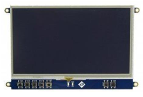
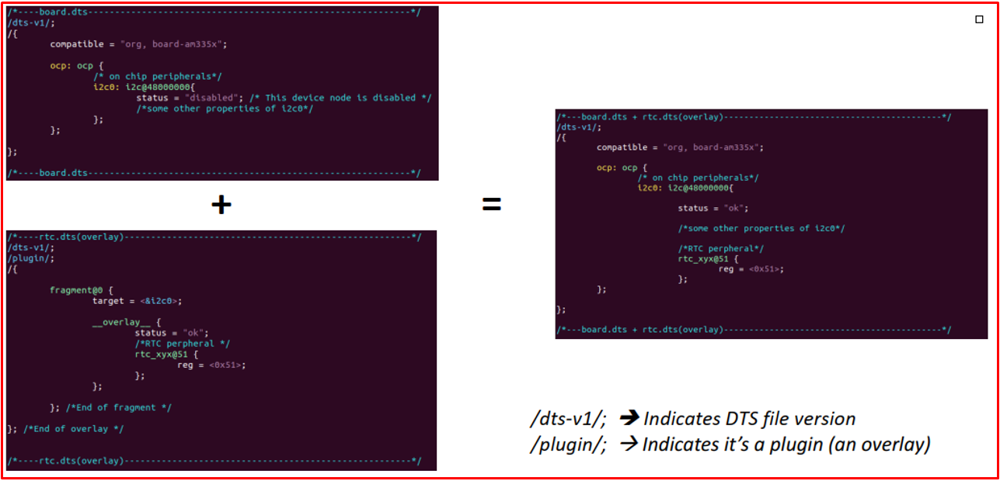

# 💚 Device Tree Overlay 💛

## 👉 Introduction and Summary

### 1️⃣ Introduction

+ Ở bài trước chúng ta đã tìm hiểu về Gpio SysFs DeviceTree. Nếu các bạn chưa đọc thì xem link này nha [042_Gpio_SysFs_DeviceTree.md](../042_Gpio_SysFs_DeviceTree/042_Gpio_SysFs_DeviceTree.md). Ở bài này chúng ta sẽ thực hành về device tree overlay nhé.

### 2️⃣ Summary

Nội dung của bài viết gồm có những phần sau nhé 📢📢📢:
- [I. Introduction and Summary](#👉-introduction-and-summary)

    - [1. Introduction](#1️⃣-introduction)
    - [2. Summary](#2️⃣-summary)
- [II. Contents](#👉-contents)
    - [1. Lý thuyết](#1️⃣-lý-thuyết)
    - [2. Thực hành](#2️⃣-thực-hành)
- [III. Conclusion](#✔️-conclusion)
- [IV. Exercise](#💯-exercise)
- [V. NOTE](#📺-note)
- [VI. Reference](#📌-reference)

## 👉 Contents

### 1️⃣ Lý thuyết
+ File mys-imx8mm-evk.dtb là file đặc biệt, nó chỉ giải thích cho hardware của imx8mm thôi
+ Và file dtb chính sẽ không chứa các hardware detail như ( device node, pin, properties) để cấu hình cho ví dụ là 1 cái LCD, GY86...
+ Ví dụ ta đang sử dụng LCD thì để mà sử dụng LCD này với imx8mm thì cần sửa đổi lại Device Tree
+ Mà để sửa đổi thì có 2 cách
	+ Sửa trực tiếp file dtb (không nên)
	+ Tạo thêm 1 lớp Overlay, để phủ lên dtb chính, lớp này chứa thông tin của LCD

​<p align="center">
     
</p>

+ Mình sẽ tạo ra file I2c-lcd.dts: đây là file source cho lớp overlay
+ Sau đó mình sẽ biên dịch file I2c-lcd.dts ra file I2c-lcd.dtbo: file này là file nhị phân cho lớp overlay cho LCD này
+ Các bạn có thể đọc thêm thông tin ở đây [HERE](https://www.kernel.org/doc/Documentation/devicetree/overlay-notes.txt)

+ Cách thức merge sẽ như ảnh dưới

​<p align="center">
     
</p>

***Các bước làm***
+ B1:Tạo device tree overlay và thêm các đoạn để sửa đổi node thiết bị đích
+ B2:Biên dịch file device tree overlay để tạo tệp .dtbo (device tree overlay binary)
+ B3:Tạo u-boot để tải tệp .dtbo trong khi khởi động bo mạch


+ Để biên dịch cần tải device-tree-compiler về
+ Cú pháp compile: dtc -O dtb -o <output-file-name> -I <input-file-name>
```bash
$ sudo apt install device-tree-compiler
$ dtc -@ -I dts -O dtb -o PCDEV0.dtbo PCDEV0.dts ( Có warning thì kệ )
```

+ Sau đó copy mấy file .dtbo này qua imx8mm, và bỏ vào thư mục /lib/firmware
> sudo cp PCDEV0.dtbo PCDEV1.dtbo PCDEV3.dtbo /media/thonv12/ROOTFS/lib/firmware/

+ **Đối với bbb**:
	+ Sau đó reboot và vào chế độ ubooot: bấm phím bât kì để vào
	+ Sau đó mở file U-boot-v2019.04 /doc/README.fdt-overlays lên
	+ Sau đó làm theo các bước trong file này(đọc bước bên dưới)
	+ Cách 2 là bỏ trực tiếp vào file uEnv.txt để tự build, khi này ta reboot lại là được khi này ta insmod pcd_platform_driver_dt.ko thì tháy các giá trị ta đọc ra đã đực thay đổi như  trong overlay 

```bash
setenv fdtaddr 0x87f00000 
setenv fdtovaddr 0x87fc0000
load ${devtype} ${bootpart} ${fdtaddr} ${bootdir}/base.dtb
	load mmc 0:1 ${fdtaddr} am335x-boneblack.dtb ( mmc0 là thẻ SD, 1 là phân vùng đầu tiên )
	load mmc 0:1 ${fdtovaddr} /lib/firmware/PCDEV0.dtbo
	load mmc 0:2 ${fdtovaddr} /lib/firmware/PCDEV0.dtbo
fdt addr $fdtaddr
fdt resize 8192
fdt apply ${fdtovaddr} 
bootargs console=ttyO0,115200n8 root=/dev/mmcblk0p2 rw rootfstype=ext4 rootwait earlyprintk mem=512M
load mmc 0:1 ${loadaddr} uImage
bootm ${loadaddr} - ${fdtaddr}
```

### 2️⃣ Thực hành
+ Vào file mys-imx8mm-evk.dts và include file hula-devicetree-overlay.dtsi
+ Nội dung của hula-devicetree-overlay.dtsi như sau

```xml
/ {
	pcdev1: pcdev-1 {
		compatible = "pcdev-E1x","pcdev-A1x";
		org,size = <512>;
		org,device-serial-num = "PCDEV1ABC123";
		org,perm = <0x11>;
	};
	
	pcdev2: pcdev-2 {
		compatible = "pcdev-B1x";
		org,size = <1024>;
		org,device-serial-num = "PCDEV2ABC456";
		org,perm = <0x11>;
	};

	pcdev3: pcdev-3 {
		compatible = "pcdev-C1x";
		org,size = <256>;
		org,device-serial-num = "PCDEV3ABC789";
		org,perm = <0x11>;
	};
	
	pcdev4: pcdev-4 {
		compatible = "pcdev-D1x";
		org,size = <2048>;
		org,device-serial-num = "PCDEV4ABC000";
		org,perm = <0x11>;
	};

};
```

+ File Makefile
```Makefile
obj-m := pcd_platform_driver_dt.o
EXTRA_CFLAGS=-Wall

KERNELDIR = /home/bv_rzvt/hula/imx-yocto-bsp/build-xwayland/tmp/work/mys_8mmx-poky-linux/linux-imx/5.4-r0/build


all:
    make -C $(KERN_DIR) M=`pwd` modules

clean:
    make -C $(KERN_DIR) M=`pwd` modules clean
    rm -rf modules.order
```

+ File pcd_platform_driver_dt.c
```c
#include<linux/module.h>
#include<linux/fs.h>
#include<linux/cdev.h>
#include<linux/device.h>
#include<linux/kdev_t.h>
#include<linux/uaccess.h>
#include <linux/platform_device.h>
#include<linux/slab.h>
#include<linux/mod_devicetable.h>
#include<linux/of.h>
#include<linux/of_device.h>
#include "platform.h"


#undef pr_fmt
#define pr_fmt(fmt) "%s : " fmt,__func__


enum pcdev_names
{
	PCDEVA1X,
	PCDEVB1X,
	PCDEVC1X,
	PCDEVD1X
};

struct device_config 
{
	int config_item1;
	int config_item2;
};

struct device_config pcdev_config[] = 
{
	[PCDEVA1X] = {.config_item1 = 60, .config_item2 = 21},
	[PCDEVB1X] = {.config_item1 = 50, .config_item2 = 22},
	[PCDEVC1X] = {.config_item1 = 40, .config_item2 = 23},
	[PCDEVD1X] = {.config_item1 = 30, .config_item2 = 24}
	
};

/*Device private data structure */
struct pcdev_private_data
{
	struct pcdev_platform_data pdata;
	char *buffer;
	dev_t dev_num;
	struct cdev cdev;
};


/*Driver private data structure */
struct pcdrv_private_data
{
	int total_devices;
	dev_t device_num_base;
	struct class *class_pcd;
	struct device *device_pcd;
};

/*Driver's private data */
struct pcdrv_private_data pcdrv_data;

int check_permission(int dev_perm, int acc_mode)
{

	if(dev_perm == RDWR)
		return 0;
	
	//ensures readonly access
	if( (dev_perm == RDONLY) && ( (acc_mode & FMODE_READ) && !(acc_mode & FMODE_WRITE) ) )
		return 0;
	
	//ensures writeonly access
	if( (dev_perm == WRONLY) && ( (acc_mode & FMODE_WRITE) && !(acc_mode & FMODE_READ) ) )
		return 0;

	return -EPERM;

}


loff_t pcd_lseek(struct file *filp, loff_t offset, int whence)
{

	struct pcdev_private_data *pcdev_data = (struct pcdev_private_data*)filp->private_data;

	int max_size = pcdev_data->pdata.size;
	
	loff_t temp;

	pr_info("lseek requested \n");
	pr_info("Current value of the file position = %lld\n",filp->f_pos);

	switch(whence)
	{
		case SEEK_SET:
			if((offset > max_size) || (offset < 0))
				return -EINVAL;
			filp->f_pos = offset;
			break;
		case SEEK_CUR:
			temp = filp->f_pos + offset;
			if((temp > max_size) || (temp < 0))
				return -EINVAL;
			filp->f_pos = temp;
			break;
		case SEEK_END:
			temp = max_size + offset;
			if((temp > max_size) || (temp < 0))
				return -EINVAL;
			filp->f_pos = temp;
			break;
		default:
			return -EINVAL;
	}
	
	pr_info("New value of the file position = %lld\n",filp->f_pos);

	return filp->f_pos;
}

ssize_t pcd_read(struct file *filp, char __user *buff, size_t count, loff_t *f_pos)
{
	struct pcdev_private_data *pcdev_data = (struct pcdev_private_data*)filp->private_data;

	int max_size = pcdev_data->pdata.size;

	pr_info("Read requested for %zu bytes \n",count);
	pr_info("Current file position = %lld\n",*f_pos);

	
	/* Adjust the 'count' */
	if((*f_pos + count) > max_size)
		count = max_size - *f_pos;

	/*copy to user */
	if(copy_to_user(buff,pcdev_data->buffer+(*f_pos),count)){
		return -EFAULT;
	}

	/*update the current file postion */
	*f_pos += count;

	pr_info("Number of bytes successfully read = %zu\n",count);
	pr_info("Updated file position = %lld\n",*f_pos);

	/*Return number of bytes which have been successfully read */
	return count;

}

ssize_t pcd_write(struct file *filp, const char __user *buff, size_t count, loff_t *f_pos)
{
	struct pcdev_private_data *pcdev_data = (struct pcdev_private_data*)filp->private_data;

	int max_size = pcdev_data->pdata.size;
	
	pr_info("Write requested for %zu bytes\n",count);
	pr_info("Current file position = %lld\n",*f_pos);

	
	/* Adjust the 'count' */
	if((*f_pos + count) > max_size)
		count = max_size - *f_pos;

	if(!count){
		pr_err("No space left on the device \n");
		return -ENOMEM;
	}

	/*copy from user */
	if(copy_from_user(pcdev_data->buffer+(*f_pos),buff,count)){
		return -EFAULT;
	}

	/*update the current file postion */
	*f_pos += count;

	pr_info("Number of bytes successfully written = %zu\n",count);
	pr_info("Updated file position = %lld\n",*f_pos);

	/*Return number of bytes which have been successfully written */
	return count;

}


int pcd_open(struct inode *inode, struct file *filp)
{

	int ret;

	int minor_n;
	
	struct pcdev_private_data *pcdev_data;

	/*find out on which device file open was attempted by the user space */

	minor_n = MINOR(inode->i_rdev);
	pr_info("minor access = %d\n",minor_n);

	/*get device's private data structure */
	pcdev_data = container_of(inode->i_cdev,struct pcdev_private_data,cdev);

	/*to supply device private data to other methods of the driver */
	filp->private_data = pcdev_data;
		
	/*check permission */
	ret = check_permission(pcdev_data->pdata.perm,filp->f_mode);

	(!ret)?pr_info("open was successful\n"):pr_info("open was unsuccessful\n");

	return ret;
}

int pcd_release(struct inode *inode, struct file *flip)
{
	pr_info("release was successful\n");

	return 0;
}


/* file operations of the driver */
struct file_operations pcd_fops=
{
	.open = pcd_open,
	.release = pcd_release,
	.read = pcd_read,
	.write = pcd_write,
	.llseek = pcd_lseek,
	.owner = THIS_MODULE
};


/*Called when the device is removed from the system */
int pcd_platform_driver_remove(struct platform_device *pdev)
{

#if 1
	struct pcdev_private_data  *dev_data = dev_get_drvdata(&pdev->dev);

	/*1. Remove a device that was created with device_create() */
	device_destroy(pcdrv_data.class_pcd,dev_data->dev_num);
	
	/*2. Remove a cdev entry from the system*/
	cdev_del(&dev_data->cdev);


	pcdrv_data.total_devices--;

#endif 
	dev_info(&pdev->dev,"A device is removed\n");
	return 0;
}

struct pcdev_platform_data* pcdev_get_platdata_from_dt(struct device *dev)
{
	struct device_node *dev_node = dev->of_node;
	struct pcdev_platform_data *pdata;

	if(!dev_node)
		/* this probe didnt happen because of device tree node */
		return NULL;

	pdata = devm_kzalloc(dev,sizeof(*pdata),GFP_KERNEL);
	if(!pdata){
		dev_info(dev,"Cannot allocate memory \n");
		return ERR_PTR(-ENOMEM);
	}

	if(of_property_read_string(dev_node,"org,device-serial-num",&pdata->serial_number) ){
		dev_info(dev,"Missing serial number property\n");
		return ERR_PTR(-EINVAL);

	}


	if(of_property_read_u32(dev_node,"org,size",&pdata->size) ){
		dev_info(dev,"Missing size property\n");
		return ERR_PTR(-EINVAL);
	}

	if(of_property_read_u32(dev_node,"org,perm",&pdata->perm) ){
		dev_info(dev,"Missing permission property\n");
		return ERR_PTR(-EINVAL);
	}


	return pdata;


}

struct of_device_id org_pcdev_dt_match[] ;

/*Called when matched platform device is found */
int pcd_platform_driver_probe(struct platform_device *pdev)
{
	int ret;

	struct pcdev_private_data *dev_data;

	struct pcdev_platform_data *pdata;

	struct device *dev = &pdev->dev;

	int driver_data;

	/* used to store matched entry of 'of_device_id' list of this driver */
	const struct of_device_id *match;

	dev_info(dev,"A device is detected\n");

	/*match will always be NULL if LINUX doesnt support device tree i.e CONFIG_OF is off */
	match = of_match_device(of_match_ptr(org_pcdev_dt_match),dev);

	if(match){
		pdata = pcdev_get_platdata_from_dt(dev);
		if(IS_ERR(pdata))
			return PTR_ERR(pdata);
		driver_data = (long)match->data;
	}else{
		pdata = (struct pcdev_platform_data*)dev_get_platdata(dev);
		driver_data =  pdev->id_entry->driver_data;
	}


	if(!pdata){
		dev_info(dev,"No platform data available\n");
		return -EINVAL;
	}

	/*2. Dynamically allocate memory for the device private data  */
	dev_data = devm_kzalloc(&pdev->dev, sizeof(*dev_data),GFP_KERNEL);
	if(!dev_data){
		dev_info(dev,"Cannot allocate memory \n");
		return -ENOMEM;
	}

	/*save the device private data pointer in platform device structure */
	dev_set_drvdata(&pdev->dev,dev_data);

	dev_data->pdata.size = pdata->size;
	dev_data->pdata.perm = pdata->perm;
	dev_data->pdata.serial_number = pdata->serial_number;

	pr_info("Device serial number = %s\n",dev_data->pdata.serial_number);
	pr_info("Device size = %d\n", dev_data->pdata.size);
	pr_info("Device permission = %d\n",dev_data->pdata.perm);

	pr_info("Config item 1 = %d\n",pcdev_config[driver_data].config_item1 );
	pr_info("Config item 2 = %d\n",pcdev_config[driver_data].config_item2 );


	/*3. Dynamically allocate memory for the device buffer using size 
	information from the platform data */
	dev_data->buffer = devm_kzalloc(&pdev->dev,dev_data->pdata.size,GFP_KERNEL);
	if(!dev_data->buffer){
		dev_info(dev,"Cannot allocate memory \n");
		return -ENOMEM;
	}

	/*4. Get the device number */
	dev_data->dev_num = pcdrv_data.device_num_base + pcdrv_data.total_devices;

	/*5. Do cdev init and cdev add */
	cdev_init(&dev_data->cdev,&pcd_fops);
	
	dev_data->cdev.owner = THIS_MODULE;
	ret = cdev_add(&dev_data->cdev,dev_data->dev_num,1);
	if(ret < 0){
		dev_err(dev,"Cdev add failed\n");
		return ret;
	}

	/*6. Create device file for the detected platform device */
	pcdrv_data.device_pcd = device_create(pcdrv_data.class_pcd,dev,dev_data->dev_num,NULL,\
								"pcdev-%d",pcdrv_data.total_devices);
	if(IS_ERR(pcdrv_data.device_pcd)){
		dev_err(dev,"Device create failed\n");
		ret = PTR_ERR(pcdrv_data.device_pcd);
		cdev_del(&dev_data->cdev);
		return ret;
		
	}

	pcdrv_data.total_devices++;

	dev_info(dev,"Probe was successful\n");

	return 0;

}

struct platform_device_id pcdevs_ids[] = 
{
	{.name = "pcdev-A1x",.driver_data = PCDEVA1X},
	{.name = "pcdev-B1x",.driver_data = PCDEVB1X},
	{.name = "pcdev-C1x",.driver_data = PCDEVC1X},
	{.name = "pcdev-D1x",.driver_data = PCDEVD1X},
	{ } /*Null termination */
};

struct of_device_id org_pcdev_dt_match[] = 
{
	{.compatible = "pcdev-A1x",.data = (void*)PCDEVA1X},
	{.compatible = "pcdev-B1x",.data = (void*)PCDEVB1X},
	{.compatible = "pcdev-C1x",.data = (void*)PCDEVC1X},
	{.compatible = "pcdev-D1x",.data = (void*)PCDEVD1X},
	{ } /*Null termination*/

};

struct platform_driver pcd_platform_driver = 
{
	.probe = pcd_platform_driver_probe,
	.remove = pcd_platform_driver_remove,
	.id_table = pcdevs_ids,
	.driver = {
		.name = "pseudo-char-device",
		.of_match_table = of_match_ptr(org_pcdev_dt_match)
	}
};


#define MAX_DEVICES 10

static int __init pcd_platform_driver_init(void)
{
	int ret;

	/*1. Dynamically allocate a device number for MAX_DEVICES */
	ret = alloc_chrdev_region(&pcdrv_data.device_num_base,0,MAX_DEVICES,"pcdevs");
	if(ret < 0){
		pr_err("Alloc chrdev failed\n");
		return ret;
	}

	/*2. Create device class under /sys/class */
	pcdrv_data.class_pcd = class_create(THIS_MODULE,"pcd_class");
	if(IS_ERR(pcdrv_data.class_pcd)){
		pr_err("Class creation failed\n");
		ret = PTR_ERR(pcdrv_data.class_pcd);
		unregister_chrdev_region(pcdrv_data.device_num_base,MAX_DEVICES);
		return ret;
	}

	/*3. Register a platform driver */
	platform_driver_register(&pcd_platform_driver);
	
	pr_info("pcd platform driver loaded\n");
	
	return 0;

}


static void __exit pcd_platform_driver_cleanup(void)
{
	/*1.Unregister the platform driver */
	platform_driver_unregister(&pcd_platform_driver);

	/*2.Class destroy */
	class_destroy(pcdrv_data.class_pcd);

	/*3.Unregister device numbers for MAX_DEVICES */
	unregister_chrdev_region(pcdrv_data.device_num_base,MAX_DEVICES);
	
	pr_info("pcd platform driver unloaded\n");

}


module_init(pcd_platform_driver_init);
module_exit(pcd_platform_driver_cleanup);

//module_platform_driver(pcd_platform_driver);

MODULE_LICENSE("GPL");
MODULE_AUTHOR("thonv12");
MODULE_DESCRIPTION("A pseudo character platform driver which handles n platform pcdevs");
```

+ platform.h
```h

/*platform data of the pcdev */
struct pcdev_platform_data
{
	int size;
	int perm;
	const char *serial_number;

};

/*Permission codes */
#define RDWR 0x11
#define RDONLY 0x01
#define WRONLY 0x10
```

## ✔️ Conclusion
Ở bài này chúng ta đã biết Device Tree Overlay. Tiếp theo chúng ta sẽ tìm hiểu về Device Model Sysfs nhé.


## 💯 Exercise
+ Thực hành theo bài viết

## 📺 NOTE
+ N/A

## 📌 Reference

[1] https://www.cs.columbia.edu/~sedwards/classes/2014/4840/device-drivers.pdf

[2] https://static.lwn.net/images/pdf/LDD3/ch14.pdf

[3] https://www.kernel.org/doc/Documentation/driver-model/

[4] https://bootlin.com/pub/conferences/2013/elce/petazzoni-device-tree-dummies/petazzoni-device-tree-dummies.pdf
