# 💚 Device Model Sysfs 💛

## 👉 Introduction and Summary

### 1️⃣ Introduction

+ Ở bài trước chúng ta đã tìm hiểu về Device Tree Overlay. Nếu các bạn chưa đọc thì xem link này nha [043_DeviceTree_Overlay.md](../043_DeviceTree_Overlay/043_DeviceTree_Overlay.md). Ở bài này chúng ta sẽ thực hành về Device Model Sysfs nhé.

### 2️⃣ Summary

Nội dung của bài viết gồm có những phần sau nhé 📢📢📢:
- [I. Introduction and Summary](#👉-introduction-and-summary)

    - [1. Introduction](#1️⃣-introduction)
    - [2. Summary](#2️⃣-summary)
- [II. Contents](#👉-contents)
    - [1. Lý thuyết](#1️⃣-lý-thuyết)
    - [2. Thực hành](#2️⃣-thực-hành)
- [III. Conclusion](#✔️-conclusion)
- [IV. Exercise](#💯-exercise)
- [V. NOTE](#📺-note)
- [VI. Reference](#📌-reference)

## 👉 Contents

### 1️⃣ Lý thuyết
***Component of Device Model***
+ Struct của device là struct device
+ Struct của driver là struct device_driver

​<p align="center">
  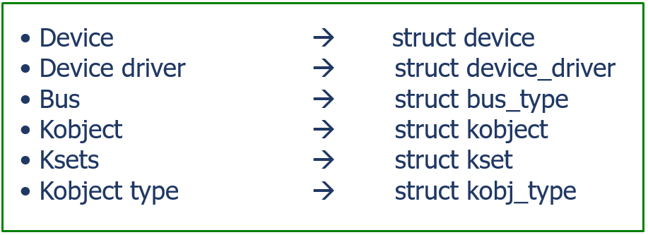   
</p>

***Struct***

​<p align="center">
  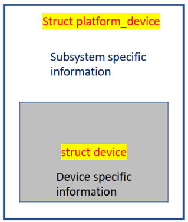   
</p>
​<p align="center">
  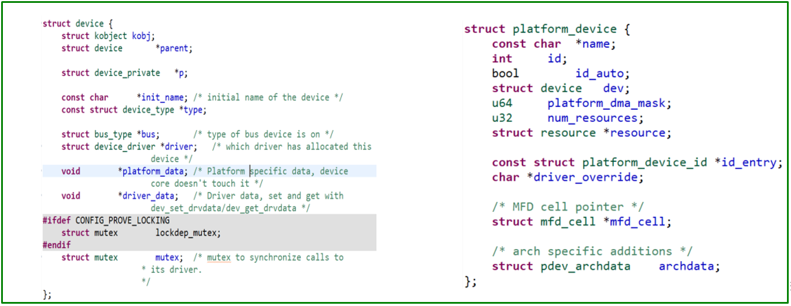   
</p>

***Examble I2C***
+ 1 thiết bị RTC như bên dưới nó là 1 thiết bị nên nó sẽ được đại diện bởi 1 struct device
+ Tuy nhiên RTC lại thuộc hệ thống của I2C vì vậy theo hệ thống con I2C của linux, ta sẽ gọi nó là **I2C client**, và sẽ có 1 struct tên là **i2c_client**

​<p align="center">
  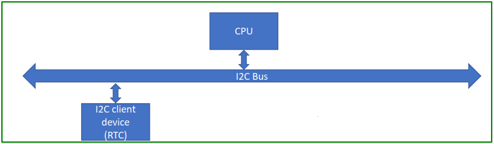   
</p>

***Struct I2c Client***

​<p align="center">
  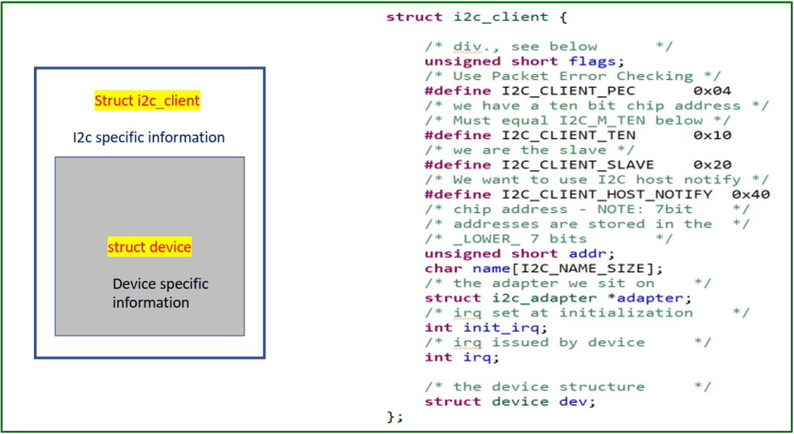   
</p>

***Hệ thống phân cấp***

​<p align="center">
  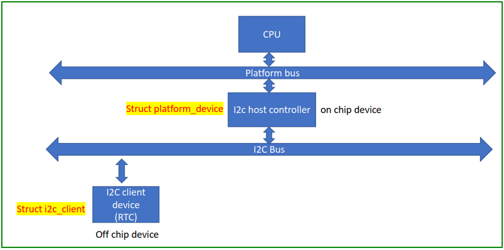   
</p>

***Struct device driver***

​<p align="center">
  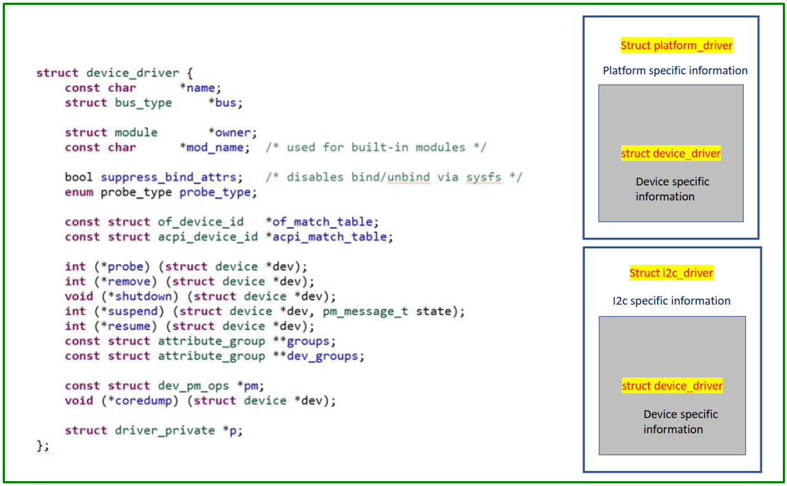   
</p>

***Kobject***
+ Kobject là kernel object
+ Kobjct được sử dụng để đại diện cho **Container** trong Sysfs
+ Kobject cũng được sử dugj để tham chiếu dến các container
+ Kobject có tên riêng, có kiểu riêng và con trỏ cha để kết nối thiết bị linux và phân cấp driver
+ Sử dụng Kobject ta có thể them các thuộc tính vào container, có thể xem các thuộc tính này.
+ Hệ thống sysfs được phổ biến do có kobject, sysfs là đại diện không gian người dùng của kobject
+ 1 số ví dụ cho **container** struct là **struct bus, struct device, struct device_driver**

​<p align="center">
  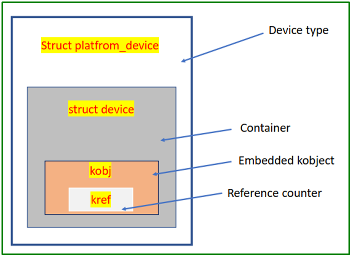   
</p>

+ Kobject được dung để tham chiếu tới các vùng chứa
+ Kobject cho phép container trở thành 1 phần của hệ thống phân cấp  đối tượng
+ Biến đếm tham chiếu bên trong kobject sẽ theo dõi việc sử dụng vùng chứa
+ Bên trong object có 1 tham chiếu ( kref) , bộ đếm tham chiếu này theo dõi các tham chiếu được tạo đến struct device_object này

​<p align="center">
  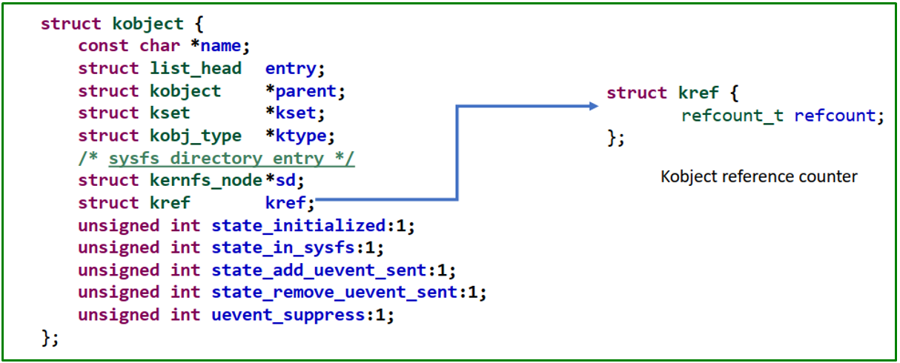   
</p>

+ Bên trong object có 1 tham chiếu ( kref) , bộ đếm tham chiếu này theo dõi các tham chiếu được tạo đến struct device_object này
+ Khi kobject được tạo và bắt đầu chạy, số lượng tham chiếu là 1
+ Khi nào kernel hoặc hệ thống con của kernel thưucj hiện tham chiếu nào tới Object này thì số + thêm 1, tương tự thì sẽ trừ đi 1

​<p align="center">
  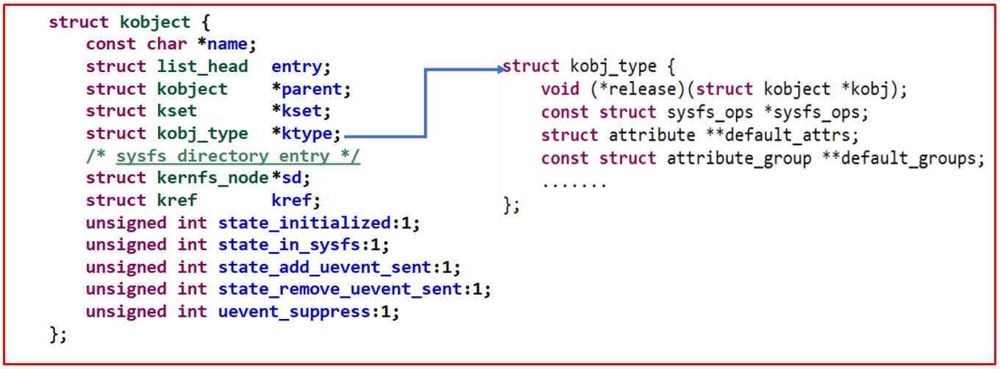   
</p>

+ Khi kref trở thành 0, thì phương thức release sẽ được gọi, và nơi này mình có thể clean vùng nhớ của kobject đi

​<p align="center">
  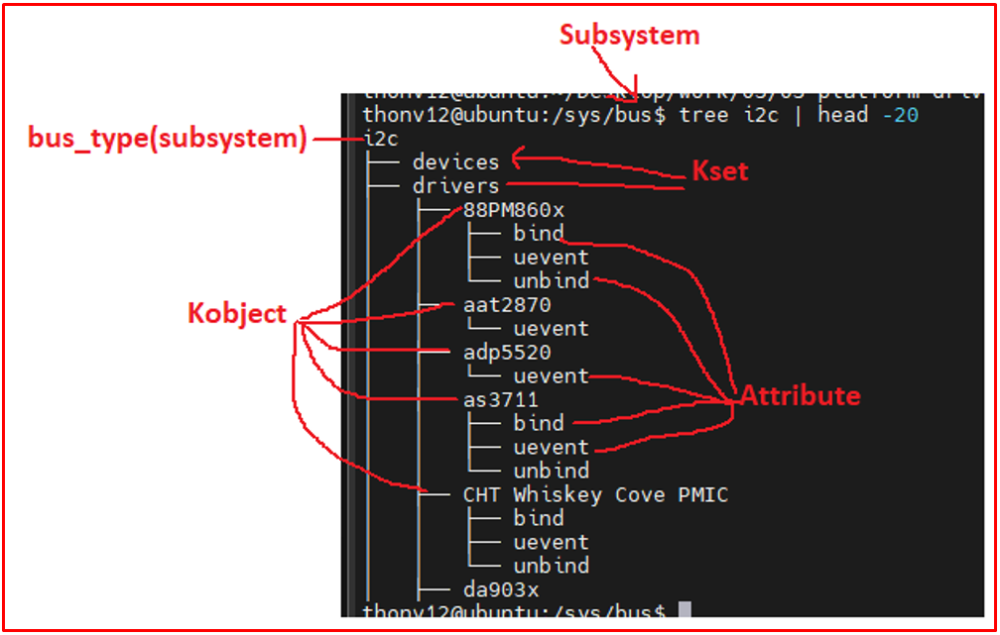   
</p>


***Sysfs***

+ Sysfs là một virtual in-memory file cung cấp

1. Trình bày hệ thống phân cấp kobject của kernel. Toàn bộ sysfs là tập hợp của kobject, bây giờ luôn hiểu **Sysfs** là **Kobject**

2. Cấu trúc liên kết hoàn chỉnh của các devices và drivers của hệ thống về các directories và attributes.

3. Attributes giúp ứng dụng không gian người dùng tương tác với devices và drivers

4. Các phương pháp tiêu chuẩn để truy cập thiết bị bằng ‘class’

**Kobject attribute**
+ Là các file thông thường hoặc tên tượng trưng xuất hiện trong thư mục kobject của sysfs
+ Chúng được sử dụng để hiển thị chi tiết về container của kobject đối với không gian người dùng 
+ Attriube kobject là các file mà dữ liệu device hoặc driver có thể được tiếp xúc với sysfs để ứng dụng không gian người dung có thể xem hoặc sửa đổi nó

+ Custom 1 attribute của 1 device

​<p align="center">
  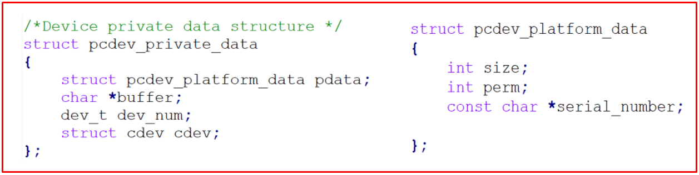   
</p>

***Attribute***
+ Include/linux/sysfs.h

​<p align="center">
  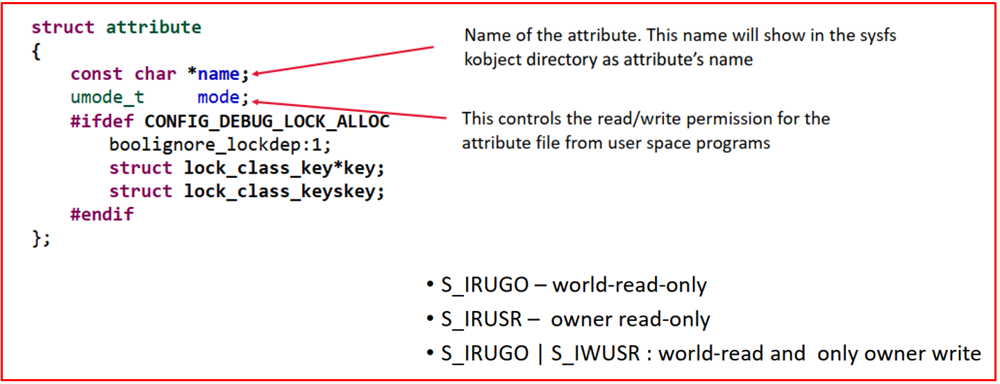   
</p>

***Attribute APIs Sysfs***
+ Include/linux/sysfs.h 
+ Các hàm hỗ trợ có sẵn để tạo sysfs

​<p align="center">
  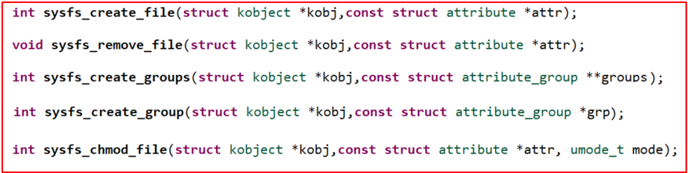   
</p>

***File I/O operation on sysfs attributes***
+ Ta sẽ phải cung cấp các hoạt động read write cho các thuộc tính sysfs
+ Sau khi tạo một file sysfs (thuộc tính), ta nên cung cấp các phương thức đọc và ghi cho chúng để người dùng có thể đọc giá trị của thuộc tính hoặc ghi giá trị mới vào thuộc tính.
+ Ở trong struct attribute không có cái nào để liên kết tới read write nên ta sẽ phải dung 1 struct khác là device_artibute, để tạo 1 thuộc tính cho thiết bị. Struct này là nâng cấp hơn
+ Show: nghĩa là hiên thị thuộc tính cho không gian người dung
+ Stote: nghĩa là lấy giá trị từ không gian người dung và lưu trữ nó vào các thuộc tính

​<p align="center">
  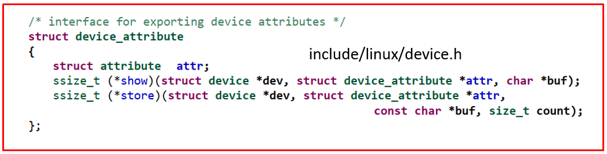   
</p>

***Create sysfs attribute***
+ Ta có thể sử dụng maccro DEVICE_ATTR_XX có trong include/linux/device.h

​<p align="center">
     
</p>

+ 2 cách bên dưới là như nhau

​<p align="center">
  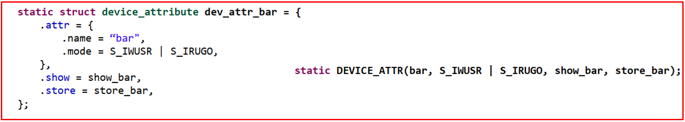   
</p>

***Show method***

​<p align="center">
  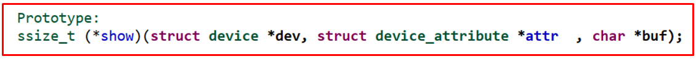   
</p>

+ Show: nghĩa là hiên thị thuộc tính cho không gian người dùng
+ Store: nghĩa là lấy giá trị từ không gian người dung và lưu trữ nó vào các thuộc tính
+ Ở đây ta phải sao chép giá trị của thuộc tính vào con trỏ 'buf’.
+ Chu ý rằng 'buf' không phải là con trỏ cấp độ người dùng.Nó được cung cấp bởi bộ đệm kernel nên kích thước của nó bị giới hạn ở PAGE_SIZE. Đối với kiến trúc ARM, nó dài 4KB (4096 Byte). Vì vậy, trong khi sao chép dữ liệu sang con trỏ 'buf', kích thước không được vượt quá 4096 byte.
+ Để sao chép dữ liệu vào ‘buf’ ta có thể sử dụng sprintf() hoặc scnprintf()

+ Sự khác biệt giữa phương pháp read driver và phương pháp show method
	+ Read driver được không gian người dùng sử dụng để đọc lượng lớn dữ liệu từ trình điều khiển.
	+ Show method được sử dụng để đọc dữ liệu một giá trị hoặc một mảng các giá trị hoặc dữ liệu tương tự có độ dài nhỏ hơn PAGE_SIZE
	+ Sử dụng phương pháp show để đọc bất kỳ dữ liệu cấu hình nào của trình điều khiển hoặc thiết bị của bạn.
	+ Các phương thức show() sẽ trả về số byte được sao chép vào bộ đệm hoặc mã lỗi

+ Khi ta device_create thì ta có truyền parent là dev vào, nên giờ show_serial_num thì ta dùng dev->parent để lấy được giá trị ra

​<p align="center">
  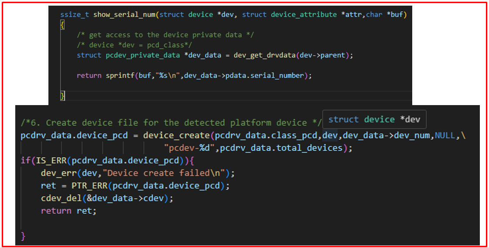   
</p>

***Store method***

​<p align="center">
  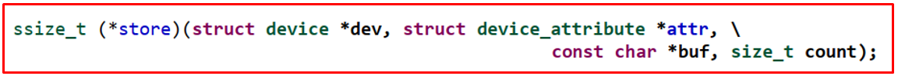   
</p>

+ Tương tự như show method
+ Ở đây, ta đang cần lưu size từ buf của người dùng là 1 số nguyên nên ta sẽ dùng hàm kstrtol để **convert a string to a long**

​<p align="center">
  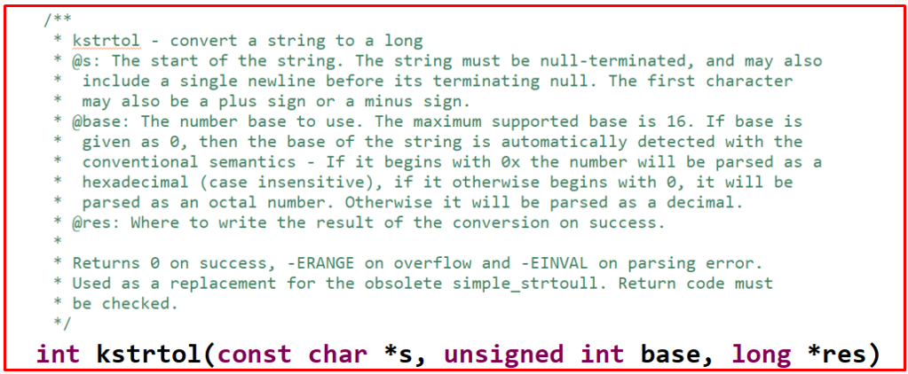   
</p>

***Attribute Group***

​<p align="center">
  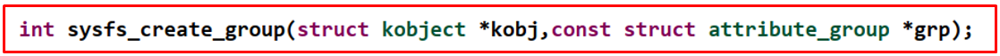   
</p>

+ Thay vì ta gọi sysfs_create_group để tạo sysfs cho mọi thuộc tính thì ta có thể dùng hàm trên

​<p align="center">
  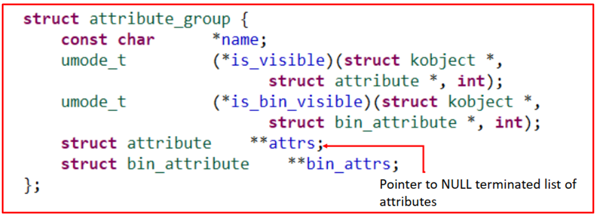   
</p>

+ Ta cần đi tạo 1 group để truyền vào hàm bên trên

​<p align="center">
  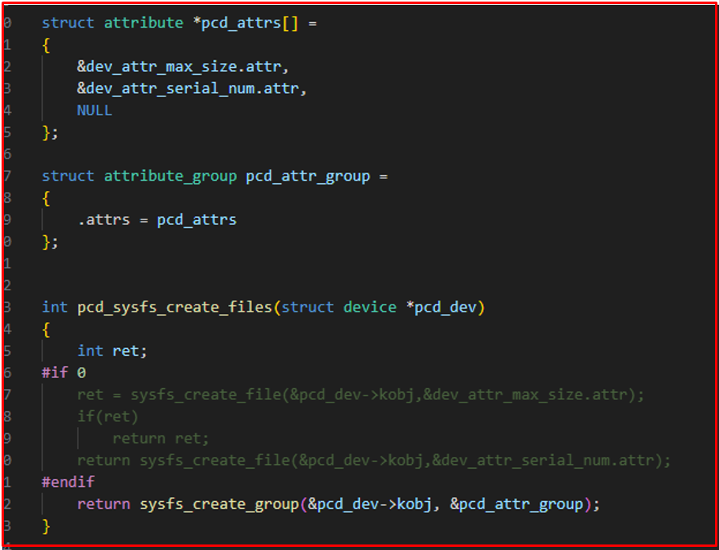   
</p>

### 2️⃣ Thực hành
+ Insmod pcd_device_setup trước để có device, sau đó mới chạy cái của mình, khi này mới có thể chạy probe

+ File Makefile
```Makefile
obj-m := pcd_sysfs.o
pcd_sysfs-objs += pcd_platform_driver_dt_sysfs.o pcd_syscalls.o
ARCH=arm
CROSS_COMPILE=arm-linux-gnueabihf-
HOST_KERN_DIR = /lib/modules/$(shell uname -r)/build/

host:
	make -C $(HOST_KERN_DIR) M=$(PWD) modules
copy-dtb:
	scp ~/workspace/ldd/source/linux_bbb_5.4/arch/arm/boot/dts/am335x-boneblack.dtb debian@192.168.7.2:/home/debian/drivers

copy-drv:
	scp *.ko  debian@192.168.7.2:/home/debian/drivers
```

+ File pcd_platform_driver_dt_sysfs.c
```c
#include "pcd_platform_driver_dt_sysfs.h"


struct device_config pcdev_config[] = 
{
	[PCDEVA1X] = {.config_item1 = 60, .config_item2 = 21},
	[PCDEVB1X] = {.config_item1 = 50, .config_item2 = 22},
	[PCDEVC1X] = {.config_item1 = 40, .config_item2 = 23},
	[PCDEVD1X] = {.config_item1 = 30, .config_item2 = 24}
	
};


/*Driver's private data */
struct pcdrv_private_data pcdrv_data;


/* file operations of the driver */
struct file_operations pcd_fops=
{
	.open = pcd_open,
	.release = pcd_release,
	.read = pcd_read,
	.write = pcd_write,
	.llseek = pcd_lseek,
	.owner = THIS_MODULE
};

ssize_t show_serial_num(struct device *dev, struct device_attribute *attr,char *buf)
{
	/* get access to the device private data */
	/* device *dev = pcd_class*/
	struct pcdev_private_data *dev_data = dev_get_drvdata(dev->parent);

	return sprintf(buf,"%s\n",dev_data->pdata.serial_number);

}

ssize_t show_max_size(struct device *dev, struct device_attribute *attr,char *buf)
{
	/* get access to the device private data */
	struct pcdev_private_data *dev_data = dev_get_drvdata(dev->parent);

	return sprintf(buf,"%d\n",dev_data->pdata.size);

}

ssize_t store_max_size(struct device *dev, struct device_attribute *attr,const char *buf, size_t count)
{
	long result;
	int ret;
	struct pcdev_private_data *dev_data = dev_get_drvdata(dev->parent);
	
	ret = kstrtol(buf,10,&result);  /* 10 là số thập phân*/
	if(ret)
		return ret;

	dev_data->pdata.size = result;

	dev_data->buffer = krealloc(dev_data->buffer,dev_data->pdata.size,GFP_KERNEL);

	return count;
}

/*create 2 variables of struct device_attribute */
static DEVICE_ATTR(max_size,S_IRUGO|S_IWUSR,show_max_size,store_max_size);
static DEVICE_ATTR(serial_num,S_IRUGO,show_serial_num,NULL);

struct attribute *pcd_attrs[] = 
{
	&dev_attr_max_size.attr,
	&dev_attr_serial_num.attr,
	NULL
};

struct attribute_group pcd_attr_group =
{
	.attrs = pcd_attrs
};


int pcd_sysfs_create_files(struct device *pcd_dev)
{
	int ret;
#if 0	
	ret = sysfs_create_file(&pcd_dev->kobj,&dev_attr_max_size.attr);
	if(ret)
		return ret;
	return sysfs_create_file(&pcd_dev->kobj,&dev_attr_serial_num.attr);
#endif 
	return sysfs_create_group(&pcd_dev->kobj, &pcd_attr_group);
}


/*Called when the device is removed from the system */
int pcd_platform_driver_remove(struct platform_device *pdev)
{

#if 1
	struct pcdev_private_data  *dev_data = dev_get_drvdata(&pdev->dev);

	/*1. Remove a device that was created with device_create() */
	device_destroy(pcdrv_data.class_pcd,dev_data->dev_num);
	
	/*2. Remove a cdev entry from the system*/
	cdev_del(&dev_data->cdev);


	pcdrv_data.total_devices--;

#endif 
	dev_info(&pdev->dev,"A device is removed\n");
	return 0;
}

struct pcdev_platform_data* pcdev_get_platdata_from_dt(struct device *dev)
{
	struct device_node *dev_node = dev->of_node;
	struct pcdev_platform_data *pdata;

	if(!dev_node)
		/* this probe didnt happen because of device tree node */
		return NULL;

	pdata = devm_kzalloc(dev,sizeof(*pdata),GFP_KERNEL);
	if(!pdata){
		dev_info(dev,"Cannot allocate memory \n");
		return ERR_PTR(-ENOMEM);
	}

	if(of_property_read_string(dev_node,"org,device-serial-num",&pdata->serial_number) ){
		dev_info(dev,"Missing serial number property\n");
		return ERR_PTR(-EINVAL);

	}


	if(of_property_read_u32(dev_node,"org,size",&pdata->size) ){
		dev_info(dev,"Missing size property\n");
		return ERR_PTR(-EINVAL);
	}

	if(of_property_read_u32(dev_node,"org,perm",&pdata->perm) ){
		dev_info(dev,"Missing permission property\n");
		return ERR_PTR(-EINVAL);
	}


	return pdata;


}

struct of_device_id org_pcdev_dt_match[] ;

/*Called when matched platform device is found */
int pcd_platform_driver_probe(struct platform_device *pdev)
{
	int ret;

	struct pcdev_private_data *dev_data;

	struct pcdev_platform_data *pdata;

	struct device *dev = &pdev->dev;

	int driver_data;

	/* used to store matched entry of 'of_device_id' list of this driver */
	const struct of_device_id *match;

	dev_info(dev,"A device is detected\n");

	/*match will always be NULL if LINUX doesnt support device tree i.e CONFIG_OF is off */
	match = of_match_device(of_match_ptr(org_pcdev_dt_match),dev);

	if(match){
		pdata = pcdev_get_platdata_from_dt(dev);
		if(IS_ERR(pdata))
			return PTR_ERR(pdata);
		driver_data = (long)match->data;
	}else{
		pdata = (struct pcdev_platform_data*)dev_get_platdata(dev);
		driver_data =  pdev->id_entry->driver_data;
	}


	if(!pdata){
		dev_info(dev,"No platform data available\n");
		return -EINVAL;
	}

	/*2. Dynamically allocate memory for the device private data  */
	dev_data = devm_kzalloc(&pdev->dev, sizeof(*dev_data),GFP_KERNEL);
	if(!dev_data){
		dev_info(dev,"Cannot allocate memory \n");
		return -ENOMEM;
	}

	/*save the device private data pointer in platform device structure */
	dev_set_drvdata(&pdev->dev,dev_data);

	dev_data->pdata.size = pdata->size;
	dev_data->pdata.perm = pdata->perm;
	dev_data->pdata.serial_number = pdata->serial_number;

	pr_info("Device serial number = %s\n",dev_data->pdata.serial_number);
	pr_info("Device size = %d\n", dev_data->pdata.size);
	pr_info("Device permission = %d\n",dev_data->pdata.perm);

	pr_info("Config item 1 = %d\n",pcdev_config[driver_data].config_item1 );
	pr_info("Config item 2 = %d\n",pcdev_config[driver_data].config_item2 );


	/*3. Dynamically allocate memory for the device buffer using size 
	information from the platform data */
	dev_data->buffer = devm_kzalloc(&pdev->dev,dev_data->pdata.size,GFP_KERNEL);
	if(!dev_data->buffer){
		dev_info(dev,"Cannot allocate memory \n");
		return -ENOMEM;
	}

	/*4. Get the device number */
	dev_data->dev_num = pcdrv_data.device_num_base + pcdrv_data.total_devices;

	/*5. Do cdev init and cdev add */
	cdev_init(&dev_data->cdev,&pcd_fops);
	
	dev_data->cdev.owner = THIS_MODULE;
	ret = cdev_add(&dev_data->cdev,dev_data->dev_num,1);
	if(ret < 0){
		dev_err(dev,"Cdev add failed\n");
		return ret;
	}

	/*6. Create device file for the detected platform device */
	pcdrv_data.device_pcd = device_create(pcdrv_data.class_pcd,dev,dev_data->dev_num,NULL,\
								"pcdev-%d",pcdrv_data.total_devices);
	if(IS_ERR(pcdrv_data.device_pcd)){
		dev_err(dev,"Device create failed\n");
		ret = PTR_ERR(pcdrv_data.device_pcd);
		cdev_del(&dev_data->cdev);
		return ret;
		
	}

	pcdrv_data.total_devices++;

	ret = pcd_sysfs_create_files(pcdrv_data.device_pcd);
	if(ret){
		device_destroy(pcdrv_data.class_pcd,dev_data->dev_num);
		return ret;
	}

	dev_info(dev,"Probe was successful\n");

	return 0;

}

struct platform_device_id pcdevs_ids[] = 
{
	{.name = "pcdev-A1x",.driver_data = PCDEVA1X},
	{.name = "pcdev-B1x",.driver_data = PCDEVB1X},
	{.name = "pcdev-C1x",.driver_data = PCDEVC1X},
	{.name = "pcdev-D1x",.driver_data = PCDEVD1X},
	{ } /*Null termination */
};

struct of_device_id org_pcdev_dt_match[] = 
{
	{.compatible = "pcdev-A1x",.data = (void*)PCDEVA1X},
	{.compatible = "pcdev-B1x",.data = (void*)PCDEVB1X},
	{.compatible = "pcdev-C1x",.data = (void*)PCDEVC1X},
	{.compatible = "pcdev-D1x",.data = (void*)PCDEVD1X},
	{ } /*Null termination*/

};

struct platform_driver pcd_platform_driver = 
{
	.probe = pcd_platform_driver_probe,
	.remove = pcd_platform_driver_remove,
	.id_table = pcdevs_ids,
	.driver = {
		.name = "pseudo-char-device",
		.of_match_table = of_match_ptr(org_pcdev_dt_match)
	}
};


#define MAX_DEVICES 10

static int __init pcd_platform_driver_init(void)
{
	int ret;

	/*1. Dynamically allocate a device number for MAX_DEVICES */
	ret = alloc_chrdev_region(&pcdrv_data.device_num_base,0,MAX_DEVICES,"pcdevs");
	if(ret < 0){
		pr_err("Alloc chrdev failed\n");
		return ret;
	}

	/*2. Create device class under /sys/class */
	pcdrv_data.class_pcd = class_create(THIS_MODULE,"pcd_class");
	if(IS_ERR(pcdrv_data.class_pcd)){
		pr_err("Class creation failed\n");
		ret = PTR_ERR(pcdrv_data.class_pcd);
		unregister_chrdev_region(pcdrv_data.device_num_base,MAX_DEVICES);
		return ret;
	}

	/*3. Register a platform driver */
	platform_driver_register(&pcd_platform_driver);
	
	pr_info("pcd platform driver loaded\n");
	
	return 0;

}


static void __exit pcd_platform_driver_cleanup(void)
{
	/*1.Unregister the platform driver */
	platform_driver_unregister(&pcd_platform_driver);

	/*2.Class destroy */
	class_destroy(pcdrv_data.class_pcd);

	/*3.Unregister device numbers for MAX_DEVICES */
	unregister_chrdev_region(pcdrv_data.device_num_base,MAX_DEVICES);
	
	pr_info("pcd platform driver unloaded\n");

}


module_init(pcd_platform_driver_init);
module_exit(pcd_platform_driver_cleanup);

//module_platform_driver(pcd_platform_driver);

MODULE_LICENSE("GPL");
MODULE_AUTHOR("thonv");
MODULE_DESCRIPTION("A pseudo character platform driver which handles n platform pcdevs");
```

+ File pcd_platform_driver_dt_sysfs.h
```h
#ifndef PCD_PLATFORM_DT_SYSFS_H
#define PCD_PLATFORM_DT_SYSFS_H

#include<linux/module.h>
#include<linux/fs.h>
#include<linux/cdev.h>
#include<linux/device.h>
#include<linux/kdev_t.h>
#include<linux/uaccess.h>
#include <linux/platform_device.h>
#include<linux/slab.h>
#include<linux/mod_devicetable.h>
#include<linux/of.h>
#include<linux/of_device.h>
#include "platform.h"


#undef pr_fmt
#define pr_fmt(fmt) "%s : " fmt,__func__

int check_permission(int dev_perm, int acc_mode);
loff_t pcd_lseek(struct file *filp, loff_t offset, int whence);
ssize_t pcd_write(struct file *filp, const char __user *buff, size_t count, loff_t *f_pos);
ssize_t pcd_read(struct file *filp, char __user *buff, size_t count, loff_t *f_pos);
int pcd_open(struct inode *inode, struct file *filp);
int pcd_release(struct inode *inode, struct file *filp);


enum pcdev_names
{
	PCDEVA1X,
	PCDEVB1X,
	PCDEVC1X,
	PCDEVD1X
};

struct device_config 
{
	int config_item1;
	int config_item2;
};


/*Device private data structure */
struct pcdev_private_data
{
	struct pcdev_platform_data pdata;
	char *buffer;
	dev_t dev_num;
	struct cdev cdev;
};


/*Driver private data structure */
struct pcdrv_private_data
{
	int total_devices;
	dev_t device_num_base;
	struct class *class_pcd;
	struct device *device_pcd;
};

#endif
```

+ File pcd_syscalls.c
```c

#include "pcd_platform_driver_dt_sysfs.h"


int check_permission(int dev_perm, int acc_mode)
{

	if(dev_perm == RDWR)
		return 0;
	
	//ensures readonly access
	if( (dev_perm == RDONLY) && ( (acc_mode & FMODE_READ) && !(acc_mode & FMODE_WRITE) ) )
		return 0;
	
	//ensures writeonly access
	if( (dev_perm == WRONLY) && ( (acc_mode & FMODE_WRITE) && !(acc_mode & FMODE_READ) ) )
		return 0;

	return -EPERM;

}


loff_t pcd_lseek(struct file *filp, loff_t offset, int whence)
{

	struct pcdev_private_data *pcdev_data = (struct pcdev_private_data*)filp->private_data;

	int max_size = pcdev_data->pdata.size;
	
	loff_t temp;

	pr_info("lseek requested \n");
	pr_info("Current value of the file position = %lld\n",filp->f_pos);

	switch(whence)
	{
		case SEEK_SET:
			if((offset > max_size) || (offset < 0))
				return -EINVAL;
			filp->f_pos = offset;
			break;
		case SEEK_CUR:
			temp = filp->f_pos + offset;
			if((temp > max_size) || (temp < 0))
				return -EINVAL;
			filp->f_pos = temp;
			break;
		case SEEK_END:
			temp = max_size + offset;
			if((temp > max_size) || (temp < 0))
				return -EINVAL;
			filp->f_pos = temp;
			break;
		default:
			return -EINVAL;
	}
	
	pr_info("New value of the file position = %lld\n",filp->f_pos);

	return filp->f_pos;
}

ssize_t pcd_read(struct file *filp, char __user *buff, size_t count, loff_t *f_pos)
{
	struct pcdev_private_data *pcdev_data = (struct pcdev_private_data*)filp->private_data;

	int max_size = pcdev_data->pdata.size;

	pr_info("Read requested for %zu bytes \n",count);
	pr_info("Current file position = %lld\n",*f_pos);

	
	/* Adjust the 'count' */
	if((*f_pos + count) > max_size)
		count = max_size - *f_pos;

	/*copy to user */
	if(copy_to_user(buff,pcdev_data->buffer+(*f_pos),count)){
		return -EFAULT;
	}

	/*update the current file postion */
	*f_pos += count;

	pr_info("Number of bytes successfully read = %zu\n",count);
	pr_info("Updated file position = %lld\n",*f_pos);

	/*Return number of bytes which have been successfully read */
	return count;

}

ssize_t pcd_write(struct file *filp, const char __user *buff, size_t count, loff_t *f_pos)
{
	struct pcdev_private_data *pcdev_data = (struct pcdev_private_data*)filp->private_data;

	int max_size = pcdev_data->pdata.size;
	
	pr_info("Write requested for %zu bytes\n",count);
	pr_info("Current file position = %lld\n",*f_pos);

	
	/* Adjust the 'count' */
	if((*f_pos + count) > max_size)
		count = max_size - *f_pos;

	if(!count){
		pr_err("No space left on the device \n");
		return -ENOMEM;
	}

	/*copy from user */
	if(copy_from_user(pcdev_data->buffer+(*f_pos),buff,count)){
		return -EFAULT;
	}

	/*update the current file postion */
	*f_pos += count;

	pr_info("Number of bytes successfully written = %zu\n",count);
	pr_info("Updated file position = %lld\n",*f_pos);

	/*Return number of bytes which have been successfully written */
	return count;

}


int pcd_open(struct inode *inode, struct file *filp)
{

	int ret;

	int minor_n;
	
	struct pcdev_private_data *pcdev_data;

	/*find out on which device file open was attempted by the user space */

	minor_n = MINOR(inode->i_rdev);
	pr_info("minor access = %d\n",minor_n);

	/*get device's private data structure */
	pcdev_data = container_of(inode->i_cdev,struct pcdev_private_data,cdev);

	/*to supply device private data to other methods of the driver */
	filp->private_data = pcdev_data;
		
	/*check permission */
	ret = check_permission(pcdev_data->pdata.perm,filp->f_mode);

	(!ret)?pr_info("open was successful\n"):pr_info("open was unsuccessful\n");

	return ret;
}

int pcd_release(struct inode *inode, struct file *flip)
{
	pr_info("release was successful\n");

	return 0;
}
```

+ File platform.h
```h

/*platform data of the pcdev */
struct pcdev_platform_data
{
	int size;
	int perm;
	const char *serial_number;

};

/*Permission codes */

#define RDWR 0x11
#define RDONLY 0x01
#define WRONLY 0x10
```

## ✔️ Conclusion
Ở bài này chúng ta đã biết Device Model Sysfs. Tiếp theo chúng ta sẽ tìm hiểu về PinControl nhé.


## 💯 Exercise
+ Thực hành theo bài viết


## 📺 NOTE
+ N/A

## 📌 Reference

[1] https://www.cs.columbia.edu/~sedwards/classes/2014/4840/device-drivers.pdf

[2] https://static.lwn.net/images/pdf/LDD3/ch14.pdf

[3] https://www.kernel.org/doc/Documentation/driver-model/

[4] https://bootlin.com/pub/conferences/2013/elce/petazzoni-device-tree-dummies/petazzoni-device-tree-dummies.pdf
