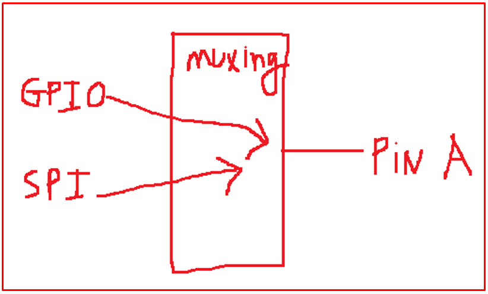
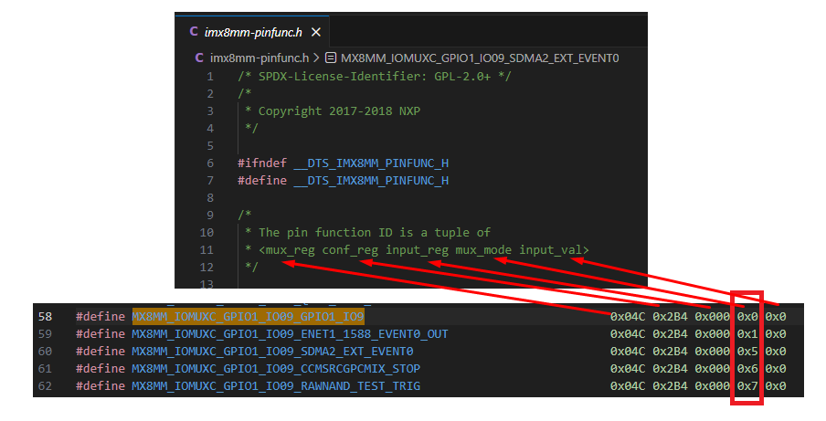
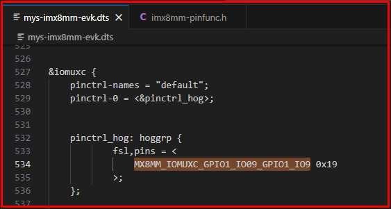
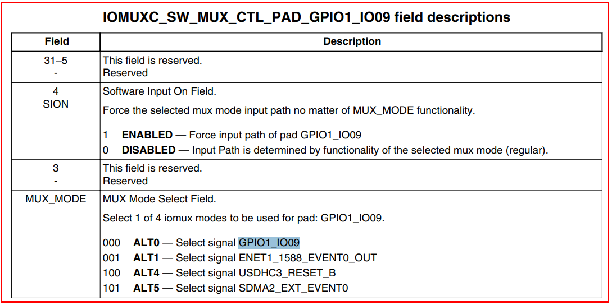
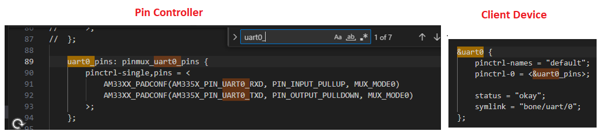
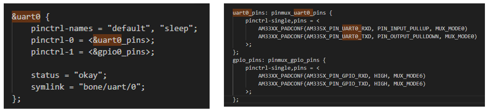
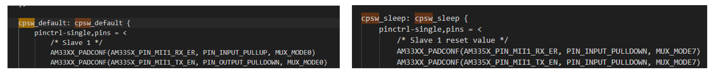

# 💚 Pin Control 💛

## 👉 Introduction and Summary

### 1️⃣ Introduction

+ Ở bài trước chúng ta đã tìm hiểu về device model sysfs. Nếu các bạn chưa đọc thì xem link này nha [044_Device_Model_Sysfs.md](../044_Device_Model_Sysfs/044_Device_Model_Sysfs.md). Ở bài này chúng ta sẽ tìm hiểu về Pin Control nhé.

### 2️⃣ Summary

Nội dung của bài viết gồm có những phần sau nhé 📢📢📢:
- [I. Introduction and Summary](#👉-introduction-and-summary)

    - [1. Introduction](#1️⃣-introduction)
    - [2. Summary](#2️⃣-summary)
- [II. Contents](#👉-contents)
    - [1. Lý thuyết](#1️⃣-lý-thuyết)
    - [2. Thực hành](#2️⃣-thực-hành)
- [III. Conclusion](#✔️-conclusion)
- [IV. Exercise](#💯-exercise)
- [V. NOTE](#📺-note)
- [VI. Reference](#📌-reference)

## 👉 Contents

### 1️⃣ Lý thuyết
+ 1 chân có thể có nhiều chức năng nên ta sẽ phải chọn chức năng cho chân đó, như ALT function trong GPIO
+ Nếu số lượng chức năng cho 1 chân đó quá nhiều thì ta sẽ phải chọn chức năng mà ta đang mong muốn, thường thì nó là ALT Function hay còn gọi là Pin Muxing

​<p align="center">
     
</p>

+ Hiện tại thì 1 chân sẽ có rất nhiều chức năng, bây giờ mà đi thiết lập ALT function như vậy thì tốn thời gian và mệt. Vì vậy, bên BSP đã làm sẵn các công việc này rồi và thông qua 2 subsystem là GPIO và Pinctrl
+ Pincontrol subsystem và Device Tree sẽ đi kèm với nhau


***Pincontrol và Client device***

+ Đọc trang 58 trong file [FILE](https://drive.google.com/file/d/1gqVU-K1JttKSbkjafNdUaeNWy4wKiNsq/view)

+ Ta cd tới /home/bv_rzvt/hula/imx-yocto-bsp/build-xwayland/tmp/work-shared/mys-8mmx/kernel-source/arch/arm64/boot/dts/myir

+ NXP pinctrl configuration format: **<mux_reg conf_reg input_reg mux_val input_val pad_val>**
    + mux_reg: Multiplex register offset address
    + conf_reg: Configure register offset address
    + input_reg: Input register offset address
    + mux_val: Multiplex register value
    + input_val: Input register value
    + pad_val: Configuration of pin speed, up and down, etc

​<p align="center">
     
</p>

+ Trong cấu hình này **<mux_reg conf_reg input_reg mux_val input_val pad_val>** ta sẽ thấy
	+ mux_val là giá trị cho thanh ghi mux_reg
	+ input_val là giá trị cho thanh ghi input_reg
	+ Như vậy có pad_val là chưa biết và là giá trị cho thanh ghi conf_reg
+ Để biết giá trị pad_val ta đi tìm trong file mys-imx8mm-evk.dts ta sẽ thấy MX8MM_IOMUXC_GPIO1_IO09_GPIO1_IO9

​<p align="center">
     
</p>

+ Giải thích
	+ Trong trang 1315 của RM [FILE](https://drive.google.com/file/d/1RfHiLUjIHhKrbWMZgEbLz6vVHDb9rfrY/view?usp=sharing) ta thấy có field MUX_MODE. Từ field này ta sẽ chọn ALT function cho pin
	+ Ta thấy số 0 là GPIO1_IO09
	+ Ta thấy số 1 là ENET1_1588_EVENT0_OUT
	+ Ta thấy số 4 là USDHC3_RESET_B
	+ Ta thấy số 5 là SDMA2_EXT_EVENT0


​<p align="center">
     
</p>

​<p align="center">
     
</p>

+ Pincontroler là đi cấu hình
+ Còn Client device là đi dùng nó

​<p align="center">
     
</p>

***Pincontrol - State***
+ Các thiết bị ví dụ UART nó sẽ có nhiều state- các trạng thái khác nhau như sleep, default  nên các chân tương ứng cũng có trạng thái này
+ Ví dụ ở trạng thái mặc định, UART đang hoạt động, nên các chân đang được sử dụng sẽ được muxing thành chức năng UART
+ Ở trạng thái nghỉ, để tiết kiệm năng lựng, các chân này có thể muxing thành GPIO hoặc có thể cấu hình trực tiếp để xuất ra mức cao

+ Khi chọn name là default thì sẽ là uart0 còn chọn là sleep thì sẽ là gpio, ví dụ như dưới

​<p align="center">
     
</p>

***Pincontrol – ID và Name***
+ Mỗi 1 state sẽ tương ứng với 1 ID, là 1 số nguyên bắt đầu từ 0 và tăng dần
+ Chân ở trạng thái thứ 0 sẽ được định nghĩa trong pinctrl-0, pin thứ 1 sẽ là pinctrl-1
+ Khi thiết bị ở trạng thái mặc đingj, hệ thống sẽ tự động xác lập chức năng dựa theo cpsw_dèault, tương tự slepp thì là  cpsw_slepp

​<p align="center">
     
</p>

### 2️⃣ Thực hành
+ 01_gpio_sysfs_lcd
+ File hula.dtsi
```xml

/ {
	pcdev1: pcdev-1 {
		compatible = "pcdev-E1x","pcdev-A1x";
		org,size = <512>;
		org,device-serial-num = "PCDEV1ABC123";
		org,perm = <0x11>;
	};
	
	pcdev2: pcdev-2 {
		compatible = "pcdev-B1x";
		org,size = <1024>;
		org,device-serial-num = "PCDEV2ABC456";
		org,perm = <0x11>;
	};

	pcdev3: pcdev-3 {
		compatible = "pcdev-C1x";
		org,size = <256>;
		org,device-serial-num = "PCDEV3ABC789";
		org,perm = <0x11>;
	};
	
	pcdev4: pcdev-4 {
		compatible = "pcdev-D1x";
		org,size = <2048>;
		org,device-serial-num = "PCDEV4ABC000";
		org,perm = <0x11>;
	};

		bone_gpio_devs {
		
			compatible = "org,bone-gpio-sysfs";
			pinctrl-single,names = "default";
			pinctrl-0 = <&p8_gpios>;
		
			gpio1 {
				label = "gpio2.2";
				bone-gpios = <&gpio2 2 GPIO_ACTIVE_HIGH>;
					
			};

			gpio2 {
				label = "gpio2.7";
				bone-gpios = <&gpio2 7 GPIO_ACTIVE_HIGH>;
			};
			

			gpio3 {
				label = "gpio2.8";
				bone-gpios = <&gpio2 8 GPIO_ACTIVE_HIGH>;
			};
			
			
			gpio4 {
				label = "gpio2.9";
				bone-gpios = <&gpio2 9 GPIO_ACTIVE_HIGH>;
			};

			gpio5{
				label = "gpio2.10";
				bone-gpios = <&gpio2 10 GPIO_ACTIVE_HIGH>;
			};

			gpio6{
				label = "gpio2.11";
				bone-gpios = <&gpio2 11 GPIO_ACTIVE_HIGH>;
			};

			gpio7{
				label = "gpio2.12";
				bone-gpios = <&gpio2 12 GPIO_ACTIVE_HIGH>;
			};

			led1 {
				label = "usrled1:gpio1.22";
				bone-gpios = <&gpio1 22 GPIO_ACTIVE_HIGH>;
			};

			led2 {
				label = "usrled2:gpio1.23";
				bone-gpios = <&gpio1 23 GPIO_ACTIVE_HIGH>;
			};

		};//bone_gpio_devs

       
}; //root node

&tda19988 {
	status = "disabled";
};

&am33xx_pinmux {
	
	p8_gpios: bone_p8_gpios {
		pinctrl-single,pins = < 
			AM33XX_PADCONF(AM335X_PIN_GPMC_ADVN_ALE,PIN_OUTPUT,MUX_MODE7)
			/* AM33XX_PADCONF(AM335X_PIN_LCD_DATA0,PIN_OUTPUT,MUX_MODE7) */
			AM33XX_PADCONF(AM335X_PIN_LCD_DATA1,PIN_OUTPUT,MUX_MODE7) 
			AM33XX_PADCONF(AM335X_PIN_LCD_DATA2,PIN_OUTPUT,MUX_MODE7) 
			AM33XX_PADCONF(AM335X_PIN_LCD_DATA3,PIN_OUTPUT,MUX_MODE7) 
			AM33XX_PADCONF(AM335X_PIN_LCD_DATA4,PIN_OUTPUT,MUX_MODE7) 
			AM33XX_PADCONF(AM335X_PIN_LCD_DATA5,PIN_OUTPUT,MUX_MODE7) 
			AM33XX_PADCONF(AM335X_PIN_LCD_DATA6,PIN_OUTPUT,MUX_MODE7) 
		>;

	};

};
```

+ File gpio-sysfs-lcd.c
```c
#include <linux/module.h>
#include <linux/kernel.h>
#include <linux/platform_device.h>
#include <linux/string.h>
#include <linux/fs.h>
#include <asm/uaccess.h>
#include <linux/init.h>
#include <linux/device.h>
#include <linux/io.h>
#include <linux/of.h>
#include <linux/of_device.h>
#include<linux/gpio/consumer.h>

#undef pr_fmt
#define pr_fmt(fmt) "%s : " fmt,__func__


MODULE_LICENSE("GPL");
MODULE_AUTHOR("thonv12");
MODULE_DESCRIPTION("A gpio sysfs driver");

/*Device private data structure */
struct gpiodev_private_data
{
	char label[20];
	struct gpio_desc *desc;
};


/*Driver private data structure */
struct gpiodrv_private_data
{
	int total_devices;
	struct class *class_gpio;
	struct device **dev;
};

struct gpiodrv_private_data gpio_drv_data;


ssize_t direction_show(struct device *dev, struct device_attribute *attr,char *buf)
{
	struct gpiodev_private_data *dev_data = dev_get_drvdata(dev);

	int dir;
	char *direction;

	dir = gpiod_get_direction(dev_data->desc);
	if(dir < 0)
		return dir;
	/* if dir = 0 , then show "out". if dir =1 , then show "in" */
	direction = (dir == 0) ? "out":"in";

	return sprintf(buf,"%s\n",direction);

}

ssize_t direction_store(struct device *dev, struct device_attribute *attr,const char *buf, size_t count)
{

	int ret;
	struct gpiodev_private_data *dev_data = dev_get_drvdata(dev);
	if(sysfs_streq(buf,"in") )
		ret = gpiod_direction_input(dev_data->desc);
	else if (sysfs_streq(buf,"out"))
		ret = gpiod_direction_output(dev_data->desc,0);
	else
		ret = -EINVAL;

	return ret ? : count;
}

ssize_t value_show(struct device *dev, struct device_attribute *attr,char *buf)
{
	struct gpiodev_private_data *dev_data = dev_get_drvdata(dev);
	int value;
	value = gpiod_get_value(dev_data->desc);
	return sprintf(buf,"%d\n",value);
}

ssize_t value_store(struct device *dev, struct device_attribute *attr,const char *buf, size_t count)
{

	struct gpiodev_private_data *dev_data = dev_get_drvdata(dev);
	int ret;
	long value;

	ret = kstrtol(buf,0,&value);
	if(ret)
		return ret;
	
	gpiod_set_value(dev_data->desc,value);

	return count;
}


ssize_t label_show(struct device *dev, struct device_attribute *attr,char *buf)
{
	struct gpiodev_private_data *dev_data = dev_get_drvdata(dev);
	return sprintf(buf, "%s\n", dev_data->label);
}

static DEVICE_ATTR_RW(direction);
static DEVICE_ATTR_RW(value);
static DEVICE_ATTR_RO(label);

static struct attribute *gpio_attrs[] = 
{
	&dev_attr_direction.attr,
	&dev_attr_value.attr,
	&dev_attr_label.attr,
	NULL
};

static struct attribute_group gpio_attr_group =
{
	.attrs = gpio_attrs
};

static const struct attribute_group *gpio_attr_groups[] = 
{
	&gpio_attr_group,
	NULL

};

int gpio_sysfs_remove(struct platform_device *pdev)
{
	int i;
	
	dev_info(&pdev->dev,"Remove called\n");

	for(i = 0 ; i < gpio_drv_data.total_devices ; i++){
		device_unregister(gpio_drv_data.dev[i]);
	}
	return 0;

}


int gpio_sysfs_probe(struct platform_device *pdev)
{
	struct device *dev = &pdev->dev;

	int i = 0;

	int ret;

	const char *name;


	/*parent device node */
	struct device_node *parent = pdev->dev.of_node;
	struct device_node *child = NULL;

	struct gpiodev_private_data *dev_data;


	gpio_drv_data.total_devices = of_get_child_count(parent);
	if(!gpio_drv_data.total_devices){
		dev_err(dev,"No devices found\n");
		return -EINVAL;
	}

	dev_info(dev,"Total devices found = %d\n",gpio_drv_data.total_devices);

	gpio_drv_data.dev = devm_kzalloc(dev, sizeof(struct device *) * gpio_drv_data.total_devices , GFP_KERNEL);

	for_each_available_child_of_node(parent,child)
	{

		dev_data = devm_kzalloc(dev,sizeof(*dev_data), GFP_KERNEL);
		if(!dev_data){
			dev_err(dev,"Cannot allocate memory\n");
			return -ENOMEM;
		}

		if(of_property_read_string(child,"label",&name) )
		{
			dev_warn(dev,"Missing label information\n");
			snprintf(dev_data->label,sizeof(dev_data->label),"unkngpio%d",i);
		}else{
			strcpy(dev_data->label,name);
			dev_info(dev,"GPIO label = %s\n",dev_data->label);
			
		}

		dev_data->desc = devm_fwnode_get_gpiod_from_child(dev,"bone",&child->fwnode,\
							GPIOD_ASIS,dev_data->label);
		if(IS_ERR( dev_data->desc)){
			ret = PTR_ERR(dev_data->desc);
			if(ret == -ENOENT)
				dev_err(dev,"No GPIO has been assigned to the requested function and/or index\n");
			return ret;
		}

		/* set the gpio direction to output */
		ret = gpiod_direction_output(dev_data->desc,0);
		if(ret){
			dev_err(dev,"gpio direction set failed \n");
			return ret;
		}

		/*Create devices under /sys/class/bone_gpios */
		gpio_drv_data.dev[i] = device_create_with_groups(gpio_drv_data.class_gpio,dev,0,dev_data,gpio_attr_groups,\
								dev_data->label);
		if(IS_ERR(gpio_drv_data.dev[i])){
			dev_err(dev,"Error in device_create \n");
			return PTR_ERR(gpio_drv_data.dev[i]);
		}
				

		i++;

	}
	return 0;

}


struct of_device_id  gpio_device_match[] = 
{
	{.compatible = "org,bone-gpio-sysfs"},
	{ }
};

struct platform_driver gpiosysfs_platform_driver = 
{
	.probe = gpio_sysfs_probe,
	.remove = gpio_sysfs_remove,
	.driver = {
	       .name = "bone-gpio-syfs",
	       .of_match_table = of_match_ptr(gpio_device_match)
	}      

};

int __init gpio_sysfs_init(void)
{
	gpio_drv_data.class_gpio = class_create(THIS_MODULE,"bone_gpios");
	if(IS_ERR(gpio_drv_data.class_gpio)){
		pr_err("Error in creating class \n");
		return PTR_ERR(gpio_drv_data.class_gpio);
	}

	platform_driver_register(&gpiosysfs_platform_driver);
	pr_info("module load success\n");
	return 0;

}


void __exit gpio_sysfs_exit(void)
{
	platform_driver_unregister(&gpiosysfs_platform_driver);
	
	class_destroy(gpio_drv_data.class_gpio);
	
}

module_init(gpio_sysfs_init);
module_exit(gpio_sysfs_exit);
```

+ File gpio.c
```c

#include <stdio.h>
#include <stdarg.h>
#include <stdint.h>
#include <errno.h>
#include <sys/types.h>
#include <sys/stat.h>
#include <fcntl.h>
#include <unistd.h>
#include<string.h>
#include<stdlib.h>
#include "gpio.h"


/*
 *  GPIO configure direction
 *  dir_value : 1 means 'out' , 0 means "in"
 */
int gpio_configure_dir(char *gpio_label, uint8_t dir_value)
{
    int fd;
    char buf[SOME_BYTES];

    snprintf(buf, sizeof(buf), SYS_GPIO_PATH "/%s/direction", gpio_label);

    /* opens the sysfs attribute 'direcito' in the provided sysfs path */
    fd = open(buf, O_WRONLY | O_SYNC);
    if (fd < 0) {
        perror("gpio direction configure\n");
        return fd;
    }

    /* Writes to sysfs attribute 'direction' */
    if (dir_value)
        write(fd, "out", 4); //3+1  +1 for NULL character 
    else
        write(fd, "in", 3);

    close(fd);

    return 0;
}

/*
 *  GPIO write value
 *  out_value : can be either 0 or 1
 */
int gpio_write_value(char *gpio_label, uint8_t out_value)
{
    int fd;
    char buf[SOME_BYTES];

    snprintf(buf, sizeof(buf), SYS_GPIO_PATH "/%s/value", gpio_label);

    fd = open(buf, O_WRONLY | O_SYNC);
    if (fd < 0) {
        perror("gpio write value\n");
        return fd;
    }

    if (out_value)
        write(fd, "1", 2);
    else
        write(fd, "0", 2);

    close(fd);
    return 0;
}

/*
 *  GPIO read value
 */
int gpio_read_value(char *gpio_label)
{
    int fd;
    uint8_t read_value=0;
    char buf[SOME_BYTES];

    snprintf(buf, sizeof(buf), SYS_GPIO_PATH "/%s/value", gpio_label);

    fd = open(buf, O_RDONLY | O_SYNC);
    if (fd < 0) {
        perror("gpio read value\n");
        return fd;
    }

    read(fd, &read_value, 1);

    read_value = atoi(&read_value);

    close(fd);

    return read_value;
}


/*
 *  Opens the sysfs file corresponding to gpio label
 */
int gpio_file_open(char *gpio_label)
{
    int fd;
    char buf[SOME_BYTES];

    snprintf(buf, sizeof(buf), SYS_GPIO_PATH "/%s/value", gpio_label);

    fd = open(buf, O_RDONLY | O_NONBLOCK );

    if (fd < 0) {
        perror("gpio file open\n");
    }

    return fd;
}

/*
 *  close a file
 */
int gpio_file_close(int fd)
{
    return close(fd);
}
```

+ File gpio.h
```h
#ifndef GPIO_DRIVER_H_
#define GPIO_DRIVER_H_


#define SOME_BYTES          100

/* This is the path corresponds to GPIOs in the 'sys' directory */
#define SYS_GPIO_PATH       "/sys/class/bone_gpios"

#define HIGH_VALUE          1
#define LOW_VALUE           0

#define GPIO_DIR_OUT        HIGH_VALUE
#define GPIO_DIR_IN         LOW_VALUE

#define GPIO_LOW_VALUE      LOW_VALUE
#define GPIO_HIGH_VALUE     HIGH_VALUE

//public function prototypes .
int gpio_configure_dir(char *label, uint8_t dir_value);
int gpio_write_value(char *label, uint8_t out_value);
int gpio_read_value(char *label);
int gpio_file_open(char *label);
int gpio_file_close(int fd);

#endif /* GPIO_DRIVER_H_ */
```

+ File lcd_app.c
```c
#include <stdio.h>
#include <stdlib.h>
#include <string.h>
#include <errno.h>
#include <unistd.h>
#include <fcntl.h>
#include <poll.h>
#include<stdint.h>
#include <time.h>
#include <math.h>
#include <sys/types.h>
#include <sys/socket.h>
#include <sys/ioctl.h>
#include <netinet/in.h>
#include <net/if.h>
#include <arpa/inet.h>

#include "lcd.h"
#include "gpio.h"

/*=========================================================================================================
BBB_expansion_header_pins       GPIO number     16x2 LCD pin      Purpose 
===========================================================================================================
P8.7                              gpio2.2          4(RS)           Register selection (Character vs. Command)
P8.46                             gpio2.7          5(RW)           Read/write 
P8.43                             gpio2.8          6(EN)           Enable
P8.44                             gpio2.9          11(D4)          Data line 4
P8.41                             gpio2.10         12(D5)          Data line 5
P8.42                             gpio2.11         13(D6)          Data line 6
P8.39                             gpio2.12         14(D7)          Data line 7 
P9.7(GND)                                          15(BKLTA)       Backlight anode(+)
P9.1(sys_5V supply)                                16(BKLTK)       Backlight cathode(-)

P9.1 (GND)                        ----             1(VSS/GND)      Ground
P9.7(sys_5V supply)               ----             2(VCC)          +5V supply 
============================================================================================================= */


/* Configure the direction of gpios used for LCD connections
 */
int init_gpios(void)
{
	/* configure the direction for LCD pins */
	gpio_configure_dir(GPIO_LCD_RS,GPIO_DIR_OUT);
	gpio_configure_dir(GPIO_LCD_RW,GPIO_DIR_OUT);
	gpio_configure_dir(GPIO_LCD_EN,GPIO_DIR_OUT);
	gpio_configure_dir(GPIO_LCD_D4,GPIO_DIR_OUT);
	gpio_configure_dir(GPIO_LCD_D5,GPIO_DIR_OUT);
	gpio_configure_dir(GPIO_LCD_D6,GPIO_DIR_OUT);
	gpio_configure_dir(GPIO_LCD_D7,GPIO_DIR_OUT);

	gpio_write_value(GPIO_LCD_RS,GPIO_LOW_VALUE);
	gpio_write_value(GPIO_LCD_EN,GPIO_LOW_VALUE);
	gpio_write_value(GPIO_LCD_RW,GPIO_LOW_VALUE);
	gpio_write_value(GPIO_LCD_D4,GPIO_LOW_VALUE);
	gpio_write_value(GPIO_LCD_D5,GPIO_LOW_VALUE);
	gpio_write_value(GPIO_LCD_D6,GPIO_LOW_VALUE);
	gpio_write_value(GPIO_LCD_D7,GPIO_LOW_VALUE);

	return 0;

}

/* This functin prints system's current date and time information on the LCD */
void print_time_and_date()
{
	time_t rawtime;
	struct tm * timeinfo;

	time ( &rawtime );
	timeinfo = localtime ( &rawtime );

	lcd_send_command(DDRAM_FIRST_LINE_BASE_ADDR);

	lcd_printf("%d-%d-%d",1900+timeinfo->tm_year, timeinfo->tm_mon, timeinfo->tm_mday);

	lcd_send_command(DDRAM_SECOND_LINE_BASE_ADDR);

	lcd_printf("%d:%d:%d",timeinfo->tm_hour, timeinfo->tm_min, timeinfo->tm_sec);

}

/* This function gathers the ip address of the system and prints it on LCD */
int print_ip_address()
{
	int fd;
	struct ifreq ifr;

	char iface[] = "usb0";

	fd = socket(AF_INET, SOCK_DGRAM, 0);

	//Type of address to retrieve - IPv4 IP address
	ifr.ifr_addr.sa_family = AF_INET;

	//Copy the interface name in the ifreq structure
	strncpy(ifr.ifr_name , iface , IFNAMSIZ-1);

	ioctl(fd, SIOCGIFADDR, &ifr);

	close(fd);

	//display result
	// 1. print the interface name on the first line
	lcd_send_command(DDRAM_FIRST_LINE_BASE_ADDR);
	lcd_print_string((char *)iface);
	lcd_send_command(DDRAM_SECOND_LINE_BASE_ADDR);
	lcd_print_string((char *)inet_ntoa(( (struct sockaddr_in *)&ifr.ifr_addr )->sin_addr));


	return 0;
}

/* Some silly graphics */
void transition_graphics(void)
{

	sleep(1);

	lcd_set_cursor(1,1);

	lcd_display_clear();

	for (uint8_t n =0 ; n < 2 ; n++)
	{
		for(uint8_t i=0;i<16;i++)
		{
			lcd_print_char('*');
			usleep(75*1000);

		}
			lcd_set_cursor(2,16);
			lcd_send_command(0x04);
	}

	lcd_set_cursor(1,1);
	lcd_send_command(0x06);
	usleep(450 * 1000);

	lcd_display_clear();

}

int main(int argc, char *argv[])
 {
	char msg_buf[81];
	int value;

	printf("This Application prints your message on the 16x2 LCD\n");

	init_gpios();

	printf("Enter your message(Max. 80 char) : ");
	scanf("%80[^\n]s",msg_buf);

	int msg_len = strlen(msg_buf);

	printf("Message %d: %s\n",msg_len,msg_buf);

        /* Initialization of LCD */
	lcd_init();

        sleep(1);

	while(1)
	{
		lcd_display_clear();

		lcd_printf(msg_buf);

		sleep(1);

		/*if message length is > 16, do left shift of message */
		if(msg_len > 16){

			for(int i = 0 ; i < msg_len-16; i++){
				//LCD command to left shift the display 
				lcd_send_command(0x18);
				usleep(500 * 1000);
			}
		}

	
		/*Clear display */
		lcd_display_clear();
		
		/*Return home */
		lcd_display_return_home();	
		
		transition_graphics();
		print_ip_address();	/*Print IP address of BBB */
		sleep(1);
		transition_graphics();
		print_time_and_date();	/* Print data and time info */
		sleep(1);
		transition_graphics();
		
	}

	lcd_deinit();

    	return 0;
}
```

+ File lcd.c
```c
#include <stdio.h>
#include <stdlib.h>
#include <string.h>
#include <stdint.h>
#include <stdarg.h>
#include <unistd.h>

#include "gpio.h"
#include "lcd.h"


static void write_4_bits(uint8_t data);


void lcd_deinit(void)
{
	lcd_display_clear();      	  /* Clear display */
	lcd_display_return_home();        /* Cursor at home position */
}

/* 
 * LCD initalization sequence . 
 * This is written as per the HITACHI HD44780U datasheet 
 * https://www.sparkfun.com/datasheets/LCD/HD44780.pdf
 * Ref. page number 46 , Figure 24 for intialization sequence for 4-bit interface 
 */
void lcd_init(void)
{
	usleep(40 * 1000);
	
	/* RS=0 for LCD command */
	gpio_write_value(GPIO_LCD_RS,LOW_VALUE);
	
	/*R/nW = 0, for write */
	gpio_write_value(GPIO_LCD_RW,LOW_VALUE);
	
	write_4_bits(0x03);
	usleep( 5 * 1000);
	
	write_4_bits(0x03);
	usleep(100);
	
	write_4_bits(0x03);
	write_4_bits(0x02);

    /*4 bit data mode, 2 lines selection , font size 5x8 */
	lcd_send_command(LCD_CMD_4DL_2N_5X8F);
	
	/* Display ON, Cursor ON */
	lcd_send_command(LCD_CMD_DON_CURON);
	
	lcd_display_clear();
	
	/*Address auto increment*/
	lcd_send_command(LCD_CMD_INCADD);	
}

/*Clear the display */
void lcd_display_clear(void)
{
	lcd_send_command(LCD_CMD_DIS_CLEAR);
	/*
	 * check page number 24 of datasheet.
	 * display clear command execution wait time is around 2ms
	 */
	usleep(2000); 
}

/*Cursor returns to home position */
void lcd_display_return_home(void)
{

	lcd_send_command(LCD_CMD_DIS_RETURN_HOME);
	/*
	 * check page number 24 of datasheet.
	 * return home command execution wait time is around 2ms
	 */
	usleep(2000);
}


/**
  * @brief  Set Lcd to a specified location given by row and column information
  * @param  Row Number (1 to 2)
  * @param  Column Number (1 to 16) Assuming a 2 X 16 characters display
  */
void lcd_set_cursor(uint8_t row, uint8_t column)
{
	column--;
	switch (row)
	{
		case 1:
			/* Set cursor to 1st row address and add index*/
			lcd_send_command(column |= DDRAM_FIRST_LINE_BASE_ADDR);
		break;
		case 2:
			/* Set cursor to 2nd row address and add index*/
			lcd_send_command(column |= DDRAM_SECOND_LINE_BASE_ADDR);
		break;
		default:
		break;
	}
}

/* writes 4 bits of data/command on to D4,D5,D6,D7 lines */
static void write_4_bits(uint8_t data)
{
	/* 4 bits parallel data write */
	gpio_write_value(GPIO_LCD_D4, (data >> 0 ) & 0x1);
	gpio_write_value(GPIO_LCD_D5, (data >> 1 ) & 0x1);
	gpio_write_value(GPIO_LCD_D6, (data >> 2 ) & 0x1);
	gpio_write_value(GPIO_LCD_D7, (data >> 3 ) & 0x1);
	
	lcd_enable();
	
}
/*
 * @brief call this function to make LCD latch the data lines in to its internal registers.
 */
void lcd_enable(void)
{ 
	gpio_write_value(GPIO_LCD_EN,LOW_VALUE);
	usleep(1);
	gpio_write_value(GPIO_LCD_EN,HIGH_VALUE);
	usleep(1);
	gpio_write_value(GPIO_LCD_EN,LOW_VALUE);
	usleep(100); /* execution time > 37 micro seconds */
}

/*
 *This function sends a character to the LCD 
 *Here we used 4 bit parallel data transmission. 
 *First higher nibble of the data will be sent on to the data lines D4,D5,D6,D7
 *Then lower niblle of the data will be set on to the data lines D4,D5,D6,D7
 */
void lcd_print_char(uint8_t data)
{

	//RS=1, for user data
	gpio_write_value(GPIO_LCD_RS,HIGH_VALUE);
	
	/*R/nW = 0, for write */
	gpio_write_value(GPIO_LCD_RW,LOW_VALUE);
	
	write_4_bits(data >> 4); /* higher nibble */
	write_4_bits(data);      /* lower nibble */
}

void lcd_print_string(char *message)
{

	do
	{
		lcd_print_char((uint8_t)*message++);
	}
	while (*message != '\0');

}


/*
 *This function sends a command to the LCD 
 */
void lcd_send_command(uint8_t command)
{
	/* RS=0 for LCD command */
	gpio_write_value(GPIO_LCD_RS,LOW_VALUE);
	
	/*R/nW = 0, for write */
	gpio_write_value(GPIO_LCD_RW,LOW_VALUE);
	
	write_4_bits(command >> 4); /* higher nibble */
	write_4_bits(command);     /* lower nibble */

}

void lcd_printf(const char *fmt, ...)
{
      int i;
      uint32_t text_size, letter;
      static char text_buffer[32];
      va_list args;

      va_start(args, fmt);
      text_size = vsprintf(text_buffer, fmt, args);

      // Process the string
      for (i = 0; i < text_size; i++)
      {
        letter = text_buffer[i];

        if (letter == 10)
          break;
        else
        {
          if ((letter > 0x1F) && (letter < 0x80))
              lcd_print_char(letter);
        }
      }
  }
```

+ File lcd.h
```h
/*
 * lcd_driver.h
 *
 *  Created on: 
 */

#ifndef LCD_DRIVER_H_
#define LCD_DRIVER_H_

/* BBB GPIO numbers used to connect with LCD pins */

#if 1
#define GPIO_LCD_RS   "gpio2.2"   /*  Register selection (Character vs. Command) */ 
#define GPIO_LCD_RW   "gpio2.7"   /*  Read/write     */
#define GPIO_LCD_EN   "gpio2.8"   /*  Enable */
#define GPIO_LCD_D4   "gpio2.9"   /*  Data line 4    */
#define GPIO_LCD_D5   "gpio2.10"  /*  Data line 5    */
#define GPIO_LCD_D6   "gpio2.11"  /*  Data line 6    */
#define GPIO_LCD_D7   "gpio2.12"  /*  Data line 7    */
#endif


#if 0
#define GPIO_LCD_RS   "gpio2.2"   /*  Register selection (Character vs. Command) */ 
//#define GPIO_LCD_RW   "gpio2.7"   /*  Read/write     */
#define GPIO_LCD_EN   "gpio2.3"   /*  Enable */
#define GPIO_LCD_D4   "gpio2.5"   /*  Data line 4    */
#define GPIO_LCD_D5   "gpio2.4"  /*  Data line 5    */
#define GPIO_LCD_D6   "gpio1.13"  /*  Data line 6    */
#define GPIO_LCD_D7   "gpio1.12"  /*  Data line 7    */
#endif 

/*LCD commands */
#define LCD_CMD_4DL_2N_5X8F  		0x28
#define LCD_CMD_DON_CURON    		0x0E
#define LCD_CMD_INCADD       		0x06
#define LCD_CMD_DIS_CLEAR    		0X01
#define LCD_CMD_DIS_RETURN_HOME  	0x02


/*Sets CGRAM address. CGRAM data is sent and received after this setting. */
#define LCD_CMD_SET_CGRAM_ADDRESS  			0x40

/* Sets DDRAM address. DDRAM data is sent and received after this setting. */
#define LCD_CMD_SET_DDRAM_ADDRESS  			0x80

#define DDRAM_SECOND_LINE_BASE_ADDR         	(LCD_CMD_SET_DDRAM_ADDRESS | 0x40 )
#define DDRAM_FIRST_LINE_BASE_ADDR          	LCD_CMD_SET_DDRAM_ADDRESS


#define LCD_ENABLE 1
#define LCD_DISABLE 0


//public function prototypes
void lcd_deinit(void);
void lcd_init(void);
void lcd_set_cursor(uint8_t row, uint8_t column);
void lcd_enable(void);
void lcd_print_char(uint8_t ascii_Value);
void lcd_print_string(char *message);
void lcd_send_command(uint8_t command);
void lcd_load_cgram(char tab[], uint8_t charnum);
void lcd_display_clear(void);
void lcd_printf(const char *fmt, ...);
void lcd_display_return_home(void);
int is_lcd_busy(void);

#endif /* LCD_DRIVER_H_ */
```

+ File Makefile
```Makefile
obj-m := gpio-sysfs-lcd.o
EXTRA_CFLAGS=-Wall

BBB_KERNEL := /home/thonv12/Desktop/bbb/kernel/

TOOLCHAIN := /home/thonv12/Desktop/bbb/gcc-linaro-7.5.0-2019.12-x86_64_arm-linux-gnueabihf/bin

PREFIX := arm-linux-gnueabihf-

CROSS_COMPILE_APP=$(TOOLCHAIN)/$(PREFIX)

all:
	make ARCH=arm CROSS_COMPILE=$(TOOLCHAIN)/$(PREFIX) -C $(BBB_KERNEL) M=$(PWD) modules

clean:
	make -C $(BBB_KERNEL) M=$(PWD) clean
	make ARCH=arm CROSS_COMPILE=$(TOOLCHAIN)/$(PREFIX) -C $(BBB_KERNEL) M=$(PWD) clean
	rm -rf *.o *.elf


app: lcd_app.o lcd.o gpio.o lcd_app.elf

lcd_app.o: lcd_app.c
	$(CROSS_COMPILE_APP)gcc -c -o $@ $^

lcd.o: lcd.c
	$(CROSS_COMPILE_APP)gcc -c -o $@ $^

gpio.o: gpio.c
	$(CROSS_COMPILE_APP)gcc -c -o $@ $^

lcd_app.elf: lcd_app.o lcd.o gpio.o
	$(CROSS_COMPILE_APP)gcc -o $@ $^
```

## ✔️ Conclusion
Ở bài này chúng ta đã biết PinControl. Tiếp theo chúng ta sẽ thực hành về PinControl nhé.


## 💯 Exercise
+ Thực hành theo bài viết


## 📺 NOTE
+ N/A

## 📌 Reference

[1] https://www.cs.columbia.edu/~sedwards/classes/2014/4840/device-drivers.pdf

[2] https://static.lwn.net/images/pdf/LDD3/ch14.pdf

[3] https://www.kernel.org/doc/Documentation/driver-model/

[4] https://bootlin.com/pub/conferences/2013/elce/petazzoni-device-tree-dummies/petazzoni-device-tree-dummies.pdf
