# 💚 Pin Control 💛

## 👉 Introduction and Summary

### 1️⃣ Introduction

+ Ở bài trước chúng ta đã tìm hiểu về Pin Control. Nếu các bạn chưa đọc thì xem link này nha [045_PinControl.md](../045_PinControl/045_PinControl.md). Ở bài này chúng ta sẽ thực hành về Pin Control nhé.

### 2️⃣ Summary

Nội dung của bài viết gồm có những phần sau nhé 📢📢📢:
- [I. Introduction and Summary](#👉-introduction-and-summary)

    - [1. Introduction](#1️⃣-introduction)
    - [2. Summary](#2️⃣-summary)
- [II. Contents](#👉-contents)
    - [1. Lý thuyết](#1️⃣-lý-thuyết)
    - [2. Thực hành](#2️⃣-thực-hành)
- [III. Conclusion](#✔️-conclusion)
- [IV. Exercise](#💯-exercise)
- [V. NOTE](#📺-note)
- [VI. Reference](#📌-reference)

## 👉 Contents

### 1️⃣ Lý thuyết
+ 1 pin có thể là Spi, Gpio, Uart …, tuy nhiên mặc định ban đầu là Gpio, nên bài trước ta không cần set mode gì cả
+ Vậy để chuyển mode thành pin cho Spi thì phải làm sao ??

***Pincontrol subsystem***
+ Giả sử mình có 1 con eeprom, nó cần 2 chân i2c và 1 chân Gpio để kết nối tới phần cứng
+ Eeprom này gọi là client device – khi này mình sẽ có 1 cái là eeprom driver
+ Eeprom driver ( driver flatform) để điều khiển eeprom device này 
+ Sẽ  có 1 node device tree để giải thích EEPROM này trong device tree
+ Khi driver và node device tree của epprom này cùng chung compatible thì func probe của driver sẽ được gọi, và trong probe ta có thể điều khiển hoặc cấu hình device eeprom này
+ Tuy nhiên, eeprom không thể thực hiện giao tiếp data được vì cấu hình pin vẫn chưa được thực hiện
+ Nghĩa là driver phải biết được địa chỉ của các thanh ghi cấu hình PAD của 3 pin, mà điều này đã có subsystem là Pincontrol lo hết rồi, nên driver chỉ việc gọi Api hoặc các hàm được cung cấp bởi Pincontrol để thực hiện cấu hình chân của các chân

***Pin control core***
+ Việc triển khai lõi Pinctrl ta có thể tìm thấy trong driver/pinctrl/core.c
+ Điều này cung cấp các chức năng trợ giúp điều khiển pin cho bất kỳ driver nào
+ Duy trì tính độc quyền của mã pin cho thiết bị
+ Cung cấp giao diện gỡ lỗi cho không gian người dùng thông qua sysfs
+ Ví dụ khi 1 thiết bị đã xác nhận 1 số chân thì 1 thiết bị khác nếu cũng cố gắng xác nhận chân đó thì sẽ không thành công

​<p align="center">
  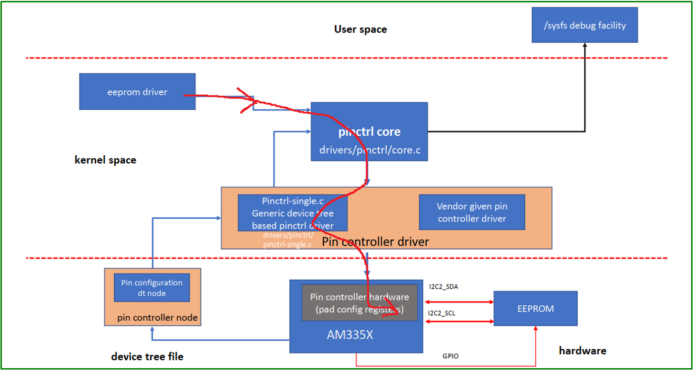   
</p>

***Cấu hình pincontrol***
+ Mà cấu hình pincontrol thì sử dụng device tree nodes
	+ Tạo 1 node device tree cho pin control
	+ Tạo 1 node giải thích chi tiết cấu hình cho các chân riêng lẻ
	+ Sau đó là node xác nhận các chân (client device node)

+ Ví dụ node pincontrol

​<p align="center">
  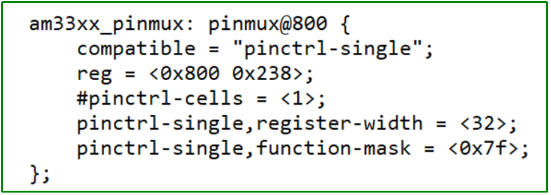   
</p>

***Node***

+ Pinctrl-single,pins = < 0xCD 0x1111>  : thay vì phải cấu hình địa chỉ như trong này thì linux hỗ trợ ta các hàm như bên dưới AM33XX-PADCONF
+ Ví dụ: việc đặt mã pin cho thiết bị có thể được thực hiện bằng:pinctrl-single,pins = <0xdc 0x118>;Trong đó 0xdc là phần offset địa chỉ cơ sở thanh ghi pinctrl cho thanh ghi pinctrl của thiết bị và 0x118 chứa giá trị mong muốn của register pinctrl

​<p align="center">
  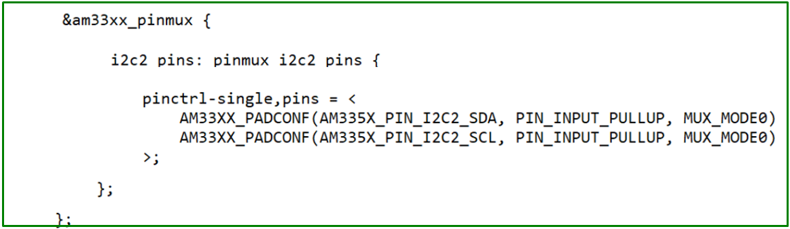   
</p>
​<p align="center">
  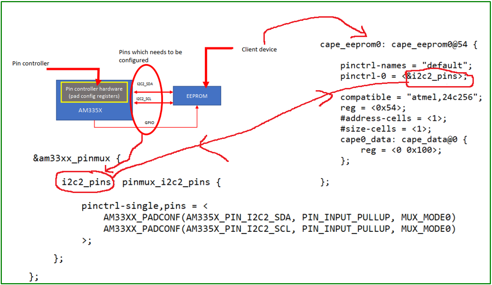   
</p>

***PAD***
+ AM335x pad configuration macro
+ Include/bt-bindings/pinctrl/omap.h 

​<p align="center">
  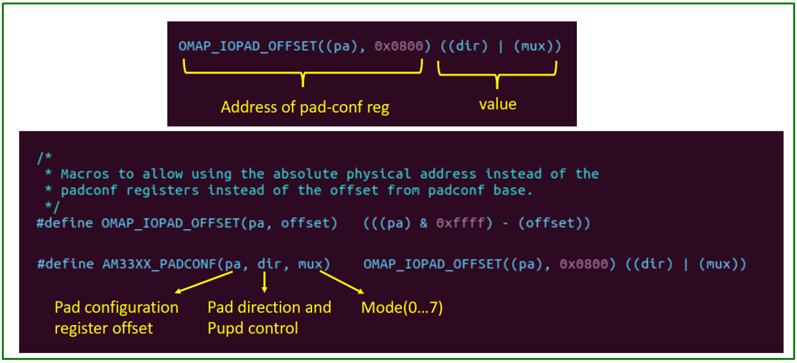   
</p>

​<p align="center">
  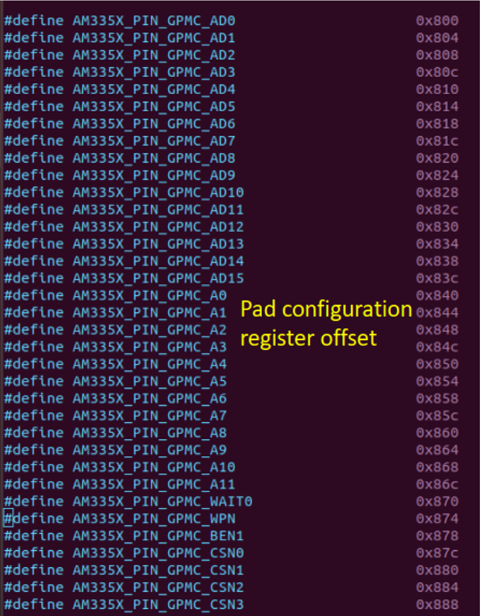   
</p>

***LDC***
​<p align="center">
  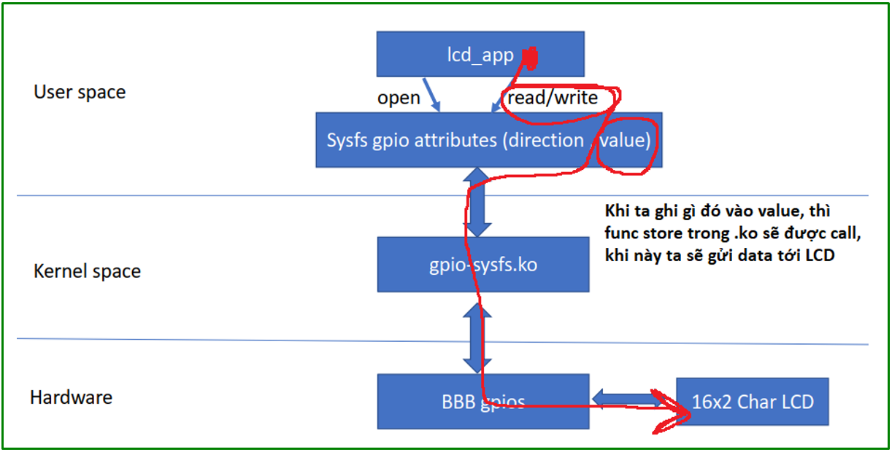   
</p>
​<p align="center">
  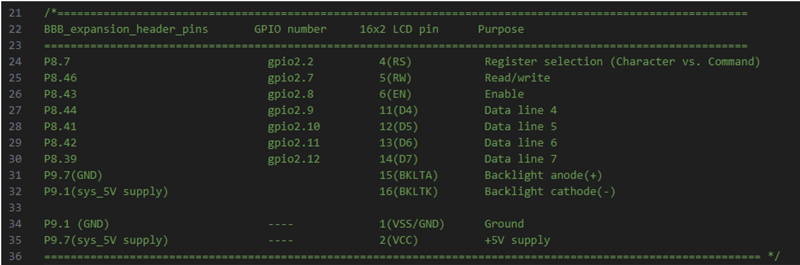   
</p>
​<p align="center">
  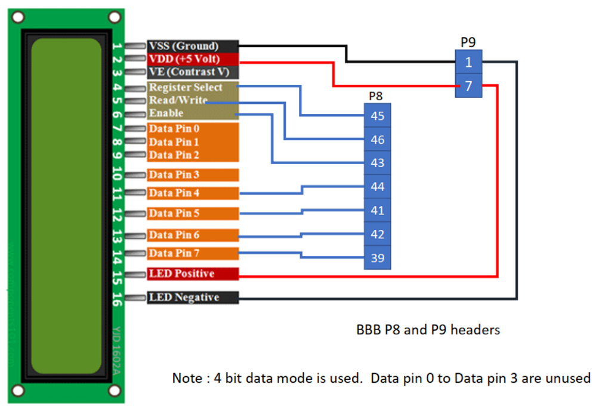   
</p>
​<p align="center">
  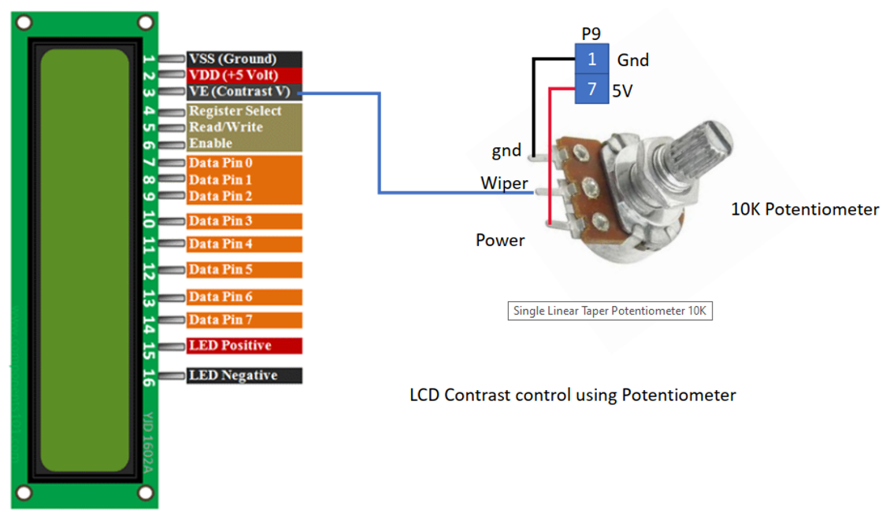   
</p>
​<p align="center">
  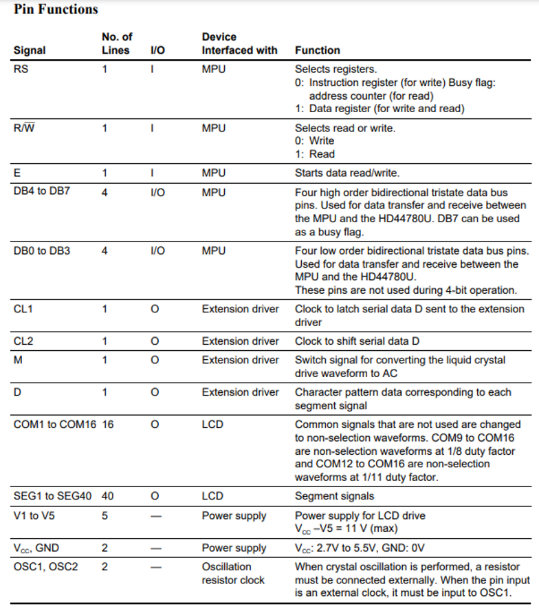   
</p>

+ RS: Khi chân này là 0 thì LCD biết là ta đang cố gắng gửi 1 lệnh đến LCD, còn là 1 thì người dung đang cố gắng gửi 1 byte dữ liệu  ( lệnh thì 0 data thì 1)
+ Read/write thì ta chỉ write thôi, nên luôn đưa về 0
+ Enable: Start data read/write, cho lên cao xuống thấp
+ Sử dụng ở chế độ 4 bít ( pin 4 - 7)
+ 2 chân cuối là điều khiển đèn nền, 1 cái là âm, 1 cái là dương

​<p align="center">
     
</p>
​<p align="center">
  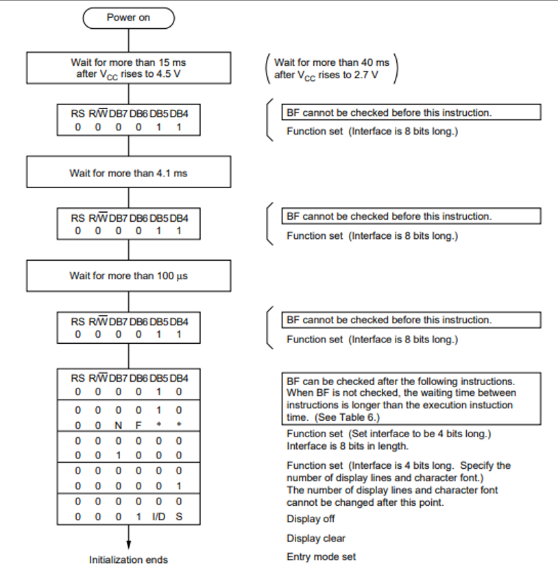   
</p>

***Sending a command**
1. Create the command code
2. Make RS pin low
3. Make RnW pin low
4. First send higher nibble(4-bits) of the command code to data lines
5. Make LCD enable pin high to low ( when LCD detects high to low transition on enable pin it reads the data from the data lines )
6. Next send the lower nibble of the command code to data lines
7. Make LCD enable pin high to low ( when LCD detects high to low transition on enable pin it reads the data from the data lines )
8. Wait for the instruction execution time before sending the next command or confirm the LCD is not busy by reading the busy flag status on D7 pin.

***Sending a data byte***
1. Make RS high
2. Make RnW low
3. First send higher nibble of the data to data lines
4. Make LCD enable pin high to low (when LCD detects high to low transition on enable pin it reads the data from the data lines)
5. Next send the lower nibble of the data to data lines
6. Make LCD enable pin high to low (when LCD detects high to low transition on enable pin it reads the data from the data lines) 

​<p align="center">
  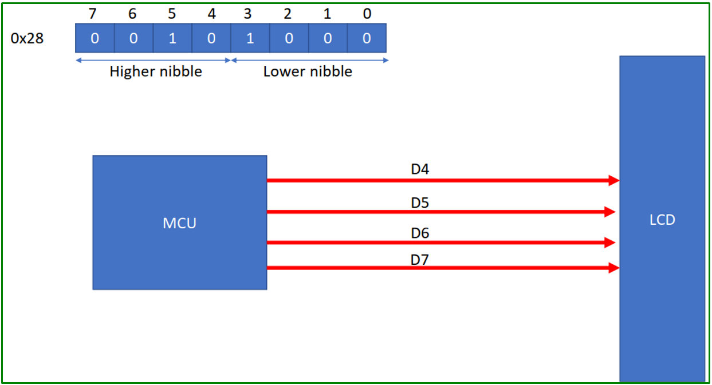   
</p>
​<p align="center">
  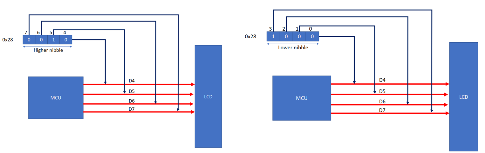   
</p>
​<p align="center">
  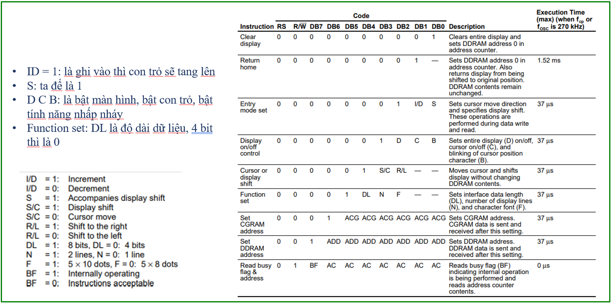   
</p>

***Step***
1. Connect LCD to BBB
2. Add required gpio entries to the gpio-sysfs device tree node
3. Recompile the dts file and make BBB boots with modified dtb
4. Load the gpio-sysfs driver
5. Make sure that all required gpio devices are formed under
/sys/class/bone_gpios
6. lcd_app.c, lcd.c, gpio.c
7. Cross compile the lcd application and test it on the target

+ Để lấy được pin như hình ta vào:
	+ Kernel/include/dt-bindings/pinctrl/am33xx.h

​<p align="center">
  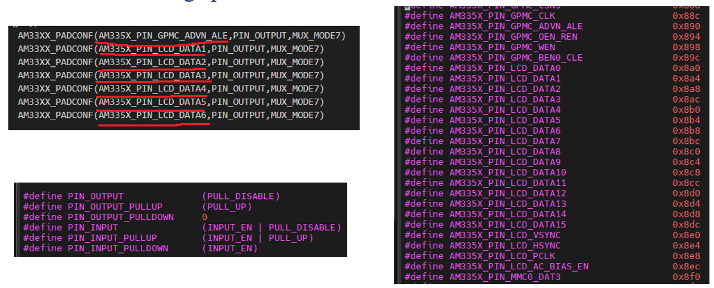   
</p>

​<p align="center">
  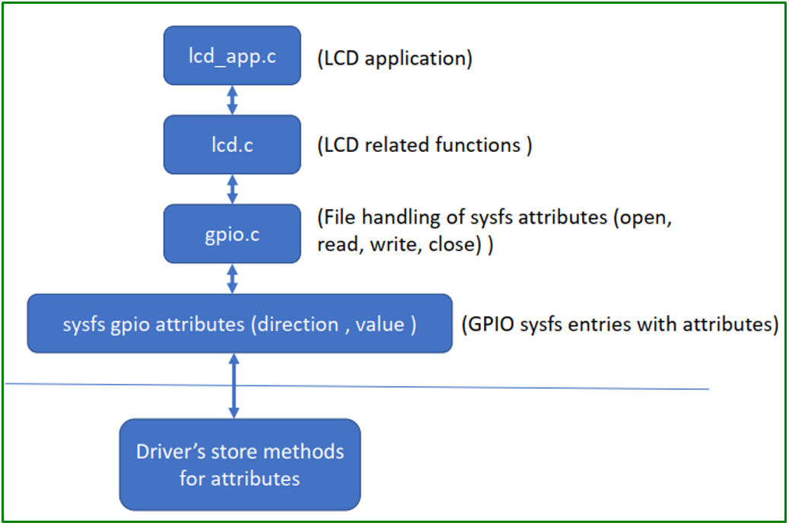   
</p>

***Luồng code***
+ Đầu tiên chạy gpio-sysfs.ko khi này trong sysfs sẽ có các chân tương ứng mà từ device tree đã khai báo

***Step***
```bash
02_lcd_platform_driver
Cd /sys/class/lcd/LCD16x2
Echo 0x2 > lcdcmd
Echo –n “Hello ThoNV” > lcdtext
Echo 21 > lcdxy
Echo –n “12345” > lcdtext
Echo “on” lcdscroll     : bấm cái này liên tục nhiều lần nó sẽ dịch cho mình
Echo 0x2 > lcdcmd
```


### 2️⃣ Thực hành
+ File hula.dtsi
```xml

/ {
	pcdev1: pcdev-1 {
		compatible = "pcdev-E1x","pcdev-A1x";
		org,size = <512>;
		org,device-serial-num = "PCDEV1ABC123";
		org,perm = <0x11>;
	};
	
	pcdev2: pcdev-2 {
		compatible = "pcdev-B1x";
		org,size = <1024>;
		org,device-serial-num = "PCDEV2ABC456";
		org,perm = <0x11>;
	};

	pcdev3: pcdev-3 {
		compatible = "pcdev-C1x";
		org,size = <256>;
		org,device-serial-num = "PCDEV3ABC789";
		org,perm = <0x11>;
	};
	
	pcdev4: pcdev-4 {
		compatible = "pcdev-D1x";
		org,size = <2048>;
		org,device-serial-num = "PCDEV4ABC000";
		org,perm = <0x11>;
	};

       bone_gpio_devs {
	  
		 compatible = "org,bone-gpio-sysfs";
		 pinctrl-single,names = "default";
		 pinctrl-0 = <&p8_gpios>;
		 status = "disabled";
		
			gpio1 {
				label = "gpio2.2";
				bone-gpios = <&gpio2 2 GPIO_ACTIVE_HIGH>;
					
			};

			gpio2 {
				label = "gpio2.7";
				bone-gpios = <&gpio2 7 GPIO_ACTIVE_HIGH>;
			};
			
			gpio3 {
				label = "gpio2.8";
				bone-gpios = <&gpio2 8 GPIO_ACTIVE_HIGH>;
			};
			
			gpio4 {
				label = "gpio2.9";
				bone-gpios = <&gpio2 9 GPIO_ACTIVE_HIGH>;
			};

			gpio5{
				label = "gpio2.10";
				bone-gpios = <&gpio2 10 GPIO_ACTIVE_HIGH>;
			};

			gpio6{
				label = "gpio2.11";
				bone-gpios = <&gpio2 11 GPIO_ACTIVE_HIGH>;
			};

			gpio7{
				label = "gpio2.12";
				bone-gpios = <&gpio2 12 GPIO_ACTIVE_HIGH>;
			};

			led1 {
				label = "usrled1:gpio1.22";
				bone-gpios = <&gpio1 22 GPIO_ACTIVE_HIGH>;
			};

			led2 {
				label = "usrled2:gpio1.23";
				bone-gpios = <&gpio1 23 GPIO_ACTIVE_HIGH>;
			};

		};//bone_gpio_devs


        lcd16x2 {
                compatible = "org,lcd16x2";
                pictrl-names = "default";
                pinctrl-0 = <&p8_gpios>;
                status = "okay";
                rs-gpios = <&gpio2 2  GPIO_ACTIVE_HIGH>;
                rw-gpios = <&gpio2 7  GPIO_ACTIVE_HIGH>;
                en-gpios = <&gpio2 8  GPIO_ACTIVE_HIGH>;
                d4-gpios = <&gpio2 9  GPIO_ACTIVE_HIGH>;
                d5-gpios = <&gpio2 10  GPIO_ACTIVE_HIGH>;
                d6-gpios = <&gpio2 11  GPIO_ACTIVE_HIGH>;
                d7-gpios = <&gpio2 12  GPIO_ACTIVE_HIGH>;
        };


}; //root node

&tda19988 {
	status = "disabled";
};

&am33xx_pinmux {
	
	p8_gpios: bone_p8_gpios {
		pinctrl-single,pins = < 
			AM33XX_PADCONF(AM335X_PIN_GPMC_ADVN_ALE,PIN_OUTPUT,MUX_MODE7)
			/* AM33XX_PADCONF(AM335X_PIN_LCD_DATA0,PIN_OUTPUT,MUX_MODE7) */
			AM33XX_PADCONF(AM335X_PIN_LCD_DATA1,PIN_OUTPUT,MUX_MODE7) 
			AM33XX_PADCONF(AM335X_PIN_LCD_DATA2,PIN_OUTPUT,MUX_MODE7) 
			AM33XX_PADCONF(AM335X_PIN_LCD_DATA3,PIN_OUTPUT,MUX_MODE7) 
			AM33XX_PADCONF(AM335X_PIN_LCD_DATA4,PIN_OUTPUT,MUX_MODE7) 
			AM33XX_PADCONF(AM335X_PIN_LCD_DATA5,PIN_OUTPUT,MUX_MODE7) 
			AM33XX_PADCONF(AM335X_PIN_LCD_DATA6,PIN_OUTPUT,MUX_MODE7) 
		>;

	};

};
```

+ File gpio.c
```c
/*
 ============================================================================
 Name        : gpio.c
 Version     : 1.0
 Copyright   : Your copyright notice
 Description : simple gpio file handling functions 
 
 ============================================================================
 */
 
#include<linux/gpio/consumer.h>
#include <linux/device.h>

#include "gpio.h"

#include "lcd_platform_driver.h"

extern struct lcd_private_data* get_lcd_private_data(void);

/*
 *  GPIO configure direction
 *  dir_value : 1 means 'out' , 0 means "in"
 */
int gpio_configure_dir(u8 desc_id , u8 dir_value, struct device *dev)
{
	int status;


	struct lcd_private_data *lcd_data = dev_get_drvdata(dev);

	if (dir_value)
		status = gpiod_direction_output(lcd_data->desc[desc_id],0);
	else
		status = gpiod_direction_input(lcd_data->desc[desc_id]);
	
	return status;
    

}

/*
 *  GPIO write value
 *  out_value : can be either 0 or 1
 */
int gpio_write_value(u8 desc_id, u8 out_value,struct device *dev)
{
	struct lcd_private_data *lcd_data = dev_get_drvdata(dev);

        gpiod_set_value(lcd_data->desc[desc_id],out_value);
	return 0;
}
```

+ File gpio.h
```h


#ifndef GPIO_LCD_H
#define GPIO_LCD_H

#include<linux/types.h>

#define HIGH_VALUE          1
#define LOW_VALUE           0

#define GPIO_DIR_OUT        HIGH_VALUE
#define GPIO_DIR_IN         LOW_VALUE

#define GPIO_LOW_VALUE      LOW_VALUE
#define GPIO_HIGH_VALUE     HIGH_VALUE


int gpio_configure_dir(u8 desc_id , u8 dir_value,struct device *dev);
int gpio_write_value(u8 desc_id, u8 out_value,struct device *dev);

#endif 
```

+ File lcd_platform_driver.c
```c
#include <linux/module.h>
#include <linux/kernel.h>
#include <linux/platform_device.h>
#include <linux/string.h>
#include <linux/fs.h>
#include <asm/uaccess.h>
#include <linux/init.h>
#include <linux/device.h>
#include <linux/io.h>
#include <linux/gpio.h>
#include <linux/gpio/driver.h>
#include<linux/gpio/consumer.h>

#include <linux/of.h>
#include <linux/of_device.h>
#include <linux/delay.h>
#undef pr_fmt
#define pr_fmt(fmt) "%s : " fmt,__func__

#include "lcd_platform_driver.h"
#include "lcd.h"

MODULE_LICENSE("GPL");
MODULE_DESCRIPTION("platform driver for 16x2 LCD");


struct lcddrv_private_data drv_data;

struct lcd_private_data lcd_data = { .lcd_scroll = 0 , .lcdxy = "(1,1)" };

static ssize_t lcdcmd_store(struct device *dev,
		struct device_attribute *attr, const char *buf, size_t size)
{
	long value;
	int status;
	status = kstrtol(buf, 0, &value);
	if(!status)
		lcd_send_command((u8)value,dev);
	return status ? : size;
}

static DEVICE_ATTR_WO(lcdcmd);

static ssize_t lcdtext_store(struct device *dev,struct device_attribute *attr,\
	       						const char *buf, size_t size)
{
	if(buf){
		dev_info(dev,"lcdtext: %s\n",buf);
		lcd_print_string((char*)buf,dev);
	}
	else
		return -EINVAL;

	return size;

}

static DEVICE_ATTR_WO(lcdtext);

static ssize_t lcdscroll_show(struct device *dev, struct device_attribute *attr, char *buf)
{
	int ret;
	struct lcd_private_data *dev_data = dev_get_drvdata(dev);

	if(dev_data->lcd_scroll)
		ret = sprintf(buf, "%s\n", "on");
	else
		ret = sprintf(buf, "%s\n", "off");

	return ret;
}


static ssize_t lcdscroll_store(struct device *dev,struct device_attribute *attr,\
	       					const char *buf, size_t size)
{
	int status = 0;
	struct lcd_private_data *dev_data = dev_get_drvdata(dev);
	
	if (sysfs_streq(buf, "on")){
		dev_data->lcd_scroll = 1;
		/*Display shift left */
		lcd_send_command(0x18,dev);
	}
	else if (sysfs_streq(buf, "off")){
		dev_data->lcd_scroll = 0;
		/*return home */
		lcd_send_command(0x2,dev);
		/*Turn off display shift */
		lcd_send_command(0x10,dev);
	}
	else
		status = -EINVAL;
	
	return status ? : size;
}	

static DEVICE_ATTR_RW(lcdscroll);


static ssize_t lcdxy_show(struct device *dev, struct device_attribute *attr, char *buf)
{
	int status;
	struct lcd_private_data *dev_data = dev_get_drvdata(dev);
	
	status = sprintf(buf,"%s\n",dev_data->lcdxy);
	return status;
}


static ssize_t lcdxy_store(struct device *dev,struct device_attribute *attr, const char *buf, size_t size)
{
	long value;
	int status;
	int x, y;
	struct lcd_private_data *dev_data = dev_get_drvdata(dev);
	
	status = kstrtol(buf,10,&value);
	if(status)
		return status;
	x = value /10;
	y = value % 10;
	status = sprintf(dev_data->lcdxy ,"(%d,%d)",x,y);
	lcd_set_cursor(x,y,dev);
	return status;

}

static DEVICE_ATTR_RW(lcdxy);


static struct attribute *lcd_attrs[] = {
	&dev_attr_lcdcmd.attr,
	&dev_attr_lcdtext.attr,
	&dev_attr_lcdscroll.attr,
	&dev_attr_lcdxy.attr,
	NULL
};

struct attribute_group lcd_attr_group = {
	.attrs = lcd_attrs
};


static const struct attribute_group *lcd_attr_groups[] = {
	&lcd_attr_group,
	NULL
};


int device_create_files(struct device *dev, struct lcd_private_data *lcd_data)
{
	lcd_data->dev = device_create_with_groups(drv_data.class_lcd,dev,0,\
			lcd_data,lcd_attr_groups,"LCD16x2");
	if (IS_ERR(lcd_data->dev)) {
		dev_err(dev,"Error while creating class entry \n");
		return PTR_ERR(lcd_data->dev);
	}

	return 0;
}

int lcd_remove(struct platform_device *pdev)
{

	struct lcd_private_data *lcd_data = dev_get_drvdata(&pdev->dev);

	lcd_deinit(&pdev->dev);
	
	dev_info(&pdev->dev,"remove called\n");
	
	device_unregister(lcd_data->dev);
	
	return 0;
}


struct lcd_private_data* get_lcd_private_data(void)
{
	return &lcd_data;

}

int lcd_probe(struct platform_device *pdev)
{
	int  ret;
	struct device *dev = &pdev->dev;


	dev_set_drvdata(dev,&lcd_data);

	lcd_data.desc[LCD_RS] = gpiod_get(dev, "rs", GPIOD_OUT_LOW);
	lcd_data.desc[LCD_RW] = gpiod_get(dev, "rw", GPIOD_OUT_LOW);
	lcd_data.desc[LCD_EN] = gpiod_get(dev, "en", GPIOD_OUT_LOW);
	lcd_data.desc[LCD_D4] = gpiod_get(dev, "d4", GPIOD_OUT_LOW);
	lcd_data.desc[LCD_D5] = gpiod_get(dev, "d5", GPIOD_OUT_LOW);
	lcd_data.desc[LCD_D6] = gpiod_get(dev, "d6", GPIOD_OUT_LOW);
	lcd_data.desc[LCD_D7] = gpiod_get(dev, "d7", GPIOD_OUT_LOW);

	if(IS_ERR(lcd_data.desc[LCD_RS]) || \
			IS_ERR(lcd_data.desc[LCD_RW]) || \
			IS_ERR(lcd_data.desc[LCD_EN]) || \
			IS_ERR(lcd_data.desc[LCD_D4]) || \
			IS_ERR(lcd_data.desc[LCD_D5]) || \
			IS_ERR(lcd_data.desc[LCD_D6]) || \
			IS_ERR(lcd_data.desc[LCD_D7])  )
	{
		dev_err(dev,"Gpio error\n");
		return -EINVAL;
	}

	ret = lcd_init(dev);

	if(ret){
		dev_err(dev,"LCD, init failed \n");
		return ret;
	}

	dev_info(dev,"LCD init successful\n");

	ret = device_create_files(dev,&lcd_data);
	if(ret){
		dev_err(dev,"LCD sysfs dev create failed\n");
		return ret;
	}


	lcd_print_string("16x2 LCD Driver demo",dev);

	dev_info(dev,"probe successful\n");

	return 0;

}


struct of_device_id lcd_device_match[] = {
        { .compatible = "org,lcd16x2"},
        { }
};

struct platform_driver lcdsysfs_platform_driver = 
{
	.probe = lcd_probe,
	.remove = lcd_remove,
	.driver = {
		.name = "lcd-sysfs",
		.of_match_table = of_match_ptr(lcd_device_match)
	}

};

int __init lcd_sysfs_init(void)
{
	drv_data.class_lcd = class_create(THIS_MODULE,"lcd");
	platform_driver_register(&lcdsysfs_platform_driver);
	pr_info("module load success\n");
	return 0;

}


void __exit lcd_sysfs_exit(void)
{
	platform_driver_unregister(&lcdsysfs_platform_driver);
	class_destroy(drv_data.class_lcd);
}


module_init(lcd_sysfs_init);
module_exit(lcd_sysfs_exit);
```

+ File lcd_platform_driver.h
```h

#ifndef LCD_PLAT_DRIVER_H
#define LCD_PLAT_DRIVER_H

#define LCD_LINES (4+1+1+1)

enum {LCD_RS,LCD_RW,LCD_EN,LCD_D4,LCD_D5,LCD_D6,LCD_D7};

/*Device private data structure */
struct lcd_private_data
{
        int lcd_scroll;
        char lcdxy[8]; /*(16,16) */
 	struct device *dev;
        struct gpio_desc *desc[LCD_LINES];
};


/*Driver private data structure */
struct lcddrv_private_data
{
       struct class *class_lcd;
};

#endif 
```

+ File lcd.c
```c

#include <linux/delay.h>
#include "lcd_platform_driver.h"
#include "lcd.h"
#include "gpio.h"

static void write_4_bits(uint8_t data,struct device *dev);


void lcd_deinit(struct device *dev)
{
	lcd_display_clear(dev);      	  /* Clear display */
	lcd_display_return_home(dev);        /* Cursor at home position */
}


/* This function does basic initialization for your lcd  */
int lcd_init(struct device *dev)
{

	gpio_configure_dir(LCD_RS,GPIO_DIR_OUT,dev);
	gpio_configure_dir(LCD_RW,GPIO_DIR_OUT,dev);
	gpio_configure_dir(LCD_EN,GPIO_DIR_OUT,dev);
	gpio_configure_dir(LCD_D4,GPIO_DIR_OUT,dev);
	gpio_configure_dir(LCD_D5,GPIO_DIR_OUT,dev);
	gpio_configure_dir(LCD_D6,GPIO_DIR_OUT,dev);
	gpio_configure_dir(LCD_D7,GPIO_DIR_OUT,dev);

	gpio_write_value(LCD_RS,GPIO_LOW_VALUE,dev);
	gpio_write_value(LCD_EN,GPIO_LOW_VALUE,dev);

	gpio_write_value(LCD_D4,GPIO_LOW_VALUE,dev);
	gpio_write_value(LCD_D5,GPIO_LOW_VALUE,dev);
	gpio_write_value(LCD_D6,GPIO_LOW_VALUE,dev);
	gpio_write_value(LCD_D7,GPIO_LOW_VALUE,dev);

	mdelay(40);
	
	/* RS=0 for LCD command */
	gpio_write_value(LCD_RS,LOW_VALUE,dev);
	
	/*R/nW = 0, for write */
	gpio_write_value(LCD_RW,LOW_VALUE,dev);
	
	write_4_bits(0x03,dev);
	mdelay(5);
	
	write_4_bits(0x03,dev);
	udelay(150);
	
	write_4_bits(0x03,dev);
	write_4_bits(0x02,dev);

    /*4 bit data mode, 2 lines selection , font size 5x8 */
	lcd_send_command(LCD_CMD_4DL_2N_5X8F,dev);
	
	/* Display ON, Cursor ON */
	lcd_send_command(LCD_CMD_DON_CURON,dev);
	
	lcd_display_clear(dev);
	
	/*Address auto increment*/
	lcd_send_command(LCD_CMD_INCADD,dev);

	return 0;

}

/*Clear the display */
void lcd_display_clear(struct device *dev)
{
	lcd_send_command(LCD_CMD_DIS_CLEAR,dev);
	/*
	 * check page number 24 of datasheet.
	 * display clear command execution wait time is around 2ms
	 */
	mdelay(2);
}

/*Cursor returns to home position */
void lcd_display_return_home(struct device *dev)
{

	lcd_send_command(LCD_CMD_DIS_RETURN_HOME,dev);
	/*
	 * check page number 24 of datasheet.
	 * return home command execution wait time is around 2ms
	 */
	mdelay(2);
}


/**
  * @brief  Set Lcd to a specified location given by row and column information
  * @param  Row Number (1 to 2)
  * @param  Column Number (1 to 16) Assuming a 2 X 16 characters display
  */
void lcd_set_cursor(u8 row, u8 column,struct device *dev)
{
  column--;
  switch (row)
  {
    case 1:
      /* Set cursor to 1st row address and add index*/
      lcd_send_command((column |= DDRAM_FIRST_LINE_BASE_ADDR),dev);
      break;
    case 2:
      /* Set cursor to 2nd row address and add index*/
        lcd_send_command((column |= DDRAM_SECOND_LINE_BASE_ADDR),dev);
      break;
    default:
      break;
  }
}

/*
 * @brief call this function to make LCD latch the data lines in to its internal registers.
 */
void lcd_enable(struct device *dev)
{ 
	gpio_write_value(LCD_EN,LOW_VALUE,dev);
	udelay(10);
	gpio_write_value(LCD_EN,HIGH_VALUE,dev);
	udelay(10);
	gpio_write_value(LCD_EN,LOW_VALUE,dev);
	udelay(100); /* execution time > 37 micro seconds */
}


/*
 *This function sends a character to the LCD 
 *Here we used 4 bit parallel data transmission. 
 *First higher nibble of the data will be sent on to the data lines D4,D5,D6,D7
 *Then lower niblle of the data will be set on to the data lines D4,D5,D6,D7
 */
void lcd_print_char(uint8_t data, struct device *dev)
{

	//RS=1, for user data
	gpio_write_value(LCD_RS,HIGH_VALUE,dev);
	
	/*R/nW = 0, for write */
	gpio_write_value(LCD_RW,LOW_VALUE,dev);
	
	write_4_bits((data >> 4),dev); /* higher nibble */
	write_4_bits(data,dev);      /* lower nibble */
}

void lcd_print_string(char *message,struct device *dev)
{

      do
      {
          lcd_print_char((u8)*message++,dev);
      }
      while (*message != '\0');

}


/*
 *This function sends a command to the LCD 
 */
void lcd_send_command(uint8_t command,struct device *dev)
{
	/* RS=0 for LCD command */
	gpio_write_value(LCD_RS,LOW_VALUE,dev);
	
	/*R/nW = 0, for write */
	gpio_write_value(LCD_RW,LOW_VALUE,dev);
	
	write_4_bits((command >> 4),dev); /* higher nibble */
	write_4_bits(command,dev);     /* lower nibble */

}

/* writes 4 bits of data/command on to D4,D5,D6,D7 lines */
static void write_4_bits(uint8_t data,struct device *dev)
{
	/* 4 bits parallel data write */
	gpio_write_value(LCD_D4, ((data >> 0 ) & 0x1),dev);
	gpio_write_value(LCD_D5, ((data >> 1 ) & 0x1),dev);
	gpio_write_value(LCD_D6, ((data >> 2 ) & 0x1),dev);
	gpio_write_value(LCD_D7, ((data >> 3 ) & 0x1),dev);
	
	lcd_enable(dev);
	
}
```

+ File lcd.h
```h


#ifndef LCD_DRIVER_H_
#define LCD_DRIVER_H_

#include<linux/types.h>

/*LCD commands */
#define LCD_CMD_4DL_2N_5X8F  		0x28
#define LCD_CMD_DON_CURON    		0x0E
#define LCD_CMD_INCADD       		0x06
#define LCD_CMD_DIS_CLEAR    		0X01
#define LCD_CMD_DIS_RETURN_HOME  	0x02


/*Sets CGRAM address. CGRAM data is sent and received after this setting. */
#define LCD_CMD_SET_CGRAM_ADDRESS  			0x40

/* Sets DDRAM address. DDRAM data is sent and received after this setting. */
#define LCD_CMD_SET_DDRAM_ADDRESS  			0x80

#define DDRAM_SECOND_LINE_BASE_ADDR         	(LCD_CMD_SET_DDRAM_ADDRESS | 0x40 )
#define DDRAM_FIRST_LINE_BASE_ADDR          	LCD_CMD_SET_DDRAM_ADDRESS


#define LCD_ENABLE 1
#define LCD_DISABLE 0


//public function prototypes
void lcd_deinit(struct device *dev);
void lcd_display_clear(struct device *dev);
void lcd_display_return_home(struct device *dev);
int lcd_init(struct device *dev);
void lcd_set_cursor(u8 row, u8 column,struct device *dev);
void lcd_enable(struct device *dev);
void lcd_print_char(u8 ascii_Value,struct device *dev);
void lcd_print_string(char *message,struct device *dev);
void lcd_send_command(u8 command,struct device *dev);
#endif
```

+ File Makefile
```Makefile
obj-m := bonelcd.o
bonelcd-objs += lcd_platform_driver.o lcd.o gpio.o
ARCH=arm
CROSS_COMPILE=arm-linux-gnueabihf-
KERN_DIR =/home/thonv12/workspace/ldd/source/linux_bbb_5.4/
HOST_KERN_DIR = /lib/modules/$(shell uname -r)/build/

all:
	make ARCH=$(ARCH) CROSS_COMPILE=$(CROSS_COMPILE) -C $(KERN_DIR) M=$(PWD) modules
clean:
	make ARCH=$(ARCH) CROSS_COMPILE=$(CROSS_COMPILE) -C $(KERN_DIR) M=$(PWD) clean
help:
	make ARCH=$(ARCH) CROSS_COMPILE=$(CROSS_COMPILE) -C $(KERN_DIR) M=$(PWD) help
host:
	make -C $(HOST_KERN_DIR) M=$(PWD) modules
```

## ✔️ Conclusion
+ Các bài gần đây mình đang còn để là board bbb nhé, mình sẽ update sang imx8mm ở 1 thời gian tới nhé


## 💯 Exercise
+ Thực hành theo bài viết


## 📺 NOTE
+ N/A

## 📌 Reference

[1] https://www.cs.columbia.edu/~sedwards/classes/2014/4840/device-drivers.pdf

[2] https://static.lwn.net/images/pdf/LDD3/ch14.pdf

[3] https://www.kernel.org/doc/Documentation/driver-model/

[4] https://bootlin.com/pub/conferences/2013/elce/petazzoni-device-tree-dummies/petazzoni-device-tree-dummies.pdf
