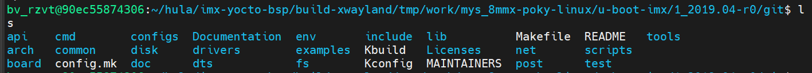
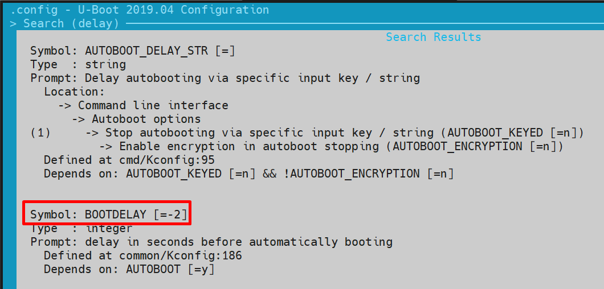
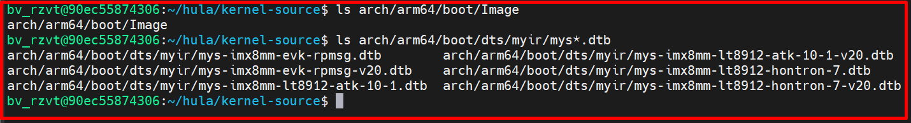
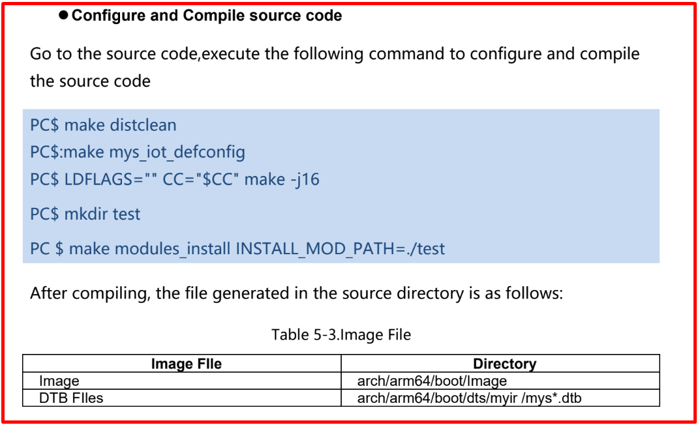
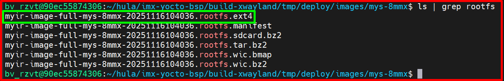
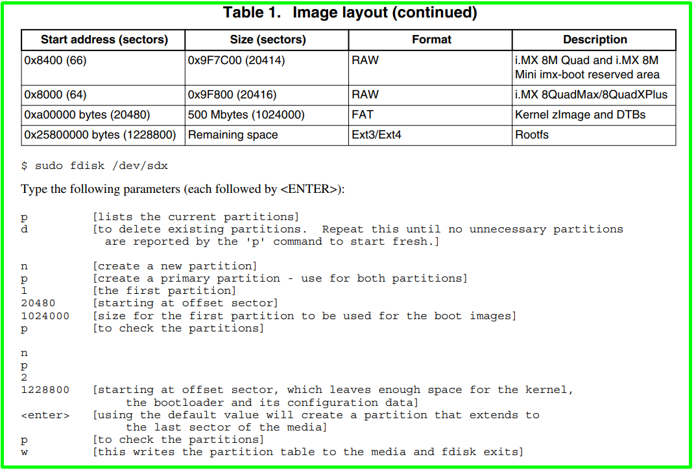

# 💚 Pin Control 💛

## 👉 Introduction and Summary

### 1️⃣ Introduction

+ Ở bài trước chúng ta đã thực hành về Pin Control. Nếu các bạn chưa đọc thì xem link này nha [046_PinControl_Practice.md](../046_PinControl_Practice/046_PinControl_Practice.md). Ở bài này chúng ta sẽ build mỗi thành phần và lấy ra từ yocto nhé.

### 2️⃣ Summary

Nội dung của bài viết gồm có những phần sau nhé 📢📢📢:
- [I. Introduction and Summary](#👉-introduction-and-summary)

    - [1. Introduction](#1️⃣-introduction)
    - [2. Summary](#2️⃣-summary)
- [II. Contents](#👉-contents)
    - [1. Uboot](#1️⃣-uboot)
    - [2. Kernel](#2️⃣-kernel)
    - [3. Rootfs](#3️⃣-rootfs)
    - [4. Toolchain](#4️⃣-toolchain)
    - [5. Copy to sd card](#5️⃣-copy-to-sd-card)
- [III. Conclusion](#✔️-conclusion)
- [IV. Exercise](#💯-exercise)
- [V. NOTE](#📺-note)
- [VI. Reference](#📌-reference)

## 👉 Contents

### 1️⃣ Uboot
+ Ta đi tạo folder toolchain và chạy file .sh để có được môi trường, follow bên dưới
```bash
$ mkdir toolchain
$ tree -L 1 .
$ sudo chmod 0777 fsl-imx-xwayland-glibc-x86_64-meta-toolchain-aarch64-mys-8mmx-toolchain-5.4-zeus.sh
$ ./fsl-imx-xwayland-glibc-x86_64-meta-toolchain-aarch64-mys-8mmx-toolchain-5.4-zeus.sh
Nhập ./toolchain sau đó bấm Y
$ source ./toolchain/environment-setup-aarch64-poky-linux
```

+ Uboot sau khi được fetch từ git về thì sẽ nằm ở dưới, mình đã copy ra [Uboot-imx](./u-boot.tar)
```bash
$ cd /home/bv_rzvt/hula/imx-yocto-bsp/build-xwayland/tmp/work/mys_8mmx-poky-linux/u-boot-imx/1_2019.04-r0/git
```

​<p align="center">
     
</p>

+ Khi ta dùng file .wic để dd vào thẻ nhớ và chạy thì sẽ không vào được uboot do BOOTDELAY đang để bằng -2. Muốn vào được uboot ta phải sửa lại biến này = 5

​<p align="center">
     
</p>


+ Ở trong uboot-imx/configs, ta sẽ thấy có nhiều file *_deconfig, mà mỗi file đó sẽ là config uboot cho 1 board. Ở đây board của ta sẽ là imx8mm_ddr4_evk_defconfig
```bash
$ cd /home/bv_rzvt/hula/imx-yocto-bsp/build-xwayland/tmp/work/mys_8mmx-poky-linux/u-boot-imx/1_2019.04-r0/git
$ make clean
$ make imx8mm_ddr4_evk_defconfig
$ make menuconfig, Set delay 5s
$ make -j16
```

+ Build by yocto

```bash
$ DISTRO=fsl-imx-xwayland MACHINE=mys-8mmx source sources/meta-myir/tools/myir-setup-release.sh -b build-xwayland
$ bitbake -c cleansstate u-boot
$ bitbake -c cleanstate imx-boot
$ bitbake imx-boot
```

+ Sau đó vào /tmp/deploy/images/mys-imx8mm để lấy imx-boot

```bash
$ sudo dd if=imx-boot of=/dev/sdd bs=1k seek=33
```

### 2️⃣ Kernel
+ Sau khi build xong yocto ta sẽ có được kernel và nó nằm ở vị trí sau
```bash
$ cd /home/bv_rzvt/hula/imx-yocto-bsp/build-xwayland/tmp/work-shared/mys-8mmx/kernel-source
```

+ Đầu tiên chúng ta sẽ phải chạy file .sh để có được toolchain đã nhé. Sau đó chúng ta sẽ source toolchain
```bash
$ source toolchain/environment-setup-aarch64-poky-linux
```

+ Sau đó chúng ta copy kernel-source ra 1 nơi nào đó rồi thực hiện trong folder copy này, làm theo các bước bên dưới

```bash
$ cd /home/bv_rzvt/hula/imx-yocto-bsp/build-xwayland/tmp/work-shared/mys-8mmx/kernel-source
$ cp -r kernel-source ~/hula
$ cd ~/hula/kernel-source
$ make distclean
$ make mys_iot_defconfig
$ LDFLAGS="" CC="$CC" make -j16
```

+ Sau khi build xong ta sẽ có được Image và device tree
```bash
$ ls arch/arm64/boot/Image
$ ls arch/arm64/boot/dts/myir/mys*.dtb
```

​<p align="center">
     
</p>

​<p align="center">
     
</p>


***Build kernel by yocto***

```bash
$ DISTRO=fsl-imx-xwayland MACHINE=mys-8mmx source sources/meta-myir/tools/myir-setup-release.sh -b build-xwayland
$ bitbake -c cleansstate virtual/kernel
$ bitbake virtual/kernel
```

+ Sau đó vào /tmp/deploy/images/mys-imx8mm để lấy Image và dtb

***Copy vào SD card***

```bash
$ cp -rf *.dtb Image /media/my-linux/boot/
$ sync
```

### 3️⃣ Rootfs
+ File rootfs là: myir-image-full-mys-8mmx-20251116104036.rootfs.ext4
```bash
$ cd /home/bv_rzvt/hula/imx-yocto-bsp/build-xwayland/tmp/deploy/images/mys-8mmx
```

​<p align="center">
     
</p>


### 4️⃣ Toolchain
+ File fsl-imx-xwayland-glibc-x86_64-meta-toolchain-aarch64-mys-8mmx-toolchain-5.4-zeus.sh

```bash
$ cd /home/bv_rzvt/hula/imx-yocto-bsp/build-xwayland/tmp/deploy/sdk
```

### 5️⃣ Copy to sd card

​<p align="center">
     
</p>

+ Chạy file [make_sdcard.sh](./make_sdcard.sh)

```bash
env default -a
saveenv
setenv bootdelay 5
setenv bootargs 'root=/dev/mmcblk1p2 rootwait'
setenv bootcmd 'fatload mmc 1:1 0x40480000 Image--5.4-r0-mys-8mmx-20251117045117.bin; fatload mmc 1:1 0x43000000 mys-imx8mm-evk-rpmsg-v20--5.4-r0-mys-8mmx-20251117045117.dtb; booti 0x40480000 - 0x43000000'
saveenv
boot
```


## ✔️ Conclusion
+ Cảm ơn các bạn đã đọc nhé


## 💯 Exercise
+ Thực hành theo bài viết


## 📺 NOTE
+ N/A

## 📌 Reference

[1] https://www.cs.columbia.edu/~sedwards/classes/2014/4840/device-drivers.pdf

[2] https://static.lwn.net/images/pdf/LDD3/ch14.pdf

[3] https://www.kernel.org/doc/Documentation/driver-model/

[4] https://bootlin.com/pub/conferences/2013/elce/petazzoni-device-tree-dummies/petazzoni-device-tree-dummies.pdf
