# 💚 Boot TFTP NFS 💛

## 👉 Introduction and Summary

### 1️⃣ Introduction

+ Ở bài trước chúng ta đã thực hành về build từng phần trong BSP. Nếu các bạn chưa đọc thì xem link này nha [047_Build_Element_BSP.md](../047_Build_Element_BSP/047_Build_Element_BSP.md). Ở bài này chúng ta sẽ tìm hiểu về boot bằng TFTP nhé, trước đây chúng ta toàn boot bằng SD card.

### 2️⃣ Summary

Nội dung của bài viết gồm có những phần sau nhé 📢📢📢:
- [I. Introduction and Summary](#👉-introduction-and-summary)

    - [1. Introduction](#1️⃣-introduction)
    - [2. Summary](#2️⃣-summary)
- [II. Contents](#👉-contents)
    - [1. Setup TFTP server](#1️⃣-setup-tftp-server)
    - [2. Setup NFS server](#2️⃣-setup-nfs-server)
    - [3. Prepare image device tree and rootfs](#3️⃣-prepare-image-device-tree-and-rootfs)
    - [4. Set static ip for host machine](#4️⃣-set-static-ip-for-host-machine)
    - [5. Uboot config](#5️⃣-uboot-config)
- [III. Conclusion](#✔️-conclusion)
- [IV. Exercise](#💯-exercise)
- [V. NOTE](#📺-note)
- [VI. Reference](#📌-reference)

## 👉 Contents

### Giới thiệu
+ Việc sử dụng thẻ nhớ và copy qua lại giữa máy host và board rất mệt và tốn thời gian. Vì vậy ta sẽ lựa chọn 1 cách khác nhanh hơn và thuận lợi hơn, đó chính là boot TFTP/NFS.
+ Đầu tiên bằng mọi cách ta phải boot được uboot trước(dùng thẻ nhớ hay emmc đều được), vì nó là thằng sẽ load kernel và device tree. Còn Kernel Image và device tree thì ta sẽ dùng tftp để truyền trực tiếp từ máy chủ tftp tới địa chỉ RAM trong board luôn. Còn với rootfs thì board sẽ dùng chung với rootfs trong NFS. Đây cũng là lý do mà ta phải copy rootfs vào NFS và giải nén ra.
+ Như vậy uboot đã có sẵn, rootfs thì dùng chung rồi. Trong quá trình làm việc có sửa đổi kernel hay devicetree thì chỉ việc bắn các file này qua board dùng tftp thôi, quá tiện lợi

***Yêu cầu***
+ Board cắm uart để debug
+ Board đã khởi động được uboot
+ Cắm dây LAN giữa board và laptop

+ Ở bài này chúng ta đang cấu hình IP tĩnh, ta có thể dùng DHCP để tự chủ động cấp phát IP nhé

​<p align="center">
  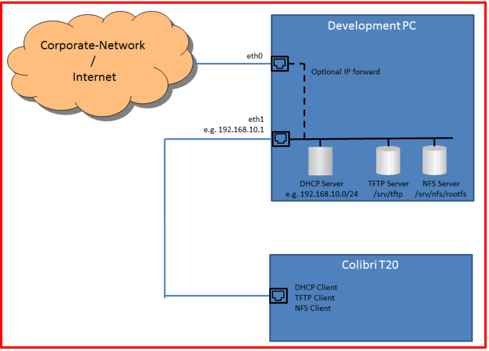   
</p>

+ Các tool yêu cầu
  + VitualBox: https://www.wikihow.com/Install-Ubuntu-on-VirtualBox
  + Tera term: https://osdn.net/projects/ttssh2/releases/
  + Moba exterm: https://mobaxterm.mobatek.net/

+ Các file cho board imx8mm là :
  + Image--5.4-r0-mys-8mmx-20251117045117.bin
  + imx-boot-mys-8mmx-sd.bin-flash_ddr4_evk
  + myir-image-full-mys-8mmx-20251116104036.rootfs.ext4
  + mys-imx8mm-evk-rpmsg-v20--5.4-r0-mys-8mmx-20251117045117.dtb

### 1️⃣ Setup TFTP server
+ Link hướng dẫn download TFTP: [LINK](https://help.ubuntu.com/community/TFTP)
+ Download and install tftp-hpa by command
```bash
$ sudo apt-get install tftpd-hpa
```

​<p align="center">
  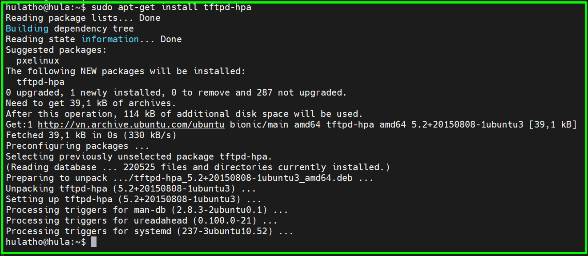   
</p>

+ Check status of tftpd-hpa by command
```bash
$ service tftpd-hpa status
```

​<p align="center">
  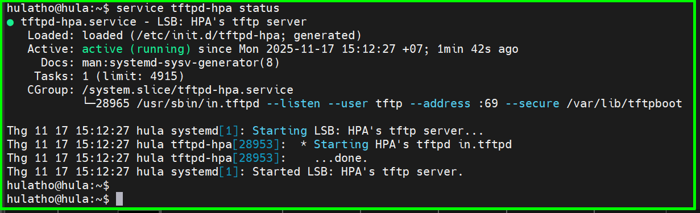   
</p>

### 2️⃣ Setup NFS server
+ NFS = Network File System
+ Link hướng dẫn [LINK](https://documentation.ubuntu.com/server/how-to/networking/install-nfs/index.html)
+ Download and install NFS server by commands
```bash
$ sudo apt-get install nfs-kernel-server
```

+ Start a NFS server

```bash
$ sudo /etc/init.d/nfs-kernel-server start
hoặc
$ sudo systemctl start nfs-kernel-server.service
```

​<p align="center">
  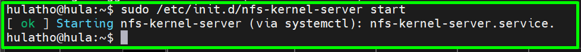   
</p>

+ Create a directory for NFS
```bash
$ sudo mkdir -p /nfs/imx8mm
```

​<p align="center">
  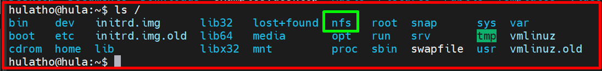   
</p>

+ Open /etc/exports by text editor
```bash
$ sudo vim /etc/exports
Sau đó thêm /nfs/imx8mm *(rw,no_subtree_check,sync,no_root_squash)
```

​<p align="center">
  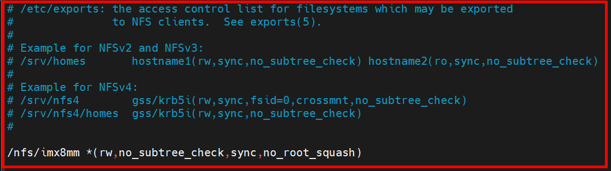   
</p>

+ Check status of nfs service
```bash
$ service nfs-kernel-server status
Hoặc
$ sudo systemctl status nfs-kernel-server.service
```

​<p align="center">
  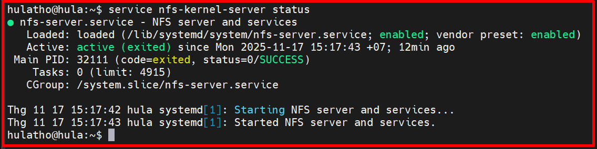   
</p>

+ Force an NFS server to read /etc/exports
```bash
$ sudo exportfs -a
```

+ Confirm the NFS server starts successfully
```bash
$ showmount -e localhost
```

​<p align="center">
  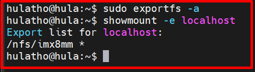   
</p>

### 3️⃣ Prepare image device tree and rootfs
+ Copy Image and device tree to /var/lib/tftpboot

```bash
$ sudo cp <Image path> <device tree path> /var/lib/tftpboot
```

+ Copy rootfs to the mount point. In this case that is located at /nfs/imx8mm

```bash
$ sudo cp <rootfs path> <mount_point>
```

+ Sau đó giải nén rootfs ra


### 4️⃣ Set static ip for host machine
+ Optinal thôi, chứ dùng luôn ip khi ta ifconfig cũng được. Mặc định trong bài này là 192.168.1.210
+ Network setting for virtual machine
    + Select **Device->Network->Network Settings**

​<p align="center">
  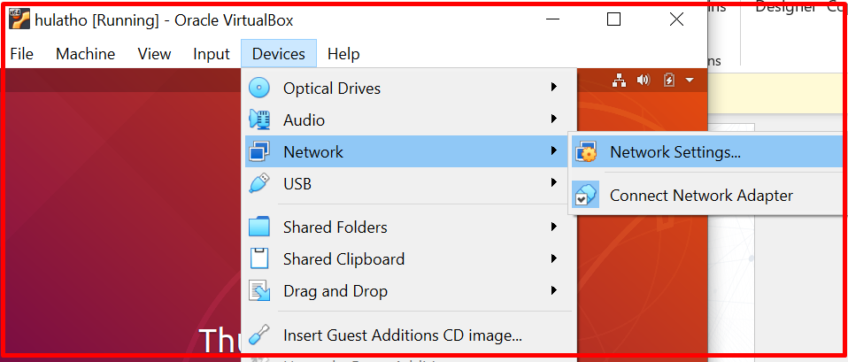   
</p>

+ Sau đó chọn **Bridged Adapter**

​<p align="center">
  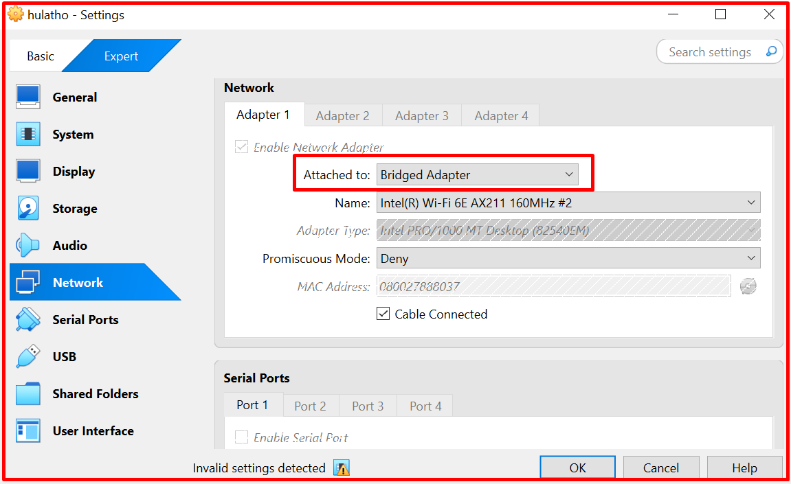   
</p>

+ Khi ta ifconfig ta sẽ thấy enp0s3. Khi này ta sẽ sét static ip cho enp0s3(Nhiều trường hợp sẽ là eth0) bằng cách edit file như bên dưới
```bash
$ sudo vim /etc/network/interfaces
: w!
: q!
```

+ Nội dung
```bash
iface enp0s3 inet static
address <IP>
netmask <netmask>

iface enp0s3 inet static
address 192.168.1.15
netmask 255.255.255.0
```

​<p align="center">
  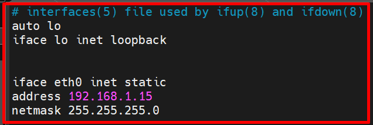   
</p>

+ Sau đó ta check network interface bằng ifconfig ta sẽ thấy đang dùng 1 ip khác

​<p align="center">
  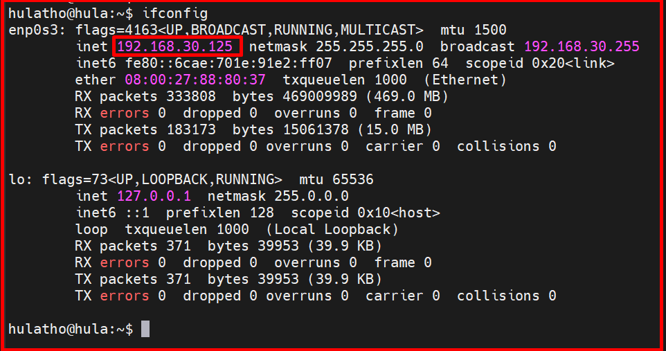   
</p>

+ Để apply new config thì ta cần reboot lại như dưới
```bash
$ sudo reboot
$ sudo ifconfig enp0s3 192.168.1.15
```

### 5️⃣ Uboot config
+ Ta mặc định máy host ubuntu có ip là **192.168.1.210** còn ip cho board ta đang muốn set là **192.168.1.100**

+ Cắm dây lan vào board, kết nối board với teraterm

+ Press any key to config Uboot

+ Reset all environment variable by command 
```bash
$ env default -a
```

+ Set MAC address
```bash
$ setenv ethaddr 74:90:50:00:00:d6
```

+ Set board ip and server ip by command
```bash
$ setenv ipaddr 192.168.1.100
$ setenv serverip 192.168.1.210
```

+ Thiết lập môi trường bootcmd để load Image và device tree lên RAM
```bash
$ setenv bootcmd "tftp 0x40480000 Image--5.4-r0-mys-8mmx-20251117045117.bin; tftp 0x43000000 mys-imx8mm-evk-rpmsg-v20--5.4-r0-mys-8mmx-20251117045117.dtb; booti 0x40480000 - 0x43000000"
```
+ Giải thích:
  + setenv bootcmd "...": Thiết lập biến môi trường bootcmd chứa chuỗi lệnh sẽ được thực thi khi khởi động.
  + tftp 0x40480000 Image: Tải file kernel có tên Image từ máy chủ TFTP về địa chỉ bộ nhớ 0x40480000
  + tftp 0x43000000 mys-imx8mm-evk-rpmsg-v20.dtb: Tải file (DTB) về địa chỉ 0x43000000
  + booti 0x40480000 - 0x43000000: Khởi động kernel ở địa chỉ 0x40480000 và sử dụng DTB ở địa chỉ 0x43000000.

+ Thiết lập biến môi trường bootargs trong U-Boot để cấu hình kernel Linux khởi động qua mạng bằng giao thức NFS
```bash
$ setenv bootargs 'ip=192.168.1.100:192.168.1.210::::eth0 rootwait root=/dev/nfs rw nfsroot=192.168.1.210:/nfs/imx8mm,nfsvers=3,tcp'
```
+ Giải thích:
  + console=ttySC0,115200n8: Kernel sẽ xuất log ra cổng UART ttySC0 với tốc độ 115200 baud, 8 bit dữ liệu, không parity.
  + ip=192.168.1.5:192.168.1.15::::eth0: IP của board là 192.168.1.5, server/gateway là 192.168.1.15, dùng interface eth0
  + rootwait: Kernel sẽ chờ cho đến khi thiết bị rootfs sẵn sàng.
  + root=/dev/nfs: Chỉ định root filesystem nằm trên NFS.
  + rw: Mount rootfs ở chế độ ghi.
  + nfsroot=192.168.1.15:/nfs/imx8mm,nfsvers=3,tcp: Máy chủ NFS là 192.168.1.15, chia sẻ thư mục /nfs/imx8mm, dùng NFS v3 qua TCP
  + noinitrd: Không sử dụng initrd
  + nohlt: Ngăn CPU vào trạng thái HLT (tiết kiệm điện), thường dùng để debug.
  + panic=1: Nếu kernel gặp lỗi nghiêm trọng, sẽ reboot sau 1 giây
  + earlyprintk=ttySC0,115200n8: Cho phép kernel in log rất sớm ra UART để dễ debug

+ Khi này:
  + Board i.MX8MM sẽ khởi động kernel qua TFTP (Image + DTB).
  + Root filesystem sẽ được mount từ máy chủ NFS (192.168.1.15:/nfs/imx8mm).

+ Trong U-Boot, khi ta đã cấu hình các biến môi trường như bootcmd hoặc bootargs, chúng chỉ tồn tại trong RAM tạm thời. Nếu ta muốn hệ thống tự động boot với cấu hình đó sau mỗi lần reset hoặc bật nguồn thì ta phải lưu lại bằng cách
```bash
$ saveenv
```
+ Lệnh này sẽ ghi toàn bộ môi trường hiện tại xuống vùng lưu trữ cố định của U-Boot. Khi khởi động lại, U-Boot sẽ đọc lại các biến này và thực thi bootcmd tự động.
+ Hãy thử boot bằng tay trước (run bootcmd) để đảm bảo kernel và rootfs hoạt động ổn định rồi mới saveenv nhé


+ Check connection by command
```bash
$ ping 192.168.1.210
```
+ Nếu return **alive** thì là ok

+ Start boot thôi
```bash
$ boot
```

​<p align="center">
  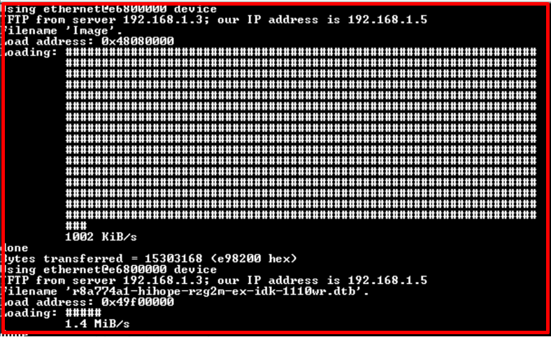   
</p>

## ✔️ Conclusion
+ Cảm ơn các bạn đã đọc nhé


## 💯 Exercise
+ Thực hành theo bài viết


## 📺 NOTE
+ N/A

## 📌 Reference

[1] https://developer.toradex.cn/linux-bsp/os-development/boot/boot-from-a-tftpnfs-server/

[2] https://www.gongkong.com/article/202312/105127.html
