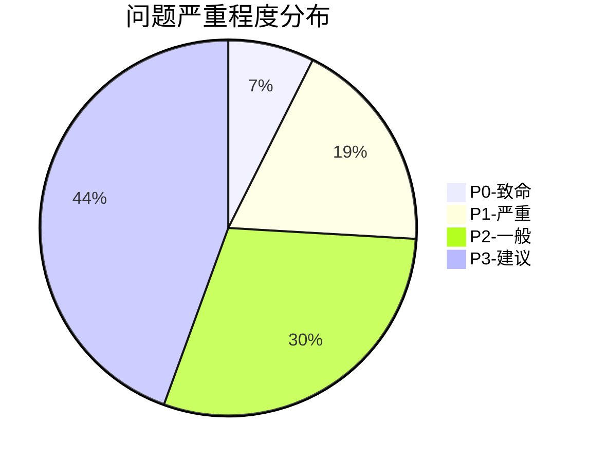
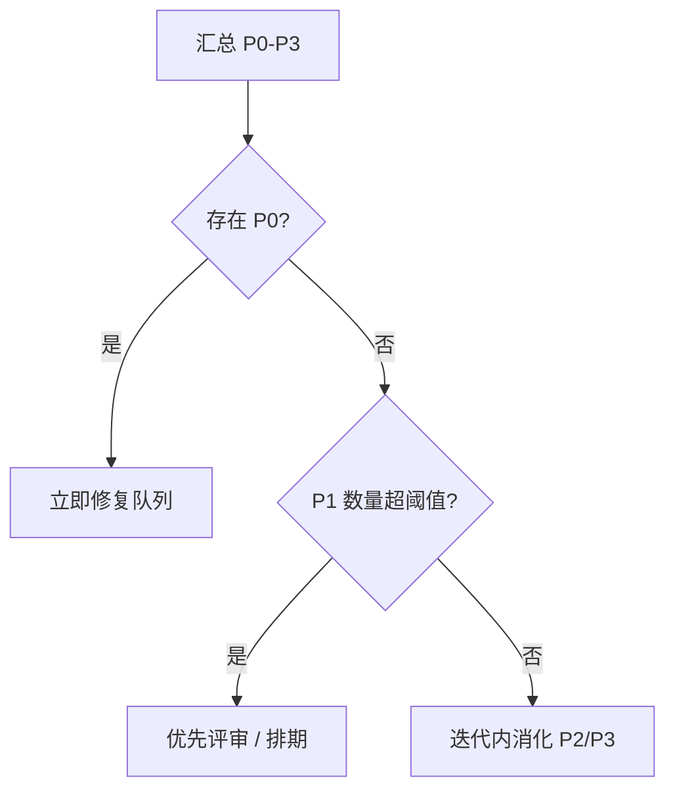

# 代码审查报告（示例骨架）

以下示例使用 **标准 Mermaid**（`pie`、`flowchart`）。实际报告中的统计数据替换成真实数值即可。

## 审查元数据

| 项 | 值 |
|----|----|
| 项目名称 | `<项目名>` |
| 审查时间 | `<ISO 时间>` |
| 审查范围 | 全量 / 增量（N 个文件） |
| 基准提交 | `<commit-hash>` |
| 审查标准 | CodeQL + SEI CERT + MISRA + CWE |
| 总问题数 | N |

## 执行摘要

### 严重程度分布（示意）



### 类别分布（表格示例）

| 类别 | 数量 |
|------|------|
| 安全 | 10 |
| 可靠性 | 8 |
| 性能 | 3 |
| 可维护性 | 6 |

### 风险评分（示例）

| 指标 | 分数 | 说明 |
|------|------|------|
| 安全评分 | 85/100 | 需关注 |
| 可靠性评分 | 78/100 | 需关注 |
| 性能评分 | 92/100 | 良好 |
| 可维护性评分 | 88/100 | 良好 |
| **总体** | **86/100** | **良好** |

### 修复优先级流程（示意）



---

## 详细问题列表示例

### P0 示例条目

#### [P0-001] 缓冲区溢出 (`cpp/buffer-overflow`)

- **文件：** `src/user_input.c`（行 42–48）
- **描述：** 使用无边界检查的 `sprintf`，超长输入可导致栈溢出。
- **代码片段：** 
```c
// ...
sprintf(buf, "%s", string_buf);
// ...
```
- **建议：** 改用 `snprintf` 并限制写入长度。
- **参考：** CWE-119、SEI CERT FIO36-C

### P1 示例条目

#### [P1-001] 空指针解引用 (`cpp/null-pointer-dereference`)

- **文件：** `src/config.c`（行 123–126）
- **描述：** `read_config_file` 可能返回 NULL，后续直接解引用。
- **代码片段：** 
```c
// ...
char *string_buf = read_config_file(name);
sprintf(buf, "%s", string_buf);
// ...
```
- **建议：** 判空并记录错误路径。

---

## `results.json` 条目示例

```json
{
  "metadata": {
    "project": "<项目名>",
    "timestamp": "<ISO8601>",
    "scope": "full"
  },
  "issues": [
    {
      "id": "P0-001",
      "severity": "P0",
      "category": "security",
      "file": "src/user_input.c",
      "line_start": 42,
      "line_end": 48,
      "rule_id": "cpp/buffer-overflow",
      "title": "缓冲区溢出",
      "confidence": "high",
      "cwe": "CWE-119"
    }
  ],
  "summary": {
    "total": 27,
    "by_severity": { "P0": 2, "P1": 5, "P2": 8, "P3": 12 }
  }
}
```

---

**报告生成时间：** `<时间戳>`  
**报告版本：** `1.0`
